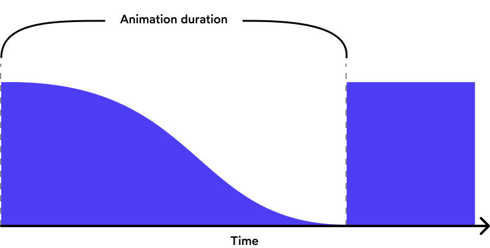
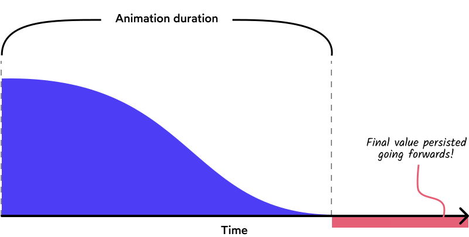
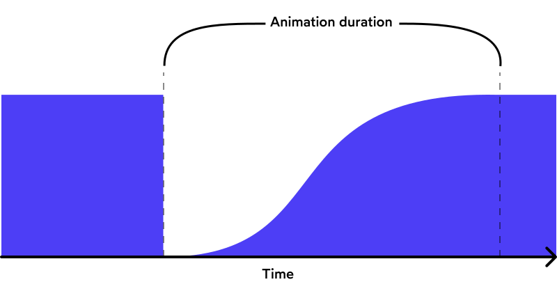
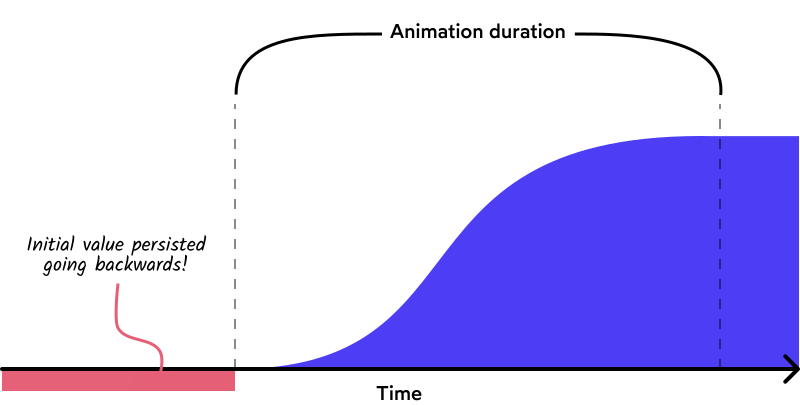
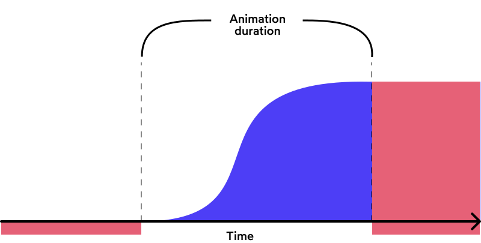

# [Keyframes](https://www.theodinproject.com/lessons/node-path-advanced-html-and-css-keyframes)

## Introduction

Now let's explore CSS animations using keyframes. This will expand upon your encounter with CSS transitions and delve into the differences between them.

<br>

## Lesson overview

This section contains a general overview of topics that you will learn in this lesson.

- The differences between CSS transitions and CSS animations.

- How to configure animation sub-properties.

- How to sequence an animation using keyframes.

<br>

## Animations vs transitions

Animations let you animate elements from one style configuration to another. Does this sound familiar? You wouldn't be wrong for thinking, "Well, what's the point in learning animations if they are basically the same as transitions?", but animations greatly expand on some capabilities that transitions do not have. A few of the differences include:

- Transitions were designed to animate an element from one state to another. They _can_ loop, but they weren't designed for that. Animations, on the other hand, _were_ designed with the purpose of explicitly enabling loops.

- Transitions need a trigger, such as the use of pseudo-classes like `:hover` or `:focus`, or by adding/removing a class via JavaScript. Animations, on the other hand, do not need such a trigger. Once you have your elements in place and CSS defined, an animation will start running immediately if that's what you told it to do.

- Transitions are not as flexible as using animations. When you define a transition, imagine you are sending that element on a journey in a straight line from point A to point B. Yes, the `transition-timing-function` can add some variation to the timing of this change, but it doesn't compare to the amount of flexibility added by using animations.

All in all, both animations and transition have their use, so in addition to considering the above differences you should also use your best judgment. For example, if you need to change the opacity of an element when it is active, then an animation would be overkill, but if you need to carry out something more complicated, animations will provide you with the tools you need.

<br>

## Animation properties

Let's see an animation in action to see what we've been talking about.

```css
.container {
	height: 100vh;
	width: 100vw;
	display: flex;
	justify-content: center;
	align-items: center;
}

#ball {
	width: 100px;
	height: 100px;
	background-color: red;
	border: 1px solid black;
	border-radius: 50%;
	animation-duration: 2s;
	animation-name: change-color;
	animation-iteration-count: infinite;
	animation-direction: alternate;
}

@keyframes change-color {
	from {
		background-color: red;
	}

	to {
		background-color: green;
	}
}
```

Note how the animation is already running and how it keeps repeating itself. We'll cover that `@keyframes` rule at the bottom of our example in a bit, so for now focus on the actual animation properties used in the example above:

```css
#ball {
	/* ... other CSS properties ... */
	animation-duration: 2s;
	animation-name: change-color;
	animation-iteration-count: infinite;
	animation-direction: alternate;
}
```

This is known as the configuration stage where we define our animation properties on the `#ball` element, and it is only the first half of defining an animaton. In our example, we have:

- An `animation-duration` of two seconds. This means that it will take two seconds for the `#ball` element to complete one animation cycle.

- Defined the `animation-name` to be "change-color" which is essential for the `@keyframes` section coming up next. This is just a custom name that is not a particular CSS value. We could have called it "pineapples" if we so wished, but for our purposes "change-color" suits us well.

- Set the `animation-iteration-count` to `infinite`, which means this animation will run forever. You could set this to 1, 2, or as many iterations as you wish.

- Set the `animation-direction` to `alternate`. This property decides if our animation should alternate direction on the completion of one cycle, or reset to the start point and repeat itself. Here it means that the `#ball` will smoothly change back to its original color instead of "jumping" straight back to red.

<br>

## Keyframes

Now it's time to tackle the second half of our animation definition by exploring the `@keyframes` at-rule.

```css
@keyframes change-color {
	from {
		background-color: red;
	}

	to {
		background-color: green;
	}
}
```

The `@keyframes` at-rule references the 'change-color' name we defined earlier. Then, we use the `from` and `to` properties to change the `background-color` of `#ball` from red to green.

It's important to know that keyframes use a percentage to indicate the times for an animation to take place and that the `from` and `to` statements are actually aliases for `0%` and `100%`, respectively. You can read `from/0%` as meaning 'at zero seconds' and `to/100%` as 'at 2 seconds' according to our `animation-duration` in our example from above. There is no hard and fast rule on whether or not you should use `from/to` or `0%/100%`. Just pick a style and be consistent with it.

The `@keyframes` at-rule also defines one animation cycle. So if we were to change our `animation-iteration-count` from earlier to 2 then the ball would change its `background-color` from red to green, then from green to red, and then the animation would stop. Be careful not to think of one iteration as a complete loop, but rather a single cycle from beginning to end (or end to beginning when alternating the direction).

Now it's time to introduce the shorthand notation for our animation properties and glimpse a little into the added flexibility of the keyframe notation.

```css
#ball {
	/* ... other CSS properties ... */
	background-color: red;
	animation: 2s change-color infinite alternate;
}

@keyframes change-color {
	from {
		background-color: red;
	}

	50% {
		transform: scale(2);
		background-color: blue;
	}

	to {
		background-color: green;
	}
}
```

Here, we added another keyframe for when the `animation-duration` is at 50%, or 1 second. This means as well as the `background-color` changing to an additional value, we have also specified that the ball doubles in size. Just be aware that additional keyframes are always defined in percentages. Only the `0%/100%` values may use the `from/to` alias.

Hopefully, this gives you a glimpse into the power the `@keyframes` syntax provides to you when it comes to controlling the animation of an element's properties. You can add keyframes whenever you want, control whatever CSS-animatable properties you want, and have the control to add some real creative flair to your website elements.

<br>

## Knowledge check

- ##### What are the long and short-hand notations for CSS animations?

`animation` is a shorthand for `animation-name`, `animation-duration`, `animation-timing-function`, `animation-delay`, `animation-iteration-count`, `animation-direction`, `animation-fill-mode`, `animation-play-state,` and `animation-timeline`. There is no strict arrangement for the values except for `<time>` values which the first one is the duration and the second is the delay.

<br>

- ##### How do you add keyframes to an animation?

To add keyframes to an animation, first you have to specify it on the `animation-name` property. You can then declare the keyframe in the `@keyframes` at-rule.

<br>

- ##### When would you use an animation over a transition (and vice versa)?

Animations let you animate elements from one style configuration to another, while transitions were designed to animate an element from one state to another. They can loop, but they weren't designed for that. Animations, on the other hand, were designed with the purpose of explicitly enabling loops.

Transitions need a trigger, such as the use of pseudo-classes like `:hover` or `:focus`, or by adding/removing a class via JavaScript. Animations, on the other hand, do not need such a trigger. Once you have your elements in placed and CSS defined, an animation will start running immediately if that's what you told it to do.

Transitions are not as flexible as using animations. When you define a transition, imagine you are sending that element on a journey in a straight line from point A to point B. Yes, the `transition-timing-function` can add some variation to the timing of this change, but it doesn't compare to the amount of flexibility added by using animations.

<hr>
<br>
<br>

# [Using CSS animations](https://developer.mozilla.org/en-US/docs/Web/CSS/CSS_animations/Using_CSS_animations)

**CSS animations** make it possible to animate transitions from one CSS style configuration to another. Animations consist of two components: a style describing the CSS animation and a set of keyframes that indicate the start and end states of the animation's style, as well as possible intermediate waypoints.

There are three key advantages to CSS animations over traditional script-driven animation techniques:

1. They're easy to use for basic animations; you can create them without even having to know JavaScript.

2. The animations run well, even under moderate system load. Simple animations can often perform poorly in JavaScript. The rendering engine can use frame-skipping and other techniques to keep the performance as smooth as possible.

3. Letting the browser control the animation sequence lets the browser optimize performance and efficiency by, for example, reducing the update frequency of animations running in tabs that aren't currently visible.

<br>

## Configuring an animation

To create a CSS animation sequence, you style the element you want to animate with the `animation` property or its sub-properties. This lets you configure the timing, duration, and other details of how the animation sequence should progress. This does **not** configure the actual appearance of the animation, which is done using the `@keyframes` at-rule described in the Defining animation sequence using keyframes section below.

Ths sub-properties of the `animation` property are:

- `animation-composition` -- Specifies the composite operation to use when multiple animations affect the same property simultaneously. This property is not part of the `animation` shorthand property.

- `animation-delay` -- Specifies the delay between an element loading and the start of an animation sequence and whether the animation should start immediately from its beginning or partway through the animation.

- `animation-direction` - Specifies whether an animation's first iteration should be forward or backward and whether subsequent iterations should alternate direction on each run through the sequence or reset to the start point and repeat.

- `animation-duration` - Specifies the length of time in which an animation completes one cycle.

- `animation-fill-mode` - Specifies how an animation applies styles to its target before and after it runs.

> **Note**: In the case of animation forwards fill mode, animated properties behave as if included in a set `will-change` property value. If a new stacking context was created during the animation, the target element retains the stacking context after the animation has finised.

- `animation-iteration-count` - Specifies the number of times an animation should repeat.

- `animation-name` - Specifies the name of the `@keyframes` at-rule describing an animation's keyframes.

- `animation-play-state` - Specifies whether to pause or play an animation sequence.

- `animation-timeline` - Specifies the timeline that is used to control the progress of a CSS animation.

- `animation-timing-function` - Specifies how an animation transitions through keyframes by establishing acceleration curves.

<br>

## Defining an animation sequence using keyframes

After you've configured the animation's timing, you need to define the appearance of the animation. This is done by establishing one or more keyframes using the `@keyframes` at-rule. Each keyframe describes how the animated element should render at a given time during the animation sequence.

Since the timing of the animation is defined in the CSS style that configures the animation, keyframes uses a `<percentage>` to indicate the time during the animation sequence at which they take place. 0% indicates the first moment of the animation sequence, while 100% indicates the final state of the animation. Because these two times are so important, they have special aliases: `from` and `to`. Both are optional. If `from`/`0%` or `to`/`100%` is not specified, the browser starts or finishes the animation using the computed values of all attributes.

You can optionally include additional keyframes that describe intermediate steps between the start and end of the animation.

<br>

## Using the animation shorthand

The `animation` shorthand is useful for saving space. As an example, some of the rules we've been using through this article:

```css
p {
	animation-duration: 3s;
	animation-name: slide-in;
	animation-iteration-count: infinite;
	animation-direction: alternate;
}
```

... could be replaced by using the `animation` shorthand:

```css
p {
	animation: 3s infinite alternate slide-in;
}
```

To learn more about the sequence in which different animation property values can be specified using the `animation` shorthand, see the [`animation`](https://developer.mozilla.org/en-US/docs/Web/CSS/animation) reference page.

> `animation` is a shorthand for `animation-name`, `animation-duration`, `animation-timing-function`, `animation-delay`, `animation-iteration-count`, `animation-direction`, `animation-fill-mode`, `animation-play-state`, and `animation-timeline`.

<br>

## Setting multiple animation property values

The CSS animation longhand properties can accept multiple values, separated by commas. This feature can be used when you want to apply multiple animations in a single rule and set different durations, iteration counts, etc., for each of the animations. Let's look at some quick examples to explain the different permutations.

In this first example, there are three duration and three iteration count values. So each animation is assigned a value of duration and iteration count with the same position as the animation name. The `fadeInOut` animation is assigned a duration of `2.5s` and an iteration count of `2`, and the `bounce` animation is assigned a duration of `1s` and an iteration count of `5`.

```css
animation-name: fadeInOut, moveLeft300px, bounce;
animation-duration: 2.5s, 5s, 1s;
animation-iteration-count: 2, 1, 5;
```

In this second example, three animation names are set, but there's only one duration and iteration count. In this case, all three animations are given the same duration and iteration count.

```css
animation-name: fadeInOut, moveLeft300px, bounce;
animation-duration: 3s;
animation-iteration-count: 1;
```

In this third example, three animations are specified, but only two durations and iteration counts. In such cases where there are not enough values in the list to assign a separate one to each animation, the value assignment cycles from the first to the last item in the available list and then cycles back to the first item. So, `fadeInOut` gets a duration of `2.5s`, and `moveLeft300px` gets a duration of `5s`, which is the last value in the list of duration values. The duration value assignment now resets to the first value; `bounce`, therefore, gets gets a duration of `2.5s`. The iteration count values (and any other property values you specify) will be assigned in the same way.

```css
animation-name: fadeInOut, moveLeft300px, bounce;
animation-duration: 2.5s, 5s;
animation-iteration-count: 2, 1;
```

If the mismatch in the number of animations and animation property value is inverted, say there are five `animation-duration` values for three `animation-name` values, then the extra or unused animation property values, in this case, two `animation-duration` values, don't apply to any animation and are ignored.

<br>

## Examples

### Making text slide across the browser window

This basic example styles a `<p>` element using the `translate` and `scale` transition properties so that the text slides in from off the right edge of the browser window.

```css
p {
	animation-duration: 3s;
	animation-name: slide-in;
}

@keyframes slide-in {
	from {
		translate: 150vw 0;
		scale: 200% 1;
	}

	to {
		translate: 0 0;
		scale: 100% 1;
	}
}
```

In this example, the style for the `<p>` element specifies that the animation should take 3 seconds to execute from start to finish, using the `animation-duration` property and that the name of the `@keyframes` at-rule defining the keyframes for the animation sequence is `slide-in`.

In this case, we have just two keyframes. The first occurs at `0%` (using the alies `from`). Here, we configure the `translate` property of the element to be at `150vw` (that is, beyond the far right edge of the containing element), and the `scale` of the element to be 200% (or two twimes its default inline size), causing the paragraph to be twice as wide as its `<body>` containing block. This causes the first frame of the animation to have the header drawn off the right edge of the browser window.

The second keyframes occurs at `100%` (using the alias `to`). The `translate` property is set to `0%` and the `scale` of the element is set to `1`, which is `100%`. This causes the header to finish its animation in its default state, flush against the left edge of the content area.

```html
<p>
	The Caterpillar and Alice looked at each other for some time in silence: at
	least the Caterpillar took the hookah out of its mouth, and addressed her in a
	languid, sleepy voice.
</p>
```

<br>

### Adding another keyframe animation

Let's add another keyframe to the previous example's animation. Let's say we want Alice's name to turn pink and grow and then shrink back to its original size and color as it moves from right to left. While we could change the `font-size`, changing any properties that impact the box model negatively impact performance. Instead, we wrap her name in a `<span>` and then scale and assign a color to that separately. That requires adding a second animation impacting only the `<span>`:

```css
@keyframes grow-shrink {
	25%,
	75% {
		scale: 100%;
	}

	50% {
		scale: 200%;
		color: magenta;
	}
}
```

The full code now looks like this:

```css
p {
	animation-duration: 3s;
	animation-name: slide-in;
}

p span {
	display: inline-block;
	animation-duration: 3s;
	animation-name: grow-shrink;
}

@keyframes slide-in {
	from {
		translate: 150vw 0;
		scale: 200% 1;
	}

	to {
		translate: 0 0;
		scale: 100% 1;
	}
}

@keyframes grow-shrink {
	25%,
	75% {
		scale: 100%;
	}

	50% {
		scale: 200%;
		color: magenta;
	}
}
```

We've added a `<span>` around "Alice":

```html
<p>
	The Caterpillar and <span>Alice</span> looked at each other for some time in
	silence: at last the Caterpillar took the hookah out of its mouth, and
	addressed her in a languid, sleepy voice.
</p>
```

This tells the browser the name should be normal for the first and last 25% of the animation, but turn pink while being scaled up and back again in the middle. We set the span's `display` property to `inline-block` as the `transform` properties do not affect non-replaced inline-level content.

<br>

### Repeating the animation

To make the animation repeat itself, use the `animation-iteration-count` property to indicate how many times to repeat the animation. In this case, let's use `infinite` to have the animation repeat indefinitely:

```css
p {
	animation-duration: 3s;
	animation-name: slide-in;
	animation-iteration-count: infinite;
}
```

<br>

### Making the animation move back and forth

That made it repeat, but it's very odd having it jump back to the start each time it begins animating. What we really want is for it to move back and forth across the screen. That's easily accomplished by setting `animation-direction` to `alternate`:

```css
p {
	animation-duration: 3s;
	animation-name: slide-in;
	animation-iteration-count: infinite;
	animation-direction: alternate;
}
```

<br>

### Using animation events

You can get additional control over animations -- as well as useful information about them -- by maing use of animation events. These events, represented by the `AnimationEvent` object, can be used to detech when animations start, finish, and begin a new iteration. Each event includes the time at which it occurred as well as the name of the animation that triggered the event.

We'll modify the sliding text example to output some information about each animation event when it occurs, so we can get a look at how they work.

We've included the same keyframe animation as the previous example. This animation will last 3 seconds, be called "slide-in", repeat 3 times, and travel in an alternate direction each time. In the `@keyframes`, the scale and translation are manipulated along the x-axis to make the element slide across the screen.

```css
.slide-in {
	animation-duration: 3s;
	animation-name: slide-in;
	animation-iteration-count: 3;
	animation-direction: alternate;
}
```

<br>

### Adding the animation event listeners

We'll use JavaScript code to listen for all three possible animation events. This code configures our event listeners; we call it when the document is first loaded in order to set things up.

```js
const element = document.getElementById("watch-me")
element.addEventListener("animationstart", listener, false)
element.addEventListener("animationend", listener, false)
element.addEventListener("animationiteration", listener, false)

element.className = "slide-in"
```

This is pretty standard code; you can get details on how it works in the documentation for [`eventTarget.addEventListener()`](https://developer.mozilla.org/en-US/docs/Web/API/EventTarget/addEventListener). The last thing this code does is set the `class` on the element we'll be animating to "slide-in"; we do this to start the animation.

Why? Because the `animationstart` event fires as soon as the animation starts, and in our case, that happens before our code runs. So we'll start the animation ourselves by setting the class of the element to the style that gets animated after the fact.

<br>

### Receiving the events

The events get delivered to the `listener()` function, which is shown below:

```js
function listener(event) {
	const l = document.createElement("li")

	switch (event.type) {
		case "animationstart":
			l.textContent = `Started: elapsed time is ${event.elapsedTime}`
			break
		case "animationend":
			l.textContent = `Ended: elapsed time is ${event.elapsedTime}`
			break
		case "animationiteration":
			l.textContent = `New loop started at time ${event.elapsedTime}`
			break
	}

	document.getElementById("output").appendChild(l)
}
```

This code, too, is very simple. It looks at the `event.type` to determine which kind of animation event occurred, then adds an appropriate note to the `<ul>` (unorder list) we're using to log these events.

The output, when all is said and done, looks something like this:

- Started: elapsed time is 0

- New loop started at time 3.01200008392334

- New loop started at time 6.00600004196167

- Ended: elapsed time is 9.234000205993652

Note that the times are very close to, but not exactly, those expected given the timing established when the animation was configured. Note also that after the final iteration of the animation, the `animationiteration` event isn't sent; instead, the `animationend` event is sent.

Just for the sake of completeness, here's the HTML that displays the page content, including the list into which the script inserts information about the received events:

```html
<h1 id="watch-me">Watch me move</h1>
<p>
	This example shows how to use CSS animations to make <code>H1</code> elements
	move across the page.
</p>
<p>
	In addition, we output some text each time an animation event fires, so you
	can see them in action
</p>
<ul id="output"></ul>
```

<br>

### Animating display and content-visibility

This example demonstrates how `display` and `content-visibility` can be animated. This behavior is useful for creating entry/exit animations where you want to, for example, remove a container from the DOM with `display: none`, but have it fade out smoothly with `opacity` rather than disappearing immediately.

Supporting browsers animate `display` and `content-visibility` with a variation on the discrete animation type. This generally means that properties will flip between two values 50% of the way through animating between the two.

There is an exception, however, which is when animating to/from `display: none` or `content-visibility: hidden` to a visible value. In this case, the browser will flip between the two values so that the animated content is shown for the entire animation duration.

So for example:

- When animating `display` from `none` to `block` (or another visible `display` value), the value will flip to `block` at `0%` of the animation duration so it is visible throughout.

- When animating `display` from `block` (or another visible `display` value) to `none`, the value will flip to `none` at `100%` of the animation duration so it is visible throughout.

<br>

#### HTML

The HTML contains two `<p>` elements with a `<div>` in between that we will animate from `display: none` to `block`.

```html
<p>
	Click anywhere on the screen or press any key to toggle the
	<code>&lt;div&gt;</code> between hidden and showing.
</p>

<div>
	This is a <code>&lt;div&gt;</code> element that animates between
	<code>display: none; opacity: 0</code> and
	<code>display: block; opacity: 1</code>. Neat, huh?
</div>

<p>
	This is another paragraph to show that <code>display: none;</code> is being
	applied and removed on the above <code>&lt;div&gt;</code>. If only its
	<code>opacity</code> was being changed, it would always take up the space in
	the DOM.
</p>
```

```css
html {
	height: 100vh;
}

div {
	font-size: 1.6rem;
	padding: 20px;
	border: 3px solid red;
	border-radius: 20px;
	width: 480px;
	opacity: 0;
	display: none;
}

/* Animation classes */

div.fade-in {
	display: block;
	animation: fade-in 0.7s ease-in forwards;
}

div.fade-out {
	animation: fade-out 0.7s ease-out forwards;
}

/* Animation keyframes */

@keyframes fade-in {
	0% {
		opacity: 0;
		display: none;
	}

	100% {
		opacity: 1;
		display: block;
	}
}

@keyframes fade-out {
	0% {
		opacity: 1;
		display: block;
	}

	100% {
		opacity: 0;
		display: none;
	}
}
```

Note the inclusion of the `display` property in the keyframe animations.

<br>

#### JavaScript

Finally, we include a bit of JavaScript to set up event listeners to trigger the animations. Specifically, we add the `fade-in` class to the `<div>` when we want it to appear, and `fade-out` when we want it to disappear.

```js
const divElem = document.querySelector("div")
const htmlElem = document.querySelector(":root")

htmlElem.addEventListener("click", showHide)
document.addEventListener("keydown", showHide)

function showHide() {
	if (divElem.classList[0] === "fade-in") {
		divElem.classList.remove("fade-in")
		divElem.classList.add("fade-out")
	} else {
		divElem.classList.remove("fade-out")
		divElem.classList.add("fade-in")
	}
}
```

<hr>
<br>
<br>

# [@keyframes](https://developer.mozilla.org/en-US/docs/Web/CSS/@keyframes)

The `@keyframes` CSS at-rule controls the intermediate steps in a CSS animation sequence by defining style for keyframes (or waypoints) along the animation sequence. This gives more control over the intermediate steps of the animation sequence than transitions.

## Syntax

```css
@keyframes slide-in {
	from {
		transform: translateX(0%);
	}

	to {
		transform: translateX(100%);
	}
}
```

<br>

### Values

- `<custom-ident>` - A name identifying the keyframe list. This must match the identifier production in CSS syntax.

- `from` - A starting offset of `0%`.

- `to` - An ending offset of `100%`.

- `<percentage>` - A percentage of the time through the animation sequence at which the specified keyframe should occur.

- `<timeline-range-name>` `<percentage>` - A percentage of the time throughout the specified `animation-range` at which the specified keyframe should occur. See [CSS scroll-driven animations](https://developer.mozilla.org/en-US/docs/Web/CSS/CSS_scroll-driven_animations) for more information on the kinds of animations that use named timeline ranges.

<br>

## Description

To use keyframes, create a `@keyframes` rule with a name that is then used by the `animation-name` property to match an animation to its keyframe declaration. Each `@keyframes` rule contains a style list of keyframe selectors, which specify percentages along the animation when the keyframe occurs, and a block containing the styles for that keyframe.

You can list the keyframe percentages in any order; they will be handled in the order they should occur.

JavaScript can access the `@keyframes` at-rule with the CSS object model interface `CSSKeyframesRule`.

<br>

### Valid keyframe lists

If a keyframe rule doesn't specify the start of end states of the animation (that is, `0%`/`from` and `100%`/`to`), browsers will use the element's existing styles for the start/end states. This can be used to animate an element from its initial state and back.

Properties that can't be animated in keyframe rules are ignored, but supported properties will still be animated.

<br>

### Resolving duplicates

If multiple keyframe sets exists for a given name, the last one encountered by the parser is used. `@keyframes` rules don't cascade, so animations never derive keyframes from more than one rule set.

If a given animation time offset is duplicated, all keyframes in the `@keyframes` rule for that percentage are used for that frame. There is cascading within a `@keyframes` rule if multiple keyframes specify the same percentage values.

<br>

### When properties are left out of some keyframes

Properties that aren't specified in every keyframe are interpolated if possible -- properties that can't be interpolated are dropped from the animation. For example:

```css
@keyframes identifier {
	0% {
		top: 0;
		left: 0;
	}
	30% {
		top: 50px;
	}
	68%,
	72% {
		left: 50px;
	}
	100% {
		top: 100px;
		left: 100%;
	}
}
```

Here, the `top` property animates using the `0%`, `30%`, and `100%` keyframes, and `left` animates using the `0%`, `68%`, `72%`, and `100%` keyframes.

<br>

### When a keyframe is defined multiple times

If a keyframe is defined multiple times but not all affected properties are in each keyframe, all values specified in these keyframes are considered. For example:

```css
@keyframes identifier {
	0% {
		top: 0;
	}
	50% {
		top: 30px;
		left: 20px;
	}
	50% {
		top: 10px;
	}
	100% {
		top: 0;
	}
}
```

In this example, at the `50%` keyframe, the values used are `top: 10px` and `left: 20px`.

Cascading keyframes are supported starting in Firefox 14.

<br>

### `!important` in a keyframe

Declarations in a keyframe qualified with `!important` are ignored.

```css
@keyframes important1 {
	from {
		margin-top: 50px;
	}
	50% {
		margin-top: 150px !important; /* ignored */
	}
	to {
		margin-top: 100px;
	}
}

@keyframes important2 {
	from {
		margin-top: 50px;
		margin-bottom: 100px;
	}
	top {
		margin-top: 150px !important; /* ignored */
		margin-bottom: 50px;
	}
}
```

<br>

## Formal syntax

```
@keyframes = @keyframes <keyframes-name> { <qualified-rule-list> }

<keyframes-name> = <custom-ident> | <string>
```

> `<custom-ident>` is a CSS data type that denotes an arbitary user-defined string used as an identifier. It is case-sensitive, and certain values are forbidden in various contexts to prevent ambiguity.

<hr>
<br>
<br>

# [An Interactive Guide to Keyframe Animations](https://www.joshwcomeau.com/animation/keyframe-animations/)

CSS keyframe animations are **_awesome_**. They're one of the most powerful, versatile tools in CSS, and we can use them for all sorts of nifty things.

But they're also often misunderstood. They're a bit quirky, and if you don't understand those quirks, using them can be quite frustrating.

In this tutorial, we're diving deep into CSS keyframes. We'll figure out how they work, and see how to build some pretty swanky animations with them.

<br>

## Syntax

The main idea with a CSS keyframe animation is that it'll interpolate between different chunks of CSS.

For example, here we define a keyframe animation that will smoothly ramp an element's horizontal position from `-100%` to `0%`:

```css
@keyframes slide-in {
	from {
		transform: translateX(-100%);
	}
	to {
		transform: translateX(0%);
	}
}
```

Each `@keyframes` statement needs a name! In this case, we've chosen to name it `slide-in`. You can think of this like a global variable.

Keyframe animations are meant to be general and reusable. We can apply them to specific selectors with the `animation` property:

```html
<style>
	/* Create the animation... */
	@keyframes slide-in {
		from {
			transform: translateX(-100%);
		}
		to {
			transform: translateX(0%);
		}
	}

	/* ... and then apply it */
	.box {
		animation: slide-in 1000ms;
	}
</style>

<div class="box">Hello World</div>
```

As with the `transition` property, `animation` requires a duration. Here we've said that the animation should last 1 second (1000ms).

The browser will _interpolate_ the declarations within our `from` and `to` blocks, over the duration specified. This happens immediately, as soon as the property is set.

We can animate multiple properties in the same animation declaration. Here's a fancier example that changes multiple properties:

```html
<style>
	@keyframes drop-in {
		from {
			transform: rotate(-30deg) translateY(-100%);
			opacity: 0;
		}

		to {
			transform: rotate(0deg) translateY(0);
			opacity: 1;
		}
	}

	.box {
		animation: drop-in 1000ms;
	}
</style>

<div class="box">Hello World</div>
```

<br>

## Timing functions

In "[An Interactive Guide to CSS Transitions](https://www.joshwcomeau.com/animation/css-transitions/#timing-functions)", we learned all about the different timing functions built into CSS.

We have access to the same library of timing functions for our keyframe animations. And, like with `transitions`, the default value is `ease`.

We can override it with the `animation-timing-function` property:

```html
<style>
	@keyframes slide-in {
		from {
			transform: translateX(-100%);
		}
		to {
			transform: translateX(0%);
		}
	}

	.box {
		animation: slide-in 1000ms;
		animation-timing-function: linear;
	}
</style>

<div class="box">Hello World</div>
```

<br>

## Looped animations

By default, keyframe animations will only run once, but we can control this with the `animation-iteration-count` property:

```html
<style>
	@keyframes slide-in {
		from {
			transform: translateX(-100%);
			opacity: 0.25;
		}
		to {
			transform: translateX(0%);
			opacity: 1;
		}
	}

	.box {
		animation: slide-in 1000ms;
		animation-iteration-count: 3;
	}
</style>

<div class="box">Hello World</div>
```

It's somewhat rare to specify an integer like this, but there is one special value that comes in handy: `infinite`.

For example, we can use it to create a loading spinner:

```html
<style>
	@keyframes spin {
		from {
			transform: rotate(0turn);
		}

		to {
			transform: rotate(1turn);
		}
	}

	.spinner {
		animation: spin 1000ms;
		animation-timing-function: linear;
		animation-iteration-count: infinite;
	}
</style>


```

Note that for spinners, we generally want to use a `linear` timing function so that the motion is constant (though this is somewhat subjective -- try changing it and see what you think!).

<br>

## Multi-step animations

In addition to the `from` and `to` keywords, we can also use percentages. This allows us to add more than 2 steps:

```html
<style>
	@keyframes fancy-spin {
		0% {
			transform: rotate(0turn) scale(1);
		}

		25% {
			transform: rotate(1turn) scale(1);
		}

		50% {
			transform: rotate(1turn) scale(1.5);
		}

		75% {
			transform: rotate(0turn) scale(1.5);
		}

		100% {
			transform: rotate(0turn) scale(1);
		}
	}

	.spinner {
		animation: fancy-spin 2000ms;
		animation-iteration-count: infinite;
	}
</style>


```

The percentages refer to the progress through the animation. `from` is really just syntactic sugar for `0%`. And `to` is sugar for `100%`.

Importantly, **_the timing function applies to each step_**. We don't get a single ease for the entire animation.

In this playground, both spinners complete 1 full rotation in 2 seconds. But `multi-step-spin` breaks it into 4 distinct steps, and each step has the timing function applied:

```html
<style>
	@keyframes spin {
		0% {
			transform: rotate(0turn);
		}
		100% {
			transform: rotate(1turn);
		}
	}

	@keyframes multi-step-spin {
		0% {
			transform: rotate(0turn);
		}
		25% {
			transform: rotate(0.25turn);
		}
		50% {
			transform: rotate(0.5turn);
		}
		100% {
			transform: rotate(1turn);
		}
	}

	.spinner {
		animation: spin 2000ms;
		animation-iteration-count: infinite;
	}
	.multi-step-spinner {
		animation: multi-step-spin 2000ms;
		animation-iteration-count: infinite;
	}
</style>


```

Unfortunately, we can't control this behaviour using CSS keyframe animations, though it _is_ configurable using the Web Animations API. If you find yourself in a situation where the step-by-step easing is problematic, I'd suggest [checking it out](https://developer.mozilla.org/en-US/docs/Web/API/Web_Animations_API/Using_the_Web_Animations_API)!

<br>

## Alternating animations

Let's suppose that we want an element to "breathe", inflating and deflating.

We could set it up as a 3-step animation:

```html
<style>
	@keyframes grow-and-shrink {
		0% {
			transform: scale(1);
		}
		50% {
			transform: scale(1.5);
		}
		100% {
			transform: scale(1);
		}
	}

	.box {
		animation: grow-and-shrink 4000ms;
		animation-iteration-count: infinite;
		animation-timing-function: ease-in-out;
	}
</style>

<div class="box"></div>
```

It spends the first half of the duration growing to be 1.5x its default size. Once it reaches that peak, it spends the second half shrinking back down to 1x.

This works, but there's a more elegant way to accomplish the same effect. We can use the `animation-direction` property:

```html
<style>
	@keyframes grow-and-shrink {
		0% {
			transform: scale(1);
		}
		100% {
			transform: scale(1.5);
		}
	}

	.box {
		animation: grow-and-shrink 2000ms;
		animation-timing-function: ease-in-out;
		animation-iteration-count: infinite;
		animation-direction: alternate;
	}
</style>

<div class="box"></div>
```

`animation-direction` controls the order of the sequence. The default value is `normal`, going from 0% to 100% over the course of the specified duration.

We can also set it to `reverse`. This will play the animation backwards, going from 100% to 0%.

The interesting part, though, is that we can set it to `alternate`, which ping-pongs between `normal` and `reverse` on subsequent iterations.

Instead of having 1 big animation that grows and shrinks, we set our animation to grow, and then reverse it on the next iteration, causing it to shrink.

> ##### Half the duration
>
> Originally, our "breathe" animation lasted 4 seconds. When we switched to the alternate strategy, however, we cut the duration in half, down to 2 seconds.
>
> This is because _each iteration only performs half the work._ It always took 2 seconds to growq, and 2 seconds to shrink. Before, we had a single 4-second-long animation. Now, we have a 2-second-long animation that requires 2 iterations to complete a full cycle.

<br>

## Shorthand values

We've picked up a lot of animation properties in this lesson, and it's been a lot of typing!

Fortunately, as with `transition`, we can use the `animation` shorthand to combine all of these properties.

The above animation can be rewritten:

```css
.box {
	/* 
    From this:
      animation: grow-and-shrink 2000ms;
      animation-timing-function: ease-in-out;
      animation-iteration-count: infinite;
      animation-duration: alternate;

    ... to this:
  */
	animation: grow-and-shrink 2000ms ease-in-out infinite alternate;
}
```

Here's a piece of goods news as well: **the order doesn't matter**. For the most part, you can toss these properties in any order you want. You don't need to memorize a specific sequence.

There is an exception: `animation-delay`, a property we'll talk more about shortly, needs to come after the duration, since both properties take the same value type (milliseconds/seconds).

For this reason, I prefer to exclude delay from the shorthand:

```css
.box {
	animation: grow-and-shrink 2000ms ease-in-out infinite alternate;
	animation-delay: 500ms;
}
```

<br>

## Fill Modes

Probably the most confusing aspect of keyframes animations is **_fill modes_**. They're the biggest obstacle on our path towards keyframe confidence.

Let's start with a problem.

We want our element to fade out. The animation itself works fine, but when it's over, the element pops back into existence:

```html
<style>
	@keyframes fade-out {
		from {
			opacity: 1;
		}
		to {
			opacity: 0;
		}
	}

	.box {
		animation: fade-out 1000ms;
	}
</style>

<div class="box">Hello World</div>
```

If we were to graph the element's opacity over time, it would look something like this:



Why does the element jump back to full visibility? Well, the declarations in the `from` and `to` blocks only apply _while the animation is running_.

After 1000ms has elapsed, the animation packs itself up and hits the road. The declarations in the `to` block dissipate, leaving our element with whatever CSS declarations have been defined elsewhere. Since we haven't set `opacity` for this element anywhere else, it snaps back to its default value (`1`).

One way to solve this is to add an `opacity` declaration to the `.box` selector:

```html
<style>
	@keyframes fade-out {
		from {
			opacity: 1;
		}
		to {
			opacity: 0;
		}
	}

	.box {
		animation: fade-out 1000ms;
		/* 
      Change the "default" value for opacity,
      so that it reverts to 0 when the
      animation completes.
    */
		opacity: 0;
	}
</style>

<div class="box">Hello World</div>
```

While the animation is running, the declarations in the `@keyframes` statement overrule the opacity declaration in the `.box` selector. Once the animation wraps up, though, that declaration kicks in and keeps the box hidden.

> ##### Specificity?
>
> In CSS, conflics are resolved based on the "specificity" of a selector. An ID selector (`#login-form`) will win the battle against a class one (`.thing`).
>
> But what about keyframe animations? What is their specificity?
>
> It turns out that specificity isn't really the right way to think about this; instead, we need to think about **cascade origins**.
>
> A "cascade origin" is a source of selectors. For example, browsers come with a bunch of built-in styles -- that's why anchor tags are blue and underlined by default. These styles are part of the **_User-Agent Origin_**.
>
> _The specificity rules only apply when comparing selectors in the same origin_. The styles we write normally are part of the "Author Origin", and Author Origin styles win out over ones written in the User-Agent Origin.
>
> Here's why this is relevant: keyframe animations are their own special origin, and its styles are applied later.
>
> Thin of it in terms of a fighting video game. In Round One, all of the default browser styles are applied, following standard specificity rules. In Round Two, the selectors we've provided battle it out. In Round Three, `@keyframes` declarations are applied. It doesn't matter how specific a selector is if it's applied in Round Two; our `@keyframes` declaration will overwrite it.
>
> [**According to the specification**](https://www.w3.org/TR/css-cascade-3/#cascade-sort), there are actually 8 rounds, not 3. Interestingly, declarations with `!important` are considered part of a different origin! At least, in theory.
>
> This is why our keyframe animations will apply, regardless of specificity.

So, we can update our CSS so that the element's properties match the `to` block, is that really the best way?

<br>

### Filling forwards

Instead of relying on fallback declarations, let's consider another approach, using `animation-fill-mode`:

```html
<style>
	@keyframes fade-out {
		from {
			opacity: 1;
		}
		to {
			opacity: 0;
		}
	}

	.box {
		animation: fade-out 1000ms;
		animation-fill-mode: forwards;
	}
</style>

<div class="box">Hello World</div>
```

`animation-fill-mode` lets us persist the final value from the animation, **_forwards in time_**.



"forwards" is a very confusing name, but hopefully seeing it on this graph makes it a bit clearer!

When the animation ends, `animation-fill-mode: forwards` will copy/paste teh declarations in the final block, persisting them forwards in time.

<br>

### Filling backwards

We don't always want our animations to start immediately! As with `transition`, we can specify a delay, with the `animation-delay` property.

Unfortunately, we run into a similar issue:

```html
<style>
	@keyframes slide-in {
		from {
			transform: translateX(-100%);
			opacity: 0.25;
		}
		to {
			transform: translateX(0%);
			opacity: 1;
		}
	}

	.box {
		animation: slide-in 1000ms;
		animation-delay: 500ms;
	}
</style>

<div class="box">Hello World</div>
```

For the first half-second, the element is fully visible!



The CSS in the `from` and `to` blocks is only applied while the animation is running. Frustratingly, the `animation-delay` period doesn't count. So for that first half-second, it's as if the CSS in the `from` block doesn't exist.

`animation-fill-mode` has another value that can help us here: `backwards`. This will apply the CSS from the first block **_backwards in time_**.



"forwards" and "backwards" are confusing values, but here's an analogy that might help: imagine if we had recorded the user's session from the moment the page loaded. We could scrub forwards and backwards in the video. We can scrub backwards, before the animation has started, or forwards, after the animation has ended.

```html
<style>
	@keyframes slide-in {
		from {
			transform: translateX(-100%);
			opacity: 0.25;
		}
		to {
			transform: translateX(0%);
			opacity: 1;
		}
	}

	.box {
		animation: slide-in 1000ms;
		animation-delay: 500ms;
		animation-fill-mode: backwards;
	}
</style>

<div class="box">Hello World</div>
```

What if we want to persist the animation forwards _and_ backwards? we can use a third value, `both`, which persists in both directions.



Personally, I wish that `both` was the default value. It's so much more intuitive! Though it _can_ make it a bit harder to understand where a particular CSS value has been set.

Like all of the animation properties we're discussing, it can be tossed into the `animation` shorthand salad:

```css
.box {
	animation: slide-in 1000ms ease-out both;
	animation-delay: 500ms;
}
```

<br>

## Dynamic animations with CSS variables

Keyframe animations are cool enough on their own, but when we mix them with CSS variables (AKA CSS custom properties), things get next-level.

Let's suppose that we want to create a bouncing-ball animation, using everything we've learned in this lesson:

```html
<style>
	@keyframes bounce {
		from {
			transform: translateY(0px);
		}
		to {
			transform: translateY(-20px);
		}
	}

	.box {
		animation: bounce 300ms alternate infinite cubic-bezier(0.2, 0.65, 0.6, 1);
	}
</style>

<div class="box"></div>
```

> ##### Cubic bezier?
>
> To make the bounce animation a bit more realistic, I'm using a custom timing function, using `cubic-bezier`.

CSS animations are meant to be generic and reusable, but this animation will always cause an element to bounce by 20px. Wouldn't it be neat if different elements could supply different "bounce heights"?

With CSS variables, we can do exactly that:

```html
<style>
	@keyframes bounce {
		from {
			transform: translateY(0px);
		}
		to {
			transform: translateY(var(--bounce-offset));
		}
	}

	.box {
		animation: bounce alternate infinite cubic-bezier(0.2, 0.65, 0.6, 1);
	}

	.box.one {
		--bounce-offset: -20px;
		animation-duration: 200ms;
	}

	.box.two {
		--bounce-offset: -30px;
		animation-duration: 300ms;
	}

	.box-three {
		--bounce-offset: -40px;
		animation-duration: 400ms;
	}
</style>

<section>
	<div class="box one"></div>
	<div class="box two"></div>
	<div class="box three"></div>
</section>
```

Our `@keyframes` animation has been updated so that instead of bouncing to `-20px`, it accesses the value of the `--bounce-offset` property. And since that property has a different value in each box, they each bounce to different amounts.

This strategy allows us to create reusable, customizable keyframe animations. Think of it like props to a React components!

> ##### Derived values with calc
>
> So, something bothers me about the example above.
>
> With the `translateY` function, positive values move the element down, negative values move the element up. We want to move the element up, so we have to use a negative value.
>
> But this is an **_implementation detail_**. When I want to apply this animation, it's weird that I need to use a negative value.
>
> CSS variables work best when they're semantic. Instead of setting `--bounce-offset` to a negative value, I'd much rather do this:
>
> ```css
> .box.one {
> 	--bounce-height: 20px;
> }
> ```
>
> Using `calc`, we can _derive the true value_ from the provided value, within our `@keyframes` at-rule:
>
> ```css
> @keyframes bounce {
> 	from {
> 		transform: translateY(0px);
> 	}
>
> 	to {
> 		transform: translateY(calc(var(--bounce-height) * -1));
> 	}
> }
> ```
>
> We only define this keyframe animation once, but we'll likely use it many times. It's worth optimizing for the "consumer" side of things, to make it as pleasant to use as possible, even if it complicates the definition a bit.
>
> `calc` lets us craft the perfect APIs for our keyframe animations.
