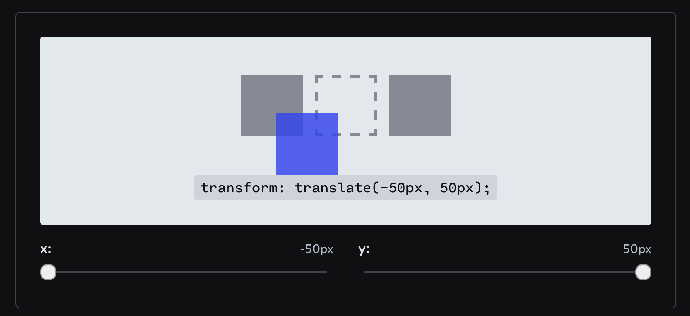
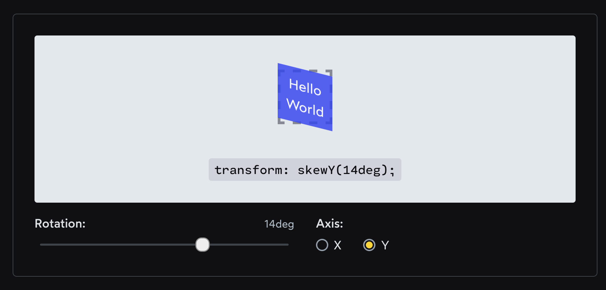

# [Transforms](https://www.theodinproject.com/lessons/node-path-advanced-html-and-css-transforms)

The `transform` property is a powerful toool to change the appearance of elements without affecting the natural document flow.
You have likely seen it in action on many of your favorite websites! Transforms are very commonly used for animated effects. While we are sure you'll like to create sleek animations of your own, we first need to understand how transforms work.

## Lesson overview

This section contains a general overview of topics that you will learn in this lesson.

- How to use 2D transforms
- How to use 3D transforms
- How to chain multiple transforms.
- The benefits of using the `transform` property.

## Basics of transforms

The `transform` property takes in one or more CSS transform functions as its values, with those functions taking in their own value, usually an angle or a number.
Almost all elements can have the `transform` property applied to it, with the exceptions being `<col>`, `<colgroup>`, and non-replaced inline elements. "Non-replaced" refers to elements whose content is contained within the HTML document (`<span>`, `<b>`, and `<em>`, for example), as opposed to a "replaced" element's content being contained outside of the document (`<a>`, `<iframe>`, and ``, for example). You do not need to memorize every element that is non-replaced, but rather keep this knowledge in mind should you try to apply the `transform` property to an element and aren't sure why it isn't working.

## Two-dimensional transforms

In this section, we'll got through 2D transforms with the following transform functions: `rotate`, `scale`, `skew`, and `translate`.

#### Rotate

This is the transform function value to rotate an element on a 2D plane:

```css
.element {
	transform: rotate();
}
```

#### Scale

These are the transform function values to scale an element on a 2D plane:

```css
.element {
	transform: scaleX();
	transform: scaleY();
	transform: scale();
}
```

#### Skew

These are the transform function values to skew an element on a 2D plane:

```css
.element {
	transform: skewX();
	transform: skewY();
	transform: skew();
}
```

#### Translate

These are the transform function values to translate an element on a 2D plane:

```css
.element {
	transform: translateX();
	transform: translateY();
	transform: translate();
}
```

#### Chaining multiple transforms

Now that you have a grasp of 2D transforms, we will learn how to chain them. Chaining multiple transforms is done by adding more transform functions with a space between each one. Take a look at the code below:

```html
<div class="red-box"></div>
<div class="blue-box"></div>
```

```css
.red-box,
.blue-box {
	position: absolute;
	width: 100px;
	height: 100px;
}

.red-box {
	background: red;
	transform: rotate(45deg) translate(200%);
}

.blue-box {
	background: blue;
	transform: translate(200%) rotate(45deg);
}
```

There are two boxes located at the same position. We chained `rotate` and `translate` function values to both boxes, but in different orders. Make a guess on what happens to each box, then click the "Result" link in the Codepen below to see if you were right.
<br>
If you guessed correctly, congratulations! But this is a tricky concept. MDN's transform docs state that "composite transforms are effectively applied in order from right to left".

> The transform functions are multiplied in order from left to right, meaning that composite transforms are effectively applied in order from right to left.

The blue box rotates 45 degrees on the spot, then translates on the X axis by 200% moving it directly to the right. The red box translates by 200% first, so moves to the right, but the transform origin is still where it used to be. Therefore, it rotates 45 degrees around that original point, making the red box "swing down" to end up diagonally from where it started.
While you can generally chain multiple transforms in any order for various results, there is one exception: `perspective`. This brings us nicely to the next section where `perspective` is involved.

## Three- dimensional transforms

The `rotate`, `scale`, and `translate` transform functions aren't limited to just 2D planes. They also work for 3D planes as well! However, to perceive a 3D effect on some of these function values, `perspective` is required.
From here on, the examples get more complicated. Feel free to play around with these properties, but be careful not to get too sidetracked with them.
<br>

#### Perspective

This is the transform function value to set the distance from the user to the z = 0 plane:

```css
.element {
	transform: perspective();
}
```

Essentially, by setting a `perspective` value, we are telling the object to render as if we were viewing it from a specific distance on the z-axis.
Unlike other transform function values, `perspective` must be declared first (leftmost) when there are multiple transform function values. In the upcoming examples for `rotate`, `scale`, and `translate`, we will be able to see how it affects the target element.

<br>

#### Rotate specific axis

These are the additional transform function values to rotate an element in a 3D space:

```css
.element {
	transform: rotateX();
	transform: rotateY();
	transform: rotateZ();
	transform: rotate3d();
}
```

<br>

#### Scale specific axis

These are the additional transform function values to scale an element in a 3D space:

```css
.element {
	transform: scaleZ();
	transform: scale3d();
}
```

<br>

#### Translate specific axis

These are the additional transform function values to translate an element in a 3D space:

```css
.element {
	transform: translateZ();
	transform: translate3d();
}
```

`translateZ` doesn't do much without `perspective`. Instead, `perspective` and `translateZ` work together to create the illusion of 3-dimensional distance from the rendered object, as shown in the example below.

<br>

#### Matrix

While not strictly a 3D transform function, matrix is mentioned last in this lesson due to how uncommonly used it is. These are the transform function values for it.

```css
.element {
	transform: matrix();
	transform: matrix3d();
}
```

Matrix is a way of combining all transform functions into one. It is seldom used due to its poor readability, and almost never written by hand. Unless you have a very complex transformation to apply, you should use other transform function values instead.
It is enough for you to know _that_ these functions exist and generally how they work. However, it is not important for you to feel comfortable building with them.
<br>

### Benefits of transforms

In order to understand why the `transform` property is great, you have to be aware of CSS triggers. You can learn about it in The Pixel Pipeline section from Google's Web Fundamentals.
The key benefit of using `transform` is that it occurs during **composition**. This makes it cheaper to use compared to many other CSS properties. You can see what triggers are executed with each CSS property in this table of CSS triggers.
Another benefit of `transform` is that it can be hardware-accelerated via a device's GPU (you don't have to understand how a GPU works but it is good to be aware of the term and what it means). This benefit is more prominent when it comes to transitions and animations which you will learn about in the following lessons.

<hr>
<br>
<br>

# [Rendering performance](https://web.dev/articles/rendering-performance#the_pixel_pipeline)

Users notice if sites and apps don't run well, so optimizing rendering performance is crucial!
<br>
Users of today's web expect that the pages they visit will be interactive and smooth, and that's where you need to increasingly focus your time and effort. Pages shouldn't just load quickly, but also respond quickly to user input throughout their entire lifecycle. In fact, this aspect of the user experience is precisely what the Interaction to Next Paint (INP) metric measures. A good INP means that a page was consistently and reliably responsive to the user's needs.
While a major component of what makes a page feel snappy involves the amount of JavaScript you execute in response to user interactions, what users are anticipating are visual changes to the user interface. Visual changes to a user interface are the result of several types of work, often collectively referred to as _rendering_, and this work needs to happen as quickly as possible so that the user experience feels fast and reliable.
To write pages that respond quickly to user interactions, you need to understand how HTML, JavaScript, and CSS are handled by the browser, and ensure that the code you write -- as well as any other third-party code you include -- runs as efficiently as possible.
<br>

### A note on device refresh rates

The refresh rate of a display is an important consideration when it comes to building websites that feel responsive to user input.
Most devices today refresh their screens 60 times a second. Each refresh produces the visual output you see, and is commonly known as a frame. In the following video, the concept of frames is demonstrated.
<br>
While a device's screen always refreshes at a consistent rate, applications that run on a device may not necessarily always be able to produce enough frames to match that refresh rate. For example, if there's an animation or transition running, the browser needs to match the device's refresh rate to produce one frame for each time the screen refreshes.
Given that a typical display refreshes 60 times per second, some quick math would reveal that the browser has 16.66 milliseconds to produce each frame. In reality, though, the browser has its own overhead for each frame, so all of your work needs to be completed inside 10 milliseconds. When you fail to meet this budget, the frame rate drops, and page contents judder on-screen. This phenomenon is often called _jank_.
However, your targets change based on the type of work you're trying to do. Meeting the 10 millisecond threshold is crucial for _animations_, where the of objects on the screen are interpolated across a series of frames between two points. When it comes to discrete changes in the user interface -- that is, proceeding from one state to another without any motion in between -- it is recommended that you achieve such changes in a timeframe that feels instant to the user. In cases such as these, 100 milliseconds is an oft-cited figure, but the INP metric's "good" threshold is 200 milliseconds or lower in order to accomodate a wider array of devices with varying capabilities.
Whatever your goals are -- be they producing the many frames that animations require in order to avoid jank, or merely producing a discrete visual change in the user interface as quickly as possible -- understanding how the browser's pixel pipeline works is essential to your work.

<br>

## The pixel pipeline

There are five major areas that you need to know about and be mindful of in your work as a web developer. These five areas are those that you have the most control over, and each represents a key point in the pixels-to-screen pipeline:


- **JavaScript**: JavaScript is typically used to handle work that will result in visual changes to the user interface. For example, this could be jQuery's `animate` function, sorting a dataset, or adding DOM elements to the page. JavaScript isn't strictly necessary to trigger visual changes, though: CSS animations, CSS transitions and the Web Animations API are capable to animating page contents.
- **Style calculations**: This is the process of figuring out which CSS rules apply to which HTML elements based on matching selectors. For example, `.headline` is an example of a CSS selector that applies to any HTML element with a `class` attribute value that contains a class of `headline`. From there, once rules are known, they are applied, and the final styles for each element are calculated.
- **Layout**: Once the browser knows which rules apply to an element it can begin to calculate the geometry of the page, such as how much space elements take up, and where they appear on the screen. The web's layout model means that one element can affect others. For example, the width of the `<body>` element typically affects the dimensions of its child elements all the way up and down the tree, so the process can be quite involved for the browser.
- **Paint**: Painting is the process of filling in pixels. It involves drawing out text, colors, images, borders, shadows, and essentially every visual aspect of the elements after their layout on the page has been calculated. The drawing is typically done onto multiple surfaces, often called layers.
- **Composite**: Since the parts of the page were potentially drawn onto multiple layers, they need to be applied to the screen in the correct order so that the page renders as expected. This is especially important for elements that overlap another, since a mistake could result in one element appearing over the top of another incorrectly.
<br>
Each of these parts of the pixel pipeline represents an opportunity to introduce jank in animations, or delay the painting of frames even for discrete visual changes to the user interface. It's therefore important to understand exactly which parts of the pipeline your code triggers, and to investigate if you can limit your changes to only parts of the pixel pipelines that are necessary to render them.
You may have heard the term "rasterize" used in conjunction with "paint". This is because painting is actually two tasks:
<ol>
<li>Creating a list of draw calls</li>
<li>Filling in the pixels</li>
</ol>

The latter is called "rasterization", so whenever you see paint records in DevTools, you should think of it as including rasterization. In some architectures, creating the list of draw calls and rasterization are done on different threads, but that isn't under your control as a developer.
You won't always necessarily touch every part of the pipeline on every frame. In fact, there are three ways the pipeline normally plays out for a given frame when you make a visual change, either with JavaScript, CSS, or the Web Animations API.

1. JS / CSS > Style > Layout > Paint > Composite
   
   If you change a "layout" property, such as one that changes an element's geometry like width, height or its position (such as the `left` or `top` CSS properties), the browser needs to check all other elements and "reflow" the page. Any affected areas will need to be repained, and the final painted elements will need to be composited back together.
   <br>
2. JS / CSS > Style > Paint > Composite
   
   If you changed a "paint-only" property for an element in CSS -- for example, properties such as `background-image`, `color`, or `box-shadow` -- the layout step is not necessary to commit a visual update to the page. By omitting the layout step -- where possible -- you avoid potentially costly layout work that could have otherwise contributed significant latency in producing the next frame.

<br>
3. JS / CSS > Style > Composite

If you change a property that requires *neither* layout or paint, the browser can jump straight to the compositing step. This is the cheapest and most desirable pathway through the pixel pipeline for high pressure points in a page's lifecycle, such as animations or scrolling. Fun fact: Chromium optimizes scrolling of the page so that it occurs solely on the compositor thread where possible, meaning that even if a page is not responding, you're still able to scroll the page and see parts of it that were previously drawn to the screen.

<br>

Web performance is the art of _avoiding_ work, while increasing the efficiency of any necessary work as much as possible. In many cases, it's about working with the browser, not against it. It's worth bearing in mind that the work previously shown in the pipeline differs in terms of computational cost; some tasks are inherently more expensive than others!

<br>

## Browser Rendering Optimizations

Performance matters to users, and to build good user experiences, web developers need to build websites that react quickly to user interactions and render smoothly. Performance expert Paul Lewis is here to help you destroy jank and

<hr>
<br>
<br>

# [rotate3d()](https://developer.mozilla.org/en-US/docs/Web/CSS/transform-function/rotate3d)

The `rotate3d()` CSS function defines a transformation that rotates an element around a fixed axis in 3D space, without deforming it. Its result is a `transform-function` data type.
In 3D space, rotations have three degrees of freedom, which together describe a single axis of rotation. The axis of rotation is defined by an [x, y, z] vector and pass by the origin (as defined by the `transform-origin` property). If, as specified, the vector is not normalized (i.e., if the sum of the square of its three coordinates is not 1), the user agent will normalize it internally. A non-normalizable vector, such as the null vector, [0, 0, 0], will cause the rotation to be ignored, but without invalidating the whole CSS property.

> Note: Unline rotations in the 2D plane, the composition of 3D rotations is usually not commutative. In other words, the order in which the rotations are applied impacts the result.

<br>

### Syntax

The amount of rotation created by `rotate3d()` is specified by three `<number>`s and one `<angle>`. The `<number>`s represent the x-, y-, and z-coordinates of the vector denoting the axis of rotation. The `<angle>` represents the angle of rotation; if positive, the movement will be clockwise; if negative, it will be counter-clockwise.

```css
rotate3d(x, y, z, a)
```

<br>

### Values

`x` is a `<number>` describing the x-coordinate of the vector denoting the axis of rotation which can be a positive or negative number.

`y` is a `<number>` describing the y-coordinate of the vector denoting the axis of rotation which can be a positive or negative number.

`z` is a `<number>` describing the z-coordinate of the vector denoting the axis of rotation which can be a positive or negative number.

`a` is an `<angle>` representing the angle of the rotation. A positive angle denotes a clockwise rotation, a negative angle a counter-clockwise one.

<br>

## Examples

### Rotating on the y-axis

```css
.rotated {
	transform: rotate3d(0, 1, 0, 60deg);
}
```

<br>

### Rotating on a custom axis

```css
.rotated {
	transform: rotate3d(1, 2, -1, 192deg);
}
```

<hr>
<br>
<br>

# [CSS rotate3d() Function](https://web.qhmit.com/css/functions/css_rotate3d_function.cfm)

The CSS rotate3d() function is used to rotate elements in a three-dimensional space.

<br>

The `rotate3d()` function rotates the element along the x, y, and z axes using the angle provided as an argument.

You can specify the axis/axes of rotation using a `<number>` for the first three arguments. The fourth argument specifies the angle. You can provide the angle as any valid `<angle>` value (i.e., in degrees, gradians, radians, or turns).

<br>

### Rotate along the _x_ Axis

This example rotates 60 degrees around the _x_ axis. It's the equivalent of `rotateX(60deg)`.

```css
.rotated {
	transform: rotated3d(1, 0, 0, 60deg);
}
```

<br>

### Rotate along the _y_ Axis

This example rotates 60 degrees around the _y_ axis. It's the equivalent of `rotateY(60deg)`.

```css
.rotated {
	transform: rotate3d(0, 1, 0, 60deg);
}
```

<br>

### Rotate along the _z_ axis

This example rotates 60 degrees around the _z_ axis. It's the equivalent of `rotateZ(60deg)`.

```css
.rotated {
	transform: rotate3d(0, 0, 1, 60deg);
}
```

<br>

### Rotate along all Axes

This example rotates along the x, y, and z axes.

```css
.rotated {
	transform: rotate3d(1, 5, 1, 60deg);
}
```

<br>

### Negative Values

You can also use negative values. A negative value will rotate the element in a counter-clockwise direction.

```css
.rotated {
	transform: rotate3d(1, -5, 1, 60deg);
}
```

<br>

### Adding `transform-origin`

The default origin for the rotation is `50% 50%`. You can use `transform-origin` to adjust the origin of the transformation:

```css
.rotated {
	transform-origin: 90% 90%;
	transform: rotate3d(1, -5, 1, -60deg);
}
```

<br>

### Official Syntax

The official syntax of the `rotate3d()` function is as follows:

```javascript
rotate3d() = rotate3d(<number>, <number>, <number>, <angle>)
```

<br>

### Possible Values

The first three parameters describe the [x, y, z] direction vectors. The fourth parameter specifies the angle to be used. It works like this:

```css
rotate3d(x, y, z, a)
```

<br>

##### `x`

A `<number>` value that describes the x-coordinate of the vector denoting the axis of rotation.

<br>

##### `y`

A `<number>` value that describes the y-coordinate of the vector denoting the axis of rotation.

<br>

##### `z`

A `<number>` value that describes the z-coordinate of the vector denoting the axis of rotation.

<br>

##### `a`

An `<angle>` value that represents the angle of the rotation. A positive value results in a clockwise rotation, a negative value results in a counter-clockwise rotation.
The angle can be represented with any of the following unit identifiers:

- _`deg`_ - Degrees. There are 360 degrees in a full circle.

- _`grad`_ - Gradians, also known as "gons" or "grades" (although these aren't valid unit identifiers -- you should still use `grad` as the unit identifier). There are 400 gradians in a full circle.

- _`rad`_ - Radians. There are 2 pi r radians in a full circle.

- _`turn`_ - Turns. There is 1 turn in a full circle.
  <br>

> #### Zero Angles
>
> The unit identifier is optional for zero angles. For example, both `rotate3d(1, 0, 0, 0deg)` and `rotate3d(1, 0, 0, 0)` are valid (but `rotate3d(1, 0, 0, 45)` is not).

> A direction vector that cannot be normalized, such as `0, 0, 0`, will cause the rotation to not be applied.
> For example, `rotate3d(0, 0, 0, 90deg)` will result in no rotation being applied.

<hr>
<br>
<br>

# [Perspective](https://3dtransforms.desandro.com/perspective)

To activate 3D space, an element needs perspective. This can be applied in two ways.

The first technique is with the `transform` property, with `perspective()` as a function:

```css
transform: perspective(400px);
```

<br>

For example:

```css
.panel-red {
	/* perspective function in transform property */
	transform: perspective(400px) rotateY(45deg);
}
```


<br>

The second technique is with the `perspective` property:

```css
perspective: 400px;
```

For example:

```css
.scene--blue {
	/* perspective property */
	perspective: 400px;
}

.panel--blue {
	transform: rotateY(45deg);
}
```


These two formats both trigger a 3D space and can produce the same visual result. But there is a difference. The functional notation is convenient for directly applying a 3D transform on a single element (in the red example, I use it in conjunction with a `rotateY` transform). In this way, it is used as a shorthand to transform a single element in 3D.

But when used on multiple elements, the effect breaks. The transformed elements don't line up together. This is because each element has its own perspective, its own vanishing point. To remedy this, use the `perspective` property on a parent element, so each child may share the same 3D space.

```css
.panel--separate {
	transform: perspective(400px) rotateY(45deg);
}
```


<br>

```css
.scene--together {
	perspective: 400px;
}

.panel--together {
	transform: rotateY(45deg);
}
```


The value of `perspective` determines the intensity of the 3D effect. Think of it as a distance from the viewer to the object. The greater the value, the further the distance, the less intense the visual effect. `perspective: 2000px` yields a subtle 3D effect, as if we are viewing an object from far away through binoculars. `perspective: 100px` produces a tremendous 3D effect, like a tiny insect viewing a massive object.

You can also use 3D transforms without perspective, either by setting `perspective: none` or not setting `perspective` at all. Without perspective, parallel planes are orthogonal and have no vanishing point.

By default, the vanishing point for a 3D space is positioned at the center. You can change the position of the vanishing point with `perspective-origin` property.

```css
perspective-origin: 25% 75%;
```

<hr>
<br>
<br>

# [`translate3d()`](https://developer.mozilla.org/en-US/docs/Web/CSS/transform-function/translate3d)

The `translate3d()` CSS function repositions an element in 3D space. Its result is a `<transform-function>` data type.

This transformation is characterized by a three-dimensional vector [tx, ty, tz]. Its coordinates define how much the element moves in each direction.

<br>

### Syntax

```css
translate3d(tx, ty, tz)
```

#### Values

- _`tx`_ - is a `<length>` or `<percentage>` representing the abscissa (horizontal, x-component) of the translating vector [tx, ty, tz].

- _`ty`_ - is a `<length>` or `<percentage>` representing the ordinate (vertical, y-component) of the translating vector [tx, ty, tz].

- _`tz`_ - is a `<length>` representing the z-component of the translating vector. It can't be a `<percentage>` value; in that case the property containing the transform is considered invalid [tx, ty, tz].

<br>

### Formal syntax

```css
<translate3d()> = translate3d(<length-percentage>, <length-percentage>, <length>)

<length-percentage> = <length> <percentage>
```

<br>

### Examples

#### Using a single axis translation

##### HTML

```html
<div>Static</div>
<div class="moved">Moved</div>
<div>Static</div>
```

##### CSS

```css
div {
	width: 60px;
	height: 60px;
	background-color: skyblue;
}

.moved {
	/* Equivalent to perspective(500px) translateX(10px) */
	transform: perspective(500px) translate3d(10px, 0, 0);
	background-color: pink;
}
```

<br>

#### Result


<br>

### Combining z-axis and x-axis translation

##### HTML

```html
<div>Static</div>
<div class="moved">Moved</div>
<div>Static</div>
```

##### CSS

```css
div {
	width: 60px;
	height: 60px;
	background-color: skyblue;
}

.moved {
	transform: perspective(500px) translate3d(10px, 0, 100px);
	background-color: pink;
}
```

##### Result


<hr>
<br>
<br>

# [The World of CSS Transforms](https://www.joshwcomeau.com/css/transforms/)

Like so many things in CSS, the `transform` property is surprisingly remarkable.

At first glance, it may seem like a pretty niche thing. How often do we need to rotate or skew something, after all? And yet, the more I learn about `transform`, the more I find myself taking advantage of it. In my blog's codebase, I've used the `transform` property more than 800 times!

In this blog post, we're diving deeper into the `transform` property. I'll show you some of the cool and unexpected things you can do with it!

<br>

### Transform functions

The `transform` property can do a whole bunch of different things, through the use of transform functions like `translate` and `skew`.

Let's look at each in turn.

<br>

#### Translation

Translation allows us to move an item around.

We can use `translate` to shift an item along in either axis: `x` moves side to side, `y` moves up and down. Positive values move down and to the right. Negative values move up and to the left.

Critically, **_the item's in-flow position doesn't change_**. As far as our layout algorithms are concerned, from Flow to Flexbox to Grid, this property has no effect.

For example: in this visualization, we have 3 children aligned using Flexbox. When we apply a transform to the middle child, the Flexbox algorithm doesn't notice, and keeps the other children in the same place.



This is similar to how `top`/`left`/`right`/`bottom` work in positioned layout, with relatively-positioned elements.

When we want to move an element along a single axis, we can use `translateX` and `translateY`:

```css
.box {
	transform: translateY(20px);

	/* It's equivalent to: */
	transform: translate(0, 20px);
}
```

There's one thing that makes `translate` ridiculously powerful, though. Something **_totally unique_** in the CSS language.

When we use a percentage value in `translate`, that percentage refers to _the element's own size_, not the available space within the parent container.

For example:


Setting `transform: translateY(100%)` moves the box up by its exact height, no matter what height is, to the pixel.

This is incredibly handy when we want an element to sit _just_ outside another one.

<br>

```html
<style>
	.parent {
		position: relative;
	}

	.child {
		/* Put the child in the top-right corner */
		position: absolute;
		top: 0;
		right: 0;

		/* ... and then shipft it up to sit just outside */
		transform: translateY(-100%);

		width: 50px;
		height: 50px;
	}
</style>

<div class="parent">
	<div class="child"></div>
</div>
```


<br>

> #### Why is this cool?
>
> You might be wondering why this is such a big deal. After all, the above layout could be built with Flexbox or Grid, right? If we set `.parent` and `.child` to be siblings?
> Well, not quite.
> Here's a _similar_ layout, using CSS grid to control their position:
>
> ```html
> <style>
> 	.grid {
> 		display: grid;
> 		justify-items: end;
> 	}
>
> 	.little-box {
> 		width: 50px;
> 		height: 50px;
> 	}
> </style>
>
> <div class="grid">
> 	<div class="little-box"></div>
> 	<div class="big-box"></div>
> </div>
> ```
>
> 

> Can you see the difference, though?
> In the original example, our light purple `.parent` box was centered vertically in the viewport. In this grid alternative, both the purple and pink boxes are centered as a group.
> When I use this trick, I want the translated element to be **_out of flow_**. I want to stick it like a sticker onto another element, without the entire layout recalculating.
> This might seem niche, but I find myself using this trick all the time!

<br>

A common usecase for this trick is to add a "close" button just outside a dialog box:

```html
<style>
	.dialog-content {
		position: relative;
	}

	.close-btn {
		position: absolute;
		top: 0;
		right: 0;
		transform: translateY(-100%);
	}
</style>

<div class="dialog-wrapper">
	<div class="dialog-content">
		<button class="close-btn">
			<svg
				xmlns="http://www.w3.org/2000/svg"
				width="24"
				height="24"
				viewBox="0 0 24 24"
				fill="none"
				stroke="currentColor"
				stroke-width="2"
				stroke-linecap="round"
				stroke-linejoin="round"
				class="feather feather-x"
			>
				<line x1="18" y1="6" x2="6" y2="18"></line>
				<line x1="6" y1="6" x2="18" y2="18"></line>
			</svg>
			<span class="visually-hidden">Dismiss dialog</span>
		</button>
	</div>
</div>
```


<br>

With the magic of `calc`, we can even mix relative and absolute units:


This allows us to add a "buffer", so that we can translate something by its own size _plus_ a few extra pixels.

<br>

## Scale

Alright, let's look at another transform function!

`scale` allows us to grow or shrink an element:


Scale uses a unitless value that represents a _multiple_, similar to `line-height`. `scale(2)` means that the element should be 2x as big as it would normally be.

We can also pass multiple values, to scale the `x` and `y` axis independently.


At first glance, this might seem equivalent to setting `width` and `height`, but there's one big difference.

Check out what happens when our element has some text in it:


The text scales up and down with the element. We aren't just transforming the size and shape of the box, we're transforming the _entire_ element and all of its descendants.

<br>

> #### A different mechanism
>
> This reveals an important truth about transforms: **elements are flattened into texture**. All of these transforms essentially treat our element like a flat image, warping and contorting it as you might in Photoshop.
> Incidentally, this is what makes `transform` such a good choice for animations!
> Think about how much work is required when we change something like `width`. All of the layout algorithms need to re-run, figuring out exactly where this element and all of its siblings should be. If the element has text inside, the line-wrapping algorithm needs to figure out if this new width affects the line breaks. Then, the paint algorithm runs, figuring out which color every pixel needs to be, and filling it in.
> It's fine to do this once when the page loads, but when we animate something, we need to do all of those calculations _many many times a second_. With transform, we can skip a bunch of steps. This means that the calculations run quicker, leading to smoother motion.

It may seem like a bummer that `scale` will stretch/squash the element's contents, but we can actually use this effect to our advantage. For example, check out this old-timey TV power animation:


For this animation, the squashing effect actually improves the effect!

And, if we _really_ don't want our text to squash, we can apply an **_inverse transform_** to the child.

This is an advanced technique, far beyong the scope of this blog post, but know that it's possible to use `scale` to increase an element's size without distorting its children. Libraries like [Framer Motion](https://motion.dev/) take advantage of this fact to build highly-performant animations without stretching or squashing.

<br>

## Rotate

You guessed it: `rotate` will rotate our elements:


We typically use the `deg` unit for rotation, short for degrees. But there's another handy unit we can use, one which might be easier to reason about:


The `turn` unit represents how many turns the element should make. 1 turn is equal to 360 degrees.

It's obscure, but well-supported; the `turn` unit goes all the way back to IE 9!

<br>

### Skew

Finally, `skew` is a seldom-used but pretty-neat transformation:


As with `translate`, we can skew along either axis:



Skew can be useful for creating diagonal decorative elements (a la Stripe). With the help of `calc` and some trigonometry, it can also be used on elements without distorting the text! This technique is explored in depth in Nils Binder's awesome blog post, "[Create Diagonal Layouts Like It's 2020](https://9elements.com/blog/create-diagonal-layouts-like-its-2020/)".

<br>

## Transform origin

Every element has an **_origin_**, the anchor that the transform functions execute from.

Check out how rotation changes when we tweak the transform origin:


The transform origin acts as a pivot point!

It isn't exclusive to rotation, either; here's how it affects scale:


This is useful for certain kinds of effects (for example, an element "growing out of" another one).

<br>

### Combining multiple operations

We can string together multiple transfor functions by space-separating them:


**The order is important**: the transform functions will be applied sequentially. Check out what happens if we **_reverse_** the order:


The transform functions are applied from right to left, like composition in functional programming.

In the first demo, we rotate the element in its natural position, and then translate it along the X axis.

In this second demo, however, we translate the element first. When we apply the rotation, it rotates **_around its origin_**, which hasn't changed.

Here's the same demo, but with the origin shown:


<br>

We can use this to our advantage:

```html
<style>
	@keyframes orbit {
		from {
			transform: rotate(0deg) translateX(80px);
		}

		to {
			transform: rotate(360deg) translateX(80px);
		}
	}

	@media (prefers-reduced-motion: no-preference) {
		.moon {
			animation: orbin 6000mbs linear infinite;
		}
	}
</style>

<div class="wrapper">
	<div class="planet"></div>
	<div class="moon"></div>
</div>
```

```css
.wrapper {
	position: relative;
}

.planet {
	width: 80px;
	height: 80px;
	background: dodgerblue;
	border-radius: 50%;
}

.moon {
	position: absolute;
	top: 0;
	left: 0;
	right: 0;
	bottom: 0;
	margin: auto;
	width: 20px;
	height: 20px;
	background: silver;
	border-radius: 50%;
}
```


In this example, we start by positioning the moon in the dead center of the planet. Our animation will shift it 80px to the right, and then cause it to rotate in a circle. Because the moon's origin is still in the center of the planet, it orbits around at a distance.

Try changing the `80px` in the from/to blocks to see how it affects the animation!

<br>

### Inline Elements

One common gotcha with transforms is that they don't work with inline elements in Flow layout:

```html
<style>
	.inline-fellta {
		/* Doesn't work */
		transform: rotate(-10deg);
	}
</style>

<p>Why <span class="inline-fella">Hello</span> there!</p>
```

Inline elements don't enjoy being jostled. Their goal is to wrap around some content with as little disruption as possible. Transforms aren't their cup of tea.

The easiest fix is to switch it to use `display: inline-block`, or to use a different layout mode (eg. Flexbox or Grid).

<br>

### The third dimension

In addition to the 2D transforms we've covered in this tutorial, CSS can transform elements in a third dimension!
