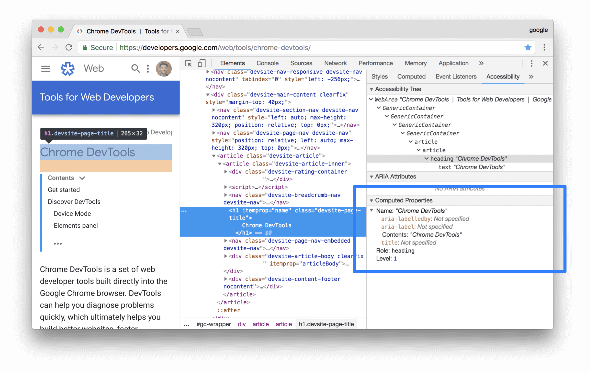
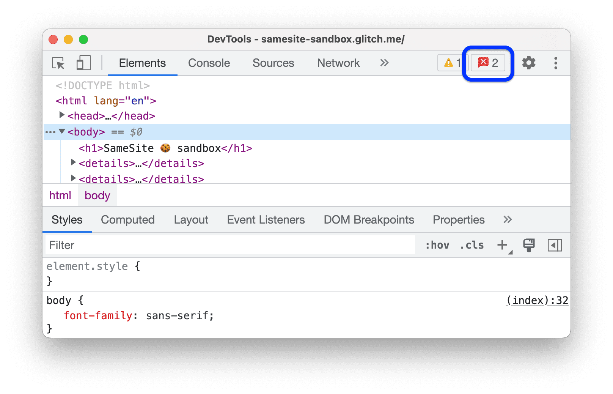
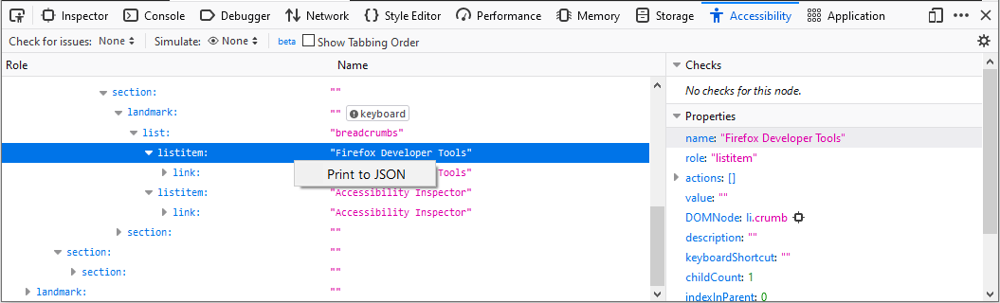
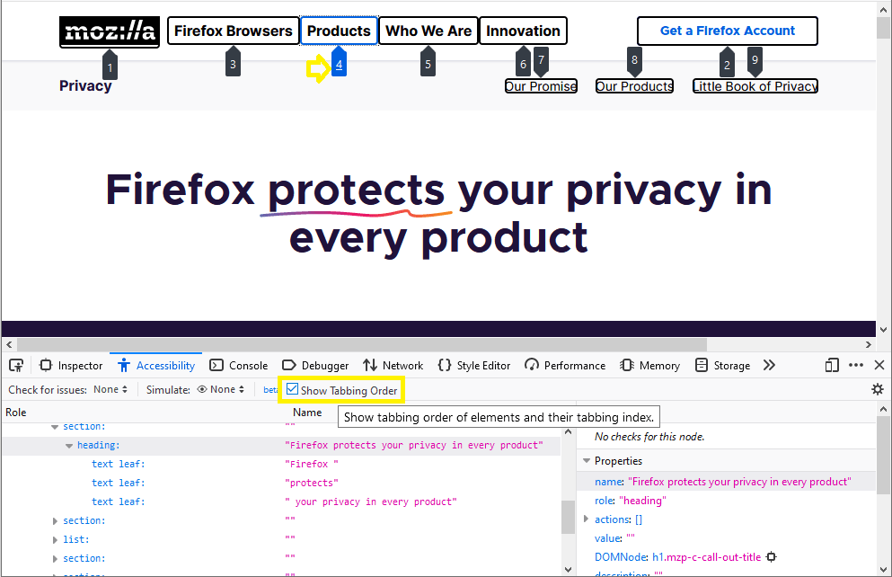
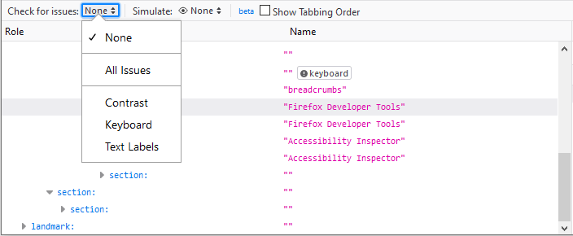
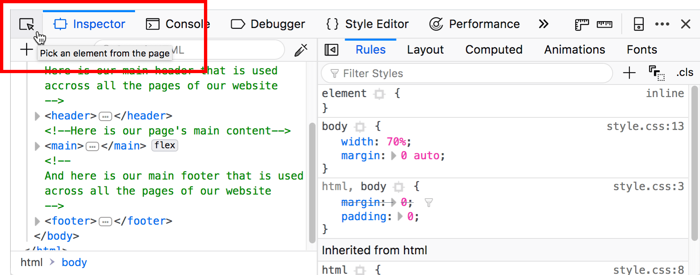

# [Accessibility Auditing](https://www.theodinproject.com/lessons/node-path-advanced-html-and-css-accessibility-auditing)

## Introduction

Now that you are equipped with the necessary knowledge to make your websites more accessible to many users, the question arises: How can we verify the correct implementation of a11y features? Are there any mistakes to be corrected, or potential improvements to be made? In this lesson, we will answer those questions to help push your a11y skills over the top.

 

## Lesson overview

This section contains a general overview of topics that you will learn in this lesson.

- Open the accessibility section within your browser's DevTools.

- Audit a web page with a third-party auditing tool.

 

## Accessibility DevTools

Using your browser's DevTools is beyond useful for several things, from checking the styles applied to a page to debugging code, but you already know that! Here's something that you may not know: you can even use the DevTools to look at various accessibility features as well, which can be great as a sort of "quick audit". You can check contrast ratios (as we mentioned in a previous lesson), view various accessibility properties, and view the accessibility tree, to name a few features.

 

## Accessibility Auditing

There are plenty of third-party tools to audit the accessibility of a web page, each with its own pros and cons. Here, we're only going to mention three of those tools. By getting into the habit of auditing your web pages, you'll be able to track down any outstanding a11y issues that you may have missed. Whether you decide to utilize one of these tools or any other auditing tool you prefer, you should only focus on fixing issues related to the concepts introduced in this portion of the curriculum for now.

- [axe DevTools for Chrome](https://chromewebstore.google.com/detail/axe-devtools-web-accessib/lhdoppojpmngadmnindnejefpokejbdd?hl=en-US&pli=1) is an extension-based tool that returns a list of issues ranked by severity level, and will note any issues for you to manually check.

- [Lighthouse for Chrome](https://developer.chrome.com/docs/lighthouse/overview/) is available in the Chrome DevTools by default (it might also be listed as the Auditing tab) or it can be run from the command line. Lighthouse provides more than just a11y auditing, including performance, best practices, search engine optimization (SEO),, and progressing web app (PWA) if applicable. Issues are separated by category, and like the axe DevTools, there may be a list of issues for you to manually check.

- [WebAIM's WAVE](https://wave.webaim.org/) is a website-based tool where you enter the URL of the page you want to audit. There are also browser extensions and API options. WAVE will return a preview of the page with an overlay of icons on it, and issues are separated into categories of alerts, warnings, and contrast errors. Unfortunately, the icons that are placed on the page may cause the layout to break, but that could be a minor issue if you're more focused on the a11y issues that are found.

Of course, one of the best ways to check the accessibility of your website is to get feedback from users who rely on these accessibility features. This isn't always an easy option, but it's worth hearing from those who may be affected by your site's accessibility (or lack of it).

 

## Knowledge check

- ##### What are some of the various accessibility features available in your browser's DevTools?

Lighthouse audits, a contrast checker, the Accessibility Inspector, and the ability to simulate vision deficiencies.

 

- ##### Which third-party accessibility auditing tool is available in the Chrome DevTools by default?

Lighthouse is an auditing tool available in the Chrome DevTools by default.

 
 

# [Accessibility Features Reference](https://developer.chrome.com/docs/devtools/accessibility/reference/#pane)

## Overview of accessibility features in Chrome DevTools

This section explains how DevTools fits into your overall accessibility toolkit.

When determining whether a page is accessible, you need to have 2 general questions in mind:

1. Can I navigate the page with a keyboard or a screen reader?

2. Are the page's elements properly marked up for screen readers?

In general, DevTools can help you fix errors related to question #2, because these errors are easy to detect in an automated fashion. Question #1 is just as important, but unfortunately DevTools can't help you there. The only way to find errors related to question #1 is to try using a page with a keyboard or screen reader yourself. See [How To Do An Accessibility Review](https://web.dev/how-to-review/) to learn more.

 

## Audit a page's accessibility

In general, use the accessibility checks under the **Lighthouse** panel to determine if:

- A page is properly marked up for screen readers.

- The text elements on a page have sufficient ratios. See also [Make your website more readable](https://developer.chrome.com/docs/devtools/accessibility/reference/#contrast).

To audit a page:

1. Go to the URL that you want to audit.

2. In DevTools, click the **Lighthouse** panel. DevTools shows you various configuration options.

3. For **Device**, select **Mobile** if you want to simulate a mobile device. This option changes differently your user agent string and resizes the viewport. If the mobile version of the page displays differently than the desktop version, this option could have a significant effect on the results of your audit.

4. In the **Lighthouse** section, make sure that **Accessibility** is enabled. Disable the other cateogies if you want to exclude them from your report. Leave them enabled if you want to discover other ways to improve the quality of your page.

5. The **Throttling** section lets you throttle the network and CPU, which is useful when analyzing load performance. This option should be irrelevant to your accessibility score, so you can use whatever you prefer.

6. The **Clear Storage** checkbox lets you clear all storage before loading the page, or preserve storage between page loads. This option is also probably irrelevant to your accessibility score, so you can use whatever you prefer.

7. Click **Generate Report**. After 10 to 30 seconds, DevTools provides a report. Your report gives you various tips on how to improve the page's accessibility.

8. Click an audit to learn more about it.

9. Click **Learn More** to view that audit's documentation.

 

## See also, aXe extension

You may prefer to use the aXe extension or Lighthouse extension rather than the **Lighthouse** panel that is available by default in Chrome. They generally provide the same information, since aXe is the underlying engine that powers the Lighthouse panel. The aXe extension has a different UI and describes audits slightly differently.

One advantage that the aXe extension has over the **Audits** panel is that it lets you inspect and highlight failing nodes.

 

## Test content reflow with the Device Toolbar

The Web Content Accessibility Guidelines (WCAG) reflow criterion recommends that web content remain viewable without loss of information even when the viewport is resized or changes orientation. By aligning content to a single column, users who use enlarged text are supported. To test how your content reflos, resize the viewport dynamically with the Device toolbar in the Lighthouse panel.

To resize the viewport, drag the handles to whatever dimensions you need. For the specific dimensions to test, see the [WCAG reflow success criterion](https://www.w3.org/WAI/WCAG21/Understanding/reflow.html).

 

## The Accessibility tab

The Accessibility tab is where you can view the accessibility tree, ARIA attributes, and computed accessibility properties of DOM nodes.

To open the **Accessibility** tab:

1. Click the **Elements** panel.

2. In the **DOM Tree**, select the element which you want to inspect.

3. Click the **Accessibility** tab. This tab may be hidden behind the **More Tabs** button.

You can drag the **Accessibility** tab to the front for quicker access in the future.

 

## View an element's position in the accessibility tree.

The accessibility tree is a subset of the DOM tree. It only contains elements from the DOM tree that are relevant and useful for displaying the page's contents in a screen reader.

Inspect an element's position in the accessibility tree from the Accessibility tab.

This view lets you explore only a single node and its ancestors. To explore the whole accessibility tree, follow the steps below.

 

## (Preview) Explore the full-page accessibility tree

The full-page view of the accessibility tree lets you explore the whole tree and helps you better understand how your web content is exposed to assistive technology.

To explore the accessibility tree:

1. Check **Enable full-page accessibility tree**.

2. On the action bar at the top, click **Reload DevTools**.

3. In the upper right corner of the **Elements** panel, toggle the **Switch to Accessibility Tree view** button.

4. Browse the accessibility tree. You can expand nodes or click to see details under Computed properties.

5. Select a node and click the Switch to DOM tree view button to toggle back to DOM tree. The corresponding DOM node is selected now. This is a great way to understand the mapping between the DOM node and its accessibility tree node.

 

## View an element's ARIA attributes

ARIA attributes ensure that screen readers have all of the information that they need in order to properly represent a page's contents.

View an element's ARIA attributes in the Accessibility tab.

 

## View the source order of elements on screen

The elements on the page don't always appear in the order they are in the source. This might confuse users who depend on assistive techonology to navigate the web.

To view and debug the source order on your website.

1. Inspect an element on the page.

2. In **Elements** > **Accessibility** > **Source Order Viewer**, check **Show source order**.

In the viewport, DevTools outlines nested elements with borders and marks them with numbers corresponding to their source order.

 

## View an element's computed accessibility properties

Some accessibility properties are dynamically calculated by the browser. These properties can be viewed in the **Computed Properties** section of the **Accessibility** tab.

View an element's computed accessibility properties in the Accessibility tab.

 

## The Rendering tab

Use the **Rendering** tab to emulate certain CSS media features without manually specifying them in your code or testing environment. These media features change the appearance of your web page based on the user's device preferences. To test your page's visual accessibility, open the Rendering tab and explore the following options:

- Emulate vision deficiencies to view your page through several different simulated vision deficiencies.

- Emulate CSS media features `prefers-color-scheme` to see what your page looks like with dark or light mode enabled. Many think of dark mode as an aesthetic choice, but Dark mode as an accessibility tool make a case for its usefulness otherwise.

- Emulate CSS media type to see your page in a print or screen media style.

- Emulate CSS media feature `forced-colors` to see how your page looks if the user agent enabled a forced colors mode.

- Emulate CSS media feature `prefers-contrast` to see your web content with a higher, lower, or specific contrast value.

- Emulate CSS media feature `prefers-reduced-motion` to view your web content with reduced motion. Some users experience distraction or nausea from animated content. Use this option to see how your page looks without animations or things like smooth-scrolling.

- Emulate CSS media feature `prefers-reduced-transparency` to see how your web content appears if the user requests to reduce the transparent or translucent layer effects used on the device.

 

## Discover and fix low-contrast text

DevTools can automatically find low-contrast issues and suggest better colors to help you fix them.

 
 

# [Emulate vision deficiencies](https://developer.chrome.com/blog/new-in-devtools-83/#vision-deficiencies)

Open the Rendering tab and use the new Emulate vision deficiencies feature to get a better idea of how people with different types of vision deficiencies experience your site.

Emulating blurred vision.

DevTools can emulate blurred vision and the following types of color vision deficiencies:

- Protanopia: the inability to perceive any red light.

- Deuteranopia: the inability to perceive any green light.

- Tritanopia: the inability to perceive any blue light.

- Achromatopsia: the inability to perceive any color except for shades of grey (extremely rare).

Less extreme versions of these color deficiencies exist, and in fact they are more common. For example _protanomaly_ is a reduced sensitivity to red light (as opposed to _protanopia_, which is the complete inability to perceive red light). However, these "-omaly" vision deficiencies are not as clearly defined: every person with such a vision deficiency is different and might see things differently (being able to perceive more/less of the relevant colors).

By designing for the more extreme simulations in DevTools, your web apps are guaranteed to be accessible to people with protanomly, deuteranomaly, tritanomaly, and achromatomaly as well.

 
 

## [Open the Issues Panel](https://developer.chrome.com/docs/devtools/issues/#open)

1. Visit a page with issues to fix.

2. Open DevTools

3. Click the Open Issues button next to Settings in the right corner of the action bar at the top. Depending on issue severity, the button can have a red, yellow, or blue icon.

Alternatively, select Issues from the More Tools menu.

4. Once you're on the Issues panel, you might want to reload the page to catch even more issues, this time occurring during page load.

The Console might also show you issues reported by the browser. However, you'll notice that such (like the cookie warning in the screenshot below) are hard to understand. It's not clear wht you need to do to fix it.

On the other hand, the Issues panel provides you with actional insights.

 

## View items in the Issues Panel

The Issues panel presents warnings from the browser in a structured, aggregated, and actionable way.

1. Click an item in the Issues panel to expand the issue and get guidance on how to fix it and find affected resources.

Each item has four components:

- A headline describing the issue.

- A description providing the context and the solution.

- An AFFECTED RESOURCES section that links to resources within the appropriate DevTools context, such as the Network, Sources, Elements, and other panels.

- Links to further guidance.

2. Clik the items in AFFECTED RESOURCES to view issues in context.

 

## Group issues by kind

The Issues panel counts the number of affected resources for each issue and shows it next to their headlines. Additionally, you can organize the issues by severity in three group kinds.

- **Page Errors** that Chrome reports.

- **Breaking Changes** such as deprecations.

- **Improvements** that DevTools suggests.

To group issues, check Group by kind in the action bar at the top of the Issues panel.

 

## Include third-party issues

The **Issues** panel shows third-party cookies issues by default.

You can find third-party cookie issues in the AFFECTED RESOURCES section missing a link.

To hide such issues, clear **Include third-party cookies issues** in the action bar at the top of the **Issues** panel.

 

## Hide issues

To hide an issue, select **Hide issues like this** from the three-dop menu next to the issue.

To see the list of hidden issues, scroll down to the **Hidden issues** section and expand it.

To reveal all issues, click **Unhide all**. To reveal a specific issue, select **Unhide issues like this** from the three-dot menu next to the issue.

Additionally, with grouping enabled, you can hide entire groups of issues using the same three-dot menu next to a group.

 

## View issues in context

To investigate an issue:

1. In the **AFFECTED RESOURCES** section, click a resource link to view the item in the appropriate context within DevTools. In this example, click `samesite-sandbox.glitch.me` to show the cookies attached to that request. The link takes you to the **Network** panel.

2. Scroll to view the item with a problem: in this case, the cookies `ck02`. Hover over the information icon on the right to see the problem and how to fix it.

 
 

# [Features of the Accessibility panel](https://firefox-source-docs.mozilla.org/devtools-user/accessibility_inspector/index.html#features-of-the-accessibility-panel)

The enabled accessibility panel looks like so:

On the left-hand side, there is a tree diagram representing all the items in the accessibility tree for the current page. Items with nested children have arrows that can be clicked to reveal the children, so you can move deeper into the hierarchy. Each item has two properties listed:

- _Role_ - the role this item has on the page (e.g., `pushbutton` or `footer`). This can be either a default role provided by the browser, or a role give to it via a WAI-ARIA `role` attribute.

- _Name_ - the name this item has on the page. The name depends on the element; for example, the name of most text elements in their `textContent`, whereas form elements' names are the contents of their associated `label`.

On the right-hand side, you can see further information about the currently selected item. The listed properties are as follows:

- _name_ - the item's name, as described above.

- _role_ - the item's role, as described above.

- _actions_ - a list of actions that can be performed on the item, for example, a pushbutton would have "Press" listed, where a link would have "Jump" listed.

- _value_ - the value of the item. This can mean different things depending on the type of the item; for example, a form input (role: entry) would have a value of whatever is entered in the input, whereas a link's value would be the URL in the corresponding `<a>` element's `href`.

- _DOMNode_ - the type of DOM node that the item in the accessibility tree represents. You can click on the "target" icon that comes after it to select the node in the Page Inspector. Hovering over the "target" icon highlights the DOM node in the page content.

- _description_ - any further description provided on the element, usually by the content of a title attribute.

- _keyboardShortcut_ - any keyboard shortcut that is available to activate the element, as specified in an `accessKey` attribute.

- _childCount_ - the number of child items the current item has in the accessibility tree hierarchy.

- _indexInParent_ - an index value indicating what number child the item is, inside its parent. If the item is the first item inside its parent, it has a value of 0. If it is the second, it has a value of 1. And so on.

- _states_ - a list of the different accessibility-relevant states that can apply to the current item. For example, one of the links in one demo has states of focusable, linked, selectable text, opaque, enabled, and sensitive. For a full list of internal states, see Gecko states.

- _relations_ - a list of the accessibility-relevant relationships between this item and other items. For example, in a form, an entry item could have a "labelled by" relation with a label item, which in turn has a "label for" relation to the entry item.

- _attributes_ - a list of all the accessibility-relevant attributes that are applied to the item. This can include style-related attributes such as margin-left and text-indent, and other useful states for accessibility information, such as draggable and level (e.g., what heading level is it, in the case of headings). For a full list of possible attributes, see Gecko object attributes.

> #### Note
>
> The exposed information is the same across all platforms - the inspector exposes Gecko's accessibility tree, rather than information from the platform accessibility layer.

 

## Keyboard controls

The _Accessibility_ tab is fully keyboard-accessible:

- You can tab between _Check for Issues_, _Simulate_, _Show tabbing order_, and left and right panels.

- When one of the panels is focused, you can move the focus up and down items using the up and down arrow keys, and use the left and right arrow keys to expand and collapse expandable rows (e.g., different hierarchy levels of the accessibility tree).

 

## Print accessibility tree to JSON

You can print the contents of the accessibility tree to JSON by right-clicking on an entry in the Accessibility tab and selecting **Print to JSON:**

When you do, you will get in a new tab with the selected accessibility tree loaded into the JSON viewer:

Once opened, you can save or copy the data as necessary. The JSON viewer can also show you the raw JSON data on a separate tab in the viewer.

 

## Show web page tabbing order

People who are unable to navigate a page with the mouse or a trackpad can use the `tab` key to toggle through focusable items on the page (i.e., buttons, links, form controls). The order that items are focused is one of the most important aspects of web accessibility, as it allows keyboard users to properly navigate a web page -- if the tab order is incorrect, the page may be confusing.

Firefox 84 and later can enable a visual overlay showing the tabbing order. This provides a high-level overview of how the page will be navigated using the `tab` key, which may highlight problems more effectively than tabbing through the elements. The overlay is toggled on/off using the **Show Tabbing Order** checkbox.

All focusable items have a numbered marker and the currently focused item is highlighted in a different color. In some cases the marker may be hidden by other elements, as is true for items 1 and 2 in the page below.

These become visible in the overlay when the item is the current item.

> #### Note
>
> The overlay reflects the tab order at the time that the checkbox is selected (i.e., it is not dynamic). If a user does anything that adds items to the tab order (e.g., opens a visual element that contains more links), these new items will not be reflected in the overlay until the Accessibility Inspector is re-launched.

 

## Check for accessibility issues

You can check for accessibility issues by clicking the drop-down menu next to: **Check for issues**. The available menu items include:

- **None** - Don't show the possible list of issues.

- **All Issues** - Check for all types of issues.

- **Contrast** - Check for issues with visual contrast.

- **Keyboard** - Check for issues with navigating via a keyboard.

- **Text Labels** - Check for issues with missing text labels.

When you select one of the menu items, Firefox scans your document for the type of issues you selected. Depending on the size and complexity of your document, this may take a few seconds. When the scan is complete, the left side of the Accessibility Inspector panel displays only the items that have that type of issue. In the right side of the panel, the _Checks_ subpanel lists the specific issue with the selected node. For each type of issue, there is a **Learn more** link to further information on _MDN Web Docs_ about the issue.

The menu items act as toggles. Select the item to view that type of issue; select the item again to clear the display of issues of that type.

Issues with a particular item are always displayed in the _Checks_ subpanel as you browse the tree. The Check for issues menu items are a quick way to view all and only those items that have issues.

 

## Simulate

The Accessibility Inspector offers (as of Firefox 70), a simulator that lets you see what a web page would look like to users with various form of _color vision deficiency_ (better known as "color blindness"), as well _contrast sensitivity loss_.

 

## Notable related features

When accessibility features are turned on, there are a number of useful additional features available in the DevTools, which are detailed below:

### Context menu options

An extra context menu option is added, both for general context menu on the web page when right-clicking a UI feature, and the HTML pane of the page inspector when right-clicking a DOM element:

When you choose the _Inspect Accessibility Properties_/_Show Accessibility Properties_ context menu options, the _Accessibility_ tab is immediately opened to show the corresponding accessibility tree item and its properties.

> ##### Note
>
> Some DOM elements do not have accessibility properties -- in that case, the _Inspect Accessibility Properties_/_Show Accessibility Properties_ context menu item is grayed out.

### Highlighting of UI items

In the Accessibility tab, when the mouse hovers over accessibility items, you can see a semi-transparent highlight appear over the UI items they relate to, if appropriate. The role and name of the item will be shown in a small information bar along with color contrast information if appropriate. This is useful for determining how the items in the accessibility tree relate to the UI items on the actual page.

In the following example, you can see that the image has been highlighted and its role, graphic, name, "Road, Asphalt, Sky, Clouds, Fall", and the color contrast ratio, 3.46, appears in the information bar above it.

### Color contrast

Conrast ratio information is particularly useful when you are designing the color palette for your website because if the contrast is not sufficient, readers with visual impairments such as low vision or color blindness will be unable to read the text. See [Color contrast](https://developer.mozilla.org/en-US/docs/Web/Accessibility/Guides/Understanding_WCAG/Perceivable/Color_contrast) for details about recommended contrast ratios.

For example:

The color contrast in the image above is 2.86, so potentially not enough contrast to make it easy to read. Notice the warning symbol that indicates that the contrast fails to meet the acceptable contrast ratio.

As of Firefox 65, viewing this information for some foreground text that has a complex backgorund image (e.g. a gradient) gives you a range of color contrast values. For example:

In this example, the contast ranges from 4.72 to 5.98. The numbers are followed by AAA and a checkmark in green, indicating that the large text has a contrast ratio of 4.5:1 or more, meeting the criteria for enhanced contrast, or Level AAA.

### Accessibility picker

Like the element picker button on the Page Inspector, the _Accessibility_ tab's element picker button allows you to hover and select UI items on the current page to highlight objects in the accessibility tree.

The accessibility tab element picker looks slightly different from the Page Inspector HTML pane picker, as shown below:

When you "perform a pick", you see the accessibility object highlighted in the accessibility tree, and the picker is then deactivated. Note, however, that if you hold the `Shift` key down when "performing a pick", you can "preview" the accessibility object in the tree (and its properties in the right-hand pane), but then continue picking as many times as you like (the picker does not get cancelled) until you release the `Shift` key.

When the picker is activated, you can also deactivate it by pressing the picker button a second time, or pressing the `Esc` key.

 

## Typical use cases

The Accessibility Inspector is very useful for spotting accessibility problems at a glance. For a start, you can investigate items that don't have a proper text equivalent - images without `alt` text and form elements without proper labels have a `name` property of `null`, for example.

It is also very handy for verifying semantics -- you can use the _Inspect Accessibility Properties_ context menu option to quickly see whether an item has the correct role set on it (e.g., whether a button is really a button, or a link is really a link).

