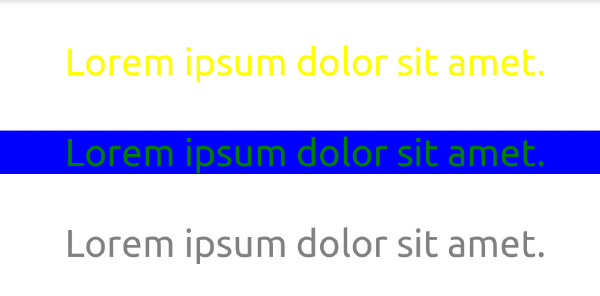
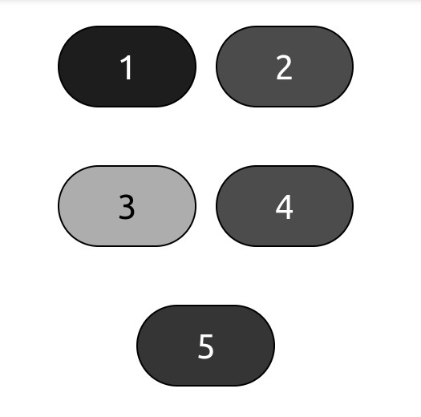
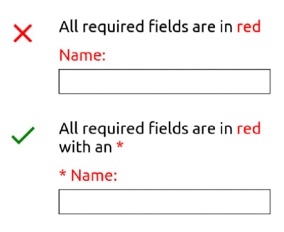

# [Accessible Colors](https://www.theodinproject.com/lessons/node-path-advanced-html-and-css-accessible-colors)

## Introduction

Although adding color to a page can make it more visually appealing, using the wrong color combination or relying solely on color to convey information can end up making things more difficult to perceive and understand for some users. This doesn't mean you have to limit yourself when choosing color schemes for a website, but it does mean you have to take extra care when actually _using_ those colors.

 

## Lesson overview

This section contains a general overview of topics that you will learn in this lesson.

- Understand what a contrast ratio is.

- Know how to check contrast ratios.

- Understand why color alone should be used to convey information.

 

## Color contrast

Can you easily read the text in all three (yes, three) examples from the image above? If you can't, then that's because the contrast ratio is too low. If you can, then consider me jealous of your eye sight, but you still need to provide an easily perceivable website for visually impaired users.

A contrast ratio is the difference in brightness between two colors expressed as a ratio. White text on a white background would have lowest ratio (1:1), while black text on a white background would have the highest (21:1). Contrast ratios refer to both normal text as well as images of text.

There are two different conformance levels for contrast ratios, both of which have rules for nornal text and large text. **Normal text** is defined as text with font size that's less than 18 points/24px (or less than 14 points/18.66 px for bold text), and **large text** is defined as text with a font size that is at least 18 points/24px (or at least 14 points/18.66 for bold text).

1. **Level AA** (minimum) requires a contrast ratio of at least 4.5:1 for normal text and 3:1 for large text.

2. **Level AAA** (enhanced) requires a contrast ratio of at least 7:1 for normal text and 4.5:1 for large text.

Both conformance levels have exceptions that don't need to follow the contrast ratio rules:

- Incidental text, such as text that just _happens_ to be within an image that has other significant visual content, or text that is purely decorative.

- Text that is a part of an inactive or disabled user interface component, such as a button that is disabled and has a lowered opacity.

- Text that is part of a logo or brand name.

At this point you might be thinking, "18.66 pixels? 4.5:1? How the heck am I supposed to remember these numbers? Wait, how am I supposed to calculate the ratios in the first place!? Luckily for you, you don't have to!

[WebAIM Contrast Checker](https://webaim.org/resources/contrastchecker/) is a fantastic tool for checking contrast ratios. Just enter the HEX code of the foreground and background colors and it calculates what conformance levels, if any, the contrast ratio passes. The page also has a link for a link contrast checker, which goes over what the contrast ratio should be if a text link isn't underlined.

You can also check the contrast ratio of the text within an element using your browser's dev tools. In **Chrome**, click the "element picker" tool in the Elements tab, then hover ovwer an element on the web page. This displays a tooltip showing the contrast ratio by selecting an element with text in the Elements tab and clicking on the color picker tool for the "color" property in the Styles pane.

 

## Conveying information

Now that you know to take the contrast ratio into account when adding color for text and backgrounds, let's see if you can tell which of the buttons in the image below is red:

The answer, by the way, is button 4. The image above is simulating achromatopsia, which is also know as total color blindness. This illustrates a key point when using color: **you shouldn't use color alone to convey information**. There may be exceptions where it's necessary to only use color, but generally you want to follow this rule.

Let's look at another example. Let's say you want to create a form that has an instruction stating that required fields are indicated by red text. If a user is color blind or otherwise has difficulty telling some colors apart, having to rely solely on the color of this text can make it difficult or even impossible to perceive or operate the form. Instead of only using color, your form could indicate all required field with red text and an asterisk:

 

## Knowledge check

- ##### What is a contrast ratio?

Contrast ratio is the difference in brightness between two color expressed as a ratio.

 

- ##### What are two ways you can check a contrast ratio using dev tools?

Click the "element picker" tool in the Elements tab, then hover over an element on the web page. This displays a tooltip showing the contrast ratio under the Accessibility section. You can also view the contrast ratio by selecting an element with text in the Elements tab and clicking on the color picker tool for the "color" property in the Styles pane.

 

- ##### What should you avoid when conveying information to users?

You should avoid relying solely on colors to convey a message because some people might find it difficult or even impossible to perceive or operate.
