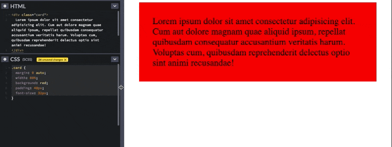
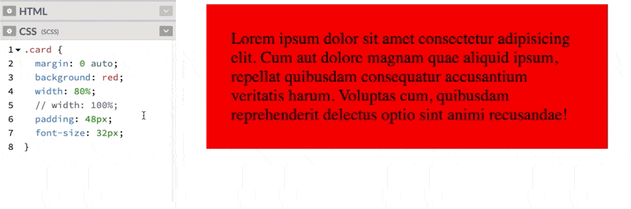
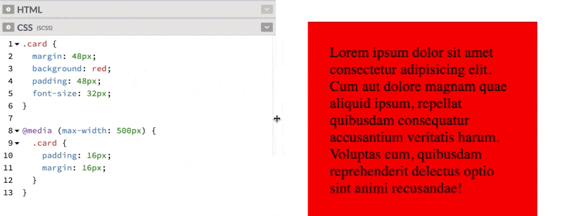
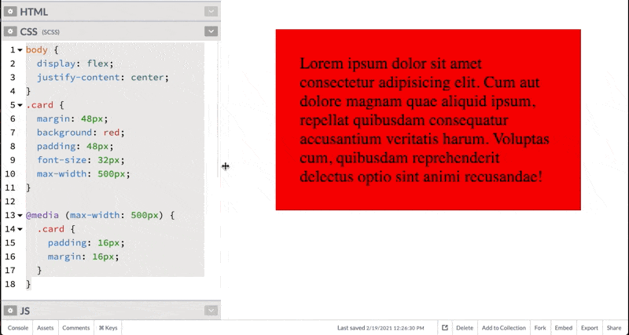

# [Natural Responsiveness](https://www.theodinproject.com/lessons/node-path-advanced-html-and-css-natural-responsiveness)

## Introduction

The first step to making responsive websites is using techniques that are _naturally_ flexible. In a later lesson you'll learn how to completely rearrange items on a page based on screen size, but in most cases, it's preferable to rely on tools like flexbox and grid to make your pages work on a wide range of screens first.

<br>

## Lesson overview

This section contains a general overview of topics that you will learn in this lesson.

- You'll learn a few tips for keeping your sites naturally responsive.

<br>

## Not everything needs CSS

Plain HTML, with no CSS is responsive. Visit this HTML-only page with no CSS and shrink your browser down to the size of a phone. It works perfectly! You could read that site on an apple watch.

It's not realistic for every website you create to be as basic as plain text on a page, but it is important to keep in mind that most of the elements you're using to build your project are responsive until **you** change that with CSS. If you approach your project with this mindset and do your best to maintain that natural responsiveness, you might that there isn't _that_ much extra need to do to make your sites properly responsive.

The rest of this lesson is a list of tips you can use to maintain natural responsiveness.

<br>

## The viewport meta tag

When mobile phones first started getting web browsers, most websites were _not_ optimized for such small screen resolutions. To get around this, most phone browsers simulated a larger screen and displayed a zoomed-out version of the page. These days, however, we almost never want that behavior so we have to specify that we want our websites to be viewed at the actual non-zoomed screen resolution.

For this reason, you should add this snippet into the `<head>` of your HTML file in just about every project you work on.

```html
<meta name="viewport" content="width-device-width, initial-scale=1" />
```

It sets the initial width of the webpage to the size of the actual screen you're viewing it on, and telling to not to zoom in or out. Easy!

You have most likely already been using this tag if you've been using Emmet to generate HTML boilerplate for you. (`!` + `ENTER`)

<br>

## Avoid fixed width and height

The number one enemy of flexibility is a fixed width on an element. If you put `width: 600px` on anything. Then it will never be able to shrink below that width, which ruins your chances of getting that thing to fit on most phone screens. Likewise, sticking a fixed height on an element can cause issues if the contents of that element run out of room.

Obviously the context will determine what works in a given situation, but an easy fix in many cases is replacing `width` or `height` with `max-width` or `min-height` (`min-width` and `max-height` are also valid and may be useful depending on the context).

In the following example, notice how the fixed width causes our div to overflow the screen! Change it to `max-width` and watch it shrink down to fit the preview screen! Click 'Fork on CodePen', then 'Save', and navigate to the 'Open Live View in a New Window' icon at the bottom to see it in full windows size. Try changing the size of the window to see how `max-width` works. When a `max-width` is defined, the element will not exceed that width but will shrink if the screen is too small to accomodate it.

[CodePen Link](https://codepen.io/TheOdinProjectExamples/pen/GRMpreM)

This example shown below demonstrates the problem with static heights. On a full-sized screen the text would fit inside the pink box just fine, but here on this cramped embed, it overflows! What we want here is for the div to be `300px` in most cases, but to grow instead of causing an overflow when the text gets cramped. In this case changing `height: 300px` to `min-height: 300px` will fix the issue.

[CodePen Link](https://codepen.io/TheOdinProjectExamples/pen/qBjxVYg)

<br>

### Avoid height altogether

In _most_ cases, you should avoid setting a height altogether. There are some exceptions to this rule (header and footers perhaps) but you should prefer using margin and padding to increase space around your content. Using margin and padding will keep your elements flexible no matter what the content inside does.

### When fixed widths are appropriate

There are cases when a fixed width is appropriate. It's hard to make a universal rule, but in general, the smaller your widths, the more accestpable it is to make them fixed. For example, a `32px` icon on your page isn't going to benefit from using `max-width` because you probably _don't_ want it to shrink. Likewise, a `250px` sidebar probably needs to _always_ be `250px`. As with anything, you need to consider your options and pick what seems to be the most appropriate.

<br>

## Use flex and grid

Here's a statement so obvious that it sounds like a joke: flexbox was _created_ to enable the creation of flexible layouts. Using flex and grid doesn't necessarily guarantee perfect responsiveness, but they are really helpful tools. You've already learned about relevant properties here, but things like `flex-wrap` and grid's `minmax`, `auto-fill` and similar properties can make some impressively responsive layouts without much extra work.

<br>

## Knowledge check

- ##### What is natural responsiveness?

Natural responsiveness is when HTML elements respond with the screen size without you having to add any CSS onto them. However, most elements are not like this and CSS is required for you to achieve your desired outcome.

<br>

- ##### Why should you avoid fixed width?

You should avoid using fixed width because your website might end up not being able to accomodate smaller viewport sizes. But, you can get away with setting fixed width the smaller the width is.

<br>

- ##### Why should you avoid fixed height?

You should avoid using fixed height because content might overflow on smaller viewport widths. Instead, you should use `min-height` to set a soft height which adjusts as content grows.

<br>

- ##### In what situations might it be appropriate to use a fixed height or width?

It might be appropriate to use a fixed height or width when you have elements that are small and require fixed sizing (such as logos).

<br>

- ##### Why should you avoid percentages?

We should avoid using percentages in CSS because the value becomes relative to another element, which may result to unpredictable alignments as the viewport size changes.

<hr>
<br>
<br>

# [Using the viewport meta element](https://developer.mozilla.org/en-US/docs/Web/HTML/Guides/Viewport_meta_element)

This article describes how to use "viewport" `<meta>` tag to control the viewport's size and shape.

<br>

## Background

The browser's viewport is the area of the window in which web content can be seen. This is often not the same size as the rendered page, in which case the browser provides scrollbars for the user to scroll around and access all the content.

Some mobile devices and other narrow screen render pages in a virtual window or viewport, which is usually wider than the screen, and then shrink the rendered result down so it can all be seen at once. Users can then zoom and pan to look more closely at different areas on the page. For example, if a mobile screen has a width of 640px, pages might be rendered with a virtual viewport of 980px, and then it will be shrunk down to fit into the 640px space.

This is done because not all pages are optimized for mobile and break (or at least look bad) when rendered at a small viewport width. This virtual viewport is a way to make non-mobile-optimized sites in general look better on narrow screen devices.

However, this mechanism is not so good for pages that are optimized for narrow screens using [media queries](https://developer.mozilla.org/en-US/docs/Web/CSS/CSS_media_queries) -- if the virtual viewport is 980px for example, media queries that kick in at 640px or 480px or less will never be used, limiting the effectiveness of such responsive design techniques. The viewport `<meta>` element mitigates this problem of virtual viewport on narrow screen devices.

<br>

## Viewport basics

The viewport is a comma-separated list of feature and value pairs. A typical mobile-optimized site contains something like the following:

```html
<meta name="viewport" content="width=device-width, initial-scale=1" />
```

Not all devices are the same width; you should make sure that your pages work well in a large variation of screen sizes and orientations.

The basic attributes of the "viewport" `<meta>` element include:

- `width`: Controls the (minimum) size of the viewport (see [viewport width and screen width](https://developer.mozilla.org/en-US/docs/Web/HTML/Guides/Viewport_meta_element#viewport_width_and_screen_width)). It can be set to a specific number of pixels like `width=600` or to the special value `device-width`, which is the physical size of the device screen in CSS pixels. This value establishes the value of the [vw](https://developer.mozilla.org/en-US/docs/Web/CSS/length#relative_length_units_based_on_viewport) unit. Minimum: `1`. Maximum: `10000`. Negative values: ignored.

- `height`: Controls the (minimum) size of the viewport (see [viewport width and screen width](https://developer.mozilla.org/en-US/docs/Web/HTML/Guides/Viewport_meta_element#viewport_width_and_screen_width)). It can be set to a specific number of pixels like `height=400` or to the special value `device-height`, which is the physical size of the device screen in CSS pixels. This value establishes the value of the [vh](https://developer.mozilla.org/en-US/docs/Web/CSS/length#relative_length_units_based_on_viewport) unit. Minimum: `1`. Maximum: `10000`. Negative values: ignored.

- `initial-scale`: Controls the zoom level when the page is first loaded. Minimum: `0.1`. Maximum: `10`. Default: `1`. Negative values: ignored.

- `minimum-scale`: Controls how much zoom out is allowed on the page. Minimum: `0.1`. Maximum: `10`. Default: `0.1`. Negative values: ignored.

- `maximum-scale`: Controls how much zoom in is allowed on the page. Any value less than 3 fails accessibility. Minimum: `0.1`. Maximum: `10`. Default: `10`. Negative values: ignored.

- `user-scalable`: Controls whether zoom in or zoom out actions are allowed on the page. Valid values: `0`, `1`, `yes`, or `no`. Default: `1`, which is the same as `yes`. Setting the value to `0`, which is the same as `no`, is against Web Content Accessibility Guidelines (WCAG).

- `interactive-widget`: Specifies the effect that interactive UI widgets, such as a virtual keyboard, have on the page's viewports. Valid values: `resizes-visual`, `resizes-content`, or `overlays-content`. Default: `resizes-visual`.

> **Warning:** Usage of `user-scalable=no` can cause accessibility issues to users with visual impairments such as low vision. WCAG requires a minimum of 2x scaling; however, the best practice is to enable a 5x zoom.

<br>

## Screen density

Screen resolutions have risen to the size that individual pixels are distinguishable by the human eye. For example, smartphones often have small screens with resolutions upwards of 1920-1080 pixels (~400dpi). Because of this, many browsers can display their pages in a smaller physical size by translating multiple hardware pixels for each CSS "pixel". Initially, this caused usability and readability problems on many touch-optimized websites.

On high dpi screens, pages with `initial-scale=1` will effectively be zoomed by browsers. Their text will be smooth and crisp, but their bitmap images may not take advantage of the full screen resolution. To get sharper images on these screens, web developers may want to design images - or whole layouts - at a higher scale than their final size and then scale them down using CSS or viewport properties.

The default pixel ratio depends on the display density. On a display with density less than 200dpi, the ratio is 1.0. On displays with density between 200 and 300dpi, the ratio is 1.5. For displays with density over 300dpi, the ratio is the integer floor (_density_/150dpi). Note that the default ratio is true only when the viewport scale equals 1. Otherwise, the relationship between CSS pixels and device pixels depends on the current zoom level.

<br>

## Viewport width and screen width

Sites can set their viewport to a specific size. For example, the definition `"width=320, initial-scale=1"` can be used to fit precisely onto a small phone display in portrait mode. This can cause problems when the browser renders a page at a larger size. To fix this, browsers will expand the viewport width if necessary to fill the screen at the requested scale. This is especially useful on large-screen devices.

For pages that set an initial or maximum scale, this means the `width` property actually translates into a _minimum_ viewport width. For example, if your layout needs at least 500 pixels of width then you can use the following markup. When the screen is more than 500 pixels wide, the browser will expands the viewport (rather than zoom in) to fit the screen:

```html
<meta name="viewport" content="width=500, initial-scale=1" />
```

Other attributes that are available are `minimum-scale`, `maximum-scale,` and `user-scalable`. These properties affect the initial scale and width, as well as limiting changes in zoom level.

<br>

## The effect of interactive UI widgets

Interactive UI widgets of the browser can influence the size of the page's viewports. The most common such UI widget is a virtual keyboard. To control which resize behavior the browser should use, set the `interactive-widget` property.

Allowed values are:

`resizes-visual`: The [visual viewport](https://developer.mozilla.org/en-US/docs/Glossary/Visual_Viewport) gets resized by the interactive widget.

`resizes-content`: The [viewport](https://developer.mozilla.org/en-US/docs/Glossary/Viewport) gets resized by the interactive widget.

`overlays-content`: Neither the viewport nor the visual viewport gets resized by the interactive widget.

```html
<meta name="viewport" content="interactive-widget=resizes-content" />
```

When the viewport gets resized, the initial containing block also gets resized, thereby affecting the computed size of viewport units.

<br>

## Common viewport sizes for mobiles and tablet devices

If you want to know what mobile and tablet devices have which viewport widths, there is a comprehensive list of [mobile and tablet viewport sizes here](https://experienceleague.adobe.com/en/docs/target/using/experiences/vec/mobile-viewports). This gives information such as viewport width on portrait and landscape orientation as well as physical screen size, operating system and the pixel density of the device.

<hr>
<br>
<br>

# [Using Percentages in CSS](https://codyloyd.com/2021/percentages/)

This series of posts addresses a few of the most common misconceptions I see in "Responsive CSS." This post covers the pitfalls associated with using percentages to define the size of various elements. I'm not trying to say that you'll never want to use percentages again, but as you'll see, in many of the places where you might want to reach for them, there is likely a better solution!

<br>

## Responsive?

Quick definition: when I say "responsive" what I mean is that whatever you're styling should look nice on the range of viewports and orientations that you intend to support. In most cases that means things should look fine everything from ultrawide monitors to the smallest popular smartphones in use. (the iPhone 5 is probably the smallest phone that is still getting a fair amount of use... its viewport is 320px wide). If you're working on a webapp that is specifically never going to be viewed on phones then these requirements are going to be a little different!

What I **do NOT** mean is that your views should look identical on every screen size. In fact, that would actually be problematic in a few ways. For example, the proportions of your header, footer, and the main content of your site that looks nice on a phone screen will be quite different from what people expect to see on a normal desktop monitor. A perfectly readable font-size on a normal monitor would have to be scaled down to fit within the same layout on a tiny screen, probably enough that it would be unreadable.

Generally, it's intended that there will be some things that change between screen sizes. Some text will overflow. Margins and paddings might need to be adjusted etc. This is all fine.

<br>

## Percentages

You probably don't want to use percentages to size things, even though it's a fairly common bit of advice on the Internet. The basic thought process I've seen is something like the following:

> _I want this thing to respond to the browser's width or height, so what I need here is to make the dimensions of my element a percentage so that it's flexible and responsive!_

The truth: _most_ elements are already responsive to the viewport, even without using percentages. Consider this code and the gif that follows:

```css
.card {
	margin: 0 auto;
	width: 80%;xx
	background: red;
	padding: 48px;
	font-size: 32px;
}
```



Obviously, this kind of works... but it's probably not the best way to solve the problem. One issue here is that as the screen size changes, the margin to either side of the card also changes, leading to some less-than-aesthetically pleasing combinations. Generally, things look nice when the margin outside of an element and the padding inside the element is either the same or related. In this example, however, the card's padding (the space between the words and the edge of the card) stays static while the margin changes.

<br>

## Solutions

You do not need the percentage rule to make this card responsive. If you simply remove the width rule, most html elements will expand horizontally to fill 100% of the horizontal space. (For what it's worth, this behavior is _not_ the same as sticking `width: 100%` on it. Notice the horizontal overflow in the example.)



#### OK BUT I DON'T WANT IT TO BE FULL WIDTH.

I know... but rather than using a percentage to define the width of the element, use a static margin. It'll still be responsive but will look much nicer at most screen-sizes. If you _want_ the thing to have a smaller margin on smaller screens, that's a perfect time to use a breakpoint.

```css
.card {
	margin: 48px;
	background: red;
	padding: 48px;
	font-size: 32px;
}

@media (max-width: 500px) {
	.card {
		padding: 16px;
		margin: 16px;
	}
}
```



One more great addition here is a max-width so that the element won't exceed a certain width even on huge screens. This is much more aesthetically pleasing and consistent than the percentages or adding another breakpoint (padding: 512px) for wide screens. Because we want a margin on the element, we can no longer rely on `margin: auto` to center it... but there are many ways to center things in CSS. I like flexbox:

```css
body {
	display: flex;
	justify-content: center;
}

.card {
	margin: 48px;
	background: red;
	padding: 48px;
	font-size: 32px;
	max-width: 500px;
}

@media (max-width: 500px) {
	.card {
		padding: 16px;
		margin: 16px;
	}
}
```



There are obviously cases where using a percentage is the right choice. In particular, using something like `height: 100%` to make a child component fill the entire height of its parent can be useful, as can `width: 100%` for elements that do not expand by default. (General rule: block-level elements expand, inline elements do not.) As a rule of thumb, however, percentages are less useful than other techniques. Setting up evenly spaced columns, another place where percentages are commonplace is better done with flexbox or grid... you don't even have to do the math to keep everything lined up.

<hr>
<br>
<br>

# [minmax() in auto-fill repeating tracks](https://gridbyexample.com/examples/example28/)

In this example I am creating a grid that contains as many 200 pixel column tracks as will fit into the container with the remaining space shared equally between the columns. In the `minmax()` function the first value is the minimum size I want my tracks to be, the second is the maximum. By using `1fr` as the maximum value, the space is equally distributed.

[CodePen Link](https://codepen.io/rachelandrew/pen/GZQYOL)
