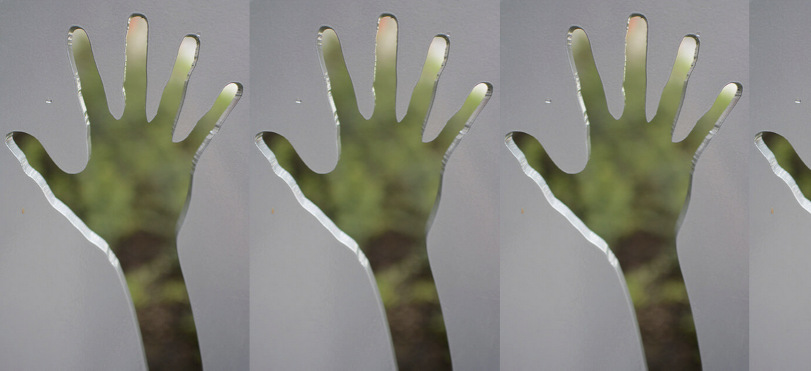
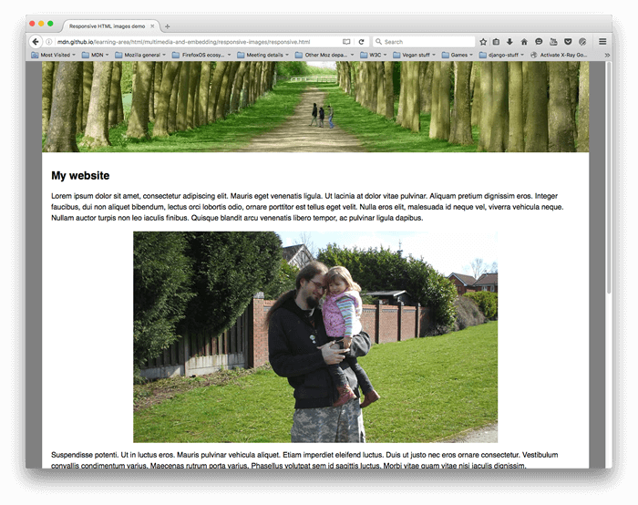

# [Responsive Images](https://www.theodinproject.com/lessons/node-path-advanced-html-and-css-responsive-images)

## Introduction

Images require special care on responsive websites. This lesson prevents a few issues that arise when working with responsive images and the options you have when dealing with them.

<br>

## Lesson Overview

This section contains a general overview of topics that you will learn in this lesson.

- You'll learn how to make your images behave properly when resizing them with CSS.

- You'll learn how to serve up different images based on screen size.

<br>

## The basics

The most basic problem you are going to face when working with responsive images is the aspect ratio or the relationship between width and height. If you shrink the width of an image on smaller screens and do not manipulate the height, the image will appear distorted!

The solution to this issue is incredibly easy, and we've already mentioned it in an earlier lesson: don't define both a width and a height. If an image is given a flexible width, the height is set to `auto`, then it should retain its aspect ratio correctly.

<br>

## `background-size`, `background-position` and `object-fit`

What if you don't want your image to shrink (in both height and width)? `background-size` and `object-fit` are two properties that can provide a little more flexibility (pun intended) with how aspect ratios are handled.

`background-position` and `background-size` are properties that work on elements with a background image, and do not work on normal `img` tags. You'll see some examples and specifics in the reading assignment later, but you can get quite a lot of control over the display and placement of background images by working with these properties. For example, `background-position: center` will make sure the image is always centered in its container, even if the container is too small to fit the whole image. `background-size: cover` will resize the image so that it is always completely filling its container while cropping as little as possible.

Here's a little demo you can play with:

[CodePen Link](https://codepen.io/TheOdinProjectExamples/pen/powxJXV)

`object-fit` works similarly, but is meant for `img` tags. With the `object-fit` property you _can_ specify a width and height for your images and then tell an image how it is supposed to fit itself to those dimentions. The default value for `object-fit` is `fill`, which stretches the image to fit the dimensions, but much like the `background-size` you can also tell it to `cover` or `contain` the image.

Here's a demo of `object-fit` on an image. Open this one up on CodePen and resize the browser to see how the image reacts.

[CodePen Link](https://codepen.io/TheOdinProjectExamples/pen/NWgOGGX)

<br>

## Even more control!

It is also possible to literally use _different_ images for different screen sizes. This gives you the most control over exactly how your images are displayed at various resolutions. For example, instead of just trusting `object-fit` to keep the subject of a photograph in a frame, you could present a cropped version of it on smaller screens. There are two ways of achieving this, but the most flexible is using the `<picture>` tag, which you'll learn more about in the assignment.

<br>

## Knowledge check

- ##### What is the main difference between `object-fit` and `background-size`?

The main difference between `object-fit` and `background-size` is the way they handle the sizing of images.

`object-fit` is used on the `img` element and controls how the image is scaled within its container. It can take values such as `fill`, `contain`, `cover`, `none`, and `scale-down`, which determine how the image is resized to fit its container.

`background-size`, on the other hand, is used on elements with a background image and controls how the background image is scaled within its container. It can take values such as `auto`, `cover`, `contain`, and specific width and height values.

The key difference is that `object-fit` is used on the `img` element, which is a replaced element, meaning that the image is loaded and rendered by the browser as a separate entity. `background-size`, on the other hand, is used on elements with a background image, which is a different rendering context.

In general, if you're working with an `img` element, you would use `object-fit` to control its sizing. If you're working with a background image, you would use `background-size`.

<br>

- ##### How can you define a width and a height on an `img` without distorting it?

If you define the width, your height must be auto. And if you define the height, the width must be auto.

<br>

- ##### Why would you want to provide different images at different screen resolutions?

You would want to provide different images at different screen resolutions because a zoomed out image on smaller screens would lose the subject you're trying to show the user. And a zoomed in photo is also not appropriate for large screen reoslutions given than you have the option to use the zoomed out version.

<br>

- ##### When would you want to use an `img` with a `srcset` vs a `picture`?

`img@srcset` is used to serve the same image in different resolutions for different screen resolutions and pixel density ratio. And a `picture` is used to show different photos for different resolutions, which solves the "art direction" problem.

<hr>
<br>
<br>

# [`background-size`](https://developer.mozilla.org/en-US/docs/Web/CSS/background-size)

The `background-size` CSS property sets the size of the element's background image. The image can be left to its natural size, stretched, or constrained to fit the available space.

<br>

## Try it

#### CSS Demo: `background-size`

```css
background-size: contain;
```



```css
background-size: contain;
background-repeat: no-repeat;
```


```css
background-size: cover;
```


```css
background-size: 30%;
```


```css
background-size: 200px 100px;
```

Spaces not covered by a background image are filled with the `background-color` property, and the background color will be visible behind background images that have transparency/translucency.

<br>

## Syntax

```css
/* Keyword values */
background-size: cover;
background-size: contain;

/* One-value syntax */
/* the width of the image (height becomes 'auto') */
background-size: 50%;
background-size: 3.2em;
background-size: 12px;
background-size: auto;

/* Two-value syntax */
/* first value: width of the image, second value: height */
background-size: 50% auto;
background-size: 3em 25%;
background-size: auto 6px;
background-size: auto auto;

/* Multiple backgrounds */
background-size: auto, auto; /* Not to be confused with `auto auto` */
background-size: 50%, 25%, 25%;
background-size: 6px, auto, contain;

/* Global values */
background-size: inherit;
background-size: initial;
background-size: revert;
background-size: revert-layer;
background-size: unset;
```

The `background-size` property is specified in one of the following ways:

- Using the keyword values `contain` or `cover`.

- Using a width value only, in which case the height defaults to `auto`.

- Using both a width and a height value, in which case the first sets the width and the second sets the height. Each value can be a `<length>`, a `<percentage>`, or `auto`.

To specify the size of multiple background images, separate the value for each one with a comma.

<br>

## Values

`contain` - Scales the image as large as possible within its container without cropping or stretching the image. If the container is larger than the image, this will result in image tiling, unless the `background-repeat` property is set to `no-repeat`.

`cover` - Scales the image (while preserving its ratio) to the smallest possible size to fill the container
(that is: both its height and width completely _cover_ the container), leaving no empty space. If the proportions of the background differ from the element, the image is cropped either vertically or horizontally.

`auto` - Scales the background image in the corresponding direction such that its intrinsic proportions are maintained.

`<length>` - Stretches the image in the corresponding dimension to the specified length. Negative values are not allowed.

`<percentage>` - Stretches the image in the corresponding dimension to the specified percentage of the _background positioning_ area. The background positioning area is determined by the value of `background-origin` (by default, the padding box). However, if the background's `background-attachment` value is `fixed`, the positioning area is instead the entire viewport. Negative values are not allowed.

<br>

## Intrinsic dimensions and proportions

The computation of values depends on the image's intrinsic dimensions (width and height) and intrinsic proportions (width-to-height ratio). These attributes are as follows:

- A bitmap image (such as JPG) always has intrinsic dimensions and proportions.

- A vector image (such as SVG) does not necessarily have intrinsic dimenions. If it has both horizontal and vertical intrinsic dimensions, it also has intrinsic proportions. If it has no dimensions or only one dimension, it may or may not have proportions.

- CSS `<gradient>`s have no intrinsic dimensions or intrinsic proportions.

- Background images created with the `element()` function use the intrinsic dimensions and proportions of the generating element.

> **Note:** In Gecko, background images created using the `element()` function are currently treated as images with the dimensions of the element, or of the background positioning area if the element is SVG, with the corresponding intrinsic proportion. This is non-standard bevahior.

Based on the intrinsic dimensions and proportions, the rendered size of the backgorund image is computed as follows:

- **If both components of `background-size` are specified and are not `auto`**: The background image is rendered at the specified size.

- **If the `background-size` is `contain` or `cover`**: While preserving its intrinsic proportions, the image is rendered at the largest size contained within, or covering, the background positioning area. If the image has no intrinsic proportions, then it's rendered at the size of the background positioning area.

- **If the `background-size` is `auto` or `auto auto`**:

  - If the image has both horizontal and vertical intrinsic dimensions, it's rendered at that size.

  - If the image has no intrinsic dimensions and has no intrinsic proportions, it's rendered at the size of the background positioning area.

  - If the image has no intrinsic dimensions but has intrinsic proportions, it's rendered as if `contain` had been specified instead.

  - If the image has only one intrinsic dimension and has intrinsic proportions, it's rendered at the size corresponding to that one dimension. The other dimension is computed using the specified dimension and the intrinsic proportions.

  - If the image has only one intrinsic dimension but has no intrinsic proportions, it's rendered using the specified dimension and the other dimension of the background positioning area.

  > **Note:** SVG images have a `preserveAspectRatio` attribute that defaults to the equivalent of `contain`; an explicit `background-size` causes `preserveAspectRatio` to be ignored.

- **If the `background-size` has one `auto` component and one non-`auto` component**:

  - If the image has intrinsic proportions, it's stretched to the specified dimension. The unspecified dimension is computed using the specified dimension and the intrinsic proportions.

  - If the image has no intrinsic proportions, it's stretched to the specified dimension. The unspecified dimension is computed using the image's corresponding intrinsic dimension, if there is one. If there is no such intrinsic dimension, it becomes the corresponding dimension of the background positioning area.

> **Note:** Background sizing for vector images that lack intrinsic dimensions or proportions is not yet fully implemented in all browsers. Be careful about relying on the behavior described above, and test in multiple browsers to be sure the results are acceptable.

<br>

## Formal definition

|                |                                                                         |
| -------------- | ----------------------------------------------------------------------- |
| Initial value  | auto auto                                                               |
| Applies to     | all elements. It also applies to `::first-letter` and `::first-line`.   |
| Inherited      | no                                                                      |
| Percentages    | relative to the background positioning area                             |
| Computed value | as specified, but with relative lengths converted into absolute lengths |
| Animation type | a repeatabke list                                                       |

<br>

## Formal syntax

```
background-size =
  <bg-size>#

<bg-size> =
  [ <length-percentage [0, ∞]> | auto ]{1,2}   |
  cover                                        |
  contain

<length-percentage> =
  <length>    |
  <percentage>
```

Sources: [CSS Backgrounds and Borders Module Level 3](https://drafts.csswg.org/css-backgrounds-3/), [CSS Values and Units Module Level 4](https://drafts.csswg.org/css-values-4/)

<br>

## Examples

### Tiling a large image

Let's consider a large image, a 2982x2808 Firefox logo image. We want to tile four copies of this image into 300x300-pixel element. To do this, we can use a fixed `background-size` value of 150 pixels.

#### HTML

```html
<div class="tiledBackground"></div>
```

#### CSS

```css
.tiledBackground {
	background-image: url(https://www.mozilla.org/media/img/logos/firefox/logo-quantum.9c5e96634f92.png);
	background-size: 150px;
	width: 300px;
	height: 300px;
	border: 2px solid;
	color: pink;
}
```

#### Result


See [Resizing background images](https://developer.mozilla.org/en-US/docs/Web/CSS/CSS_backgrounds_and_borders/Resizing_background_images) for more examples.

<hr>
<br>
<br>

# [`background-position`](https://developer.mozilla.org/en-US/docs/Web/CSS/background-position)

The `background-position` CSS property sets the initial position for each background image. The position is relative to the position layer set by `background-origin`.

<br>

## Try it

```css
background-position: top;
```


```css
background-position: left;
```


```css
background-position: center;
```


```css
background-position: 25% 75%;
```


```css
background-position: bottom 50px right 100px;
```


```css
background-position: right 35% bottom 45%;
```


<br>

## Syntax

```css
/* Keyword values */
background-position: top;
background-position: bottom;
background-position: left;
background-position: right;
background-position: center;

/* <percentage> values */
background-position: 25% 75%;

/* <length> values */
background-position: 0 0;
background-position: 1cm 2cm;
background-position: 10ch 8em;

/* Multiple images */
background-position: 0 0, center;

/* Edge offsets values */
background-position: bottom 10px right 10px;
background-position: right 3em bottom 10px;
background-position: bottom 10px right;
background-position: top right 10px;

/* Global values */
background-position: inherit;
background-position: initial;
background-position: revert;
background-position: revert-layer;
background-position: unset;
```

The `background-position` property is specified as one or more `<position>` values, separated by commas.

<br>

## Values

`<position>` - A [`<position>`](https://developer.mozilla.org/en-US/docs/Web/CSS/position_value). A position defines an x/y coordinate, to place an item relative to the edges of an element's box. It can be defined using one to four values. If two non-keyword values are used, the first value represents the horizontal position and the second represents the vertical position. If only one value is specified, the second value is assumed to be `center`. If three or four values are used, the length-percentage values are offsets for the preceding keyword value(s).

**1-value syntax**: The value may be:

- The keyword value `center`, which centers the image.

- One of the keyword values `top`, `left`, `bottom`, or `right`. This specifies an edge against which to place the item. The other dimension is then set to 50%, so the item is placed in the middle of the edge specified.

- A `<length>` or `<percentage>`. This specifies the X coordinate relative to the left edge, with the Y coordinate set to 50%.

**2-value syntax**: One value defines X and the other defines Y. Each value may be:

- One of the keyword values `top`, `left`, `bottom`, or `right`. If `left` or `right` is given, then this defines X and the other given value defines Y. If `top` or `bottom` is given, then this defines the Y and the other value defines X.

- A `<length>` or `<percentage>`. If the other value is `left` or `right`, then this value defines Y, relative to the top edge. If the other value is `top` or `bottom`, then this value defines X, relative to the left edge. If both values are `<length>` or `<percentage>` values, then the first defines X and the second Y.

- Note that: If one value is `top` or `bottom`, then the other value may not be `top` or `bottom`. If one value is `left` or `right`, then the other value may not be `left` or `right`. This means, e.g., that `top top` and `left right` are not valid.

- Order: When pairing keywords, placement is not important as the browser can reorder it; the values `top left` and `left top` will yield the same result. When pairing `<length>` or `<percentage>` with a keyword, the placement is important: the value defining X should come first followed by Y, so for example the value `right 20px` is valid while `20px right` is invalid. The values `left 20%` and `20% bottom` are valid as X and Y values are clearly defined and the placement is correct.

- The default value is `left top` or `0% 0%`.

**3-value syntax**: Two values are keyword values, and the third is the offset for the preceding value:

- The first value is one of the keyword values `top`, `left`, `bottom`, `right`, or `center`. If `left` or `right` are given here, then this defines X. If `top` or `bottom` are given, then this defines Y and the other keyword value defines X.

- The `<length>` or `<percentage>` value, if it is the second value, is the offset for the first value. If it is the third value, it is the offset for the second value.

- The single length or percentage value is an offset for the keyword value that precedes it. The combination of one keyword with two `<length>` or `<percentage>` values is not valid.

**4-value syntax**: The first and third values are keyword values defining X and Y. The second and fourth values are offsets for the preceding X and Y keyword values:

- The first and third values are equal to one of the keyword values `top`, `left`, `bottom`, or `right`. If `left` or `right` is given for the first value, then this defines X and the other value defines Y. If `top` or `bottom` is given for the first value, then this defines Y and the other keyword value defines X.

- The second and fourth values are `<length>` or `<percentage>` values. The second value is the offset for the first keyword. The fourth value is the offset for the second keyword.

<br>

## Regarding Percentages

The percentage offset of the given background image's position is relative to the container. A value of 0% means that the left (or top) edge of the background image is aligned with the corresponding left (or top) edge of the container, or the 0% mark of the image will be on the 0% mark of the container. A value of 100% means that the _right_ (or _bottom_) edge of the background image is alrighted with the _right_ (or _bottom_) edge of the container, or the 100% mark of the image will be on the 100% mark of the container. Thus a value of 50% horizontally or vertically centers the image as the 50% of the image will be at the 50% mark of the container. Similarly, `background-position: 25% 75%` means the spot on the image that is 25% from the left and 75% from the top will be placed at the spot of the container that is 25% from the container's left and 75% from the container's top.

Essentially what happens is the background image dimension is _subtracted_ from the corresponding container dimension, and then a percentage of the resulting value is used as the direct offset from the left (or top) edge.

```
(container width - image width) * (position x%) = (x offset value)
(container height - image height) * (position y%) = (y offset value)
```

Using the X axis for an example, let's say we have an image that is 300px wide and we are using it in a container that is 100px wide, with `background-size` set to auto:

```
100px - 300px = -200px (container & image difference)
```

So that with position percentages of -25%, 0%, 50%, 100%, 125%, we get these image-to-container edge offset values:

```
-200px * -25% = 50px
-200px * 0% = 0px
-200px * 50% = -100px
-200px * 100% = -200px
-200px * 125% = -250px
```

So with these resultant values for our example, the **left edge** of the **image** is offset from the **left edge** of the **container** by:

- - 50px (putting the left image edge in the center of the 100-pixel-wide container)

- 0px (left image edge coincident with the left container edge)

- -100px (left image edge 100px to the left of the container, in this example that means the middle 100px image area is centered in the container)

- -200px (left image edge 200px to the left of the container, in this example that means the right image edge is coincident with the right container edge)

- -250px (left image edge 250px to the left of the container, in this example that puts the right edge of the 300px-wide image in the center of the container)

It's worth mentioning that if your `background-size` is equal to the container size for a given axis, then a _percentage_ position for that axis will have no effect because the "container-image difference" will be zero. You will need to offset using absolute values.

<br>

## Formal definition

|                |                                                                                                                                                                                                                                                                                                                                                                                            |
| -------------- | ------------------------------------------------------------------------------------------------------------------------------------------------------------------------------------------------------------------------------------------------------------------------------------------------------------------------------------------------------------------------------------------ |
| Initial value  | 0% 0%                                                                                                                                                                                                                                                                                                                                                                                      |
| Applies to     | all elements. It also applies to `::first-letter` and `::first-line`.                                                                                                                                                                                                                                                                                                                      |
| Inherited      | no                                                                                                                                                                                                                                                                                                                                                                                         |
| Percentages    | refer to the size of the background positioning area minus size of the background image; size refers to the width for horizontal offsets and to the height for vertical offsets                                                                                                                                                                                                            |
| Computed value | as each of the properties of the shorthand: <ul><li>`background-position-x` : A list, each item consisting of: an offset given as a combination of an absolute length and a percentage, plus an origin keyword</li><li>`background-position-y`: A list, each item consisting of: an offset given as a combination of an absolute length and a percentage, plus an origin keyword</li></ul> |
| Animation type | a repeatable list                                                                                                                                                                                                                                                                                                                                                                          |

<br>

## Formal syntax

```
background-position =
  <bg-position>#

<bg-position> =
  [ left | center | right | top | bottom | <length-percentage> ] |
  [ left | center | right | <length-percentage> ] [ top | center | bottom | <length-percentage> ] |
  [ center | [ left | right ] <length-percentage>? ] && [ center | [ top | bottom ] <length-percentage>? ]

<length-percentage> =
  <length>    |
  <percentage>
```

Sources: [CSS Backgrounds and Borders Module Level 3](https://drafts.csswg.org/css-backgrounds-3/), [CSS Values and Units Module Level 4](https://drafts.csswg.org/css-values-4/)

<br>

## Examples

### Positioning background images

Each of these background examples uses the [`background`](https://developer.mozilla.org/en-US/docs/Web/CSS/background) property to create a yellow, rectangular element containing a star image. In each example, the star is in a different position. The third example illustrates how to specify positions for two different background images within one element.

#### HTML

```html
<div class="example-one">Example One</div>
<div class="example-two">Example Two</div>
<div class="example-three">Example Three</div>
```

#### CSS

```css
/* Shared among all <div>s */
div {
	background-color: #ffee99;
	background-repeat: no-repeat;
	width: 300px;
	height: 80px;
	margin-bottom: 12px;
}

/* These examples use the `background` shorthand property */
.example-one {
	background: url("star-transparent.gif") #ffee99 2.5cm bottom no-repeat;
}

.example-two {
	background: url("star-transparent.gif") #ffee99 left 4em bottom 1em no-repeat;
}

/* Multiple background images: Each image is matched with the corresponding position,
   from first specified to last. */
.example-three {
	background-image: url("star-transparent.gif"), url("cat-front.png");
	background-position: 0px 0px, right 3em bottom 2em;
}
```

#### Result


<hr>
<br>
<br>

# [`object-fit`](https://developer.mozilla.org/en-US/docs/Web/CSS/object-fit)

The `object-fit` CSS property sets how the content of a replaced element, such as an `` or `<video>`, should be resized to fit its container.

> **Note:** The `object-fit` property has no effect on `<iframe>`, `<embed>`, and `<fencedframe>` elements.

You can alter the alignment of the replaced element's content object within the element's box using the `object-position` property.

<br>

## Try it

```css
object-fit: fill;
```


```css
object-fit: contain;
```


```css
object-fit: cover;
```


```css
object-fit: none;
```


```css
object-fit: scale-down;
```


<br>

## Syntax

```css
object-fit: contain;
object-fit: cover;
object-fit: fill;
object-fit: none;
object-fit: scale-down;

/* Global values */
object-fit: inherit;
object-fit: initial;
object-fit: revert;
object-fit: revert-layer;
object-fit: unset;
```

The `object-fit` property is specified as a single keyword chosen from the list of values below.

<br>

## Values

`contain` - The replaced content is scaled to maintain its aspect ratio while fitting within the element's content box. The entire object is made to fill the box, while preserving its aspect ratio, so the object will be ["letterboxed"](<https://en.wikipedia.org/wiki/Letterboxing_(filming)>) or ["pillarboxed"](https://en.wikipedia.org/wiki/Pillarbox) if its aspect ratio does not match the aspect ratio of the box.

`cover` - The replaced content is sized to maintain its aspect ratio while filling the element's entire content box. If the object's aspect ratio does not match the aspect ratio of its box, then the object will be clipped to fit.

`fill` - The replaced content is sized to fill the element's content box. The entire object will completely fill the box. If the object's aspect ratio does not match the aspect ratio of its box, then the object will be stretched to fit.

`none` - The replaced content is not resized.

`scale-down` - The content is sized as if `none` or `contain` were specified, whiever would result in a smaller concrete object size.

<br>

## Formal definition

|                |                   |
| -------------- | ----------------- |
| Initial value  | fill              |
| Applies to     | replaced elements |
| Inherited      | no                |
| Computed value | as specified      |
| Animation type | discrete          |

<br>

## Formal syntax

```
object-fit =
  fill      |
  contain   |
  cover     |
  none      |
  scale-down
```

Sources: [CSS Images Module Level 3](https://drafts.csswg.org/css-images-3/)

<br>

## Examples

### Setting object-fit for an image

#### HTML

```html
<section>
	<h2>object-fit: fill</h2>
	
	

	<h2>object-fit: contain</h2>
	
	

	<h2>object-fit: cover</h2>
	
	

	<h2>object-fit: none</h2>
	
	

	<h2>object-fit: scale-down</h2>
	
	
</section>
```

#### CSS

```css
h2 {
	font-family: Courier New, monospace;
	font-size: 1em;
	margin: 1em 0 0.3em;
}

img {
	width: 150px;
	height: 100px;
	border: 1px solid #000;
	margin: 10px 0;
}

.narrow {
	width: 100px;
	height: 150px;
}

.fill {
	object-fit: fill;
}

.contain {
	object-fit: contain;
}

.cover {
	object-fit: cover;
}

.none {
	object-fit: none;
}

.scale-down {
	object-fit: scale-down;
}
```

#### Result


<hr>
<br>
<br>

# [Using responsive images in HTML](https://developer.mozilla.org/en-US/docs/Web/HTML/Guides/Responsive_images)

In this article, we'll learn about the concept of responsive images -- images that work well on devices with widely differing screen sizes, resolutions, and other such features -- and look at what tools HTML provides to help implement them. This helps to improve performance across different devices.

<br>

## Why responsive images?

Let's examine a typical scenario. A typical website may contain a header image and some content images below the header. The header image will likely span the whole of the width of the header, and the content image will fit somewhere inside the content column. Here's an example:



This works well on a wide screen device, such as a laptop or desktop (you can [see the example live](https://mdn.github.io/learning-area/html/multimedia-and-embedding/responsive-images/not-responsive.html) and find the [source code](https://github.com/mdn/learning-area/blob/main/html/multimedia-and-embedding/responsive-images/not-responsive.html) on GitHub.) We won't discuss the CSS much in this lesson, except to say that:

- The body content has been set to a maximum width of 1200 pixels -- in viewports above that width, the body remains at 1200px and centers itself in the available space. In viewports below that width, the body will stay at 100% of the width of the viewport.

- The header image has been set so that its center always stays in the center of the header, no matter what width the heading is set at. If the site is being viewed on a narrower screen, the important detail in the center of the image (the people) can still be seen, and the excess is lost off either size. It is 200px high.

- The content images have been set that if the body element becomes smaller than the image, the images start to shrink so that they always stay inside the body, rather than overflowing it.

However, issues arise when you start to view the site on a narrow screen device. The header below looks OK, but it's starting to take up a lot of the screen height for a mobile device. And at this size, it is difficult to see faces of the two people within the first content image.


An improvement would be to display a cropped version of the image which displays the important details of the image when the site is viewed on a narrow screen. A second cropped image could be displayed for a medium-width screen device, like a tablet. The general problem whereby you want to serve different cropped images in that way, for various layouts, is commonly known as the **art direction problem**.

In addition, there is no need to embed such large images on the page if it is being viewed on a mobile screen. Doing so can waste bandwidth; in particular, mobile users don't want to waste bandwidth by downloading a large image intended for desktop users, when a small image would do for their device. Conversely, a small raster image starts to look grainy when displayed larger than its original size (a raster image is a set number of pixels wide and a set number of pixels tall). Ideally, multiple resolutions would be made available to the user's web browser. The browser could then determine the optimal resolution to load based on the screen size of the user's device. This is called the **resolution switching problem**.

To make things more complicated, some devices have high resolution screens that need larger images than you might expect to display nicely. This is essentially the same problem, but in a slightly different context.

You might think that vector images would solve these problems, and they do to a certain degree -- they are small in file size and scale well, and you should use them whenever possible. However, they aren't suitable for all image types. Vector images are great for simple graphics, patterns, interface elements, etc., but it starts to get very complex to create a vector-based image with the kind of detail that you'd find in say, a photo. Raster image formats such as JPEGs are more suited to the kind of images we see in the above example.

This kind of problem didn't exist when the web first existed, in the early to mid 90s -- back then the only devices in existence to browse the Web were desktops and laptops, so browser engineers and spec writers didn't even think to implement solutions. _Responsive image technologies_ were implemented recently to solve the problems indicated above by letting you offer the browser several image files, either all showing the same thing but containing different numbers of pixels (_resolution switching_) or different images suitable for different space allocations (_art direction_).

> **Note:** The new feature discussed in this article -- `srcset` / `sizes` / `<picture>` -- are all supported in modern desktop and mobile browsers.

<br>

## How do you create responsive images?

In this section, we'll look at the two problems illustrated above and show how to solve them using HTML's responsive image features. You should note that we will be focusing on `` elements for this section, as seen in the content area of the example above -- the image in the site header is only for decoration, and therefore implemented using CSS background images. [CSS arguably has better tools for responsive design](https://cloudfour.com/thinks/responsive-images-101-part-8-css-images/) than HTML, and we'll talk about those feature in a future CSS module.

<br>

### Resolution switching: Different sizes

So, what is the problem that we want to solve with resolution switching? We want to display identical image content, just larger or smaller depending on the device -- this is the situation we have with the second content image in our example. The standard `` element traditionally only lets you point the browser to a single source file:

```html

```

We can however use two attributes -- `srcset` and `sizes` -- to provide several additional source images along with hints to help the browser pick the right one. You can see an example of this in our [responsive.html](https://mdn.github.io/learning-area/html/multimedia-and-embedding/responsive-images/responsive.html) example on GitHub (see also the [source code](https://github.com/mdn/learning-area/blob/main/html/multimedia-and-embedding/responsive-images/responsive.html)):

```html

```

The `srcset` and `sizes` attributes look complicated, but they're not too hard to understand if you format them as shown above, with a different part of the attribute value on each line. Each value contains a comma-separated list, and each part of those lists is made up of three sub-parts. Let's run through the contents of each now:

`srcset` defines the set of images we will allow the browser to choose between, and what size each image is. Each set of image information is separated from the previous one by a comma. For each one, we write:

1. An **image filename** (`elva-fairy-480w.jpg`)

2. A space

3. The image's **intrinsic width in pixels** (`480w`) -- note that this uses the `w` unit, not `px` as you might expect. An image's intrinsic size is its real size, which can be found by inspecting the image file on your computer (for example, on a Mac you can select the image in Finder and press `Cmd` + `I` to bring up the info screen).

`sizes` defines a set of media conditions (e.g., screen widths) and indicates what image size would be best to choose, when certain media conditions are true -- these are the hints we talked about earlier. In this case, before each comma we write:

1. A **media condition** (`(max-width:600px)`) -- you'll learn more about these in the CSS topic, but for now let's just say that a media condition describes a possible state that the screen can be in. In this case, we are saying "when the viewport width is 600 pixels or less".

2. A space

3. The **width of the slot** the image will fill when the media condition is true (`480px`).

> **Note:** In `sizes`, you can use any length value. For example, rather than providing an absolute width (for example, `480px`), you can alternatively provide a width relative to the viewport (for example, `50vw`). However, you cannot use a percentage as the slot width. You may have noticed that the last slot width has no media condition (this is the default that is chosen when none of the media conditions are true). The browser ignores everything after the first matching condition, so be careful how you order the media conditions.

So, with these attributes in place, the browser will:

1. Look at screen size, pixel density, zoom level, screen orientation, and network speed.

2. Work out which media condition in the `sizes` list is the first one to be true.

3. Look at the slot size given to that media query.

4. Load the image referenced in the `srcset` list that has the same size as the slot or, if there isn't one, the first image that is bigger than the chosen slot size.

And that's it! At this point, if a supporting browser with a viewport width of 480px loads the page, the `(max-width: 600px)` media condition will be true, and so the browser chooses the `480px` slot. The `elva-fairy-480w.jpg` will be loaded, as its inherent width (`480w`) is closest to the slot size. The 800px picture is 128KB on disk, whereas the 480px version is only 63KB -- a saving of 65KG. Now, imagine if this was a page that had many pictures on it. Using this technique could save mobile browsers a lot of bandwidth.

> **Note:** When testing this with a desktop browser, if the browser fails to load the narrower images when you've got its window set to the narrowest width, have a look at what the viewport is (you can approximate it by going into the browser's JavaScript console and typing in `document.querySelector('html').clientWidth)`. Different browsers have minimum sizes that they'll let you reduce the window width to, and they might be wider than you'd think. When testing it with a mobile browser, you can use tools like Firefox's `about:debugging` page to inspect the page loaded on the mobile using the desktop developer tools.
>
> To see which images were loaded, you can use FireFox DevTools's Network Monitor tab or Chrome DevTools's Network panel. For Chrome, you may also want to disable cache to prevent it from picking already downloaded images.

Older browsers that don't support these features will just ignore them. Instead, these browsers will go ahead and load the image referenced in the `src` attribute as normal.

> **Note:** In the `<head>` of the example linked above, you'll find the line `<meta name="viewport" content="width=device-width">`: this forces mobile browsers to adopt their real viewport width for loading web pages (some mobile browsers lie about their viewport width, and instead load pages at a larger viewport width then shrink the loaded page down, which is not very helpful for responsive images or design).

<br>

### Resolution switching: Same size, different resolutions

Suppose you have an image that will be rendered at the same real-world size on displays that have different screen resolutions. You can provide a better user experience on high resolution displays by serving a higher resolution version of the image.

To achieve this you can allow the browser to choose an appropriate resolution image by using `srcset` with x-descriptors and without `sizes` -- a somewhat easier syntax! You can find an example of what this look like in [srcset-resolutions.html](https://mdn.github.io/learning-area/html/multimedia-and-embedding/responsive-images/srcset-resolutions.html) (see also [the source code](https://github.com/mdn/learning-area/blob/main/html/multimedia-and-embedding/responsive-images/srcset-resolutions.html)):

```html

```

Note that even though the image is always displayed with the same size, on higher resolution displays you get to see more details.


In this example, the following CSS is applied to the image so that it will have a width of 320 pixels on the screen (also called CSS pixels):

```css
img {
	width: 320px;
}
```

In this case, `sizes` is not needed -- the browser works out what resolution the display is that is being shown on, and serves the most appropriate image referenced in the `srcset`. So if the device accessing the page has a standard/low resolution display, with one device pixel representing each CSS pixel, the `elva-fairy-320w.jpg` image will be loaded (the 1x is implied, so you don't need to include it). If the device has a high resolution of two device pixels per CSS pixel or more, the `elva-fairy-640w.jpg` image will be loaded. The 640px image is 93KB, whereas the 320px image is only 39KB.

<br>

### Art direction

To recap, the *+*art direction problem\*\* involves wanting to change the image displayed to suit different image display sizes. For example, a web page includes a large landscape shot with a person in the middle when viewed on a desktop browser. When viewed on a mobile browser, that same image is shrunk down, making the person in the image very small and hard to see. It would probably be better to show a smaller, portrait image on mobile, which zooms in on the person. The `<picture>` element allows us to implement just this kind of solution.

Returning to our original [not-responsive.html](https://mdn.github.io/learning-area/html/multimedia-and-embedding/responsive-images/not-responsive.html) example, we have na image that badly needs art direction:

```html

```

Let's fix this, with `<picture>`! Like [`<video>` and `<audio>`](https://developer.mozilla.org/en-US/docs/Learn_web_development/Core/Structuring_content/HTML_video_and_audio), the `<picture>` element is a wrapper container several `<source>` elements that provide different sources for the browser to choose from, followed by the all-important `` element. The code in [responsive.html](https://mdn.github.io/learning-area/html/multimedia-and-embedding/responsive-images/responsive.html) looks like so:

```html
<picture>
	<source media="(max-width: 799px)" srcset="elva-480w-close-portrait.jpg" />
	<source media="(min-width: 800px)" srcset="elva-800w.jpg" />
	
</picture>
```

- The `<source>` elements include a `media` attribute that contains a media condition - as with the first `srcset` example, these conditions are tests that decide which image is shown -- the first one that returns true will be displayed. In this case, if the viewport width is 799px wide or less, the first `<souce>` element's image will be displayed. If the viewport width is 800px or more, it'll be the second one.

- The `srcset` attributes contain the path to the image to display. Just as we saw with `` above, `<source>` can take a `srcset` attribute with multiple images referenced, as well as a `sizes` attribute. So, you could offer multiple images via a `<picture>` element, but then also offer multiple resolutions of each one. Realistically, you probably won't want to do this kind of thing very often.

- In all cases, you must provide an `` element, with `src` and `alt`, right before `</picture>`, otherwise no images will appear. This provides a default case that will apply when none of the media conditions return true (you could actually remove the second `<source>` element in this example), and a fallback for browsers that don't support the `<picture>` element.

This code allows us to display a suitable image on both wide screen and narrow screen displays, as shown below:


> **Note:** You should use the `media` attribute only in art direction scenarios; when you do use `media`, don't also offer media conditions within the `sizes` attribute.

<br>

### Why can't we just do this using CSS or JavaScript?

When the browser starts to load a page, it starts to download (preload) any images before the main parser has started to load and interpret the page's CSS and JavaScript. That mechanism is useful in general for reducing page load times, but it is not helpful for responsive images -- hence the need to implement solutions like `srcset`. For example, you couldn't load the `` element, then detect the viewport width with JavaScript, and then dynamically change the source image to a smaller one if desired. By then, the original image would already have been loaded, and you would load the small image as well, which is even worse in responsive image terms.

<br>

## Active learning: Implement your own responsive images

For this active learning, we're expecting you to be brave and do it alone, mostly. We want you to implement your own suitable art-directed narrow screen/wide screenshot using `<picture>`, and a resolution switching example that uses `srcset`.

1. Write some HTML to contain your code (use `not-responsive.html` as a starting point, if you like).

2. Find a nice wide screen landscape image with some kind of detail contained in it somewhere. Create a web-sized version of it using a graphics editor, then crop it to show a smaller part that zooms in on the detail, and create a second image (about 480px wide is good for this).

3. Use the `<picture>` element to implement an art direction picture switcher!

4. Create multiple image files of different sizes, each showing the same picture.

5. Use `srcset`/`sizes` to create a resolution switcher example, either to serve the same size image at different resolutions depending on the device resolution or to serve different image sizes depending on the viewport widths.

<br>

## Summary

That's a wrap for responsive images -- we hope you enjoyed playing with these new techniques. As a recap, there are two distinct problems we've been discussing here:

- **Art direction:** The problem whereby you want to serve cropped images for different layouts -- for example a landscape image showing a full scene for a desktop layout, and a portrait image showing the main subject zoomed in for a mobile layout. You can solve this problem using the `<picture>` element.

- **Resolution switching:** The problem whereby you want to serve smaller image files to narrow-screen devices, as they don't need huge images like desktop displays do -- and to serve different resolution images to high density/low density screens. You can solve this problem using vector graphics (SVG images) and the `srcset` with `sizes` attributes.

<hr>
<br>
<br>

# [HTML Responsive Images Guide](https://css-tricks.com/a-guide-to-the-responsive-images-syntax-in-html/#using-srcset)

by Chris Coyier

This guide is about the HTML syntax for responsive images (and a little bit of CSS for good measure). We'll go over srcset and, plus a whole bunch of things to consider to help you get the best performance and design control from your images.

<br>

This guide is about the **HTML syntax** for responsive images (and a little bit of CSS for good measure). The responsive images syntax is about serving **one image** from multiple options based on rules and circumstances. There are two forms of responsive images, and they're for two different things:

If your only goal is...

**Increased Performance**

Then what you need is

```html

```

If you also need...

**Design Control**

Then what you need is...

```html
<picture>
	<source srcset="" media="" />
	<source srcset="" media="" />
	
</picture>
```

There is **a lot** of performance gain to be had by using responsive images. [Image weight has a huge impact on pages' overall performance](https://paulcalvano.com/2019-01-11-correlating-performance-metrics-to-page-characteristics/), and responsive images are one of the best things that you can do to cut image weight. Imagine the browser being able to choose between a 300x300 image or a 600x600. If the browser only needs the 300x300, **that's potentially a 4x bytes-over-the-wire savings!** Savings generally go up as the display resolution and viewport size go down; on the smallest screens, a [couple](https://timkadlec.com/2013/06/why-we-need-responsive-images/) of [case studies](https://alistapart.com/article/responsive-images-in-practice/#section4) have shown byte savings of 70-90%.

Another perfectly legit goal with responsive images is not just to serve different sizes of the same image, but to serve _different images_. For example, cropping an image differently depending on the size of the screen and differences in the layout. This is referred to as "art direction."

The `<picture>` element is also used for fallback image types and any other sort of media query switching (e.g., different images for dark mode). You get greater control of what browsers display.

<br>

There is a lot to talk about here, so let's go through both syntaxes, all of the related attributes and values, and talk about a few related subjects along the way, like tooling and browsers.

<br>

## Using `srcset`

The `` syntax is for serving differently-sized versions of the _same_ image. You could _try_ to serve entirely different images using this syntax, but browsers assume that everything in a `srcset` is visually-identical and will choose whichever size they think is best, in impossible-for-you-to-predict ways. So I wouldn't recommend it.

Perhaps the **easiest-possible** responsive images syntax is adding a `srcset` attribute with `x` descriptors on the images to label them for use on displays with different pixel-densities.

```html

```

Here, we've made the default (the `src`) the "low res" (`1x`) copy of the image. Defaulting to the smallest/fastest resources is usually the smart choice. We also provide a `2x` version. If the browser knows it is on a higher pixel-density display (the `2x` part), it will use that image instead.


[Demo on CodePen](https://codepen.io/chriscoyier/pen/wvKMGbK)

```html

```

You can do as many pixel-density variants as you like.

While this is cool and useful, [`x` descriptors only account for a small percentage of responsive images usage](https://almanac.httparchive.org/en/2019/media#use-of-html-markup). Why? They only let browsers adapat based on one thing: display pixel-density. A lot of times, though, our responsive images are on responsive layouts, and the image's _layout size_ is shrinking and stretching right along with the viewport. In those situations, the browser needs to make decisions based on _two_ things: the pixel-density of the screen, and the layout size of the image. That's where `w` descriptors and the `sizes` attribute come in, which we'll look at in the next section.

<br>

## Using `srcset`/`w`+`sizes`

This is the good stuff. [This accounts for around 85% of responsive images usage on the web.](https://almanac.httparchive.org/en/2019/media#use-of-html-markup) We're still serving the same image at multiple sizes, only we're giving the browser more information so that it can adapt based on both pixel-density _and_ layout size.

```html

```

We're still providing multiple copies of the _same_ image and letting the browser pick the most appropriate one. But instead of labeling them with a pixel density (`x`), we're labelling them with their resource width, using **`w` descriptors**. So if `baby-s.jpg` is 300x450, we label it as `300w`.

Using `srcset` with width (`w`) descriptors like this means that it will need to be paired with the `sizes` attribute so that the browser will know how large of a space the image will be displaying in. Without this information, browsers can't make smart choices.


[Demo on CodePen](https://codepen.io/chriscoyier/pen/jObVELm)

<br>

## Creating accurate `sizes`

Creating `sizes` attributes can get tricky. The `sizes` attribute describes the width that the image will display **within the layout of your specific site**, meaning it is closely tied to your CSS. The width that images render at is layout-dependent rather than just viewport dependent!

Let's take a look at a fairly simple layout with three breakpoints. Here's a GIF demonstrating this:


[Demo on CodePen](https://codepen.io/chriscoyier/pen/zYvoQEQ)

The breakpoints are expressed with media queries in CSS:

```css
body {
	margin: 2rem;
	font: 500 125% system-ui, sans-serif;
}

.page-wrap {
	display: grid;
	gap: 1rem;
	grid-template-columns: 1fr 200px;
	grid-template-areas:
		"header header"
		"main aside"
		"footer footer";
}

@media (max-width: 700px) {
	.page-wrap {
		grid-template-columns: 100%;
		grid-template-areas:
			"header"
			"main"
			"aside"
			"footer";
	}
}

@media (max-width: 500px) {
	body {
		margin: 0;
	}
}
```

The image is sized differently at each breakpoint. Here's a breakdown of all of the bits and pieces that affect the image's layout width at the largest breakpoint (when the viewport is wider than 700px):


The image is as wide as `100vw` minus all that explicitly sized `margin`, `padding`, column widths, and `gap`.

- **At the largest size:** there is 9rem of explicit spacing, so the image is `calc(100vw - 9rem - 200px)` wide. If that column used a `fr` unit instead of `200px`, we'd kinda be screwed here.

- **At the medium size:** the sidebar is dropped below, so there is less spacing to consider. Still, we can do `calc(100vw - 6rem)` to account for the margins and padding.

- **At the smallest size:** the body margin is removed, so just `calc(100vw - 2rem)` will do the trick.

_Phew!_ To be honest, I found that a little challenging to think out, and made a bunch of mistakes as I was creating this. In the end, I had this:

```html

```

A `sizes` attribute that gives the browser the width of the image across all three breakpoints, factoring in the layout grid, and all of the surrounding `gap`, `margin`, and `padding` that end up impacting the image's width.

<br>

Now wait! Drumroll!! _That's still wrong._ I don't understand why exactly, because to me that looks like it 100% describes what is happening in the CSS layout. But it's wrong because Martin Auswoger's [RespImageLint](https://github.com/ausi/respimagelint) says so. Running that tool over the [isolated demo](https://cdpn.io/chriscoyier/debug/zYvoQEQ) reports no problem except the fact that the `sizes` attribute is wrong for some viewport sizes, and should be:

```html

```

I don't know how that's calculated and it's entirely unmaintainable by hand, but, it's accurate. Martin's tool programmaticaly resizes the page a bunch and writes out a `sizes` attribute that describes the actual, observed width of the image over a wide range of viewport sizes. It's computers, doing math, so it's right. So, if you want a super-accurate `sizes` attribute, I'd recommend just putting a wrong one on at first, running this tool, and copying out the correct one.

For an even deeper dive into all this, check out Eric Portis' [`w` descriptors and `sizes`: Under the hood](https://observablehq.com/@eeeps/w-descriptors-and-sizes-under-the-hood).

<br>

## Being more chill about `sizes`

Another option is to use the Horseshoes & Hand Grenades Method TM of `sizes` (or, in other words, close counts). This come highly suggested.

For example, `sizes="(min-width: 1000px) 33vw, 96vw"` says, "This image is in a three-column layout on large screens and close to full-width otherwise." Practicality-wise, this can be a sane solution.

You might find that some automated responsive image solutions, which have no way of knowing your layout, may a guess -- somethibng like `sizes="(max-width: 1000px) 100vw, 1000px"`. This is just saying, "_Hey, we don't really know much about this layout, but we're gonna take a stay and say, worst case, the image is full-width, and let's hope it never renders larger than 1000px._"

<br>

## Abstracting `sizes`

I'm sure you can imagine how easy it is to not only get `sizes` wrong, but also have it _become_ wrong over time as layouts change on your site. It may be smart for you to abstract it using a templating language or content filter so that you can change the value across all of your images more easily.

I'm essentially talking about setting a `sizes` value in a variable once, and using that variable in a bunch of different `` elements across your site. Native HTML doesn't offer that, but any back end language does; for instance, PHP constants, Rails config variables, the React context API used for a global state variable, or variables within a templaying language like Liquid can all be used to abstract `sizes`.

```js
<?php
  // Somewhere global
  $my_sizes = "";
?>

"
/>
```

<br>

## "Browser's choice"

Now that we have a `sizes` attribute in place, the browser knows what size (or close to it) the image will render at and can **work its magic**. That is, it can do some math that factors in the pixel density of the screen, and the size that the image will render at, then pick the most appropriately-sized image.

The math is fairly straightforward at first. Say you're about to show an image that is 40cw wide on a viewport that is 1200px wide, on a 2x pixel-density screen. The perfect image would be 960 pixels wide, so the browser is going to look for the closest thing it's got. The browser will always calculate a target size that it _would prefer_ based on the viewport and pixel-density situations, and what it knows from `sizes`, and compare that target to _what it's got_ to pick from in `srcset`. How browsers do the picking, though, can get a little weird.

A browser might factor _more things_ into this equation if it chooses to. For example, it could consider the user's current network speeds, or whether or not the user has flipped on some sort of "data saver" preference. I'm not sure if any browsers actually do this sort of thing, but they are free to if they wish as [that's how the spec was written](https://html.spec.whatwg.org/multipage/images.html#the-list-of-available-images). What some browsers sometimes choose to do is pull from cache. If the math shows they should be using a 300px image, but they already have a 600px in local cache, they will just use that. _Smart_. Room for this sort of thing is a _strength_ of the `srcset`/`sizes` syntax. It's also why you always use different sizes of the _same_ image, within `srcset`: you've got no way to know which image is going to be selected. It's the **browser's choice**.

<br>

## This is weird. Doesn't the browser already know this stuff?

You might be thinking. _"Uhm why do I have to tell the browser how big the image will render, doesn't it know that?"_ Well, it does, but only after it's downloaded your HTML and CSS and laid everything out. The `sizes` attribute is about speed. It gives the browser enough information to make a smart choice _as soon as it sees your ``_.

```html

```

Now you might be thinking, _"But what about lazy-loaded images?"_ (as in, by the time a lazy-loaded image is requested, layout's already been done and the browser already knows the image's render size). Well, good thinking! Alexander Farkas' [lazysizes](https://github.com/aFarkas/lazysizes) library writes out `sizes` attributes automatically on lazyload, and there's [an ongoing discussion](https://github.com/whatwg/html/issues/4654) about how to do auto-`sizes` for lazy-loaded images, natively.

<br>

## `sizes` can be bigger than the viewport

Quick note on `sizes`. Say you have an effect on your site so that an image "zooms in" when it's clicked. Maybe it expands to fill the whole viewport, or maybe it zooms even more, so that you can see more detail. In the past, we might have had to swap out the `src` on click in order to switch to a higher-res version. But now, assuming a higher-res source is already in the `srcset`, you can just change the `sizes` attribute to something huge, like `200vw` or `300vw`, and the browser should download the super high-res source automatically for you. [Here's an article](https://www.filamentgroup.com/lab/sizes-swap/) by Scott Jehl on this technique.

<hr>
<br>

## Using `<picture>`

Hopefully, we've beaten it into the ground that `` is for serving differently-sized versions of the _same image_. The `<picture>` syntax can do that too, but the difference here is that **the browser _must_ respect the rules** that you set. That's useful when you want to change more than just the resolution of the loaded image to fit the user's situation. This intentional changing of the image is usually called "art direction."

<br>

## Art Direction

```html
<picture>
	<source srcset="baby-zoomed-out.jpg" media="(min-width: 1000px)" />
	<source srcset="baby.jpg" media="(min-width: 600px)" />
	
</picture>
```

This code block is an example of what it might look like to have three stages of an "art directed" image.

- On large screens, show a zoomed-out photo.

- On medium screens, show that same photo, zoomed in a bit.

- On small screens, zoom in even more.

The browser _must_ respect our media queries and will swap images at our exact breakpoints. That way, we can be absolutely sure that nobody on a small screen will see a tiny, zoomed-out image, which might not have the same impact as one of the zoomed-in versions.

Here's a demo, written in Pug to abstract out some of the repetitive nature of `<picture>`.

[Demo on CodePen](https://codepen.io/geoffgraham/pen/ZYERZjL)

<br>

## Art direction can do a lot more than just cropping

Although cropping and zooming like this is the most common form of art direction by far, you can do a _lot_ more with it. For instance, you can:

- [Dark-ify images](https://webkit.org/blog/8840/dark-mode-support-in-webkit/#:~:text=Images%20and%20Dark%20Mode) for users in dark mode,

- [avoid sending animated GIFs](https://bradfrost.com/blog/post/reducing-motion-with-the-picture-element/) to users with a "perfers reduced motion" accessibility preference,

- [re-arrange image content](https://www.w3.org/TR/respimg-usecases/videos/screenrmx1.m4v) so that it all fits "above the fold" on short viewports,

- [set a maximum resolution cap](https://blog.twitter.com/engineering/en_us/topics/infrastructure/2019/capping-image-fidelity-on-ultra-high-resolution-devices.html), to save users on 3x-plus devices a lot of bytes,

- [send static, high-res, monochrome images](https://codepen.io/tigt/post/when-responsive-images-get-ugly#printer-friendly-9) to printers and e-ink devices.

Sky's the limit, really.

<br>

## Combining `source` and `srcset`

Because `<source>` also uses the `srcset` syntax, they can be combined. This means that you can still reap the performance benefits of `srcset` even while swapping out visually-different images with `<source>`. It gets pretty verbose though!

```html
<picture>
	<source
		srcset="baby-zoomed-out-2x.jpg 2x, baby-zoomed-out.jpg"
		media="(min-width: 1000px)"
	/>
	<source srcset="baby-2x.jpg 2x, baby.jpg" media="(min-width: 600px)" />
	
</picture>
```

The more variations you create and the more resized versions you create per variation, the more verbose this code has to get.

<br>

## Fallbacks for modern image formats

The `<picture>` element is uniquely suited to being able to handle "fallbacks". That is, images in cutting-edge formats that not all browsers might be able to handle, with alternative formats for browsers that can't load the preferred, fancy one. For example, let's say you want to use an image in the WebP format. It's a pretty great image format, often being the most performant choice, and it's supported everywhere that the `<picture>` element is, except Safari. You can handle that situation yourself, like:

```html
<picture>
	<source srcset="party.webp" />
	
</picture>
```

This succeeds in serving a WebP image to browsers that support it, and falls back to a JPEG image, which is definitely supported by all browsers.

Here's an example of a photography (of me) at the exact same size where the WebP version is about 10% (!!!) of the size of the JPEG.

[Demo on CodePen](https://codepen.io/chriscoyier/pen/BaoRxyP)

How do you _create_ a WebP image? Well, it's more of a pain in the butt than you'd like it to be, that's for sure. There are online converters, command line tools, and some modern design software, like Sketch, helps you export in that format. My preference is to use an image hosting CDN service that automatically sends images in the perfect format for the requesting browser, which makes this all unnecessary (because you can just use `img`/`srcset`).

WebP isn't the only player like this. Safari doesn't support WebP, but _does_ support a format called JPG 2000 which has some advantages over JPEG. Internet Explorer 11 happens to support an image format called JPEG-XR which has different advantages. So to hit all three, that could look like:

```html
<picture>
	<source srcset="images/cereal-box.webp" type="image/webp" />
	<source srcset="images/cereal-box.jp2" type="image/jp2" />
	
</picture>
```

This syntax (borrowed from a blog post by Josh Comeau) supports all three of the "next-gen" image formats in one go. IE 11 doesn't support the `<picture>` syntax, but it doesn't matter because it will get the `` fallback which is in the JPEG-XR format it understands.

Estelle Weyl also covered this idea in a 2016 blog post on [image optimization](https://calendar.perfplanet.com/2016/image-optimization/).

<hr>
<br>

## Where do you get the differently-sized images?

You can make them yourself. Heck, even the free Preview app on my Mac can resize an image and "Save As."


The Mac Preview app resizing an image, which is something that literally any image editing application (including Photoshop, Affinity Designer, Acord, etc.) can also do. Plus, they often [help by exporting the variations all at once](https://css-tricks.com/exporting-images-multiple-resolutions-simultaneously/).

But that's work. It's more likely that the creation of variations of these images is automated somehow (see the section below) or you use a service that allows you to create variations just be manipulating the URL to the image. That's a super common feature of any image hosting/image CDN service. To name a few:

- Cloudinary [offers it](https://cloudinary.com/documentation/image_transformation_reference)

- Netlify [offers it](https://docs.netlify.com/git/large-media/transform-images/#request-transformations)

- imgix [offers it](https://docs.imgix.com/en-US/apis/rendering/overview)

- Image Optim [offers it](https://imageoptim.com/api/get?username=#options)

- Filestack [offers it](https://www.filestack.com/products/image-transformations/)

- Cloudlare [offers it](https://blog.cloudflare.com/announcing-cloudflare-image-resizing-simplifying-optimal-image-delivery/)

Not only do these services offer on-the-fly image resizing, they also often offer additional stuff, like cropping, filtering, adding text, and all kinds of useful features, not to mention serving assets efficiently from a CDN and automatically in next-gen formats. That makes them a really strong choice for just about any website, I'd say.

Here's Glen Maddern in a really great screencast talking about how useful Image CDNs can be:

[YouTube Link](https://www.youtube.com/watch?v=_lQvw2vSDbs)

Design software is becoming more aware that we often need multiple copies of images. For example, the exporting interface from Figma is pretty nice, where any given selection can be exported. It allows multiple exports at once (in different sizes and formats) and remembers what you did the last time you exported.


Exporting in Figma

<br>

## Automated responsive images

The syntax of responsive images is complex to the point that doing it by hand is often out of the question. **I'd highly recommend automating and abstracting as much of this away as possible.** Fortunately, a lot of tooling that helps you build websites knows this and includes some sort of support for it. I think that's great because that's what software _should_ be doing for us, particularly when it is something that is entirely programmatic and can be done better by code than by humans. Here are some examples...

- Cloudinary has this [responsive breakpoints](https://www.responsivebreakpoints.com/) tool including an API for generating the perfect breakpoints.

- WordPress generates multiple versions of images and outputs in the responsive images syntax [by default](https://make.wordpress.org/core/2015/11/10/responsive-images-in-wordpress-4-4/).

- Gatsby has a grab-bag of plugins for transforming and implementing images on your site. You ultimately implement them with [gatsby-image](https://www.gatsbyjs.org/packages/gatsby-image/), which is a whole fancy thing for implementing responsive images and other image loading optimizations. Speaking of React, it has component abstractions like ["An Almost Ideal React Image Component"](https://github.com/stereobooster/react-ideal-image) that also does cool stuff.

- Nicolas Hoizey's [Image Responsiver](https://github.com/nhoizey/images-responsiver) Node module (and it's [Eleventy plugin](https://github.com/nhoizey/eleventy-plugin-images-responsiver)) makes a ton of smart markup choices for you, and pairs nicely with a CDN that can handle the on-the-fly resizing bits.

- **_These are just a few examples!_** Literally anything you can do to make this process easier or automatic is worth doing.


Here's me inspecting an image in a WordPress blog post and seeing a beefy `srcset` with a healthy amount of pre-generated size options and a `sizes` attribute tailored to this theme.


A landing pafge for gatsby-image explaining all of the additional image loading stuff it can do.

I'm sure there are many more CMSs and other software products that help automate away the complexities of creating the resposive images syntax. While I love that all this syntax exists, I find it all entirely too cumbersome to author by hand. **Still, I think it's worth knowing all this syntax so that we can build our own abstractions, or check in on the abstractions we're using to make sure they are doing things correctly.**

<br>

## Related concepts

- The [`object-fit`](https://css-tricks.com/almanac/properties/o/object-fit/) property in CSS controls how an image will behave in its own box. For example, an image will normally "squish" if you change the dimensions to something different than its natural aspect ratio, but `object-fit` can be used to crop it or contain it instead.

- The [`object-position`](https://css-tricks.com/on-object-fit-and-object-position/) property in CSS allows you to nudge an image around within its box.

<br>

## What about responsive images in CSS with background images?

[We've covered exactly this before.](https://css-tricks.com/responsive-images-css/) The trick is to use `@media` queries to change the `background-image` source. For example:

```css
.img {
	background-image: url(small.jpg);
}

@media (min-width: 468px),
	(-webkit-min-device-pixel-ratio: 2),
	(min-resolution: 192dpi) {
	.img {
		background-image: url(large.jpg);
	}
}
```

With this CSS syntax, depending on the browser conditions, the browser will only download one of the two images, which achieves the same performance goal that the responsive images syntax in HTML does. If it helps, think of the above as the CSS equivalent of the `<picture>` syntax: the browser _must_ follow your rules and display what matches.

If you're looking to _let the browser choose the best option_, like `srcset`/`sizes`, but in CSS, the solution is ultimately going to be the [`image-set()` function](https://developer.mozilla.org/en-US/docs/Web/CSS/image/image-set). There's two problems with `image-set()`, today, though:

- Support for it isn't there yet. Safari's implementation leads the pack, but `image-set()` has been prefixed in Chrome for eight years, and it's not there at all in Firefox.

- Even the [spec itself](https://drafts.csswg.org/css-images-4/#image-set-notation) seems behind the times. For example, it only supports `x` descriptors (no `w`, [yet](https://drafts.csswg.org/css-images-4/#issue-8fea40a4)).

Best to just use media queries for now.

<br>

## Do you need to polyfill?

I'm pretty _meh_ on polyfilling any of this right this moment. There is a great polyfill though, called [Picturefill](https://scottjehl.github.io/picturefill/), which will buy you full IE 9-11 support if you need that. Remember, though, that none of this stuff breaks to the point of not displaying any image at all in non-supporting browsers, assuming you have an `` in there somewhere. If you make the (fairly safe) assumption that IE 11 is running on a low-pixel-density desktop display, you can make your image sources reflect that by default and build out from there.

<br>

## Other important image considerations

- **Optimizing quality:** The point of responsive images is loading the smallest, most impactful resource that you can. You can't achieve that without effectively compressing your image. You're aiming for a "sweet spot" for every image, between looking good and being light. I like to let image hosting services solve this problem for me, but Etsy has [a really great writeup](https://www.etsy.com/codeascraft/reducing-image-file-size-at-etsy/) of what they've been able to accomplish with infrastructure that they build themselves.

- **Serving from CDNs:** Speaking of image hosting services, speed comes in many forms. Fast servers that are geographically close to the user are an important speed factor as well.

- **Caching:** What's better than loading less data over the network? Loading no data at all! That's what [HTTP caching](https://developer.mozilla.org/en-US/docs/Web/HTTP/Guides/Caching) is for. Using the `Cache-Control` header, you can tell the browser to hang on to images so that if the same image is needed again, the browser doesn't have to go over the network to get it, which is a massive performance boost for repeat viewings.

- **Lazy loading:** This is another way to avoid loading images entirely. [Lazy loading](https://addyosmani.com/blog/lazy-loading/) means waiting to download an image until it is in or near the viewport. So, for example, an image way far down the page won't load if the user never scrolls there.

<br>

## Other good resources

(That I haven't linked up in the post already!)

- Eric Portis on the Cloudinary blog: [Responsive images with 'srcset', 'sizes' and Cloudinary](https://cloudinary.com/blog/responsive_images_with_srcset_sizes_and_cloudinary)

- Eric Portis' deep dive into [Srcset and sizes](https://ericportis.com/posts/2014/srcset-sizes/)

- Eric Portis on Smashing Magazine: [Responsive Images Done Right: A Guide To `<picture>` and `srcset`](https://www.smashingmagazine.com/2014/05/responsive-images-done-right-guide-picture-srcset/)

- MDN Guide: [Responsive images](https://developer.mozilla.org/en-US/docs/Learn/HTML/Multimedia_and_embedding/Responsive_images)

- Jason Grigsby's [big 10-part guide](https://cloudfour.com/thinks/responsive-images-101-definitions/) on the Cloudfour blog

- [Scott Vandehey](https://cloudfour.com/is/scott/) on the Cloudfour blog: [Responsive Images the Simple Way](https://cloudfour.com/thinks/responsive-images-the-simple-way/)

- [The original W3C Community Group](https://responsiveimages.org/) that fought for responsive images in browsers and got it done

- Pete LePage on the Google Developer Web Fundamentals Guide: [Images](https://developers.google.com/web/fundamentals/design-and-ux/responsive/images)

- Addy Osmani's [Essential Image Optimization eBook](https://images.guide/)

- Elad Shechter's [Complete Guide to Responsive Images](https://medium.com/@elad/a-complete-guide-for-responsive-images-b13db359c6c7)

- Mat Marquis' conference talk: [The Past, Present, and Future of Responsive Images](https://www.youtube.com/watch?v=DA7Hjx0o4rY)

- Mat Marquis' book [Image Performance](https://abookapart.com/products/image-performance)

- Jake Archibald's [The anatomy of responsive images](https://jakearchibald.com/2015/anatomy-of-responsive-images/)

- [Responsive Images, WordPress, and Cloudinary](https://css-tricks.com/video-screencasts/155-responsive-images-wordpress-cloudinary/)

- Andreas Bovens on Opera's Developer Blog: [Responsive Images: Use Cases and Documented Code Snippets to Get You Started](https://dev.opera.com/articles/responsive-images/)

<br>

## Browser Support

This is for `srcset`/`sizes`, but it's the same for `<picture>`.

This browser support data is from [Caniuse](https://caniuse.com/srcset), which has more detail. A number indicates that browser supports the feature at that version and up.


<hr>
<br>
<br>

# [When to Use "img," "img@srcset," and "picture" and "source"](https://meiert.com/blog/when-to-srcset/)

by Jens Oliver Meiert

At sum.cumo I almost got the reputation of a `srcset` "hater." I've disliked `srcset` and the whole family of ideas around it from the start because doing the same thing (embed an image) for the same purpose (show an image of a particular meaning) several times (create images of the same meaning in different sizes, cuts, or formats) has usually looked like too much DX cost for too little UX gain to me. The goals of `srcset` and the problems it tried to solve were clear, but that didn't improve any of this bad taste.

Before I go on, here are examples for the three ways of embedding images that we're going to discuss, [simplifying MDN](https://developer.mozilla.org/en-US/docs/Web/HTML/Guides/Responsive_images):

```html
<!-- `img` element -->


<!-- `img` element, `srcset` attribute -->


<!-- `picture` and `source` elements, `srcset` attributes -->
<picture>
	<source media="(max-width: 799px)" srcset="foo-480w.jpg" />
	<source media="(min-width: 800px)" srcset="foo-800w.jpg" />
	
</picture>
```

Tooling, now, the card that developers habitually play, and that some of my colleagues have played, too, is not an always playable card to me -- if you think about it, just because someone could produce garbage automatically wouldn't make that an argument to produce garbage, and therefore it still behooves us to think about what we're using tooling for. Apart from that, I generally believe it's useful to keep things simple yet also a tad difficult. You can tell how "tooling," from this view, cannot be a satisfactory answer to the question whether and how to provide additional images sizes and formats.

Yet, is providing different image sizes, cuts, and formats indeed such a terrible thing? There doesn't seem to be a single general answer. Here's the perimeter as I see it, coming from two angles.

<br>

## A Priority Perspective

If _performance (UX)_ is the priority, then use `img@srcset` or `picture` and `source`, whichever yields better results or uses less code, as long as image weight savings are bigger than the HTML payload increase (compared to just `img`).

If _simplicity (DX)_ is the priority, use `img@srcset` (easier than `picture` and `source`) or just `img` (easiest overall).

If _understandability and maintainability (likewise DX)_ are the priorities, just `img`.

<br>

## A Payload and Tooling Perspective

If ultimate payload differences are insignificant, just use `img`.

If payload differences are moderate or if no tooling is available, use `img@srcset`.

If payload differences are large and tooling is available, use `picture` and `source` along with alternative image formats (like WebP) to achieve maximum performance.

The point is, now, that it all depends, that we still need to think, and that web development is still about probabilities. And, sure, that skepticism has nothing to do with "hating." But everyone knows that.
