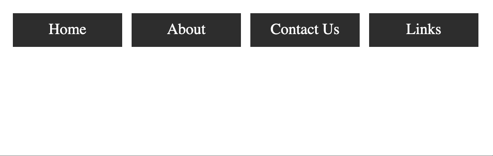
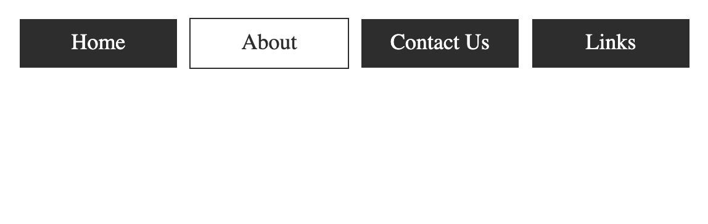
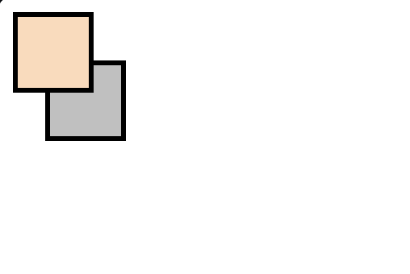
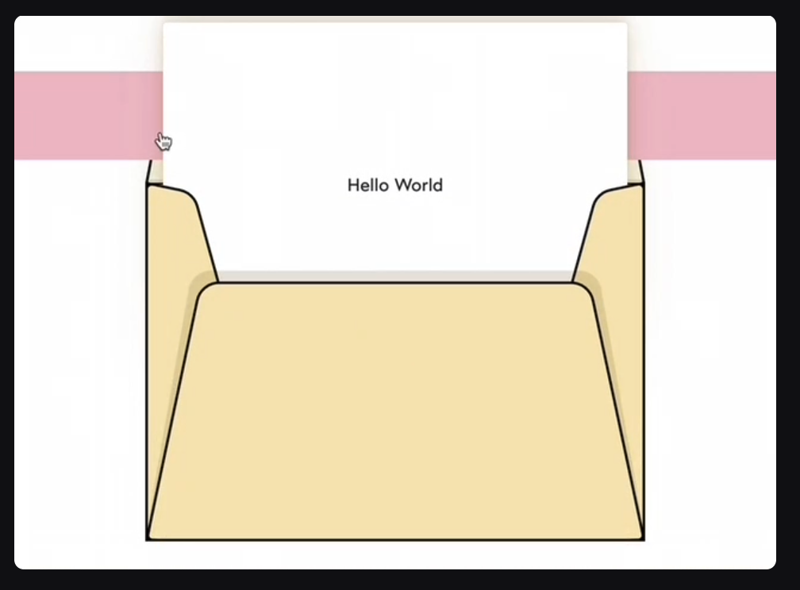
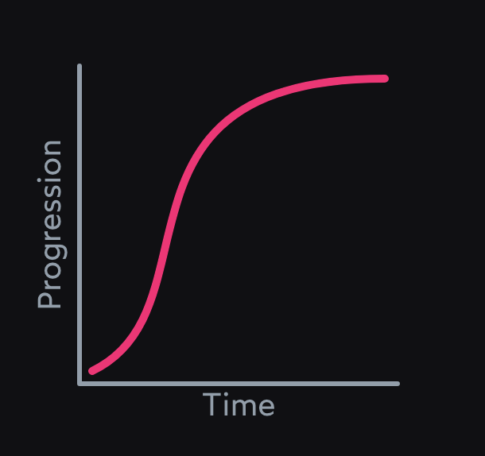

# [Transitions](https://www.theodinproject.com/lessons/node-path-advanced-html-and-css-transitions)

#### Introduction

It's time to dive into the exciting world of CSS transitions and give your HTML elements some slick transformations!

<br>

#### Lesson Overview

This section contains a general overview of topics that you will learn in this lesson.

- What a CSS transition is and when to use it.

- Know what CSS properties are animatable and which ones are not.

- How to make sure your transitions are smooth and performant.

<br>

#### Transitions

CSS transitions let you animate a change from an element's initial state to an end state. Think of an ordinary button element with a white background. When your mouse is away from the button, it's just sitting there. Boring. Then when you hover your mouse cursor over the button the background color smoothly transitions from white to grey to black over a period of time. This is a CSS transition. Have a look at the Codepen below to see one in action.

```html
<div id="transition-container">
	<button>Transition!</button>
	<p>Hover your mouse over the rectangle above!</p>
</div>
```

```css
#transition-container {
	width: 100%;
	height: 100%;
	display: flex;
	flex-direction: column;
	justify-content: center;
	align-items: center;
	font-family: Arial, sans-serif;
}

button {
	border: 1px solid black;
	border-radius: 5px;
	padding: 2% 5% 2% 5%;
	background-color: white;
	color: white;
	transition: background-color 1s ease-out 0.25s;
}

button:hover {
	background-color: black;
	cursor: pointer;
}
```


When your mouse cursor is away from the button, the button is in the initial state. When you hover over it, you introduce the end state - the hover state - causing the background color to transition smoothly from white to black.

This was achieved using the `transition` property, which is actually a shorthand property for `transition-property`, `transition-duration`, `transition-timing-function` and `transition-delay`.

```css
button {
	/* ... other CSS properties ... */
	transition-property: background-color;
	transition-duration: 1s;
	transition-timing-function: ease-out;
	transition-delay: 0.25s;
}
```

- `transition-property` - This determines what CSS property will be transitioned. In this case it is the `background-color`.

- `transition-duration` - This determines the duration that the transition will occur over. In this case the color change will gradually happen over 1 second.

- `transition-timing-function` - This lets us change the speed of the transition over the course of its duration. Here it will `ease-out`, meaning the color change will be faster at the start than at the end of the transition.

- `transition-delay` - This determines the delay at which the transition will start. In this case, the color change starts a quarter of a second after the cursor rests on the button.

The shorthand property looks like this:

```css
button {
	/* ... other CSS properties ... */
	background-color: white;
	transition: background-color 1s ease-out 0.25s;
}

button:hover {
	background-color: black;
}
```

The above transition will occur when the user hovers their mouse over the button as indicated by the `:hover` pseudo-class. In addition to `:hover`, or any of the other pseudo-classes, you can also trigger transitions by adding or removing classes with JavaScript. For example, clicking a button could append the "open" class to a dropdown menu, which would trigger the opening transition.

<br>

### Performance

Generally, keeping your CSS transitions performant will not be an issue. However, there are a couple of things you need to keep in mind.

The first is the "stacking context". Basically, a stacking context is formed when certain element scenarios are in place. A relevant scenario for us would be to transition a `transform` property like below:

```css
div {
	width: 100px;
	height: 100px;
	transition: transform 2s 1s;
}

div:hover {
	transform: rotate(180deg);
}
```

This has created a stacking context. If we were to make a bunch more stacking contexts through various other means then, when it comes to rendering our initial transform, we would paint not only our `div` element but also **every element that is stacked on top of it in the stack context**. If left unchecked, this can cause your once buttery-smooth transition to become slow and rough.

The second thing to keep in mind is that you should keep your animations to only affecting `opacity` and `transform` if you want absolute best performance for animations on your web page. Yes, our first example above only carried out a `background-color` change, but even that was an expensive operation in itself.

What's important is that you have a solid understanding of these concepts and can apply them when necessary because hey, if you need to turn a button into a rainbow when it's hovered, you better be able to transition that rainbow!

<br>

### Knowledge Check

- ##### Are all CSS properties animatable?

While a lot of CSS properties are animatable, not all of them are.

<br>

- ##### What are the long and short-hand notations for transitions?

The short-hand notation for transition is: `transition: <transition-property> <transition-duration> <transition-timing-function> <transition-delay> <transition-behavior>`

The long-hand notations for transition are: `transition-property`, `transition-duration`, `transition-timing-function`, `transition-delay`, and `transition-behavior`.

<br>

- ##### What is the stacking context?

The stacking context determines how elements are layered on top of one another along the z-axis (think of it as the "depth" dimension on your screen). Stacking context determines the visual order of how overlapping content is rendered.

<br>

- ##### Why do you need to keep an eye on repaints?

You need to keep an eye on repaints for CSS animations because it is an expensive operation, performance-wise, and can make your page look sluggish.

<hr>
<br>
<br>

# [Using CSS transitions](https://developer.mozilla.org/en-US/docs/Web/CSS/CSS_transitions/Using_CSS_transitions)

**CSS transitions** provide a way to control animation speed when changing CSS properties. Instead of having property changes take effect immediately, you can cause the changes in a property to take place over a period of time. For example, if you change the color of an element from white to black, usually the change is instantaneous. With CSS transitions enabled, changes occur at time intervals that follow an acceleration curve, all of which can be customized.

Animations that involve transitioning between two states are often called _implicit transitions_ as the states in between the start and final states are implicitly defined by the browser.


CSS transitions let you decide which properties to animate (by listing them explicitly), when the animation will start (by setting a delay), how long the transition will last (by setting a duration), and how the transition will run (by defining an easing function, e.g., linearly or quick at the beginning, slow at the end).

## Which CSS properties can be transitioned?

The Web author can define which property has to be animated and in which way. This allows the creation of complex transitions. However, some properties are not animatable as it doesn't make sense to animate them.

> **Note**: The `auto` value is often a very complex case. The specification recommends not animating from and to `auto`. Some user agents, like those based on Gecko, implement this requirement and others, like those based on WebKit, are less strict. Using animations with `auto` may lead to unpredictable results, depending on the browser and its version, and should be avoided.

<br>

## Defining transitions

CSS Transitions are controlled using the shorthand `transition` property. This is the best way to configure transitions, as it makes it easier to avoid out of sync parameters, which can be very frustrating to have to spend lots of time debugging in CSS.

You can control the individual components of the transition with the following sub-properties:

- `transition-property` - Specifies the name or names of the CSS properties to which transitions should be applied. Only properties listed here are animated during transitions; changes to all other properties occur instantaneously as usual.

- `transition-duration` - Specifies the duration over which transitions should occur. You can specify a single duration that applies to all properties during the transition, or multiple values to allow each property to transition over a different period of time.

- `transition-timing-function` - Specifies a function to define how intermediate values for properties are computed. _Easing functions_ determine how intermediate values of the transition are calculated. Most easing functions can be specified by providing the graph of the corresponding function, as defined by four points defining a cubic bezier. You can also choose easing from [Easing functions cheat sheet](https://easings.net/).

- `transition-delay` - Defines how long to wait between the time a property is changed and the transition actually begins.

The `transition` shorthand CSS syntax is written as follows:

```css
div {
	transition: <property> <duration> <timing-function> <delay>;
}
```

<br>

### Examples

#### Basic example

This example performs a four-second font size transition with a two-second delay between the time the user mouses over the element and the beginning of the animation effect:

```css
#delay {
	font-size: 14px;
	transition-property: font-size;
	transition-duration: 4s;
	transition-delay: 2s;
}

#delay:hover {
	font-size: 36px;
}
```

<br>

#### Multiple animated properties example

#### CSS

```css
.box {
	border-style: solid;
	border-width: 1px;
	display: block;
	width: 100px;
	height: 100px;
	background-color: #0000ff;
	transition: width 2s, height 2s, background-color 2s, rotate 2s;
}

.box:hover {
	background-color: #ffcccc;
	width: 200px;
	height: 200px;
	rotate: 180deg;
}
```


<br>

#### When property value lists are of different lengths

If any property's list of values is shorter than the others, its values are repeated to make them match. For example:

```css
div {
	transition-property: opacity, left, top, height;
	transition-duration: 3s, 5s;
}
```

This is treated as if it were:

```css
div {
	transition-property: opacity, left, top, height;
	transition-duration: 3s, 5s, 3s, 5s;
}
```

Similarly, if any property's value list is longer than that for `transition-property`, it's truncated, so if you have the following CSS:

```css
div {
	transition-property: opacity, left;
	transition-duration: 3s, 5s, 2s, 1s;
}
```

This gets interpreted as:

```css
div {
	transition-property: opacity, left;
	transition-duration: 3s, 5s;
}
```

<br>

#### Using transitions when highlighting menus

A common use of CSS is to highlight items in a menu as the user hovers the mouse cursor over them. It's easy to use transitions to make the effect more attractive.

First, we set up the menu using HTML:

```html
<nav>
	<a href="#">Home</a>
	<a href="#">About</a>
	<a href="#">Contact Us</a>
	<a href="#">Links</a>
</nav>
```

Then we build the CSS to implement the look and feel of our menu:

```css
nav {
	display: flex;
	gap: 0.5rem;
}

a {
	flex: 1;
	background-color: #333;
	color: #fff;
	border: 1px solid;
	padding: 0.5rem;
	text-align: center;
	text-decoration: none;
	transition: all 0.5s ease-out;
}

a:hover a:focus {
	background-color: #fff;
	color: #333;
}
```

This CSS establishes the look of the menu, with the background and text colors both changing when the element is in its `:hover` and `:focus` states:




<br>

#### Transitioning display and content-visibility

This example demonstrates how `display` and `content-visibility` can be transitioned. This behavior is useful for creating entry/exit animations where you want to for example remove a container from the DOM with `display: none`, but have it fade out with `opacity` rather than disappearing immediately.

Supporting browsers transition `display` and `content-visibility` with a variation on the discrete animation type. This generally means that properties will flip between two values 50% through animating between the two.

There is an exception, however, which is when animating to/from `display: none` or `content-visibility: hidden`. In this case, the browser will flip between the two values so that the transitioned content is shown for the entire animation duration.

So, for example:

- When animating `display` from `none` to `block` (or another visible `display` value), the value will flip to `block` at `0%` of the animation duration so it is visible throughout.

- When animating `display` from `block` (or another visible `display`) to `none`, the value willl flip to `none` at `100%` of the animation duration so it is visible throughout.

When transitioning these properties `transition-behavior: allow-discrete` needs to be set on the transitions. This effectively enables `display/content-visibility` transitions.

When transitioning `display`, `@starting-style` is needed to provide a set of starting values for properties set on an element that you want to transition from when the element receives its first style update. This is needed to avoid unexpected behavior. By default, CSS transitions are not triggered on elements' first style updates when they first appear in the DOM, which includes when `display` changes from `none` to another state. `content-visibility` animations do not need starting values specified in a `@starting-style` block. This is because `content-visibility` doesn't hide an element from the DOM like `display` does: it just skips rendering the element's content.

<br>

##### HTML

The HTML contains two `<p>` elements with a `<div>` in between that we will animate from `display` `none` to `block`.

```html
<p>
	Click anywhere on the screen or press any key to toggle the
	<code>&lt;div&gt;</code> between hidden and showing.
</p>

<div>
	This is a <code>&lt;div&gt;</code> element that transitions between
	<code>display: none; opacity: 0</code> and
	<code>display: block; opacity: 1</code>. Neat, huh?
</div>

<p>
	This is another paragraph to show that <code>display: none; </code> is being
	applied and removed on the above <code>&lt;div&gt;</code>. If only its
	<code>opacity</code> was being changed, it would always take up the space in
	the DOM.
</p>
```

<br>

##### CSS

```css
html {
	height: 100vh;
}

div {
	font-size: 1.6rem;
	padding: 20px;
	border: 3px solid red;
	border-radius: 20px;
	width: 480px;

	display: none;
	opacity: 0;
	transition: opacity 1s, display 1s allow-discrete;
	/* Equivalent to
  transition: all 1s allow-discrete */
}

.showing {
	opacity: 1;
	display: block;
}

@starting-style {
	.showing {
		opacity: 0;
	}
}
```

Note the `@starting-style` block used to specify the starting style for the transition, and the inclusion of the `display` property in the transitions list, with `allow-discrete` set on it.

<br>

##### JavaScript

Finally, we include a bit of JavaScript to set up event listeners to trigger the transition (via the `showing` class).

```js
const divElem = document.querySelector("div")
const htmlElem = document.querySelector(":root")

htmlElem.addEventListener("click", showHide)
document.addEventListener("keydown", showHide)

function showHide() {
	divElem.classList.toggle("showing")
}
```

<br>

##### Result

The code renders as follows:


<br>

### JavaScript examples

> **Note**: Care should be taken when using a transition immediately after:
>
> - adding the element to the DOM using `.appendChild()`
> - removing an element's `display: none` property.
>   This is treated as if the initial state had never occurred and the element was always in its final state. The easy way to overcome this limitation is to apply a `setTimeout()` of a handful of milliseconds before changing the CSS property you intend to transition to.

<br>

#### Using transitions to make JavaScript functionality smooth

Transitions are a great tool to make things look much smoother without having to do anything to your JavaScript functionality. Take the following example.

```html
<p>Click anywhere to move the ball</p>
<div id="foo" class="ball"></div>

<script>
	// Make the ball move to a certain position:
	const f = document.getElementById("foo")
	document.addEventListener(
		"click",
		(ev) => {
			f.style.transform = `translateY(${ev.clientY - 25})`
			f.style.transform += `translateX(${ev.clientX - 25})`
		},
		false
	)
</script>
```

With CSS, you can smooth the styles applied through JavaScript. Add a transition to the element and any change will happen smoothly:

```css
.ball {
	border-radius: 25px;
	width: 50px;
	height: 50px;
	background: #c00;
	position: absolute;
	top: 0;
	left: 0;
	transition: transform 1s;
}
```


<br>

#### Detecting the start and completion of a transition

You can use `transitionend` event to detect that an animation has finished running. This is a `TransitionEvent` object, which has two added properties beyond a typical `Event` object:

- `propertyName` - A string indicating the name of the CSS property whose transition completed.

- `elapsedTime` - A float indicating the number of seconds the transition had been running at the time the event fired. This value isn't affected by the value of `transition-delay`.

As usual, you can use the `addEventListener()` method to monitor for this event:

```js
el.addEventListener("transitionend", updateTransition, true)
```

You detect the beginning of a transition using `transitionrun` (fires before any delay) and `transitionstart` (fires after any delay), in the same kind of fashion:

```js
el.addEventListener("transitionrun", signalStart, true)
el.addEventListener("transitionstart", signalStart, true)
```

> **Note**: The `transitionend` event doesn't fire if the transition is aborted before the transition is completed because either the element is made `display: none` or the animating property's value is changed.

<hr>
<br>
<br>

# [What the Heck, z-index??](https://www.joshwcomeau.com/css/stacking-contexts/)

Exploring stacking contexts, one of the most misunderstood mechanisms in CSS.

In CSS, we're given a tool to explicitly control the stacking order of HTML element: `z-index`. Elements with a higher value will appear on top:

```html
<style>
	.box {
		position: relative;
	}

	.first.box {
		z-index: 2;
		background-color: peachpuff;
	}

	.second.box {
		z-index: 1;
		margin-top: -20px;
		margin-left: 20px;
	}
</style>

<div class="first box"></div>
<div class="second box"></div>
```

```css
/* 
  This tab includes cosmetic styles
  that aren't as relevant.
*/

.box {
	width: 50px;
	height: 50px;
	border: 3px solid;
	background: silver;
}
```



Because `.first.box` has a larger z-index than `.second.box`, it stacks in front. If we remove that z-index declaration, it falls to the back. The code above is editable -- give it a shot!


Things aren't always so simple, however. Sometimes, the larger z-index value _doesn't_ win.

Check out what's going on here:

```html
<style>
	header {
		position: relative;
		z-index: 2;
	}

	.tooltip {
		position: absolute;
		z-index: 99999;
	}

	main {
		position: relative;
		z-index: 1;
	}
</style>

<header>My Cool Site</header>
<main>
	<div class="tooltip">A tooltip</div>
	<p>Some main content</p>
</main>
```


`.tooltip` has a **much** larger z-index than `header`! So why on earth is the header on top?

To unravel this mystery, we'll need to learn about **_stacking contexts_**, an obscure-yet-fundamental CSS mechanism. In this article, we'll explore what they are, how they work, and how we can use them to our advantage.

> ###### Intended audience
>
> This tutorial is written for front-end developers of all experience levels. Especially folks who have struggled with z-index issues before.

<br>

## Layers and groups

If you've ever used image-editing software like PhotoShop or Figma, you're probably familiar with the concept of layers:


Our image has 3 separate canvases, stacked like pancakes. The bottom layer is a cat photo, with 2 layers on top that add silly details. By flattening these layers, we wind up with a final composition:


In these programs, we can also _group layers_:


Like files in a folder, a group allows us to segment our layers. In terms of stacking order, layers aren't allowed to "intermingle" between groups: All of `dog`'s layers will appear on top of all of `cat`'s layers.

When we export the composition, we don't see the cat at all, since it's behind the dog:


When it comes to CSS, things work in a similar way: elements are grouped into **stacking contexts**. When we give an element a z-index, that value is only compared _against other elements in the same context_. z-index values are not global.

By default, a plain HTML document will have a single stacking context that encompasses all nodes. But we can create additional contexts!

There are many ways to create stacking contexts, but here's the most common:

```css
.some-element {
	position: relative;
	z-index: 1;
}
```

By combining these two declarations, a secret mechanism is triggered: a stacking context is created, forming a group around this element and all of its children.

Let's take another look at our problem from above:

```html
<style>
	header {
		position: relative;
		z-index: 2;
	}
	.tooltip {
		position: absolute;
		z-index: 99999;
	}
	main {
		position: relative;
		z-index: 1;
	}
</style>

<header>My Cool Site</header>
<main>
	<div class="tooltip">A tooltip</div>
	<p>Some main content</p>
</main>
```

We can map out the stacking contexts being created in this snippet:

- The root element

  - `<header>`

  - `<main>`

    - `<div class="tooltip">`

Our `.tooltip` element has a z-index of 99999, but that value is only relevant within the `<main>` stacking context. It controls whether the tooltip shows up above or below the adjacent `<p>` tag, nothing more.

Meanwhile, in the parent context, `<header>` and `<main>` are compared. Because `<main>` has a smaller z-index, it shows up underneath `<header>`. **All of its children come along for the ride**.

> **It's like semantic versioning**
> I recognize that not everyone has experience with software like Photoshop / Figma / Sketch. If the analogy above didn't resonate, I have another one that you're more likely to be familiar with: **_semantic versioning_**.
>
> In semantic versioning, different "tiers" of versions are separated by dots. For example, version 2.0 of a package is a larger version that 1.0, but it's also a larger version than 1.9999.
>
> z-indexes are like version numbers, and stacking contexts are like tiers. Every time a stacking context is created, we add a dot to our version:
>
> ```html
> <!-- 2.0 -->
> <header>My Cool Site</header>
> <!-- 1.0 -->
> <main>
> 	<!-- 1.9999 -->
> 	<div class="tooltip">A tooltip</div>
> </main>
> ```
>
> Our tooltip shows up underneath our `<header>` because 1.9999 is a lower version than 2.0. It doesn't matter how many 9s we add to the minor version, it'll never eclipse a larger major version.

<br>

### Fixing our example

How do we solve our tooltip problem? Well, in this case, we don't actually need to create a stacking context on our `<main>`:

```html
<style>
	header {
		position: relative;
		z-index: 2;
	}
	.tooltip {
		position: absolute;
		z-index: 9999;
	}
	.main {
		position: relative;
		/* No more z-index here! */
	}
</style>

<header>My Cool Site</header>
<main>
	<div class="tooltip">A tooltip</div>
	<p>Some main content</p>
</main>
```


Without a z-index, `<main>` won't create a stacking context. Our hierarchy, then, looks like this:

- The root content

  - `<header>`

  - `<div class="tooltip">`

Because the header and our tooltip are not in the same context, their z-index values face off, and the tooltip emerges as the victor.

**An important distinction**: we're not talking about parent/child relationships here. It doesn't matter that the tooltip is more deeply nested than the header. The browser only cares about stacking contexts.

> ##### Breaking the rules
>
> In this contrived example, we can remove the z-index from `<main>` because it wasn't really doing anything. But what if we actually did need `<main>` to use z-index / create a stacking context?
>
> According to the rules of CSS, there is no way for us to "break free" of the stacking context. An element inside one stacking context can never be compared against elements in another.
>
> We can still achieve the desired result, however, with a bit of out-of-the-box thinking.
>
> We can render our tooltip outside of `<main>` by appending it to the `<body>` tag. We can then use some CSS to position it accordingly, to make it seem as though it's a child of that element.
>
> This is an advanced technique, and it requires careful planning to make sure that we don't inadvertently break the experience for folks using a keyboard to navigate. Thankfully, libraries like [Radix Primitives](https://www.radix-ui.com/primitives) use this technique under-the-hood, and solve for all the accessibility and usability challenges.
>
> It's beyond the scope of this tutorial, but if you're interested in going deeper, check out the [React documentation on "createPortal"](https://react.dev/reference/react-dom/createPortal).

<br>

### Creating stacking contexts

We've seen how we can create a stacking context by combining relative or absolute positioning with `z-index`, but it's not the only way! Here are some others:

- Setting `opacity` to a value less than `1`

- Setting `position` to `fixed` or `sticky` (No z-index needed for these values!)

- Applying a `mix-blend-mode` other than `normal`

- Adding a `z-index` to a child inside a `display: flex` or `display: grid` container

- Using `transform`, `filter`, `clip-path`, or `perspective`

- Using `will-change` with a value like `opacity` or `transform`

- Explicitly creating a context with `isolation: isolate` (More on this soon!)

There are a few other ways as well. You can find the [full list on MDN](https://developer.mozilla.org/en-US/docs/Web/CSS/CSS_Positioning/Understanding_z_index/The_stacking_context#the_stacking_context).

```html
<style>
  header {
    position: relative;
    z-index: 2;
  }

  .tooltip {
    position: absolute;
    z-index: 99999;
  }

  main {
    position: relative;
    /*
      No more z-index...
      but it's still broken??
    */
    will-change: transform;
  }
</style>

<header>
  My Cool Site
</header>

<main>
  <div class="tooltip">A tooltip<div>
  <p>Some main content</p>
</main>
```


`main` doesn't set a z-index anymore, but it uses `will-change`, a property that can create a stacking context all on its own.

<br>

### A common misconception about z-index

In order for z-index to work, we need to set `position` to something like `relative` or `absolute`, right?

Not quite. Check out what's happening here:

```html
<style>
	.wrapper {
		display: flex;
	}
	.second.box {
		z-index: 1;
		background: hotpink;
		margin-top: 20px;
		margin-left: -20px;
		margin-right: -20px;
	}
</style>

<div class="wrapper">
	<div class="first box"></div>
	<div class="second box"></div>
	<div class="third box"></div>
</div>
```


The second box is lifted above its siblings using `z-index`. There are no `position` declarations anywhere in the snippet, though!

I used to think that the `z-index` property had a hard dependency on the `position` property, that you _had_ to set `position` to something like `relative` or `absolute` in order to use it. But that's not quite right.

At its core, CSS is a collection of layout algorithms. There's Flexbox, Grid, Flow layout (the default), and many others. Each layout algorithm can implement each CSS property however it wants.

When we set `position: relative` or `position: absolute`, we switch to Positioned Layout, a layout algorithm that implements `z-index`. **It's not the only one that does, though!** Flexbox and Grid both implement it as well.

When we stop thinking of CSS as a big grab-bag of properties and start thining of it as a constellation of layout algorithms, the language starts to make a lot more sense. You can learn more about this alternative mental model in my article, "[The Importance of Learning CSS](https://www.joshwcomeau.com/css/the-importance-of-learning-css/)".

<br>

### Hold on a minute...

There's a Weird Thing here, and I think it's worth pondering about for a minute or two.

In our Photoshop analogy, there is a clear distinction between groups and layers. All of the visual elements are layers, and groups can be conjured as structural helpers to contain them. They are distinct ideas.

On the web, however, the distinction is a bit less clear. Every element that uses z-index must _also_ create a stacking context.

When we decide to give an element a z-index, our goal is typically to lift or lower that element above/below some other element in the parent stacking context. _We aren't intending to produce a stacking context on that element!_ But it's important that we consider it.

When a stacking context is created, it "flattens" all of its descendants. Those children can still be rearranged internally, but we've essentially locked those children in.

Let's take another look at the markup from earlier.

```html
<header>My Cool Site</header>

<main>
	<div class="tooltip">A tooltip</div>
	<p>Some main content</p>
</main>
```

By default, HTML elements will be stacked according to their DOM order. Without any CSS interference, `main` will render on top of `header`.

We can lift `header` to the front by giving it a z-index, but not without flattening all of its children. This mechanism is what led to the bug we discussed earlier.

We shouldn't think of `z-index` purely as a way to change an element's order. We should _also_ think of it as a way to form a group around that element's children. z-index won't work unless a group is formed.

> ##### Believe it or not, this is a good thing
>
> As we've seen in our tooltip demo, stacking contexts can cause subtle, hard-to-diagnose bugs. Wouldn't it be better if z-index values were compared globally instead?
>
> I don't think so, and I can think of a few reasons why:
>
> - As it stands, z-index inflation (the ever-creeping-upwards trend of huge z-index values) is an epidemic. Imagine how much worse it would be if _every single element with a z-index_ had to fit in the same scale?
>
> - I'm not a browser engineer, but I'd guess that stacking contexts are good for performance. Without them, the browser would have to compare every item with a z-index against every other item with a z-index. Sounds like a lot more work.
>
> - Once we understand stacking contexts, we can use them to our advantage to "seal off" elements. This is an especially powerful pattern with component-driven frameworks like React.
>
> That last point is especially interesting. Let's dig deeper into it.

<br>

### Airtight abstractions with "isolation"

One of my favourite CSS properties is also one of the most obscure. I'd like to introduce you to the `isolation` property, a hidden gem in the language.

Here's how you'd use it:

```css
.wrapper {
	isolation: isolate;
}
```

When we apply this declaration to an element, it does precisely 1 thing: it creates a new stacking context.

With so many different ways to create a stacking context, why do we need another one? Well, with every other method, stacking contexts are created implictly, as the result of some other change. `isolation` creates a stacking context in the purest way possible:

- No need to prescribe a z-index value

- Can be used on statically-positioned elements. A "static" element is one that doesn't set `position` to relative, absolute, fixed, or sticky. In other words, it doesn't use Positioned layout.

- Doesn't affect the child's rendering in any way

This is **incredibly useful**, since it lets us "seal off" an element's children.

Let's look at an example. Recently, I built this neat envelope component. **Hover or focus** to see it open:


It consists of several layers:


I packaged this effect up in a React component, `<Envelope>`. It looks something like this (inline styles used for brevity):

```js
function Envelope({ children }) {
	return (
		<div>
			<BackPane style={{ zIndex: 1 }} />
			<Letter style={{ zIndex: 3 }}>{children}</Letter>
			<Shell style={{ zIndex: 4 }} />
			<Flap style={{ zIndex: isOpen ? 2 : 5 }} />
		</div>
	)
}
```

(If you're wondering why `Flap` has a dynamic z-index, it's because it needs to shift behind the letter when the envelope is open.)

A good React component is sealed off from its environment, like a spacesuit. _This_ spacesuit, however, has sprung a leak. Check out what happens when I use it near a `<header>` with `z-index: 3`:



Our `<Envelope>` component wraps the 4 layers in a div, but it doesn't create a stacking context. As a result, those layers can become "intertwined" with other components, like the world's most boring game of Twister.

By using `isolation: isolate` on the top-level element with `<Envelope>`, **we guarantee that it'll be positioned as a group**:

```js
function Envelope({ children }) {
	return (
		<div style={{ isolation: "isolate" }}>
			<BackPane style={{ zIndex: 1 }} />
			<Letter style={{ zIndex: 3 }}>{children}</Letter>
			<Shell style={{ zIndex: 4 }} />
			<Flap style={{ zIndex: isOpen ? 2 : 5 }} />
		</div>
	)
}
```

Why not create a stacking context the old-fashioned way, with `position: relative; z-index: 1`? Well, React components are meant to be reusable; is `1` really the right z-index value for this component in _all_ circumstances? The beauty of `isolation` is that it keeps our components unopinionated and flexible.

More and more, **I'm starting to believe that z-index is an escape hatch**, similar to `!important`. This is one trick that allows us to control stacking order without pulling the big red z-index lever.

> ##### Browser support
>
> The `isolation` property is not new, and it has [very good browser support](https://caniuse.com/?search=isolation): it works in every browser except Internet Explorer.
>
> If I neded to support Internet Explorer, I would consider using `transform: translate(0px);` instead. I haven't tested it, but I believe it would achieve the same result: creating a stacking context without any meaningful side-effect.

<br>

## Debugging stacking context issues

If you've ever struggled to get elements to stack in the correct order, you know how tricky it is to debug stacking context issues. Fortunately, I have a few tools that might help!

Microsoft Edge has an interesting "[3D view](https://learn.microsoft.com/en-us/microsoft-edge/devtools-guide-chromium/3d-view/)" that allows us to view stacking contexts:


This view can be a bit overwhelming, especially in larger applications, but it can be a helpful way to understand the stacking contexts in our applications.

Let's look at some other tools:

- Mike Rheault reached out to share a [VSCode extension they created](https://marketplace.visualstudio.com/items?itemName=mikerheault.vscode-better-css-stacking-contexts) which highlights potential stacking context issues:


This extension works on .css and .scss files, but not CSS-in-JS.

- Giuseppe Gurgone reached out to let me know about this [Chrome extension](https://chromewebstore.google.com/detail/z-context/jigamimbjojkdgnlldajknogfgncplbh) which adds a new "z-index" pane to the devtools.

- Andrea Dragotta created an **_incredible_** browser extension that adds a bunch of super-important information about z-index and stacking contexts. It's available for [Chrome](https://chromewebstore.google.com/detail/css-stacking-context-insp/apjeljpachdcjkgnamgppgfkmddadcki) and [Firefox](https://addons.mozilla.org/en-US/firefox/addon/css-stacking-context-inspector/):


Between all of these tools, you should be able to find something which can help you diagnose and fix z-index bugs. I've been using Andrea's Chrome extension, and it's fantastic!

> ##### Stacking contexts vs layers
>
> In the Chrome devtools, there is a "Layers" pane that shows individual element layers. Are layers the same thing as stacking contexts?
>
> Unfortunately not. They're similar if you squint, but they're fundamentally different concepts.
>
> Stacking contexts are a "thing" in the CSS specification. They're a fundamental part of how the language works, and browsers are meant to implement them according to the specification.
>
> Layers, on the other hand, aren't mentioned in the spec. Rather, they're an implementation detail that some browsers (like Chrome) use to optimize performance.
>
> For example: by promoting an element that will be animated to its own layer, the browser can defer that work to the GPU, leading to smoother transitions. If you're keen to learn more about this, I recently wrote an [article about CSS transitions](https://www.joshwcomeau.com/animation/css-transitions/), and we take a brief look at this concept.
>
> At first blush, this concept sounds a lot like stacking contexts, but they're separate mechanisms. Whenever a layer is created, it must also define a stacking context, but the inverse is not necessarily true (multiple stacking contexts might be rendered on the same layer).
>
> You can learn more about how the browser uses layers in this [wonderful series by Mariko Kosako](https://developers.google.com/web/updates/2018/09/inside-browser-part3) on the Chrome Web blog.

<br>

### Going deeper

Stacking contexts are a good example of how CSS is built on "hidden mechanisms". You can spend years building interfaces with CSS without knowing that they exist.

Unless you explicitly take the time to learn about these mechanisms, your mental model will always be missing pieces. And if your mental model is even **_slightly_** misaligned, it's only a matter of time until that discrepancy causes problems.

CSS doesn't have warnings or error messages. When something surprising happens, there's no clear "next step" to figure out what went wrong. These disruptions take us out of flow state and shake our confidence. I think this is why so many front-end developers don't enjoy writing CSS.

Once you build up an intuition for the language, though, CSS becomes an absolute joy. I **_love_** writing CSS nowadays.

I want to help other developers discover this joy. I've created a comprehensive self-paced online course that explains how CSS works at a deeper level, and teaches the practical skills I use every day to build all kinds of user interfaces.

It's called "[CSS for JavaScript Developers](https://css-for-js.dev/)", and it's available now.

<hr>
<br>
<br>

# [How to create high-performance CSS animations](https://web.dev/articles/animations-guide)

This guide teaches you how to create high-performance CSS animations.

## Browser Compatibility

All the CSS properties that this guide recommends have good cross-browser support.

`transform`, `opacity`, `will-change`

<br>

## Move an element

To move an element, use the `translate` or `rotation` keyword values of the `transform` property.

For example, to slide an item into view, use `translate`.

```css
.animate {
	animation: slide-in 0.7s both;
}

@keyframe slide-in {
	0% {
		transform: translateY(-1000px);
	}
	100% {
		transform: translateY(0);
	}
}
```

Use `rotate` to rotate elements. The following example rotates an element 360 degrees.

```css
.animate {
	animation: rotate 0.7s ease-in both;
}

@keyframes rotate {
	0% {
		transform: rotate(0);
	}
	100% {
		transform: rotate(360deg);
	}
}
```

<br>

## Resize an element

To resize an element, use the `scale` keyword value of the `transform` property.

```css
.animate {
	animation: scale 1.5s both;
}

@keyframes scale {
	50% {
		transform: scale(0.5);
	}
	100% {
		transform: scale(1);
	}
}
```

<br>

## Change an element's visibility

To show or hide an element, use `opacity`.

```css
.animate {
	animation: opacity 2.5s both;
}

@keyframes opacity {
	0% {
		opacity: 1;
	}
	50% {
		opacity: 0;
	}
	100% {
		opacity: 1;
	}
}
```

<br>

## Avoid properties that trigger layout or paint

Before using any CSS property for animation (other than `transform` and `opacity`), determine the property's impact on the [rendering pipeline](https://web.dev/articles/animations-overview#pipeline). Avoid any property that triggers layout or paint unless it's absolutely necessary.

> **Warning**: If you must use a property that triggers layout or paint, you probably won't be able to keep the animation smooth or high-performing.

<br>

## Force layer creation

As explained in [Why are some animations slow?](https://web.dev/articles/animations-overview), placing elements on a new layer lets the browser repaint them without needing to repaint the rest of the layout.

Browsers can usually make good decision about which items should be placed on a new layer, but you can manually force layer creation with the `will-change` property. As the name suggests, this property tells the browser that this element is going to be changed in some way.

> **Caution**: Because layer creation can cause other performance issues, we don't recommend using it early in your optimization process. Instead, use it only if you notice graphic issues and think that promoting an element to a new layer might help.

In CSS, you can apply `will-change` to any selector:

```css
body > .sidebar {
	will-change: transform;
}
```

However, [the specification](https://drafts.csswg.org/css-will-change/) suggests that you should only do this for elements that are always about to change. For example, this might be true for a sidebar the user can slide in and out. For elements that don't change frequently, we recommend applying `will-change` using JavaScript when a change is likely to happen. Make sure to give the browser enough time to perform the necessary optimizations, and remove the property when the change has stopped.

> **Note**: For more information and examples of `will-change` usage, refer to [Everything You Need To Know About The CSS `will-change` Property](https://dev.opera.com/articles/css-will-change-property/).

If you were to force layer creation in a browser that doesn't support `will-change` (most likely Internet Explorer), you can set `transform: translateZ(0)`.

<br>

## Debug slow or glitchy animations

Chrome DevTools and Firefox DevTools have lots of tools to help you figure out why your animations are slow or glitchy.

<br>

### Check whether an animation triggers layout

An animation that moves an element using something other than `transform` is likely to be slow. The following example compares an animation using `transform` to an animation using `top` and `left`.

#### Don't

```css
.box {
	position: absolute;
	top: 10px;
	left: 10px;
	animation: move 3s ease infinite;
}

@keyframes move {
	50% {
		top: calc(90vh - 160px);
		left: calc(90vw - 200px);
	}
}
```

#### Do

```css
.box {
	position: absolute;
	top: 10px;
	left: 10px;
	animation: move 3s ease infinite;
}

@keyframes move {
	50% {
		transform: translate(calc(90vh - 200px), calc(90vh - 160px));
	}
}
```

You can test this in the following two Glitch examples, and explore performance using DevTools.

- [Before](https://glitch.com/%7Eanimation-with-top-left)

- [After](https://glitch.com/%7Eanimation-with-transform)

<br>

##### Chrome DevTools

1. Open the **Performance** panel.

2. [Record runtime performance](https://developer.chrome.com/docs/devtools/evaluate-performance/reference#record-runtime) while your animation is happening.

3. Inspect the **Summary** tab.

If you see a nonzero value for **Rendering** in the **Summary** tab, it might mean your animation is making the browser do layout work.


The animation-with-top-left example causes rendering work.


The animation-with-transform example doesn't cause rendering work.

<br>

##### Firefox DevTools

In Firefox DevTools the [Waterfall](https://profiler.firefox.com/docs/#/) can help you understand where the browser is spending time.

1. Open the **Performance** panel.

2. Start recording performance while your animation is happening.

3. Stop the recording and inspect the **Waterfall** tab.

If you see entries for [Recalculate Style](https://profiler.firefox.com/docs/#/), that means the browser has to return to the start of the [rendering waterfall](https://profiler.firefox.com/docs/#/) to render the animation.

<br>

### Check for dropped frames

1. Open the **Rendering tab** in Chrome DevTools.

2. Enable the **FPS meter** checkbox.

3. Watch the values while your animation runs.

Pay attention to the **Frames** label at the top of the **FPS meter** UI. This shows values like `50% 1 (938 m) dropped of 1878`. A high-performance animation has a hige percentage, such as `99%`, meaning that few frames are being dropped and the animation looks smooth.


The animation-with-top-left example causes 50% of frames to be dropped


The animation-with-transform example causes only 1% of frames to be dropped.

<br>

### Check whether an animation triggers paint

Some properties are more expensive for the browser to paint than others. For example, anything that involves a blur (lilke a shadow, for example) takes longer to paint than drawing a red box. These differences aren't always obvious in the CSS, but browser DevTools can help you to identify which areas need to be repainted, as well as other painting-related performance issues.

##### Chrome DevTools

1. Open the **Rendering tab** in Chrome DevTools.

2. Select **Paint Flashing**.

3. Move the pointer around the screen.


In this example from Google Maps, you can see the elements being repainted.

If you see the whole screen flashing, or areas highlighted that you don't think should change, investigate further.

If you need to determine whether a particular property is causing painting-related performance issues, the paint profiler in Chrome DevTools can help.

<br>

##### Firefox DevTools

1. Open **Settings** and add a Toolbox button for **Toggle paint flashing**

2. On the page you want to inspect, toggle the button on and move your mouse or scroll to see highlighted areas.

<br>

### Conclusion

Where possible, restrict animations to `opacity` and `transform` to keep animations on the compositing stage of the rendering path. Use DevTools to check which stage of the path is being affected by your animations.

Use the paint profiler to see if any paint operations are particularly expensive. If you find anything, check whether a different CSS property gives the same look and feel with better performance.

Use the `will-change` property sparingly, and only if you encounter a performance issue.

<hr>
<br>
<br>

# [Why are some animations slow?](https://web.dev/articles/animations-overview)

Modern browsers can animate two CSS properties cheaply: `transform` and `opacity`. If you animate anything else, the changes are you're not going to hit a silky smooth 60 frames per second (FPS). This post explains why this is the case.

<br>

### Animation performance and frame rate

It is widely accepted that a frame rate of 60 FPS is the target when animating anything on the web. This frame rate will ensure that your animations look smooth. On the web, a frame is the time it takes to do all of the work required to update and repaint the screen. If each frame does not complete within 16.7ms (1000ms / 60 ~ 16.7), then users will perceive the delay.

<br>

### The rendering pipeline

To display something on a webpage, the browser has to go through the following sequential steps:

1. **Style**: Calculate the styles that apply to the elements.

2. **Layout**: Generate the geometry and position for each element.

3. **Paint**: Fill out the pixels for each element.

4. **Composite**: Separate the elements into layers and draw the layers to the screen.

These four steps are known as the browser's **rendering pipeline**.

When you animate something on a page that has already loaded, these steps have to happen again. This process begins from the step that has to be changed in order to allow the animation to take place.

As mentioned before, these steps are **sequential**. For example, if you animate something that changes layout, the paint and composite steps also have to run again. Animating something that changes layout is therefore more expensive than something that only change compositing.

> **Note**: For an in-depth look at exactly how this process happens in the browser, read: [From Braces to Pixels](https://alistapart.com/article/braces-to-pixels/) and [Inside look at modern web browser](https://developer.chrome.com/blog/inside-browser-part3).

<br>

### Animating layout properties

Layout changes involve calculating the geometry (position and size) of all the elements affected by the change. If you change one element, the geometry of other elements may need to be recalculated. For example, if you change the width of the `<html>` element, any of its children may be affected. Due to the way elements overflow and affect one another, changes further down the tree can sometimes result in layout calculations all the way back up to the top.

The larger the tree of visible elements, the longer it takes to perform layout calculations.

<br>

### Animating paint properties

Paint is the process of determining in what order elements should be painted to the screen. It is often the longest-running of all tasks in the pipeline.

The majority of painting in modern browsers is done is software rasterizers. Depending on how the elements in your app are grouped into layers, other elements besides the one that changed may also need to be painted.

<br>

### Animating composite properties

Compositing is the process of separating the page into layers, converting the information about how the page should look into pixels (rasterization), and putting the layers together to create a page (compositing).

This is why the `opacity` property is included in the list of things which are cheap to animate. As long as this property is in its own layer, changes to it can be handled by the GPU during the compositing step. Chromium-based browsers and WebKit create a new layer for any element which has a CSS transition or animation on `opacity`.

> **Note**: For an in-depth look at compositing, see the article [GPU Animation: Doing It Right](https://www.smashingmagazine.com/2016/12/gpu-animation-doing-it-right/)

<br>

### What is a layer?

By placing the things that will be animated or transitioned onto a new layer, the browser only needs to repaint those items and not everything else. You may be familiar with Photoshop's concept of a layer which contains a bunch of elements that can be moved together. Browser rendering layers are similar to that idea.

While the browser does a good job of making decisions about what elements should be on a new layer, if it misses one, these are ways to force layer creation. You can find out about that in [How to create high-performance animations](https://web.dev/articles/animations-guide). However, creating new layers should be done with care because each layer uses memory. On devices with limited memory, creating new layers may cause more of a performance problem than the one you are trying to solve. In addition, each layer's textures need to be uploaded to the GPU. Therefore, you may well hit constraints of bandwidth between the CPU and GPU.

> **Note**: You can read a good explanation of layers, and how to create them in [Layers and how to force them](https://dassur.ma/things/forcing-layers/).

<br>

### CSS vs JavaScript performance

You might wonder: is it better from a performance perspective to use CSS or JavaScript for animations?

CSS-based animations, and Web Animations (in the browsers that support the API), are typically handled on a thread known as the _compositor thread_. This is different from the browser's _main thread_, where styling, layout, painting, and JavaScript are executed. This means that if the browser is running some expensive tasks on the main thread, these animation can keep going without being interrupted.

As explained in this article, other changes to transforms and opacity can, in many cases, also be handled by the compositor thread.

If any animation triggers paint, layout, or both, the main thread will be required to do work. This is true for both CSS and JavaScript animations, and the overhead of layout or paint will likely dwarf any work associated with CSS or JavaScript execution, rendering the question moot.

<hr>
<br>
<br>

# [CSS Triggers](https://web.archive.org/web/20220727225220/https://csstriggers.com/)

<hr>
<br>
<br>

# [An Interactive Guide to CSS Transitions](https://www.joshwcomeau.com/animation/css-transitions/)

The world of web animations has become a sprawling jungle of tools and technologies. Libraries like GSAP and Framer Motion and React Spring have sprung up to help us add motion to the DOM.

The most fundamental and critical piece, though, is the humble CSS transition. It's the first animation tool that most front-end devs learn, and it's a workhorse. Even the most grizzled, weathered animation veterans still reach for this tool often.

There's a surprising amount of depth to this topic. In this tutorial, we'll dig in and learn a bit more about CSS transitions, and how we can use them to create lush, polished animations.

> ##### Intended audience
>
> This tutorial is meant to be accessible to developers of all experience levels. It can be thought of as "CSS transitions 101". That said, I've sprinkled in some interesting and obscure tidbits -- no matter your experience level, I bet you'll learn something!

<br>

## The fundamental

The main ingredient we need to create an animation is some CSS that changes.

Here's an example of a button that moves on hover, _without animating_:

```html
<button class="btn">Hello World</button>

<style>
	.btn {
		width: 100px;
		height: 100px;
		border-radius: 50%;
		border: none;
		background: slateblue;
		color: white;
		font-size: 20px;
		font-weight: 500;
		line-height: 1;
	}

	.btn:hover {
		transform: translateY(-10px);
	}
</style>
```

This snippet uses the `:hover` psedoclass to specify an additional CSS declaration when the user's mouse rests atop our button, similar to an `onMouseEnter` event in JavaScript.

To ship the element up, we use `transform: translate(-10px)`. While we could have used `margin-top` for this, `transform: translate` is a better tool for the job. We'll see why later.

By default, changes in CSS happen instantaneously. In the blink of an eye, our button has teleported to a new position! This is incongruous with the natural world, where things happen gradually.

We can construct the browser to **_interpolate_** from one state to another with the aptly-named `transition` property:

```html
<button class="btn">Hello World</button>

<style>
	.btn {
		/* 
      All of the base styles
    */
		transition: transform 250ms;
	}

	.btn:hover {
		transform: translateY(-10px);
	}
</style>
```

`transition` can take a number of values, but only two are required:

1. The name of the property we wish to animate

2. The duration of the animation

If you plan on animating multiple properties, you can pass it a comma-separated list:

```css
.btn {
	transition: transform 250ms, opacity 400ms;
}

.btn:hover {
	transform: scale(1.2);
	opacity: 0;
}
```

> ##### Selecting all properties
>
> `transition-property` takes a special value: `all`. When `all` is specified, any CSS property that changes will be transitioned.
>
> It can be tempting to use this value, as it saves us a good chunk of typing if we're animating multiple properties, but **I recommend not using it**.
>
> As your product evolves, you (or someone on your team) will likely wind up updating this code at some point in the future. An unexpected animation could slip through.
>
> Animation is like salt: too much of it spoils the dish. It pays to be really precise with the properties we animate.

<br>

## Timing functions

When we tell an element to transition from one position to another, the browser needs to works out what each "intermediary" frame should look like.

For example: let's say that we're moving an element from left to right, over a 1-second duration. A smooth animation should run at 60fps, which means we'll need to come up with 60 individual positions between the start and end.

Let's start by having them be evenly-spaced:


To clarify what's going on here: each faded circle represents a moment in time. As the circle moves from left to right, these are the frames that were shown to the user. It's like a flipbook.

In this animation, we're using a **linear timing function**. This means that the element moves at a constant pace; our circle moves by the same amount each frame.


There are several timing functions available to us in CSS. We can specify which one we want to use with the `transition-timing-function` property:

```css
.btn {
	transition: transform 250ms;
	transition-timing-function: linear;
}
```

Or, we can pass it directly to the `transition` shorthand property:

```css
.btn {
	transition: transform 250ms linear;
}
```

`linear` is rarely the best choice -- after all, pretty much nothing in the real world moves this way. Good animations mimic the natural world, so we should pick something more organic!

Let's run through our options

### `ease-out`

`ease-out` comes charging in like a wild bull, but it runs out of energy. By the end, it's pootering along like a sleepy turtle.


Notice how drastic the movement is in the first few frames, and how subtle it becomes towards the end.

If we were to graph the displacement of the element over time, it'd look something like this:


**When would you use `ease-out`?** It's most commonly used when something is entering from off-screen (e.g., a modal appearing). It produces the effect that something came hustling in from far away, and settles in front of the user.

<br>

### `ease-in`

`ease-in`, unsurprisingly, is the opposite of `ease-out`. It starts slow and speeds up:


As we saw, `ease-out` is useful for things that enter into view from offscreen. `ease-in`, naturally, is useful for the opposite: moving something beyond the bounds of the viewport.


This combo is useful when something is entering and exiting the viewport, like a modal. We'll look at how to mix and match timing functions shortly.

Note that `ease-in` is pretty much exclusively useful for animations that end with the element offscreen or invisible; otherwise, the sudden stop can be jarring.

<br>

### `ease-in-out`

Next up, `ease-in-out`. It's the combination of the previous two timing functions:


This timing function is **_symmetrical_**. It has an equal amount of acceleration and deceleration.


I find this curve most useful for anything that happens in a loop (eg. an element fading in and out, over and over).

It's a big step-up over `linear`, but before you go slapping it on everything, let's look at one more option.

<br>

### `ease`

If I had a bone to pick with the CSS language authors when it comes to transitions, it's that `ease` is poorly named. It isn't descriptive at all; literally all timing functions are eases of one sort or another!

That nitpick aside, `ease` is awesome. Unlike `ease-in-out`, it isn't symmetrical; it features a brief ramp-up, and a _lot_ of deceleration.


**`ease` is the default value** -- if you don't specify a timing function, `ease` gets used. Honestly, this feels right to me. `ease` is a great option in most cases. If an element moves, and isn't entering or exiting the viewport, `ease` is usually a good choice.



> ##### Time is constant
>
> An important note about all of these demos: **_time is constant_**. Timing functions describe how a value should get from 0 to 1 over a fixed time interval, **not** how quickly the animations should complete. Some timing functions may feel faster or slower, but in these examples, they all take exactly 1 second to complete.

<br>

### Custom curves

If the provided built-in options don't suit your needs, you can define your own custom easing curve, using cubic bezier timing function!

```css
.btn {
	transition: transform 250ms cubic-bezier(0.1, 0.2, 0.3, 0.4);
}
```

All of the values we've seen so far are really just presets for this `cubic-bezier` function. It takes 4 numbers, representing 2 control points.

Bezier curves are really nifty, but they're beyond the scope of this tutorial. I'll be writing more about them soon though!

In the meantime, you can start creating your own Bezier timing functions using this [wonderful helper from Lea Verou](https://cubic-bezier.com):


Once you come up with an animation curve you're satisfied with, click "Copy" at the top and paste it into your CSS!

You can also pick from this [extended set of timing functions](https://easings.net/). Though beware: a few of the more outlandish options won't work in CSS.


When starting out with custom Bezier curves, it can be hard to come up with a curve that feels natural. With some practice, however, this is an incredibly **_expressive_** tool.

> ##### Time for me to come clean
>
> I have a confession to make: the demonstrations above, showing the different timing functions, were exaggerated.
>
> In truth, timing functions like `ease-in` are more subtle than depicted, but I wanted to emphasize the effect to make it easier to understand. The `cubic-bezier` timing function makes that possible!
>
> As an example, here's what `ease-out` really looks like:
>
> 
>
> 
>
> If you'd like to use my custom juiced-up alternatives, you can do so with the following declarations:
>
> ```css
> .btn {
> 	/* ease-out */
> 	transition-timing-function: cubic-bezier(0.215, 0.61, 0.355, 1);
>
> 	/* ease-in */
> 	transition-timing-function: cubic-bezier(0.75, 0, 1, 1);
>
> 	/* ease-in-out */
> 	transition-timing-function: cubic-bezier(0.645, 0.045, 0.355, 1);
>
> 	/* ease */
> 	transition-timing-function: cubic-bezier(0.44, 0.21, 0, 1);
> }
> ```

<br>

## Animation performance

Earlier, we mentioned that animations ought to run at 60fps. When we do the math, though, we realize that this means the browser only has 16.6 milliseconds to paint each frame. That's really not much time at all; for reference, it takes us about 100ms-300ms to blink!

If our animation is too computationally expensive, it'll appear janky and stuttery. Frames will get dropped, as the device can't keep up.

In practice, poor performance will often take the form of **_variable_** framerates.

Animation performance is surprisingly deep and interesting area, well beyong the scope of this introductory tutorial. But let's cover the absolutely-critical, need-to-know bits:

1. Some CSS properties are wayyy more expensive to animate than others. For example, `height` is a very expensive property because it affects layout. When an element's height shrinks, it causes a chain reaction; all of its siblings will also need to move up, to fill the space!

2. Other properties, like `background-color`, are somewhat expensive to animate. They don't affect layout, but they do require a fresh coat of paint on every paint, which isn't cheap.

3. Two properties -- `transform` and `opacity` -- are very cheap to animate. If an animation currently tweaks a property like `width` or `left`, it can be **_greatly improved_** by moving it to `transform` (though it isn't always possible to achieve the exact same effect).

4. Be sure to test your animations on the lowest-end device that your site/app targets. Your development machine is likely many times faster than it.

If you're interested in learning more about animation performance, I gave a talk on this subject at React Rally. It goes deep into this topic:

[YT link](https://www.youtube.com/watch?v=DNGGzwmfouU)

<br>

### Hardware Acceleration

Depending on your browser and OS, you may have noticed a curious little imperfection in some of the earlier examples.

(Hello World circle example)

**Pay close attention to the letters**. Notice how they appear to glitch slightly at the start and end of the transition, as if everything was locking into place?

This happens because of a hand-off between the computer's CPU and GPU. Let me explain.

When we animate an element using `transform` and `opacity`, the browser will sometimes try to optimize this animation. Instead of rasterizing the pixels on every frame, it transfers everything to the GPU as a texture. GPUs are very good at doing these kinds of texture-based transformations, and as a result, we get a very slick, very performant animation. This is known as "hardware aacceleration".

Here's the problem: GPUs and CPUs render things **_slightly_** differently. When the CPU hands it to the GPU, and vice versa, you get a snap of things shifting slightly.

We can fix this problem by adding the following CSS property:

```css
.btn {
	will-change: transform;
}
```

`will-change` is a property that allows us to hint to the browser that we're going to animate the selected element, and that it should optimize for this case.

In practice, what this means is that the browser will let the GPU handle this element **_all the time_**. No more handing-off between CPU and GPU, no more telltale "snapping into place".

`will-change` lets us be intentional about which elements should be hardware-accelerated. Browsers have their own inscrutable logic around this stuff, and I'd rather not leave it up to chance.

There's another benefit to hardware acceleration: we can take advantage of **_sub-pixel rendering_**.

Check out these two boxes. They shift down when you hover/focus them. One of them is hardware-accelerated, and the other one isn't.

```html
<style>
	.accelerated.box {
		transition: transform 750ms;
		will-change: transform;
		background: slateblue;
	}
	.accelerated.box:hover,
	.accelerated.box:focus {
		transform: translateY(10px);
	}
	.janky.box {
		transition: margin-top 750ms;
		will-change: margin-top;
		background: deeppink;
	}
	.janky.box:hover,
	.janky.box:focus {
		margin-top: 10px;
	}
</style>

<div class="wrapper">
	<button class="accelerated box"></button>
	<button class="janky box"></button>
</div>
```

It's maybe a bit subtle, depending on your device and your display, but one box moves much more smoothly than the other.

Properties like `margin-top` can't sub-pixel-render, which means they need to round to the nearest pixel, creating a stepped, janky effect. `transform`, meanwhile, can smoothly shift between pixels, thanks to the GPU's anti-aliasing trickery.

> #### Tradeoffs
>
> Nothing in life comes free, and hardware acceleration is not exception.
>
> By delegating an element's rendering to the GPU, it'll consume more video memory, a resource that can be limited, especially on lower-end mobile devices.
>
> This isn't as big a deal as it used to be -- I've done some testing on a Xiaomi Redmi 7A, a popular budget smartphone in India, and it seems to hold up just fine. Just don't broadly apply `will-change` to elements that won't move. Be intentional about where you use it.

> ##### Alternative properties
>
> Hardware acceleration has been around for a long time -- longer than the `will-change` property, in fact!
>
> For a long time, it was accomplished by using a 3D transform, like `transform: translateZ(0px)`. Even with a 0px value, the browser still hands it off to the GPU, since moving in 3D space is definitely a GPU strength. There's also `backface-visibility: hidden`.
>
> When `will-change` came out, it was intended to give developers a proper, semantically-meaninful way to hint to the browser that an element should be optimized. In the early days, though, [will-change had some problems](https://greensock.com/will-change/).
>
> Happily, it seems as though all of these issues have been resolved. I've done some testing, and have found that I get the best results across modern browsers with `will-change`. But you should always do your own testing, to make sure that these techniques work on the devices and browsers you target.

<br>

## UX touches

### Action-driven motion

Let's take another look at our rising "Hello World" button.

As it stands, we have a "symmetrical" transition -- the enter animation is the same as the exit animation:

- When the mouse hovers over the element, it shifts up by 10 pixels over 250ms

- When the mouse moves away, the element shifts down by 10 pixels over 250ms

A cute little detail is to give each action its own transition settings. For hover animations, I like to make the enter animation quick and snappy, while the exit animation can be a bit more relaxed and lethargic:

```html
<button class="btn">Hello World</button>

<style>
	.btn {
		will-change: transform;
		transition: transform 450ms;
	}

	.btn:hover {
		transition: transform 125ms;
		transform: translateY(-10px);
	}
</style>
```

Another common example is modals. It can be useful for modals to enter with an `ease-out` animation, and to exit with a quicker `ease-in` animation.

This is a small detail, but it speaks to a much larger idea.

I believe most developers think in terms of _states_: for example, you might look at this situation and say that we have a "hover" state and a default state. Instead, what if we thought in terms of _actions_? We animate based on what the user is doing, thinking in terms of events, not states. We have a mouse-enter animation and a mouse-leave animation.

Tobias Ahlin shows how this idea can create next-level semantically-meaningful animations in his blog post, [Meaningful Motion with Action-Drive Animation](https://tobiasahlin.com/blog/meaningful-motion-w-action-driven-animation/).

<br>

### Delays

Well, we've come pretty far in our quest to become proficient with CSS transitions, but there are a couple final details to go over. Let's talk about transition delays.

I believe that just about everyone has had this frustrating experience before:


As a developer, you can probably work out why this happens: the dropdown only stays open while being hovered! As we move the mouse diagonally to select a child, our cursor dips out-of-bounds, and the menu closes.

This problem can be solved in a rather elegant way without needing to reach for JS. We can use `transition-delay`!

```css
.dropdown {
	opacity: 0;
	transition: opacity 400ms;
	transition-delay: 300ms;
}

.dropdown-wrapper:hover .dropdown {
	opacity: 1;
	transition: opacity 100ms;
	transition-delay: 0ms;
}
```

`transition-delay` allows us to keep things status-quo for a brief interval. In this case, when the user moves their mouse outside `.dropdown-wrapper`, nothing happens for 300ms. If their mouse re-enters the element within that 300ms window, the transition never takes place.

After 300ms elapses, the `transition` kicks in normally, and the dropdown fades out over 400ms.

> ##### Why no shorthand?
>
> So far, we've been using the `transition` shorthand to bundle all our transition-related values together. `transition-delay` can also be used with the shorthand:
>
> ```css
> .dropdown {
> 	opacity: 0;
> 	transition: opacity 250ms 300ms;
> }
> ```
>
> I prefer to use `transition-delay` because the shorthand feels ambiguous; we're passing two timing numbers, without specifying which is which!
>
> The specification makes it clear that when multiple numbers are passed, the first one will be duration, the second will be delay. But I'd rather not rely on obscure specification laws when I don't have to.
>
> That said, there's no judgment here. In fact, I'm still working on breaking my own shorthand-habit! You've gotta live your life.

<br>

### Doom flicker

When an element is moved up or down on hover, we need to be very careful we don't accidentally introduce a "doom flicker":


You may have noticed a similar effect on some of the demos on this page!

The trouble occurs when the mouse is near the element's boundary. The hover effect takes the element out from under the mouse, which causes it to fall back down under the mouse, which causes the hover effect to trigger again... many times a second.

How do we solve for this? The trick is to separate the **_trigger_** from the **_effect_**. Here's a quick example:

```html
<button class="btn">
	<span class="background"> Hello World </span>
</button>

<style>
	.background {
		will-change: transform;
		transition: transform 450ms;
	}

	.btn:hover .background {
		transition: transform 150ms;
		transform: translateY(-10px);
	}

	/* Toggle me on for a clue */
	.btn {
		/* outline: auto; */
	}
</style>
```

Our `<button>` now has a new child, `.background`. This span houses all of the cosmetic styles (bacground color, font stuff, etc).

When we mouse over the plain-jane button, it causes the child to peek out above. The button, however, is stationary.

**Try uncommenting the `outline` to see exactly what's going on!**

<br>

## Respecting motion preferences

When I see a well-crafted animation on the web, I react with delight and glee. People are different, though, and some folks have a **_very_** different reaction: nausea and malaise.

I've written before about [respecting "prefers-reduced-motion"](https://www.joshwcomeau.com/react/prefers-reduced-motion/), an OS-level setting users can toggle to express a preference for less motion. Let's apply those lessons here, by disabling animations for folks who request it:

```css
@media (prefers-reduced-motion: reduce) {
	.btn {
		transition: none;
	}
}
```

This small tweak means that animations will resolve immediately for users who have gone into their system preferences and toggled a checkbox.

As front-end developers, we have a certain responsibility to ensure that our products aren't causing harm. This is a quick step we can perform to make our sites/apps friendlier and safer.

<br>

## The bigger picture

CSS transitions are fundamental, but that doesn't mean they're easy. There's a surprising amount of depth to them; even in this long-winded blog post, I've had to cut some stuff out to keep it manageable!

Web animations are more important than most developers realize. A single transition here or there won't make or break an experience, but it adds up. In aggregate, well-executed animations can have a surprisingly profound effect on the overall user experience.

Transitions can make an app feel "real". They can offer feedback, and communicate in a more-visceral way than copy alone. They can teach people how to use your products. They can spark joy.

<hr>
<br>
<br>

# [Debugging layout repaint issues triggered by CSS Transition](https://dzhavat.github.io/2021/02/18/debugging-layout-repaint-issues-triggered-by-css-transition.html)

A couple of weeks ago, I was randomly checking the performance of a CSS Transition here on my blog. I was expecting to see a butter smooth animation but ended up surprised. The transition was triggering repaint on pretty much the whole page every time it ran.

The element being animated is a `span` wrapping some text placed inside an `h1`. The `h1` itself is the upper left corner on the page and contains my name. Initially, only the letter "D" is shown. The remaining part fades-in on hover.


CSS Transition causing a repaint on the whole page (in Edge with "Paint flashing" enabled)

I was quite surprised to see the whole page flashing green given the transition was scoped to a very isolated element. I didn't really see any connection between animating a `span` and causing repaint on the whole page.

So I went down a rabbit hole in attempt to figure this out.

<br>

### What exactly am I animating?

My first stop was to double check the properties being animated:

```css
h1 span {
	display: inline-block;
	opacity: 0;
	transform: translateY(-20px);
	transition: opacity 0.15s ease-out, transform 0.3s ease-out;
}

h1:hover span {
	opacity: 1;
	transform: translateY(0px);
}
```

As seen from the code, the transition is applied to `opacity` and `transform`, which are the [recommended properties](https://web.dev/animations-guide/) to use when moving and showing/hiding elements. Because of that, my first reaction was to dismiss the possibility that these properties are causing the problem.

There must be something else going on.

<br>

### Could it be "layers"?

The next step was to see whether the page's content was split in any "layers". This is usually not something I even think about but remembered that browsers can decide to place an item on a different "layer" in order to optimize the repaint of that element without requiring the rest of the layout to be repainted.

I used the "Layer borders" option in Edge DevTools for that but didn't really understand it. Also tried to use the `will-change` property to force a new layer creation but that didn't help much either.


Displaying layer borders in Edge

<br>

### What about "stacking context"?

Next on the list was "stacking context".

The MDN article explains this concept in more details but basically elements can be placed in different _stacking contexts_ which are then stacked on top of each other. A new _stacking context_ can be created by applying some special properties to an element. Some of those properties are `position: relative`, `opacity` value less than 1, `transform`, etc.

In my case, the `span` element contained `opacity` and `transform`. Other elements on the page with special properties were `li` items used for wrapping each post link. They had `position: relative` applied to them.

<br>

Once I realized that the repaint issue might be due to a _stacking context_, I opened the "3D View" panel in Edge DevTools to check:


"3D View" panel in Edge DevTools

By looking at the visualization, I could clearly see that the `span` element (marked with `z-index: auto` on the screenshot) was "below" some other elements. What this meant in practice was whenever the element in the "lower" stacking context was repainted, the browser had to repaint the elements in the "higher" stacking contexts as well.

<br>

### Solution

At this point, the solution was a bit more obvious. I could either remove the `position: relative` from the `li` items, or add `position: relative` and a `z-index` to the `span` element.

```css
h1 span {
	display: inline-block;
	opacity: 0;
	transform: translateY(-20px);
	transition: opacity 0.15s ease-out, transform 0.3s ease-out;

	position: relative;
	z-index: 2;
}
```

After adding these two properties, the repainting issue was gone:


CSS Transition optimized to repaint a single element

Sure enough, the 3D View also confirmed that the `span` was moved to the topmost stack (marked with `z-index: 2` in the screenshot below):


3D View panel in Edge DevTools

I'm glad that I got to the bottom of this. This small optimization probably didn't make a huge performance difference on the page but it was definitely an interesting journey with a lot of learning.

So, at the end it wasn't the CSS transition itself that was causing the issue, but the elements and their stacking order.
