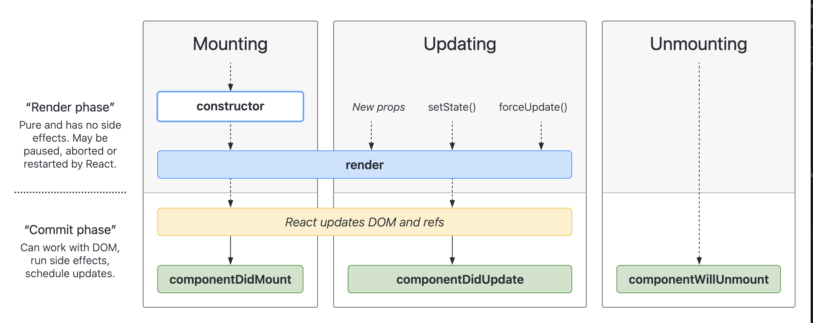

# [Component Lifecycle Methods](https://www.theodinproject.com/lessons/node-path-react-new-component-lifecycle-methods)

## Introduction

In the previous section, you've learned about a component's lifecycle. In functional components, we've primarily used the `useEffect` hook to perform tasks throughout the lifecycle, but in class components we have to use specific lifecycle methods instead.

We'll start with a short recap of what a component's lifecycle is. There are three stages to a component's life: mounting, updating, and unmounting. Each of these have a method assigned to them within class components, which is what we are going to cover in this lesson.

<br>

## Lesson overview

This section contains a general overview of topics that you will learn in this lesson.

- Learn how to use lifecycle methods in a class component.

<br>

## `render()`

The render function is the most used lifecycle method, and one that you've come across in the last class components lesson. It is the only required lifecycle method in a class component. It runs on mount and update of a component. Render should be pure, meaning it doesn't modify component state, returns the same thing each time it's called (given the same inputs), and doesn't directly interact with the browser.

<br>

## `componentDidMount()`

This method is run after the component is mounted (inserted in the DOM tree). You should make any calls to fetch data that is needed for the component here. It is also a good place to do anything that is reliant on the component, such as fetching from an API.

<br>

## `componentDidUpdate()`

This method is run after a component re-renders. Because of this, you have to be careful about what you update in this method, as if you're updating state indiscriminately, a re-render is caused, and you'll end up in an endless loop. You can avoid this issue by using conditional statements about the equality of previous and current props when updating state.

In this method you should be updating anything that needs to be changed in response to either the DOM changing, or any states that you might want to act on upon change. For example, you'd watch to refetch user data if the user changes.

<br>

## `componentWillUnmount()`

This is the last lifecycle method, which is called before a component is unmounted and destroyed. In this method you should be performing cleanup actions, so that you would be cancelling network requests, clearing timers, etc.

<br>

## How `useEffect()` combines the lifecycle methods

Now that we've learnt about class lifecycle methods, it's useful to understand that the `useEffect` hook used in functional components is essentially a combination of `componentDidMount`, `componentDidUpdate`, and `componentWillUnmount`. Which method/methods it relates to varies based on its dependency array, and if it returns anything.

- An empty dependency array would be equivalent to `componentDidMount`.

- A dependency array with a value/values in it would be a combination of `componentDidMount` and `componentDidUpdate`, but only updating when dependencies change.

- No dependency array would be equivalent to `componentDidMount` and `componentDidUpdate` combined.

- A return function inside of a `useEffect()` hook would be equivalent to `componentWillUnmount`.

For example:

```js
useEffect(() => {
	placeholderFunction()
	return () => cleanUpFunction()
}, [])
```

In this snippet, the useEffect contains the functionality of `componentDidMount`, and `componentWillUnmount` via the return function. This example doesn't have the `componentDidUpdate` functionality because of an empty dependency array.

<br>

## Knowledge check

- **What is the only required lifecycle method?**

The only lifecycle method required is `render`.

<br>

- **What lifecycle method should you use for initial data fetching?**

For initial data fetching, you should use `componentDidMount`

<br>

- **When you want to act upon change of the DOM, or of state, what lifecycle method would you use?**

When you want to do something in response to change of DOM or state, you can use `componentDidUpdate` lifecycle method

<br>

- **When performing cleanup actions, what lifecycle method should be used?**

To perform cleanup actions, you should use `componentWillUnmount`.

<br>

- **How does the useEffect hook combine some of the lifecycle methods?**

It varies based on its dependency array, and if it returns anything.

- An empty dependency array would be equivalent to `componentDidMount`

- A dependency array with a value/values in it would be a combination of `componentDidMount` and `componentDidUpdate`, but only updating when dependencies change.

- No dependency array would be equivalent to `componentDidMount` and `componentDidUpdate` combined.

- A return function inside of a `useEffect()` hook would be equivalent to `componentWillUnmount`.

<hr>
<br>
<br>



[Link](https://projects.wojtekmaj.pl/react-lifecycle-methods-diagram/)

<hr>
<br>
<br>

# [Component](https://react.dev/reference/react/Component)

> **Pitfall**
>
> We recommend defining components as functions instead of classes. [See how to migrate.](https://react.dev/reference/react/Component#alternatives)

`Component` is the base class for the React components defined as JavaScript classes. Class components are still supported by React, but we don't recommend using them in new code.

```js
class Greetings extends Component {
	render() {
		return <h1>Hello, {this.props.name}</h1>
	}
}
```

<br>

## Reference

### `Component`

To define a React component as a class, extend the built-in `Component class` and define a `render` method:

```js
import { Component } from 'react'

class Greeting extends Component {
	render() {
		return <h1>Hello, {this.props.name}!</h1>
	}
}
```

Only the `render` method is required, other methods are optional.

<br>

### `context`

The context of a class component is available as `this.context`. It is only available if you specify _which_ context you want to receive using `static contextType`.

A class component can only read one context at a time.

```js
class Button extends Component {
	static contextType = ThemeContext

	render() {
		const theme = this.context
		const className = 'button-' + theme
		return <button className={className}>{this.props.children}</button>
	}
}
```

> **Note**
>
> Reading `this.context` in class components is equivalent to `useContext` in function components.

<br>

### `props`

The props passed to a class component are available as `this.props`.

```js
class Greeting extends Component {
	render() {
		return <h1>Hello, {this.props.name}!</h1>
	}
}

;<Greeting name='Taylor' />
```

> **Note**
>
> Reading `this.props` in class components is equivalent to declaring props in function components.

<br>

### `state`

The state of a class component is available as `this.state`. The `state` field must be an object. Do not mutate the state directly. If you wish to change the state, call `setState` with the new state.

```js
class Counter extends Component {
	state = {
		age: 42,
	}

	handleAgeChange = () => {
		this.setState({
			age: this.state.age + 1,
		})
	}

	render() {
		return (
			<>
				<button onClick={this.handleAgeChange}>Increment age</button>
				<p>You are {this.state.age}.</p>
			</>
		)
	}
}
```

> **Note**
>
> Defining `state` in class components is equivalent to calling `useState` in function components.

<br>

### `constructor(props)`

The constructor runs before your class component _mounts_ (gets added to the screen). Typically, a constructor is only used for two purposes in React. It lets you declare state and bind your class methods to the class instance:

```js
class Counter extends Component {
	constructor(props) {
		super(props)
		this.state = { counter: 0 }
		this.handleClick = this.handleClick.bind(this)
	}

	handleClick() {
		// ...
	}
}
```

If you use modern JavaScript syntax, constructors are rarely needed. Instead, you can rewrite this code above using the public class field syntax which is supported by modern browsers and tools like Babel:

```js
class Counter extends Component {
	state = { counter: 0 }

	handleClick = () => {
		// ...
	}
}
```

A constructor should not contain any side effects or subscriptions.

#### Parameters

- `props`: The component's initial props.

#### Returns

`constructor` should not return anything.

#### Caveats

- Do not run any side effects or subscriptions in the constructor. Instead, use `componentDidMount` for that.

- Inside a constructor, you need to call `super(props)` before any other statement. If you don't do that, `this.props` will be `undefined` while the constructor runs, which can be confusing and cause bugs.

- Constructor is the only place where you can assign `this.state` directly. In all other methods, you need to use `this.setState()` instead. Do not call `setState` in the constructor.

- When you use server rendering, the constructor will run on the server too, followed by the `render` method. However, lifecycle methods like `componentDidMount` or `componentWillUnmount` will not run on the server.

- When Strict Mode is on, React will call `constructor` twice in development and then throw away one of the instances. This helps you notice the accidental side effects that need to be moved out of the `constructor`.

> **Note**
>
> There is no exact equivalent for `constructor` in function components. To declare state in a function component, call `useState`. To avoid recalculating the initial state, pass a function to `useState`.

<br>

### `componentDidCatch(error, info)`

If you define `componentDidCatch`, React will call it when some child component (including distant children) throws an error during rendering. This lets you log an error to an error reporting service in production.

Typically, it is used together with `static getDerivedStateFromError` which lets you update state in response to an error and display an error message to the user. A component with these methods is called an _error boundary._

#### Parameters

- `error`: The error that was thrown. In practice, it will usually be an instance of `Error` but this is not guaranteed because JavaScript allows to `throw` at any value, including strings or even `null`.

- `info`: An object containing additional information about the error. Its `componentStack` field contains a stack trace with the component that threw, as well as the names and source locations of all its parent components. In production, the component names will be minified. If you set up production error reporting, you can decode the component stack using sourcemaps the same way as you would do for regular JavaScript error stacks.

#### Returns

`componentDidCatch` should not return anything.

#### Caveats

- In the past, it was common to call `setState` inside `componentDidCatch` in order to update the UI and display the fallback error message. This is deprecated in favor of defining `static getDerivedStateFromError`.

- Production and development builds of React slightly differ in the way `componentDidCatch` handles errors. In development, the errors will bubble up to `window`, which means that any `window.onerror` or `window.addEventListener('error', callback)` will intercept the errors that have been caught by `componentDidCatch`. In production, instead, the errors will not bubble up, which means any ancestor error handler will only receive errors not explicitly caught by `componentDidCatch`.

> **Note**
>
> There is no direct equivalent for `componentDidCatch` in function components yet. If you'd like to avoid creating class components, write a single `ErrorBoundary` component like above and use it throughout the app. Alternatively, you can use the `react-error-boundary` package which does that for you.

<br>

## `componentDidMount()`

If you define the `componentDidMount` method, React will call it when your component is added _(mounted)_ to the screen. This is a common place to start data fetching, set up subscriptions, or manipulate the DOM nodes.

If you implement `componentDidMount`, you usually need to implement other lifecycle methods to avoid bugs. For example, if `componentDidMount` reads some state or props, you also have to implement `componentDidUpdate` to handle their changes, and `componentWillUnmount` to clean up whatever `componentDidMount` was doing.

```js
class ChatRoom extends Component {
	state = {
		serverUrl: 'https://localhost:1234',
	}

	componentDidMount() {
		this.setupConnection()
	}

	componentDidUpdate(prevProps, prevState) {
		if (
			this.props.roomId !== prevProps.roomId ||
			this.state.serverUrl !== prevState.serverUrl
		) {
			this.destroyConnection()
			this.setupConnection()
		}
	}

	componentWillUnmount() {
		this.destroyConnection()
	}

	// ...
}
```

### Parameters

`componentDidMount` does not take any parameters.

### Returns

`componentDidMount` should not return anything

### Caveats

- When Strict Mode is on, in development React will call `componentDidMount`, then immediately call `componentWillUnmount`, and then call `componentDidMount` again. This helps you notice if you forgot to implement `componentWillUnmount` or if its logic doesn't fully "mirror" what `componentDidMount` does.

- Although you may call `setState` immediately in `componentDidMount`, it's best to avoid that when you can. It will trigger an extra rendering, but it will happen before the browser updates the screen. This guarantees that even though the `render` will be called twice in this case, the user won't see the intermediate state. Use this pattern with caution because it often causes performance issues. In most cases, you should be able to assign the initial state in the `constructor` instead. It can, however, be necessary for cases like modals and tooltips when you need to measure a DOM node before rendering something that depends on its size or position.

> **Note**
>
> For many use cases, defining `componentDidMount`, `componentDidUpdate`, and `componentWillUnmount` together in class components is equivalent to calling `useEffect` in function components. In the rare cases where it's important for the code to run before the browser paint, `useLayoutEffect` is a closer match.

<br>

## `componentDidUpdate(prevProps, prevState, snapshot?)`

If you define the `componentDidUpdate` method, React will call it immediately after your component has been re-rendered with updated props or state. This method is not called for the initial render.

You can use it to manipulate the DOM after an update. This is also a common place to do network requests as long as you compare the current props to previous props (e.g. a network request may not be necessary if the props have not changed). Typically, you'd use it together with `componentDidMount` and `componentWillUnmount`:

```js
class ChatRoom extends Component {
	state = {
		serverUrl: 'https://localhost:1234',
	}

	componentDidMount() {
		this.setupConnection()
	}

	componentDidUpdate(prevProps, prevState) {
		if (
			this.props.roomId !== prevProps.roomId ||
			this.state.serverUrl !== prevState.serverUrl
		) {
			this.destroyConnection()
			this.setupConnection()
		}
	}

	componentWillUnmount() {
		this.destroyConnection()
	}

	// ...
}
```

### Parameters

- `prevProps`: Props before the update. Compare `prevProps` to `this.props` to determine what changed.

- `prevState`: State before the update. Compare `prevState` to `this.state` to determine what changed.

- `snapshot`: If you implemented `getSnapshotBeforeUpdate`, `snapshot` will contain the value you returned from that method. Otherwise, it will be `undefined`.

### Returns

`componentDidUpdate` should not return anything.

### Caveats

- `componentDidUpdate` will not get called if `shouldComponentUpdate` is defined and returns `false`.

- The logic inside `componentDidUpdate` should usually be wrapped in conditions comparing `this.props` with `prevProps`, and `this.state` with `prevState`. Otherwise, there's a risk of creating infinite loops.

- Although you may call `setState` immediately in `componentDidUpdate`, it's best to avoid that when you can. It will trigger an extra rendering, but it will happen before the browser updates the screen. This guarantees that even though the `render` will be called twice in this case, the user won't see the intermediate state. This pattern often causes performance issues, but it may be necessary for rare cases like modals and toolstips when you need to measure a DOM node before rendering something that depends on its size or position.

> **Note**
>
> For many use cases, defining `componentDidMount`, `componentDidUpdate`, and `componentWillUnmount` together in class components is equivalent to calling `useEffect` in function components. In the rare cases where it's important for the code to run before the browser paint, `useLayoutEffect` is a closer match.

<br>

## `componentWillMount()`

> **Deprecated**
>
> This API has been renamed from `componentWillMount` to `UNSAFE_componentWillMount`. The old name has been deprecated. In a future major version of React, only the new name will work.
>
> Run the `rename-unsafe-lifecycles` codemod to automatically update your components.

<br>

## `componentWillReceiveProps(nextProps)

> **Deprecated**
>
> This API has been renamed from `componentWillReceiveProps` to `UNSAFE_componentWillReceiveProps`. The old name has been deprecated. In a future major version of React, only the new name will work.
>
> Run the `rename-unsafe-lifecycles` codemod to automatically update your components.

<br>

## `componentWillUpdate(nextProps, nextState)`

> **Deprecated**
>
> This API has been renamed from `componentWillUpdate` to `UNSAFE_componentWillUpdate`. The old name has been deprecated. In a future major version of React, only the new name will work.

Run the `rename-unsafe-lifecycles` codemod to automatically update your components.

<br>

## `componentWillUnmount()`

If you define the `componentWillUnmount` method, React will call it before your component is removed _(unmounted)_ from the screen. This is a common place to cancel data fetching or remove subscriptions.

The logic inside `componentWillUnmount` should "mirror" the logic inside `componentDidMount`. For example, if `componentDidMount` sets up a subscription, `componentWillUnmount` should clean up that subscription. If the cleanup logic in your `componentWillUnmount` reads some props or state, you will usually also need to implement `componentDidUpdate` to clean up resources (such as subscriptions) corresponding to the old props and state.

```js
class ChatRoom extends Component {
	state = {
		serverUrl: 'https://localhost:1234',
	}

	componentDidMount() {
		this.setupConnection()
	}

	componentDidUpdate(prevProps, prevState) {
		if (
			this.props.roomId !== prevProps.roomId ||
			this.state.serverUrl !== prevState.serverUrl
		) {
			this.destroyConnection()
			this.setupConnection()
		}
	}

	componentWillUnmount() {
		this.destroyConnection()
	}

	// ...
}
```

### Parameters

`componentWillUnmount` does not take any parameters.

### Returns

`componentWillUnmount` should not return anything.

### Caveats

- When Strict Mode is on, in development React will call `componentDidMount`, then immediately call `componentWillUnmount`, and then call `componentDidMount` again. This helps you notice if you forgot to implement `componentWillUnmount` or if its logic doesn't fully "mirror" what `componentDidMount` does.

> **Note**
>
> For many use cases, defining `componentDidMount`, `componentDidUpdate`, and `componentWillUnmount` together in class components is equivalent to calling `useEffect` in function components. In the rare cases where it's important for the code to run before browser paint, `useLayoutEffect` is a closer match.
