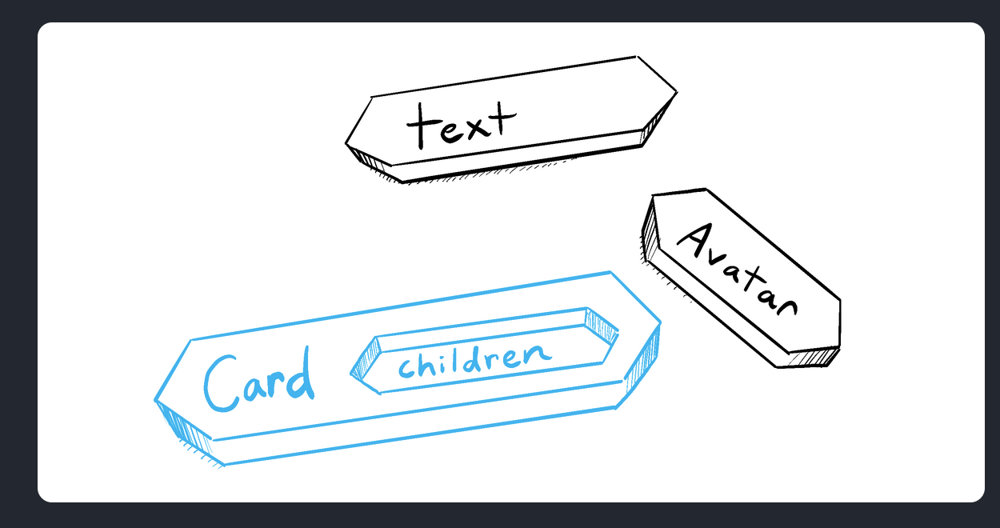

# [Passing Data Between Components](https://www.theodinproject.com/lessons/node-path-react-new-passing-data-between-components)

## Introduction

By now you should be starting to understand just how powerful React and reusable components can be, but you may be left wondering 'How can I share information between components?' or 'Am I able to customize the behavior of my components each time I use them?'. In this lesson, we will learn about React props (short for properties) and how to use props to pass data between components.

<br>

## Lesson overview

- Passing data between components

- Using data to create customizable reusable components.

<br>

## Data transfer in React

In React, data is transferred from parent component to child components via props. This data transfer is unidirectional, meaning it flows in only one direction. Any changes made to this data will only affect child components using the data, and not parent or sibling components. This restriction on the flow of data gives us more explicit control over it, resulting in fewer errors in our application.

<br>

## Using props in React

Now that we know _how_ data transfers between components, let's explore _why_ this might be a useful feature in React. Consider the following `Button` component, which gets rendered multiple times within our `App` component.

```js
function Button() {
	return <button>Click Me!</button>
}

export default function App() {
	return (
		<div>
			<Button />
			<Button />
			<Button />
		</div>
	)
}
```

So far so good right? We have a beautiful reusable button that we can use as many times as we like, there is just one small problem.

What if we wanted the text within our second button to be "Don't Click Me!"? Right now, we would have to create a second button component with this different text.

```js
function Button() {
	return <button>Click Me!</button>
}

function Button2() {
	return <button>Don't Click Me!</button>
}

export default function App() {
	return (
		<div>
			<Button />
			<Button2 />
			<Button />
		</div>
	)
}
```

This may not seem like a huge deal right now, but what if we had 10 buttons? Each one having different text, fonts, colors, sizes, and any other variation you can think of. Creating a new component for each of these button variations would very quickly lead to a LOT of code duplication.

Let's see how by using props, we can account for any number of variations with a _single_ button component.

```js
function Button(props) {
	const buttonStyle = {
		color: props.color,
		fontSize: props.fontSize + 'px',
	}

	return <button style={buttonStyle}>{props.text}</button>
}

export default function App() {
	return (
		<div>
			<Button text='Click Me!' color='blue' fontSize={12} />
			<Button text="Don't Click Me!" color='red' fontSize={12} />
			<Button text='Click Me!' color='blue' fontSize={20} />
		</div>
	)
}
```

There are a few things going on here.

- The `Button` functional component now receives `props` as a function argument. The individual properties are then referenced within the component via `props.propertyName`.

- When rendering the `Button` components within `App`, the `prop` values are defined on each component.

- Inline styles are dynamically generated and then applied to the `button` element.

<br>

## Prop destructuring

A very common pattern you will come across in React is prop destructuring. Unpacking your props in the component arguments allows for more concise and readable code. Check out prop destructuring in action in the example below.

```js
function Button({ text, color, fontSize }) {
	const buttonStyle = {
		color: color,
		fontSize: fontSize + 'px',
	}

	return <button style={buttonStyle}>{text}</button>
}

export default function App() {
	return (
		<div>
			<Button text='Click Me!' color='blue' fontSize={12} />
			<Button text="Don't Click Me!" color='red' fontSize={12} />
			<Button text='Click Me!' color='blue' fontSize={20} />
		</div>
	)
}
```

<br>

## Default props

You may have noticed in the above examples that there is some repetition when defining props on the `Button` components within `App`. In order to stop repeating ourselves by re-defining these common values, and to protect our application from undefined values, we can define default parameters to set default values for props.

```js
function Button({ text = 'Click Me!', color = 'blue', fontSize = 12 }) {
	const buttonStyle = {
		color: color,
		fontSize: fontSize + 'px',
	}

	return <button style={buttonStyle}>{text}</button>
}

export default function App() {
	return (
		<div>
			<Button text='Click Me!' color='blue' fontSize={12} />
			<Button text="Don't Click Me!" color='red' fontSize={12} />
			<Button text='Click Me!' color='blue' fontSize={20} />
		</div>
	)
}
```

As you can see, we now only need to supply prop values to `Button` when rendering within `App` if they differ from the default values defined in the function parameters.

You may also come across the use of `defaultProps` in some codebases. This was traditionally used to set default values for props, particularly in class components. Here's how it looks:

```js
function Button({ text, color, fontSize }) {
	const buttonStyle = {
		color: color,
		fontSize: fontSize + 'px',
	}

	return <button style={buttonStyle}>{text}</button>
}

Button.defaultProps = {
	text: 'Click Me!',
	color: 'blue',
	fontSize: 12,
}

export default function App() {
	return (
		<div>
			<Button />
			<Button text="Don't Click Me!" color='red' />
			<Button fontSize={20} />
		</div>
	)
}
```

While React now prefers the default parameter approach for function components, understanding `defaultProps` is still useful, especially when working with class components or older codebases.

<br>

## Functions as props

In addition to passing variables through to child components as props, you can also pass through functions. Consider the following example.

```js
function Button({
	text = 'Click Me!',
	color = 'blue',
	fontSize = 12,
	handleClick,
}) {
	const buttonStyle = {
		color: color,
		fontSize: fontSize + 'px',
	}

	return (
		<button onClick={handleClick} style={buttonStyle}>
			{text}
		</button>
	)
}

export default function App() {
	const handleButtonClick = () => {
		window.location.href = 'https://www.google.com'
	}

	return (
		<div>
			<Button handleClick={handleButtonClick} />
		</div>
	)
}
```

- The function `handleButtonClick` is defined in the parent component.

- A reference to this function is passed through as the value for the `handleClick` prop on the `Button` component.

- The function is received in `Button` and is called on a click event.

There are a few things to note here.

- We only pass through a reference to `handleButtonClick`, i.e. we do not include parenthesis when passing the function to `Button`. If we were to do something like `handleClick={handleButtonClick()}` then the function would be called as the button renders

- Every `Button` calling this function will navigate to the same page. We can refactor the function and supply an argument within `Button` to customize this functionality.

```js
function Button({
	text = 'Click Me!',
	color = 'blue',
	fontSize = 12,
	handleClick,
}) {
	const buttonStyle = {
		color: color,
		fontSize: fontSize + 'px',
	}

	return (
		<button onClick={handleClick} style={buttonStyle}>
			{text}
		</button>
	)
}

export default function App() {
	const handleButtonClick = (url) => {
		window.location.href = url
	}

	return (
		<div>
			<Button
				handleClick={() => handleButtonClick('https://www.theodinproject.com')}
			/>
		</div>
	)
}
```

When supplying an argument to the function, we can't just write `onClick={handleClick('https://www.theodinproject.com')}`, and instead must attach a reference to an anonymous function which then calls the function with the argument. Like the previous example, this is to prevent the function being called during the render.

> There are also other ways to implement this behavior: Hint: [curried functions](https://javascript.info/currying-partials)!

Hopefully, you can now understand from the examples in this lesson just now incredibly useful props are for writing reusable and customizable React components. However, we are still only scratching the surface of what React can offer us. Continue on to the next section to learn even more!

<br>

## Knowledge check

- **How does data flow between React components? From child to parent? From parent to child? Both?**

The data flow between React components is unidirectional, only from parent to child.

<br>

- **Why do we use props in React?**

We use props in React so we can pass arguments to our component, from which we can determine what to render (or to render anything at all), or run other conditions before rendering.

<br>

- **How do we define default properties on a React component? What are some benefits in doing so?**

We define default properties on a React component by adding them in the function parameter `propertyName = 'defaultPropValue'`. The benefits in doing so is we can make the most common value to be the default, so we don't have to specify those props whenever we call the component.

<br>

- **How can we pass functions as props?**

We pass functions as props just like how we pass regular props. We only pass through a reference to the function and we do not include the parenthesis as that would make the function call when the component is rendered.

<hr>
<br>
<br>

# [Passing Props to a Component](https://react.dev/learn/passing-props-to-a-component)

React components use _props_ to communicate with each other. Every parent component can pass some information to its child components by giving them props. Props might remind you of HTML attributes, but you can pass any JavaScript value through them, including objects, arrays, and functions.

<br>

## You will learn

- How to pass props to a component

- How to read props from a component

- How to specify default values for props

- How to pass some JSX to a component

- How props change over time

<br>

## Familiar props

Props are the information that you pass to a JSX tag. For example, `className`, `src`, `alt`, `width`, and `height` are some of the props you can pass to an ``:

```js
function Avatar() {
	return (
		
	)
}

export default function Profile() {
	return <Avatar />
}
```


The props you can pass to an `` tag are predefined (ReactDOM conforms to the HTML standard). But you can pass any props to _your own_ components, such as `<Avatar>`, to customize them. Here's how!

<br>

## Passing props to a component

In this code, the `Profile` component isn't passing any props to its child component, `Avatar`:

```js
export default function Profile() {
	return <Avatar />
}
```

You can give `Avatar` some props in two steps.

### Step 1: Pass props to the child component

First, pass some props to `Avatar`. For example, let's pass two props: `person` (an object), and `size` (a number):

```js
export default function Profile() {
	return (
		<Avatar person={{ name: 'Lin Yanying', imageId: '1bX5QH6' }} size={100} />
	)
}
```

> **Note**
>
> If double curly braces after `person=` confuse you, recall [they're merely an object](https://react.dev/learn/javascript-in-jsx-with-curly-braces#using-double-curlies-css-and-other-objects-in-jsx) inside the JSX curlies.

Now you can read these props inside the `Avatar` component.

<br>

### Step 2: Read props inside the child component

You can read these props by listing their names `person, size` separated by the commas inside `({` and `})` directly after `function Avatar`. This lets you use them inside the `Avatar` code, like you would with a variable.

```js
function Avatar({ person, size }) {
	// person and size are available here
}
```

Add some logic to `Avatar` that uses the `person` and `size` props for rendering, and you're done.

Now you can configure `Avatar` to render in many different ways with different props. Try tweaking the values!

```js
// utils.js
export function getImageUrl(person, size = 's') {
	return 'https://i.imgur.com/' + person.imageId + size + '.jpg'
}
```

```js
// App.js
import { getImageUrl } from './utils.js'

function Avatar({ person, size }) {
	return (
		
	)
}

export default function Profile() {
  return (
    <div>
      <Avatar size={100} person={{ name: 'Katsuko Saruhashii', imageId: 'Yfe0qp2' }}>
      <Avatar size={80} person={{ name: 'Aklilu Lemma', imageId: 'OKS67lh' }}>
      <Avatar size={50} person={{ name: 'Lin Lanying', imageId: '1bX5QH6' }}>
    </div>
  )
}
```


Props let you think about parent and child components independently. For example, you can change the `person` or the `size` props inside `Profile` without having to think about how `Avatar` uses them. Similarly, you can change how the `Avatar` uses these props, without looking at the `Profile`.

You can think of props like "knobs" that you can adjust. They serve the same role as arguments serve for functions -- in fact, props _are_ the only argument to your component! React component functions accept a single largument, a `props` object:

```js
function Avatar(props) {
	let person = props.person
	let size = props.size
	// ...
}
```

Usually you don't need the whole `props` object itself, so you destructure it into individual props.

> **Pitfall**
>
> **Don't miss the pair of `{` and `}` curlies inside** of `(` and `)` when declaring props:
>
> ```js
> function Avatar({ person, size }) {
> 	// ...
> }
> ```
>
> This syntax is called "destructuring" and is equivalent to reading propeties from a function parameter:
>
> ```js
> function Avatar(props) {
> 	let person = props.person
> 	let size = props.size
> 	// ...
> }
> ```

<br>

## Specifying a default value for a prop

If you want to give a prop a default value to fall back on when no value is specified, you can do it with the destructuring by putting `=` and the default value right after the parameter:

```js
function Avatar({ person, size = 100 }) {
	// ...
}
```

Now, if `<Avatar person={...} />` is rendered with no `size` prop, the `size` will be set to `100`.

The default value is only used if the `size` prop is missing or if you pass `size={undefined}`. But if you pass `size={null}` or `size={0}`, the default value will **not** be used.

<br>

## Forwarding props with the JSX spread syntax

Sometimes, passing props gets very repetitive:

```js
function Profile({ person, size, isSepia, thickBorder }) {
	return (
		<div className='card'>
			<Avatar
				person={person}
				size={size}
				isSepia={isSepia}
				thickBorder={thickBorder}
			/>
		</div>
	)
}
```

There's nothing wrong with repetitive code -- it can be more legible. But at times you may value conciseness. Some components forward all of their props to their child, like how this `Profile` does with `Avatar`. Because they don't use any of their props directly, it can make sense to use a more concise "spread" syntax:

```js
function Profile(props) {
	return (
		<div className='card'>
			<Avatar {...props} />
		</div>
	)
}
```

This forwards all of `Profile`'s props to the `Avatar` without listing each of their names.

**Use spread syntax with restraint.** If you're using it in every other component, something is wrong. Often, it indicates that you should split your components and pass children as JSX. More on that next!

<br>

## Passing JSX as children

It is common to nest built-in browser tags:

```js
<div>
	
</div>
```

Sometimes you'll want to nest your own components the same way:

```js
<Card>
	<Avatar />
</Card>
```

When you nest content inside a JSX tag, the parent component will receive that content in a prop called `children`. For example, the `Card` component below will receive a `children` prop set to `<Avatar />` and render it in a wrapper div:

```js
function Card({ children }) {
	return <div className='card'>{children}</div>
}

export default function Profile() {
	return (
		<Card>
			<Avatar
				size={100}
				person={{
					name: 'Katsuko Saruhashi',
					imageId: 'YfeOqp2',
				}}
			/>
		</Card>
	)
}
```


Try replacing the `<Avatar>` inside `<Card>` with some text to see how the `Card` component can wrap any nested content. It doesn't need to "know" what's being rendered inside of it. You will see this flexible pattern in many places.

You can think of a component with `children` prop as having a "hole" that can be "filled in" by its parent components with arbitrary JSX. You will often use the `children` prop for visual wrappers: panels, grids, etc.



<br>

## How props change over time

The `Clock` component below receives two props from its parent component: `color` and `time`. (The parent component's code is omitted because it uses [state](https://react.dev/learn/state-a-components-memory), which we won't dive into just yet).

Try changing the color in the select box below:

```js
export default function Clock({ clock, time }) {
	return <h1 style={{ color: color }}>{time}</h1>
}
```


This example illustrates that **a component may receive different props over time.** Props are not always static! Here, the `time` prop changes every second, and the `color` prop changes when you select another color. Props reflect a component's data at any point in time, rather than only in th beginning.

However, props are immutable -- a term from computer science meaning "unchangeable". When a component needs to change its props (for example, in response to a user interaction or new data), it will have to "ask" its parent component to pass it _different props_ -- a new object! Its old props will then be cast aside, and eventually the JavaScript engine will reclaim the memory taken by them.

**Don't try to "change props".** When you need to respond to the user input (like changing the selector color), you will need to "set state", which you can learn about in [State: A Component's Memory](https://react.dev/learn/state-a-components-memory).

<br>

## Recap

- To pass props, add them to the JSX, just like you would with HTML attributes.

- To read props, use the `function Avatar({ person, size })` destructuring syntax.

- You can specify a default value like `size = 100`, which is used for missing and `undefined` props.

- You can forward all props with `<Avatar {...props} />` JSX spread syntax, but don't overuse it!

- Nested JSX like `<Card><Avatar /></Card>` will appear as `Card` component's `children` prop.

- Props are read-only snapshots in time: every render receives a new version of props.

- You can't change props. When you need interactivity, you'll need to set state.
