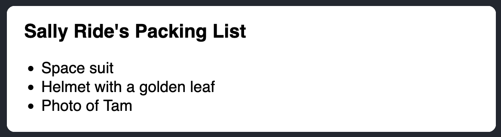
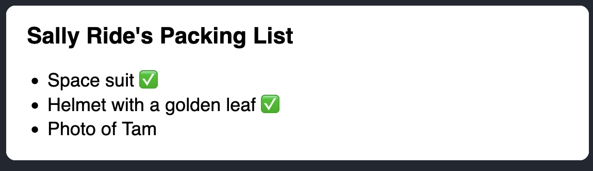
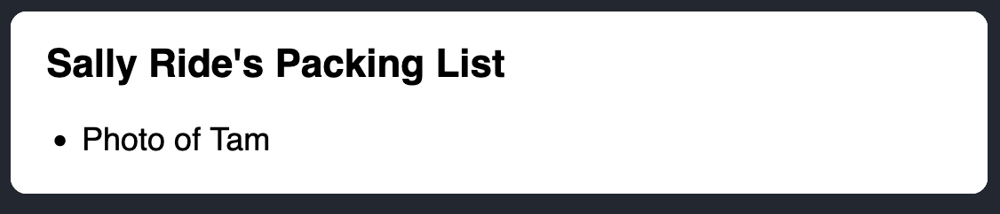
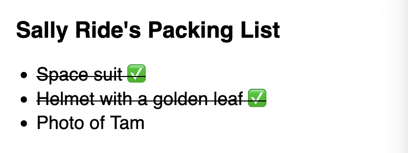
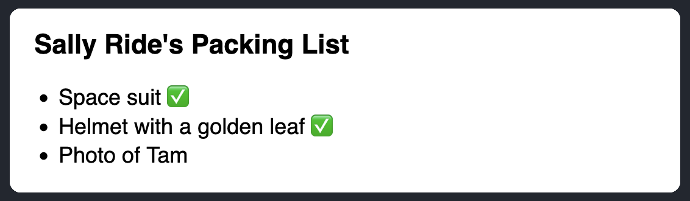
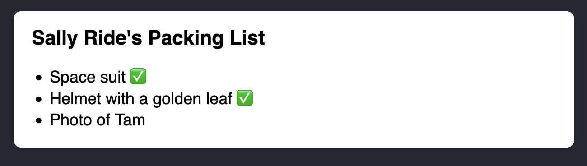
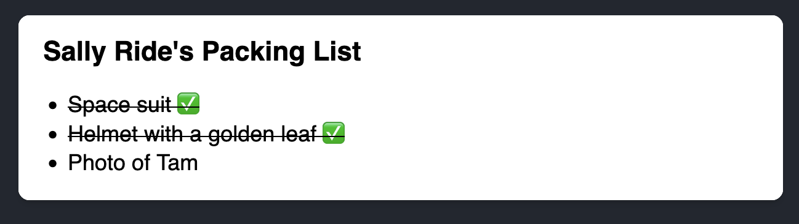
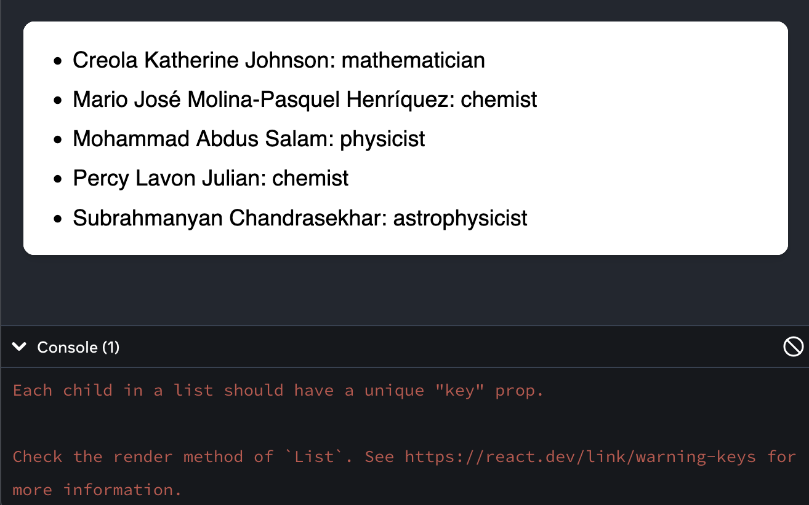
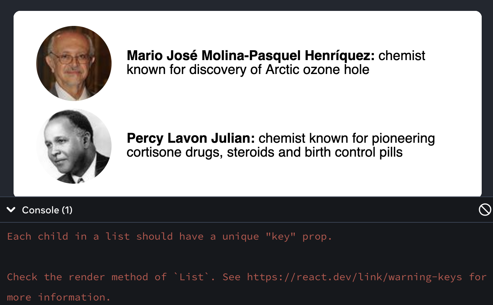

# [Rendering Techniques](https://www.theodinproject.com/lessons/node-path-react-new-rendering-techniques)

## Introduction

Now that we have learned how JSX works and how to write it, this lesson will cover how we can render multiple elements and conditionally render UI in JSX.

<br>

## Lesson overview

This section contains a general overview of topics that you will learn in this lesson.

- Render a list of elements/components in JSX.

- Conditionally render UI.

<br>

## Rendering a list of elements in JSX

Let us say we want to create a component that lists multiple animals:

```js
function App() {
	return (
		<div>
			<h1>Animals: </h1>
			<ul>
				<li>Lion</li>
				<li>Cow</li>
				<li>Snake</li>
				<li>Lizard</li>
			</ul>
		</div>
	)
}
```

It is perfectly acceptable, but what if we want to render more than just four? It can be tedious and long, and most of the time, we will be dealing with a data structure (like a list) rather than hard-coding each animal. You have previously learned that we can embed expressions inside JSX with curly braces. So let us do just that:

```js
function App() {
	const animals = ['Lion', 'Cow', 'Snake', 'Lizard']

	return (
		<div>
			<h1>Animals:</h1>
			<ul>
				{animals.map((animal) => {
					return <li key={animal}>{animal}</li>
				})}
			</ul>
		</div>
	)
}
```

We define an array called `animals`. Now inside our JSX, we use `map` to return a new array of `li` elements, adding `animal` as its text. It should now render the same as the previous snippet we wrote. This is because JSX has the ability to automatically render arrays. This is because JSX has the ability to automatically render arrays. The following code is identical:

```js
function App() {
	const animals = ['Lion', 'Cow', 'Snake', 'Lizard']
	const animalsList = animals.map((animal) => <li key={animal}>{animal}</li>)

	return (
		<div>
			<h1>Animals:</h1>
			<ul>{animalsList}</ul>
		</div>
	)
}
```

You may be curious as to what the `key` is in our `<li>` element. We will dive into how keys work in the next lesson. But, to explain briefly, it is to let React know the identity of each element in the list. React must know this information if you are dealing with a dynamic list where you add or remove elements. Since we are only dealing with a static list, it does not matter for now.

<br>

## Rendering a list of components in JSX

> We will use `props` here, and you will learn more about them in a future lesson. For now, you just need to know that `props` are arguments that are passed into components. We will just be writing a short implementation.

```js
function ListItem(props) {
	return <li>{props.animal}</li>
}

function List(props) {
	return (
		<ul>
			{props.animals.map((animal) => {
				return <ListItem key={animal} animal={animal} />
			})}
		</ul>
	)
}

function App() {
	const animals = ['Lion', 'Cow', 'Snake', 'Lizard']

	return (
		<div>
			<h1>Animals:</h1>
			<List animals={animals} />
		</div>
	)
}
```

We have moved our `<ul>` element to a different component called `<List />`. It still returns the `<ul>` element, but we can do a lot more with it as a component.

This component accepts a `props` which is an object containing the `animals` that we defined as a property when we wrote `<List animals={animals} />`. Do note that you can name it anything, for example, `<List animalList={animals} />`. You will still need to pass the animals to the property, but now you will use `props.animalList` instead of `props.animals`.

We have also created a different component for the `<li>` element called `<ListItem />`, which also accepts `props`, and uses `props.animal` to render the text. It should now render the same thing.

> **Missing in props validation**
> You may notice squiggly lined under your props, for example, under `animal` inside the `<ListItem />` component above.
>
> Hovering over these will tell you they are `missing in props validation`. For now, this can safely be ignored as it is just a default ESLint rule warning about prop types, something that will be covered later in the course.
>
> You may to turn off this rule by adding the following to your `eslint.config.js` file:
>
> ```js
> rules: {
>   // You other rules
>   "react/prop-types": "off"
> }
> ```

<br>

## Conditionally rendering UI

Let us make some decisions within our component. What if we only want to render an animal that starts with the letter L? To make these decisions, we would use some sort of conditional expression. Let us continue using the code above, but for brevity's safe, we will be removing the `<ListItem />` component.

### Using the ternary operator

One way to conditionally render an element is with a ternary operator, using a boolean value to decide what to render:

```js
function List(props) {
	return (
		<ul>
			{props.animals.map((animal) => {
				return animal.startWith('L') ? <li key={animal}>{animal}</li> : null
			})}
		</ul>
	)
}

function App() {
	const animals = ['Lion', 'Cow', 'Snake', 'Lizard']

	return (
		<div>
			<h1>Animals: </h1>
			<List animals={animals} />
		</div>
	)
}
```

We are using the String method `startsWith` to check if the `animal` starts with the letter L. This method either returns true or false.

If the animal starts with the letter L, then we return the `<li>` element, which renders the particular animal. Otherwise, we return `null` to indicate that no element will be rendered.

<br>

### Using the `&&` operator

Another quick way of conditionally rendering an element is by using the `&&` operator.

```js
function List(props) {
	return (
		<ul>
			{props.animals.map((animal) => {
				return animal.startsWith('L') && <li key={animal}>{animal}</li>
			})}
		</ul>
	)
}

function App() {
	const animals = ['Lion', 'Cow', 'Snake', 'Lizard']

	return (
		<div>
			<h1>Animals: </h1>
			<List animals={animals} />
		</div>
	)
}
```

We will leverage the return value of `startsWith` with the `&&` operator. If the result of the `startsWith` function is `true`, then it returns the second operand, which is the `<li>` element, and renders it. Otherwise, if the condition is `false` it just gets ignored.

> **Numbers with Logical AND (&&) - a common pitfall**
>
> When using `&&` for conditional rendering, don't put numbers on the left side. The React docs on conditional rendering provide more details about this in the `Pitfall` box in the section about `&&`.

<br>

### Other ways to render conditionally

We can also use `if`, `if/else`, and `switch` to conditionally render something.

This time we will have two conditions:

1. Check if the `animals` property is provided

2. Check if the `animals` length is greater than 0

We will frequently be dealing with lists in the future, and we also need to consider what to render if the list is empty or does not exist at all. You certainly would want to see a blank page, would you? Let us try to implement that:

```js
function List(props) {
	if (!props.animals) {
		return <div>Loading...</div>
	}

	if (props.animals.length === 0) {
		return <div>There are no animals in the list!</div>
	}

	return (
		<ul>
			{props.animals.map((animal) => {
				return <li key={animal}>{animal}</li>
			})}
		</ul>
	)
}

function App() {
	const animals = []

	return (
		<div>
			<h1>Animals:</h1>
			<List animals={animals} />
		</div>
	)
}
```

In our `<List />` component, we have two `if` statements acting as a guard that immediately returns an element based on the condition.

One is to check if the property `animals` exists, and the other is to check if the length of the list is greater than 0. In this case, our list is empty, so the second if statement executes, it will immediately return the `<div>` element that contains the text "There are no animals in the list."

If we remove the `animals` property:

```js
function App() {
	const animals = []

	return (
		<div>
			<h1>Animals:</h1>
			<List />
		</div>
	)
}
```

The first `if` statement will now execute and return a `<div>` with the text "Loading..." This is often the case when you are fetching from an API, since it might take some time to actually retrieve the data, it is good practice to show an indicator for that.

If none of those checks passed, then we have the data we need to render the list successfully. Try it out by adding items to the `animals` list and adding the property back.

You can, of course, also accomplish this with just the ternary and `&&` operators.

```js
function List(props) {
	return (
		<>
			{!props.animals ? (
				<div>Loading...</div>
			) : props.animals.length > 0 ? (
				<ul>
					{props.animals.map((animal) => {
						return <li key={animal}>{animal}</li>
					})}
				</ul>
			) : (
				<div>There are no animals in the list!</div>
			)}
		</>
	)
}

// or
function List(props) {
	return (
		<>
			{!props.animals && <div>Loading...</div>}
			{props.animals && animals.length > 0 && (
				<ul>
					{props.animals.map((animal) => {
						return <li key={animal}>{animal}</li>
					})}
				</ul>
			)}
			{props.animals && props.animals.length === 0 && (
				<div>There are no animals in the list!</div>
			)}
		</>
	)
}

function App() {
	const animals = []

	return (
		<div>
			<h1>Animals:</h1>
			<List animals={animals} />
		</div>
	)
}
```

Nested ternaries and multiple `&&` operators can be intimidating to look at, so be sure to test things out!

<br>

## Knowledge check

- **How do you render a list of elements/components in JSX?**

You use `{}` (curly braces) inside your JSX in order to use logic to render a list of elements/components.

<br>

- **What are the ways you could render UI conditionally?**

You can use the ternary operator (`?`) and/or the logical AND operator (`&&`) or use a separate function to conditionally render a UI.

<br>

- **How would you conditionally return JSX?**

You can write an `if`/`else` statement, you can use ternary operator, and you can use logical AND operator.

<hr>
<br>
<br>

# [Conditional Rendering](https://react.dev/learn/conditional-rendering)

Your components will often need to display different things depending on different conditions. In React, you can conditionally render JSX using JavaScript syntax like `if` statements, `&&`, and `? :` operators.

> ## You will learn
>
> - How to return different JSX depending on a condition
>
> - How to conditionally include or exclude a piece of JSX
>
> - Common conditional syntax shortcuts you'll encounter in React codebases

<br>

## Conditionally returning JSX

Let's say you have a `PackingList` component rendering several `Item`s, which can be marked as packed or not:

```js
function Item({ name, isPacked }) {
  return <li className="item">{name}</li>
}

export default function PackingList() {
  return (
    <section>
      <h1>Sally Ride's Packing List</h1>
      <ul>
        <Item isPacked={true} name='Space suit'>
        <Item isPacked={true} name='Helmet with a golden leaf'>
        <Item isPacked={false} name='Photo of tam'>
      </ul>
    </section>
  )
}
```



Notice that some of the `Item` components have their `isPacked` prop set to `true` instead of `false`. You want to add a checkmark (✅) to packed items if `isPacked={true}`.

You can write this as an `if`/`else` statement like so:

```js
if (isPacked) {
	return <li className='item'>{name} ✅</li>
}

return <li className='item'>{name}</li>
```

If the `isPacked` prop is `true`, this code **returns a different JSX tree**. With this change, some of the items get a checkmark at the end:

```js
function Item({ name, isPacked }) {
	if (isPacked) {
		return <li className='item'>{name} ✅</li>
	}
	return <li className='item'>{name}</li>
}

export default function PackingList() {
	return (
		<section>
			<h1>Sally Ride's Packing List</h1>
			<ul>
				<Item isPacked={true} name='Space suit' />
				<Item isPacked={true} name='Helmet with a golden leaf' />
				<Item isPacked={false} name='Photo of Tam' />
			</ul>
		</section>
	)
}
```



Try editing what gets returns in either case, and see how the result changes!

Notice how you're creating branching logic with JavaScript's `if` and `return` statements. In React, control flow (like conditions) is handled by JavaScript.

<br>

## Conditionally return nothing with `null`

In some situations, you won't want to render anything at all. For example, say you don't want to show packed items at all. A component must return something. In this case, you can return `null`:

```js
if (isPacked) {
	return null
}
return <li className='item'>{name}</li>
```

If `isPacked` is true, the component will return nothing, `null`. Otherwise, it will return JSX to render.

```js
function Item({ name, isPacked }) {
	if (isPacked) {
		return null
	}
	return <li className='item'>{name}</li>
}

export default function PackingList() {
	return (
		<section>
			<h1>Sally Ride's Packing List</h1>
			<ul>
				<Item isPacked={true} name='Space suit' />
				<Item isPacked={true} name='Helmet with a golden leaf' />
				<Item isPacked={false} name='Photo of Tam' />
			</ul>
		</section>
	)
}
```



In practice, returning `null` from a component isn't common because it might surprise a developer trying to render it. More often, you would conditionally include or exclude the component in the parent component's JSX. Here's how to do that!

<br>

## Conditionally including JSX

In the previous example, you controlled which (if any!) JSX tree would be returned by the component. You may already have noticed some duplication in the render output:

```js
<li className='item'>{name} ✅</li>
```

is very similar to

```js
<li className='item'>{name}</li>
```

Both of the conditional branches return `<li className="item">...</li>`:

```js
if (isPacked) {
	return <li className='item'>{name} ✅</li>
}
return <li className='item'>{name}</li>
```

While this duplication isn't harmful, it could make your code harder to maintain. What if you want to change the `className`? You'd have to do it in two places in your code! In such a situation, you could conditionally include a little JSX to make your code more DRY.

<br>

## Conditional (ternary) operator (`? :`)

JavaScript has a compact syntax for writing a conditional expression - the conditional operator or "ternary operator":

Instead of this:

```js
if (isPacked) {
	return <li className='item'>{name} ✅</li>
}

return <li className='item'>{name}</li>
```

You can write this:

```js
return <li className='item'>(isPacked ? name + ' ✅' : name)</li>
```

You read it as "if `isPacked` is true, then (`?`) render `name + ' ✅'`, otherwise (`:`) render `name`."

> **Are these two examples fully equivalent?**
>
> If you're coming from an object-oriented programming background, you might assume that the two examples above are subtly different because one of them may create two different "instances" of `<li>`. But JSX elements aren't "instances" because they don't hold any internal state and aren't real DOM nodes. They're lightweight descriptions, like blueprints. so these two examples, in fact, _are_ completely equivalent.
>
> [Preserving and Resetting State](https://react.dev/learn/preserving-and-resetting-state) goes into detail about how this works.

Now let's say you want to wrap the completed item's text into another HTML tag, like `<del>` to strike it out. You can add even more newlines and parentheses so that it's easier to nest more JSX in each of the cases:

<!-- prettier-ignore -->
```js 
function Item({ name, isPacked }) {
  return (
    <li className="item">
      {isPacked ? (
        <del>
          {name + ' ✅'}
        </del>
      ) : (
        name
      )}
    </li>
  )
}
```



This style works well for simple conditions, but use it in moderation. If your components get messy with too much nested conditional markup, consider extracting child components to clean things up. In React, markup is a part of your code, so you can use tools like variables and functions to tidy up complex expressions.

<br>

## Logical AND operator (`&&`)

Another common shortcut you'll encounter is the [JavaScript logical AND (`&&`) operator](<https://developer.mozilla.org/en-US/docs/Web/JavaScript/Reference/Operators/Logical_AND#:~:text=The%20logical%20AND%20(%20%26%26%20)%20operator,it%20returns%20a%20Boolean%20value.>). Inside React components, it often comes up when you want to render some JSX when the condition is true, **or render nothing otherwise**. With `&&`, you could conditionally render the checkmark only if `isPacked` is `true`:

```js
return (
	<li className='item'>
		{name} {isPacked && '✅'}
	</li>
)
```

You can read this as _"if `isPacked`, then (`&&`) render the checkmark, otherwise, render nothing."_

Here it is in action:

```js
function Item({ name, isPacked }) {
	return (
		<li className='item'>
			{name} {isPacked && '✅'}
		</li>
	)
}

export default function PackingList() {
	return (
		<section>
			<h1>Sally Ride's Packing List</h1>
			<ul>
				<Item isPacked={true} name='Space suit' />
				<Item isPacked={true} name='Helmet with a golden leaf' />
				<Item isPacked={false} name='Photo of Tam' />
			</ul>
		</section>
	)
}
```



A [JavaScript && expression](https://developer.mozilla.org/en-US/docs/Web/JavaScript/Reference/Operators/Logical_AND) returns the value of its right side (in our case, the checkmark) if the left side (our condition) is `true`. But if the condition is `false`, the whole expression becomes `false`. React considers `false` as a "hole" in the JSX tree, just like `null` or `undefined`, and doesn't render anything in its place.

> **Pitfall**
>
> **Don't put numbers on the left side of `&&`.**
>
> To test the condition, JavaScript converts the left side to a boolean automatically. However, if the left side is `0`, then the whole expression gets that value (`0`), and React will happily render `0` rather than nothing.
>
> For example, a common mistake is to write code like `messageCount && <p>New messages</p>`. It's easy to assume that it renders nothing when `messageCount` is `0`, but it really renders the `0` itself!
>
> To fix it, make the left side a boolean: `messageCount > 0 && <p>New messages</p>`.

<br>

### Conditionally assigning JSX to a variable

When the shortcuts get in the way of writing plain code, try using an `if` statement and a variable. You can reassign variables defined with `let`, so start by providing the default content you want to display, the name:

```js
let itemContent = name
```

Use an `if` statement to reassign a JSX expression to `itemContent` if `isPacked` is `true`:

```js
if (isPacked) {
	itemContent = name + ' ✅'
}
```

[Curly braces open the "window into JavaScript."](https://react.dev/learn/javascript-in-jsx-with-curly-braces#using-curly-braces-a-window-into-the-javascript-world) Embed the variable with curly braces in the returned JSX tree, nesting the previously calculated expression inside of JSX:

```js
<li className='item'>{itemContent}</li>
```

This style is the most verbose, but it's also the most flexible. Here it is in action:

```js
function Item({ name, isPacked }) {
	let itemContent = name
	if (isPacked) {
		itemContent = name + ` ✅`
	}
	return <li className='item'>{itemContent}</li>
}
```



Like before, this works not only for text, but for arbitrary JSX too:

```js
function Item({ name, isPacked }) {
	let itemContent = name
	if (isPacked) {
		itemContent = <del>{name + ' ✅'}</del>
	}
	return <li className='item'>{itemContent}</li>
}

export default function PackingList() {
	return (
		<section>
			<h1>Sally Ride's Packing List</h1>
			<ul>
				<Item isPacked={true} name='Space suit' />
				<Item isPacked={true} name='Helmet with a golden leaf' />
				<Item isPacked={false} name='Photo of Tam' />
			</ul>
		</section>
	)
}
```



If you're not familiar with JavaScript, this variety of styles might seem overwhelming at first. However, learning them will help you read and write any JavaScript code -- and not just React components! Pick the one you prefer for a start, and then consult this reference again if you forget how the other ones work.

<br>

## Recap

- In React, you control branching logic with JavaScript.

- You can return a JSX expression conditionally with an `if` statement.

- You can conditionally save some JSX to a variable and then include it inside other JSX by using the curly braces.

- In JSX, `{cond ? <A /> : <B />}` means _"if `cond`, render `<A />`, otherwise `<B />`"_.

- In JSX `{cond && <A />}` means _"if `cond`, render `<A />`, otherwise nothing"_.

- The shortcuts are common, but you don't have to use them if you prefer plain `if`.

<hr>
<br>
<br>

# [Rendering Lists](https://react.dev/learn/rendering-lists)

You will often want to display multiple similar components from a collection of data. You can use the JavaScript array methods to manipulate an array of data. On this page, you'll use `filter()` and `map()` with React to filter and transform your array of data into an array of components.

<br>

## You will learn

- How to render components from an array using JavaScript's `map()`

- How to render only specific components using JavaScript's `filter()`

- When and why to use React keys

<br>

## Rendering data from arrays

Say that you have a list of content.

```js
<ul>
	<li>Creola Katherine Johnson: mathematician</li>
	<li>Mario José Molina-Pasquel Henríquez: chemist</li>
	<li>Mohammad Abdus Salam: physicist</li>
	<li>Percy Lavon Julian: chemist</li>
	<li>Subrahmanyan Chandrasekhar: astrophysicist</li>
</ul>
```

The only difference among those list items is their contents, their data. You will often need to show several instances of the same component using different data when building interfaces: from lists of comments to galleries of profile images. In these situations, you can store that data in JavaScript objects and arrays and use methods like `map()` and `filter()` to render lists of components from them.

Here's a short example of how to generate a list of items from an array:

1. **Move** the data into an array:

```js
const people = [
	'Creola Katherine Johnson: mathematician',
	'Mario José Molina-Pasquel Henríquez: chemist',
	'Mohammad Abdus Salam: physicist',
	'Percy Lavon Julian: chemist',
	'Subrahmanyan Chandrasekhar: astrophysicist',
]
```

2. **Map** the `people` members into a new array of JSX nodes, `listItems`:

```js
const listItems = people.map((person) => <li>{person}</li>)
```

3. **Return** `listItems` from your component wrapped in a `<ul>`:

```js
return <ul>{listItems}</ul>
```

Here is the result:

```js
const people = [
	'Creola Katherine Johnson: mathematician',
	'Mario José Molina-Pasquel Henríquez: chemist',
	'Mohammad Abdus Salam: physicist',
	'Percy Lavon Julian: chemist',
	'Subrahmanyan Chandrasekhar: astrophysicist',
]

export default function List() {
	const listItems = people.map((person) => <li>{person}</li>)
	return <ul>{listItems}</ul>
}
```



Notice the sandbox above displays a console error:

> **Console**
>
> `Warning: Each child in a list should have a unique “key” prop.`

You'll learn how to fix this error later on this page. Before we get to that, let's add some structure to your data.

<br>

## Filtering arrays of items

This data can be structured even more.

```js
const people = [
	{
		id: 0,
		name: 'Creola Katherine Johnson',
		profession: 'mathematician',
	},
	{
		id: 1,
		name: 'Mario José Molina-Pasquel Henríquez',
		profession: 'chemist',
	},
	{
		id: 2,
		name: 'Mohammad Abdus Salam',
		profession: 'physicist',
	},
	{
		id: 3,
		name: 'Percy Lavon Julian',
		profession: 'chemist',
	},
	{
		id: 4,
		name: 'Subrahmanyan Chandrasekhar',
		profession: 'astrophysicist',
	},
]
```

Let's say you want a way to only show people whose profession is a `'chemist'`. You can use JavaScript's `filter()` method to return just those people. This method takes an array of items, passes them through a "test" (a function that returns `true` or `false`), and returns a new array of only those items that passed the test (returned `true`).

You only want the items where `profession` is `'chemist'`. The "test" function for this looks like `(person) => person.profession === 'chemist'`. Here's how to put it together:

1. **Create** a new array of just "chemist" people, `chemists`, by calling `filter()` on the `people` filtering by `person.profession === 'chemist'`:

```js
const chemists = people.filter((person) => person.profession === 'chemist')
```

2. Now **map** over `chemists`:

```js
const listItems = chemists.map((person) => (
	<li>
		
		<p>
			<b>{person.anme}</b>
			{' ' + person.profession + ' '}
			known for {person.accomplishment}
		</p>
	</li>
))
```

3. Lastly, **return** the `listItems` from your component:

```js
return <ul>{listItems}</ul>
```

```js
import { people } from './data.js'
import { getImageUrl } from './utils.js'

export default function List() {
	const chemists = people.filter((person) => person.profession === 'chemist')
	const listItems = chemists.map((person) => (
		<li>
			
			<p>
				<b>{person.anme}</b>
				{' ' + person.profession + ' '}
				known for {person.accomplishment}
			</p>
		</li>
	))
	return <ul>{listItems}</ul>
}
```



> **Pitfall**
>
> Arrow function implicitly return the expression right after `=>`, so you didn't need a `return` statement:
>
> ```js
> const listItems = chemists.map(
> 	(person) => <li>...</li> // Implicit return!
> )
> ```
>
> However, **you must write `return` explicitly if your `=>` is followed by a `{` curly brace!**
>
> ```js
> const listItems = chemists.map((person) => {
> 	// Curly brace
> 	return <li>...</li>
> })
> ```
>
> Arrow function containing `=> {` are said to have a ["block body".](https://developer.mozilla.org/en-US/docs/Web/JavaScript/Reference/Functions/Arrow_functions#function_body) They let you write more than a single line of code, but you _have_ to write a `return` statement yourself. If you forget it, nothing gets returned!

<br>

## Keeping list items in order with `key`

Notice that all the sandboxes above show an error in the console:

> **Console**
>
> `Warning: Each child in a list should have a unique “key” prop.`

You need to give each array item a `key` -- a string or a number that uniquely identifies it among other items in that array:

```js
<li key={person.id}>...</li>
```

> **Note**
>
> JSX elements directly inside a `map()` call always needs keys!

Keys tell React which array item each component corresponds to, so that it can match them up later. This becomes important if your array items can move (e.g. due to sorting), get inserted, or get deleted. A well-chosen `key` helps React infer what exactly has happened, and make the correct updates to the DOM tree.

Rather than generating keys on the fly, you should include them in your data:

```js
export const people = [
	{
		id: 0, // Used in JSX as a key
		name: 'Creola Katherine Johnson',
		profession: 'mathematician',
		accomplishment: 'spaceflight calculations',
		imageId: 'MK3eW3A',
	},
	{
		id: 1, // Used in JSX as a key
		name: 'Mario José Molina-Pasquel Henríquez',
		profession: 'chemist',
		accomplishment: 'discovery of Arctic ozone hole',
		imageId: 'mynHUSa',
	},
	{
		id: 2, // Used in JSX as a key
		name: 'Mohammad Abdus Salam',
		profession: 'physicist',
		accomplishment: 'electromagnetism theory',
		imageId: 'bE7W1ji',
	},
	{
		id: 3, // Used in JSX as a key
		name: 'Percy Lavon Julian',
		profession: 'chemist',
		accomplishment:
			'pioneering cortisone drugs, steroids and birth control pills',
		imageId: 'IOjWm71',
	},
	{
		id: 4, // Used in JSX as a key
		name: 'Subrahmanyan Chandrasekhar',
		profession: 'astrophysicist',
		accomplishment: 'white dwarf star mass calculations',
		imageId: 'lrWQx8l',
	},
]
```

<br>

> **Deep Dive**
>
> ### Displaying several DOM nodes for each list item
>
> What do you do when each item needs to render not one, but several DOM nodes?
>
> The short `<>...</>` Fragment syntax won't let you pass a key, so you need to either group them into a single `<div>`, or use the slightly longer and more explicit `<Fragment>` syntax:
>
> ```js
> import { Fragment } from 'react'
>
> // ...
>
> const listItems = people.map((person) => (
> 	<Fragment key={person.id}>
> 		<h1>{person.name}</h1>
> 		<p>{person.bio}</p>
> 	</Fragment>
> ))
> ```
>
> Fragments disappear from the DOM, so this will produce a flat list of `<h1>`, `<p>`, `<h1>`, `<p>`, and so on.

<br>

## Where to get your `key`

Different sources of data provide different sources of keys:

- **Data from a database:** If your data is coming from a database, you can use the database keys/ID, which are unique by nature.

- **Locally generated data:** If your data is generated and persisted locally (e.g. notes in a note-taking app), use an incrementing counter, `crypto.randomUUID()` or a pcacking like `uuid` when creating items.

<br>

## Rules of keys

- **Keys must be unique among siblings.** However, it's okay to use the same keys for JSX nodes in _different_ arrays.

- **Keys must not change** or that defeats their purpose! Don't generate them while rendering.

<br>

## Why does React need keys?

Imagine that files on your desktop didn't have names. Instead, you'd refer to them by their order -- the first file, the second file, and so on. You could get used to it, but once you delete a file, it would get confusing. The second file would become the first file, the third file would be the second file, and so on.

File names in a folder and JSX keys in an array serve a similar purpose. They let us uniquely identify an item between ites siblings. A well-chosen key provides more information than the position within the array. Even if the _position_ changes due to reordering, the `key` lets React identify the item throughout its lifetime.

<br>

> **Pitfall**
>
> You might be tempted to use an item's index in the array as its key. In fact, that's what React will use if you don't specify a `key` at all. But the order in which you render items will change over time if an item is inserted, deleted, or if the array gets reordered. Index as a key often leads to subtle and confusing bugs.
>
> Similarly, do not generate keys on the fly, e.g., with `key={Math.random()}`. This will cause keys to never match up between renders, leading to all your components and DOM being recreated every time. Not only is this slow, but it will also lose any user input inside the list items. Instead, use a stable ID based on the data.
>
> Note that your components won't receive `key` as a prop. It's only used as a hint by React itself. If your component needs an ID, you have to pass it as a separate prop: `<Profile key={id} userId={id} />`.

<br>

## Recap

On this page you learned:

- How to move data out of components and into data structures like arrays and objects.

- How to generate sets of similar components with JavaScript's `map()`.

- How to create arrays of filtered items with JavaScript's `filter()`.

- Why and how to set `key` on each component in a collection so React can keep track of each of them even if their position or data changes.
