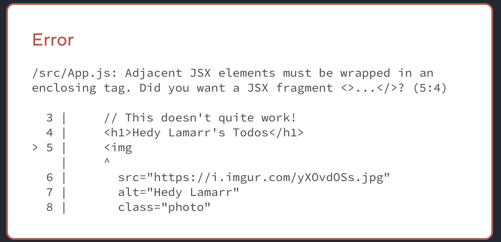

# [What is JSX?](https://www.theodinproject.com/lessons/node-path-react-new-what-is-jsx)

## Introduction

You're likely somewhat familiar with JSX from previous React lessons, in this lesson we're going to explain _what_ it is, _why_ we use it, and _how_ to use it in your React apps.

<br>

## Lesson overview

This section contains a general overview of topic that you will learn in this lesson.

- What JSX us.

- Differences between JSX and HTML.

<br>

## What is JSX?

JSX is a syntax extension for JavaScript that lets you write HTML-like markup inside a JavaSript file. It's not required to use JSX when writing React components, but it does make writing them more concise.

Essentially, JSX is syntactic sugar for the React createElement function. This function creates a React element, which is a plain object, so JSX compiles down to plain JavaScript objects.

Here you can see the logged value of a div JSX element with some text:


<br>

## Why do we use JSX?

Most of the time in apps, rendering logic and markup are inherently coupled, but we typically separate them by having our logic and markup in separate files. JSX allows React to separate concerns by containing both rendering logic and contnet in the same place (a component).

On top of this, it's a more intuitive, visual way to work with the UI inside your code, and allows React to show more useful error and warning messages.

<br>

## Rules of JSX

If you were to take some valid HTML and copy it straight into your React component, it would not work. This is due to some of the rules JSX implements, that aren't present in HTML.

1. Return a single root element.

If you wish to return multiple elements in a component, you can do so by wrapping them in a parent tag. This can be a `<div>`, or, if you don't want the elements to have a container, you could use a React fragment, like so: `<>Children</>`

Correct:

```js
function App() {
	// Could replace <></> with <div></div>
	return (
		<>
			<h1>Example h1</h1>
			<h2>Example h2</h2>
		</>
	)
}
```

Incorrect:

```js
function App() {
  return (
    <h1>Example h1</h1>
    <h2>Example h2</h2>
  )
}
```

2. Close all tags.

In HTML, many tags are self-closing and self-wrapping. In JSX however, we must explicitly close and wrap these tags.

`<input>` would become `<input />`, and `<li>` would become `<li></li>`

Correct:

```js
function App() {
	return (
		<>
			<input />
			<li></li>
		</>
	)
}
```

Incorrect:

```js
function App() {
  return (
    <>
      <input>
      <li>
    </>
  )
}
```

3. camelCase **Most** things.

JSX turns into JavaScript, and attributes of elements become keys of JavaScript objects, so you can't use dashes or reserved words such as `class`. Because of this, many HTML attributes are written in camelCase. Instead of `stroke-width`, you'd use `strokeWidth`, and instead of `class` you'd use `className`.

Correct:

```js
function App() {
	return (
		<div className='container'>
			<svg>
				<circle cx='25' cy='75' r='20' stroke='green' strokeWidth='2' />
			</svg>
		</div>
	)
}
```

Incorrect:

```js
function App() {
	return (
		<div class='container'>
			<svg>
				<circle cx='25' cy='75' r='20' stroke='green' stroke-width='2' />
			</svg>
		</div>
	)
}
```

<br>

## Converting HTML to JSX

Now that we've covered the Rules of JSX, we'll go through the conversion of a chunk of HTML to JSX

```html
<h1>Test title</h1>
<svg><circle cx='25' cy='75' r='20' stroke='green' stroke-width='2'></svg>
<form>
  <input type='text'>
</form>
```

If you try to return this from a React component, you would get many errors, so we are going to fix that!

Make sure to follow along this example in your local environment. Alternatively, you can go to react.new to have a quick React environment up and going in your web browser.

The first issue we get is that this would not return a single root element, so let's give it a container.

```html
<div>
  <h1>Test title</h1>
  <svg><circle cx='25' cy='75' r='20' stroke='green' stroke-width='2'></svg>
  <form>
    <input type='text'>
  </form>
</div>
```

You should see that another error appears now that we've fixed the initial one. This doesn't mean we created the error with our previous changes, just that React wasn't showing this one yet.

Now, onto the second issue, which is that we haven't closed the `<input>` tag.

```js
<div>
	<h1>Test title</h1>
	<svg>
		<circle cx='25' cy='75' r='20' stroke='green' stroke-width='2' />
	</svg>
	<form>
		<input type='text' />
	</form>
</div>
```

If you are following along, at this point you will stop seeing an error being rendered on-screen, this time it will be in the console.

The last issue is that we haven't camelCased our attributes, and so are using invalid DOM properties for JSX, specifically the `stroke-width`.

```js
<div>
	<h1>Test title</h1>
	<svg>
		<circle cx='25' cy='75' r='20' stroke='green' strokeWidth='2' />
	</svg>
	<form>
		<input type='text' />
	</form>
</div>
```

Now that we've applied all of the fixes to the errors that React gave us, this is fully fledged JSX code that can be used in a React component without any issues.

<br>

## Knowledge check

- **What is JSX?**

JSX is a syntax extension for JavaScript that lets you write HTML-like markup inside a JavaScript file.

<br>

- **Why do we use JSX?**

We typically separate rendering logic and markup in separate files. JSX allows React to separate concerns by containing both rendering logic and content in the same place (a component)

<br>

- **What are the three rules of JSX?**

1. Return a single root element.

2. Close all tags.

3. camelCase most things.

<br>

- **How do you reference a dynamic value inside of your JSX?**

You can use curly braces in your JSX to reference a dynamic value as well as bring JavaScript logic.

<hr>
<br>
<br>

# [Writing Markup with JSX](https://react.dev/learn/writing-markup-with-jsx)

_JSX_ is a syntax extension for JavaScript that lets you write HTML-like markup inside a JavaScript file. Although there are other ways to write components, most React developers prefer the conciseness of JSX, and most codebases use it.

<br>

## You will learn

- Why React mixes markup with rendering logic

- How JSX is different from HTML

- How to display information with JSX

<br>

## JSX: Putting markup into JavaScript

The Web has been built on HTML, CSS, and JavaScript. For many years, web developers kept content in HTML, design in CSS, and logic in JavaScript -- often in separate files! Content was marked up inside HTML while the page's logic lived separately in JavaScript:


HTML


JavaScript

<br>

But as the Web became more interactive, logic increasingly determined content. JavaScript was in charge of the HTML! This is why **in React, rendering logic and markup live together in the same place -- components**.


`Sidebar.js` React component


`Form.js` React component

<br>

Keeping a button's rendering logic and markup together ensures that they stay in sync with each other on every edit. Conversely, details that are unrelated, such as the button's markup and a sidebar's markup, are isolated from each other, making it safer to change either of them on their own.

Each React component is a JavaScript function that may contain some markup that React renders into the browser. React components use a syntax extension called JSX to represent that markup. JSX looks a lot like HTML, but it is a bit stricter and can display dynamic information. The best way to understand this is to convert some HTML markup to JSX markup.

> **Note:** JSX and React are two separate things. They're often used together, but you can [use them independently](https://legacy.reactjs.org/blog/2020/09/22/introducing-the-new-jsx-transform.html#whats-a-jsx-transform) of each other. JSX is a syntax extension, while React is a JavaScript library.

<br>

## Converting HTML to JSX

Suppose that you have some (perfectly valid) HTML:

<!-- prettier-ignore -->
```html
<h1>Hedy Lamarr's Todos</h1>

<ul>
	<li>Invent new traffic lights
	<li>Rehearse a movie scene
	<li>Improve the spectrum technology
</ul>
```

And you want to put it into your component:

```js
export default function TodoList() {
  return (
    // ???
  )
}
```

If you copy and paste it as is, it will not work:

```js
export default function TodoList() {
  return (
    // This doesn't quite work!
    <h1>Hedy Lamarr's Todos</h1>
    
    <ul>
      <li>Invent new traffic lights
      <li>Rehearse a movie scene
      <li>Improve the spectrum technology
    </ul>
  );
}
```



This is because JSX is stricter and has a few more rules than HTML! If you read the error messages above, they'll guide you to fix the markup, or you can follow the guide below.

> **Note:** Most of the time, React's on-screen error messages will help you find where the problem is. Give them a read if you get stuck!

<br>

## The Rules of JSX

### 1. Return a single root element

To return multiple elements from a component, **wrap them with a single parent tag**.

For example, you can use a `<div>`:

```js
<>
  <h1>Hedy Lamarr's Todos</h1>
  
  <ul>
    ...
  </ul>
</>
```

This empty tag is called a _[Fragment](https://react.dev/reference/react/Fragment)_. Fragments let you group things without leaving any trace in the browser HTML tree.

<br>

### 2. Close all the tags

JSX requires tags to be explicitly closed: self-closing tags like `` must become ``, and wrapping tags like `<li>oranges` must be written as `<li>oranges</li>`.

This is how Hedy Lamarr's image and list items look closed:

```js
<>
	
	<ul>
		<li>Invent new traffic lights</li>
		<li>Rehearse a movie scene</li>
		<li>Improve the spectrum technology</li>
	</ul>
</>
```

<br>

### 3. camelCase ~~all~~ most of the things!

JSX turns into JavaScript and attributes written in JSX becomes keys of JavaScript objects. In your own components, you will often want to read those attributes into variables. But JavaScript has limitations on variable names. For example, their names can't contain dashes or be reserved words like `class`.

This is why, in React, many HTML and SVG attributes are written in camelCase. For example, instead of `stroke-width` you use `strokeWidth`. Since `class` is a reserved word, in React you write `className` instead, named after the corresponding DOM property:

```js

```

You can find all these attributes in the list of DOM component props. If you get one wrong, don't worry -- React will print a message with a possible correction to the browser console.

> **Pitfall:** For historical reasons, `aria-*` and `data-*` attributes are written as in HMTL wish dashes.

<br>

### Pro-tip: Use a JSX Converter

Converting all these attributes in exissting markup can be tedious! We recommend using a [converter](https://transform.tools/html-to-jsx) to translate your existing HTML and SVG to JSX. Converters are very useful in practice, but it's still worth understanding what is going on so that you can comfortably write JSX on your own.

Here is your final result:

```js
export default function TodoList() {
	return (
		<>
			<h1>Hedy Lamarr's Todos</h1>
			
			<ul>
				<li>Invent new traffic lights</li>
				<li>Rehearse a movie scene</li>
				<li>Improve the spectrum technology</li>
			</ul>
		</>
	)
}
```


<br>

## Recap

Now you know why JSX exists and how to use it in components:

- React components group rendering logic together with markup because they are related.

- JSX is similar to HTML, with a few differences. You can use a converter if you need to.

- Error messages will often point you in the right direction to fixing your markup.

<hr>
<br>
<br>

# [JavaScript in JSX with Curly Braces](https://react.dev/learn/javascript-in-jsx-with-curly-braces)

JSX lets you write HTML-like markup inside a JavaScript file, keeping rendering logic and content in the same place. Sometimes you will want to add a little JavaScript logic or reference a dynamic property inside that markup. In this situation, you can use curly braces in your JSX to open a window to JavaScript.

<br>

## You will learn

- How to pass strings with quotes

- How to reference a JavaScript variable inside JSX with curly braces

- How to call a JavaScript function inside JSX with curly braces

- How to use a JavaScript object inside JSX with curly braces

<br>

## Passing strings with quotes

When you want to pass a string attribute to JSX, you put it in single or double quotes:

```js
export default function Avatar() {
	return (
		
	)
}
```


Here, `'https://i.imgur.com/7vQD0fPs.jpg'` and `'Gregorio Y. Zara'` are being passed as strings.

But what if you want to dynamically specify the `src` or `alt` text? You could \*\*use a value from JavaScript by replacing `'` and `'` with `{` and `}`:

```js
export default function Avatar() {
	const avatar = 'https://i.imgur.com/7vQD0fPs.jpg'
	const description = 'Gregorio Y. Zara'
	return 
}
```

Notice the difference between `className='avatar'`, which specifies an `'avatar'` CSS class name that makes the image round, and `src={avatar}` that reads the value of the JavaScript variable called `avatar`. That's because curly braces let you work with JavaScript right there in your markup!

<br>

## Using curly braces: A window into the JavaScript world

JSX is a special way of writing JavaScript. That means it's possible to use JavaScript inside it -- with curly braces `{}`. The example below first declares a name for the scientist, `name`, then embeds it with curly braces inside the `<h1>`:

```js
export default function TodoList() {
	const name = 'Gregorio Y. Zara'
	return <h1>{name}'s To Do List</h1>
}
```


Try changing the `name`'s value from `'Gregorio Y. Zara'` to `'Hedy Lamarr'`. See how the list title changes?

Any JavaScript expression will work between curly braces, including function calls like `formatDate()`:

```js
const today = new Date()

function formatDate(date) {
	return new Intl.DateTimeFormat('en-US', { weekday: 'long' }).format(date)
}

export default function TodoList() {
	return <h1>To Do List for {formatDate(today)}</h1>
}
```


<br>

### Where to use curly braces

You can only use curly braces in two ways inside JSX:

1. **As text** directly inside a JSX tag: `<h1>{name}'s To Do List</h1>` works, but `<{tag}>Gregorio Y. Zara's To Do List</{tag}>` will not.

2. **As attributes** immediately following the `=` sign: `src={avatar}` will read the `avatar` variable, but `src="{avatar}"` will pass the string `"{avatar}"`.

<br>

## Using "double curlies": CSS and other objects in JSX

In addition to strings, numbers, and other JavaScript expressions, you can even pass objects in JSX. Objects are also denoted with curly braces, like `{ name: "Hedy Lamarr", inventions: 5 }`. Therefore, to pass a JS object in JSX, you must wrap the object in another pair of curly braces: `person={{ name: "Hedy Lamarr", inventions: 5 }}`.

You may see this with inline CSS styles in JSX. React does not require you to use inline styles (CSS classes work great for most cases). But when you need an inline style, you pass an object to the `style` attribute:

```js
export default function TodoList() {
	return (
		<ul
			style={{
				backgroundColor: 'black',
				color: 'pink',
			}}
		>
			<li>Improve the videophone</li>
			<li>Prepare aeronautics lectures</li>
			<li>Work on the alcohol-fuelled engine</li>
		</ul>
	)
}
```


Try changing the values of `backgroundColor` and `color`.

You can really see the JavaScript object inside the curly braces when you write it like this:

```js
<ul style={
  {
    backgroundColor: 'black',
    color: 'pink'
  }
}>
```

The next time you see `{{` and `}}` in JSX, know that it's nothing more than an object inside the JSX curlies!

> **Pitfall:** Inline `style` properties are written in camelCase. For example, HTML `<ul style="background-color: black">` would be written as `<ul style={{ backgroundColor: 'black' }}>` in your component.

<br>

## More fun with JavaScript objects and curly braces

You can move several expressions into one object, and reference them in your JSX inside curly braces:

```js
const person = {
	name: 'Gregorio Y. Zara',
	theme: {
		backgroundColor: 'black',
		color: 'pink',
	},
}

export default function TodoList() {
	return (
		<div style={person.theme}>
			<h1>{person.name}'s Todos</h1>
			
			<ul>
				<li>Improve the videophone</li>
				<li>Prepare aeronautics lectures</li>
				<li>Work on the alcohol-fuelled engine</li>
			</ul>
		</div>
	)
}
```


In this example, the `person` JavaScript object contains a `name` string and a `theme` object:

```js
const person = {
	name: 'Gregorio Y. Zara',
	theme: {
		backgroundColor: 'black',
		color: 'pink',
	},
}
```

The component can use these values from `person` like so:

```js
<div style={person.theme}>
  <h1>{person.name}'s Todos</h1>
```

JSX is very minimal as a templating language because it lets you organize and logic using JavaScript.

<br>

## Recap

Now you know almost everything about JSX:

- JSX attributes inside quotes are passed as strings.

- Curly braces let you bring JavaScript logic and variables into your markup.

- They work inside the JSX tag content or immediately after `=` in attributes.

- `{{` and `}}` is not special syntax: it's a JavaScript object tucked inside JSX curly braces.
