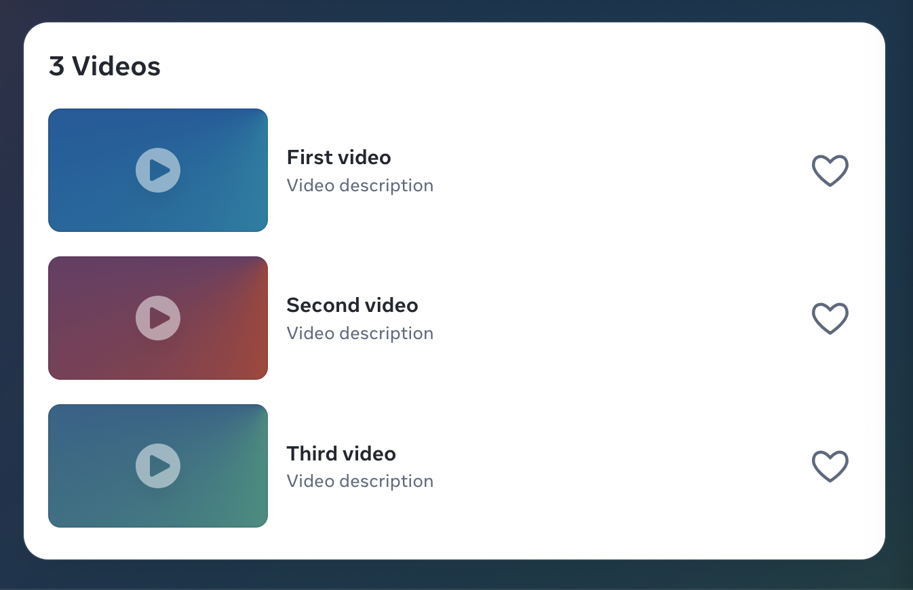
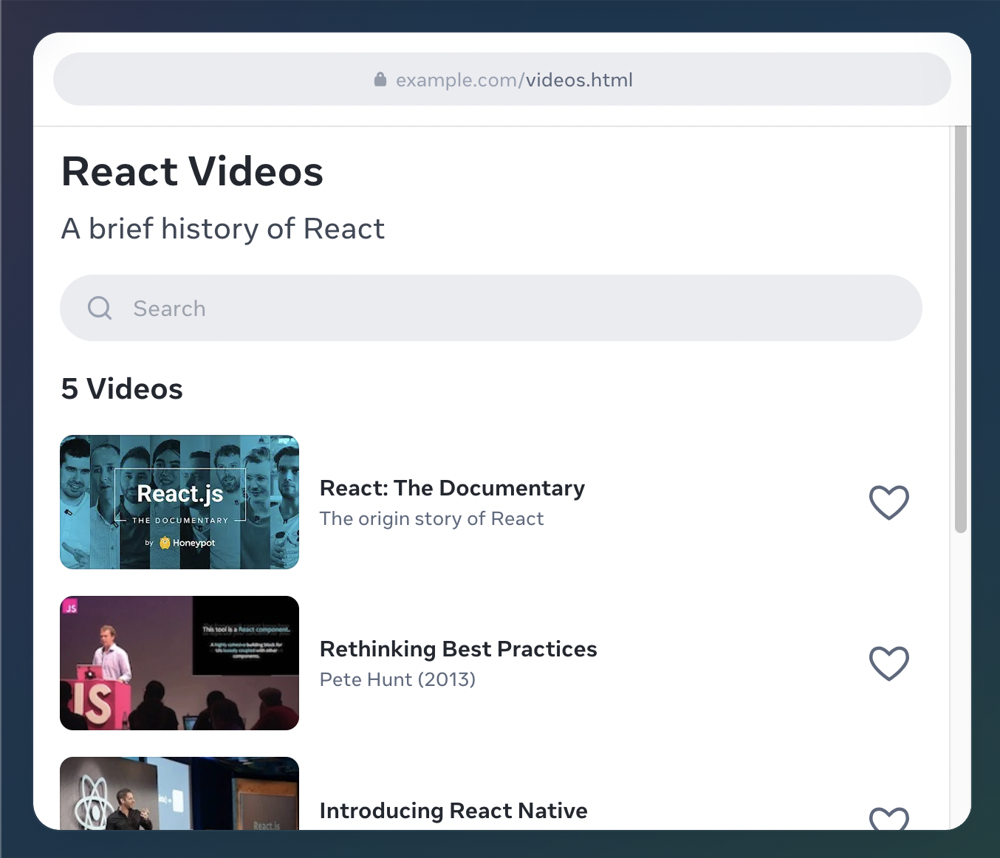
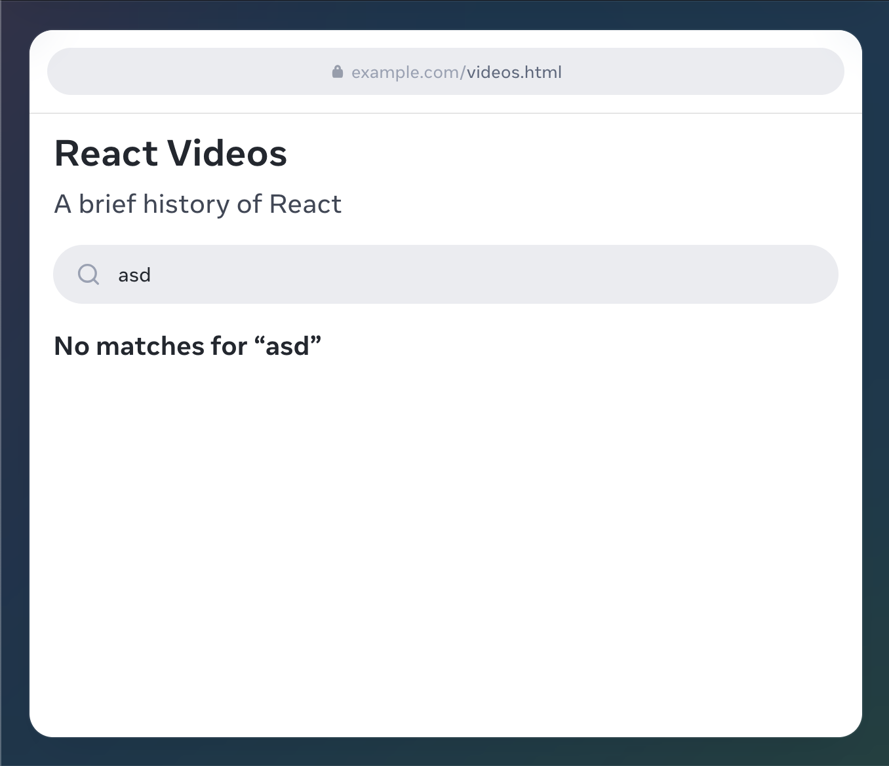
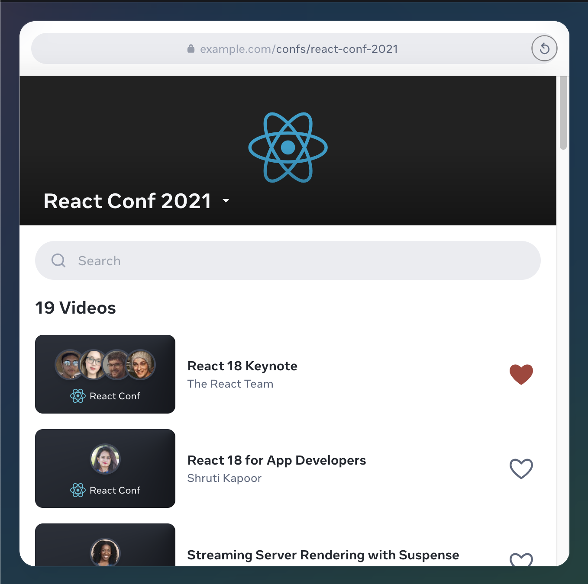
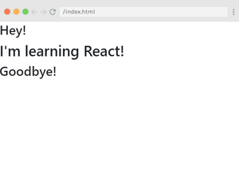

# [Introduction to React](https://www.theodinproject.com/lessons/node-path-react-new-introduction-to-react)

## Introduction

This lesson will provide you with information on what React is, its brief history, and why we're choosing to cover it in our curriculum.

<br>

## Lesson overview

This section contains a general overview of topics that you will learn in this lesson.

- Understand what React is.

<br>

## What is React?

According to the [React](https://react.dev/) website, React is "The library for web and native user interfaces." However, let's break this down a bit further.

Generally speaking, a JavaScript library is a collection of pre-written code that's designed to make development easier. This code can be reused/reimplemented in our own codebases to achieve complex tasks.

A library should not be confused with a framework, even though the terms are often used interchangeably. You'll read about differences between libraries and frameworks later on in the lesson.

React provides powerful primitives (built-in functions/modules) that allow us to build user interfaces of varying complexities. Throughout this course, we'll learn all about the functionality React provides and learn to build cool applications.

<br>

## Why cover React?

React is one of the most powerful, widely used JavaScript libraries.

The landscape for frontend frameworks has been changing a lot over the last few years, so it's understandable to be worried about choosing the "wrong" one. This [article on the lifecycle of JavaScript frameworks](https://iamtapan.medium.com/this-is-how-long-the-life-cycle-of-a-javascript-framework-lasts-d21b29320512) shows the recent development of frontend frameworks well.

Once you start diving deeper into a framework, you'll begin to love it. It makes your code easily scalable, more readable, and possibly a thousand times more efficient (in our modest estimation).

To name a few reasons to learn React:

- Components are reusable.

- It's well-supported due to its popularity and large community.

- It's not opinionated, which means it won't force you to follow any specific design patterns, project organizational structure, or logic. It's all up to you.

- There's a smaller learning curve, especially if you already have a good grasp of JavaScript, HTML, and CSS from our previous lessons.

<br>

## Knowledge check

- ##### What is the purpose of React?

React is a component-based JavaScript library which makes writing code more efficient and manageable. It supports lazy loading and code-splitting that allows faster performance and rendering.

<br>

- ##### What are the benefits of using React?

React is a well-supported library due to its popularity and large community. It's unopinionated, which means it won't force you to follow any specific design patterns. There's also a smaller learning curve if you already have a good grasp of JavaScript.

<hr>
<br>
<br>

# [React Website](https://react.dev/)

The library for web and native user interfaces

## Create user interfaces from components

React lets you build user interfaces out of individual pieces called components. Create your own React components like `Thumbnail`, `LikeButton`, and `Video`. Then combine them into entire screens, pages, and apps.

```jsx
function Video({ video }) {
	return (
		<div>
			<Thumbnail video={video} />
			<a href={video.url}>
				<h3>{video.title}</h3>
				<p>{video.description}</p>
			</a>
			<LikeButton video={video} />
		</div>
	)
}
```


Whether you work on your own or with thousands of other developers, using React feels the same. It is designed to let you seamlessly combine components written by independent people, teams, and organizations.

<br>

## Write components with code and markup

React components are JavaScript functions. Want to show some content conditionally? Use an `if` statement. Displaying a list? Try array `map()`. Learning React is learning programming

```js
function VideoList({ videos, emptyHeading }) {
	const count = videos.length
	let heading = emptyHeading
	if (count > 0) {
		const noun = count > 1 ? "Videos" : "Video"
		heading = count + " " + noun
	}
	return (
		<section>
			<h2>{heading}</h2>
			{videos.map((video) => (
				<Video key={video.id} video={video} />
			))}
		</section>
	)
}
```



This markup syntax is called JSX. It is a JavaScript syntax extension popularized by React. Putting JSX markup close to related rendering logic makes React components easy to create, maintain, and delete.

<br>

## Add interactivity wherever you need it

React components receive data and return what should appear on the screen. You can pass them new data in response to an interaction, like when the user types into an input. React will then update the screen to match the new data.

```js
import { useState } from "react"

function SearchableVideoList({ videos }) {
	const [searchText, setSearchText] = useState("")
	const foundVideos = filterVideos(videos, searchText)

	return (
		<>
			<SearchInput
				value={searchText}
				onChange={(newText) => setSearchText(newText)}
			/>
			<VideoList
				videos={foundVideos}
				emptyHeading={`No matches for "${searchText}"`}
			/>
		</>
	)
}
```




You don't have to build your whole page in React. Add React to your existing HTML page, and render interactive React components anywhere on it.

<br>

## Go full-stack with a framework

React is a library. It lets you put components together, but it doesn't prescribe how to do routing and data fetching. To build an entire app with React, we recommend a full-stack React framework like [Next.js](https://nextjs.org/) or [Remix](https://remix.run/).

```js
import { db } from "./database.js"
import { Suspense } from "react"

async function ConferencePage({ slug }) {
	const conf = await db.Confs.find({ slug })
	return (
		<ConferenceLayout conf={conf}>
			<Suspense fallback={<TalksLoading />}>
				<Talks confId={conf.id} />
			</Suspense>
		</ConferenceLayout>
	)
}

async function Talks({ confId }) {
	const talks = await db.Talks.findAll({ confId })
	const videos = talks.map((talk) => talk.video)
	return <SearchableVideoList videos={videos} />
}
```



React is also an architecture. Frameworks that implement it let you fetch data in asynchronous components that run on the server or even during the build. Read data from a file or a database, and pass it down to your interactive components.

<br>

## Use the best from every platform

People love web and native apps for different reasons. React lets you build both web apps and native apps using the same skills. It leans upon each platform's unique strengths to let your interfaces feel just right on every platform.

### Stay true to the web

People expect web app pages to load fast. On the server, React lets you start streaming HTML while you're still fetching data, progressively filling in the remaining content before any JavaScript code loads. On the client, React can use standard web APIs to keep your UI responsive even in the middle of rendering.

### Go truly native

People expect native apps to look and feel like their platform. React Native and Expo let you build apps in React for Android, iOS, and more. They look and feel native because their UIs _are_ truly native. It's not a web view -- your React components render real Android and iOS views provided by the platform.

With React, you can be a web _and_ a native developer. Your team can ship to many platforms without sacrificing the user experience. Your organization can bridge the platform silos, and form teams that own entire features end-to-end.

<br>

## Upgrade when the future is ready

React approaches changes with care. Every React commit is tested on business-critical surfaces with over a billion users. Over 100,000 React components at Meta help validate energy migration strategy.

The React team is always researching how to improve React. Some research takes years to pay off. React has a high bar for taking a research idea into production. Only proven approaches become a part of React.

<hr>
<br>
<br>

# [The History of React.js on a Timeline](https://blog.risingstack.com/the-history-of-react-js-on-a-timeline/)

The appearance of React.js dramatically widened the opportunities for front-end developers in creating user-friendly interfaces.

To show its unique features, we've been publishing a lot about React.js. Moreover, ur excellent front-end expert, Miklos Bertalan has started a series of live streams where he shows how to build React apps on a free, locally hosted server - created by another brilliant engineer at Risingstack, Robert Czinege.

To have a better understanding of React, let's have a sneak peek at how everything started. I have collected the most significant milestones in the history of React, which you'll be able to see in this timeline below.

<br>

## The need for a better code

Back in 2011, the developers at Facebook started to face some issues with code maintenance. Aas the Facebook Ads app got an increasing number of features, the team needed more people to keep it running flawlessly. The growing number of team-members and app-features slowed them down as a company. Over time, their app became difficult to handle, as they faced a lot of cascading updates.

After a while, engineers at Facebook couldn't keep up with these cascading updates. Their code demanded an urgent upgrade to become more efficient.

They had the model right, but they needed to do something about user experience. So, Jordan Walke built a prototype that made the process more efficient, and this marks the birth of React.js
([source](https://www.youtube.com/watch?v=KVZ-P-ZI6W4&t=0s&list=PLb0IAmt7-GS1cbw4qonlQztYV1TAW0sCr&index=1))

<br>

## Let's look at the history of React.js on a timeline

From 2010 until now (March 2018):

### 2010 - The first signs of React

- Facebook introduced xhp into its php stack and open sourced it. Xhp allowed creating composite components. They introduced this syntax later in React

### 2011 - An early prototype of React

- Jordan Walke created FaxJS, the early prototype of React - shipped a search element on Facebook

### 2012 - Something new had started at Facebook

- Facebook Ads became hard to manage, so Facebook needed to come up with a good solution for it. Jordan Walke worked on the prototype and created React.

- April 9: Instagram was acquired by Facebook. Instagram wanted to adopt Facebook's new technology. By this, Facebook had a pressure to decouple React from Facebook and make it open-sourceable. Most of this was done by Pete Hunt.

- Sept 8-12: TechCrunch Disrupt San Francisco, Mark Zuckerberg: "Our Biggest Mistake Was Betting Too Much On HTML5." He promised that Facebook would deliver better mobile experiences very soon.

### 2013 - The year of the Big Launch

- May 29-31: JS ConfUS. Jordan Walke introduced React. **React gets open sourced.** _Fun fact: The audience was skeptical. Most people thought React was a huge step backward. This happened as most 'early adopters' attended this conference, however, React targeted 'innovators.' The creators of React realized this mistake on time, and decided to start a 'React tour' later on to turn haters into advocates._

- June 2: React (by Facebook) is available on JSFiddle

- July 30: React and JSX is available in Ruby on Rails

- August 19: React and JSX available in Python Applications

- Sept 14-15: JSConfEU 2013. Pete Hunt's speech of rethinking best practices.

- Dec 17: David Nolen Introduces OM, based on React. Explains how React is awesome - which reached early adopters. This article showed how React is better than the other alternatives out there, which boosted the acknowledgement of React.

### 2014 - The year of Expansion

React had gradually gained its reputation and started to go through to 'early majority' of its potential users. At this point, they needed a new message instead of solely relying on its technical benefits, and it is: how is React stable? By focusing on this, they aimed to appeal to enterprises, like Netflix

- Early 2014: #reactjsworldtour conferences started, to build community and to 'turn haters into advocates.'

- Jan 2: React Developer Tools becomes an extension of the Chrome Developer Tools

- February: Atom was introduced - A hackable text editor for the 21st century

- April 7-9: React London 2014

- June: ReactiveX.io emerged

- July 13: The release of React Hot Loader. React Hot Loader is a plugin that allows React components to be live reloaded without the loss of state.

- Dec 12: PlanOut: A language for online experiments. The release of PlanOut 0.5, which includes a React-based PlanOut language editor, and brings the interpreter into feature-parity with the latest version of PlanOut used internally at Facebook

### 2015 - React is stable

- Early 2015: Flipboard releases React Canvas

- January: Netflix likes React

- Early 2015: Airbnb uses React

- January 28-29: React.js Conf 2015 - Facebook released the first version of React Native for the React.js Conf 2015 during a technical talk

- February: Introducing Relay and GraphQL at React.js Conf.

- March 25: Facebook announced that React Native for iOS is open and available on GitHub

- June 2: Redux was released by Dan Abramov and Andrew Clark

- Sept 2: The first stable version of the new React Developer Tools launched

- Sept 14: React Native for Android was released

### 2016 - React gets mainstream

- March: The introduction of Mobx

- February 22-23: React.js Conf 2016, San Francisco

- Draft.js was introduced at React.js Conf by Isaac Salier-Hellendag

- March: The introduction of React Storybook

- June 2-3: ReactEurope 2016

- July 11: Introducing React's Error Code System

- November: the introduction of Blueprint - A React UI toolkit for the web

### 2017 - The year of further improvements

- Early 2017: Airbnb introduces their new open source library React Sketch.app

- April 19: React Fiber gets open sourced at F8 2017

- Sept: Relicensing React, Jest, Flow, and Immutable.js

- Sept 26: React 16: error boundaries, portals, fragments and the Fiber architecture

- October: Netflix removes client-side React.js

- November 28: React v16.2.0: Improved Support for Fragments

### 2018 - What's up with React now?

- March 1-2: JSConf Iceland - Beyond React 16 by Dan Abramov

- March 29: React 16.3.0 was released.

<hr>
<br>
<br>

# [The Difference Between a Framework and a Library](https://www.freecodecamp.org/news/the-difference-between-a-framework-and-a-library-bd133054023f/)

Developers often use the terms "library" and "framework" interchangeably. But there is a difference.

Both frameworks and libraries are code written by someone else that is used to help solve common problems.

For example, let's say you have a program where you plan on working with strings. You decide to keep your code DRY (don't repeat yourself) and write some reusable functions like these:

```js
function getWords(str) {
	const words = str.split(" ")
	return words
}
function createSentence(words) {
	const sentence = words.join(" ")
	return sentence
}
```

Congratulations. You've created a library.

There isn't anything magic about frameworks or library. Both libraries and frameworks are reusable code written by someone else. Their purpose is to help you solve common problems in easier ways.

I often use a house as a metaphor for web development concepts.

A library is like going to Ikea. You already have a home, but you need a bit of help with furniture. You don't feel like making your own table from scratch. Ikea allows you to pick and choose different things to go in your home. You are in control.

A framework, on the other hand, is like building a model home. You have a set of blueprints and a few _limited_ choices when it comes to architecture and design. Ultimately, the contractor and blueprint are in control. And they will let you know when and where you can provide your input.

<br>

## The Technical Difference

The technical difference between a framework and library lies in a term called inversion of control.

When you use a library, you are in charge of the flow of the application. You are choosing when and where to call the library. When you use a framework, the framework is in charge of the flow. It provides some places for you to plug in your code, but it calls the code you plugged in as needed.

Let's look at an example using jQuery (a library) and Vue.js (a framework).

Imagine we want to display an error message when an error is present. In our example, we will click a button, and pretend an error occurs.

<br>

### With jQuery

```html
<html>
	<head>
		<script src="https://code.jquery.com/jquery-3.3.1.min.js"></script>
		<script src="./app.js"></script>
	</head>
	<body>
		<div id="app">
			<button id="myButton">Submit</button>
		</div>
	</body>
</html>
```

```js
// A bunch of our own code,
// followed by calling the jQuery library

let error = false
const errorMessage = "An Error Occurred"
$("#myButton").on("click", () => {
	error = true // pretend some error occurs and set error = true

	if (error) {
		$("#app").append(`<p id="error">${errorMessage}</p>`)
	} else {
		$("#error").remove()
	}
})
```

Notice how we use jQuery. _We_ tell our program where we want to call it. This is much like going to a physical library and pulling certain books off the shelf as we want them.

That's not to say jQuery functions don't require certain inputs _once_ we call them, but jQuery itself is a library of those functions. We are in charge.

<br>

### With Vue.js

```html
<html>
	<head>
		<script src="https://cdn.jsdelivr.net/npm/vue"></script>
		<script src="./app.js"></script>
	</head>
	<body>
		<div id="app"></div>
	</body>
</html>
```

```jsx
const vm = new Vue({
	template: `<div id="vue-example">
              <button @click="checkForErrors">Submit</button>
              <p v-if="error">{{ errorMessage }}</p>
            </div>`,
	el: "#vue-example",
	data: {
		error: null,
		errorMessage: "An Error Occurred",
	},
	methods: {
		checkForErrors() {
			this.error = !this.error
		},
	},
})
```

With Vue, we have to fill in the blanks. The Vue constructor is an object with certain properties. It tells us what it needs, and then behind the scenes, Vue decides when it needs it. Vue inverts the control of the program. We plug our code into Vue. Vue is in charge.

**The difference whether it is a library or framework is whether or not there is an inversion of control.**

<br>

## A note on being "opinionated"

You'll often hear frameworks and libraries described as "opinionated" or "un-opinionated." These terms are subjective. They attempt to define the level of freedom a developer has when structuring their code.

Frameworks are more opinionated than not since - by definition - the inversion of control requires a concession of application-design freedom.

Again, the degree to which something is opinionated is subjective. For example, I personally would consider Angular a highly opinionated framework, and Vue.js a less-opinionated framework.

<br>

## In summary

- Frameworks and libraries are both code written by someone else that helps you perform some common tasks in a less verbose way.

- A framework inverts the control of the program. It tells the developer what they need. A library doesn't. The programmer calls the library where and when _they_ need it.

- The degree of freedom a library or framework gives the developer will dictate how "opinionated" it is.

<hr>
<br>
<br>

# [What are the advantages of React.js?](https://www.geeksforgeeks.org/what-are-the-advantages-of-react-js/)

React.js is a popular JavaScript library used for building dynamic and interactive user interfaces. It has become a go-to tool for developers due to its efficient architecture, high performance, and ease of use.

This article highlights the key advantages of using React.js for web development and explores how its features contribute to making the development process easier and more efficient.

<br>

## Advantages of Using React.js

React.js is a powerful JavaScript library for building dynamic and high-performance user interfaces. It offers numerous benefits for modern web development.

### 1. Reusable components

React promotes a component-based architecture, where developers can break down the UI into small, self-contained units of code, known as components. These components are reusable, making the development process more efficient and the codebase cleaner.

- **Improved maintainability:** Isolated components make updates or bug fixes easier.

- **Faster development:** Reusable components save time and effort on repeated elements.

```js
import React, { Component } from "react"

function Head() {
	return <h2>Hey!</h2>
}

function Main() {
	return <h1>I'm learning React!</h1>
}

function Footer() {
	return <h2>Goodbye!</h2>
}

ReactDOM.render(
	<div>
		<Head />
		<Main />
		<Footer />
	</div>,
	document.getElementById("root")
)
```

#### Output:



<br>

### 2. Efficient Rendering with Virtual DOM

React uses a Virtual DOM to improve the performance of web applications. Instead of updating the real DOM directly, React first updates the Virtual DOM and compares it to the previous one, applying only the minimal changes required.

- **Fast updates:** Updates only the changed parts of the UI.

- **Improved performance:** Reduces the number of expensive DOM manipulations.

```js
const MyComp = () => {
	const [count, setCount] = useState(0)
	return (
		<div>
			<p>Count: {count}</p>
			<button onClick={() => setCount(count + 1)}>Increment</button>
		</div>
	)
}
```

<br>

### 3. SEO-Friendly

React offers features that help make applications SEO-friendly, including Server-Side Rendering (SSR) and Static Site Generation (SSG). These methods allow React to generate content that search engines can easily crawl and index.

- **Better search rankings:** Ensures content is indexed by search engines.

- **Faster page loads:** Improves user experience and SEO by reducing load times.

When building modern web applications, Search Engine Optimization (SEO) plays a critical role in ensuring your site ranks well on search engines like Google. But one common challenge when using JavaScript libraries like React is that search engines often struggle to properly crawl and index content that's generated on the client-side.

<br>

### 4. Fast Rendering

React ensures fast rendering by utilizing the Virtual DOM and the Reconciliation Algorithm. These mechanisms minimize unnecessary re-renders, improving the responsiveness of the application.

- **Reconciliation Algorithm:** The Reconciliation Algorithm is responsible for comparing the previous Virtual DOM with the new one to determine what changed. React uses an optimized diffing algorithm to minimize the number of changes it needs to apply to the real DOM.

- **Batching updates:** React batches multiple state updates together in one go to reduce the number of re-renders.

- **React Fiber:** React Fiber is the reimplementation of the React core algorithm that improves the rendering performance, especially in complex applications.

- **React.memo() for Functional Components:** React provides a higher-order component called React.memo() that can be used to optimize the rendering of functional components.

```js
const MyComp = () => {
	const [count, setCount] = useState(0)
	return (
		<div>
			<p>Count: {count}</p>
			<button onClick={() => setCount(count + 1)}>Increment</button>
		</div>
	)
}
```

<br>

### 5. Cross-Platform Mobile Development with React Native

React Native allows developers to use React to build native mobile apps for iOS and Android with a single codebase. This leads to faster development and code reuse across platforms.

- **Single codebase:** Develop apps for both iOS and Android.

- **Native performance:** Offers near-native app performance.

<br>

### 6. Redux for State Management

Managing application state can become complex, especially in large apps. Redux helps manage state in a predictable way by maintaining the entire state in a single store.

- **Centralized state:** Easier tracking and management of the application's state.

- **Predictable state updates:** Changes can only happen through dispatched actions.

<br>

### 7. JSX - JavaScript Syntax Extension

JSX is a syntax entension for JavaScript, allowing developers to write HTML-like code within JavaScript. This improves the readability and structure of the code, making React development more intuitive.

- **Improved readability:** Combines JavaScript logic and HTML structure.

- **Better code organization:** UI structure is closely tied to components.

```jsx
const greeting = <h1>Hello, World!</h1>
```

<br>

### 8. Flexibility and Performance Optimization

React offers flexibility with its component-based architecture and supports different rendering methods. Its performance is optimized using features like React.memo, code-splitting, and lazy loading.

- **Flexible integration:** Easily integrates with other tools and frameworks.

- **Optimized performance:** Features like code-splitting and lazy loading reduce load times.

<br>

### 9. Strong Community Support

React.js has a large and active community backed by Meta (formerly Facebook), providing an extensive ecosystem of libraries, tools, and resources for developers.

- **Vast resources:** Plenty of documentation, tutorials, and third-party libraries.

- **Active community:** Easy access to solutions and support through forums and GitHub.

<br>

## Conclusion

React.js has become one of the most popular libraries for building dynamic web applications. Its reusable components, efficient Virtual DOM rendering, and SEO-friendly features, combined with strong community support and flexible integration, make React an excellent choice for modern web and mobile app development. With tools like Redux, JSX, and optimized performance features, React ensures that developers can build high-performance, scalable, and maintainable applications efficiently.
