# [Setting Up A React Environment](https://www.theodinproject.com/lessons/node-path-react-new-setting-up-a-react-environment)

## Introduction

You know _what_ React is and you might even have an idea of _where_ to use it. Now, it's time to start figuring out _how_.

This lesson is going to cover starting a new React project on your machine, as well as some useful tools to help you along the way. We'll also explain some of the problems that may arise (and how to avoid them).

<br>

## Lesson overview

This section contains a general overview of topics that you will learn in this lesson.

- How React projects can be created.

- How to use Vite to create new React projects.

- How to format the code in React projects.

- What React Developer Tools are.

<br>

## Many paths

There are multiple ways to start using React in your projects, from attaching a set of `<script>` tags which serve React from a CDN, to robust toolchains and frameworks that are highly configurable and allow for increased scalability and optimization.

Some examples of these toolchains include:

- Vite's React Config

- Gatsby

- NextJS

- Create React App (Deprecated)

Why do we need these toolchains? Can't we just make our own as we see fit?

Yes, but it's _hard_. React is a complex beast and there are many moving parts. Before you can start writing any sort of code that provides functionality, you would need to configure _at least_ the following:

- Package Management (NPM, Yarn)

- Module bundling (Webpack, Parcel)

- Compilation (Babel)

- React itself

All of this, and sometimes _much more_, is required to get a React project and development environment up and running.

> **A note on Create React App**
>
> Create React App, or CRA, was the official way to scaffold new React projects since its introduction in 2016. Unfortunately, owing to many reasons, CRA was deprecated in early 2023. Due to CRA's popularity, you'll see it mentioned in many tutorials and guides. However, it's no longer recommended to use it for new projects.

<br>

## Simplifying the process

Now that you understand what is involved with starting a React project from scratch, you can breathe a sigh of relief to learn that we can get started with a _single terminal command_.

Vite builds frontend tools for developers and it leverages the latest technologies under the hood to provide a great developer experience. Fortunately, it also caters to the React ecosystem. We will use Vite's CLI to quickly create a template React project. It requires minimal configuration and provides extremely useful tools right out of the box, allowing us to get straight to the learning. Let's get started!

<br>

## Creating a React app

Please make sure that you are using the latest _LTS_ version of Node, otherwise errors may occur. Open up the terminal and the folder containing your projects. Then enter the following command (you can replace `my-first-react-app` with any name you want):

```
npm create vite@latest my-first-react-app -- --template react
```

If you see the following output, enter `y` and then press `enter`:

```
Need to install the following packages:
  crate-vite@5.X.X
Ok to proceed? (y)
```

Once the command has executed, it should output the next steps for you to follow:

```
cd my-first-react-app
npm install
npm run dev
```

Provided everything has gone according to plan, head over to `localhost:5173`, where you'll be greeted with the following page:

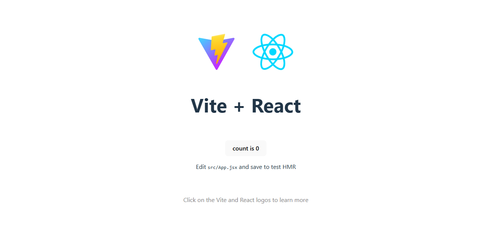

Congratulations! You've created your first React app.

To link your local project directory to a GitHub repo, create a new **empty** repo on GitHub then follow the instructions in the new repo's page to connect it to your local project directory.

> **Using an existing repo**
>
> Alternatively, if you created a GitHub repo already and clone it, you can `cd` into your cloned repo then run the above Vite command, using `.` as the project name:
>
> ```
> npm create vite@latest . -- --template react
> ```
>
> This will tell Vite to use the current directory for the project, instead of creating a new directory with the given project name. This cloned directory will already be initialized as a git repo and reconnected to the right remote.

<br>

## Delving deeper

Let's take a closer look at our new project. Inside, you will find some folders, as well as `package.json`, `package-lock.json`, `.gitignore`, and `README.md` files. The `README.md` contains some useful information that you should take the time to skim through now.

The `public` folder is where all of the static assets related to your app will go. This could include images, icons, and information files for the browser.

Inside the `src` folder is where you will find the code that runs your app. The `main.jsx` file herer serves as the entry point of the application. Let's open the `main.jsx` file and see if we can understand what's going on:

```jsx
import { StrictMode } from "react"
import { createRoot } from "react-dom/client"
import App from "./App.jsx"
import "./index.css"

createRoot(document.getElementById("root")).render(
	<StrictMode>
		<App />
	</StrictMode>
)
```

Woah! There's quite a lot here. You are not expected to recognize much of this (if any) right now. Here's a brief rundown of what is happening:

1. We import `StrictMode` and `createRoot` from the `react` and `react-dom` packages respectively.

2. We import the `App` component from `App.jsx`, so that we may place (render) it within the DOM.

3. We import some CSS styling (you may recognize this syntax from the Webpack material).

4. We create a `root` object by invoking `createRoot` with an element from our `index.html`.

5. We invoke the `render` method, which is attached to our `root` project, with some very interesting-looking syntax inside the parenthese.

All of this may understandably look unlike anything you've seen up until now, but have no fear, once you've spent the time with this course, you'll know exactly what all of this does, and _much more_.

<br>

## Developer tools

As you progress with React, your projects will undoubtedly become larger and larger and include more and more components, with increasing levels of functionality.

When this happens, it's useful to be able to track (and make live changes to) the moving parts inside of your app for understanding and debugging your code. To this end, we can use a Chrome extension called [React Developer Tools](https://chromewebstore.google.com/detail/react-developer-tools/fmkadmapgofadopljbjfkapdkoienihi?hl=en).

We recommend installing this and becoming comfortable using it as early as possible as it's an invaluable tool for effective React development.

<br>

## Knowledge check

- **What are some of the ways we can start a new React project?**

We can attach a set of `<script>` tags which serve React from a CDN. We can make also use of toolchains and frameworks like Vite's React config, Gatsy, and NextJS.

<br>

- **Why should we initially be using pre-made toolchains instead of making our own?**

Because it's hard to make our own toolchain.

<br>

- **What is Vite and why would we use it?**

Vite builds frontend tools for developers and it leverages the latest technologies under the hood to provide a great developer experience. It requires minimal configuration and provides extremely useful tools right out of the box.

<br>

- **What command can we run to scaffold a new React project using Vite?**

```
npm create vite@latest my-first-react-app -- --template react
```

<br>

- **What is the `public` folder?**

The `public` folder is where all of the static assets related to your app will go. This could include images, icons, and information files for the browser.

<br>

- **What is in the `src` folder?**

Inside the `src` folder is where you will find the code that runs your app.

<br>

- **Why are the React Developer Tools useful?**

It allows us to track (and make live changes to) the moving parts inside of our app for understanding and debugging the code.

<hr>
<br>
<br>

# [Getting Started with Vite](https://vite.dev/guide/)

Vite (French word for "quick", pronounced /vit/, likt "veet") is a build tool that aims to provide a faster and leaner development experience for modern web projects. It consists of two major parts:

- A dev server that provides rich feature enhancements over native ES modules, for example extremely fast Hot Module Replacement (HMR).

- A build command that bundles your code with Rollup, pre-configured to output highly optimized static assets for production.

Vite is opinionated and comes with sensible defaults out of the box. Read about what's possible in the [Features Guide](https://vite.dev/guide/features). Support for frameworks or integration with other tools is possible through Plugins. The Config Section explains how to adapt Vite to your project if needed.

Vite is also highly extensible via its Plugin API and JavaScript API with full typing support.

You can learn more about the rationale behind the project in the Why Vite section.

<br>

## Browser Support

During development, Vite sets `esnext` as the transform target, because we assume a modern browser is used and it supports all of the latest JavaScript and CSS features. This prevents syntax lowering, letting Vite serve modules as close as possible to the original source code.

For the production build, by default Vite targets browsers that support modern JavaScript, such as native ES Modules, native ESM dynamic import, `import.meta`, nullish coalescing, and BigInt. Legacy browsers can be supported via the official @vitejs/plugin-legacy. See the Building for Production section for more details.

<br>

## Trying Vite Online

You can try Vite online on StackBlitz. It runs the Vite-based build setup directly in the browser, so it is almost identical to the local setup but doesn't require installing anything on your machine. You can navigate to `vite.new/{template}` to select which framework to use.

The supported template presets are:

| JavaScript | TypeScript |
| ---------- | ---------- |
| vanilla    | vanilla-ts |
| vue        | vue-ts     |
| react      | react-ts   |
| preact     | preact-ts  |
| lit        | lit-ts     |
| svelte     | svelte-ts  |
| solid      | solid-ts   |
| qwik       | qwik-ts    |

<br>

## Scaffolding Your First Vite Project

> **Compatibility Note**
>
> Vite requires Node.js version 18+ or 20+. However, some templates require a higher Node.js version to work, please upgrade if your package manager warns about it.

```
npm create vite@latest
```

Then follow the prompts!

You can also directly specify the project name and the template you want to use via additional command line options. For example, to scaffold a Vite + Vue project, run:

```
npm create vite@latest my-vue-app -- --template vue
```

See create-vite for more details on each supported template.

You can use `.` for the project name to scaffold in the current directory.

<br>

## Community Templates

create-vite is a tool to quickly start a project from a basic template for popular frameworks. Check out Awesome Vite for community maintained templates that include other tools or target different frameworks.

For a template at `https://github.com/user/project`, you can try it out online using `https://github.stackblitz.com/user/project` (adding `.stackblitz` after `github` to the URL of the project).

You can also use a tool like degit to scaffold your project with one of the templates. Assuming the project is on GitHub and uses `main` as the default branch, you can create a local copy using:

```
npx degit user/project#main my-project
cd my-project

npm install
npm run dev
```

<br>

## Manual Installation

In your project, you can install the vite CLI using:

```
npm install -D vite
```

And create an `index.html` file like this:

```html
<p>Hello Vite!</p>
```

Then run the appropriate CLI command in your terminal:

```
npx vite
```

The `index.html` will be served on `http://localhost:5173`.

<br>

## `index.html` and Project Root

One thing you may have noticed is that in a Vite project, `index.html` is front-and-central instead of being tucked away inside `public`. This is intentional: during development Vite is a server, and `index.html` is the entry point to your application.

Vite treats `index.html` as source code and part of the module graph. It resolves `<script type="module" src="...">` that references your JavaScript source code. Even inline `<script type="module">` and CSS referenced via `<link href>` also enjoy Vite-specific features. In addition, URLs inside `index.html` are automatically rebased so there's no need for special `%PUBLIC_URL%` placeholders.

Similar to static http servers, Vite has the concept of a "root directory" which your files are served from. You will see it referenced as `<root>` throughout the rest of the docs. Absolute URLs in your source code will be resolved using the project root as base, so you can write code as if you are working with a normal static file server (except way more powerful!). Vite is also capable of handling dependencies that resolve to out-of-root file system locations, which makes it usable even in a monorepo-based setup.

Vite also supports multi-page apps with multiple `.html` entry points.

<br>

### Specifying Alternative Root

Running `vite` starts the dev server using the current working directory as root. You can specify an alternative root with `vite serve some/sub/dir`. Note that Vite will also resolve its config file (i.e. `vite.config.js`) inside the project root, so you'll need to move it if the root is changed.

<br>

## Command Line Interface

In a project where Vite is installed, you can use the `vite` binary in your npm scripts, or run it directly with `npx vite`. Here are the default npm scripts in a scaffolded Vite project:

```js
{
  "scripts": {
    "dev": "vite", // start dev server, aliases: `vite dev`, `vite serve`
    "build": "vite build", // build for production
    "preview": "vite preview" // locally preview production build
  }
}
```

You can specify additional CLI options like `--port` or `--open`. For a full list of CLI options, run `npx vite --help` in your project.

<br>

## Using Unreleased Commits

If you can't wait for a new release to test the latest features, you can install a specific commit of Vite with https://pkg.pr.new:

```
npm install -D https://pkg.pr.new/vite@SHA
```

Replace `SHA` with any of Vite's commit SHAs. Note that only commits within the last month will work, as older commit releases are purged.

Alternatively, you can also clone the vite repo to your local machine and then build and link it yourself (pnpm is required):

```
git clone https://github.com/vitejs/vite.git
cd vite
pnpm install
cd packages/vite
pnpm run build
pnpm link --global # use your preferred package manager for this step
```

Then go to your Vite based project and run `pnpm link --global vite` (or the package manager that you used to link `vite` globally). Now restart the development server to ride on the bleeding edge!

<br>

## Community

If you have questions or need help, reach out to the community at Discord and GitHub discussions.

<hr>
<br>
<br>

# [Getting Started with React DevTools in Chrome](https://www.debugbear.com/blog/react-devtools)

by Piero Borreli

React Developer Tools is a powerful Chrome extension that helps debug your React app. It analyzes your app's component tree structure along with the state and props of your components and provides a detailed analysis of each component's performance and rendering times.

Developed by Meta, the company behind the React library itself, this extension is a practical addition to your React workflow in a variety of scenarios:

- Debugging your React app and verifying that a component is receiving the ccorrect props and holding the correct state

- Identifying the root cause of performance issues when some components are rendering slowly

- Inspecting the context values passed to each of your components and checking that the global state is being correctly shared between them

If you're curious about how you can start using React DevTools to debug your app and improve its performance, this guide is for you. The article first looks at React DevTools in a little more detail and then demonstrates its utility through an example app.

<br>

## What is React DevTools?

The React Developer Tools browser extension for Chrome contains a powerful suite of debugging tools for React apps. It has been installed over 4 million times and offers the following features to React developers:

- **Verifying a component's props and state:** React components frequently do not render as expected. This is often due to missing props or the component's state not being updated correctly. In this case, React DevTools helps you visualize the props passed to each of your components and lets you verify in real time their state updates in real time as you interact with the components in your app.

- **Addressing performance issues:** Certain React components in your app might be slow and underperforming. This often happens with large lists and dropdowns, where unnecessary re-rendering might occur. React DevTools addresses this issue by providing insights into when your components are rendering and which ones are taking too long to do so.

- **Inspecting context values:** Apart from a component state and prop, React DevTools allows you to view the current context being used in nested components, so you can make sure your global state is correctly shared across them.

<br>

## Getting started with React DevTools

This guide uses a sample React project displaying a to-do list to explore React DevTools' functionalities. You can find the app's public repository [here](https://github.com/pieroborrelliwrites/todo-app).

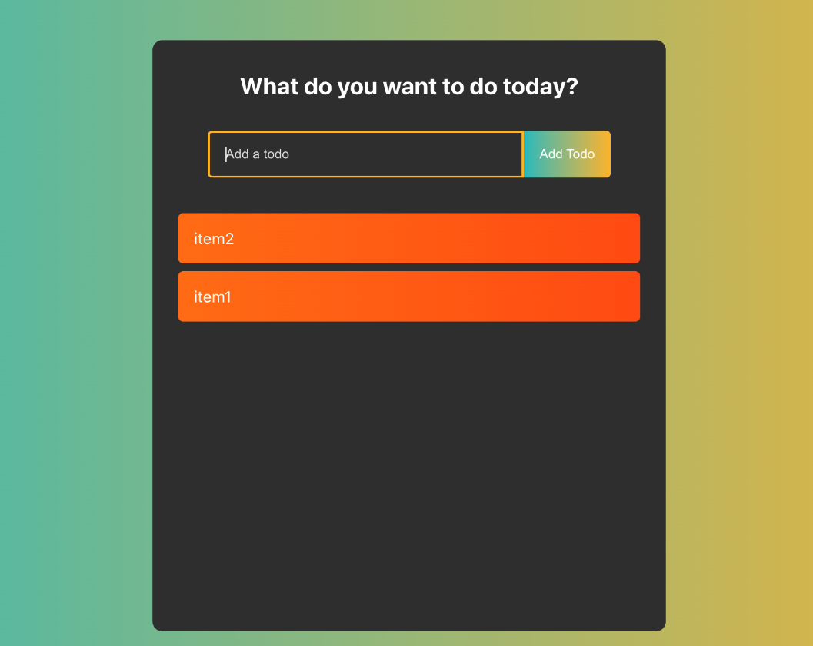

However, before you can start using React Developer Tools, you first need to download and install the browser extension.

> **Info**
>
> This guide focuses on using this extension in Chrome, but you can also download this tool for Firefox.

Once you have installed the extension, its icon appears in the upper-right section of your Chrome browser. This icon will light up and turn blue once you visit an application built using React. Otherwise, the icon will remain gray and a tooltip will say **This page doesn't appear to be using React**:

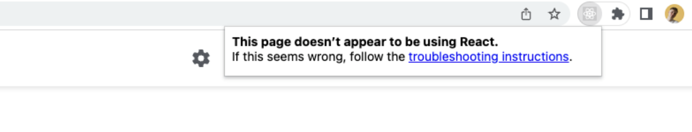

If the icon isn't there, click the puzzle piece icon in the upper-right corner of your browser window, and you should see an option to pin the extension to your toolbar.

Now that you've installed the browser extension, you can learn about its two parts: the Components tab and the Profiler tab.

<br>

## The Components tab

The Components tab provides an overview of all the root components being rendered in your application, plus every subcomponent they render.

To open this tab, click the three dots icon in the upper-right corner of your Chrome browser, then follow the path **More tools > Developer tools**. The Chrome developer tools window will open, and you should see two new React-specific tabs called Components and Profiler:

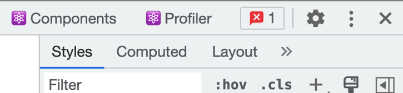

Clicking the **Components** tab when using DevTools on the example app presents the app's hierarchy tree:

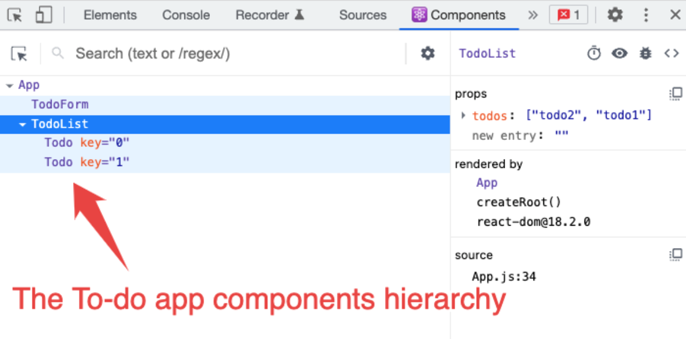

While the Elements tab in Chrome DevTools focuses on the rendered HTML, the Components tab instead displays the React components that are rendered on a page. These components are rendered as a tree representing the hierarchies between them, so you can easily visualize which component are siblings or in a parent-child relationship.

<br>

### Identifying the React Component that's responsible for a UI Element

In addition to that, the Components tab allows you to hover directly over a specific item rendered on the screen and see which component is responsible for rendering it.

If you want to use this functionality, click the cursor icon in the top-left corner of the Component tab. Chrome DevTools also features a cursor icon in the same position, so hover over the icon to make sure you're clicking the correct one. You should see a tooltip saying **Select an element in the page to inspect it**:

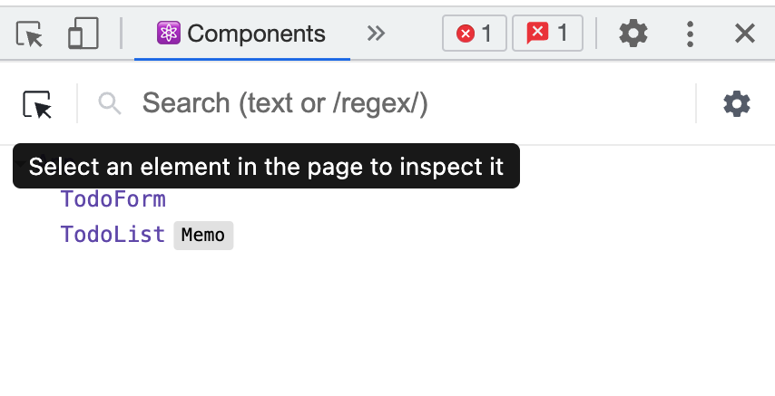

Once you click this icon, hover your desired element on the page. The component responsible for rendering this item will be highlighted in the hierarchy tree:

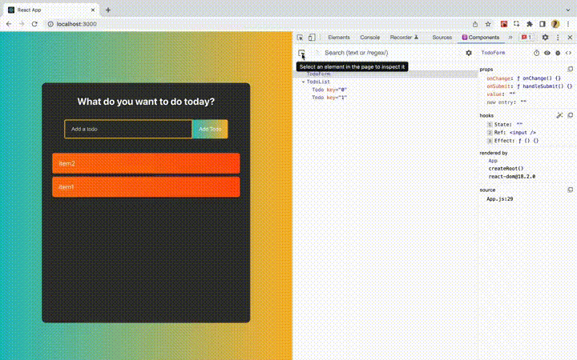

Looking again at the example app's hierarchy tree, you can see that there's a panel on the right:

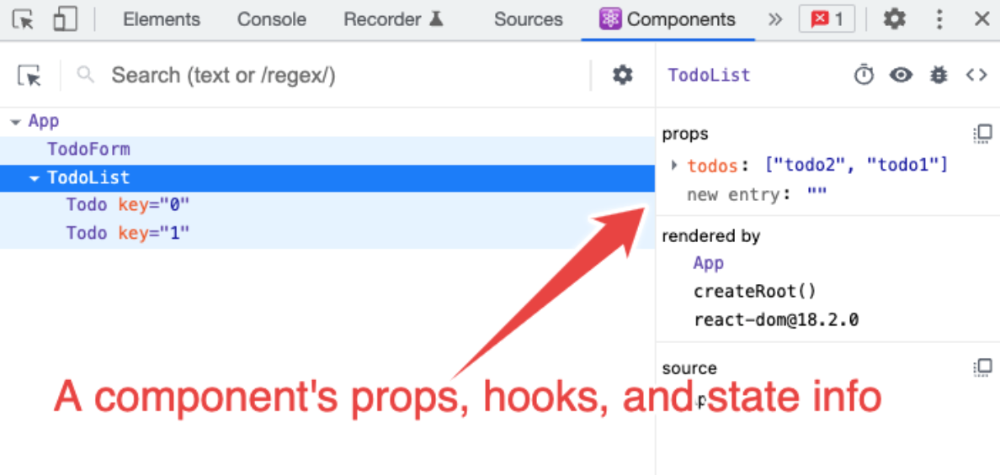

This panel contains additional information about the component you selected. It shows which props are being passed to it, its current state, and any potential hooks being used inside the component.

Visualizing this information about your components allows you to do the following:

- Identify which props a component needs to render, and if that component is not rendering properly, find potentially missing props that might be the source of errors.

- Visualize a specific component's state at every moment to understand how it changes as you interact with the app. This can help you determine why some components are not updating their state correctly, causing logical or rendering errors.

<br>

### Changing the props of a component

The Components tab allows you to modify the props a component is receiving for quick debugging. To do so, you just need to click the prop you want to modify and change it:

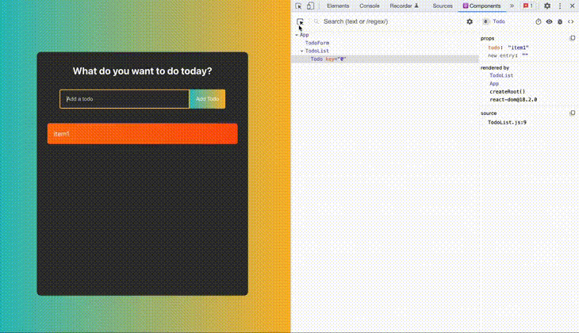

To summarize, the purpose of the Components tab is to give you an actionable overview of your React app. This makes it easy for you to understand the hierarchies of your components as well as the relationship between them and which props, hooks, and state they use. It provides much more information than the standard Chrome developer tools.

<br>

## The Profiler tab

The Profiler tab allows you to record and analyze information about your application's performance.

You can use the example React app to see the Profiler in action. Open DevTools in the app and click the **Profiler** tab, then click the recording button to the far-left of the tab:

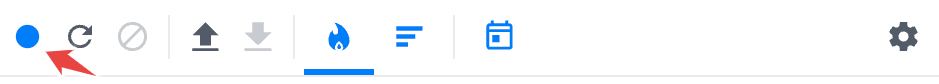

You can now interact with the app as you normally would. In the example to-do app, you can add as many to-do items as you like.

When you're done, click the recording button again to stop profiling.

The obtained data will look something like this:

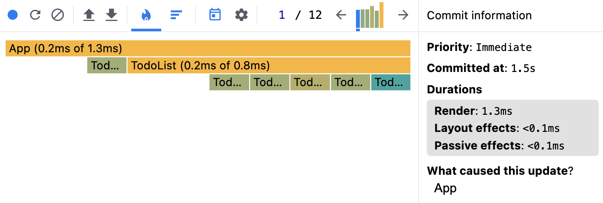

The Profiler registers all the commits happening in your app. A commit happens whenever React applies any changes to the DOM, like when adding a node to the list by creating a new to-do item.

The information about your app commits is then grouped into a chart. The chart used in the image above is called a flame chart. This view shows each one of your app commits as a bar, where the bar's length represents the time it took to render the component. In this profiling example, the `TodoForm` component took less time to render than the `TodoList` one.

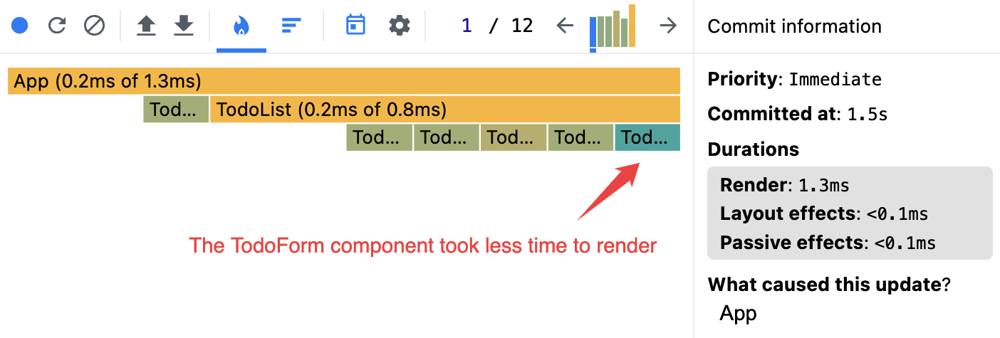

Each bar's color represents a component's rendering time relative to the app's total rendering cycle, using a yellow-blue gradient:

- Yellow represents slow-loading components

- Blue indicates fast-loading components

- Gray represents components that didn't render

The Profiler is useful because it allows you to quickly identify which components are taking longer to render and need to be fixed to enhance performance.

If you want to visualize the component that takes the longest to render, switch from the flame chart to the ranked chart view. All you have to do is click the bars icon inside the Profiler tab:

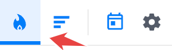

Your view will automatically switch to something similar to the following screenshot:

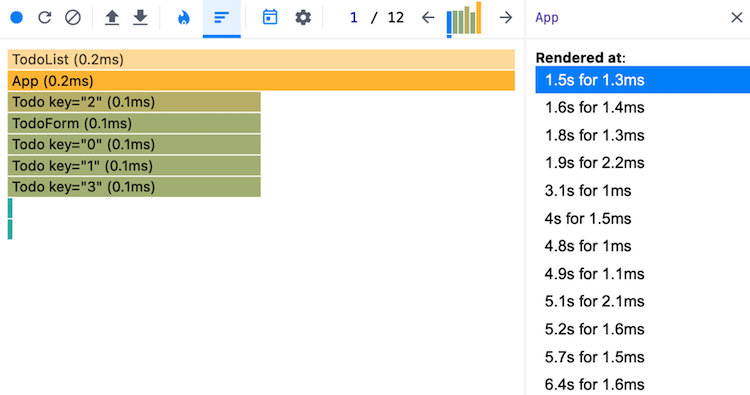

<br>

### Visualizing the cause of a component's render

In addition to visualizing the performance of each component, the Profiler lets you see what caused a component to render. To do this, you need to click the settings icon inside the Profiler tab, go to the **Profiler** section, and tick the option **Record why each component rendered while profiling**:

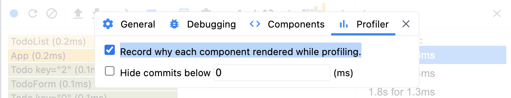

If you profile your React app again, you'll be able to click each commit's bar and see the reason for the component's render on the right.

When a component renders in response to prop changes you can see which props have changed.

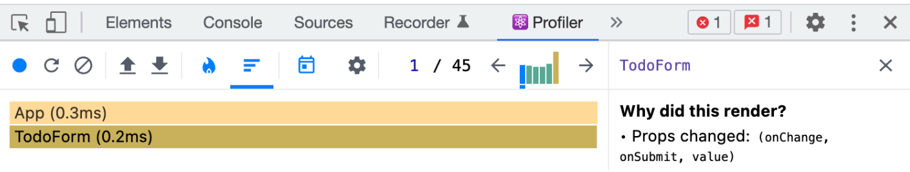

<br>

### Fixing Performance Issues Using the Profiler

To better understand how the Profiler can help you find performance issues in your app, consider the following example. The next image is a ranked chart view of the example app, where you can see that the `TodoList` component is taking longer to render than other components:

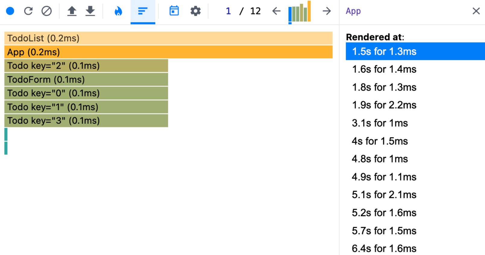

To discover the cause of this, you can open the Profiler tab's settings and enable the option **Highlight updates when components render**.

This option will visually highlight every component's update in your app as you interact with it. Now, if you start entering some to-do items again, you'll notice that the `TodoList` component is updating as you type:

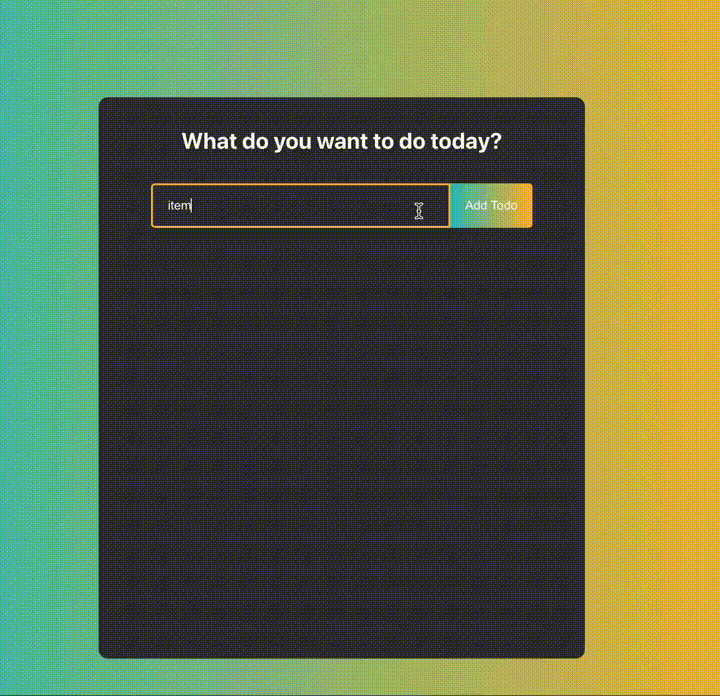

Investigating within the app, you can see that the `TodoList` component updates during typing because its parent component's state is changing:

```js
function App() {
	const [value, setValue] = useState("")
	const [todos, setTodos] = useState([])

	const addTodo = (todo) => {
		if (!todo) {
			return
		}
		const newTodos = [todo, ...todos]

		setTodos(newTodos)
		setValue("")
	}

	const handleSubmit = () => {
		addTodo(value)
	}

	return (
		<div className="todoApp">
			<h1>What do you want to do today?</h1>
			<TodoForm
				onChange={(newValue) => setValue(newValue)}
				onSubmit={handleSubmit}
				value={value}
			></TodoForm>
			<TodoList todos={todos}></TodoList>
		</div>
	)
}
```

This behavior is unnecessary and expensive in terms of performance, as the `TodoList` component should not need to update if the to-do items passed to it haven't changed.

To fix this, you can wrap this component inside a React `memo`, which will prevent the `TodoList` from re-rendering if its props have not changed:

```js
function TodoList(props) {
	return (
		<>
			{props.todos.map((todo, i) => (
				<Todo todo={todo} key={i} />
			))}
		</>
	)
}

export default React.memo(TodoList)
```

If you start typing new items in the to-do app again, the `TodoList` will only re-render if you actually create a new to-do item:

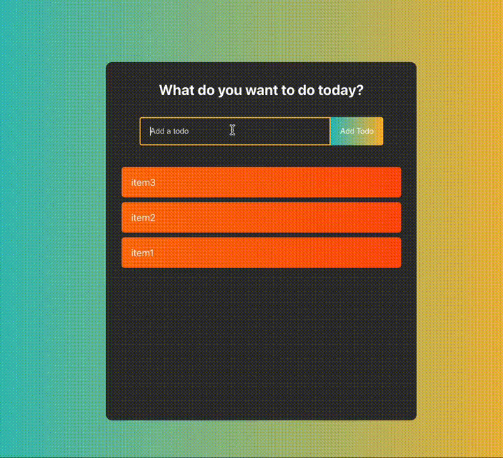

<hr>
<br>
<br>
