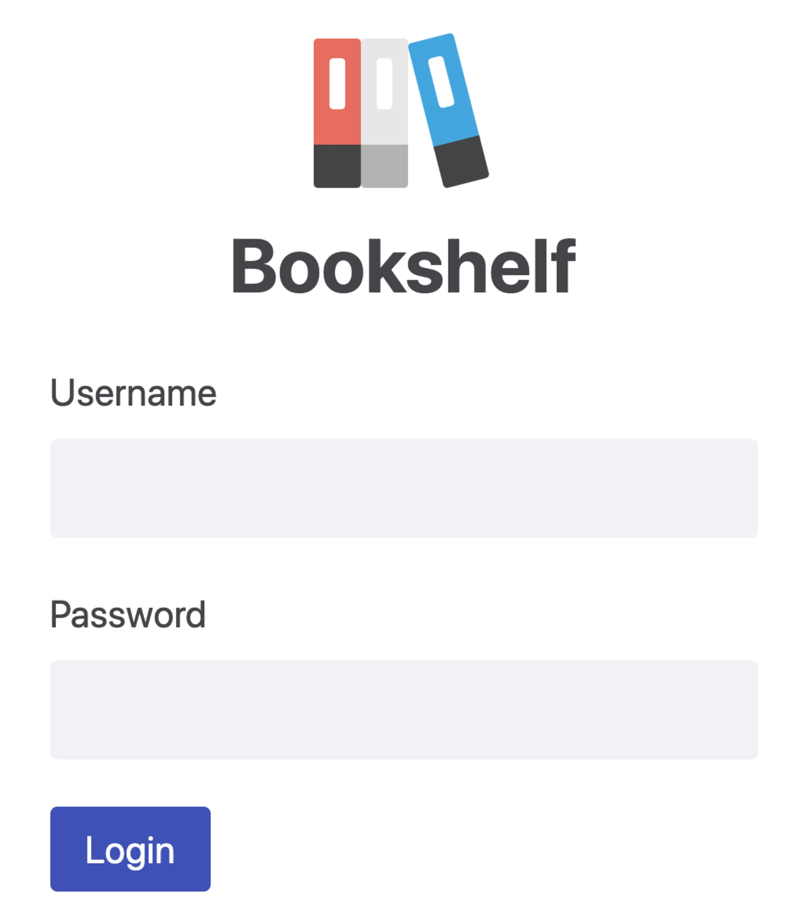
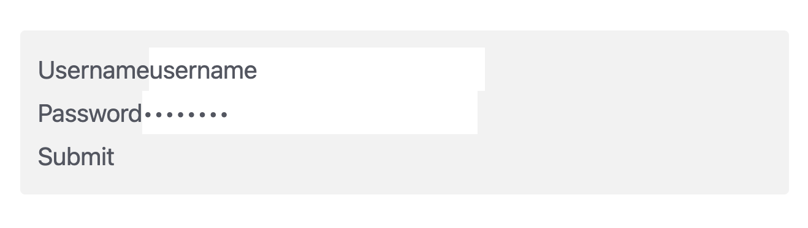
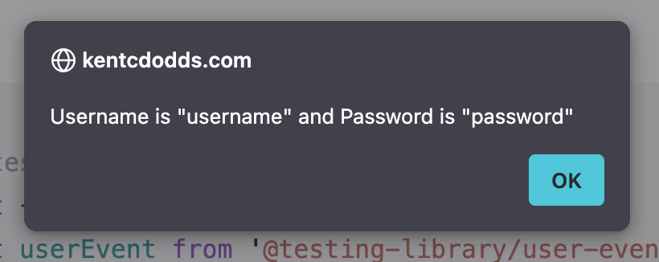
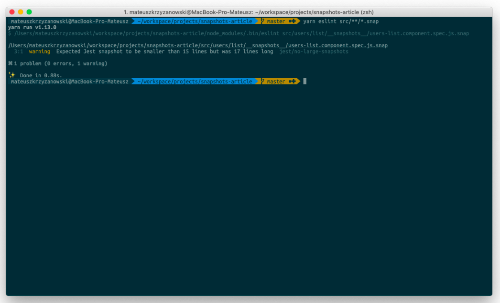
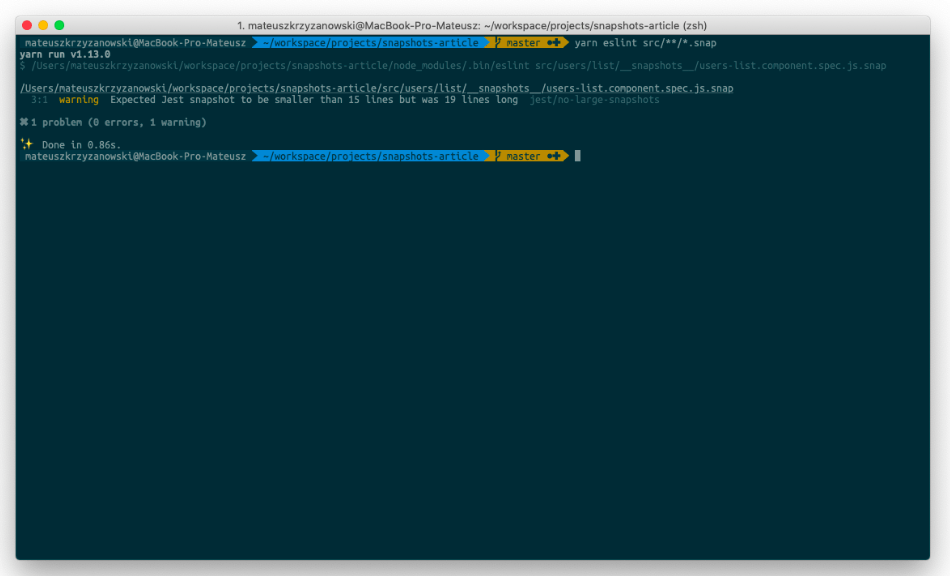
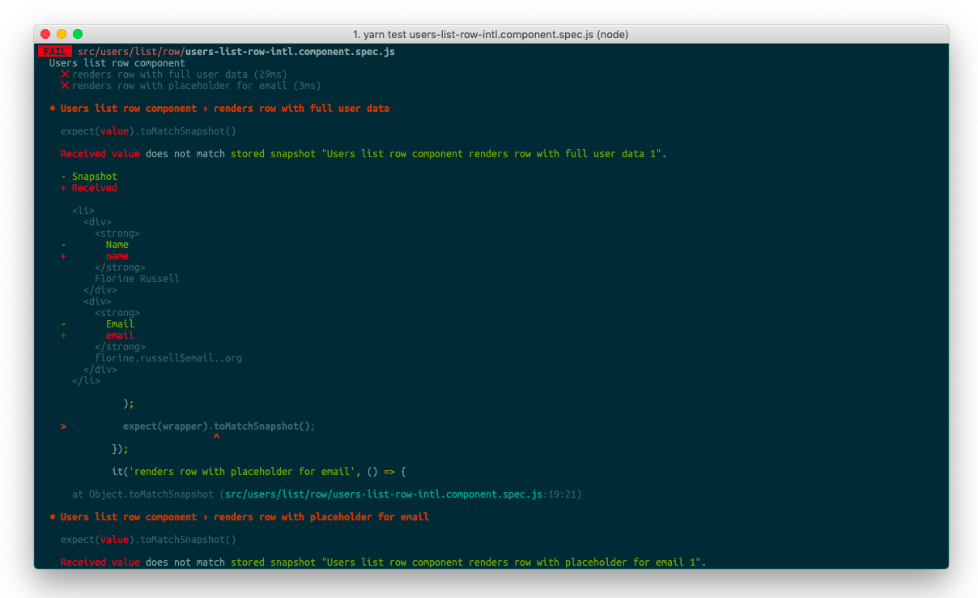
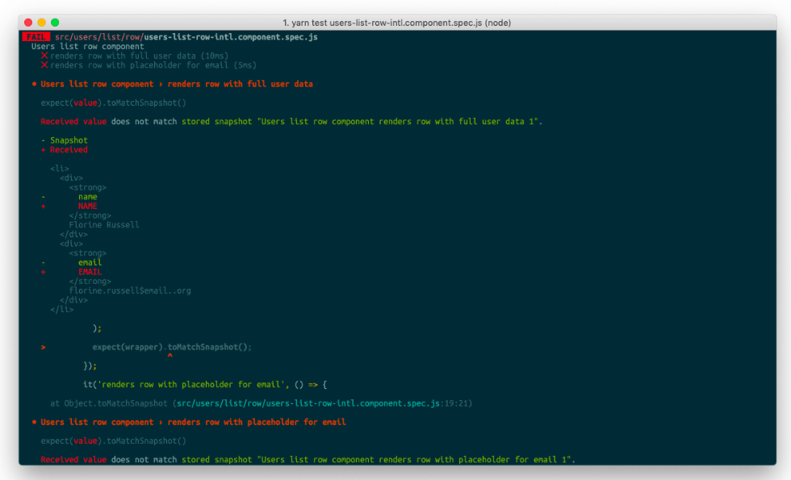
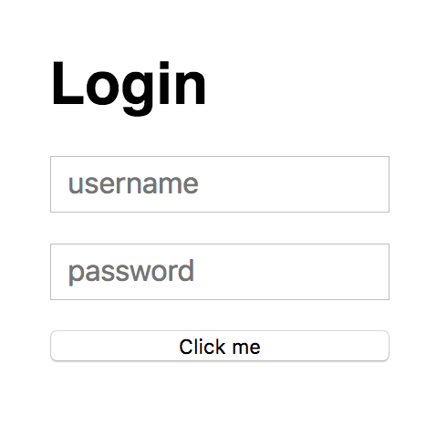
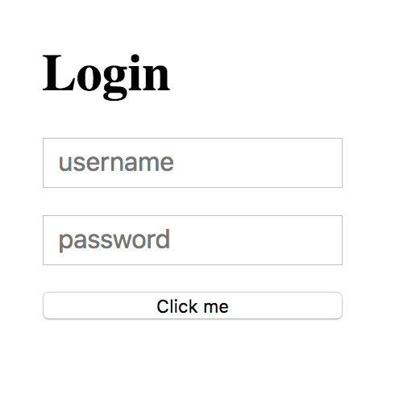

# [Introduction to React Testing](https://www.theodinproject.com/lessons/node-path-react-new-introduction-to-react-testing)

## Introduction

We've learned how to test our vanilla JavaScript applications in a previous section. Testing is a powerful tool that allows us to write maintainable and flexible code. If you've followed along with our lessons, so far we've been using the Jest framework. However, since we've using Vite we'll switch over to Vitest as our test runner since it integrates nicely with Vite. We'll add more capabilities to our tests using the React Testing Library (RTL).

<br>

## Lesson overview

This section contains a general overview of topics that you will learn in this lesson.

- How to set up a React testing environment.

- How to test UI elements.

- Understanding snapshot tests.

<br>

## Setting up a React testing environment

Follow along [Robin Wieruch's guide on setting up Vitest with RTL.](https://www.theodinproject.com/lessons/node-path-react-new-introduction-to-react-testing) Once you've completed the setup, let's meet back here.

Phew, that was a lot of setup. But there's one more tiny package to install before we can begin:

```js
npm install @testing-library/user-event --save-dev
```

Now that we have everything we need, let's briefly go over what some of those packages do. We'll primarily focus on the `@testing-library` packages.

- `@testing-library/react` will give us access to useful functions like `render` which we'll demonstrate later on.

- `@testing-library/jest-dom` includes some handy custom matchers (assertive functions) like `toBeInTheDocument` and more. (complete list on jest-dom's github). Jest already has a lot of matchers so this package is not compulsory to use.

- `@testing-library/user-event` provides the `userEvent` API that simulates user interactions with the webpage.

<br>

## Our first query

First, we'll render the component using `render`. The API will return an object and we'll use destructuring syntax to obtain a subset of the methods required. You can read all about what `render` can do in the React Testing Library API docs about render.

```js
// App.jsx
const App = () => <h1>Our First Test</h1>

export default App
```

```js
import { describe, it, expect } from 'vitest'
import { render, screen } from '@testing-library/react'
import App from './App'

describe('App component', () => {
	it('renders correct heading', () => {
		render(<App />)
		expect(screen.getByRole('heading').textContent).toMatch(/our first test/i)
	})
})
```

> **Vitest globals and ESLint**
>
> Even if you set `globals: true` in `vite.config.js` like in the setup tutorial, ESLint will still yell at you, as it will not recognize these globals without some extra configuration in your `eslint.config.js` file. The most straightforward resolution would be to explicitly import the globals you'd need instead. You can omit `global: true` from `vite.config.js` in this case.

Execute `npm test App.test.jsx` on the terminal and see the test pass. `getByRole` is just one of the dozen query methods that we could've used. Essentially, queries are classified into three types: `getBy`, `queryBy` and `findBy`. Go through the React Testing Library docs page about queries. Pay extra attention to the "Types of Queries" and "Priority" sections.

As stated by the React Testing Library docs, `ByRole` methods are favored methods for querying, especially when paired with the `name` option. For example, we could improve the specificity of the above query like soL `getByRole('heading', { name: 'Our First Test' })`. Queries that are done throgh `ByRole` ensure that our UI is accessible to everyone no matter what mode they use to navigate the webpage (i.e. mouse or assistive technologies).

<br>

## Simulating user events

There are numerous ways a user can interact with a webpage. Even though live user feedback and interaction is irreplaceable, we can still build some confidence in our components through tests. Here's a button which changes the heading of the App:

```js
// App.jsx
import { useState } from 'react'

const App = () => {
	const [heading, setHeading] = useState('Magnificent Monkeys')

	const clickHandler = () => {
		setHeading('Radical Rhinos')
	}

	return (
		<>
			<button type='button' onClick={clickHandler}>
				Click Me
			</button>
			<h1>{heading}</h1>
		</>
	)
}

export default App
```

Let's test if the button works as intended. In this test suite, we'll use a separate utility to query our UI elements. React Testing Library provides the `screen` object which has all the methods for querying. With `screen`, we don't have to worry about keeping `render`'s destructuring up-to-date. Hence, it's better to use `screen` to access queries rather than to destructure `render`.

```js
// App.test.jsx

import { describe, it, expect } from 'vitest'
import { render, screen } from '@testing-library/react'
import userEvent from '@testing=library/user-event'
import App from './App'

describe('App component', () => {
	it('renders magnificent monkeys', () => {
		// since screen does not have the container property, we'll destructure render to obtain a container for this test
		const { container } = render(<App />)
		expect(container).toMatchSnapshot()
	})

	it('renders radical rhinos after button click)', () => {
		const user = userEvent.setup()

    render(<App />)
    const button = screen.getByRole('button', { name: 'Click Me' })

    await user.click(button)

    expect(screen.getByRole('heading').textContent).toMatch(/radical rhinos/i)
	})
})
```

The tests speak for themselves. In the first test, we utilize snapshots to check whether all the nodes render as we expect them to. In the second test, we simulate a click event. Then we check if the heading changed. `toMatch` is one of the various assertions we could have made. Notice that the callback function for the second test is an `async` one, as we need this in order to `await user.click()`.

It's also important to note that after every test, React Testing Library unmounts the rendered components. That's why we render for each test. For a lot of tests for a component, a custom `setup` function could prove handy.

<br>

## What are snapshots?

Snapshot testing is just comparing our rendered component with an associated snapshot file. For example, the snapshot file which was automatically generated after we ran the _"renders magnificent monkeys"_ test was:

```js
// Vitest Snapshot v1, https://vitest.dev/guide/snapshot.html

exports[`App component > renders magnificent monkeys 1`] = `
  <div>
    <button type="button">Click Me</button>
    <h1>Magnificent Monkeys</h1>
  </div>
`
```

It's an HTML representation of the `App` component. And it will be compared against the `App` in future snapshot assertions. If the `App` changes even slightly, the test fails.

Snapshot tests are fast and easy to write. One assertion saves us from writing multiple lines of code. For example, with a `toMatchSnapshot`, we're spared of asserting the existence of the button and the heading. They also don't let unexpected changes creep into our code. Read all about what can be achieved with snapshots in the [Vitest snapshot docs](https://vitest.dev/guide/snapshot.html).

Snapshots might seem the best thing that has happened to us while testing thus far. But we are forced to wonder, _what_ exactly are we testing? What's being validated? If a snapshot passes, what does it convey about the correctness of the component?

Snapshot tests may cause false positives. Since we cannot ascertain the validity of the component from a snapshot test, a bug might go undetected. Over-reliance on snapshots can make developers more confident about their code than they should be.

The other issue with snapshots is false negatives. Even the most insignificant of changes compel the test to fail. Fixing punctuation? Snapshot will fail. Replacing an HTML tag to a more semantic one? Snapshot will fail. This might cause us to lose our confidence in the test suite altogether. Snapshots aren't inherently bad; they do serve a purpose. But it's beneficial to understand when to snapshot, and when not to snapshot.

<hr>

## Knowledge Check

- **What packages are required for React testing?**

The packages required for React testing are: `@testing-library/react`, `@testing-library/jest-dom`, `@testing-library/user-event`

<br>

- **What is the significance of the user-event package?**

The user-event package provides the `userEvent` API that simnulates user interactions with the webpage.

<br>

- **What does the `render` method do?**

The `render` method renders a container which is appended to `document.body`.

<br>

- **What is the most preferred method of querying?**

`ByRole` methods are favored methods for querying, especially when paired with the `name` option. For example, we could improve the specifity of the above query like so: `getByRole("heading", { name: "Our First Test" })`. Queries that are done through `ByRole` ensure that our UI is accessible to everyone no matter what mode they use to navigate the webpage (i.e. mouse or assistive technologies).

<br>

- **How would you test for a click event with `userEvent`?**

You can test a click event with `userEvent` by using the `click` method on the object returned by `userEvent.setup()` and then testing if the change in our screen is what we expected (using `expect` method).

<br>

- **What is the advantage of snapshot tests?**

Snapshot tests are fast and easy to write. One assertion saves us from writing multiple lines of code. They also don't let unexpected changes creep into our code.

<br>

- **What are the disadvantages of snapshot tests?**

Snapshot tests may cause false positives. Since we cannot ascertain the validity of the component from a snapshot test, a bug might go undetected. Over-reliance on snapshots can make developers more confident about their code than they should be.

The other issue with snapshots is false negatives. Even the most insignificant of changes compel the test to fail. Fixing punctuation? Snapshot will fail. Replacing an HTML tag to a more semantic one? Snapshot will fail. This might cause us to lose our confidence in the test suite altogether.

<br>

<hr>
<br>
<br>

# Testing Implementation Details

Back when I was using enzyme (like everyone else at the time), I stepped carefully around certain APIs in enzyme. I completely avoided shallow rendering, _never_ used APIs like `instance()`, `state()`, or `find('ComponentName')`. And in code reviews of other people's pull request I explained again and again why it's important to avoid these APIs. The reason is they each allow your test to test implementation details of your components. People often ask me what I mean by "implmentation details." I mean, it's hard enough to test as it is! Why do we have to make all these rules to make it harder?

<br>

## Why is testing implementation details bad?

There are two distinct and important reasons to avoid testing implementation details. Tests which test implementation details:

1. Can break when you refactor application code. **False negatives**

2. May not fail when you break application code. **False positives**

> To be clear, the test is: "does the software work." If the test passes, then that means the test came back "positive" (found working software). If it does not, that means the test comes back "negative" (did not find working software). The term "false" refers to when the test came back with an incorrect result, meaning the software is actually broken but the test passes (false positive) or the software is actually working but the test fails (false negative).

Let's take a look at each of these in turn, using the following simple accordion component as an example:

```js
// accordion.js
import * as React from 'react'
import AccordionContents from './accordion-contents'

class Accordion extends React.Component {
	state = { openIndex: 0 }
	setOpenIndex = (openIndex) => this.setState({ openIndex })

	render() {
		const { openIndex } = this.state
		return (
			<div>
				{this.props.items.map((item, index) => (
					<>
						<button onClick={() => this.setOpenIndex(index)}>
							{item.title}
						</button>
						{index === openIndex ? (
							<AccordionContents>{item.contents}</AccordionContents>
						) : null}
					</>
				))}
			</div>
		)
	}
}

export defaul Accordion
```

If you're wondering why I'm using a dated class component and not modern function component (with hooks) for these examples, keep reading, it's an interesting reveal (which some of those of you experienced with enzyme you might already be expecting).

And here's a test that tests implementation details:

```js
// __tests__/accordion.enzyme.js
import * as React from 'react'
// if you're wondering why not shallow
// then please read https://kcd.im/shallow
import Enzyme, { mount } from 'enzyme'
import EnzymeAdapter from 'enzyme-adapter-react-16'
import Accordion from '../accordion'

// Setup enzyme's react adapter
Enzyme.configure({ adapter: new EnzymeAdapter() })

test('setOpenIndex sets the open index state properly', () => {
	const wrapper = mount(<Accordion items={[]} />)
	expect(wrapper.state('openIndex')).toBe(0)
	wrapper.instance().setOpenIndex(1)
	expect(wrapper.state('openIndex')).toBe(1)
})

test('Accordion renders AccordionContents with the item contents', () => {
	const hats = { title: 'Favorite Hats', contents: 'Fedoras are classy' }
	const footware = {
		title: 'Favorite Footware',
		contents: 'Flipflops are the best',
	}
	const wrapper = mount(<Accordion items={[hats, footware]} />)
	expect(wrapper.find('AccordionContents').props().children).toBe(hats.content)
})
```

Raise your hand if you've seen (or written) tests like this in your codebase.

Ok, now let's take a look at how things break down with these tests..

<br>

## False negatives when refactoring

A surprising number of people find testing distateful, especially UI testing. Why is this? There are various reasons for it, but one big reason I hear again and again is that people spend way too much time babysitting the tests. "Every time I make a change to the code, the tests break!" This is a real drag on productivity! Let's see how our tests fall prey to this frustrating problem.

Let's say that we're working on adding the ability for multiple accordion elements to be opened at once, so we're changing our internal state from `openIndex` to `openIndexes`:

```js
class Accordion extends React.Component {
	state = { openIndexes: [0] }
	setOpenIndex = (openIndex) => this.setState({ openIndexes: [openIndex] })
	render() {
		const { openIndexes } = this.state

		return (
			<div>
				{this.props.items.map((item, index) => (
					<>
						<button onClick={() => this.setOpenIndex(index)}>
							{item.title}
						</button>
						{openIndexes.includes(index) ? (
							<AccordionContents>{item.contents}</AccordionContents>
						) : null}
					</>
				))}
			</div>
		)
	}
}
```

Awesome, we do a quick check in the app and everything's still working properly, so when we come to this component later to support opening multiple accordions, it'll be a cinch! Then we run tests and kaboom, they're busted. Which one broke? `setOpenIndex sets the open index state properly`.

What's the error message?

```js
expect(received).toBe(expected)

Expected a value to be (using ===):
  0

Received:
  undefined
```

Is that test failure warning us of a real problem? Nope! The component still works fine.

**This is what's called a false negative.** It means that we got a test failure, but it was because of a broken test, not broken app code. I honestly cannot think of a more annoying test failure situation. Oh well, let's go ahead and fix our test:

```js
test('setOpenIndex sets the open index state properly', () => {
	const wrapper = mount(<Accordion items={[]} />)
	expect(wrapper.state('openIndexes')).toEqual([0])
	wrapper.instance().setOpenIndex(1)
	expect(wrapper.state('openIndexes')).toEqual([1])
})
```

The takeaway: **Tests which test implementation details can give you a false negative when you refactor your code. This leads to brittle and frustrating tests that seem to break anytime you so much as look at the code.**

<br>

## False positives

Ok, so now let's say your co-worker is working in the Accordion and they see this code:

```js
<button onClick={() => this.setOpenIndex(index)}>{item.title}</button>
```

Immediately their premature performance optimization feelings kick in and they say to themselves, "hey! inline arrow functions in `render` are bad for performance, so I'll just clean that up! I think this should work, I'll just change it really quick and run tests."

```js
<button onClick={this.setOpenIndex}>{item.title}</button>
```

Cool. Run the tests and awesome! They commit the code without checking it in the browser because tests give confidence right? That commit goes in a completely unrelated PR that changes thousands of lines of code and is understandably missed. The accordion breaks in production and Nancy is unable to get her tickets to see Wicked in Salt Lake next February. Nancy is crying and your team feels horrible.

So what went wrong? Didn't we have a test to verify that the state changes when `setOpenIndex` is called _and_ that the accordion contents are displayed appropriately!? Yes you did! But the problem is that there was no test to verify that the button was wired up to `setOpenIndex` correctly.

**This is called a false positive.** It means that we didn't get a test failure, but we should have! So how do we cover ourselves to make sure this doesn't happen again? We need to add another test to verify clicking the button updates the state correctly. And then I need to add a coverage threshold of 100% code coverage so we don't make this mistake again. Oh, and I should write a dozen or so ESLint plugins to make sure people don't use these APIs that encourage testing implementation details!

... But I'm not going to bother... Ugh, I'm just so tired of all these false positives and negatives, I'd almost rather not write tests ata ll. DELETE ALL THE TESTS! Wouldn't it be nice if we had a tool that had a wider pit of success? Yes it would! And guess what, we DO have such a tool!

<br>

## Implementation detail free testing

So we could rewrite all these tests with enzyme, limiting ourselves to APIs that are free of implementation details, but instead, I'm just going to use React Testing Library which will make it very difficult to include implementation details in my tests Let's check that out now!

```js
// __tests__/accordion.rtl.js
import '@testing-library/jest-dom/extend-expect'
import * as React from 'react'
import { render, screen } from '@testing-library/react'
import userEvent from '@testing-library/user-event'
import Accordion from '../accordion'

test('can open accordion items to see the contents', () => {
	const hats = { title: 'Favorite Hats', contents: 'Fedoras are classy' }
	const footware = {
		title: 'Favorite Footware',
		contents: 'Flipflops are the best',
	}

	render(<Accordion items={[hats, footware]} />)

	expect(screen.getByText(hats.contents)).toBeInTheDocument()
	expect(screen.queryByText(footware.contents)).not.toBeInTheDocument()

	userEvent.click(screen.getByText(footware.title))

	expect(screen.getByText(footware.contents)).toBeInTheDocument()
	expect(screen.queryByText(hats.contents)).not.toBeInTheDocument()
})
```

Sweet! A single test that verifies all the behavior really well. And this test passes whether my state is called `openIndex`, `openIndexes`, or `tacosAreTasty`. Nice! Got rid of that false negative! And if I wire up my click handler incorrectly, this test will fail. Sweet, got rid of that false positive too! And I didn;t have to memorize any list of rules. I just use the tool in the idiomatic usage, and I get a test that actually can give me confidence my accordion is working as the user wants it to.

<br>

## So... what are implementation details then?

Here's the simplest definition I can come up with:

> Implementation details are things which users of your code will not typically use, see, or even know about.

So the first question we need an answer to is: "Who is the user of this code." Well, the end user who will be interacting with our component in the browser is definitely a user. They'll be observing and interacting with our component in the browser with the rendered buttons and contents. But we also have the developer who will be rendering the accordion with props (in our case, a given list of items). So React components typically have two users: end-users, and developers. **End-users and developers are the two "users" that our application code needs to consider.**

Great, so what parts of our code do each of these users use, see, and know about? The end user will see/interact with what we render in the `render` method. The developer will see/interact with the props they pass to the component. So our test should typically only see/interact with the props that are passed, and the rendered output.

This is precisely what the React Testing Library does. We give it our own React element of the Accordion component with our fake props, then we interact with the rendered output by querying the output for the contents that will be displayed to the user (or ensuring that it won't be displayed) and clicking the buttons that are rendered.

Now consider the enzyme test. With enzyme, we access the `state` of `openIndex`. This is not something that either of our users care about directly. They don't know that's what it's called, they don't know whether the open index is stored as a single primitive value, or stored as an array, and frankly they don't care. They also don't know or care about the `setOpenIndex` method specifically. And yet, our test knows about both of these implementation details.

This is what makes our enzyme test prone to false negatives. Because **by making our test use the component differently than end-users and developers do, we create a third user our application code needs to consider: the tests!** And frankly, the tests are one user that nobody cares about. I don't want my application code to consider the tests. What a complete waste of time. I don't want tests that are written for their own sake. _Automated tests should verify that the application code works for the production users._

> _"The more your tests resemble the way your software is used, the more confidence they can give you. - me"_

<br>

## So, what about hooks

Well, as it turns out, enzyme still has a lot of trouble with hooks. Turns out when you're testing implementation details, a change in the implementation has a big impact on your tests. This is a big bummer because if you're migrating class components to function components with hooks, then your tests can't help you know that you didn't break anything in the process.

React Testing Library on the other hand? It works either way. Check the codesandbox link at the end to see it in action. I like to call tests you write with React Testing Library:

> Implementation detail free and refactor friendly.

<br>

# Conclusion

So, how do you avoid testing implementation details? Using the right tools is a good start. Here's a process for how to know what to test. Following this process helps you have the right mindset when testing and you will naturally avoid implementation details:

1. What part of your untested codebase would be really bad if it broke? (The checkout process)

2. Try to narrow it down to a unit or a few units of code (When clicking the "checkout" button a request with the cart items is sent to `/checkout`).

3. Look at that code and consider who the "users" are (The developer rendering the checkout form, the end user clicking on the button).

4. Write down a list of instructions for that user to manually test that code to make sure it's not broken. (render the form with some fate data in the cart, click the checkout button, ensure the mocked `/checkout` API was called with the right data, respond with a fake successful response, make sure the success message is displayed).

5. Turn that list of instructions into an automated test.

<hr>
<br>
<br>

# [React Testing Library](https://testing-library.com/docs/react-testing-library/intro)

React Testing Library builds on top of DOM Testing Library by adding APIs for working with React components.

<br>

## The problem

You want to write maintainable tests for your React components. As a part of this goal, you want your tests to avoid including implementation details of your components and rather focus on making your tests give you the confidence for which they are intended. As part of this, you want your testbase to be maintainable in the long run so refactors of your components (changes to implementation but not functionality) don't break your tests and slow you and your team down.

<br>

## This solution

The `React Testing Library` is a very light-weight solution for testing React components. It provides light utility functions on top of `react-dom` and `react-dom/test-utils`, in a way that encourages better testing practices. Its primary guiding principle is:

> The more your tests resemble the way your software is used, the more confidence they can give you.

So rather than dealing with instances of rendered React components, your tests will work with actual DOM nodes. The utilities this library provides facilitate querying the DOM in the same way the user would Finding form elements by their text label (just like a user would), finding links and buttons from their text (like a user would). It also exposes a recommended way to find elements by a `data-testid` as an "escape hatch" for elements where the text content and label do not make sense or is not practical.

This library encourages your applications to be more accessible and allows you to get your tests closer to using your components the way a user will, which allows your tests to give you more confidence that your application will work when a real user uses it.

This library is a replacement for Enzyme. While you _can_ follow these guidelines using Enzyme itself, enforcing this is harder because of all the extra utilities that Enzyme provides (utilities which facilitate testing implementation details).

**What this library is not:**

1. A test runner of framework

2. Specific to a testing framework (though we recommend Jest as our preference, the library works with any framework).

<br>

# Example

## Quickstart

```js
// import react-testing methods
import { render, screen } from '@testing-library/react'
// userEvent library simulates user interactions by dispatching the events that would happen if the interaction took place in a browser.
import userEvent from '@testing-library/user-event'
// add custom jest matchers from jest-dom
import '@testing-library/jest-dom'
// the component to test
import Fetch from './fetch'

test('loads and displays greetings', async () => {
	// Render a React element into the DOM
	render(<Fetch url='/greeting' />)

	await userEvent.click(screen.getByText('Load Greeting'))
	// wait before throwing an error if it cannot find an element
	await screen.findByRole('heading')

	// assert that the alert message is correct using
	// toHaveTextContent, a custom matcher from jest-dom.
	expect(screen.getByRole('heading')).toHaveTextContent('hello there')
	expect(screen.getByRole('button')).toBeDisabled()
})
```

# Full Example

> **Note**
>
> We recommend using the Mock Service Worker (MSW) library to declaratively mock API communication in your tests instead of stubbing `window.fetch`, or relying on third-party adapters.

> **Note**
>
> Our example here uses axios to make its API calls. If your application uses `fetch()` to make its API calls, then be aware that by default JSDOM does not include fetch. If you are using vitest as your test runner, it will be included for you. For jest you may wish to manually polyfill `fetch()` or use the jest-fixed-jsdom environment which includes fetch.

```js
import React from 'react'
import { http, HttpResponse } from 'msw'
import { setupServer } from 'msw/node'
import { render, fireEvent, screen } from '@testing-library/react'
import '@testing-library/jest-dom'
import Fetch from '../fetch'

const server = setupServer(
	http.get('/greeting', () => {
		return HttpResponse.json({ greeting: 'hello there' })
	})
)

beforeAll(() => server.listen())
afterEach(() => server.resetHandlers())
afterAll(() => server.close())

test('loads and displays greeting', async () => {
	render(<Fetch url='/greeting' />)

	fireEvent.click(screen.getByText('Load Greeting'))

	await screen.findByRole('heading')

	expect(screen.getByRole('heading')).toHaveTextContent('hello there')
	expect(screen.getByRole('button')).toBeDisabled()
})

test('handles server error', async () => {
	server.use(
		http.get('/greeting', () => {
			return new HttpResponse(null, { status: 500 })
		})
	)

	render(<Fetch url='/greeting' />)

	fireEvent.click(screen.getByText('Load Greeting'))

	await screen.findByRole('alert')

	expect(screen.getByRole('alert')).toHaveTextContent('Oops, failed to fetch!')
	expect(screen.getByRole('button')).not.toBeDisabled()
})
```

<br>

# Step-by-Step

## Imports

```js
// import dependencies
import React from 'react'

// import API mocking utilities from Mock Service Worker
import { http, HttpResponse } from 'msw'
import { setupServer } from 'msw/node'

// import react-testing methods
import { render, fireEvent, screen } from '@testing-library/react'

// add custom jest matchers from jest-dom
import '@testing-library/jest-dom'
// the component to test
import Fetch from '../fetch'
```

```js
test('loads and displays greeting', async () => {
	// Arrange
	// Act
	// Assert
})
```

## Mock

Use the `setupServer` function from `msw` to mock an API request that our tested component makes.

```js
// declare which API requests to mock
const server = setupServer(
	// capture "GET /greeting" requests
	http.get('/greeting', (req, res, ctx) => {
		// respond using a mocked JSON body
		return HttpResponse.json({ greeting: 'hello there' })
	})
)

// establish API mocking before all tests
beforeAll(() => server.listen())
// reset any request handlers that are declared as a part of our tests
// (i.e. for testing one-time error scenarios)
afterEach(() => server.resetHandlers())
// clean up once the tests are done
afterAll(() => server.close())

// ...

test('handles server error', async () => {
	server.use(
		// override the initial "GET /greeting" request handler
		// to return a 500 Server Error
		http.get('/greeting', (req, res, ctx) => {
			return new HttpResponse(null, { status: 500 })
		})
	)

	// ...
})
```

## Arrange

The `render` method renders a React element into the DOM.

```js
render(<Fetch url='/greeting' />)
```

## Act

The `fireEvent` method allows you to fire events to simulate user actions.

```js
fireEvent.click(screen.getByText('Load Greeting'))

// wait until the `get` request promise resolves and
// the component calls setState and re-renders,
// throwing an error if it cannot find an element
await screen.findByRole('heading')
```

## Assert

```js
// assert that the alert message is correct using
// toHaveTextContent, a custom matcher from jest-dom.
expect(screen.getByRole('alert')).toHaveTextContent('Oops, failed to fetch!')

// assert that the button is not disabled using
// toBeDisabled, a custom matcher from jest-dom.
expect(screen.getByRole('button')).not.toBeDisabled()
```

## System Under Test

```js
import React, { useState, useReducer } from 'react'
import axios from 'axios'

const initialState = {
	error: null,
	greeting: null,
}

function greetingReducer(state, action) {
	switch (action.type) {
		case 'SUCCESS': {
			return {
				error: null,
				greeting: action.greeting,
			}
		}
		case 'ERROR': {
			return {
				error: action.error,
				greeting: null,
			}
		}
		default: {
			return state
		}
	}
}

export default function Fetch({ url }) {
	const [{ error, greeting }, dispatch] = useReducer(
		greetingReducer,
		initialState
	)
	const [buttonClicked, setButtonClicked] = useState(false)

	const fetchGreeting = async (url) =>
		axios
			.get(url)
			.then((response) => {
				const { data } = response
				const { greeting } = data
				dispatch({ type: 'SUCCESS', greeting })
				setButtonClicked(true)
			})
			.catch((error) => {
				dispatch({ type: 'ERROR', error })
			})

	const buttonText = buttonClicked ? 'Ok' : 'Load Greeting'

	return (
		<div>
			<button onClick={() => fetchGreeting(url)} disabled={buttonClicked}>
				{buttonText}
			</button>
			{greeting && <h1>{greeting}</h1>}
			{error && <p role='alert'>Oops, failed to fetch!</p>}
		</div>
	)
}
```

<br>

# Cheatsheet

A short guide to all the exported functions in `DOM Testing Library`

## Queries

|                | No Match | 1 Match | 1+ Match | Await? |
| -------------- | -------- | ------- | -------- | ------ |
| **getBy**      | throw    | return  | throw    | no     |
| **findBy**     | throw    | return  | throw    | yes    |
| **queryBy**    | null     | return  | throw    | no     |
| **getAllBy**   | throw    | array   | array    | no     |
| **findAllBy**  | throw    | array   | array    | yes    |
| **queryAllBy** | []       | array   | array    | no     |

- **ByLabelText** find by label or aria-label text content
  - getByLabelText
  - queryByLabelText
  - getAllByLabelText
  - queryAllByLabelText
  - findByLabelText
  - findAllByLabelText
- **ByPlaceholderText** find by input placeholder value
  - getByPlaceholderText
  - queryByPlaceholderText
  - getAllByPlaceholderText
  - queryAllByPlaceholderText
  - findByPlaceholderText
  - findAllByPlaceholderText
- **ByText** find by element text content
  - getByText
  - queryByText
  - getAllByText
  - queryAllByText
  - findByText
  - findAllByText
- **ByDisplayValue** find by form element current value
  - getByDisplayValue
  - queryByDisplayValue
  - getAllByDisplayValue
  - queryAllByDisplayValue
  - findByDisplayValue
  - findAllByDisplayValue
- **ByAltText** find by img alt attribute
  - getByAltText
  - queryByAltText
  - getAllByAltText
  - queryAllByAltText
  - findByAltText
  - findAllByAltText
- **ByTitle** find by title attribute or svg title tag
  - getByTitle
  - queryByTitle
  - getAllByTitle
  - queryAllByTitle
  - findByTitle
  - findAllByTitle
- **ByRole** find by aria role
  - getByRole
  - queryByRole
  - getAllByRole
  - queryAllByRole
  - findByRole
  - findAllByRole
- **ByTestId** find by data-testid attribute
  - getByTestId
  - queryByTestId
  - getAllByTestId
  - queryAllByTestId
  - findByTestId
  - findAllByTestId

<br>

## Async

Remember to `await` or `.then()` the result of async functions in your tests!

- **waitFor** (Promise) retry the function within until it stops throwing or times out

- **waitForElementToBeRemoved** (Promise) retry the function until it no longer returns a DOM node

> **Deprecated since v7.0.0:**
>
> - **wait** (Promise) retry the function within until it stops throwing or times out
> - **waitForElement** (Promise) retry the function until it returns an element or an array of elements. The `findBy` and `findAllBy` queries are async and retry until the query returns successfully, or when the query times out; they wrap `waitForElement`
> - **waitForDomChange** (Promise) retry the function each time the DOM is changed

## Events

- **fireEvent** trigger DOM event: `fireEvent(node, event)`
- **fireEvent.\*** helpers for default event types
  - **click** `fireEvent.click(node)`

## Other

- **within** take a node and return an object with all the queries bound to the node (used to return the queries from `React Testing Library`'s render method): `within(node).getByText('hello')`
- **configure** change global options: `configure({testIdAttribute: 'my-data-test-id'})`

<br>

# Text Match Options

Given the following HTML:

```html
<div>Hello World!</div>
```

_Will_ **find the div:**

```js
// Matching a string:
getByText(container, 'Hello World') // full string match
getByText(container, 'llo Worl', { exact: false }) // substring match
getByText(container, 'hello world', { exact: false }) // ignore case

// Matching a regex:
getByText(container, /World/) // substring match
getByText(container, /world/i) // substring match, ignore case
getByText(container, /^hello world$/i) // full string match, ignore case
getByText(container, /Hello W?oRlD/i) // advanced regex

// Matching with a custom function:
getByText(container, (content, element) => content.startsWith('Hello'))
```

Given a button that updates the page after some time:

```js
test('loads items eventually', async () => {
	// Click button
	fireEvent.click(getByText(node, 'Load'))

	// Wait for page to update with query text
	const items = await findAllByText(node, /Item #[0-9]: /)
	expect(items).toHaveLength(10)
})
```

<br>

# ByTestId

> getByTestId, queryByTestId, getAllByTestId, queryAllByTestId, findByTestId, findAllByTestId

## API

```js
getByTestId(
  // If you're using `screen`, then skip the container argument:
  container: HTMLElement,
  text: TextMatch.
  options?: {
    exact?: boolean = true,
    normalizer?: NormalizerFn,
  }): HTMLElement
```

A shortcut to `container.querySelector(`[data-testid="${yourId}"]`)` (and it also accepts a TextMatch).

```html
<div data-testid="custom-element" />
```

```js
import { render, screen } from '@testing-library/react'

render(<MyComponent />)
const element = screen.getByTestId('custom-element')
```

> In the spirit of the guiding principles, it is recommended to use this only after the other queries don't work for your use case. Using data-testid attributes do not resemble how your software is used and should be avoided if possible. That said, they are _way_ better than querying based on DOM structure or styling css class names. Learn more about `data-testid`s from the blog post ["Making your UI tests resilient to change"](https://kentcdodds.com/blog/making-your-ui-tests-resilient-to-change).

## Overriding `data-testid`

The `...ByTestId` functions in `DOM Testing Library` use the attribute `data-testid` by default, following the precedent set by React Native Web which uses a `testId` prop to emit a `data-testid` attribute on the element, and we recommend you adopt that attribute where possible. But if you already have an existing codebase that uses a different attribute for this purpose, you can override this value via `configure({testIdAttribute: 'data-my-test-attribute'}).

<hr>
<br>
<br>

# Making your UI tests resilient to change

You're a developer and you want to avoid shipping a broken login experience, so you're writing some tests to make sure you don't. Let's get a quick look at an example of such a form:



```js
const form = (
	<form onSubmit={handleSubmit}>
		<div>
			<label htmlFor='username'>Username</label>
			<input id='username' className='username-field' />
		</div>
		<div>
			<label htmlFor='password'>Password</label>
			<input id='password' type='password' className='password-field' />
		</div>
		<div>
			<button type='submit' className='btn'>
				Login
			</button>
		</div>
	</form>
)
```

Now, if we were to test this form, we'd want to fill in the username, password, and submit the form. To do that properly, we'd need to render the form and query the document to find and operate on those nodes. Here's what you might try to do to make that happen:

```js
const usernameField = rootNode.querySelector('.username-field')
const passwordField = rootNode.querySelector('.password-field')
const submitButton = rootNode.querySelector('.btn')
```

And here's where the problem comes in. What happens when we add another button? What if we added a "Sign up" button before the "Login" button?

```js
const form = (
	<form onSubmit={handleSubmit}>
		<div>
			<label htmlFor='username'>Username</label>
			<input id='username' className='username-field' />
		</div>
		<div>
			<label htmlFor='password'>Password</label>
			<input id='password' type='password' className='password-field' />
		</div>
		<div>
			<button type='submit' className='btn'>
				Sign Up
			</button>
			<button type='submit' className='btn'>
				Login
			</button>
		</div>
	</form>
)
```

Whelp, that's going to break our tests. But that'd be pretty easy to fix right?

```js
// change this:
const submitButton = rootNode.querySelector('.btn')
// to this
const submitButton = rootNode.querySelectorAll('.btn')[1]
```

And we're good to go! Well, if we start using CSS-in-JS to style our form and no longer need the `username-field` and `password-field` class names, should we remove those? Or do we keep them because our tests use them?

<br>

**So, how do we write resilient selectors?**

Given that "the more your tests resemble the way your software is used, the more confidence they can give you," it would be wise of us to consider the fact that our users don't care what our class names are.

So, let's imagine that you have a manual tester on your team and you're writing instruction for them to test the page for you. What would those instructions say?

1. Get the element with the class name `username-field`

2. ...

"Wait," they say. "How am I going to find the element with the class name `username-field`?"

"Oh, just open your devtools and..."

"But our users won't do that. Why don't I just find the field that has a label that says `username`?"

"Oh, yeah, good idea."

This is why Testing Library has the queries that it does. The queries help you to find elements in the same way that users will find them. These queries allow you to find elements by their role, label, placeholder, text contents, display value, alt text, title, and test ID.

That's actually the order of recommendation. There certainly are trade-offs with these approaches, but if you wrote out instructions for a manual tester using these queries, it would look something like this:

1. Type a fake username in the input labeled `username`

2. Type a fake passworkd in the input labeled `password`

3. Click on the button that has text `sign in`

```js
const usernameField = rootNode.getByRole('textbox', { name: /username/i })
const passwordField = rootNode.getLabelText('password')
const submitButton = rootNode.getByRole('button', { name: /sign in/i })
```

And that would help to ensure that you are testing your software as closely to how it's used as possible. Giving you more value from your test.

<br>

### What's with the `data-testid` query?

Sometimes you can't reliably select an element by any of the other queries. For those, it's recommended to use `data-testid` (though you'll want to make sure that you're not forgetting to use a proper `role` attribute or something first).

Many people who hit this situation, wonder why we don't include a `getByClassName` query. What I don't like about using class names for my selectors is that normally we think of class names as a way to style things. So when we start adding a bunch of class names that are not for that purpose it makes it even _harder_ to know what those class names are for and when we can remove class names.

And if we simply try to reuse class names that we're already just using for styling then we run into issues like the button up above. And _any time you have to change your tests when you refactor or add a feature, that's an indication of a brittle test._ The core issue is that the relationship between the test and the source code is too implicit. We can overcome this issue if we **make that relationship more explicit.**

If we could add some metadata to the element we're trying to select that would solve the problem. Well, guess what! There's actually an existing API for this! It's `data-` attributes! For example:

```js
function UsernameDisplay({ user }) {
	return <strong data-testid='username'>{user.username}</strong>
}
```

And then our test can say:

```js
const usernameEl = getByTestId('username')
```

This is great for end to end tests as well. So I sugess that you use it for that too! However, some folks have expressed to me concern about shipping these attributes to production. If that's you, please really consider whether it's actually a problem for you (because honestly it's probably not as big a deal as you think it is). If you really want to, you can compile those attributes away with `babel-plugin-react-remove-properties`.

<br>

# Conclusion

You'll find that testing your applications in a way that's similar to how your software is used makes your tests not only more resilient to changes, but also provide more value to you. If you want to learn more about this, then I suggest you read more in my blog post Testing Implementation Details.

<hr>
<br>
<br>

[https://raw.githubusercontent.com/testing-library/react-testing-library/main/other/cheat-sheet.pdf]()

<hr>
<br>
<br>

# [User Event](https://testing-library.com/docs/user-event/intro)

## Introduction

`user-event` is a companion library for Testing Library that simulates user interactions by dispatching the events that would happen if the interaction took place in a browser.

While most examples with `user-event` are for `React`, the library can be used with any framework as long as there is a DOM.

<br>

## Differences from `fireEvent`

`fireEvent` dispatches _DOM events_, whereas `user-event` simulates full _interactions_, which may fire multiple events and do additional checks along the way.

Testing Library's built-in `fireEvent` is a lightweight wrapper around the browser's low-level `dispatchEvent` API, which allows developers to trigger any event or any element. The problem is that the browser usually does more than just trigger one event for one interaction. For example, when a user types into a text box, the element has to be focused, and then keyboard and input events are fired and the selection and value on the element are manipulated as they type.

`user-event` allows you to describe a user interaction instead of a concrete event. It adds visibility and interactability checks along the way and manipulates the DOM just like a user interaction in the browser would. It factors in that the browser e.g. wouldn't let a user click a hidden element or type in a disabled text box. This is why you should use `user-event` to test interaction with your components.

There are, however, some user interactions or aspects of these that aren't yet implemented and thus can't yet be described with `user-event`. In these cases you can use `fireEvent` to dispatch the concrete events that your software relies on.

Note that this makes your component and/or test reliant upon your assumptions about the concrete aspects of the interaction being correct. Therefore if you already put in the work to specify the correct aspects of such interaction, please consider contributing to this project so that `user-event` might cover these cases too.

<br>

## Writing tests with `userEvent`

We recommend invoking `userEvent.setup()` before the component is rendered. This can be done in the test itself, or by using a setup function. We discourage rendering or using any `userEvent` functions outside of the test itself -- e.g. in a `before`/`after` hook -- for reasons described in ["Avoid Nesting When You're Testing"](https://kentcdodds.com/blog/avoid-nesting-when-youre-testing)

```js
import userEvent from '@testing-library/user-event'

// inlining
test('trigger some awesome feature when clicking the button', async () => {
	const user = userEvent.setup()
	// Import 'render' and 'screen' from the framework library of your choice.
	// See https://testing-library.com/docs/dom-testing-library/install#wrappers
	render(<MyComponent />)

	await user.click(screen.getByRole('button', { name: /click me!/i }))

	// ... assertions ....
})
```

```js
import userEvent from '@testing-library/user-event'

// setup function
function setup(jsx) {
	return {
		user: userEvent.setup(),
		// Import 'render' from the framework library of your choice.
		// See https://testing-library.com/docs/dom-testing-library/install#wrappers
		...render(jsx),
	}
}

test('render with a setup function', async () => {
	const { user } = setup(<MyComponent />)
	// ...
})
```

Note that, while directly invoking APIs such as `userEvent.click()` (which will trugger `setup` internally) is still supported in v14, this option exists to ease the migration from v13 to v14, and for simple tests. We recommend using the methods on the instances returned by `userEvent.setup()`.

<br>

# Installation

```
npm install --save-dev @testing-library/user-event
```

Note that `@testing-library/user-event` requires `@testing-library/dom`.

If you use one of the framework wrappers, it is important that `@testing-library/dom` is resolved to the same installation required by the framework wrapper of your choice.

Usually this means that if you use one of the framework wrappers, you should not add `@testing-library/dom` to your project dependencies.

<br>

# Setup

When users interact in the browser by e.g. pressing keyboard keys, they interact with a UI layer the browser shows to them. The browser then interprets this input, possibly alters the underlying DOM accordingly and dispatches trusted events. The UI layer and trusted events are not programmatically available. Therefore `user-event` has to apply workarounds and mock the UI layer to simulate user interactions like they would happen in the browser.

## Starting a session per `setup()`

```
setup(options?: Options): UserEvent
```

The `userEvent.setup()` API applies these workarounds to the document and allows you to configure an "instance" of `user-event`.

Methods on this instance share one input device state, e.g. which keys are pressed.

This allows to write multiple consecutive interactions that behave just like the described interactions by a real user.

```js
import userEvent from '@testing-library/user-event'

const user = userEvent.setup()

await user.keyboard('[ShiftLeft]') // Press Shift (without releasing it)
await user.click(element) // Perform a click with `shiftKey: true`
```

The instance exposes another `.setup()` API that allows to configure another instance that shares the same input device state.

The Clipboard API is usually not available outside of secure context. To enable testing of workflows involving the clipboard, `userEvent.setup()` replaces `window.navigator.clipboard` with a stub.

## Direct APIs

You can also call the APIs directly on the default export. This will call `setup` internally and then use the method on the instance.

This exists to ease the transition to version 14 and writing simple tests. Using the methods on the instances returned by `userEvent.setup()` is recommended.

# Options

The following options allow to adjust the behavior of `user-event` APIs. They can be applied per `setup()`.

## advanceTimers

`user-event` adds a delay between some subsequent inputs. When using fake timers it is necessary to set this option to your test runner's time advancement function. For example:

```js
const user = userEvent.setup({ advanceTimers: jest.advanceTimersByTime })
```

> **Caution**
>
> You may find suggestions to set `delay: null` to prevent test timeouts when using fake timers. That is not recommended, as it may cause unexpected behavior. Starting from v14.1, we suggest using `advanceTimers` option instead.

```js
(delay: number) => Promise<void> | void
```

`default`: `() => Promise.resolve()`

## applyAccept

When using `upload()`, automatically discard files that don't match an `accept` property if such property exists on the element.

`default`: `true`

## autoModify

We intend to automatically apply modifier keys for printable characters in the future. i.e. `A` implying `{Shift}a{/Shift}` if caps lock is not active.

This option allows you to opt out of this change in foresight.

The feature therefore will not constitute a breaking change.

`default`: `true`

## delay

Between some subsequent inputs like typing a series of characters the code execution is delayed per `setTimeout` for (at least) `delay` milliseconds.

This moves the next changes at least to the next macro task and allows other (asynchronous) code to run between events.

`null` prevents `setTimeout` from being called.

`default`: `0`

## document

The document.

This defaults to the owner document of an element if an API is called directly with an element and without setup. Otherwise it falls back to the global document.

`default`: `element.ownerDocument ?? globalThis.document`

## keyboardMap

An array of keyboard keys of the keyboard device consists of.

This allows to plug in different layouts / localizations.

`default`: A "standard" US-104-QWERTY keyboard.

## pointerEventsCheck

The pointer API includes a check if an element has or inherits `pointer-events: none`.

This check is known to be expensive and very expensive when checking deeply nested nodes.

This option determines how often the pointer related APIs perform the check.

This is a binary flag option. You can combine multiple levels.

- `PointerEventsCheckLevel.Never`: No pointer events check.

- `PointerEventsCheckLevel.EachTarget`: Check each event target once.

- `PointerEventsCheckLevel.EachApiCall`: Check each event target once per API.

- `PointerEventsCheckLevel.EachTrigger`: Check pointer events on every user interaction that triggers a bunch of events. e.g. once for releasing a mouse button even though this triggers `pointerup`, `mouseup`, `click`, etc.

`default`: `PointEventsCheckLevel.EachApiCall`

## pointerMap

An array of available pointer keys.

This allows to plug in different pointer devices.

`default`: A simple mouse and a touchscreen..

## skipAutoClose

`type()` automatically releases any keys still pressed at the end of the call. This option allows to opt out of this feature.

`default`: false

## skipClick

`type()` implies a click on the element. This option allows to opt out of this feature.

`default`: false

## skipHover

`click()` implies moving the cursor to the target element first. This option allows to opt out of this feature.

`default`: false

## writeToClipboard

Write selected data to Clipboard API when a `cut` or `copy` is triggered. The Clipboard API is usually not available to test code. Our `setup()` replaces the `navigator.clipboard` property with a stub.

`default` when calling the APIs directly: `false`

`default` when calling the APIs on an instance from `setup()`: `true`

<br>

# Pointer

```ts
pointer(input: PointerInput): Promise<void>
```

The `pointer` API allows to simulate interactions with pointer devices. It accepts a single pointer action or an array of them.

```ts
type PointerInput = PointerActionInput | Array<PointerActionInput>
```

> Our primary target audience tests per `jest` in a `jsdom` environment and there is no layout in `jsdom`. This means that different from your browser the elements don't exist in a specific position, layer and size. We don't try to determine if the pointer action you describe is possible at that position in your layout.

## Pointer action

There are two types of actions: press and move.

### Pressing a button or touching the screen

A pointer action is a press action if it defines a key to be pressed, to be released, or both.

```js
pointer({ keys: '[MouseLeft]' })
```

You can declare multiple press actions (on the same position) at once which will be resolved to multiple actions internally. If you don't need to declare any other properties you can also just supply the `keys` string.

```js
pointer({ keys: '[MouseLeft][MouseRight]' })
// or
pointer('[MouseLeft][MouseRight]')
```

In order to press a button without releasing it, the button name is suffixed with `>`. For just releasing a previously pressed button, the tag is started with `/`.

```js
pointer('[MouseLeft>]') // press the left mouse button
pointer('[/MouseLeft]') // release the left mouse button
```

Which buttons are available depends on the `pointerMap`.

### Moving a pointer

Every pointer action that is not a press action describes a pointer movement.

You can declare which pointer is moved per `pointerName` property. This defaults to `mouse`.

Note that the `mouse` pointer (`pointerId: 1`) is also the only pointer that always exists and has a position. A `touch` pointer only exists while the screen is touched and receives a new `pointerId` every time. For these pointers, we use the "button" name from the press action as `pointerName`.

```js
pointer([
	// touch the screen at element1
	{ keys: '[TouchA>]', target: element1 },
	// move the touch pointer to element2
	{ pointerName: 'TouchA', target: element2 },
	// release the touch pointer at the last position (element2)
	{ keys: '[/TouchA]' },
])
```

## Pointer position

### PointerTarget

```ts
interface PointerTarget {
	target: Element
	coords?: PointerCoords
}
```

The `PointerTarget` props allows to describe the position of the pointer on the document.

The `coords` you provide are applied as-is to the resulting `MouseEvent` and can be omitted.

The `target` should be the element receiving the pointer input in the browser. This is the topmost element that can receive pointer event at those coordinates.

### SelectionTarget

```ts
interface SelectionTarget {
	node?: Node
	offset?: number
}
```

Pointer actions can alter the selection in the document.

In the browser every pointer position corresponds with a DOM position. This is a DOM node and a DOM offset which usually translates to the character closest to the pointer position.

As all character in a no-layout environment are in the same layout position we assume a pointer position to be closest to the last descendant of the pointer `target`.

If you provide `offset`, we assume the pointer position to be closest to the `offset-th` character of `target.textContent`.

If you also provide `node`, we treat `node` and `offset` as the exact DOM position to be used for any selection.

```js
// element: <div><span>foo</span><span>bar</span></div>
// | marking the cursor.
// [ ] marking a selection.

pointer({ target: element, offset: 2, keys: '[MouseLeft]' })
// => <div><span>fo|o</span><span>bar</span></div>

pointer([{ target: element, offset: 2, keys: 'MouseLeft' }, { offset: 5 }])
// => <div><span>fo[o</span><span>ba]r</span></div>

pointer({ target: element, node: element, offset: 1, keys: '[MouseLeft]' })
// => <div><span>foo</span>|<span>bar</span></div>
```

<br>

# Keyboard

```ts
keyboard(input: KeyboardInput): Promise<void>
```

The `keyboard` API allows to simulate interactions with a keyboard. It accepts a `string` describing the key actions.

Keystrokes can be described:

- Per printable character

```js
keyboard('foo') // translates to: f, o, o
```

The opening brackets `{` and `[` are used as special characters and can be referenced by doubling them.

```js
keyboard('{{a[[') // translates to: {, a, [
```

- Per `KeyboardEvent.key`

```js
keyboard('{Shift}{f}{o}{o}') // translates to: Shift, f, o, o
```

This does not keep any key pressed. So `Shift` will be lifted before pressing `f`.

Characters with special meaning inside the key descriptor can be escaped by prefixing them with a backlast `\`.

```js
keyboard('{\\}}') // translates to: }
```

- Per `KeyboardEvent.code`

```js
keyboard('[ShiftLeft][KeyF][KeyO][KeyO]') // translates to: Shift, f, o, o
```

Keys can be kept pressed by adding a `>` to the end of the descriptor.

If this should result in repeated `keydown` events, you can add the number of repetitions.

If the key should also be released after this, add a slash `/` to the end of the descriptor.

```js
keyboard('{a>}') // press a without releasing it
keyboard('{a>5}') // press a without releasing it and trigger 5 keydown
keyboard('{a>5/}') // press a for 5 keydown and then release it
```

A previously pressed key can be lifted by prefixing the descriptor with `/`.

```js
keyboard('{/a}') // release a previously pressed a
```

This allows to simulate key combinations.

```js
keyboard('{Shift>}A{/Shift}') // trnslates to: `Shift(down), A, Shift(up)
```

The mapping of `key` to `code` is performed by a default key map portraying a "default" US keyboard. You can provide your own local keyboard mapping per `keyboardMap` option.

Currently the different `key` meanings of single keys are treated as different keys.

> Future versions might try to interpolate the modifiers needed to reach a printable key on the keyboard. e.g. Automatically pressing `{Shift}` when CapsLock is not active and `A` is referenced. If you don't wish this behavior, you can deactivate the `autoModify` option to opt out of this non-breaking change.

<br>

# Clipboard

Note that the Clipboard API is usually not available outside of secure context. To enable testing of workflows involing the clipboard, `userEvent.setup()` replaces `window.navigator.clipboard` with a stub.

## copy()

```ts
copy(): Promise<DataTransfer|undefined>
```

Copy the current selection.

If `writeToClipboard` is `true`, this will also write the data to the `Clipboard`.

## cut()

```ts
cut(): Promise<DataTransfer|undefined>
```

Cut the current selection.

If `writeToClipboard` is `true`, this will also write the data to the `Clipboard`.

When performed in editable context, it removes the selected content from the document.

## paste()

```ts
paste(clipboardData?: DataTransfer|string): Promise<void>
```

Paste data into the document.

When called without `clipboardData`, the content to be pasted is read from the `Clipboard`.

When performed in editable context, the pasted content is inserted into the document.

<br>

# Utility APIs

The following APIs don't have one-to-one equivalents in a real user interaction. Their behavior is therefore an interpretation how the "perceived" user interaction might be translated to actual events on the DOM.

## clear()

```ts
clear(element: Element): Promise<void>
```

This API can be used to easily clear an editable element.

1. Focus element

2. Select all contents as per browser menu

3. Delete contents as per browser menu

```js
test('clear', async () => {
	const user = userEvent.setup()

	render(<textarea defaultValue='Hello, World!' />)

	await user.clear(screen.getByRole('textbox'))

	expect(screen.getByRole('textbox')).toHaveValue('')
})
```

The `Promise` is rejected if the element can not be focused or contents can not be selected.

## selectOptions(), deselectOptions()

```ts
selectOptions(element: Element, values: HTMLElement | HTMLElement[] | String[] | string,): Promise<void>
deselectOptions(element: Element, values: HTMLElement | HTMLElement[] | String[] | string,): Promise<void>
```

Select/deselect the given options in an HTMLSelectElement or listbox.

The `values` parameter can refer to an option per its value, HTML content or just provide the element.

> Selecting multiple options and/or deselecting options of `HTMLSelectElement` is only possible if multiple is specified.

```js
test('selectOptions', async () => {
	const user = userEvent.setup()

	render(
		<select multiple>
			<option value='1'>A</option>
			<option value='2'>B</option>
			<option value='3'>C</option>
		</select>
	)

	await user.selectOptions(screen.getByRole('listbox'), ['1', 'C'])

	expect(screen.getByRole('option', { name: 'A' }).selected).toBe(true)
	expect(screen.getByRole('option', { name: 'B' }).selected).toBe(false)
	expect(screen.getByRole('option', { name: 'C' }).selected).toBe(true)
})
```

```js
test('deselectOptions', async () => {
	const user = userEvent.setup()

	render(
		<select multiple>
			<option value='1'>A</option>
			<option value='2' selected>
				B
			</option>
			<option value='3'>C</option>
		</select>
	)

	await user.deselectOptions(screen.getByRole('listbox'), '2')

	expect(screen.getByText('B').selected).toBe(false)
})
```

Note that this API triggers pointer events and is therefore subject to pointerEventsCheck.

## type()

```ts
type(
  element: Element,
  text: KeyboardInput,
  options?: {
    skipClick?: boolean
    skipAutoClose?: boolean
    initialSelectionStart?: number
    initialSelectionEnd?: number
  }
): Promise<void>
```

Type into an input element.

> You should use `keyboard()` if you want to just simulate pressing buttons on the keyboard.
>
> You can use `type()` if you just want to conveniently insert some text into an input field or textarea.

1. Unless `skipClick` is `true`, click the element.

2. If `initialSelectionStart` is set, set the selection on the element. If `initialSelectionEnd` is not set, this results in a collapsed selection.

3. Type the given `text` per `keyboard()`.

4. Unless `skipAutoClose` is `true`, release all pressed keys.

```js
test('type into an input field', async () => {
	const user = userEvent.setup()

	render(<input defaultValue='Hello,' />)
	const input = screen.getByRole('textbox')

	await user.type(input, ' World!')

	expect(input).toHaveValue('Hello, World!')
})
```

## upload()

```ts
upload(
  element: HTMLElement,
  fileOrFiles: File | File[],
): Promise<void>
```

Change a file input as if a user clicked it and selected files in the resulting file upload dialog.

> Files that don't match an `accept` property will be automatically discarded, unless `applyAccept` is set to `false`.

```js
test('upload file', async () => {
	const user = userEvent.setup()

	render(
		<div>
			<label htmlFor='file-uploader'>Upload file:</label>
			<input id='file-uploader' type='file' />
		</div>
	)
	const file = new File(['hello'], 'hello.png', { type: 'image/png' })
	const input = screen.getByLabelText(/upload file/i)

	await user.upload(input, file)

	expect(input.files[0]).toBe(file)
	expect(input.files.item(0)).toBe(file)
	expect(input.files).toHaveLength(1)
})

test('upload multiple files', async () => {
	const user = userEvent.setup()

	render(
		<div>
			<label htmlFor='file-uploader'>Upload file:</label>
			<input id='file-uploader' type='file' multiple />
		</div>
	)
	const files = [
		new File(['hello'], 'hello.png', { type: 'image/png' }),
		new File(['there'], 'there.png', { type: 'image/png' }),
	]
	const input = screen.getByLabelText(/upload file/i)

	await user.upload(input, files)

	expect(input.files).toHaveLength(2)
	expect(input.files[0]).toBe(files[0])
	expect(input.files[1]).toBe(files[1])
})
```

<br>

# Convenience APIs

The following APIs are shortcuts for equivalent calls to the underlying `pointer()` and `keyboard()` APIs.

## Clicks

### click()

```ts
click(element: Element): Promise<void>
```

```ts
pointer([{ target: element }, { keys: '[MouseLeft]', target: element }])
```

```js
test('click', async () => {
	const onChange = jest.fn()
	const user = userEvent.setup()

	render(<input type='checkbox' onChange={onChange} />)

	const checkbox = screen.getByRole('checkbox')

	await user.click(checkbox)

	expect(onChange).toHaveBeenCalledTimes(1)
	expect(checkbox).toBeChecked()
})
```

The first action might be skipped per `skipHover`.

### dblClick()

```ts
dblClick(element: Element): Promise<void>
```

```ts
pointer([
	{ target: element },
	{ keys: '[MouseLeft][MouseLeft]', target: element },
])
```

```js
test('double click', async () => {
	const onChange = jest.fn()
	const user = userEvent.setup()

	render(<input type='checkbox' onChange={onChange} />)

	const checkbox = screen.getByRole('checkbox')

	await user.dblClick(checkbox)

	expect(onChange).toHaveBeenCalledTimes(2)
	expect(checkbox).not.toBeChecked()
})
```

### tripleClick()

```ts
tripleClick(element: Element): Promise<void>
```

```ts
pointer([
	{ target: element },
	{ keys: '[MouseLeft][MouseLeft][MouseLeft]', target: element },
])
```

```js
test('triple click', async () => {
	const onChange = jest.fn()
	const user = userEvent.setup()

	render(<input type='checkbox' onChange={onChange} />)

	const checkbox = screen.getByRole('checkbox')

	await user.tripleClick(checkbox)

	expect(onChange).toHaveBeenCalledTimes(3)
	expect(checkbox).toBeChecked()
})
```

<br>

## Mouse movement

### hover()

```ts
hover(element: Element): Promise<void>
```

```ts
pointer({ target: element })
```

```js
test('hover/unhover', async () => {
	const user = userEvent.setup()
	render(<div>Hover</div>)

	const hoverBox = screen.getByText('Hover')
	let isHover = false

	hoverBox.addEventListener('mouseover', () => {
		isHover = true
	})

	hoverBox.addEventListener('mouseout', () => {
		isHover = false
	})

	expect(isHover).toBeFalsy()

	await user.hover(hoverbox)

	expect(isHover).toBeTruthy()

	await user.unhover(hoverbox)

	expect(isHover).toBeFalsy()
})
```

### unhover()

```ts
unhover(element: Element): Promise<void>
```

```ts
pointer({ target: element.ownerDocument.body })
```

<br>

## Keyboard

### tab()

```ts
tab(options: {shift?: boolean}): Promise<void>
```

```js
// without shift
keyboard('{Tab}')
// with shift=true
keyboard('{Shift>}{Tab}{/Shift}')
// with shift=false
keyboard('[/ShiftLeft][/ShiftRight]{Tab}')
```

```js
test('tab', async () => {
	const user = userEvent.setup()

	render(
		<div>
			<input type='checkbox' />
			<input type='radio' />
			<input type='number' />
		</div>
	)

	const checkbox = screen.getByRole('checkbox')
	const radio = screen.getByRole('radio')
	const number = screen.getByRole('spinbutton')

	expect(document.body).toHaveFocus()

	await user.tab()

	expect(checkbox).toHaveFocus()

	await user.tab()

	expect(radio).toHaveFocus()

	await user.tab()

	expect(number).toHaveFocus()

	await user.tab()

	// cycle goes back to the body element
	expect(document.body).toHaveFocus()

	// simulate Shift-Tab
	await user.tab({ shift: true })

	expect(number).toHaveFocus()
})
```

<hr>
<br>
<br>

# [Avoid Nesting When You're Testing](https://kentcdodds.com/blog/avoid-nesting-when-youre-testing)

I want to show you something. What I'm going to show is a general testing principle, applied to a React component test. So even though the example is a React one, hopefully it helps communicate the concept properly.

> Note: my point isn't that nesting is bad by itself, but rather that it naturally encouraging using test hooks (such as `beforeEach`) as a mechanism for code reuse which does lead to unmaintainable tests. Please read on.

Here's a React component that I want to test:

```js
// login.js
import * as React from 'react'

function Login({ onSubmit }) {
	const [error, setError] = React.useState('')

	function handleSubmit(event) {
		event.preventDefault()
		const {
			usernameInput: { value: username },
			passwordInput: { value: password },
		} = event.target.elements

		if (!username) {
			setError('username is required')
		} else if (!password) {
			setError('password is required')
		} else {
			setError('')
			onSubmit({ username, password })
		}
	}

	return (
		<div>
			<form onSubmit={handleSubmit}>
				<div>
					<label htmlFor='usernameInput'>Username</label>
					<input id='usernameInput' />
				</div>
				<div>
					<label htmlFor='passwordInput'>Password</label>
					<input id='passwordInput' type='password' />
				</div>
				<button type='submit'>Submit</button>
			</form>
			{error ? <div role='alert'>{error}</div> : null}
		</div>
	)
}
```

And here's what that renders (it actually works, try it):




Here's a test suite that resembles the kind of testing I've seen over the years.

```js
// __tests__/login.js
import { render } from '@testing-library/react'
import userEvent from '@testing-library/user-event'
import * as React from 'react'

import Login from '../login'

describe('Login', () => {
	let utils,
		handleSubmit,
		user,
		changeUsernameInput,
		changePasswordInput,
		clickSubmit

	beforeEach(() => {
		handleSubmit = jest.fn()
		user = { username: 'michelle', password: 'smith' }
		utils = render(<Login onSubmit={handleSubmit} />)
		changeUsernameInput = (value) =>
			userEvent.type(utils.getByLabelText(/username/i), value)
		changePasswordInput = (value) =>
			userEvent.type(utils.getByLabelText(/password/i), value)
		clickSubmit = () => userEvent.click(utils.getByText(/submit/i))
	})

	describe('when username and password is provided', () => {
		beforeEach(() => {
			changeUsernameInput(user.username)
			changePasswordInput(user.password)
		})

		describe('when the submit button is clicked', () => {
			beforeEach(() => {
				clickSubmit()
			})

			it('should call onSubmit with the username and password', () => {
				expect(handleSubmit).toHaveBeenCalledTimes(1)
				expect(handleSubmit).toHaveBeenCalledWith(user)
			})
		})
	})

	describe('when the password is not provided', () => {
		beforeEach(() => {
			{
				changeUsernameInput(user.username)
			}
		})

		describe('when the submit button is clicked', () => {
			let errorMessage
			beforeEach(() => {
				clickSubmit()
				errorMessage = utils.getByRole('alert')
			})

			it('should show an error message', () => {
				expect(errorMessage).toHaveTextContent(/password is required/i)
			})
		})
	})

	describe('when the username is not provided', () => {
		beforeEach(() => {
			changePasswordInput(user.password)
		})

		describe('when the submit button is clicked', () => {
			let errorMessage

			beforeEach(() => {
				clickSubmit()
				errorMessage = utils.getByRole('alert')
			})

			it('should show an error message', () => {
				expect(errorMessage).toHaveTextContent(/username is required/i)
			})
		})
	})
})
```

That should give us 100% confidence that this component works and will continue to work as designed. And it does. But here are the things I don't like about that test:

### Over-abstraction

I feel like the utilities like `changeUsernameInput` and `clickSubmit` can be nice, but the tests are simple enough that duplicating that code instead could simplify our test code a bit. It's just that the abstraction of the function doesn't really give us a whole lot of benefit for this small set of tests, and we incur the cost for maintainers to have to look around the file for where those functions are defined.

### Nesting

The tests above are written with Jest APIs, but you'll find similar APIs in all major JavaScript frameworks. I'm talking specifically about `describe` which is used for grouping tests, `beforeEach` for common setup/actions, and `it` for actual assertions.

I have a strong dislike for nesting like this. I've written and maintained thousands of tests that were written like this and I can tell you that as painful as it is for these three simple tests, it's way worse when you have thousands of lines of tests and wind up nesting even further.

What makes it so complex? Take this bit for example:

```js
it('should call onSubmit with the username and password', () => {
	expect(handleSubmit).toHaveBeenCalledTimes(1)
	expect(handleSubmit).toHaveBeenCalledWith(user)
})
```

Where is `handleSubmit` coming from and what's its value? Where is `user` coming from? What's its value? Oh sure, you can go find where it's defined:

```js
describe('Login', () => {
	let utils,
		handleSubmit,
		user,
		changeUsernameInput,
		changePasswordInput,
		clickSubmit
	// ...
})
```

But then you also have to figure out where it's assigned:

```js
beforeEach(() => {
	handleSubmit = jest.fn()
	user = { username: 'michelle', password: 'smith' }
})
```

And then, you have to make sure that it's not actually being assigned to something else in a further nested `beforeEach`. Tracing through the code to keep track of the variables and their values over time is the number one reason I strongly recommend against nested tests. The more you have to hold in your head for menial things like that, the less room there is for accomplishing the important task at hand.

You can argue that variable reassignment is an "anti-pattern" and should be avoided, and I would agree with you, but adding more linting rules to your suite of possibly already overbearing linting rules is not an awesome solution. What if there were a way to share this common setup without having to worry about variable reassignment at all?

<br>

## Inline it!

For this simple component, I think the best solution is to just remove as much abstraction as possible. Check this out:

```js
// __tests__/login.js
import { render } from '@testing-library/react'
import userEvent from '@testing-library/user-event'
import * as React from 'react'

import Login from '../login'

test('calls onSubmit with the username and password when submitted', () => {
	const handleSubmit = jest.fn()
	const { getByLabelText, getByText } = render(
		<Login onSubmit={handleSubmit} />
	)
	const user = { username: 'michelle', password: 'smith' }

	userEvent.type(getByLabelText(/username/i), user.username)
	userEvent.type(getByLabelText(/password/i), user.password)
	userEvent.click(getByText(/submit/i))

	expect(handleSubmit).toHaveBeenCalledTimes(1)
	expect(handleSubmit).toHaveBeenCalledWith(user)
})

test('shows an error message when submit is clicked and no username is provided', () => {
	const handleSubmit = jest.fn()
	const { getByLabelText, getByText, getByRole } = render(
		<Login onSubmit={handleSubmit} />
	)

	userEvent.type(getByLabelText(/password/i), 'anything')
	userEvent.click(getByText(/submit/i))

	const errorMessage = getByRole('alert')
	expect(errorMessage).toHaveTextContent(/username is required/i)
	expect(handleSubmit).not.toHaveBeenCalled()
})

test('shows an error message when submit is clicked and no password is provided', () => {
	const handleSubmit = jest.fn()
	const { getByLabelText, getByText, getByRole } = render(
		<Login onSubmit={handleSubmit} />
	)

	userEvent.type(getByLabelText(/username/i), 'anything')
	userEvent.click(getByText(/submit/i))

	const errorMessage = getByRole('alert')
	expect(errorMessage).toHaveTextContent(/password is required/i)
	expect(handleSubmit).not.toHaveBeenCalled()
})
```

> Note: `test` is an alias for `it` and I just prefer using `test` when I'm not nested in a `describe`.

You'll notice that there is a bit of duplication there (we'll get to that), but look at how clear these tests are. With the exception of some test utilities and the Login component itself, the entire test is self-contained. This significantly improves the ability for us to understand what's going on in each test without having to do any scrolling around. If this component had a few dozen more tests, the benefits would be even more potent.

Notice also that we aren't nesting everything in a `describe` block, because it's really not necessary. Everything in the file is clearly testing the `login` component, and including even a single level of nesting is pointless.

## Apply AHA (Avoid Hasty Abstractions)

The AHA principle states that you should:

> "prefer duplication over the wrong abstraction and optimize for change first."

For our simple Login component here, I'd probably leave the test as-is, but let's imagine that it's a bit more complicated and we're starting to see some problems with code duplication and we'd like to reduce it. Should we reach for `beforeEach` for that? I mean, that's what it's there for, right?

Well, we could, but then we have to start worrying about mutable variable assignments again and we'd like to avoid that. How else could we share code between our tests? AHA! We could use functions!

```js
import { render } from '@testing-library/react'
import userEvent from '@testing-library/user-event'
import * as React from 'react'

import Login from '../login'

// here we have a bunch of setup functions that compose together for our test cases
// I only recommend doing this when you have a lot of tests that do the same thing.
// I'm including it here only as an example. These tests don't necessitate this
// much abstraction. Read more: https://kcd.im/aha-testing
function setup() {
	const handleSubmit = jest.fn()
	const utils = render(<Login onSubmit={handleSubmit} />)
	const user = { username: 'michelle', password: 'smith' }
	const changeUsernameInput = (value) =>
		userEvent.type(utils.getByLabelText(/username/i), value)
	const changePasswordInput = (value) =>
		userEvent.type(utils.getByLabelText(/password/i), value)
	const clickSubmit = () => userEvent.click(utils.getByText(/submit/i))
	return {
		...utils,
		handleSubmit,
		user,
		changeUsernameInput,
		changePasswordInput,
		clickSubmit,
	}
}

funciton setupSuccessCase() {
  const utils = setup()
  utils.changeUsernameInput(utils.user.username)
  utils.changePasswordInput(utils.user.password)
  utils.clickSubmit()
  return utils
}

function setupWithNoPassword() {
  const utils = setup()
  utils.changeUsernameInput(utils.user.username)
  utils.clickSubmit()
  const errorMessage = utils.getByRole('alert')
  return { ...utils, errorMessage }
}

function setupWithNoUsername() {
  const utils = setup()
  utils.changePasswordInput(utils.user.password)
  utils.clickSubmit()
  const errorMessage = utils.getByRole('alert')
  return { ...utils, errorMessage }
}

test('calls onSubmit with the username and password', () => {
  const { handleSubmit, user } = setupSuccessCase()
  expect(handleSubmit).toHaveBeenCalledTimes(1)
  expect(handleSubmit).toHaveBeenCalledWith(user)
})

test('shows an error message when submit is clicked with no username', () => {
  const { handleSubmit, errorMessage } = setupWithNoUsername()
  expect(errorMessage).toHaveTextContent(/username is required/i)
  expect(handleSubmit).not.toHaveBeenCalled()
})

test('shows an error message when password is not provided', () => {
  const { handleSubmit, errorMessage } = setupWithNoPassword()
  expect(errorMessage).toHaveTextContent(/password is required/i)
  expect(handleSubmit).not.toHaveBeenCalled()
})
```

Now we could have dozens of tests that use these simple `setup` functions, and notice also that they can be composed together to give us a similar behavior as the nested `beforeEach` that we had before if that makes sense. But we avoid having mutable variables that we have to worry about keeping track of in our mind.

You can learn more about the benefits of AHA with testing from AHA testing.

<br>

### What about grouping tests?

The `describe` function is intended to group related tests together and can provide for a nice way to visually separate different tests, especially when the test file gets big. But I don't like it when the test file gets big. So instead of grouping tests by `describe` blocks, I group them by file. So if there's a logical grouping of different tests for the same "unit" of code, I'll separate them by putting them in completely different files. And if there's some code that really needs to be shared between them, then I'll create a `__tests__/helpers/login.js` file which has the shared code.

This comes with the benefit of logically grouping tests, completely separating any setup that's unique for them, reducing the cognitive load of working on a particular part of the unit of code I'm working on, and if your testing framework can run tests in parallel, then my tests will probably run faster as well.

<br>

### What about cleanup?

This blog post isn't an attack on utilities like `beforeEach`/`afterEach`/etc. It's more of a caution against mutable variables in tests, and being mindful of your abstractions.

For cleanup, sometimes you're stuck with a situation where the thing you're testing makes some changes to the global environment and you need to cleanup after it. If you try to put that code inline within your test, then a test failure would result in your cleanup not running which could then lead to other tests failing, ultimately resulting in a lot of error output that is harder to debug.

> Note: This example was written before `@testing-library/react@9` which made cleanup automatic. But the concept still applies and I didn't want to rewrite the example.

For example, React Testing Library will insert your component into the document, and if you don't cleanup after each test, then your tests can run over themselves:

```js
import { render } from '@testing-library/react'
import userEvent from '@testing-library/user-event'
import * as React from 'react'

import Login from '../login'

tets('example 1', () => {
	const handleSubmit = jest.fn()
	const { getByLabelText } = render(<Login onSubmit={handleSubmit} />)
	userEvent.type(getByLabelText(/username/i), 'kentcdodds')
	userEvent.type(getByLabelText(/password/i), 'ilovetwix')
	// more tests here
})

test('example 2', () => {
	const handleSubmit = jest.fn()
	const { getByLabelText } = render(<Login onSubmit={handleSubmit} />)
	// This will blow up because the `getByLabelText` is actually querying the
	// entire document, and because we didn't cleanup after the previous test
	// we'll get an error indicating that RTL found more than one field with the
	// label "username"
	userEvent.type(getByLabelText(/username/i), 'kentcdodds')
	// more tests here
})
```

Fixing this is pretty simple, you need to execute the `cleanup` method from `@testing-library/react` after each test.

```js
import { cleanup, render } from '@testing-library/react'
import userEvent from '@testing-library/user-event'
import * as React from 'react'

import Login from '../login'

test('example 1', () => {
	const handleSubmit = jest.fn()
	const { getByLabelText } = render(<Login onSubmit={handleSubmit} />)
	userEvent.type(getByLabelText(/username/i), 'kentcdodds')
	userEvent.type(getByLabelText(/password/i), 'ilovetwix')
	// more test here
	cleanup()
})

test('example 2', () => {
	const handleSubmit = jest.fn()
	const { getByLabelText } = render(<Login onSubmit={handleSubmit} />)
	userEvent.type(getByLabelText(/username/i), 'kentcdodds')
	// more test here
	cleanup()
})
```

However, if you don't use `afterEach` to do this then if a test fails, your cleanup won't run, like this:

```js
test('example 1', () => {
	const handleSubmit = jest.fn()
	const { getByLabelText } = render(<Login onSubmit={handleSubmit} />)
	userEvent.type(getByLabelText(/username/i), 'kentcdodds')
	// the following typo will result in an error thrown:
	// "no field with the label matching passsword"
	userEvent.type(getByLabelText(/passsword/i), 'ilovetwix')
	// more tests here
	cleanup()
})
```

Because of this, the `cleanup` function in "example 1" will not run and then "example 2" won't run properly, so instead of only seeing 1 test failure, you'll see that all the tests failed and it'll make it much harder to debug.

So instead, you should use `afterEach` and that will ensure that even if your test fails, you can cleanup:

```js
import { cleanup, render } from '@testing-library/react'
import userEvent from '@testing-library/user-event'
import * as React from 'react'

import Login from '../login'

afterEach(() => cleanup())

test('example 1', () => {
	const handleSubmit = jest.fn()
	const { getByLabelText } = render(<Login onSubmit={handleSubmit} />)
	userEvent.type(getByLabelText(/username/i), 'kentcdodds')
	userEvent.type(getByLabelText(/password/i), 'ilovetwix')
	// more test here
})

test('example 2', () => {
	const handleSubmit = jest.fn()
	const { getByLabelText } = render(<Login onSubmit={handleSubmit} />)
	userEvent.type(getByLabelText(/username/i), 'kentcdodds')
	// more test here
})
```

> Even better, with React Testing Library, `cleanup` is called after each test automatically by default. Learn more [in the docs](https://testing-library.com/docs/react-testing-library/setup/#skipping-auto-cleanup).

In addition, sometimes there are definitely good use cases for `before*`, but they're normally matched with a cleanup that's necessary in an `after*`. Like starting and stopping a server:

```js
let server
beforeAll(async () => {
	server = await startServer()
})
afterAll(() => server.close())
```

There's not really any other reliable way to do this. Another use case I can think of that I've used these hooks for is for testing `console.error` calls:

```js
beforeAll(() => {
	jest.spyOn(console, 'error').mockImplementation(() => {})
})

afterEach(() => {
	console.error.mockClear()
})

afterAll(() => {
	console.error.mockRestore()
})
```

So, there are definitely use cases for those kinds of hooks. I just don't recommend them as a mechanism for code reuse. We have functions for that.

<br>

## Conclusion

This pattern:

```js
test('whatever', () => {
	const foo = someThing()
	// use foo
})
```

makes for a WAY simpler testbase than:

```js
let foo
beforeEach(() => {
	foo = someThing()
})

test('whatever', () => {
	// use foo
})
```

Avoid mutable variables. Your tests will be easier to understand.

I've written tends of thousands of tests with different frameworks and styles and in my experience, reducing the amount of variable mutation has resulted in vastly simpler test maintenance. Good luck!

<hr>
<br>
<br>

# [Pros and Cons of Jest Snapshot Testing](https://tsh.io/blog/pros-and-cons-of-jest-snapshot-tests/)

Have you ever heard about Jest snapshot testing? They can be used to test the application's components written in React. They can be truly helpful indeed but sometimes can also generate some problems. The article is a presentation of some pros and cons of Jest snapshot tests based on some real-life scenarios I've faced during one of my projects.

It would be good to start with explaining what is snapshot testing. So, Jest provides a snapshot mechanism which allows you to create whether node or components' tree and store it in specialized files. On every run, a tree generated by Jest (whilst creating snapshot) is compared to the one which is stored in the latest snapshot. This kind of tests can help you develop a better application. But at the same time, it can generate some problems. Below, I'll present some pros and cons of Jest snapshot testing. I will also point out some tips and tricks you can use.

Everything which is described in this article is based on my thoughts and experience.

## Advantages of using Jest snapshot testing

### Jest snapshot test can be written faster than traditional ones

**Snapshots with their simplicity can speed up the creation of unit tests.** It's because you neither have to look for the elements in a tree nor check the amount of the elements with expected number (like a traditional way of testing components).

It's possible because, at most times, you receive exactly the same tree which is rendered in your application and you can check if the output matches the expected result. Let's compare a traditional unit test and Jest snapshot test to check whether you receive the same information.

```js
import React from 'react'
import { mount } from 'enzyme'

import { UsersComponent } from './users.component/

const data = [
  {
    id: '5c76f0b7bb5c210da0f8554a',
    firstName: 'Florine',
    lastName: 'Russell',
    email: 'florine.russell$email..org'
  }
]

describe('Users component', () => {
  // Snapshot way
  it('renders list with one row', async () => {
    const fetchUsersList = jest.fn(() => new Promise(resolve => resolve(data)))
    const wrapper = mount(<UsersComponent fetchUsersList={fetchUsersList} />)

    wrapper.update()
    expect(wrapper).toMatchSnapshot()
  })

  // Traditional way
  it('renders list with one row without snapshot', () => {
    const fetchUsersList = jest.fn(() => new Promise(resolve => resolve(data)))
    const wrapper = mount(<UsersComponent fetchUsersList={fetchUsersList} />)

    wrapper.update()

    expect(wrapper.find('h1').length).toBe(1)
    expect(wrapper.find('h1').text()).toBe('List of 8 users')

    expect(wrapper.find('button').length).toBe(1)
    expect(wrapper.find('button').text()).toBe('add new user')

    expect(wrapper.find('ul').children().length).toBe(8)
    // ...
  })
})
```

As you can see in this example -- snapshot is a single line in comparison to the traditional method. You receive a lot more information about the rendered list. In a snapshot, you exactly know what's in the header, in the button, and in the list. Also, you don't have to check it manually step by step.

Next advantage of Jest snapshot testing is that you don't have to change your test when you update the components. It's because Jest updates the snapshot for you once you agree for that. Of course, you should be careful about this feature.

<br>

### Jest Snapshot tests check if your component behaves correctly

Jest with snapshots gives you a powerful tool which allows you to check how your components behave once you pass various combinations of props to them. It helps you check if the passed data is properly reflected in the component or node tree. Also, you can check if the values are correct.

You're able to combine elements from the traditional way of testing like mocking functions which are passed as props.

You can check if component called it as you expected. For example: if you want to check whether your component called the fetch function properly. It renders information about the fact that it's fetching the data from the API. You can easily check the scenario like this in a few lines.

```js
import React from 'react'
import { mount } from 'enzyme'

import { UsersComponent } from './users.component'

const data = [
	{
		id: '5c76f0b7bb5c210da0f8554a',
		firstName: 'Florine',
		lastName: 'Russell',
		email: 'florine.russell$email..org',
	},
]

describe('Users component', () => {
	it('renders list loading and then list with one row', async () => {
		const fetchUsersList = jest.fn(
			() => new Promise((resolve) => resolve(data))
		)
		const wrapper = mount(<UsersComponent fetchUsersList={fetchUsersList} />)

		await expect(fetchUsersList).toHaveBeenCalled()

		wrapper.update()

		expect(wrapper).toMatchSnapshot()
	})
})
```

### Jest snapshot allows conditional rendering tests

This point is related to the previous one, but I want to emphasize that it's a really helpful and important case. Our applications are built in a way that certain data or functionalities are visible and accessbile for users according to their permissions, roles etc. That's why we want to check if our components behave correctly in all cases.

After receiving backend data, sometimes you need to check if a key value (i.e. name or surname) is present (if not -- you may want to display a placeholder). It can be checked with snapshots. You are able to see the results in the snapshot file. For some of you -- it's obvious but sometimes we forget about this possibility.

In an example below, there's a test for table row component with two cases. One with full user data and the other with no email field. Both can be checked in an easy way.

```js
import React from 'react'
import { render } from 'enzyme'

import { UsersListRow } from './users-list-row.component'

const data = [
	{
		id: '5c76f0b7bb5c210da0f8554a',
		firstName: 'Florine',
		lastName: 'Russell',
		email: 'florine.russell$email..org',
	},
]

describe('Users list row component', () => {
	it('renders row with full user data', () => {
		const wrapper = render(<UsersListRow user={data[0]} />)

		expect(wrapper).toMatchSnapshot()
	})

	it('renders row with placeholder for email', () => {
		const { email, ...user } = data[0]
		const wrapper = render(<UsersListRow user={user} />)

		expect(wrapper).toMatchSnapshot()
	})
})
```

<br>

## Disadvantages of using Jest snapshot testing

### There are some problems with larget snapshots

Snapshots are efficient, but only when they are small and everyone can read them from the top to the bottom. Snapshots fulfill their goal only when you can easily check what has been changed in comparison to the previous version.

It's not a reason to be proud, but in my current project, we have some snapshot files with almost 4000 lines.

This number shows how big the problem is and how important it is to solve it somehow. To control cases like this, we use the eslint plugin which is named `no-large-snapshots`. It allows you to set the limit of lines in the snapshot files, so you can easily find components which can be split into smaller ones or you should rethink your tests which use snapshots.

In my opinion, the source of this problem is that we use renderer which creates a full elements tree and renders all component. But this isn't necessary. In almost all cases, components which are used to build a bigger part of an application has own test so you don't have to write tests twice.

The important part, in this case, is that you should check if the props (if required) are passed properly to the component that you used. You can achieve it by mocking the component or use shallow render. However, it's worth remembering that mocking a few components may be confusing at times and can lead to some new problems.

I'd like to present you a small example of how you can find a weak point with snapshots in your component and how it renders value. The example of component is a list which renders users data.

For this component, I created a simple test where I used a snapshot. Also, I installed and configured the plugin for exlint which I mentioned before. The maximum size of my snapshot is set to 15 lines.

```js
import React, { Component } from 'react'

export class UsersList extends Component {
	render() {
		const { users } = this.props

		return (
			<ul>
				{users.map((user) => (
					<li key={user.id}>
						<div>
							<strong>user name</strong>
							{`${user.firstName} ${user.lastName}`}
						</div>
						<div>
							<strong>email</strong>
							{user.email}
						</div>
					</li>
				))}
			</ul>
		)
	}
}
```

```js
import React from 'react'
import { render } from 'enzyme'

import { UsersList } from './users-list.component'

const data = [
	{
		id: '5c76f0b7bb5c210da0f8554a',
		firstName: 'Florine',
		lastName: 'Russell',
		email: 'florine.russell$email..org',
	},
]

describe('Users list component', () => {
	it('renders list with one row', () => {
		const wrapper = render(<UsersList users={data} />)

		expect(wrapper).toMatchSnapshot()
	})
})
```

```js
// package.json - create-react-app
{
  // ...
  "eslintConfig": {
    // ...
    "rules": {
      "jest/no-large-snapshots": [
        "warn",
        {
          "maxSize": 15
        }
      ]
    }
  }
  // ...
}
```

Once I ran the tests and Jest created the snapshot file, I can check the snapshot files length with eslint with command `yarn eslint src/**/*.snap`. The eslint output is a message that snapshot file is too long and you should fix it.



I proposed two solutions for this kind of cases a few lines above. Below, I present both of them. I wanted to test the list and the main information is that I wanted to know how many rows the list will render and what kind of data is passed to the specific row. The first and simplest solution is that I can replace **render** by **shallow**. So, I did that and I verified it with updated Jest snapshot. Then I checked it with eslint.

```js
import React from 'react'
import { shallow } from 'enzyme'

import { UsersList } from './users-list.component'

const data = [
	{
		id: '5c76f0b7bb5c210da0f8554a',
		firstName: 'Florine',
		lastName: 'Russell',
		email: 'florine.russell$email..org',
	},
]

describe('Users list component', () => {
	it('renders list with one row', () => {
		const wrapper = shallow(<UsersList users={data} />)

		expect(wrapper).toMatchSnapshot()
	})
})
```



Oops, something went wrong because the snapshot file is even longer than before. So in this situation, you should check `UsersList` component. This is the case where snapshot helps to find places where you can split the component into smaller parts. After a few looks on the component, I noticed that it's possible to extract the row to the separate component and create a test for the new component. After that change, I ran Jest, then updated the snapshot files and verified snapshots length.

```js
export class UsersList extends Component {
  render() {
    const { users } = this.props
  }

  return (
    <ul>
      {users.map(user => (
        <UsersListRow user={user} key={user.id} />
      ))}
    </ul>
  )
}
```

```js
import React from 'react'

export const UsersListRow = ({ user }) => (
	<li>
		<div>
			<strong>user name</strong>
			{`${user.firstName} ${user.lastName}`}
		</div>
		<div>
			<strong>email</strong>
			{user.email}
		</div>
	</li>
)
```

Now the eslint is "happy" - so am I. It's because I reduced the length of the snapshot file and save details about the specific row. Now, I can read it from the top to the bottom easily

```js
// Jest Snapshot v1

exports[`Users list component renders list with one row 1`] = `
<ul>
  <UsersListRow
    key="5c76f0b7bb5c210da0f8554a"
    user={
      Object {
        "email": "florine.russell$email..org",
        "firstName": "Florine",
        "id": "5c76f0b7bb5c210da0f8554a",
        "lastName": "Russell",
      }
    }
  />
</ul>
`
```

The second solution for solving the problem of large snapshots is mocking selected component with custom implementation without changing the render method. I change the render method from `shallow` to `render` and I left the extract row component. Also, I created a mock for `UsersListRow` component like below and then updated snapshots.

```js
import React from 'react'
import { render } from 'enzyme'

import { UsersList } from './users-list.component'

const data = [
	{
		id: '5c76f0b7bb5c210da0f8554a',
		firstName: 'Florine',
		lastName: 'Russell',
		email: 'florine.russell$email..org',
	},
]

jest.mock('.row/users-list-row.component', () => ({
	UsersListRow: (props) => <li>{JSON.stringify(props, null, 2)}</li>,
}))

describe('Users list component', () => {
	it('renders list with 1 row', () => {
		const wrapper = render(<UsersList users={data} />)

		expect(wrapper).toMatchSnapshot()
	})
})
```

```js
// Jest Snapshot v1

exports[`Users list component renders list with 1 row 1`] = `
<ul>
  <li>
    {
      "user": {
        "id": "5c76f0b7bb5c210da0f8554a",
        "firstName": "Florine",
        "lastName": "Russell",
        "email": "florine.russell$email..org"
      }
    }
  </li>
</ul>`
```

In this case, only the row component is mocked and all the other components are rendered as they should be.

<br>

## Sometimes, there are issues with translations

A lot of applications have more than one language. In my current project, we have the same situation. To provide a multi-language app, we use the tool developed by the Software House -- BabelSheet. It allows you to generate a file with translations from Google Sheet. To display correct text on the interface, we normally use some React components. In this scenario, you should use `react-intl`.

This is a really good toolset when you are working on a multi-language application. Every time the translations are updated, our snapshots fail, even if we didn't change the source code. To solve this issue we decided to mock the whole `react-intl` package with `genMockFromModule`.

I recommend to do the same -- it saves a lot of time and helps avoid failed tests.

To present the problem with the changing translations, I prepared a simple example where I used extracted row from the list which I created before. I modified it by adding one of React components, namely `react-intl` to provide translations for the labels.

```js
import React from 'react'
import { FormattedMessage } from 'react-intl'

export const UsersListRow = ({ user }) => (
	<li>
		<div>
			<FormattedMessage tagName='strong' id='NAME' />
			{`${user.firstName} ${user.lastName}`}
		</div>
		<div>
			<FormattedMessage tagName='strong' id='EMAIL' />
			{user.email}
		</div>
	</li>
)
```

In this case, when the translation is changed -- the snapshot fails, even if the component hasn't changed. When your client has access to the source of translations, the tests may fail unexpectedly when the source files of translations are changed.



The best solution for this case is to mock `react-intl` in that way it always returns the ID of translation or object with ID and translation values, not its value. An additional benefit of this solution is that you don't have to wrap your component in every test with `IntlProvider`.

We use the mock (presented below) in a few projects. For more information, you can visit the react-intl documentation website.

```js
import React, { Fragment } from 'react'

const Intl = jest.genMockFromModule('react-intl')

const intl = {
	formatMessage: ({ id, values }) => {
		if (values) {
			return JSON.stringify({ id, values })
		}

		return id
	},
	locale: 'en',
}

Intl.injectIntl = (Node) => {
	const renderWrapped = (props) => <Node {...props} intl={intl} />
	renderWrapped.displayName = Node.displayName || Node.name || 'Component'
	return renderWrapped
}

Intl.FormattedMessage = ({
	id,
	tagName: TagName = 'span',
	values,
	children,
}) => {
	const valueString = !!values
		? Object.entries(values || {}).map(([key, value], index) => {
				if (React.isValidElement(value)) {
					return <Fragment key={index}>{value}</Fragment>
				} else {
					return JSON.stringify({ [key]: value })
				}
		  })
		: null

	if (typeof children === 'function') {
		return children(id, ...valuesString)
	}

	return (
		<TagName>
			{id}
			{valuesString}
		</TagName>
	)
}

Intl.IntlProvider = (props) => <>{props.children}</>
module.exports = Intl
```



<br>

## Useful tips for using Jest snapshot testing

### It's good to avoid 'renders correctly' snapshots

When you are creating a new snapshot, you should avoid naming it `renders correctly`. It's an example in Jest documentation, but this name doesn't say anything about the purpose of this particular test. What does `renders correctly` mean?

You should rather create names which describe the purpose of your snapshot. For example: "renders two rows with data" or "renders with prop A with value B" and so on.

<br>

### You should always control your work

When you are working on some part of the application or you are fixing something, you always receive information about possible errors in the existing code. They can help you detect unexpected changes in different parts of the application after you introduce any changes, so you can double-check if the changes are good and if they work as you expected.

Before you update a snapshot, you should check if all the changes are desired after code modification.

<br>

## Summary

Snapshots can simplify your work and provide details about the code that you created. They also can be the documnetation of the components you've used. Also, they can point out the spots where your application probably could be better when the snapshot is too big. Problems are a source of developers work.

Why can't we treat test issues like a problem to solve rather than saying that "Tool X is bad -- don't use it."

Maybe we should consider if we are using the tool in a good way? Maybe we should change the way we are using it? Jest snapshot testing is a method which can speed up testing and provide more details in fewer lines of code. However, you shouldn't treat them like a substitute for other approaches for testing components.

I think we should always try to solve problems that we meet and think about the source of them -- it makes us better developers.

<hr>
<br>
<br>

# [Snapshot Testing: Benefits and Drawbacks](https://www.sitepen.com/blog/snapshot-testing-benefits-and-drawbacks)

Snapshot testing has become very popular for front-end development over the last few years. The term has almost become synonymous with Jest and React, but it can be used to test more than just components. This article provides a brief overview of what snapshot testing is, what it isn't, and how it might be helpful for your project.

<br>

## What is Snapshot Testing?

Snapshot testing is a type of "output comparison" or "golden master" testing. These tests prevent regressions by comparing the current characteristics of an application or component with stored "good" values for those characteristics. Snapshot tests are fundamentally different from unit and functional tests. While these types of tests make assertions about the correct behavior of an application, snapshot tests only assert that the output now is the same as the output before; it says nothing about whether the behavior was correct in either case.

Consider the two login forms below.

Original login form:



Current login form:



The one on the left was the original, and the one on the right was the form after some recent styling changes. An image-based snapshot test would notice the change and highlight it, as in the report from Intern's visual-plugin below:


The test doesn't say whether the old or new stylings were correct, it just highlights to the tester that something has changed.

A variety of characteristics can be measured, but front-end tests typically focus on two: data (serializable JavaScript values) and images. For example, Depicted compares an image of a rendered page or component against a stored image of the rendered entity and flags any "perceptual" differences. Approval Tests compare JavaScript values, such as the output of the application functions, to stored good values, similar to how unit tests often work. Jest's snapshot tests also work for serializable JavaScript values, but they are most commonly applied to the DOM-based render trees of React components.

Snapshot testing isn't a new concept. The term has traditionally referred to visual regression testing, where a literal snapshot of a rendered app or page is compared to a stored image. However, Jest's render tests are what really brought the term into the mainstream for modern front-end developers, and this is what "snapshot testing" typically means in the JavaScript world.

<br>

## How Snapshot testing Works

Snapshot tests wor by recording some characteristic of a system (e.g. taking a snapshot), and then later comparing that stored snapshot to the current value of the characteristic. For Jest-style tests, that characteristic is typically a serialized render tree:

```js
const elem = renderer.create(<MyComponent label='foo'>).toJSON()
expect(elem).toMatchSnapshot()
```

The first time a test is run, the toMatchSnapshot expectation saves the data it receives to a file. In this case, that's elem, a serialized render tree, which might look like:

```html
<my-component label="foo" className="component" />
```

During later test runs, the current value of elem is compared to the stored "good" one. The test fails if the two values are different.

Other data-focused snapshot testing tools work similarly. The same test implemented using the snap-shot-it Mocha plugin would look like:

```js
const elem = renderer.create(<MyComponent label='foo' />).toJSON()
snapshot(elem)
```

Snapshots will eventually get out of sync with the components they represend and will have to get updated. Tools generally make this easy. For example, Jest snapshots can be updated by running:

```
jest --updateSnapshot
```

Updating snapshots is very easy, making them very maintainable, but this can be both a blessing and a curse (more on that later).

<br>

## The Benefits of Snapshot Testing

Writing tests can be a huge time sink. When Jest's snapshot testing feature was first announced, the developers said that "... engineers frequently told us that they spend more time writing a test than the component itself." This led to many developers saying they simply stopped writing tests entirely.

Snapshot tests can help out quite a bit in that situation because they're typically much shorter and easier to write than traditional unit tests. This snapshot test:

```js
const elem = renderer.create(<MyComponent label="foo">).toJSON()
expect(elem).toMatchSnapshot()
```

is quite a bit simpler than this unit test:

```js
const elem = renderer.create(<MyComponent label="foo">)
expect(elem).toHaveProperty('type', 'my-component')
expect(elem).toHaveProperty('props.label', 'foo')
expect(elem).toHaveProperty('props.className', 'base-component')
```

Snapshot tests are also easy to keep up to date as developers generally just need to run a single command to get the testing system to record new snapshots. This is certainly easier than needing to edit many test files to bring tests back in sync with reality.

## Tools for Snapshot Testing

There are quite a few tools that can be used for snapshot testing front-end code.

Several tools take snapshots of serializable data. Jest, as mentioned before, has built-in support for snapshot testing, and is frequently used to test React component. Cypress supports snapshot testing via plugins, such as the official @cypress/snapshot. Approval Tests supports snapshot testing for a number of languages, including JavaScript. The snap-shot-it JavaScript library adds snapshot testing capabilities to JavaScript-based BDD testing frameworks such as Mocha.

Many front-end tools focus on visual snapshots rather than data. Intern supports simple visual regression testing with its visual-plugin. The Jest-Image-Snapshot plugin adds visual snapshotting to Jest. Storybook, a UI development system, doesn't support snapshot testing itself, but it provides a rendering platform that many other tools use. Applitools performs "visual AI testing". It compares images more like a human would, ignoring imperceptible differences such as minor font and image rendering variances between different browsers, browser versions, and browsers on different operating systems.

Most of the tools mentioned above are for local testing, but there are also several cloud-based services for visual snapshot testing. These tools take care of managing the various browsers tests may run again, and also store the test snapshots. Chromatic is based around the Storybook. Percy can work with Storybook, and with a range of other testing systems.

## The Drawbacks of Snapshot Testing

While snapshot tests are easier to write and keep up to date than traditional unit or functional tests, and they can be an effective tool for preventing regressions in an application, they do have several potential drawbacks.

A significant disadvantage is that they're tightly coupled to an application's output, making them very fragile. Any changes, even to insignificant parts of the output, can cause snapshot tests to fail. Developers then must (or at least should) manually verify that everything is still working properly and update the snapshots.

This leads to another potential problem with snapshot tests: they don't actually indicate anything about the expected output, just that it shouldn't change. Unlike unit and functional tests, snapshot tests don't contain focused, meaningful assertions or expectations. A developer who has to manually verify that the output is still "good" may run into trouble when the failing test is for a part of the app he or she isn't familiar with, because a snapshot test doesn't indicate what parts of the output are important.

Snapshot tests aren't inherently well suited to dynamic content. A "random quote of the day" component will frequently fail snapshot tests since the random quote in the output usually won't match the store component data. Tools can deal with this problem by letting users mark areas with dynamic content.

For example, Jest provides "asymmetric matchers" that can be used when creating snapshots to identify dynamic elements. In the snippet below, some properties in the userData value may vary from test session to test session. The `expect.any` directive tells Jest to accept any value of a given type rather than the specific value captured when the snapshot was originall created.

```js
expect(userData).toMatchSnapshot({
	createdAt: expect.any(Date),
	id: expect.any(Number),
})
```

Certain types of dynamic content can be even more problematic. For example, JavaScript and CSS animations change the visual representation of a page or component over time. Tools such as Percy and Chromatic have techniques for dealing with dynamic content, although some developer intervention may still be required.

Another potential drawback to snapshot tests is storage requirements. Snapshots must be stored somewhere; typically they're checked into the project repository. Depending on what characteristic is being recorded, snapshots can be quite large. Render trees are text-based, and generally diff and copress well, but an extensive suite of screenshot-based snapshot tests can easily consume tens of megabytes of space. This is another area where cloud-based services can provide some assistance by storing snapshots for visual tests.

<br>

## Conclusion

Snapshot tests are easy to create and maintain, and they are a great way to check that you application's behavior isn't changing unexpectedly during development. However, they're not a replacement for unit and functional tests, which verify that an application is working correctly, not tjust that it hasn't changed.
