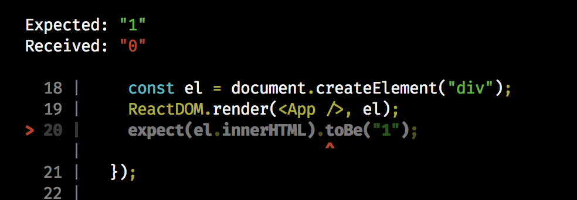
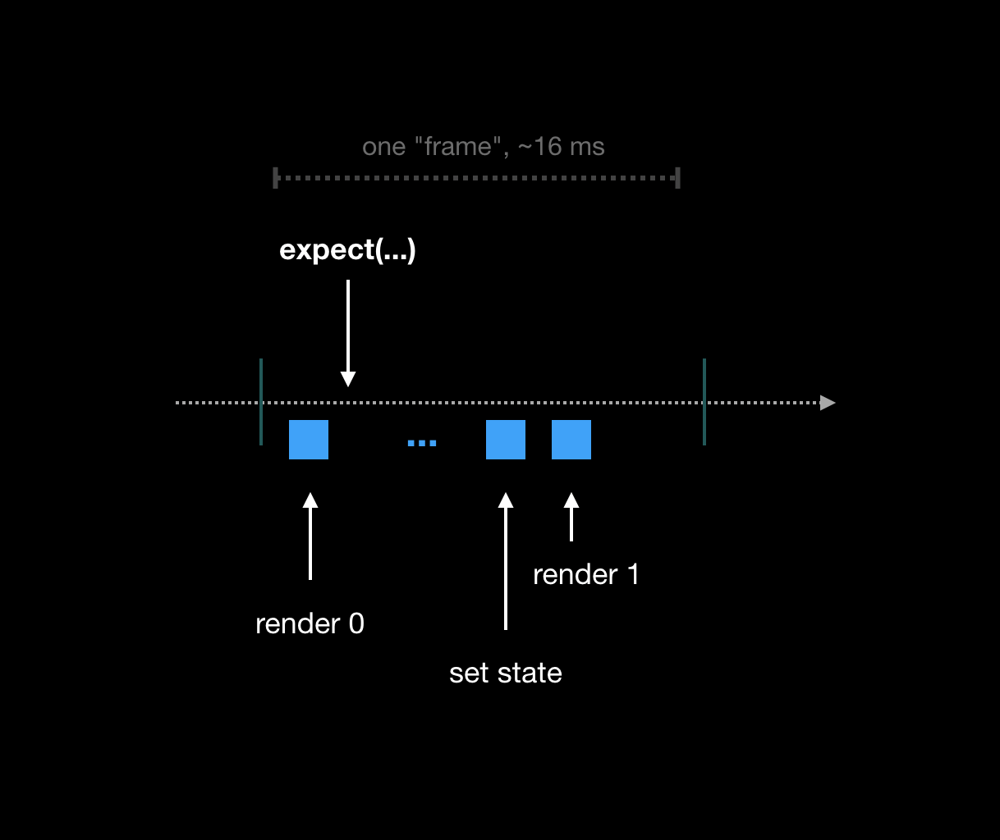
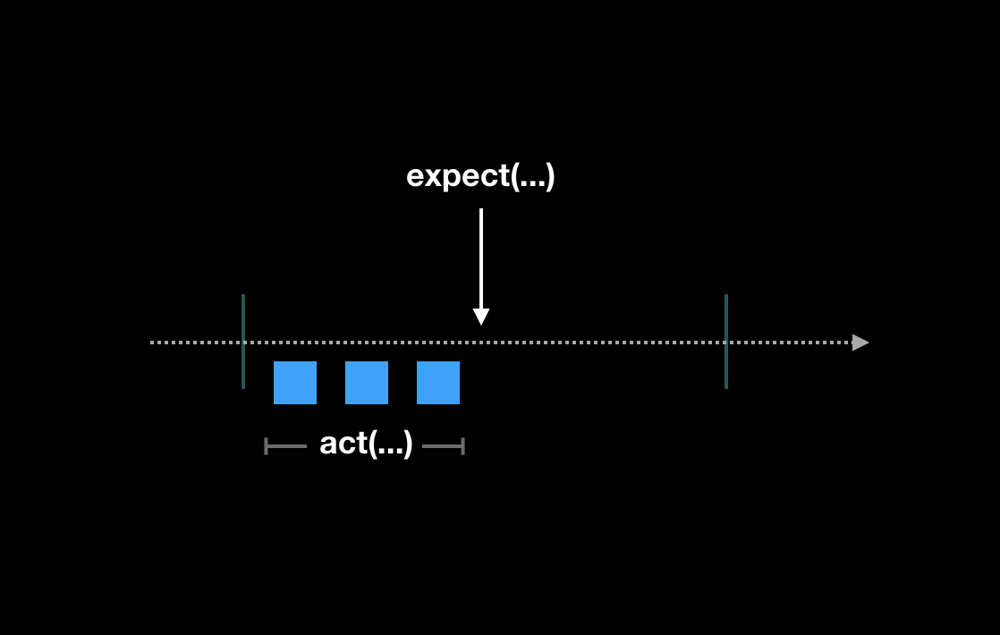
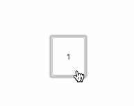
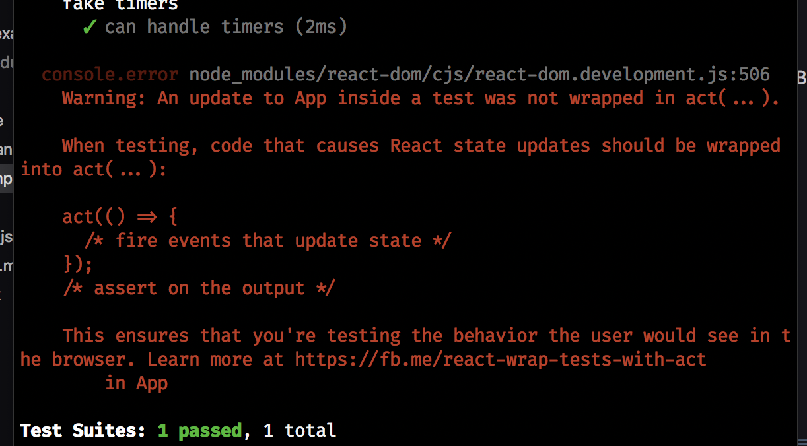

# [Mocking Callbacks and Components](https://www.theodinproject.com/lessons/node-path-react-new-mocking-callbacks-and-components)

## Introduction

We've already covered some basics of React testing. Now's the time to dive deeper.

In this lesson, we'll learn about mocking. Furthermore, we'll discuss a React component from this (https://www.theodinproject.com/dashboard) website and understand how React tests are written in a real world application.

<br>

## Lesson overview

This section contains a general overview of topics that you will learn in this lesson.

- Carry out mocks in the context of React testing.

<br>

## What is mocking?

If you've been following along with our lessons so far, the concept of mocking has already been introduced in an earlier section and you might have even incorporated mocks in your Battleship project. Let's look at how mocks will help in testing React components.

### Testing callback handlers

Callbacks are ubiquitous. Every avenue of user interaction involves callbacks. Sometimes they're passed in as props to alter state of the parent component. Consider this button component:

```jsx
// CustomButton.jsx

const CustomButton = ({ onClick }) => {
	return <button onClick={onClick}>Click me</button>
}

export default CustomButton
```

Nothing fancy. `CustomButton` is a component with a prop passed in. We're interested in the `onClick` prop. We have no idea what the function does. We have no idea how the function will affect the application. All we know is it must be called when the user clicks the button. Let's test it.

Notice how we mock and test the `onClick` function:

```js
// CustomButton.test.jsx

import { vi, describe, it, expect } from 'vitest'
import { render, screen } from '@testing-library/react'
import userEvent from '@testing-library/user-event'
import CustomButton from './CustomButton'

describe('CustomButton', () => {
	it('should render a button with the text "Click me"', () => {
		render(<CustomButton onClick={() => {}} />)

		const button = screen.getByRole('button', { name: 'Click me' })

		expect(button).toBeInTheDocument()
	})

	it('should call the onClick function when clicked', async () => {
		const onClick = vi.fn()
		const user = userEvent.setup()
		render(<CustomButton onClick={onClick} />)

		const button = screen.getByRole('button', { name: 'Click me' })

		await user.click(button)

		expect(onClick).toHaveBeenCalled()
	})

	it("should not call the onClick function when it isn't clicked", async () => {
		const onClick = vi.fn()
		render(<CustomButton onClick={onClick} />)

		expect(onClick).not.toHaveBeenCalled()
	})
})
```

Three tests and we are done with this component. You should already be familiar with how the first test works. Take some time to figure out what functions come from which package.

For the second and third tests, we mock the `onClick` handler using one of Vitest's functions, `vi.fn()`. Then we assert that it is called/not called when the button is clicked or not.

You could also set up your mocks in a `beforeEach` block instead of in every test block. This may be suitable for some situations. However, for better readability, it is recommended that all setups be done in the same test block. Doing so eliminates the need to search through the entire file for context, making it easier to review future changes. This also reduces the chance of leakage causing problems throughout the test suite. Unless your test file is particularly long and the test preparation takes up dozens of lines, it is recommended to set up your mocks in each test block; otherwise, you may use `beforeEach`.

It is recommended to invoke `userEvent.setup()` before rendering the component. It is discourage to call renders and `userEvent` functions outside of the test itself, (for example, in a `beforeEach` block). If you find yourself repeating the same code in multiple tests, the recommended approach to shorten each test is to write a setup function.

### Mocking child components

You might have come across the concept of mocking modules. In React, when the component tree gets large, tests can become convoluted. Especially for components higher up the tree. That's why we mock child components. This is not something you'll come across often, nevertheless, it's beneficial to realize the concept in case you might need it in your own testing pursuits.

<br>

## React testing in the real world

If you're logged in on this (https://www.theodinproject.com/dashboard) website, you've probably come across the project submissions list under every project. Those components were written in React and tested with the React Testing Library. They have since been removed, but they still serve as great examples. This'll be fun. Your task is:

React and try to comprehend the [submissions-list.jsx](https://github.com/TheOdinProject/theodinproject/blob/0886578d5b27a967e6bba2b31f212efe284d9413/app/javascript/components/project-submissions/components/submissions-list.jsx) component. It's okay if you don't understand everything. And the good news is that we don't have to understand it all to follow along with this lesson!

<br>

### submissions-list.jsx

We start by importing a bunch of stuff like any other decent React component. There might be a couple of unfamiliar things on there; we don't have to worry too much about them. If we take a glance at the props, there are some functions in there, presumably event handlers. Let's look at what the component renders.

1. If there's a `userSubmission`, it renders the `Submission` component.

2. If `hasSubmissions` is true, sort the submissions and render them with `Submission`. Otherwise, a heading that says "No submissions yet, be the first!"

3. If `allSubmissionsPath` is true, it renders a `<p>` tag.

Just going through the code, it should give us some idea of what to test. It will be rewarding if you take a couple of seconds to map out what tests we could need for `SubmissionsList`.

Go through its test file, submissions-list.test.jsx. Again, don't worry if all of it doesn't make sense, we'll chew over it shortly.

> **Note**
>
> While the test suite above uses `data-test-id` to identify mocked child components, it must be remembered that the React Testing Library instead uses `data-testid` by default.

<br>

### submissions-list.test.jsx

We notice there are two child components of `SubmissionsList`. One of them is from a package called `react-flip-move`. External Code. We'll mock it.

Notice how we mock the `Submission` component:

```js
jest.mock('../submission', () => ({ submission, isDashboardview }) => (
	<>
		<div data-test-id='submission'>{submission.id}</div>
		<div data-test-id='dashboard'>{isDashboardView.toString()}</div>
	</>
))
```

We only render the bare minimum to realize the validity of the component we're testing. Next, we set up our props with fake data and mocked functions.

<br>

> **Note - Vitest mocks**
>
> The test here used `jest.mock()`. If you followed along and set up your test using Vitest, you may use `vi.mock()` instead.

Let's move toward our first assertion. Don't worry too much about the `ProjectSubmissionContext.Provider`. In the context of this test, its purpose is to act as a route to pass in the `allSubmissionsPath` prop. We've already identified the three points of interest that we want to test. We divide them into three test suites for readability purpose using `describe`.

In the first suite, we make some assertions if the user has a submission and then some assertions if the user does not. The other suites follow a similar pattern.

<br>

### Exploring further

Feel free to flick through the other components and their tests. You'll see mocked functions. You'll see some unseen functions like `act`. You'll see custom render functions. It's fine if you don't understand it all, the goal is to gain familiarity.

The other important thing to note is almost all the tests follow a certain pattern in terms of the way they're written. They follow the Arrange-Act-Assert pattern. It's a good idea to adopt this pattern sooner or later to make your tests more readable and ultimately better.

<br>

# Knowledge Check

- **How can you mock a callback handler?**

We can mock callback handlers using one of Vitest's functions, `vi.fn()`. Then we assert that it is called or not called when the button is clicked or not.

<br>

- **How can you mock a child component?**

We can mock child components using `jest.mock()` or `vi.mock()` functions.

<hr>
<br>
<br>

# [Arrange-Act-Assert](https://wiki.c2.com/?ArrangeActAssert)

"Arrange-Act-Assert" - a pattern of arranging and formatting code in UnitTest methods:

Each methods should group these functional sections, separated by blank lines:

1. **Arrange** all necessary preconditions and inputs.

2. **Act** on the object or method under test.

3. **Assert** that the expected results have occurred.

**_Examples_**

```c#
@Test
public void test() {
  String input = "abc";

  String result = Util.reverse(input);

  assertEquals("cba", result);
}
```

**_Benefits_**

- Clearly separates what is being tested from the setup and verification steps.

- Clarifies and focuses attention on a historically successful and generally necessary set of test steps.

- Makes some TestSmells more obvious:

  - Assertions intermixed with "Act" code

  - Test methods that try to test too many different things at once.

<hr>
<br>
<br>

# [secrets of the `act(...)` api](https://github.com/mrdulin/react-act-examples/blob/master/sync.md)

tl;dr: wrap your test interactions with `act(() => ...)`. React will take care of the rest. Note that for `async act(...)` you need React versiojn at least v16.9.0-alpha.0.

<br>

## effects

Let's start with a simple component. It's contrived and doesn't do much, but is useful for this discussion.

```js
function App() {
	let [ctr, setCtr] = useState(0)
	useEffect(() => {
		setCtr(1)
	}, [])
	return ctr
}
```

So, it's an `App` with 2 hooks - a `useState` initialized with `0`, and a `useEffect` which runs only once, setting this state to `1`. We'll render it to a browser like so:

```js
ReactDOM.render(<App />, document.getElementById('app'))
```

You run it, and you see `1` on your screen. This makes sense to you - the effect ran immediately, updated the state, and that rendered to your screen.

So you write a test for this behaviour, in everyone's favourite testing framework, jest:

```js
it('should render 1', () => {
	const el = document.createElement('div')
	ReactDOM.render(<App />, el)
	expect(el.innerHTML).toBe('1') // this fails!
})
```

You run your tests, and oops:



That doesn't seem right. The value of `el.innerHTML` claims to `0`. But how can that be? Does jest do something strange? Or are you just hallucinating? The docs for useEffect make this a bit clearer - "By using this Hook, you tell React that your component needs to do something **after render**." How did you never see `0` in the browser, if even for a single moment?

To understand this, let's talk a bit about how React works. Since the big fiber rewrite of yore, React doesn't just 'synchronously' render the whole UI everytime you poke at it. It divides its work into chunks and queues it up in a scheduler.

In the component above, there are a few pieces of 'work' that are apparent to us:

- the 'first' render where react outputs `0`,

- the bit where it runs the effect and sets state to `1`

- the bit where it rerenders and outputs `1`



We can now see the problem. We run our test at a point in time when React hasn't even finished updating the UI. You _could_ hack around this:

- by using `useLayoutEffect` instead of `useEffect`: while this would pass the test, we've changed product behaviour for no good reason, and likely its detriment.

- by waiting for some time, like 100ms or so: this is pretty ick, and might not even work depending on your setup.

Neither of these solutions are satisfying; we can do much better. In 16.8.0, we introduced a new testing API `act(...)`. It guarantees 2 things for any code run inside its scope:

- any state updates will be executed

- any enqueued effects will be executed

Further, React will warn you when you try to "set state" _outside of the scope of an `act(...)` call._ (i.e. - when you call the 2nd return value from a `useState`/`useReducer` hook).

Let's rewrite our test with this new api:

```js
it('should render 1', () => {
	const el = document.createElement('div')
	act(() => {
		ReactDOM.render(<App />, el)
		expect(el.innerHTML).toBe('1') // this passes!
	})
})
```

Neat, the test now passes! In short, "act" is a way of putting 'boundaries' around those bits of your code that actually 'interact' with your React app - these could be user interactions, apis, custom event handlers and subscriptions firing; anything that looks like it "changes" something in your UI. React will make sure your UI is updated as "expected", so you can make assertions on it.



(You can even nest multiple calls to `act`, composing interactions across functions, but in most cases you wouldn't need more than 1-2 levels of nesting.)

<br>

## events

Let's look at another example; this time, events:

```js
function App() {
	let [counter, setCounter] = useState(0)
	return <button onClick={() => setCounter(counter + 1)}>{counter}</button>
}
```

Pretty simple, I think: A button that increments a counter. You render this to a browser like before:



So far, so good. Let's write a test for it.

```js
it('should increment a counter', () => {
	const el = document.createElement('div')
	document.body.appendChild(el)
	// we attach the element to document.vody
	ReactDOM.render(<App />, el)
	const button = el.childNodes[0]
	for (let i = 0; i < 3; i++) {
		button.dispatchEvent(new MouseEvent('click', { bubbles: true }))
	}
	expect(button.innerHTML).toBe('3')
})
```

This 'works' as expected. The warning doesn't fire for setStates called by 'real' event handlers, and for all intents and purposes this code is actually fine.

But you get suspicious, and because Sunil told you so, you extend the test a bit -

```js
act(() => {
	for (let i = 0; i < 3; i++) {
		button.dispatchEvent(new MouseEvent('click'), { bubbles: true })
	}
})
expect(button.innerHTML).toBe(3) // this fails
```

The test fails, and `button.innerHTML` claims to be "1"! Well shit, at first, this seems annoying. But `act` has uncovered a potential bug here -- if the handlers are ever called close to each other, it's possible that the handler will use stale data and miss some increments. The 'fix' is simple - we rewrite with 'setState' call with the updater form i.e. `setCounter(x => x + 1)`, and the test passes. This demonstrates the value `act` brings to grouping and executing interactions together, resulting in more 'correct' code. Yay, thanks `act`!

<br>

### timers

Let's keep going. How about stuff based on timers? Let's write a component that 'ticks' after one second.

```js
function App() {
	const [ctr, setCtr] = useState(0)
	useEffect(() => {
		setTimeout(() => setCtr(1), 1000)
	}, [])
	return ctr
}
```

Let's write a test for this:

```js
it('should tick to a new value', () => {
	const el = document.createElement('div')
	act(() => {
		ReactDOM.render(<App />, el)
	})
	expect(el.innerHTML).toBe('0')
	// ???
	expect(el.innerHTML).toBe('1')
})
```

What could we do here?

Option 1 - Let's lean on Jest's timer mocks.

```js
it('should tick to a new value', () => {
	jest.useFakeTimers()
	const el = document.createElement('div')
	act(() => {
		ReactDOM.render(<App />, el)
	})
	expect(el.innerHTML).toBe('0')
	jest.runAllTimers()
	expect(el.innerHTML).toBe('1')
})
```



Better! We were able to convert asynchronous time to be synchronous and manageable. We also get the warning; when we ran `runAllTimers()`, the timeout in the component resolved, triggering the setState. Like the warning advises, we mark the boundaries of that action with `act(...)`. Rewriting the test -

```js
it('should tick to a new value', () => {
	jest.useFakeTimers()
	const el = document.createElement('div')
	act(() => {
		ReactDOM.render(<App />, el)
	})

	expect(el.innerHTML).toBe('0')
	act(() => {
		jest.runAllTimers()
	})
	expect(el.innerHTML).toBe(1)
})
```

Test passes, no warnings, huzzah! Good stuff.

Option 2 - Alternately, let's say you wanted to use 'real' timers. This is a good time to introduce the asynchronous version of act. Introduced in 16.9.0-alpha.0, it lets you define an asynchronous boundary for `act()`. Rewriting the test from above -

```js
it('should tick to a new value', async () => {
	// a helper to use promises with timeouts
	function sleep(period) {
		return new Promise((resolve) => setTimeout(resolve, period))
	}
	const el = document.createElement('div')
	act(() => {
		ReactDOM.render(<App />, el)
	})
	expect(el.innerHTML).toBe('0')
	await act(async () => {
		await sleep(1100) // wait *just* a little longer than the timeout in the component
	})
	expect(el.innerHTML).toBe('1')
})
```

Again, test passes, no warnings, excellent!

This simplifies a lot of rough edges with testing asynchronous logic in components. You don't have to mess with fake timers or builds anymore, and can write tests more 'naturally'. As a bonus, it will (eventually) be compatible with concurrent mode!

While it's less restrictive than the synchronous version, it supports all its features, but in an async form. The api makes some effort to make sure you don't interleave these calls, maintaining a tree-like shape of interactions at all times.

<br>

### promises

Let's keep going. This time, let's use promises. Consider a component that fetches data with, er, `fetch` -

```js
function App() {
	let [data, setData] = useState(null)
	useEffect(() => {
		fetch('some/url').then(setData)
	}, [])
	return data
}
```

Let's write a test. This time, we'll mock `fetch` so we have control over when and how it responds:

```js
it('should display fetched data', () => {
	// a rather simple mock, you might use something more advanced for your needs
	let resolve
	function fetch() {
		return new Promise((_resolve) => {
			resolve = _resolve
		})
	}

	const el = document.createElement('div')
	act(() => {
		ReactDOM.render(<App />, el)
	})
	expect(el.innerHTML).toBe('')
	resolve(42)
	expect(el.innerHTML).toBe('42')
})
```

The test passes, but we get the warning again. Like before, we wrap the bit that 'resolves' the promise with `act(...)`

```js
// ...
expect(el.innerHTML).toBe('')
await act(async () => {
	resolve(42)
})
expect(el.innerHTML).toBe('42')
// ...
```

This time, the test passes, and the warning's disappeared. Brilliant. Of note, even though it might appear like `resolve(42)` is synchronous, we use the async version to make sure microtasks are flushed before releasing scope, preventing the warning. Neat.

<br>

### async/await

This is now as simple as the previous, now that we have the asynchronous version to capture the scope. Revisiting the component from the previous example:

```js
function App() {
	let [data, setData] = useState(null)
	async function somethingAsync() {
		// this time we use the await syntax
		let response = await fetch('/some/url')
		setData(response)
	}
	useEffect(() => {
		somethingAsync()
	}, [])
	return data
}
```

And run the same test on it:

```js
it('should display fetched data', async () => {
	// a rather simple mock, you might use something more advanced for your needs
	let resolve
	function fetch() {
		return new Promise((_resolve) => {
			resolve = _resolve
		})
	}
	const el = document.createElement('div')
	act(() => {
		ReactDOM.render(<App />, el)
	})
	expect(el.innerHTML).toBe('')
	await act(async () => {
		resolve(42)
	})
	expect(el.innerHTML).toBe('42')
})
```

Literally the same as the previous example. All good and green. Nice.

<br>

### Notes:

- if you're using `ReactTestRenderer`, you should use `ReactTestRenderer.act` instead.

- we can reduce some of the boilerplate associated with this by integrating `act` directly with testing libraries; react-testing-library already wraps its helper functions by default with act, and I hope that enzyme, and others like it, will do the same.

<hr>
<br>
<br>

# [Jest testing - mocking child components to make your unit tests more concise](https://medium.com/@taylormclean15/jest-testing-mocking-child-components-to-make-your-unit-tests-more-concise-18691ef6a0c2)

Due to the tree-like structure of components in a React applications, it's common that components higher up in the tree can become more difficult to test, owing to the fact that they may be comprised of multiple complex child components. Testing such components may require you to perform a number of interactions on the child components to "set the stage", and since you may already have unit tests for the child components, you don't want to have to retest their functionality. What can you do?

The first thing to note is that you may actually be wanting to interact with the child components, in order to test the full integration of the logic of the parent component with all of the child components. However, if you're looking to unit test just the logic contained in the parent component, you'll want to abstract away the functionality of the child components.

With Jest, you can mock entire React components, and this is a great pattern for tackling the above pattern.

Let's say we have a parent component that contains a bunch of logic and functionality that we'd like to test:

```js
import React, { useState } from 'react'
import UserManagement from './child-component'

const GroupForm = ({ initialUsers = [] }) => {
	const [users, setUsers] = useState(initialUsers)

	const addUser = (newUser) => setUsers([...users, newUser])

	const deleteUser = (index) => {
		const updatedUsers = [...users]
		updatedUsers.splice(index, 1)
		setUsers(updatedUsers)
	}

	const editUser = (index, editedUser) => {
		const updatedUsers = [...users]
		updatedUsers[index] = editedUser
		setUsers(updatedUsers)
	}

	const handleSubmit = (event) => {
		// send a request to create a group with the given users
	}

	return (
		<>
			<form onSubmit={handleSubmit}>
				<label htmlFor='groupName'>Group Name</label>
				<input id='groupName' type='text' name='groupName' />

				<label htmlFor='date'>Date</label>
				<input id='date' type='date' name='date' />

				<button type='submit'>Submit</button>
			</form>
			<UserManagement
				users={users}
				onAdd={addUser}
				onDelete={deleteUser}
				onEdit={editUser}
			/>
		</>
	)
}

export default GroupForm
```

Here is the child component:

```js
import React, { useState } from 'react'

const UserForm = ({ user, onSubmit }) => {
	const [name, setName] = useState(user.name ?? '')
	const [address, setAddress] = useState(user.address ?? '')

	const handleSubmit = (event) => {
		event.preventDefault()
		event.preventPropagation()

		onSubmit({
			name,
			address,
		})
	}

	return (
		<form onSubmit={handleSubmit}>
			<label htmlFor='name'>Name</label>
			<input
				id='name'
				type='text'
				name='name'
				value={name}
				onChange={(event) => setName(event.target.value)}
			/>

			<label htmlFor='address'>Address</label>
			<input
				id='address'
				type='text'
				name='address'
				value={address}
				onChange={(event) => setAddress(event.target.value)}
			/>

			<button type='submit'>Submit</button>
		</form>
	)
}

const UserManagement = ({ users, onAdd, onDelete, onEdit }) => {
	const [formOpen, setFormOpen] = useState(false)
	const [selectedUser, setSelectedUser] = useState(null)

	const Form = () => {
		if (formOpen) {
			if (selectedUser) return <UserForm onSubmit={editUser} user={{}} />
      else return <UserForm onSubmit={addUser} user={user[selectedUser]}>
		}

    return null
	}

  const addUser = (data) => {
    onAdd(data)
    setFormOpen(false)
  }

  const editUser = (data) => {
    onEdit(selectedUser, data)
    setSelectedUser(null)
    setFormOpen(false)
  }

  return (
    <>
      <button onClick={() => setFormOpen(true)}>Add User</button>
      <table>
        <thead>
          <tr>Name</tr>
          <tr>Address</tr>
          <tr>Action</tr>
        </thead>

        <tbody>
          {users.map((user, index) => (
            <tr>
              <td>{user.name}</td>
              <td>{user.address}</td>
              <td>
                <button onClick={() => {setSelectedUser(index); setFormOpen(true)}}>Edit</button>
                <button onClick={() => onDelete(index)}>Delete</button>
              </td>
            </tr>
          ))}
        </tbody>
      </table>
      <Form />
    </>
  )
}
```

To summarize what's going on: We have a parent component with a form for creating user groups, and a child component with a form and a table for managing users (adding, editing, deleting). The users state is ultimately managed by the parent component, and the idea is that when the user group is created, it's created with the list of users.

Let's assume that we already have unit tests for the child component. When testing the parent component, we would rather avoid all of the "ceremony" involved in interacting with the child component just to test the parent component. For example, we would have to open the user form, select the form inputs, fill them out, submit the form, and then test that the parent component handled the form submission correctly. Instead, we will mock the child component to be a simplified version that will make our tests considerably more concise.

```js
let mockUser
let mockIndex

jest.mock('./child-component', () => ({ onAdd, onDelete, onEdit, users }) => (
	<div>
		<button onClick={() => onAdd(mockUser)} data-testid='addUser'>Add</button>
		<button
			onClick={() => onDelete(mockIndex, mockUser)}
			data-testid='deleteUser'
		>
			Delete
		</button>
		<button onClick={() => onEdit(mockIndex, mockUser) data-testid='editUser'}>Edit</button>
    <span data-testid='users'>{JSON.stringify(users)}</span>
	</div>
))
```

We will also add a little test utility for quickly asserting that the users are being managed correctly.

```js
const assertUsers = (expectedUsers) => {
	const usersSpan = screen.getByTestId('users')
	const usersText = usersSpan.innerHTML
	const actualUsers = JSON.parse(usersText)
	expect(expectedUsers).toEqual(actualUsers)
}
```

Now notice how concise our tests can be.

```js
describe('GroupForm', () => {
	it('correctly handles adding a user', () => {
		mockUser = {
			name: 'test add user',
			address: 'test add user',
		}

		render(<GroupForm />)

		const addUserButton = screen.getByTestId('addUser')
		userEvent.click(addUserButton)

		assertUsers([mockUser])
	})

	it('correctly handles deleting a user', () => {
		mockIndex = 1
		const initialUsers = [
			{
				name: '1',
				address: '1',
			},
			{
				name: '2',
				address: '2',
			},
			{
				name: '3',
				address: '3',
			},
		]

		render(<GroupForm initialUsers={initialUsers} />)

		const deleteUserButton = screen.getByTestId('deleteUser')
		userEvent.click(deleteUserButton)

		const expectedUsers = [initialUsers[0], initialUsers[2]]
		assertUsers(expectedUsers)
	})

	it('correctly handles editing a user', () => {
		mockIndex = 0
		const initialUsers = [
			{
				name: 'initial',
				address: 'initial',
			},
		]
		mockUser = {
			name: 'edited',
			address: 'edited',
		}
	})

	render(<GroupForm initialUsers={initialUsers} />)

	const editUserButton = screen.getByTestId('editUser')
	userEvent.click(editUserButton)

	assertUsers([mockUser])
})
```

At this point, it's prudent to make note of a few potential pitfalls:

If your mock component doesn't accurately capture the functionality of the original componet, your tests could give false positives. The mock component doesn't necessarily need to emulate the entire functionality of the original component, but it doesn eed to present the same API as the original. Generally speaking, this means it should take the same props, and use the same callbacks.

Your mock component may also become out of sync with the original component, and your unit tests may still pass. However, if you have good integration and end-to-end test coverage, any such discrepancies should be caught. Ultimately this is a shortcoming of unit tests in general, and is why it's good to supplement your unit tests with integration and end-to-end tests.

In summary, when you are looking to avoid test coverage overlap/duplication, or looking to achieve more focused unit tests, the pattern of mocking child components can be a useful tool in your toolkit.
