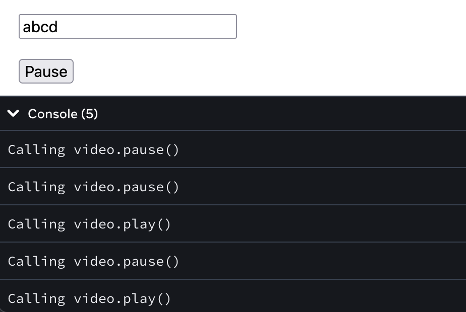
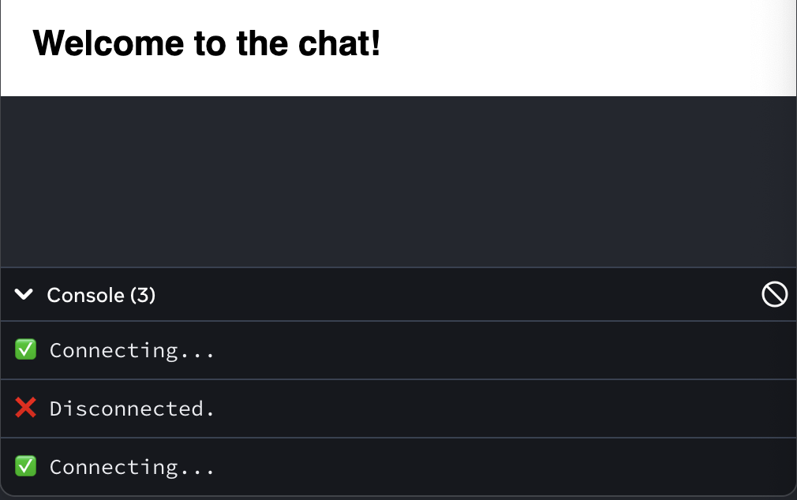

# [How To Deal With Side Effects](https://www.theodinproject.com/lessons/node-path-react-new-how-to-deal-with-side-effects)

## Introduction

Certain components in React need to interact with things outside themselves. These things can be anything from querying data from a server to finding/changing the position of the component on the webpage or even sending some data to a server when necessary. This interaction with the _outside world_ is called a side-effect.

While we are already familiar with rendering code and adding event handlers, it is not enough for all uses, like when you want to connect to your server and fetch messages to show to a user. Effects let you run some code to synchronize your component as necessary, on rendering, or a reactive/state value change rather than on a particular event.

Similar to how we have the `useState` hook, React offers us a handy `useEffect` hook to use effects in our components.

<br>

## Lesson overview

This section contains a general overview of topics that you will learn in this lesson.

- Understand what effects are in React.

- Learn how to use effects in React applications.

- Explore different parts of the useEffect hook.

- Identify when to use an effect in React.

<br>

## Using effect saves the day

### The useEffect hook

Let us take a component in question. We want to make a `Clock` component that shows how many seconds have passed since the user has loaded the webpage. To update it every second, we can use our nifty `setInterval` function to add to the `counter` state variable, every second. Let's try putting it in the body of our component.

```js
import { useState } from 'react'

export default function Clock() {
	const [counter, setCounter] = useState(0)

	setInterval(() => {
		setCounter((count) => count + 1)
	}, 1000)

	return <p>{counter} seconds have passed.</p>
}
```

Alas, we see our counter going berserk. This happens because the `setInterval` function is being called not once, but at every state render.

When our component first renders, it calls our initial `setInterval` function. That interval updates the state every second, triggering the component to re-render. But every re-render calls `setInterval` again, which triggers more frequent state updates, which each spawn new intervals, and everything quickly spirals out of control.

This is where the `useEffect` hook swoops in to save us. We can wrap this calculation inside a `useEffect` hook to move it outside the rendering calculation. It accepts a callback function with all the calculations.

```js
import { useEffect, useState } from 'react'

export default function Clock() {
	const [counter, setCounter] = useState(0)

	useEffect(() => {
		setInterval(() => {
			setCounter((count) => count + 1)
		}, 1000)
	})

	return <p>{counter} seconds have passed.</p>
}
```

But, it still keeps growing too fast! This is where another argument of the `useEffect` comes in: the dependency array.

<br>

### The dependency array

By default, `useEffect` hook runs on every render. Since setting state tears the component down, we still get multiple setter calls on every render, which doesn't help us.

Fortunately, the second argument accepts an array of dependencies allowing the hook to re-render **only when those dependencies are changed.** So if you have a state variable and want to have some side-effect occur any time the state changes, you can use this hook and mention the state variable in the dependency array.

We pass an empty array in this example because we do not want the `useEffect` hook to run anytime other than the initial component render.

```js
import { useEffect, useState } from 'react'

export default function Clock() {
	const [counter, setCounter] = useState(0)

	useEffect(() => {
		setInterval(() => {
			setCounter((counter) => counter + 1)
		}, 1000)
	}, [])

	return <p>{counter} seconds have passed.</p>
}
```

> Usually, you do not need to add dependencies to your `useEffect` hook manually. Your linter should let you know about the dependencies it expects. Letting the linter show errors and fixing them instead of suppressing them is usually the best idea. On a general node, the following block does a good job of summing this point up.
>
> ```js
> useEffect(() => {
> 	// This run after every render
> })
>
> useEffect(() => {
> 	// This runs only on mount (when the component appears)
> }, [])
>
> useEffect(() => {
> 	// This runs on mount *and also* if either a or b have changed since the last render
> }, [a, b])
> ```

<br>

### The clean-up function

Oh, it's not going berserk anymore! We still have an issue with the counter updating twice every second though. That can be understood as a behavior caused by the React StrictMode. It is supposed to help us catch bugs, so what is that bug here?

With `StrictMode`, the `App` component is mounted, unmounted, then mountain again. This behavior of `StrictMode` is only in the development environment. Notice that every time the `useEffect` hook runs, a new `setInterval` is used. When the component is unmounted the first time, `setInterval` is not stopped, it keeps incrementing. This unnecessary behavior can be prevented by clearing the interval when the component is unmounted and that is where the third part of our `useEffect` hook comes in -- the cleanup function.

You can return a function from the callback in the `useEffect` hook, which will be executed each time before the next effect is run, and one final time when the component is unmounted. In this case, let us clean up the interval with a cleanup function.

```js
import { useEffect, useState } from 'react'

export default function Clock() {
	const [counter, setCounter] = useState(0)

	useEffect(() => {
		const key = setInterval(() => {
			setCounter((counter) => counter + 1)
		}, 1000)

		return () => {
			clearInterval(key)
		}
	}, [])

	return <p>{counter} seconds have passed.</p>
}
```

Phew! It finally works! As the counter keeps merrily ticking on, let us sum up what we know about the `useEffect` hook.

```js
useEffect(
	() => {
		// Execute side effect
		return () => {
			// Clean up function on unmounting or re-running effect
		}
	},
	// Optional dependency array
	[
		/* 0 or more entries */
	]
)
```

<br>

## But do we need the effect?

`useEffect` is a mechanism outside the concepts that React usually applies, allowing you to sync your component with various external systems like a server, API, or browser DOM. The single question that you can ask yourself before you use an effect is if there are any such external syste,s that need to be synced with, apart from props or state. Unnecessary `useEffect` hooks are code-smell, error-prone, and cause unnecessary performance issues.

Let us address a few cases where `useEffect` does not need to be used.

- You do not need to use an effect if you are only calculating something based on the state during rendering. For a change in a component, due to a change in the props, you can calculate and set it during rendering.

```js
import { useState } from 'react'

export default function AdditionDisplay() {
	const [number1, setNumber1] = useState(0)
	const [number2, setNumber2] = useState(0)

	// This is all unnecessary.

	// const [sum, setSum] = useState(0)
	// useEffect(() => {
	//    setSum(number1 + number2)
	// }, [number1, number2])

	const sum = number1 + number2

	return (
		<p>
			{number1} + {number2} = {sum}
		</p>
	)
}
```

- You do not need effects for events. Code that runs when a component is **displayed** should be in effects, the rest should be in events.

```js
import { useState } from 'react'

export default function App() {
	const [input, setInput] = useState('')

	const handleInput = (e) => {
		setInput(e.target.value)
	}

	// You should avoid direct manipulation when not necessary

	// useEffect(() => {
	//    document.getElementById('name').addEventListener('change', handleInput)
	//
	//    return () => {
	//      document.getElementById('name').removeEventListener('change', handleInput)
	//    }
	// })

	return (
		<>
			{/* <input id='name' /> */}

			<input onChange={handleInput} value={input} />
			<p>{input}</p>
		</>
	)
}
```

- You do not need an effect to reset the state based on a condition most of the time. You have learned about keys in React. Just like using a key on a list's item, adding one to a component, based on the state on which it should be reset creates a unique version of that component for each change in the value of the state.

- If you are having issues with managing your state and want to use an effect to update the state of a parent or some other non-child component, consider **lifting the state**. As we know, in React, the state flows in one direction, generally down the DOM. So the parents know of the data before passing it to the children. If multiple children are required to make use of a single state, it should be moved up to the parent that has all of the components that need it, instead of using escape hatches like an effect.

<br>

## Knowledge Check

- **What is an effect?**

In React, an "effect" refers to side effects that occur outside the pure rendering logic of a component. While JSX is used to describe the UI structure and is purely declarative, effects allow you to interact with external systems or perform actions that have a broader impact than just updating the UI.

<br>

- **What constitutes a `useEffect` hook?**

```js
useEffect(
	() => {
		// execute side effect

		return () => {
			// cleanup function on unmounting or re-running effect
		}
	},
	// optional dependency array
	[
		/* 0 or more entries */
	]
)
```

<br>

- **What is the one question we can ask to know when to use an effect?**

The single question that you can ask yourself before you use an effect is if there are any such external systems that need to be synced with, apart from props or state.

<br>

- **What do we mean by lifting up the state?**

In React, lifting state up means moving a component's state to a common ancestor component so that multiple child components can access and modify it. This is done to create a single source of truth for the state, making it easier to manage and share data between components. Essentially, you're taking state that's currently held by a child component and moving it up to a parent component.

<hr>
<br>
<br>

# [Lifecycle of Reactive Effects](https://react.dev/learn/lifecycle-of-reactive-effects)

Effects have a different lifecycle from components. Components may mount, update, or unmount. An Effect can only do two things: to start synchronizing something, and later to stop synchronizing it. This cycle can happen multiple times if your Effect depends on props and state that change over time. React provides a linter rule to check that you've specified your Effect's dependencies correctly. This keeps your Effects synchronized to the latest props and state.

<br>

## You will learn

- How an Effect's lifecycle is different from a component's lifecycle

- How to think about each individual Effect in isolation

- When your Effect needs to re-synchronize, and why

- How your Effect's dependencies are determined

- What it means for a value to be reactive

- What an empty dependency array means

- How React verifies your dependencies are correct with a linter

- What to do when you disagree with the linter

<br>

## The lifecycle of an Effect

Every React component goes through the same lifecycle:

- A component _mounts_ when it's added to the screen.

- A component _updates_ when it receives new props or state, usually in response to an interaction.

- A component _unmounts_ when it's removed from the screen.

**It's a good way to think about components, but _not_ about Effects.** Instead, try to think about each Effect independently from your component's lifecycle. An Effect describes how to [synchronize an external system](https://react.dev/learn/synchronizing-with-effects) to the current props and state. As your code changes, synchronization will need to happen more or less often.

To illustrate this point, consider this Effect connecting your component to a chat server:

```js
const serverUrl = 'https://localhost:1234'

function ChatRoom({ roomId }) {
	useEffect(() => {
		const connection = createConnection(serverUrl, roomId)
		connection.connect()

		return () => {
			connection.disconnect()
		}
	}, [roomId])
	// ...
}
```

Your Effect's body specifies how to **start synchronizing:**

```js
const connection = createConnection(serverUrl, roomId)
connection.connect()
```

Intuitively, you might think that React would **start synchronizing** when your component mounts and **stop synchronizing** when your component unmounts. However, this is not the end of the story! Sometimes, it may also be necessary to **start and stop synchronizing multiple times** while the component remains mounted.

Let's look at _why_ this is necessary, _when_ it happens, and _how_ you can control this behavior.

> **Note**
>
> Some Effects don't return a cleanup function at all. [More often than not](https://react.dev/learn/synchronizing-with-effects#how-to-handle-the-effect-firing-twice-in-development), you'll want to return one -- but if you don't, React will behave as if you returned an empty cleanup function.

<br>

## Why synchronization may need to happen more than once

Imagine this `ChatRoom` component receives a `roomId` prop that the user picks in a dropdown. Let's say that initially the user picks the `"general"` room as the `roomId`. Your app displays the `"general"` chat room:

```js
const serverUrl = 'https://localhost:1234'

function ChatRoom({ roomId /* 'general */ }) {
	// ...
	return <h1>Welcome to the {roomId} room!</h1>
}
```

After the UI is displayed, React will run your Effect to **start synchronizing**. It connects to the `"general"` room:

```js
function ChatRoomt({ roomId /* 'general' */ }) {
	useEffect(() => {
		const connection = createConnection(serverUrl, roomId) // Connects to the 'general' room
		connection.connect()

		return () => {
			connection.disconnect() // Disconnects from the 'general' room
		}
	}, [roomId])
}
// ...
```

So far, so good.

Later, the user picks a different room in the dropdown (for example, `"travel"`). First, React will update the UI:

```js
function ChatRoom({ roomId /* 'travel' */ }) {
	// ...
	return <h1>Welcome to the {roomId} room!</h1>
}
```

Think about what should happen next. The user sees that `"travel"` is selected chat room in the UI. However, the Effect that ran the last time is still connected to the `"general"` room. **The `roomId` prop has changed, so what your Effect did back then (connecting to the `"general"` room) no longer matches the UI.**

At this point, you want React to do two things:

1. Stop synchronizing with the old `roomId` (disconnect from the `"general"` room)

2. Start synchronizing with the new `roomId` (connect to the `"travel"` room)

**Luckily, you've already taught React how to do both of these things!** Your Effect's body specifies how to start synchronizing, and your cleanup function specifies how to stop synchronizing. All that React needs to do now is to call them in the correct order and with the correct props and state. Let's see how exactly that happens.

<br>

## How React re-synchronizes your Effect

Recall that your `ChatRoom` component has received a new value for its `roomId` prop. It used to be `"general"`, and now it is `"travel"`. React needs to re-synchronize your Effect to re-connect you to a different room.

To **stop synchronizing**, React will call the cleanup function that your Effect returned after connecting to the `"general"` room. Since `roomId` was `"general"`, the cleanup function disconnects from the `"general"` room:

```js
function ChatRoom({ roomId /* general */ }) {
	useEffect(() => {
		const connection = createConnection(serverUrl, roomId) // Connect to the "general" room
		connection.connect()

		return () => {
			connection.disconnect() // Disconnects from the "general" room
		}
	})
}
// ...
```

Then React will run the Effect that you've provided during this render. This time, `roomId` is `"travel"` so it will **start synchronizing** to the `"travel"` chat room (until its cleanup function is eventually called too):

```js
function ChatRoom({ roomId /* general */ }) {
  useEffect(() => {
    const connection = createConnection(serverUrl, roomId) // Connect to the "travel" room
    connection.connect()
  // ...
```

Thanks to this, you're now connected to the same room that the user chose in the UI. Disaster averted!

Every time after your component re-renders with a different `roomId`, your Effect will re-synchronize. For example, let's say the user changes `roomId` from `"travel"` to `"music"`. React will again **stop synchronizing** your Effect by calling its cleanup function (disconnecting you from the `"travel"` room). Then it will **start synchronizing** again by running its body with the new `roomId` prop (connecting you to the `"music"` room).

Finally, when the user goes to a different screen, `ChatRoom` unmounts. Now there is no need to stay connected at all. React will **stop synchronizing** your Effect one last time and disconnect you from the `"music"` chat room.

<br>

## Thinking from the Effect's perspective

Let's recap everything that's happened from the `ChatRoom` component's perspective:

1. `ChatRoom` mounted with `roomId` set to `"general"`

2. `ChatRoom` updated with `roomId` set to `"travel"`

3. `ChatRoom` updated with `roomId` set to `"music"`

4. `ChatRoom` unmounted

During each of these points in the component's lifecycle, your Effect did different things:

1. Your Effect connected to the `"general"` room

2. Your Effect disconnected from the `"general"` room and connected to the `"travel"` room

3. Your Effect disconnected from the `"travel"` room and connected to the `"music"` room

4. Your Effect disconnected from the `"music"` room

Now let's think about what happened from the perspective of the Effect itself:

```js
useEffect(() => {
	// Your Effect connected to the room specified with roomId...
	const connection = createConnection(serverUrl, roomId)
	connection.connect()
	return () => {
		// ... until it disconnected
		connection.disconnect()
	}
}, [roomId])
```

This code's structure might inspire you to see what happened as a sequence of non-overlapping time periods:

1. Your Effect connected to the `"general"` room (until it disconnected)

2. Your Effect connected to the `"travel"` room (until it disconnected)

3. Your Effect connected to the `"music"` room (until it disconnected)

Previously, you were thinking from the component's perspective. When you looked from the component's perspective, it was tempting to think of Effect as "callbacks" or "lifecycle events" that fire at a specific time like "after a render" or "before unmount". This way of thinking gets complicated very fast, so it's best to avoid.

**Instead, always focus on a single start/stop cycle at a time. It shouldn't matter whether a component is mounting, updating, or unmounting. All you need to do is to describe how to start synchronization and how to stop it. If you do it well, your Effect will be resilient to being started and stopped as many times as it's needed.**

This might remind you how you don't think whether a component is mounting or updating when you write the rendering logic that creates JSX. You describe what should be on the screen, and React figures out the rest.

<br>

## How React verifies that your Effect can re-synchronize

Here is a live example that you can play with. Press "Open chat" to mount the `ChatRoom` component:

```js chat.js
export function createConnection(serverUrl, roomId) {
	// A real implementation would actually connect to the server
	return {
		connect() {
			console.log(
				'✅ Connecting to "' + roomId + '" room at ' + serverUrl + '...'
			)
		},

		disconnect() {
			console.log('❌ Disconnected from "' + roomId + '" room at ' + serverUrl)
		},
	}
}
```

```js App.js
import { useState, useEffect } from 'react'
import { createConnection } from './chat.js'

const serverUrl = 'https://localhost:1234'

function ChatRoom({ roomId }) {
	useEffect(() => {
		const connection = createConnection(serverUrl, roomId)
		connection.connect()
		return () => connection.disconnect()
	}, [roomId])

	return <h1>Welcome to the {roomId} room</h1>
}

export default function App() {
	const [roomId, setRoomId] = useState('general')
	const [show, setShow] = useState(false)

	return (
		<>
			<label>
				Choose the chat room:{' '}
				<select value={roomId} onChange={(e) => setRoomId(e.target.value)}>
					<option value='general'>general</option>
					<option value='travel'>travel</option>
					<option value='music'>music</option>
				</select>
			</label>
			<button onClick={() => setShow(!show)}>
				{show ? 'Close chat' : 'Open chat'}
			</button>
			{show && <hr />}
			{show && <ChatRoom roomId={roomId} />}
		</>
	)
}
```

Notice that when the component mounts for the first time, you see three logs:

1. `✅ Connecting to "general" room at https://localhost:1234...` _(development-only)_

2. `❌ Disconnected from "general" room at https://localhost:1234.` _(development-only)_

3. `✅ Connecting to "general" room at https://localhost:1234...`

The first two logs are development-only. In development, React always remounts each component once.

**React verifies that your Effect can re-synchronize by forcing it to do that immediately in development.** This might remind you of opening a door and closing it an extra time to check if the door lock works. React starts and stops your Effect one extra time in development to check [you've implemented its cleanup well](https://react.dev/learn/synchronizing-with-effects#how-to-handle-the-effect-firing-twice-in-development).

The main reason your Effect will re-synchronize in practice is if some data it uses has changed. In the sandbox above, change the selected chat room. Notice how, when the `roomId` changes, your Effect re-synchronizes.

However, there are also more unusual cases in which re-synchronization. For example, try editing the `serverUrl` in the sandbox aboce while the chat is open. Notice how the Effect re-synchronizes in response to your edits to the code. In the future, React may add more features that rely on re-synchronization.

<br>

## How React knows that it needs to re-synchronize the Effect

You might be wondering how React knew that your Effect needed to re-synchronize after `roomId` changes. It's because _you told React_ that its code depends on `roomId` by including it in the list of dependencies:

```js
function ChatRoom({ roomId }) {
	// The roomId prop may change over time
	useEffect(() => {
		const connection = createConnection(serverUrl, roomId) // This Effect reads roomId
		connection.connect()
		return () => {
			connection.disconnect()
		}
	}, [roomId]) // So you tell React that this Effect "depends on" roomId
}
```

Here's how this works:

1. You knew `roomId` is a prop, which means that it can change over time.

2. You knew that your Effect reads `roomId` (so its logic depends on a value that may change later).

3. This is why you specified it as your Effect's dependency (so that it re-synchronizes when `roomId` changes).

Every time after your component re-renders, React will look at the array of dependencies that you have passed. If any of the values in the array is different from the value at the same spot that you passed during the previous render, React will re-synchronize your Effect.

For example, if you passed `["general"]` during the initial render, and later you passed `["travel"]` during the next render, React will compare `"general"` and `"travel"`. These are different values (compared with `Object.is`), so React will re-synchronize your Effect. On the other hand, if your component re-renders but `roomId` has not changed, your Effect will remain connected to the same room.

<br>

## Each Effect represents a separate synchronization process

Resist adding unrelated logic to your Effect only because this logic needs to run at the same time as an Effect you already wrote. For example, let's say you want to send an analytics event when the user visits the room. You already have an Effect that depends on `roomId`, so you might feel tempted to add the analytics call there:

```js
function ChatRoom({ roomId }) {
	useEffect(() => {
		logVisit(roomId)
		const connection = createConnection(serverUrl, roomId)
		return () => {
			connection.disconnect()
		}
	}, [roomId])
	// ...
}
```

But imagine you later add another dependency to this Effect that needs to re-establish the connection. If this Effect re-synchronizes, it will also call `logVisit(roomId)` for the same room, which you did not intend. Logging the visit **is a separate process** from connecting. Write them as two separate Effets:

```js
function ChatRoom({ roomId }) {
	useEffect(() => {
		logVisit(roomId)
	}, [roomId])

	useEffect(() => {
		const connection = createConnection(serverUrl, roomId)
		// ...
	}, [roomId])
	// ...
}
```

**Each Effect in your code should represent a separate and independent synchronization process.**

In the above example, deleting one Effect wouldn't break the other Effect's logic. This is a good indication that they synchronize different things, and so it made sense to split them up. On the other hand, if you split up a cohesive piece of logic into separate Effects, the code may look "cleaner" but will be [more difficult to maintain](https://react.dev/learn/you-might-not-need-an-effect#chains-of-computations). This is why you should think whether the processes are same or separate, not whether the code looks cleaner.

<br>

## Effects "react" to reactive values

Your Effect reads two variables (`serverUrl` and `roomId`), but you only specified `roomId` as a dependency:

```js
const serverUrl = 'https://localhost:1234'

function ChatRoom({ roomId }) {
	useEffect(() => {
		const connection = createConnection(serverUrl, roomId)
		connection.connect()
		return () => {
			connection.disconnect()
		}
	}, [roomId])
	// ...
}
```

Why doesn't `serverUrl` need to be a dependency?

This is because the `serverUrl` never changes due to a re-render. It's always the same no matter how many times the component re-renders and why. Since `serverUrl` never changes, it wouldn't make sense to specify it as a dependency. After all, dependencies only do something when they change over time.

On the other hand, `roomId` may be different on a re-render. **Props, state and other values declared inside the component are _reactive_ because they are calculated during rendering and participate in the React data flow.**

If `serverUrl` was a state variable, it would be reactive. Reactive values must be included in dependencies:

```js
function ChatRoom({ roomId }) {
	// Props change over time
	const [serverUrl, setServerUrl] = useState('https://localhost:1234') // State may change over time

	useEffect(() => {
		const connection = createConnection(serverUrl, roomId) // Your Effect reads props and state
		connection.connect()
		return () => {
			connection.disconnect()
		}
	}, [roomId, serverUrl]) // So you tell React that this Effect "depends on" on props and state
	// ...
}
```

By including `serverUrl` as a dependency, you ensure that the Effect re-synchronizes after it changes.

Try changing the selected chat room or edit the server URL in this sandbox:

```js App
import { useState, useEffect } from 'react'
import { createConnection } from './chat.js'

function ChatRoom({ roomId }) {
	const [serverUrl, setServerUrl] = useState('https://localhost:1234')

	useEffect(() => {
		const connection = createConnection(serverUrl, roomId)
		connection.connect()
		return () => connection.disconnect()
	}, [roomId, serverUrl])

	return (
		<>
			<label>
				Server URL:{' '}
				<input
					value={serverUrl}
					onChange={(e) => setServerUrl(e.target.value)}
				/>
			</label>
			<h1>Welcome to the {roomId} room!</h1>
		</>
	)
}

export default function App() {
	const [roomId, setRoomId] = useState('general')
	return (
		<>
			<label>
				Choose the chat room:{' '}
				<select value={roomId} onChange={(e) => setRoomId(e.target.value)}>
					<option value='general'>general</option>
					<option value='travel'>travel</option>
					<option value='music'>music</option>
				</select>
			</label>
			<hr />
			<ChatRoom roomId={roomId} />
		</>
	)
}
```

```js chat
export function createConnection(serverUrl, roomId) {
	// A real implementation would actually connect to the server
	return {
		connect() {
			console.log(
				'✅ Connecting to "' + roomId + '" room at ' + serverUrl + '...'
			)
		},
		disconnect() {
			console.log('❌ Disconnected from "' + roomId + '" room at ' + serverUrl)
		},
	}
}
```


Whenever you change a reactive value like `roomId` or `serverUrl`, the Effect re-connects to the chat server.

<br>

## What an Effect with empty dependencies means

What happens if you move both `serverUrl` and `roomId` outside the component?

```js
const serverUrl = 'https://localhost:1234'
const roomId = 'general'

function ChatRoom() {
	useEffect(() => {
		const connection = createConnection(serverUrl, roomId)
		connection.connect()
		return () => {
			connection.disconnect()
		}
	}, []) // ✅ All dependencies declared
	// ...
}
```

Now your Effect's code does not use _any_ reactive values, so its dependencies can be empty (`[]`).

Thinking from the component's perspective, the empty `[]` dependency array means this Effect connects to the chat room only when the component mounts, and disconnects only when the component unmounts. (Keep in mind that React would still re-synchronize it an extra time in development to stress-test your logic).

However, if you think from the Effect's perspective, you don't need to think about mounting and unmounting at all. What's important is you've specified what your Effect does to start and stop synchronizing. Today, it has no reactive dependencies. But if you ever want the user to change `roomId` or `serverUrl` over time (and they would become reactive), your Effect's code won't change. You will only need to add them to the dependencies.

<br>

## All variables declared in the component body are reactive

Props and state aren't the only reactive values. Values that you calculate from them are also reactive. If the props or state change, your component will re-render, and the values calculated from them will also change. This is why all variables from the component body used by the Effect should be in the Effect dependency list.

Let's say that the user can pick a chat server in the dropdown, but they can also configure a default server in settings. Suppose you've already put the settings state in a context so you read the `settings` from that context. Now you calculate the `serverUrl` based on the selected server from props and the default server:

```js
function ChatRoom({ roomId, selectedServerUrl }) {
	// roomId is reactive
	const settings = useContext(SettingsContext) // settings is reactive
	const serverUrl = selectedServerUrl ?? settings.defaultServerUrl // serverUrl is reactive
	useEffect(() => {
		const connection = createConnection(serverUrl, roomId) // Your Effect reads roomId and serverUrl
		connection.connect()

		return () => {
			connection.disconnect()
		}
	}, [roomId, serverUrl]) // So it needs to re-synchronize when either of them changes!
	// ...
}
```

In this example, `serverUrl` is not a prop or a state variable. It's a regular variable that you calculate during rendering. But it's calculated during rendering, so it can change due to a re-render. This is why it's reactive.

**All values inside the component (including props, state, and variables in your component's body) are reactive. Any reactive value can change on a re-render, so you need to include reactive values as Effect's dependencies.**

In other words, Effects "react" to all values from the component body.

> **Can global or mutable values be dependencies?**
>
> Mutable values (including global variables) aren't reactive.
>
> **A mutable value like `location.pathname` can't be a dependency.** It's mutable, so it can change at any time completely outside of the React rendering data flow. Changing it wouldn't trigger a re-render of your component. Therefore, even if you specified it in the dependencies, React _wouldn't know_ to re-synchronize the Effect when it changes. This also breaks the rules of React because reading mutable data during rendering (which is when you calculate the dependencies) breaks [purity of rendering](https://react.dev/learn/keeping-components-pure). Instead, you should read and subscribe to an external mutable value with `useSyncExternalStore`.
>
> **A mutable value `ref.current` or things you read from it also can't be a dependency.** The ref object returned by `useRef` itself can be a dependency, but its `current` property is intentionally mutable. It lets you [keep track of something without triggering a re-render](https://react.dev/learn/referencing-values-with-refs). But since changing it doesn't trigger a re-render, it's not a reactive value, and React won't know to re-run your Effect when it changes.
>
> As you'll learn below on this page, a linter will check for these issues automatically.

<br>

## React verifies that you specified every reactive value as a dependency

If your linter is configured for React, it will check that every reactive value used by your Effect's code is declared as its dependency. For example, this is a lint error because both `roomId` and `serverUrl` are reactive:

```js
import { useState, useEffect } from 'react'
import { createConnection } from './chat.js'

function ChatRoom({ roomId }) {
	// roomId is reactive
	const [serverUrl, setServerUrl] = useState('https://localhost:1234') // serverUrl is reactive

	useEffect(() => {
		const connection = createConnection(serverUrl, roomId)
		connection.connect()
		return () => connection.disconnect()
	}, []) // <-- Something's wrong here!

	return (
		<>
			<label>
				Server URL:{' '}
				<input
					value={serverUrl}
					onChange={(e) => setServerUrl(e.target.value)}
				/>
			</label>
			<h1>Welcome to the {roomId} room!</h1>
		</>
	)
}

export default function App() {
	const [roomId, setRoomId] = useState('general')
	return (
		<>
			<label>
				Choose the chat room:{' '}
				<select value={roomId} onChange={(e) => setRoomId(e.target.value)}>
					<option value='general'>general</option>
					<option value='travel'>travel</option>
					<option value='music'>music</option>
				</select>
			</label>
			<hr />
			<ChatRoom roomId={roomId} />
		</>
	)
}
```


This may look like a React error, but really React is pointing out a bug in your code. Both `roomId` and `serverUrl` may change over time, but you're forgetting to re-synchronize your Effect when they change. You will remain connected to the initial `roomId` and `serverUrl` even after the user picks different values in the UI.

To fix the bug, follow the linter's suggestion to specify `roomId` and `serverUrl` as dependencies of your Effect:

```js
function ChatRoom({ roomId }) {
	// roomId is reactive
	const [serverUrl, setServerUrl] = useState('https://localhost:1234') // serverUrl is reactive
	useEffect(() => {
		const connection = createConnection(serverUrl, roomId)
		connection.connect()
		return () => {
			connection.disconnect()
		}
	}, [serverUrl, roomId]) // ✅ All dependencies declared
	// ...
}
```

Try this fix in the sandbox above. Verify that the linter error is gone, and the chat re-connects when needed.

> **Note**
>
> In some cases, React _knows_ that a value never changes even though it's declared inside the component. For example, the `set` function returned from `useState` and the ref object returned by `useRef` are stable -- they are guaranteed to not change on a re-render. Stable values aren't reactive, so you may omit them from the list. Including them is allowed: they won't change, so it doesn't matter.

<br>

## What to do when you don't want to re-synchronize

In the previous example, you've fixed the lint error by listing `roomId` and `serverUrl` as dependencies.

**However, you could instead "prove" to the linter that these values aren't reactive values,** i.e. that they _can't_ change as a result of a re-render. For example, if `serverUrl` and `roomId` don't depend on rendering and always have the same values, you can move them outside the component. Now they don't need to be dependencies:

```js
const serverUrl = 'https://localhost:1234' // serverUrl is not reactive
const roomId = 'general' // roomId is not reactive

function ChatRoom() {
	useEffect(() => {
		const connection = createConnection(serverUrl, roomId)
		connection.connect()
		return () => {
			connection.disconnect()
		}
	}, []) // ✅ All dependencies declared
	// ...
}
```

You can also move them _inside the Effect._ They aren't calculated during rendering, so they're not reactive:

```js
function ChatRoom() {
	useEffect(() => {
		const serverUrl = 'https://localhost:1234' // serverUrl is not reactive
		const roomId = 'general' // roomId is not reactive
		const connection = createConnection(serverUrl, roomId)
		connection.connect()
		return () => {
			connection.disconnect()
		}
	}, []) // ✅ All dependencies declared
	// ...
}
```

**Effects are reactive blocks of code.** They re-synchronize when the values you read inside of them change. Unlike event handlers, which only run once per interactive, Effect runs whenever synchronization is necessary.

**You can't "choose" your dependencies.** Your dependencies must include every reactive value you read in the Effect. The linter enforces this. Sometimes this may lead to problems like infinite loops and to your Effect re-synchronizing too often. Don't fix these problems by suppressing the linter! Here's what to try instead:

- **Check that your Effect represents an independent synchronization process.** If your Effect doesn't synchronize anything, [it might be unnecessary](https://react.dev/learn/you-might-not-need-an-effect). If it synchronizes several dependencies, [split it up](https://react.dev/learn/lifecycle-of-reactive-effects#each-effect-represents-a-separate-synchronization-process).

- **If you want to read the latest value of props or state without "reacting" to it and re-synchronizing the Effect,** you can split your Effect into a reactive part (which you'll keep in the Effect) and a non-reactive part (which you'll extract into something called an \_Effect Event). [Read about separating Events from Effects](https://react.dev/learn/separating-events-from-effects).

-**Avoid relying on objects and functions as dependencies.** If you create objects and functions during rendering and then read them from an Effect, they will be different on every render. This will cause your Effect to re-synchronize every time. [Read more about removing unnecessary dependencies from Effects.](https://react.dev/learn/removing-effect-dependencies)

> **Pitfall**
>
> The linter is your friend, but its powers are limited. The linter only knows when the dependencies are _wrong_. It doesn't know the _best_ way to solve each case. If the linter suggests a dependency, but adding it causes a loop, it doesn't mean the linter should be ignored. You need to change the code inside (or outside) the Effect so that that value isn't reactive and doesn't _need_ to be a dependency.
>
> If you have an existing codebase, you might have some Effects that suppress the linter like this:
>
> ```js
> useEffect(() => {
> 	// ...
> 	// 🔴 Avoid suppressing the linter like this:
> 	// eslint-ignore-next-line react-hooks/exhaustive-deps
> }, [])
> ```
>
> On the next pages, you'll learn how to fix this code without breaking the rules. It's always worth fixing!

<br>

## Recap

- Components can mount, update, and unmount.

- Each Effect has a separate lifecycle from the surrounding component.

- Each Effect describes a separate synchronization process that can _start_ and _stop_.

- When you write and read Effects, think from each individual Effect's perspective (how to start and stop synchronization) rather than from the component's perspective (how it mounts, updates, or unmounts).

- Values declared inside the component body are "reactive".

- Reactive values should re-synchronize the Effect because they can change over time.

- The linter verifies that all reactive values used inside the Effect are specified as dependencies.

- All errors flagged by the linter are legitimate. There's always a way to fix the code to not break the rules.

<hr>
<br>
<br>

# [You Might Not Need an Effect -- React](https://react.dev/learn/you-might-not-need-an-effect)

Effects are an escape hatch from the React paradigm. They let you "step outside" of React and synchronize your components with some external system like a non-React widget, network, or the browser DOM. If there is no external system involved (for example, if you want to update a component's state when some props or state change), you shouldn't need an Effect. Removing unnecessary Effects will make your code easier to follow, faster to run, and less error-prone.

<br>

## You Will Learn

- Why and how to remove unnecessary Effects from your components

- How to cache expensive computations without Effects

- How to reset and adjust component state without Effects

- How to share logic between event handlers

- Which logic should be moved to event handlers

- How to notify parent components about changes

<br>

## How to remove unnecessary Effects

There are two common cases in which you don't need Effects:

- **You don't need Effects to transform data for rendering.** For example, let's say you want to filter a list before displaying it. You might feel tempted to write an Effect that updates a state variable when the list changes. However, this is inefficient. When you update the state, React will first call your component functions to calculate what should be on the screen. Then React will "commit" these changes to the DOM, updating the screen. Then React will run your Effects. If your Effect _also_ immediately updates the state, this restarts the whole process from scratch! To avoid the unnecessary render passes, transform all the data at the top level of your component. That code will automatically re-run whenever your props or state change.

- **You don't need Effects to handle user events.** For example, let's say you want to send an `/api/buy` POST request and show a notification when the user buys a product. In the Buy button click event handler, you know exactly what happened. By the time an Effect runs, you don't know _what_ the user did (for example, which button was clicked). This is why you'll usually handle user events in the corresponding event handlers.

You _do_ need Effects to synchronize with external systems. For example, you can write an Effect that keeps a jQuery widget synchronized with the React state. You can also fetch data with Effects: for example, you can synchronize the search results with the current search query. Keep in mind that modern frameworks provide more efficient built-in data fetching mechanisms than writing Effects directly in your components.

To help you gain the right intuition, let's look at some common concrete examples!

<br>

### Updating state based on props or state

Suppose you have a component with two state variables: `firstName` and `lastName`. You want to calculate a `fullName` from them by concatenating them. Moreover, you'd like `fullName` to update whenever `firstName` or `lastName` change. Your first instinct might be to add a `fullName` state variable and update it in an Effect:

```js
function Form() {
	const [firstName, setFirstName] = useState('Taylor')
	const [lastname, setLastName] = useState('Swift')
	// 🔴 Avoid: reduntant state and unnecessary Effect
	const [fullName, setFullName] = useState('')

	useEffect(() => {
		setFullName(firstName + ' ' + lastName)
	}, [firstName, lastName])

	// ...
}
```

This is more complicated than necessary. It is inefficient too: it does an entire render pass with a state value for `fullName`, then immediately re-renders with the updated value. Remove the state variable and the Effect:

```js
function Form() {
	const [firstName, setFirstName] = useState('Taylor')
	const [lastName, setLastName] = useState('Taylor')

	// ✅ Good: calculated during rendering
	const fullName = firstName + ' ' + lastName

	// ...
}
```

**When something can be calculated from the existing props or state,** don't put it in state. **Instead, calculate it during rendering.** This makes your code faster (you avoid the extra "cascading" updates), simpler (you remove some code), and less error-prone (you avoid bugs caused by different state variables getting out of sync with each other). If this approach feels new to you, [Thinking in React](https://react.dev/learn/thinking-in-react#step-3-find-the-minimal-but-complete-representation-of-ui-state) explains what should go into state.

<br>

### Caching expensive calculations

This component computes `visibleTodos` by taking the todos it receives by props and filtering them according to the `filter` prop. You might feel tempted to store the result in state and update it from an Effect:

```js
function TodoList({ todos, filter }) {
	const [newTodo, setNewTodo] = useState('')
	// 🔴 Avoid: redundant state and unnecessary Effect
	const [visibleTodos, setVisibleTodos] = useState([])

	useEffect(() => {
		setVisibleTodos(getFilteredTodos(todos, filter))
	}, [todos, filter])
	// ...
}
```

Like in the earlier example, this is both unnecessary and inefficient. First, remove the state and the Effect:

```js
function TodoList({ todos, filter }) {
	const [newTodo, setNewTodo] = useState('')
	// ✅ This is fine if getFilteredTodos() is not slow.

	const visibleTodos = getFilteredTodos(todos, filter)
	// ...
}
```

Usually, this code is fine! But maybe `getFilteredTodos()` is slow or you have a lot of todos. In that case, you don't want to recalculate `getFilteredTodos()` if some unrelated state variable like `newTodo` has changed.

You can cache (or "memoize") an expensive calculation by wrapping it in a `useMemo` Hook:

```js
import { useMemo, useState } from 'react'

function TodoList({ todos, filter }) {
	const [newTodo, setNewTodo] = useState('')
	const visibleTodos = useMemo(() => {
		// ✅ Does not re-run unless todos or filter change
		return getFilteredTodos(todos, filter)
	}, [todos, filter])
	// ...
}
```

Or, written as a single line:

```js
import { useMemo, useState } from 'react'

function TodoList({ todos, filter }) {
	const [newTodo, setNewTodo] = useState('')
	// ✅ Does not re-run unless todos or filter change
	const visibleTodos = useMemo(
		() => getFilteredTodos(todos, filter),
		[todos, filter]
	)
	// ...
}
```

**This tells React that you don't want the inner function to re-run unless either `todos` or `filter` have changed.** React will remember the return value of `getFilteredTodos()` during the initial render. During the next renders, it will check if `todos` or `filter` are different. If they're the same as last time, `useMemo` will return the last result it has stored. But if they are different, React will call the inner function again (and store its result).

The function you wrap in `useMemo` runs during rendering, so this only works for pure calculations.

<br>

### How to tell if a calculation is expensive?

In general, unless you're creating or looping over thousands of objects, it's probably not expensive. If you want to get more confidence, you can add a console log to measure the time spent in a piece of code:

```js
console.time('filter array')
const visibleTodos = getFilteredTodos(todos, filter)
console.timeEnd('filter array')
```

Perform the interaction you're measuring (for example, typing into the input). You will then see logs like `filter array: 0.15ms` in your console. If the overall logged time adds up to a significant amount (say `1ms` or more), it might make sense to memoize that calculation. As an experiment, you can then wrap the calculation in `useMemo` to verify whether the total logged time has decreased for that interaction or not:

```js
console.time('filter array')
const visibleTodos = useMemo(() => {
	return getFilteredTodos(todo, filter) // Skipped if todos and filter haven't changed
}, [todos, filter])
console.timeEnd('filter array')
```

`useMemo` won't make the _first_ render faster. It only helps you skip unnecessary work on updates.

Keep in mind that your machine is probably faster than your users' so it's a good idea to test the performance with an artificial slowdown. For example, Chrome offers a CPU Throttling option for this.

Also note that measuring performance in development will not give you the most accurate results. (For example, when Strict Mode is on, you will see each component render twice rather than once.) To get the most accurate timings, build your app for production and test it on a device like your users have.

<br>

### Resetting all state when a prop changes

This `ProfilePage` component receives a `userId` prop. The page contains a comment input, and you use a comment state variable to hold its value. One day, you notice a problem: when you navigate from one profile to another, the `comment` state does not get reset. As a result, it's easy to accidentally post a comment on a wrong user's profile. To fix the issue, you want to clear out the comment state vairable whenever the `userId` changes:

```js
export default function ProfilePage({ userId }) {
	const [comment, setComment] = useState('')
	// 🔴 Avoid: Resetting state on prop change in an Effect
	useEffect(() => {
		setComment('')
	}, [userId])

	// ...
}
```

This is inefficient because `ProfilePage` and its children will first render with the stale value, and then redner again. It is also complicated because you'd need to do this in _every_ component that has some state inside `ProfilePage`. For example, if the comment UI is nested, you'd want to clear out nested comment state too.

Instead, you can tell React that each user's profile is conceptually a _different_ profile by giving it an explicit key. Split your component in two and pass a `key` attribute from the outer component to the inner one:

```js
export default function ProfilePage({ userId }) {
	return <Profile userId={userId} key={userId} />
}

function Profile({ userId }) {
	// ✅ This and any other state below will reset on key change automatically
	const [comment, setComment] = useState('')
	// ...
}
```

Normally, React preserves the state when the same component is rendered in the same spot. **By passing `userId` as a `key` to the `Profile` component, you're asking React to treat two `Profile` components with different `userId` as two different components that should not share any state.** Whenever the key (which you've set to `userId`) changes, React will recreate the DOM and reset the state of the `Profile` component and all of its children. Now the comment field will clear out automatically when navigating between profiles.

Note that in this example, only the outer `ProfilePage` component is exported and visible to other files in the project. Components rendering `ProfilePage` don't need to pass the key to it: they pass `userId` as a regular prop. The fact `ProfilePage` passes it as a key to the inner `Profile` component is an implementation detail.

<br>

### Adjusting some state when a prop changes

Sometimes, you might want to reset or adjust a part of the state on a prop change, but not all of it.

This `List` component receives a list of `items` as a prop, and maintains the selected item in the `selection` state variable. You want to reset the `selection` to `null` whenever the `items` prop receives a different array:

```js
function List({ items }) {
	const [isReverse, setIsReverse] = useState(false)
	const [selection, setSelection] = useState(null)
	// 🔴 Avoid: Adjusting state on prop change in an Effect
	useEffect(() => {
		setSelection(null)
	}, [items])
	// ...
}
```

This, too, is not ideal. Every time the `items` change, the `List` and its child components will render with a stale `selection` value at first. Then React will update the DOM and run the Effects. Finally, the `setSelection(null)` call will cause another re-render of the `List` and its child components, restarting this whole process again.

Start by deleting the Effect. Instead, adjust the state directly during rendering:

```js
function List({ items }) {
	const [isReverse, setIsReverse] = useState(false)
	const [selection, setSelection] = useState(null)
	// Better: Adjust the state while rendering
	const [prevItems, setPrevItems] = useState(items)

	if (items !== prevItems) {
		setPrevItems(items)
		setelection(null)
	}
	// ...
}
```

[Storing information from previous render](https://react.dev/reference/react/useState#storing-information-from-previous-renders) like this can be hard to understand, but it's better than updating the same state in an Effect. In the above example, `setSelection` is called directly during a render. React will re-render the `List` _immediately_ after it exits with a `return` statement. React has not rendered the `List` children or updated the DOM yet, so this lets the `List` children skip rendering the stale `selection` value.

When you update a component during, React throws away the returned JSX and immediately retries rendering. To avoid very slow cascading retries, React only lets you update the _same_ component's state during a render. If you update another component's state during a render, you'll see an error. A condition like `items !== prevItems` is necessary to avoid loops. You may adjust state like this, but any other side effects (like changing the DOM or setting timeouts) should stay in event handlers or Effects to keep components pure.

**Although this pattern is more efficient than an Effect, most component shouldn't need it either.** No matter how you do it, adjusting state based on props or other state makes your data flow more difficult to understand and debug. Always check whether you can [reset all state with a key](https://react.dev/learn/you-might-not-need-an-effect#resetting-all-state-when-a-prop-changes) or [calculate everything during rendering](https://react.dev/learn/you-might-not-need-an-effect#updating-state-based-on-props-or-state) instead. For example, instead of storing (and resetting) the selected _item_, you can store the selected _item ID:_

```js
function List({ items }) {
	const [isReverse, setIsReverse] = useState(false)
	const [selectedId, setSelectedId] = useState(null)
	// ✅ Best: calculate everything during rendering
	const selection = items.find((item) => item.id === selectedId) ?? null
}
```

Now there is no need to "adjust" the state at all. If the item with the selected ID is in the list, it remains selected. If it's not, the `selection` calculated during rendering will be `null` because no matching item was found. This behavior is different, but arguably better because most changes to `items` preserve the selection.

<br>

### Sharing logic between event handlers

Let's say you have a product page with two buttons (Buy and Checkout) that both let you buy that product. You want to show a notification whenever the user puts the product in the cart. Calling `showNotification()` in both buttons' click handlers feels repetitive so you might be tempted to place this logic in an Effect:

```js
function ProductPage({ product, addToCart }) {
	// Avoid: Event-specific logic inside an Effect
	useEffect(() => {
		if (product.isInCart) {
			showNotification(`Added ${product.name} to the shopping cart!`)
		}
	}, [product])

	function handleBuyClick() {
		addToCart(product)
	}

	function handleCheckoutClick() {
		addToCart(product)
		navigateTo('/checkout')
	}
	// ...
}
```

This Effect is unnecessary. It will also most likely cause bugs. For example, let's say that your app "remembers" the shopping cart between the page reloads. If you add a product to the cart once and refresh the page, the notification will appear again. It will keep appearing every time you refresh that product's page. This is because `product.isInCart` will already be true on the page load, so the Effect above will call `showNotification()`.

**When you're not sure whether some code should be in an Effect or in an event handler, ask yourself _why_ this code needs to run. Use Effects only for code that should run _because_ the component was displayed to the user.** In this example, the notification should appear because the user _pressed the button_, not because the page was displayed! Delete the Effect and put the shared logic into a function called from both event handlers:

```js
function ProductPage({ product, addToCart }) {
	// Good: Event-specific logic is called from event handlers
	function buyProduct() {
		addToCart(product)
		showNotification(`Added ${product.name} to the shopping cart!`)
	}

	function handleBuyClick() {
		buyProduct()
	}

	function handleCheckoutClick() {
		buyProduct()
		navigateTo('/checkout')
	}
	// ...
}
```

This both removes the unnecessary Effect and fixes the bug.

<br>

### Sending a POST request

This `Form` component sends two kinds of POST requests. It sends an analytics event when it mounts. When you fill in the form and click the Submit button, it will send a POST request to the `/api/register` endpoint:

```js
function Form() {
	const [firstName, setFirstName] = useState('')
	const [lastName, setLastName] = useState('')

	// Good: This logic should run because the component was displayed
	useEffect(() => {
		post('/analytics/event', { eventName: 'visit_form' })
	}, [])

	// Avoid: Event-specific logic inside an Effect
	const [jsonToSubmit, setJsonToSubmit] = useState(null)

	useEffect(() => {
		if (jsonToSubmit !== null) {
			post('/api/register', jsonToSubmit)
		}
	}, [jsonToSubmit])

	function handleSubmit(e) {
		e.preventDefault()
		setJsonToSubmit({ firstName, lastName })
	}
	// ...
}
```

Let's apply the same criteria as in the example before.

The analytics POST request should remain in an Effect. This is because the _reason_ to send the analytics event is that the form was displayed. (It would fire twice in development, but see here for how to deal with that.)

However, the `/api/register` POST request is not caused by the form being _displayed_. You only want to send the request at one specific moment in time: when the user presses the button. It should only ever happen _on that particular interaction._ Delete the second Effect and move that POST request into the event handler:

```js
function Form() {
	const [firstName, setFirstName] = useState('')
	const [lastName, setLastName] = useState('')

	// Good: This logic runs because the component was displayed
	useEffect(() => {
		post('/analytics/event', { eventName: 'visit_form' })
	}, [])

	function handleSubmit(e) {
		e.preventDefault()
		// Good: Event-specific logic is in the event handler
		post('/api/register', { firstName, lastName })
	}
	// ...
}
```

When you choose whether to put some logic into an event handler or an Effect, the main question you need to answer is _what kind of logic_ it is from the user's perspective. If this logic is caused by a particular interaction, keep it in the event handler. If it's caused by the user _seeing_ the component on the screen, keep it in the Effect.

<br>

### Chains of computations

Sometimes you might feel tempted to chain Effects that each adjust a piece of state based on other state:

```js
function Game() {
	const [card, setCard] = useState(null)
	const [goldCardCount, setGoldCartCount] = useState(0)
	const [round, setRound] = useState(1)
	const [isGameOver, setIsGameOver] = useState(false)
	// Avoid: Chains of Effects that adjust the state solely to trigger each other
	useEffect(() => {
		if (card !== null && card.gold) {
			setGoldCartCount((c) => c + 1)
		}
	}, [card])
	useEffect(() => {
		if (goldCardCount > 3) {
			setRound((r) => r + 1)
			setGoldCardCount(0)
		}
	}, [goldCardCount])
	useEffect(() => {
		if (round > 5) {
			setIsGameOver(true)
		}
	}, [round])
	useEffect(() => {
		alert('Good game!')
	}, [isGameOver])

	function handlePlaceCard(nextCard) {
		if (isGameOver) {
			throw Error('Game already ended')
		} else {
			setCard(nextCard)
		}
	}
	// ...
}
```

There are two problems with this code.

The first problem is that it is very inefficient: the component (and its children) have to re-render between each `set` call in the chain. In the example above, in the worst case (`setCard` => render => `setGoldCardCount` => render => `setRound` => render => `setIsGameOver` => render) there are three unnecessary re-renders of the tree below.

The second problem is that even if it weren't slow, as your code evolves, you will run into cases where the "chain" you wrote doesn't fit the new requirements. Imagine you are adding a way to step through the history of the game moves. You'd do it by updating each state variable to a value from the past. However, setting the `card` state to a value from the past would trigger the Effect chain again and change the data you're showing. Such code is often rigid and fragile.

In this case, it's better to calculate what you can during rendering, and adjust the state in the event handler:

```js
function Game() {
	const [card, setCard] = useState(null)
	const [goldCardCount, setGoldCardCount] = useState(0)
	const [round, setRound] = useState(1)

	// Calculate what you can during rendering
	const isGameOver = round > 5

	function handlePlaceCard(nextCard) {
		if (isGameOver) {
			throw Error('Game already ended')
		}
		// Calculate all the next state in the event handler
		setCard(nextCard)

		if (nextCard.gold) {
			if (goldCardCount <= 3) {
				setGoldCardCount(goldCardCount + 1)
			} else {
				setGoldCardCount(0)
				setRound(round + 1)

				if (round === 5) {
					alert('Good game!')
				}
			}
		}
	}
	// ...
}
```

This is a lot more efficient. Also, if you implement a way to view game history, now you will be able to set each state variable to a move from the past without triggering the Effect chain that adjusts every other value. If you need to reuse logic between several event handlers, you can [extract a function](https://react.dev/learn/you-might-not-need-an-effect#sharing-logic-between-event-handlers) and call it from those handlers.

Remember that inside event handlers, state behaves like a snapshot. For example, even after you call `setRound(round + 1)`, the `round` variable will reflect the value at the time the user clicked the button. If you need to use the next value for calculations, define it manually like `const nextRound = round + 1`.

In some cases, you _can't_ calculate the next state directly in the event handler. For example, imagine a form with multiple dropdowns where the options of the next dropdown depend on the selected value of the previous dropdown. Then, a chain of Effects is appropriate because you are synchronizing with network.

<br>

### Initializing the application

Some logic should only run once when the app loads.

You might be tempted to place it in an Effect in the top-level component:

```js
function App() {
	// Avoid: Effects with logic that should only ever run once
	useEffect(() => {
		loadDataFromLocalStorage()
		checkAuthToken()
	}, [])
	// ....
}
```

However, you'll quickly discover that it runs twice in development. This can cause issues -- for example, maybe it invalidates the authentication token because the function wasn't designed to be called twice. In general, your components should be resilient to being remounted. This includes your top-level App component.

Although it may not ever get remounted in practice in production, following the same constraints in all components makes it easier to move and reuse code. If some logic must run _once per app load_ rather than _once per component mount_, add a top-level variable to track whether it has already been executed:

```js
let didInit = false

function App() {
	useEffect(() => {
		if (!didInit) {
			didInit = true
			// Only runs once per app load
			loadDataFromLocalStorage()
			checkAuthToken()
		}
	}, [])
	// ...
}
```

You can also run it during module initialization and before the app renders:

```js
if (typeof window !== 'undefined') {
	// Check if we're running in the browser
	// Only runs once per app load
	checkAuthToken()
	loadDataFromLocalStorage()
}

function App() {
	// ...
}
```

Code at the top level runs once when your component is imported -- even if it doesn't end up being rendered. To avoid slowdown or surprising behavior when importing arbitrary components, don't overuse this pattern. Keep app-wide initialization logic to root component modules like `App.js` or in your application's entry point.

<br>

### Notifying parent components about state changes

Let's say you're writing a `Toggle` component with an internal `isOn` state which can be either `true` or `false`. There are a few different ways to toggle it (by clicking or dragging). You want to notify the parent component whenever the `Toggle` internal state changes, so you expose an `onChange` event and call it from an Effect:

```js
function Toggle({ onChange }) {
	const [isOn, setIsOn] = useState(false)
	// Avoid: The onChange handler runs too late
	useEffect(() => {
		onChange(isOn)
	}, [isOn, onChange])

	function handleClick() {
		setIsOn(!isOn)
	}

	function handleDragEnd(e) {
		if (isCloserToRightEdge(e)) {
			setIsOn(true)
		} else {
			setIsOn(false)
		}
	}

	// ...
}
```

Like earlier, this is not ideal. The `Toggle` updates its state first, and React updates the screen. Then React runs the Effect, which calls the `onChange` function passed from a parent component. Now the parent component will update its own state, starting another render pass. It would be better to do everything in a single pass.

Delete the Effect and instead update the state of _both_ components within the same event handler:

```js
function Toggle({ onChange }) {
	const [isOn, setIsOn] = useState(false)

	function updateToggle(nextIsOn) {
		// Good: Perform all updates during the event that caused them
		setIsOn(nextIsOn)
		onChange(nextIsOn)
	}

	function handleClick() {
		updateToggle(!isOn)
	}

	function handleDragEnd(e) {
		if (isCloserToRightEdge(e)) {
			updateToggle(true)
		} else {
			updateToggle(false)
		}
	}
	// ...
}
```

With this approach, both the `Toggle` component and its parent component update their state during the event. React batches updates from different components together, so there will only be one render pass.

You might also be able to remove the state altogether, and instead receive `isOn` from the parent component:

```js
// Also good: the component is fully controlled by its parent
function Toggle({ isOn, onChange }) {
	function handleClick() {
		onChange(!isOn)
	}

	function handleDragEnd(e) {
		if (isCloserToRightEdge(e)) {
			onChange(true)
		} else {
			onChange(false)
		}
	}
	// ....
}
```

"Lifting state up" lets the parent component fully control the `Toggle` by togglign the parent's own state. This means the parent component will have to contain more logic, but there will be less state overall to worry about. Whenever you try to keep two different state variables synchronized, try lifting state up instead!

<br>

### Passing data to the parent

This `Child` component fetches some data and then passes it to the `Parent` component in an Effect:

```js
function Parent() {
	const [data, setData] = useState(null)
	// ...

	return <Child onFetched={setData} />
}

function Child({ onFetched }) {
	const data = useSomeAPI()

	// Avoid: Passing data to the parent in an Effect
	useEffect(() => {
		if (data) {
			onFetched(data)
		}
	}, [onFetched, data])
}
```

In React, data flows from the parent components to their children. When you see something wrong on the screen, you can trace where the information comes from by going up the component chain until you find which component passes the wrong prop or has the wrong state. When child components update the state of their parent components in Effects, the data flow becomes very difficult to trace. Since both the child and the parent need the same data, let the parent component fetch that data, and _pass it down_ to the child instead:

```js
function Parent() {
	const data = useSomeAPI()
	// ...
	// Good: Passing data down to the child
	return <Child data={data} />
}

function Child({ data }) {
	// ...
}
```

This is simpler and keeps the data flow predictable: the data flows down from the parent to the child.

<br>

### Subscribing to an external store

Sometimes, your components may need to subscribe to some data outside of the React state. This data could be from a third-party library or a built-in browser API. Since this data can change without React's knowledge, you need to manually subscribe your components to it. This is often done with an Effect, for example:

```js
function useOnlineStatus() {
	// Not ideal: Manual store subscription in an Effect
	const [isOnline, setIsOnline] = useState(true)

	useEffect(() => {
		function updateState() {
			setIsOnline(navigator.onLine)
		}

		updateState()
		window.addEventListener('online', updateState)
		window.addEventListener('offline', updateState)

		return () => {
			window.removeEventListener('online', updateState)
			window.removeEventListener('offline', updateState)
		}
	}, [])

	return isOnline
}

function ChatIndicator() {
	const isOnline = useOnlineStatus()

	// ...
}
```

Here, the component subscribes to an external data store (in this case, the browser `navigator.onLine` API). Since this API does not exist on the server (so it can't be used for the initial HTML), initially the state is set to `true`. Whenever the value of that data store changes in the browser, the component updates its state.

Although it's common to use Effects for this, React has a purpose-built Hook for subscribing to an external store that is preferred instead. Delete the Effect and replace it with a call to `useSyncExternalStore`:

```js
function subscribe(callback) {
	window.addEventListener('online', callback)
	window.addEventListener('offline', callback)

	return () => {
		window.removeEventListener('online', callback)
		window.removeEventListener('offline', callback)
	}
}

function useOnlineStatus() {
	// Good: Subscribing to an external store with a built-in Hook
	return useSyncExternalStore(
		subscribe, // React won't resubscribe for as long as you pass the same function
		() => navigator.onLine, // How to get the value on the client
		() => true // How to get the value on the server
	)
}

function ChatIndicator() {
	const isOnline = useOnlineStatus()
	// ...
}
```

This approach is less error-prone than manually syncing mutable data to React state with an Effect. Typically, you'll write a custom Hook like `useOnlineStatus()` above so that you don't need to repeat this code in the individual components. [Read more about subscribing to external stores from React components.](https://react.dev/reference/react/useSyncExternalStore)

<br>

### Fetching data

Many apps use Effects to kick off fetching. It is quite common to write a data fetching Effect like this:

```js
function SearchResults({ query }) {
	const [results, setResults] = useState([])
	const [page, setPage] = useState(1)

	useEffect(() => {
		// Avoid: Fetching without cleanup logic
		fetchResults(query, page).then((json) => {
			setResults(json)
		})
	}, [query, page])

	function handleNextPageClick() {
		setPage(page + 1)
	}

	// ...
}
```

You _don't_ need to move this fetch to an event handler.

This might seem like a contradiction with the earlier examples where you needed to put the logic into the event handlers! However, consider that it's not _the typing event_ that's the main reason to fetch. Search inputs are often prepopulated from the URL, and the user might navigate Back and Forward without touching the input.

It doesn't matter where `page` and `query` come from. While this component is visible, you want to keep `results` synchronized with data from the network for the current `page` and `query`. This is why it's an Effect.

However, the code above has a bug. Imagine you type `"hello"` fast. Then the `query` will change from `"h"`, to `"he"`, `"hel"`, `"hell"`, and `"hello"`. This will kick off separate fetches, but there is no guarantee about which order the responses will arrive in. For example, the `"hell"` response may arrive _after_ the `"hello"` response. Since it will call `setResults()` last, you will be displaying the wrong search results. This is called a ["race condition"](https://en.wikipedia.org/wiki/Race_condition): two different requests "raced" against each other and came in a different order than you expected.

**To fix the race condition, you need to add a cleanup function to ignore stale responses:**

```js
function SearchResults({ query }) {
	const [results, setResults] = useState([])
	const [page, setPage] = useState(1)

	useEffect(() => {
		let ignore = false

		fetchResults(query, page).then((json) => {
			if (!ignore) {
				setResults(json)
			}
		})

		return () => {
			ignore = true
		}
	}, [query, page])
}

function handleNextPageClick() {
	setPage(page + 1)
}

// ...
```

This ensures that when your Effect fetches data, all responses except the last requested one will be ignored.

Handling race conditions is not the only difficulty with implementing data fetching. You might also want to think about caching responses (so that the user can click Back and see the previous screen instantly), how to fetch data on the server (so that the initial server-rendered HTML contains the fetched content instead of a spinner), and how to avoid network waterfalls (so that a child can fetch data without waiting for every parent).

**These issues apply to any UI library, not just React. Solving them is not trivial, which is why modern frameworks provide more efficient built-in data fetching mechanisms than fetching data in Effects.**

If you don't use a framework (and don't want to build your own) but would like to make data fetching from Effects more ergonomic, consider extracting your fetching logic into a custom Hook like in this example:

```js
function SearchResults({ query }) {
	const [page, setPage] = useState(1)
	const params = new URLSearchParams({ query, page })
	const results = useData(`/api/search?${params}`)

	function handleNextPageClick() {
		setPage(page + 1)
	}
	// ...
}

function useData(url) {
	const [data, setData] = useState(null)

	useEffect(() => {
		let ignore = false

		fetch(url)
			.then((response) => response.json())
			.then((json) => {
				if (!ignore) {
					setData(json)
				}
			})

		return () => {
			ignore = true
		}
	}, [url])

	return data
}
```

You'll likely also want to add some logic for error handling and to track whether the content is loading. You can build a Hook like this yourself or use one of the many solutions already available in the React ecosystem. **Although this alone won't be as efficient as using a framework's built-in data fetching mechanism, moving the data fetching logic into a custom Hook will make it easier to adopt an efficient data fetching strategy later.**

In general, whenever you have to resort to writing Effects, keep an eye out for when you can extract a piece of functionality into a custom Hook with a more declarative and purpose-built API like `useData` above. The fewer raw `useEffect` calls you have in your components, the easier you will find to maintain your application.

<br>

## Recap

- If you can calculate something during render, you don't need an Effect.

- To cache expensive calculation, add `useMemo` instead of `useEffect`.

- To reset the state of an entire component tree, pass a different `key` to it.

- To reset a particular bit of state in response to a prop change, set it during rendering

- Code that runs because a component was _displayed_ should be in Effects, the rest should be in events.

- If you need to update the state of several components, it's better to do it during a single event

- Whenever you try to synchronize state variables in different components, consider lifting state up.

- You can fetch data with Effects, but you need to implement cleanup to avoid race conditions.

<hr>
<br>
<br>

# [How to Solve the Infinite Loop of `React.useEffect()`](https://dmitripavlutin.com/react-useeffect-infinite-loop/)

`useEffect()` hook manages the side-effects like fetching over the network, manipulating DOM directly, and starting/ending timers.

Although the `useEffect()` is one of the most used hooks along with `useState()`, it requires time to familiarize and use correctly.

A pitfall you might experience when working with `useEffect()` is the infinite loop of component renderings. In this post, I'll describe the common scenarios that generate infinite loops and how to avoid them.

<br>

## 1. The infinite loop and side-effect updating state

Let's say you want to create a component having an input field, and also display how many times the user changed that input.

Here's a possible implementation of `<CountInputChanges>` component:

```js
import { useEffect, useState } from 'react'

function CountInputchanges() {
	const [value, setValue] = useState('')
	const [count, setCount] = useState(-1)

	useEffect(() => setCount(count + 1))

	const onChange = ({ target }) => setValue(target.value)

	return (
		<div>
			<input type='text' value={value} onChange={onChange} />
			<div>Number of changes: {count}</div>
		</div>
	)
}
```

`<input type='text' value={value} onChange={onChange} />` is a controlled component.

`value` state variable holds the input value, and the `onChange` event handler updates the `value` state when the user types into the input.

I decided to update the `count` variable using `useEffect()` hook. Every time the component re-renders due to the user typing into the input, the `useEffect(() => setCount(count + 1))` updates the counter.

Because `useEffect(() => setCount(count + 1))` is used without the dependencies argument, `() => setCount(count + 1)` callback is executed after every rendering of the component.

Do you expect any problems with this component?

The demo shows that `count` state variable increases uncontrollably, even if you haven't typed anything into the input. That's an infinite loop.

The problem is in the way `useEffect()` is used:

```js
useEffect(() => setCount(count + 1))
```

which generates an infinite loop of component re-renderings.

After initial rendering, `useEffect()` executes the side-effect callback and updates the state. The state update triggers re-rendering. After re-rendering `useEffect()` executes the side-effect callback and again updates the state, which triggers again a re-rendering... and so on indefinitely.


<br>

### 1.1 Fixing dependencies

The infinite loop is fixed with correct management of the `useEffect(callback, dependencies)` dependencies argument.

Because you want `count` to increment when `value` changes, you can simply add `value` as a dependency of the side-effect:

```js
import { useEffect, useState } from 'react'

function CountInputChanges() {
  const [value, setValue] = useState('')
  const [count, setCount] = useState(-1)

  useEffect(() => setCount(count + 1), [value])

  const onChange = ({ target }) = setValue(target.value)

  return (
    <div>
      <input type='text' value={value} onChange={onChange} />
      <div>Number of changes: {count}</div>
    </div>
  )
}
```

By adding `[value]` as a dependency of `useEffect(..., [value])`, the `count` state variable will only be updated when `[value]` changes. This solves the infinite loop.


Open the fixed demo. Now, as soon as you type into the input field, the `count` state correctly displays the number of input value changes.

<br>

### 1.2 Using a reference

An alternative solution is to use a reference (created by `useRef()` hook) to store the number of changes of the input.

The idea is that updating a reference doesn't trigger re-rendering of the component.

Here's a possible implementation:

```js
import { useState, useRef } from 'react'

fcuntion CountInputChanges() {
  const [value, setValue] = useState('')
  const countRef = useRef(0)

  const onChange = ({ target }) => {
    setValue(target.value)
    countRef.current++
  }

  return (
    <div>
      <input type='text' value={value} onChange={onChange} />
      <div>Number of changes: {countRef.current}</div>
    </div>
  )
}
```

Inside the event handler `onChange` the `countRef.current++` is executed each time the `value` state changes. The reference change doesn't trigger re-rendering.

Check out the demo. Now, as soon as you type into the input field, the `countRef` reference is updated without triggering a re-rendering -- efficiently solving the infinite loop problem.

<br>

## 2. The infinite loop and new objects references

Even if you set up correctly the `useEffect()` dependencies, still, you have to be careful when using objects as dependencies.

For example, the following `CountSecrets` component monitors the words that the user types into the input and as soon as the user types the special word `'secret'`, a counter of secrets is increased and displayed.

Here's a possible implementation of the component:

```js
import { useEffect, useState } from 'react'

function CountSecrets() {
	const [secret, setSecret] = useState({ value: '', countSecrets: 0 })

	useEffect(() => {
		if (secret.value === 'secret') {
			setSecret((s) => ({ ...s, countSecrets: s.countSecrets + 1 }))
		}
	}, [secret])

	const onChange = ({ target }) => {
		setSecret((s) => ({ ...s, value: target.value }))

		return (
			<div>
				<input type='text' value={secret.value} onChange={onChange} />
				<div>Number of secrets: {secret.countSecrets}</div>
			</div>
		)
	}
}
```

Open the demo and type some words, one of which should be `'secret'`. As soon as you type the word `'secret'`, the `secret.countSecrets` state variable starts to grow uncontrollably.

That's an infinite loop problem.

Why is this happening?

The `secret` object is used as a dependency of `useEffect(..., [secret])`. Inside the side-effect callback, as soon as the input value equals `'secret'`, the state updater function is called:

```js
setSecret((s) => ({ ...s, countSecrets: s.countSecrets + 1 }))
```

which increments the secrets counter `countSecrets`, but also creates a _new object_.

`secret` now is a new object and the dependency has changed. So `useEffect(..., [secret])` invokes again the side-effect that updates the state and a new `secret` object is created again, and so on.

2 objects in JavaScript are equal only if they reference exactly the same object.

<br>

### 2.1 Avoid objects as dependencies

Because of the objects creation and referential equality problem, it's wise to avoid objects as deps in `useEffect()`. Stick to primitives when possible:

```js
let count = 0

useEffect(() => {
	// some logic
}, [count]) // Good!
```

```js
let myObject = {
	prop: 'Value',
}

useEffect(() => {
	// some logic
}, [myObject]) // Not good

useEffect(() => {
	// some logic
}, [myObject.prop]) // Good
```

Fixing the infinite loop of `<CountSecrets>` component requires changing the dependency from `useEffect(..., [secret])` to `useEffect(..., [secret.value])`.

Calling the side-effect callback when only `secret.value` changes is sufficient. Here's the fixed version of the component:

```js
import { useEffect, useState } from 'react'

function CountSecrets() {
	const [secret, setSecret] = useState({ value: '', countSecrets: 0 })

	useEffect(() => {
		if (secret.value === 'secret') {
			setSecret((s) => ({ ...s, countSecrets: s.countSecrets + 1 }))
		}
	}, [secret.value])

	const onChange = ({ target }) => {
		setSecret((s) => ({ ...s, value: target.value }))
	}

	return (
		<div>
			<input type='text' value={secret.value} onChange={onChange} />
			<div>Number of secrets: {secret.countSecrets}</div>
		</div>
	)
}
```

Open the fixed demo. Type some words into the input... and as soon as you enter the special word `'secret'` the secrets counter increments. No infinite loop is created. That's a win!

<br>

## 3. Summary

`useEffect(callback, deps)` is the hook that executes `callback` (the side-effect) after deps changes. If you aren't careful with what the side-effect does, you might trigger an infinite loop of component renderings.

A common case that generates an infinite loop is updating the state in the side-effect without having any dependency argument at all:

```js
useEffect(() => {
	// Infinite loop!
	setState(count + 1)
})
```

An efficient way to avoid the infinite loop is to properly manage the hook dependencies -- countrol when exactly the side-effect should run.

```js
useEffect(() => {
	// No infinite loop
	setState(count + 1)
}, [whenToUpdateValue])
```

Alternatively, you can also use a reference. Updating a reference doesn't trigger a re-rendering:

```js
countRef.current++
```

Another common recipe for an infinite loop is to use an object as a dependency of `useEffect()`, and within the side-effect, update that object (effectively creating a new object):

```js
useEffect(() => {
	// Infinite loop!
	setObject({
		...object,
		prop: 'newValue',
	})
}, [object])
```

Avoid using objects as dependencies, but use the object property values directly as dependencies:

```js
useEffect(() => {
	// No infinite loop
	setObject({
		...object,
		prop: 'newValue',
	})
}, [object.whenToUpdateProp])
```

<hr>
<br>
<br>

# Synchronizing with Effects

Some components need to synchronize with external systems. For example, you might want to control a non-React component based on the React state, set up a server connection, or send an analytics log when a component appears on the screen. _Effects_ let you run some code after rendering with some system outside of React.

<br>

## You will learn

- What Effects are

- How Effects are different from events

- How to declare an Effect in your component

- How to skip re-running an Effect unnecessarily

- Why Effects run twice in development and how to fix them2

<br>

## What are Effects and how are they different from events?

Before getting to Effects, you need to be familiar with two types of logic inside React components:

- **Rendering code** (introduced in [Describing the UI](https://react.dev/learn/describing-the-ui)) lives at the top level of your component. This is where you take the props and state, transform them, and return the JSX you want to see on the screen. [Rendering code must be pure.](https://react.dev/learn/keeping-components-pure) Like a math formula, it should only _calculate_ the result, but not do anything else.

- **Event handlers** (introduced in [Adding Interactivity](https://react.dev/learn/adding-interactivity)) are nested functions inside your components that _do_ things rather than just calculate them. An event handler might update an input field, submit an HTTP POST request to buy a product, or navigate the user to another screen. Event handlers contain ["side effects"](<https://en.wikipedia.org/wiki/Side_effect_(computer_science)>) (they change the program's state) caused by a specific user action (for example, a button click or typing).

Sometimes this isn't enough. Consider a `ChatRoom` component that must connect to the chat server whenever it's visible on the screen. Connecting to a server is not a pure calculation (it's a side effect) so it can't happen during rendering. However, there is no single particular event like a click that causes `ChatRoom` to be displayed.

**_Effects let you specify side effects that are caused by rendering itself, rather than a particular event._** Sending a message in the chat is an _event_ because it is directly caused by the user clicking a specific button. However, setting up a server connection is an _Effect_ because it should happen no matter which interaction caused the component to appear. Effects run at the end of a commit after the screen updates. This is a good time to synchronize the React components with some external system (like network or a third-party library).

<br>

> ### Note
>
> Here and later in this text, capitalized "Effect" refers to the React-specific definition above, i.e. a side effect caused by rendering. To refer to the broader programming concept, we'll say "side effect."

<br>

## You might not need an effect

**Don't rush to add Effects to your components.** Keep in mind that Effects are typically used to "step out" of your React code and synchronize with some _external_ system. This includes browser APIs, third-party widgets, network, and so on. If your Effect only adjusts some state based on other state, [you might not need an Effect.](https://react.dev/learn/you-might-not-need-an-effect)

<br>

## How to write an Effect

To write an Effect, follow these three steps:

1. **Declare an Effect.** By default, your Effect will run after every commit.

2. **Specify the Effect dependencies.** Most Effects should only re-run _when needed_ rather than after every render. For example, a fade-in animation should only trigger when a component appears. Connecting and disconnecting to a chat room should only happen when the component appears and disappears, or when the chat room changes. You will learn how to control this by specifying _dependencies._

3. **Add cleanup if needed.** Some Effects need to specify how to stop, undo, or clean up whatever they were doing. For example, "connect" needs "disconnect," "subscribe" needs "unsubscribe", and "fetch" needs either "cancel" or "ignore". You will learn how to do this by returning a _cleanup function._

Let's look at each of these steps in detail.

<br>

## Step 1: Declare an Effect

To declare an Effect in your component, import the `useEffect` Hook from React:

```js
import { useEffect } from 'react'
```

Then, call it at the top level of your component and put some code inside your Effect:

```js
function MyComponent() {
	useEffect(() => {
		// Code here will run after *every* render
	})
	return <div />
}
```

Every time your component renders, React will update the screen _and then_ run the code inside `useEffect`. In other words, **`useEffect` "delays" a piece of code from running until that render is reflected on the screen.**

Let's see how you can use an Effect to synchronize with an external system. Consider a `<VideoPlayer>` React component. It would be nice to control whether it's player or paused by passing an `isPlaying` prop to it:

```js
<VideoPlayer isPlaying={isPlaying} />
```

Your custom `VideoPlayer` component renders the built-in browser `<video>` tag:

```js
function VideoPlayer({ src, isPlaying }) {
	// TODO: do something with isPlaying
	return <video src={src} />
}
```

However, the browser `<video>` tag does not have an `isPlaying` prop. The only way to control it is to manually call the `play()` and `pause()` methods on the DOM element. **You need to synchronize the value of `isPlaying` prop, which tells whether the video _should_ currently be playing, with calls like `play()` and `pause()`.**

We'll need to first [get a ref](https://react.dev/learn/manipulating-the-dom-with-refs) to the `<video>` DOM node.

You might be tempted to try to call `play()` or `pause()` during rendering, but that isn't correct:

```js
import { useState, useRef, useEffect } from 'react'

function VideoPlayer({ src, isPlaying }) {
	const ref = useRef(null)

	if (isPlaying) {
		ref.current.play() // Calling these while rendering isn't allowed
	} else {
		ref.current.pause() // Also, this crashes
	}

	return <video ref={ref} src={src} loop playsInline />
}

export default function App() {
	const [isPlaying, setIsPlaying] = useState(false)

	return (
		<>
			<button onClick={() => setIsPlaying(!isPlaying)}>
				{isPlaying ? 'Pause' : 'Play'}
			</button>
			<VideoPlayer
				isPlaying={isPlaying}
				src='https://interactive-examples.mdn.mozilla.net/media/cc0-videos/flower.mp4'
			/>
		</>
	)
}
```


The reason this code isn't correct is that it tries to do something with the DOM node during rendering. In React, rendering should be a pure calculation of JSX and should not contain side effects like modifying the DOM.

Moreover, when `VideoPlayer` is called for the first time, its DOM does not exist yet! There isn't a DOM node yet to call `play()` or `pause()` on, because React doesn't know what DOM to create until your return the JSX.

The solution here is to **wrap the side effect with `useEffect` to move it out of the rendering calculation:**

```js
import { useEffect, useRef } from 'react'

function VideoPlayer({ src, isPlaying }) {
	const ref = useRef(null)

	useEffect(() => {
		if (isPlaying) {
			ref.current.play()
		} else {
			ref.current.pause()
		}
	})

	return <video ref={ref} src={src} loop playsInline />
}
```

By wrapping the DOM update in an Effect, you let React update the screen first. Then your Effect runs.

When your `VideoPlayer` component renders (either the first time or if it re-renders), a few things will happen. First, React will update the screen, ensuring the `<video>` tag is in the DOM with the right props. Then React will run your Effect. Finally, your Effect will call `play()` or `pause()` depending on the value of `isPlaying`.

Press Play/Pause multiple times and see how the video player stays synchronized to the `isPlaying` value:

```js
import { useState, useRef, useEffect } from 'react'

function VideoPlayer({ src, isPlaying }) {
	const ref = useRef(null)

	useEffect(() => {
		if (isPlaying) {
			ref.current.play()
		} else {
			ref.current.pause()
		}
	})

	return <video ref={ref} src={src} loop playsInline />
}

export default function App() {
	const [isPlaying, setIsPlaying] = useState(false)
	return (
		<>
			<button onClick={() => setIsPlaying(!isPlaying)}>
				{isPlaying ? 'Pause' : 'Play'}
			</button>
			<VideoPlayer
				isPlaying={isPlaying}
				src='https://interactive-examples.mdn.mozilla.net/media/cc0-videos/flower.mp4'
			/>
		</>
	)
}
```

In this example, the "external system" you synchronized to React state was the browser media API. You can use a similar approach to wrap legacy non-React code (like jQuery plugins) into declarative React components.

Note that controlling a video player is much more complex in practice. Calling `play()` may fail, the user might play or pause using the built-in browser controls, and so on. This example is very simplified and incomplete.

<br>

> **Pitfall**
>
> By default, Effects run after _every_ render. This is why code like this will **produce an infinite loop:**
>
> ```js
> const [count, setCount] = useState(0)
>
> useEffect(() => {
> 	setCount(count + 1)
> })
> ```
>
> Effects run as a _result_ of rendering. Setting state _triggers_ rendering. Setting state immediately in an Effect is like plugging a power outlet into itself. The Effect runs, it sets the state, which causes a re-render, which causes the Effect to run, it sets the state again, this causes another re-render, and so on.
>
> Effects should usually synchronize your components with an _external_ system. If there's no external system and you only want to adjust some state based on other state, you might not need an Effect.

<br>

## Step 2: Specify the Effect dependencies

By default, Effects run after _every_ render. Often, this is **not what you want:**

- Sometimes, it's slow. Synchronizing with an external system is not always instant, so you might want to skip doing it unless it's necessary. For example, you don't want to reconnect to the chat server on every keystroke.

- Sometimes, it's wrong. For example, you don't want to trigger a component fade-in animation on every keystroke. The animation should only play once when the component appears for the first time.

To demonstrate the issue, here is the previous example with a few `console.log` calls and a text input that updates the parent component's state. Notice how typing causes the Effect to re-run:

```js
import { useState, useRef, useEffect } from 'react'

function VideoPlayer({ src, isPlaying }) {
	const ref = useRef(null)

	useEffect(() => {
		if (isPlaying) {
			console.log('Calling video.play()')
			ref.current.play()
		} else {
			console.log('Calling video.pause()')
			ref.current.pause()
		}
	})

	return <video ref={ref} src={src} loop playsInline />
}

export default function App() {
	const [isPlaying, setIsPlaying] = useState(false)
	const [text, setText] = useState('')
	return (
		<>
			<input value={text} onChange={(e) => setText(e.target.value)} />
			<button onClick={() => setIsPlaying(!isPlaying)}>
				{isPlaying ? 'Pause' : 'Play'}
			</button>
			<VideoPlayer
				isPlaying={isPlaying}
				src='https://interactive-examples.mdn.mozilla.net/media/cc0-videos/flower.mp4'
			/>
		</>
	)
}
```


You can tell React to **skip unnecessarily re-running the Effect** by specifying an array of _dependencies_ as the second argument to the `useEffect` call. Start by adding an empty `[]` array to the above example on line 14:

```js
useEffect(() => {
	// ...
}, [])
```

You should see an error saying `React Hook useEffect has a missing dependency: 'isPlaying'`:


The problem is that the code inside of your Effect _depends_ on the `isPlaying` prop to decide what to do, but this dependency was not explicitly declared. To fix this issue, add `isPlaying` to the dependency array:

```js
useEffect(() => {
	if (isPlaying) {
		// It's used here...
		// ...
	} else {
		// ...
	}
}, [isPlaying]) // ... so it must be declared here!
```

Now all dependencies are declared, so there is no error. Specifying `[isPlaying]` as the dependency array tells React that it should skip re-running your Effect if `isPlaying` is the same as it was during the previous render. With this change, typing into the input doesn't cause the Effect to re-run, but pressing Play/Pause does:

```js
import { useState, useRef, useEffect } from 'react'

function VideoPlayer({ src, isPlaying }) {
	const ref = useRef(null)

	useEffect(() => {
		if (isPlaying) {
			console.log('Calling video.play()')
			ref.current.play()
		} else {
			console.log('Calling video.pause()')
			ref.current.pause()
		}
	}, [isPlaying])

	return <video ref={ref} src={src} loop playsInline />
}

export default function App() {
	const [isPlaying, setIsPlaying] = useState(false)
	const [text, setText] = useState('')
	return (
		<>
			<input value={text} onChange={(e) => setText(e.target.value)} />
			<button onClick={() => setIsPlaying(!isPlaying)}>
				{isPlaying ? 'Pause' : 'Play'}
			</button>
			<VideoPlayer
				isPlaying={isPlaying}
				src='https://interactive-examples.mdn.mozilla.net/media/cc0-videos/flower.mp4'
			/>
		</>
	)
}
```




The dependency array can contain multiple dependencies. React will only skip re-running the Effect if _all_ of the dependencies you specify have exactly the same values as they had during the previous render. React compares the dependency values using the `Object.is` comparison. see the `useEffect` reference for details.

**Notice that you can't "choose" your dependencies.** You will get a lint error if the dependencies you specified don't match what React expects based on the code inside your Effect. This helps catch many bugs in your code. If you don't want some code to re-run, [edit the _Effect code itself_ to not "need" that dependency.](https://react.dev/learn/lifecycle-of-reactive-effects#what-to-do-when-you-dont-want-to-re-synchronize)

> **Pitfall**
>
> The behaviors without the dependency array and with an _empty_ `[]` dependency array are different:
>
> ```js
> useEffect(() => {
> 	// This runs after every render
> })
>
> useEffect(() => {
> 	// This runs only on mount (when the component appears)
> }, [])
>
> useEffect(() => {
> 	// This runs on mount *and also* if either a or b have changed since the last render
> }, [a, b])
> ```
>
> We'll take a close look at what "mount" means in the next step.

> **Why was the ref omitted from the dependency array?**
>
> This Effect uses _both_ `ref` and `isPlaying`, but only `isPlaying` is declared as a dependency:
>
> ```js
> function VideoPlayer({ src, isPlaying }) {
> 	const ref = useRef(null)
> 	useEffect(() => {
> 		if (isPlaying) {
> 			ref.current.play()
> 		} else {
> 			ref.current.pause()
> 		}
> 	}, [isPlaying])
> }
> ```
>
> This is because the `ref` object has a _stable identity:_ React guarantees [you'll always get the same object](https://react.dev/reference/react/useRef#returns) from the same `useRef` call on every render. It never changes, so it will never by itself cause the Effect to re-run. Therefore, it does not matter whether you include it or not. Including it is fine too:
>
> ```js
> function VideoPlayer({ src, isPlaying }) {
> 	const ref = useRef(null)
> 	useEffect(() => {
> 		if (isPlaying) {
> 			ref.current.play()
> 		} else {
> 			ref.current.pause()
> 		}
> 	}, [isPlaying, ref])
> }
> ```
>
> The `set` functions returned by `useState` also have stable identity, so you will often see them omittede from the dependencies too. If the linter lets you omit a dependency without errors, it is safe to do.
>
> Omitting always-stable dependencies only works when the linter can "see" that the object is stable. For example, if `ref` was passed from a parent component, you would have to specify it in the dependency array. However, this is good because you can't know whether the parent component always passes the same ref, or passes one of several refs conditioanlly. So your Effect _would_ depend on which ref is passed.

<br>

## Step 3: Add cleanup if needed

Consider a different example. You're writing a `ChatRoom` component that needs to connect to the chat server when it appears. You are given a `createConnection()` API that returns an object with `connect()` and `disconnect()` methods. How do you keep the component connected while it is displayed to the user?

Start by writing the Effect logic:

```js
useEffect(() => {
	const connection = createConnection()
	connection.connect()
})
```

It would be slow to connect to the chat after every re-render, so you add the dependency array:

```js
useEffect(() => {
	const connection = createConnection()
	connection.connect()
}, [])
```

**The code inside the Effect does not use any props or state, so your dependency array is `[]` (empty). This tells React to only run this code when the component "mounts", i.e. appears on the screen for the first time.**

Let's try running this code:

```js
import { useEffect } from 'react'
import { createConnection } from './chat.js'

export default function ChatRoom() {
	useEffect(() => {
		const connection = createConnection()
		connection.connect()
	}, [])
	return <h1>Welcome to the chat!</h1>
}
```

```js
export function createConnection() {
	// A real implementation would actually connect to the server
	return {
		connect() {
			console.log('✅ Connecting...')
		},
		disconnect() {
			console.log('❌ Disconnected.')
		},
	}
}
```


This Effect only runs on mount, so you might expect `'✅ Connecting...'` to be printed once in the console. **However, if you check the console, `'✅ Connecting...'` gets printed twice. Why does it happen?**

Imagine the `ChatRoom` component is a part of a larger app with many different screens. The user starts their journey on the `ChatRoom` page. The component mounts and calls `connection.connect()`. Then imagine the user navigates to another screen -- for example, to the Settings page. The `ChatRoom` component unmounts. Finally, the user clicks Back and `ChatRoom` mounts again. This would set up a second connection -- but the first connection was never destroyed! As the user navigates across the app, the connections would keep piling up.

Bugs like this are easy to miss without extensive manual testing. To help you spot them quickly, in development React remounts every component once immediately after its initial mount.

Seeing the `'✅ Connecting...'` log twice helps you notice the real issue: your code doesn't close the connection when the component unmounts.

To fix the issue, return a _cleanup function_ from your Effect:

```js
useEffect(() => {
	const connection = createConnect()
	connection.connect()

	return () => {
		connection.disconnect()
	}
}, [])
```

React will call your cleanup function each time before the Effect runs again, and one final time when the component unmounts (gets removed). Let's see what happens when the cleanup function is implemented:

```js
import { useState, useEffect } from 'react'
import { createConnection } from './chat.js'

export default function ChatRoom() {
	useEffect(() => {
		const connection = createConnection()
		connection.connect()
		return () => connection.disconnect()
	}, [])
	return <h1>Welcome to the chat!</h1>
}
```



Now you get three console logs in development:

1. `'✅ Connecting...'`

2. `'❌ Disconnected.'`

3. `'✅ Connecting...'`

**This is the correct behavior in development.** By remounting your component, React verifies that navigating away and back would not break your code. Disconnecting and then connecting again is exactly what should happen! When you implement the cleanup well, there should be no user-visible difference between running the Effect once vs running it, cleaning it up, and running it again. There's an extra connect/disconnect call pair because React is probing your code for bugs in development. This is normal -- don't try to make it go away!

**In production, you would only see `'✅ Connecting...'` printed once.** Remounting components only happens in development to help you find Effects that need cleanup. You can turn off Strict Mode to opt out of the development behavior, but we recommend keeping it on. This lets you find many bugs like the one above.

<br>

## How to handle the Effect firing twice in development?

React intentionally remounts your components in development to find bugs like in the last example. **The right question isn't "how to run an Effect once", but "how to fix my Effect so that it works after remounting".**

Usually, the answer is to implement the cleanup function. The cleanup function should stop or undo whatever the Effect was doing. The rule of thumb is that the user shouldn't be able to distinguish between the Effect running once (as in production) and a _setup_ -> _cleanup_ -> _setup_ sequence (as you'd see in development).

Most of the Effects you'll write will fit into one of the common patterns below.

> **Pitfall**
>
> **Don't use refs to prevent Effects from firing**
>
> A common pitfall for preventing Effects firing twice in development is to use a `ref` to prevent the Effect from running more than once. For example, you could "fix" the above bug with a `useRef`:
>
> ```js
> const connectionRef = useRef(null)
> useEffect(() => {
> 	// This won't fix the bug!!
> 	if (!connectionRef.current) {
> 		connectionRef.current = createConnection()
> 		connectionRef.current.connect()
> 	}
> }, [])
> ```
>
> This makes it so you only see `'✅ Connecting...'` once in development, but it doesn't fix the bug.
>
> When the user navigates away, the conection still isn't closed and when they navigate back, a new connection is created. As the user navigates across the app, the connections would keep piling up, the same as it would before the "fix".
>
> To fix the bug, it is not enough to just make the Effect run once. The effect needs to work after re-mounting, which means the connection needs to be cleaned up like in the solution above.
>
> See the examples below for how to handle common patterns.

<br>

## Controlling non-React widgets

Sometimes you need to add UI widgets that aren't written in React. For example, let's say you're adding a map component to your page. It has a `setZoomLevel()` method, and you'd like to keep the zoom level in sync with a `zoomLevel` state variable in your React code. Your Effect would look similar to this:

```js
useEffect(() => {
  const map = mapRef.current
  map.setZoomLevel(zoomLevel)
}. [zoomLevel])
```

Note that there is no cleanup needed in this case. In development, React will call the Effect twice, but this is not a problem because calling `setZoomLevel` twice the same value does not do anything. It may be slightly slower, but this doesn't matter because it won't remount needlessly in production.

Some APIs may not allow you to call them twice in a row. For example, the `showModal` method of the built-in `<dialog>` element throws if you call it twice. Implement the cleanup function and make it close the dialog:

```js
useEffect(() => {
	const dialog = dialogRef.current
	dialog.showModal()

	return () => dialog.close()
}, [])
```

In development, your Effect will call `showModal()`, then immediately `close()`, and then `showModal()` again. This has the same user-visible behavior as calling `showModal()` once, as you would see in production.

<br>

## Subscribing to events

If your Effect subscribes to something, the cleanup function should unsubscribe:

```js
useEffects(() => {
	function handleScroll(e) {
		console.log(window.scrollX, window.scrollY)
	}
	window.addEventListener('scroll', handleScroll)

	return () => window.removeEventListener('scroll', handleScroll)
}, [])
```

In development, your Effect will call `addEventListener()` then immediately `removeEventListener()`, and then `addEventListener()` again with the same handler. So there would be only one active subscription at a time. This has the same user-visible behavior as calling `addEventListener()` once, as in production.

<br>

## Triggering animations

If your Effect animates something in, the cleanup function should reset the animation to the initial values:

```js
useEffect(() => {
	const node = ref.current
	node.style.opacity = 1 // Trigger the animation

	return () => {
		node.style.opacity = 0 // Reset to the initial value
	}
})
```

In development, opacity will be set to `1`, then to `0`, and then to `1` again. This should have the same user-visible behavior as setting it to `1` directly, which is what should happen in production. If you use a third-party animation library with support for tweening, your cleanup function should reset the timeline to its initial state.

<br>

## Fetching data

If your Effect fetches something, the cleanup function should either [abort the fetch](https://developer.mozilla.org/en-US/docs/Web/API/AbortController) or ignore its result:

```js
useEffect(() => {
	let ignore = false

	async function startFetching() {
		const json = await fetchTodos(userId)
		if (!ignore) {
			setTodos(json)
		}
	}

	startFetching()

	return () => {
		ignore = true
	}
}, [userId])
```

You can't "undo" a network request that already happened, but your cleanup function should ensure that the fetch that's _not relevant anymore_ does not keep affecting your application. If the `userId` changes from `'Alice'` to `'Bob'`, cleanup ensures that the `'Alice'` response is ignored even if it arrives after `'Bob'`.

**In development, you will see two fetches in the Network tab.** There is nothing wrong with that. With the approach above, the first Effect will immediately get cleaned up so its copy of the `ignore` variable will be set to `true`. So even though there is an extra request, it won't affect the state thanks to the `if (!ignore)` check.

**In production, there will only be one request.** If the second request in development is bothering you, the best approach is to use a solution that deduplicates requests and caches their responses between components:

```js
function TodoList() {
	const todos = useSomeDataLibrary(`'/api/user/${userId}/todos`)
}
```

This will not only improve the development experience, but also make your application feel faster. For example, the user pressing the Back button won't have to wait for some data to load again because it will be cached. You can either build such a cache yourself or use one of the many alternatives to manual fetching in Effects.

> **What are good alternatives to data fetching in Effects?**
>
> Writing `fetch` call inside Effects is a popular way to fetch data, especially in fully client-side apps. This is, however, a very manual approach and it has significant downsides:
>
> - **Effects don't run on the server.** This means that the initial server-rendered HTML will only include a loading state with no data. The client computer will have to download all JavaScript and render your app only to discover that now it needs to load the data. This is not very efficient.
>
> - **Fetching directly in Effects makes it easy to create "network waterfalls".** You render the parent component, it fetches some data, renders the child components, and then they start fetching their data. If the network is not very fast, this is significantly slower than fetching all data in parallel.
>
> - **Fetching directly in Effects usually means you don't preload or cache data.** For example, if the component unmounts and then mounts again, it would have to fetch the data again.
>
> - **It's not very ergonomic.** There's quite a bit of boilerplate code involved when writing `fetch` calls in a way that doesn't suffer from bugs like race conditions.
>
> The list of downsides is not specific to React. It applies to fetching data on mount with any library. Like with routing, data fetching is not trivial to do well, so we recommend the following approaches:
>
> - **If you use a framework, use its built-in data fetching mechanism.** Modern React frameworks have integrated data fetching mechanisms that are efficient and don't suffer from the above pitfalls.
>
> - **Otherwise, consider using or building a client-side cache.** Popular open source solutions like React Query, useSWR, and React Router 6.4+. You can build your own soution too, in which case you would use Effects under the hood, but add logic for deduplicating requests, caching responses, and avoiding network waterfalls (by preloading data or hoisting data requirements to routes).
>
> You can continue fetching data directly in Effects if neither of these approaches suit you.

<br>

## Sending analytics

Consider this code that sends an analytics event on the page visit:

```js
useEffect(() => {
	logVisit(url) // Sends a POST request
}, [url])
```

In development, `logVisit` will be called twice for every URL, so you might be tempted to try to fix that. **We recommend keeping this code as is.** Like with earlier examples, there is no _user-visible_ behavior difference between running it once and running it twice. From a practical point of view, `logVisit` should not do anything in development because you don't want the logs from the development machines to skew the production metrics. Your component remounts every time you save its file, so it logs extra visits in development anyway.

**In production, there will be no duplicate visit logs.**

To debug the analytics events you're sending, you can deploy your app to a staging environment (which runs in production mode) or temporarily opt out of Strict Mode and its development-only remounting checks. You may also send analytics from the route change event handlers instead of Effects. For more precises analytics, [intersection observers](https://developer.mozilla.org/en-US/docs/Web/API/Intersection_Observer_API)z can help track which components are in the viewport and how long they remain visible.

<br>

## Not an Effect: Initializing the application

Some logic should only run once when the application starts. You can put it outside your components:

```js
if (typeof window !== 'undefined') {
	// Check if we're running in the browser
	checkAuthToken()
	loadDataFromLocalStorage()
}

function App() {
	// ...
}
```

This guarantees that such logic only runs once after the browser loads the page.

<br>

## Not an Effect: Buying a product

Sometimes, even if you write a cleanup function, there's no way to prevent user-visible consequences of running the Effect twice. For example, maybe your Effect send a POST request like buying a product:

```js
useEffect(() => {
	// Wrong: This Effect fires twice in development, exposing a problem in the code
	fetch('/api/buy', { method: 'POST' })
}, [])
```

You wouldn't want to buy the product twice. However, this is also why you shouldn't put this logic in an Effect. What if the user goes to another page and then presses Back? Your Effect would run again. You don't want to buy the product when the user _visits_ a page; you want to buy it when the user _clicks_ the Buy button.

Buying is not caused by rendering; it's caused by a specific interaction. It should run only when the user presses the button. **Delete the Effect and move your `/api/buy` request into the Buy button event handler:**

```js
function handleClick() {
	// ✅ Buying is an event because it is caused by a particular interaction
	fetch('/api/buy', { method: 'POST' })
}
```

**This illustrates that if remounting breaks the logic of your application, this usually uncovers existing bugs.** From a user's perspective, visiting a page shouldn't be different from visiting it, clicking a link, then pressing Back to view the page again. React verifies that your components abide by this principle by remounting them once in development.

<br>

## Putting it all together

This playground can help you "get a feel" for how Effects work in practice.

This example uses `setTimeout` to schedule a console log with the input text to appear three seconds after the Effect runs. The cleanup function cancels the pending timeout. Start by pressing "Mount the component":

```js
import { useState, useEffect } from 'react'

function Playground() {
	const [text, setText] = useState('a')

	useEffect(() => {
		function onTimeout() {
			console.log('⏰ ' + text)
		}

		console.log('🔵 Schedule "' + text + '" log')
		const timeoutId = setTimeout(onTimeout, 3000)

		return () => {
			console.log('🟡 Cancel "' + text + '" log')
			clearTimeout(timeoutId)
		}
	}, [text])

	return (
		<>
			<label>
				What to log:{' '}
				<input value={text} onChange={(e) => setText(e.target.value)} />
			</label>
			<h1>{text}</h1>
		</>
	)
}

export default function App() {
	const [show, setShow] = useState(false)
	return (
		<>
			<button onClick={() => setShow(!show)}>
				{show ? 'Unmount' : 'Mount'} the component
			</button>
			{show && <hr />}
			{show && <Playground />}
		</>
	)
}
```


You will see three logs at first: `Schedule "a" log`, `Cancel "a" log`, and `Schedule "a" log` again. Three seconds later there will also be a log saying `a`. As you learned earlier, the extra schedule/cancel pair is because React remounts the component once in development to verify that you've implemented cleanup well.

Now edit the input to say `abc`. If you do it fast enough, you'll see `Schedule "ab" log` immediately followed by `Cancel "ab" log` and `Schedule "abc" log`.**React always cleans up the previous render's Effect before the next render's Effect.** This is why even if you type into the input fast, there is at most one timeout scheduled at a time. Edit the input a few times and watch the console to get a feel for how Effects get cleaned up.

Type something into the input and then immediately press "Unmount the component". Notice how unmounting cleans up the last render's Effect. Here, it clears the last timeout before it has a chance to fire.

Finally, edit the component above and comment out the cleanup function so that the timeouts don't get cancelled. Try typing `abcde` fast. What do you expect to happen in three seconds? Will `console.log(text)` inside the timeout print the _latest_ `text` and produce five `abcde` logs? Give it a try to check your intuition!

Three seconds later, you should see a sequence of logs (`a`, `ab`, `abc`, `abcd`, and `abcde`) rather than five `abcde` logs. **Each Effect "captures" the `text` value from its corresponding render.** It doens't matter that the `text` state changed: an Effect from the render with `text = 'ab'` will always see `'ab'`. In other words, Effects from each render are isolated from each other. If you're curious how this works, you can read about [closures](https://developer.mozilla.org/en-US/docs/Web/JavaScript/Guide/Closures).

<br>

## Each render has its own Effects

You can think of `useEffect` as "attaching" a piece of behavior to the render output. Consider this Effect:

```js
export default function ChatRoom({ roomId }) {
	useEffect(() => {
		const connection = createConnection(roomId)
		connection.connect()
		return () => connection.disconnect()
	}, [roomId])

	return <h1>Welcome to {roomId}!</h1>
}
```

Let's see what exactly happens as the user navigates around the app.

### Initial render

The user visits `<ChatRoom roomId='general' />`. Let's mentally substitute `roomId` with `general`:

```js
// JSX for the first render (roomId = 'general')
return <h1>Welcome to general!</h1>
```

**The Effect is _also_ a part of the rendering output.** The first render's Effect becomes:

```js
// Effect for the first render (roomId = 'general')
;() => {
	const connection = createConnection('general')
	connection.connect()
	return () => connection.disconnect()
},
	// Dependencies for the first render (roomId = 'general')
	['general']
```

React runs this Effect, which connects to the `'general'` chat room.

### Re-render with same dependencies

Let's say `<ChatRoom roomId='general' />` re-renders. The JSX output is the same:

```js
// JSX for the second render (roomId = 'general')
return <h1>Welcome to general!</h1>
```

React sees that the rendering output has not changed, so it doesn't update the DOM.

The Effect from the second render looks like this:

```js
// Effect for the second render (roomId = 'general')
;() => {
	const connection = createConnection('general')
	connection.connect()
	return () => connection.disconnect()
},
	// Dependencies for the second render (roomId = 'general')
	['general']
```

React compares `['general']` from the second render with `['general']` from the first render. **Because all dependencies are the same, React _ignores_ the Effect from the second render.** It never gets called.

### Re-render with different dependencies

Then, the user visits `<ChatRoom roomId='travel' />`. This time, the component returns different JSX:

```js
// JSX for the third render (roomId = 'travel')
return <h1>Welcome to travel!</h1>
```

React updates the DOM to change `'Welcome to general'` into `'Welcome to travel'`.

The Effect from the third render looks like this:

```js
// Effect for the third render (roomId = "travel")
;() => {
	const connection = createConnection('travel')
	connection.connect()
	return () => connection.disconnect()
},
	// Dependencies for the third render (roomId = "travel")
	['travel']
```

React compares `['travel']` from the third render with `['general']` from the second render. One dependency is different: `Object.is('travel', 'general')` is `false`. The Effect can't be skipped.

**Before React can apply the Effect from the third render, it needs to clean up the last Effect that _did_ run.** The second render's Effect was skipped, so React needs to clean up the first render's Effect. If you scroll up to the first render, you'll see that its cleanup calls `disconnect()` on the connection that was created with `createConnection('general')`. This disconnects the app from the `'general'` chat room.

After that, React runs the third render's Effect. It connects to the `'travel'` chat room.

### Unmount

Finally, let's say the user navigates away, and the `ChatRoom` component unmounts. React runs the last Effect's cleanup function. The last Effect was from the third render. The third render's cleanup destroys the `createConnection('travel')` connection. So the app disconnects from the `'travel'` room.

### Development-only behaviors

When Strict Mode is on, React remounts every component once after mount (state and DOM are preserved). This helps you find Effects that need cleanup and exposes bugs like race conditions early. Additionally, React will remount the Effects whenever you save a file in development. Both of these behaviors are development-only.

<br>

## Recap

- Unlike events, Effects are caused by rendering itself rather than a particular interaction.

- Effects let you synchronize a component with some external system (third-party API, network, etc.)

- By default, Effects run after every render (including the initial one).

- React will skip the Effect if all of its dependencies have the same values as during the last render.

- You can't "choose" your dependencies. They are determined by the code inside the Effect.

- Empty dependency array (`[]`) corresponds to the component "mounting", i.e. being added to the screen.

- In Strict Mode, React mounts component twice (in development only!) to stress-test your Effects.

- If your Effect breaks because of remounting, you need to implement a cleanup function.

- React will call your cleanup function before the Effects run next time, and during the unmount.
