# [Introduction to State](https://www.theodinproject.com/lessons/node-path-react-new-introduction-to-state)

## Introduction

Any exciting application you build is likely to change over the time the user is exploring it. The changes could be as basic as toggling a dropdown menu or as complex as fetching data from an API. React provides primitives to manipulate the state of your apps, more specifically components, to make them dynamic. In this lesson, we will learn how to use state in React.

Read [What is State? by Academind](https://www.theodinproject.com/lessons/node-path-react-new-introduction-to-state) before we get started.

<br>

## Lesson Overview

This section contains a general overview of topics that you will learn in this lesson.

- What state in React is.

- How to use state in React.

- What happens in React when state is changed.

<br>

## What is state in React?

We write components in React, A LOT of components, and many times we want them to undergo visual changes as a result of user or computer interactions. For this purpose, a component needs to "remember" things about itself. This is where state comes in. **State is a component's memory.**

Let's take a look at how we can use state in our code.

[CodeSandbox Link](https://codesandbox.io/p/sandbox/unruffled-pasteur-6h36wf?embed=1&file=%2Fsrc%2FApp.jsx%3A7%2C17)

An app that changes its background color based on the clicked button. Take your time reading the code as we'll jump right in.

<br>

### The useState hook

The `useState` hook is a built-in hook (we'll talk about hooks later) in React that allows you to define state in a functional component. It takes an initial value as a parameter and returns an array with two elements that we can destructure to get:

1. The current state value

2. A function to update the state value

State definition with `useState` commonly follow this pattern:

```js
const [stateValue, setStateValue] = useState(initialValue)

// adapted for our use casE:
const [backgroundColor, setBackgroundColor] = useState(initialColor)
```

Even without much knowledge of React, you can, to some extent, understand what's going on. The `backgroundColor` state is defined with the hook. Then on every button, we set up a _click_ event handler that calls the `setBackgroundColor` function with the corresponding value. Then, magically the new color is applied to the background.

Adding more state variables should be as easy as adding more `useState` calls.

Great, you can now use state! But, what's going on under the hood?

<br>

## How does state work in React?

Let's hit you with some theory.

In React, when a component's state or props change, the component is destroyed and recreated from scratch. Yes, you heard that right: _destroyed_. This includes the variables, functions, and React nodes. The entire component is recreated but this time the latest state value will be returned from `useState`. This process is called rerendering. Rerendering is a key feature of React that enables it to efficiently update the user interface in response to changes in the underlying data.

> **React reconciliation algorithm**
>
> The process of rerendering generates a new virtual DOM (Document Object Model) tree. The virtual DOM is a lightweight representation of the actual DOM that React uses to keep track of the current state of the UI. React then compares the new virtual DOM tree to the previous one and calculates the minimal set of changes needed to update the actual DOM. This is the reconciliation algorithm.

<br>

### Explaining rerendering with the example above

Whenever `setBackgroundColor` is called, our `App` component is rerendered. Essentially, the component is recreated which means the `onButtonClick` function and our `div` and `button`s are recreated as well. You might wonder, shouldn't the `backgroundColor` state be recreated as well? Well, React takes the responsibility of keeping track of the latest state and providing it to the component. The initial state value is only used for the component's first render and is ignored on subsequent renders.

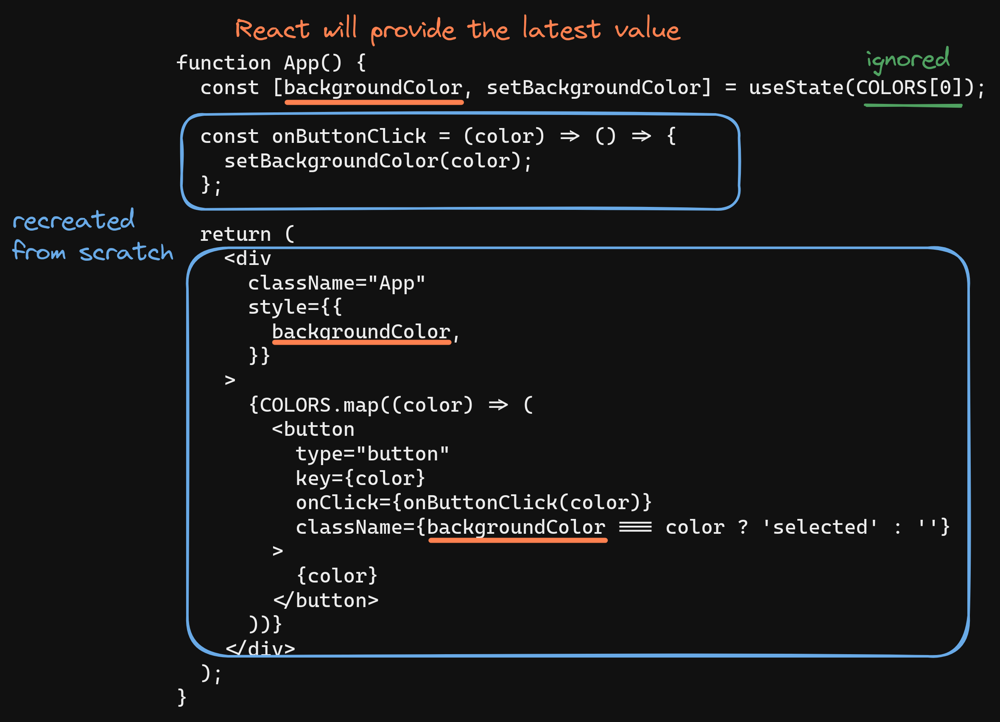

What we covered in this section is just a brief overview of a portion of React internals. You may be curious to learn more, but be advised, this is a deep rabbit hole. What we covered above is enough to get you through the React course.

<br>

## Hooks

Hooks are functions that let you use React features. All hooks are recognizable by the `use` prefix. For example, `useState` is a hook. We'll use more of these as we get further into the course. For now, remember that hooks have rules that we need to abide by:

1. Hooks can only be called from the top level of a functional component.

2. Hooks can't be called from inside loops or conditions.

<br>

## Knowledge check

- **What is state?**

In React, state is a component's memory.

<br>

- **What is the `useState` hook and how would you use it?**

The `useState` hook is a built-in hook in React that allows you to define state in a functional component. It takes an initial value as a parameter and returns an array with two elements that we can destructure to get:

1. The current state value

2. A function to update the state value

<br>

- **What happens to a component when one of its states is changed?**

The component is destroyed and recreated from scratch. The entire component is recreated but this time the latest state value will be returned from `useState`. This process is called rerendering. Rerendering is a key feature of React that enables it to efficiently update the user interface in response to changes in the underlying data.

<br>

- **What are some of the rules of hooks?**

1. Hooks can only be called from the top level of a functional component.

2. Hooks can't be called from inside loops or conditions.

<hr>
<br>
<br>

# [What is State in Programming](https://www.theodinproject.com/lessons/node-path-react-new-introduction-to-state)

'State' is a term which you encounter a lot as a developer. **But what is 'State'?** It's neither a difficult concept, nor a React-specific one as it turns out!

## What is State?

To understand what "state" is in programming, let's understand what the word "state" actually means, outside of programming.

If I'm drinking coffee, my current state is that I'm drinking coffee.

We could also narrow that down: I might be moving my coffee mug to my mouth, so my state is that I'm holding the coffee mug and that I'm lifting it up to my mouth. My state also is that my mouth is opened.

So "state" is not just one thing.

As a person, you are constantly in a lot of different states depending on how you look at it.

If you split it up (as above), you can assign states to your different body parts (e.g. "mouth is opened") or look at your overall state ("drinking coffee").

And in programming, it's **basically the same!**

In a web application, the overall state might be, htat a modal overlay is displayed, asking the visitor for input (e.g. an authentication overlay).

That's the state of the web application!

Of course, we could also split that into smaller parts: The state of the modal, is that it's opened. The state of the form in the modal is that it's empty. And so on.

With that in mind, React code like this should make a lot of sense:

```js
import { useState } from 'react'

function Dashboard() {
	const [authModalIsOpen, setAuthModalIsOpen] = useState(false)

	// ... more functionality ...

	return authModalIsOpen ? <AuthModal /> : <MainPage />
}
```

You don't need to know React - no worries!

And "state" of course also is **not exclusie to React**. As described above: it's a universal concept, not even exclusive to programming!

No matter if you work in web development, frontend or backend, with JavaScript, with a framework like React, Angular or Vue or without one, you will be working with state!

<br>

## But what is "state" in programming specifically?

As described above, "state" is really just that: the state (i.e., "current snapshot") of your program or of a part of it, depending on how you look at it.

It's the combination of all those individual states (like "modal is open" and "user is not authenticated", for example) that makes up the overall program state.

And therefore, we can also translate "state" with "data" -- "data that controls what the program is doing."

In the above code snippet, we're managing some state data in a React component.

`authModalIsOpen` in the end is basically just a variable which can be `true` or `false`. It's just data!

We register it as "state" for React by using `useState()`.

This kicks off some internal functionality in React which basically tells React that the components (i.e., a certain part of the UI) should be re-evaluated and possibly updated, if that data changes (which we might do in some function that's fired when the user clicks a button).

That's why "state" is just "data", "data which controls how the program is behaving" or "data which has an effect on the result and output of a program."

<br>

## That's Not Very Scientific!

True, but hopefully, it's understandable.

Because there's no reason to make this concept unnecessarily complex.

<hr>
<br>
<br>

# [State: A Component's Memory](https://react.dev/learn/state-a-components-memory)

Components often need to change what's on the screen as a result of an interaction. Typing into the form should update the input field, clicking "next" on an image carousel should change which image is displayed, clicking "buy" should put a product in the shopping cart. Components need to "remember" things: the current input value, the current image, the shopping cart. In React, this kind of component-specific memory is called _state_.

## You will learn

- How to add a state variable with the `useState` hook

- What pair of values the `useState` Hook returns

- How to add more than one state variable

- Why state is called local

<br>

## When a regular variable isn't enough

Here's a component that renders a sculpture image. Clicking the "Next" button should show the next sculpture by changing the `index` to `1`, then `2`, and so on. However, this **won't work** (you can try it):

```js
import { sculptureList } from './data.js'

export default function Gallery() {
  let index = 0

  function handleClick() {
    index = index + 1
  }

  let sculpture = sculptureList[index]

  return (
    <>
      <button onClick={handleClick}>
        Next
      </button>
      <h2>
        <i>{sculpture.name}</i>
        by {sculpture.artist}
      </h2>
      <h3>
        {{index + 1}} or {sculptureList.length}
      </h3>
      
      <p>{sculpture.description}</p>
    </>
  )
}
```


The `handleClick` event handler is updating a local variable, `index`. But two things prevent that change from being visible:

1. **Local variables don't persist between renders.** When React renders this component a second time, it renders it from scratch -- it doesn't consider any changes to the local variables.

2. **Changes to local variables won't trigger renders.** React doesn't realize it needs to render the component again with the new data.

To update a component with new data, two things need to happen:

1. **Retain** the data between renders.

2. **Trigger** React to render the component with new data (re-rendering).

The `useState` Hook provide those two things:

1. A **state variable** to retain the data between renders.

2. A **state setter function** to update the variable and trigger React to render the component again.

<br>

## Adding a state variable

To add a state variable, import `useState` from React at the top of the file:

```js
import { useState } from 'react'
```

Then, replace this line:

```js
let index = 0
```

with

```js
const [index, setIndex] = useState(0)
```

`index` is a state variable and `setIndex` is the setter function.

> The `[` and `]` syntax here is called array destructuring and it lets you read values from an array. The array returned by `useState` always has exactly two items.

This is how they work together in `handleClick`:

```js
function handleClick() {
	setIndex(index + 1)
}
```

Now clicking the "Next" button switches the current sculpture:

```js
import { useState } from 'react'
import { sculptureList } from './data.js'

export default function Gallery() {
	const [index, setIndex] = useState(0)

	function handleClick() {
		setIndex(index + 1)
	}

	let sculpture = sculptureList[index]
	return (
		<>
			<button onClick={handleClick}>Next</button>
			<h2>
				<i>{sculpture.name} </i>
				by {sculpture.artist}
			</h2>
			<h3>
				({index + 1} of {sculptureList.length})
			</h3>
			
			<p>{sculpture.description}</p>
		</>
	)
}
```

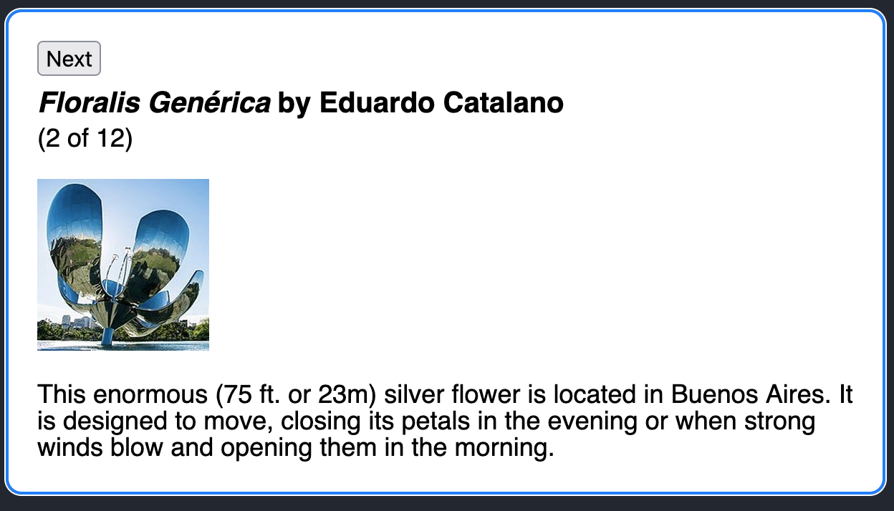

<br>

## Meet your first Hook

In React, `useState`, as well as any other function starting with "`use`", is called a Hook.

_Hooks_ are special functions that are only available while React is rendering (which we'll get into in more detail on the next page). They let you "hook into" different React features.

State is just one of those features, but you will meet the other Hooks later.

> **Pitfall**
>
> **Hooks--functions starting with `use`-- can only be called at the top level of your components or [your own Hooks](https://react.dev/learn/reusing-logic-with-custom-hooks).** You can't call Hooks inside conditions, loops, or other nested functions. Hooks are functions, but it's helpful to think of them as unconditional declarations about your component's needs. You "use" React features at the top of your component similar to how you "import" modules at the top of your file.

<br>

## Anatomy of `useState`

When you call `useState`, you are telling React that you want this component to remember something:

```js
const [index, setIndex] = useState(0)
```

In this case, you want React to remember `index`.

> **Note**
>
> The convention is to name this pair like `const [something, setSomething]`. You could name it anything you like, but conventions make things easier to understand across projects.

The only argument to `useState` is the **initial value** of your state variable. In this example, the `index`'s initial value is set to `0` with `useState(0)`.

Every time your component renders, `useState` gives you an array containing two values:

1. The **state variable** (`index`) with the value you stored.

2. The **state setter function** (`setIndex`) which can update the state variable and trigger React to render the component again.

Here's how that happens in action:

```js
const [index, setIndex] = useState(0)
```

1. **Your component renders the first time.** Because you passed `0` to `useState` as the initial value for `index`, it will render `[0, setIndex]`. React remembers `0` is the latest state value.

2. **You update the state.** When a user clicks the button, it calls `setIndex(index + 1)`. `index` is `0`, so it's `setIndex(1)`. This tells React to remember `index` is `1` now and triggers another render.

3. **Your component's second render.** React still sees `useState(0)`, but because React _remembers_ that you set `index` to `1`, it returns `[1, setIndex]` instead.

4. And so on!

<br>

## Giving a component multiple state variables

You can have as many state variables of as many types as you like in one component. This component has two state variables, a number `index` and a boolean `showMore` that's toggled when you click "Show details":

```js
import { useState } from 'react'
import { sculptureList } from './data.js'

export default function Gallery() {
	const [index, setIndex] = useState(0)
	const [showMore, setShowMore] = useState(false)

	function handleNextClick() {
		setIndex(index + 1)
	}

	function handleMoreClick() {
		setShowMore(!showMore)
	}

	let sculpture = sculptureList[index]
	return (
		<>
			<button onClick={handleNextClick}>Next</button>
			<h2>
				<i>{sculpture.name}</i> by {sculpture.artist}
			</h2>
			<h3>
				({index + 1} of {sculptureList.length})
			</h3>
			<button onClick={handleMoreClick}>
				{showMore ? 'Hide' : 'Show'} details
			</button>
			{showMore && <p>{sculpture.description}</p>}
			
		</>
	)
}
```

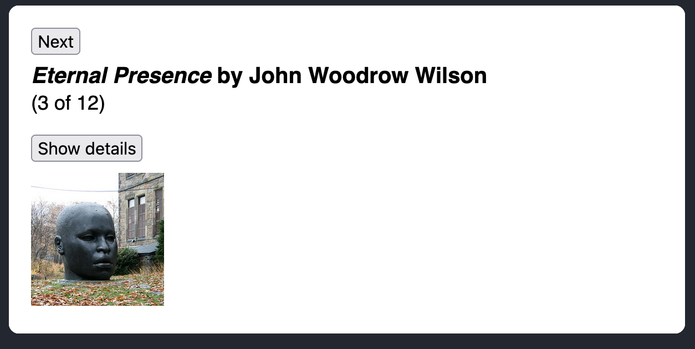

It is a good idea to have multiple state variables if their state is unrelated, like `index` and `showMore` in this example. But if you find that you often change two state variables together, it might be easier to combine them into one. For example, if you have a form with many fields, it's more convenient to have a single state variable that holds an object than state variable per field. Read [Choosing the State Structure](https://react.dev/learn/choosing-the-state-structure) for more tips.

> **How does React know which state to return?**
>
> You might have noticed that the `useState` call does not receive any information about _which_ state variable it refers to. There is no "identifier" that is passed to `useState`, so how does it know which of the state variables to return? Does it rely on some magic like parsing your functions? The answer is no.
>
> Instead, to enable their concise syntax, Hooks **rely on a stable call order on every render of the same component.** This works well in practice because if you follow the rule above ("only call Hooks at the top level"), Hooks will always be called in the same order. Additionally, a [linter plugin](https://www.npmjs.com/package/eslint-plugin-react-hooks) catches most mistakes.
>
> Internally, React holds an array of state pairs for every component. It also maintains the current pair index, which is set to `0` before rendering. Each time you call `useState`, React gives you the next state pair and increments the index. You can read more about this mechanism in [React Hooks: Not Magic, Just Arrays.](https://medium.com/@ryardley/react-hooks-not-magic-just-arrays-cd4f1857236e)
>
> This example **doesn't use React** but it gives you an idea of how `useState` works internally:
>
> ```js
> let componentHooks = []
> let currentHookIndex = 0
>
> // How useState works inside React (simplified)
> function useState(initialState) {
> 	let pair = componentHooks[currentHookIndex]
> 	if (pair) {
> 		// This is not the first render,
> 		// so the state pair already exists.
> 		// Return it and prepare for next Hook call
> 		currentHookIndex++
> 		return pair
> 	}
>
> 	// This is the first time we're rendering
> 	// so create a state pair and store it
> 	pair = [initialState, setState]
>
> 	function setState(nextState) {
> 		// When the user requests a state change
> 		// put the new value into the pair
> 		pair[0] = nextState
> 		updateDOM()
> 	}
>
> 	// Store the pair for future renders
> 	// and prepare for the next Hook call
> 	componentHooks[currentHookIndex] = pair
> 	currentHookIndex++
> 	return pair
> }
>
> function Gallery() {
> 	// Each useState() call will get the next pair
> 	const [index, setIndex] = useState(0)
> 	const [showMore, setShowMore] = useState(false)
>
> 	function handleNextClick() {
> 		setIndex(index + 1)
> 	}
>
> 	function handleMoreClick() {
> 		setShowMore(!showMore)
> 	}
>
> 	let sculpture = sculptureList[index]
> 	// This example doesn't use React, so return
> 	// an output object instead of JSX
> 	return {
> 		onNextClick: handleNextClick,
> 		onMoreClick: handleMoreClick,
> 		header: `${sculpture.name} by ${sculpture.artist}`,
> 		counter: `${index + 1} of ${sculptureList.length}`,
> 		more: `${showMore ? 'Hide' : 'Show'} details`,
> 		description: showMore ? sculpture.description : null,
> 		imageSrc: sculpture.url,
> 		imageAlt: sculpture.alt,
> 	}
> }
>
> function updateDOM() {
> 	// Reset the current Hook index
> 	// before rendering the component.
> 	currentHookIndex = 0
> 	let output = Gallery()
>
> 	// Update the DOM to match the output
> 	// This is the part React does for you
> 	nextButton.onclick = output.onNextClick
> 	header.textContent = output.header
> 	moreButton.onclick = output.onMoreClick
> 	image.src = output.imageSrc
> 	image.alt = ouptut.imageAlt
> 	if (output.description !== null) {
> 		description.textContent = output.description
> 		description.style.display = ''
> 	} else {
> 		description.style.display = 'none'
> 	}
> }
>
> let nextButton = document.getElementById('nextButton')
> let header = document.getElementById('header')
> let moreButton = document.getElementById('moreButton')
> let description = document.getElementById('description')
> let image = document.getElementById('image')
> let sculptureList = [
> 	{
> 		name: 'Homenaje a la Neurocirugía',
> 		artist: 'Marta Colvin Andrade',
> 		description:
> 			'Although Colvin is predominantly known for abstract themes that allude to pre-Hispanic symbols, this gigantic sculpture, an homage to neurosurgery, is one of her most recognizable public art pieces.',
> 		url: 'https://i.imgur.com/Mx7dA2Y.jpg',
> 		alt: 'A bronze statue of two crossed hands delicately holding a human brain in their fingertips.',
> 	},
> 	{
> 		name: 'Floralis Genérica',
> 		artist: 'Eduardo Catalano',
> 		description:
> 			'This enormous (75 ft. or 23m) silver flower is located in Buenos Aires. It is designed to move, closing its petals in the evening or when strong winds blow and opening them in the morning.',
> 		url: 'https://i.imgur.com/ZF6s192m.jpg',
> 		alt: 'A gigantic metallic flower sculpture with reflective mirror-like petals and strong stamens.',
> 	},
> 	{
> 		name: 'Eternal Presence',
> 		artist: 'John Woodrow Wilson',
> 		description:
> 			'Wilson was known for his preoccupation with equality, social justice, as well as the essential and spiritual qualities of humankind. This massive (7ft. or 2,13m) bronze represents what he described as "a symbolic Black presence infused with a sense of universal humanity."',
> 		url: 'https://i.imgur.com/aTtVpES.jpg',
> 		alt: 'The sculpture depicting a human head seems ever-present and solemn. It radiates calm and serenity.',
> 	},
> 	{
> 		name: 'Moai',
> 		artist: 'Unknown Artist',
> 		description:
> 			'Located on the Easter Island, there are 1,000 moai, or extant monumental statues, created by the early Rapa Nui people, which some believe represented deified ancestors.',
> 		url: 'https://i.imgur.com/RCwLEoQm.jpg',
> 		alt: 'Three monumental stone busts with the heads that are disproportionately large with somber faces.',
> 	},
> 	{
> 		name: 'Blue Nana',
> 		artist: 'Niki de Saint Phalle',
> 		description:
> 			'The Nanas are triumphant creatures, symbols of femininity and maternity. Initially, Saint Phalle used fabric and found objects for the Nanas, and later on introduced polyester to achieve a more vibrant effect.',
> 		url: 'https://i.imgur.com/Sd1AgUOm.jpg',
> 		alt: 'A large mosaic sculpture of a whimsical dancing female figure in a colorful costume emanating joy.',
> 	},
> 	{
> 		name: 'Ultimate Form',
> 		artist: 'Barbara Hepworth',
> 		description:
> 			'This abstract bronze sculpture is a part of The Family of Man series located at Yorkshire Sculpture Park. Hepworth chose not to create literal representations of the world but developed abstract forms inspired by people and landscapes.',
> 		url: 'https://i.imgur.com/2heNQDcm.jpg',
> 		alt: 'A tall sculpture made of three elements stacked on each other reminding of a human figure.',
> 	},
> 	{
> 		name: 'Cavaliere',
> 		artist: 'Lamidi Olonade Fakeye',
> 		description:
> 			"Descended from four generations of woodcarvers, Fakeye's work blended traditional and contemporary Yoruba themes.",
> 		url: 'https://i.imgur.com/wIdGuZwm.png',
> 		alt: 'An intricate wood sculpture of a warrior with a focused face on a horse adorned with patterns.',
> 	},
> 	{
> 		name: 'Big Bellies',
> 		artist: 'Alina Szapocznikow',
> 		description:
> 			'Szapocznikow is known for her sculptures of the fragmented body as a metaphor for the fragility and impermanence of youth and beauty. This sculpture depicts two very realistic large bellies stacked on top of each other, each around five feet (1,5m) tall.',
> 		url: 'https://i.imgur.com/AlHTAdDm.jpg',
> 		alt: 'The sculpture reminds a cascade of folds, quite different from bellies in classical sculptures.',
> 	},
> 	{
> 		name: 'Terracotta Army',
> 		artist: 'Unknown Artist',
> 		description:
> 			'The Terracotta Army is a collection of terracotta sculptures depicting the armies of Qin Shi Huang, the first Emperor of China. The army consisted of more than 8,000 soldiers, 130 chariots with 520 horses, and 150 cavalry horses.',
> 		url: 'https://i.imgur.com/HMFmH6m.jpg',
> 		alt: '12 terracotta sculptures of solemn warriors, each with a unique facial expression and armor.',
> 	},
> 	{
> 		name: 'Lunar Landscape',
> 		artist: 'Louise Nevelson',
> 		description:
> 			'Nevelson was known for scavenging objects from New York City debris, which she would later assemble into monumental constructions. In this one, she used disparate parts like a bedpost, juggling pin, and seat fragment, nailing and gluing them into boxes that reflect the influence of Cubism’s geometric abstraction of space and form.',
> 		url: 'https://i.imgur.com/rN7hY6om.jpg',
> 		alt: 'A black matte sculpture where the individual elements are initially indistinguishable.',
> 	},
> 	{
> 		name: 'Aureole',
> 		artist: 'Ranjani Shettar',
> 		description:
> 			'Shettar merges the traditional and the modern, the natural and the industrial. Her art focuses on the relationship between man and nature. Her work was described as compelling both abstractly and figuratively, gravity defying, and a "fine synthesis of unlikely materials."',
> 		url: 'https://i.imgur.com/okTpbHhm.jpg',
> 		alt: 'A pale wire-like sculpture mounted on concrete wall and descending on the floor. It appears light.',
> 	},
> 	{
> 		name: 'Hippos',
> 		artist: 'Taipei Zoo',
> 		description:
> 			'The Taipei Zoo commissioned a Hippo Square featuring submerged hippos at play.',
> 		url: 'https://i.imgur.com/6o5Vuyu.jpg',
> 		alt: 'A group of bronze hippo sculptures emerging from the sett sidewalk as if they were swimming.',
> 	},
> ]
>
> // Make the UI match the initial state
> updateDOM()
> ```
>
> 
>
> You don't have to understand it to use React, but you might find this a helpful mental model.

<br>

## State is isolated and private

State is local to a component instance on the screen. In other words, **if you render the same component twice, each copy will have completely isolated state!** Changing one of them will not affect the other.

In this example, the `Gallery` component from earlier is rendered twice with no changes to its logic. Try clicking the buttons inside each of the galleries. Notice that their state is independent:

```js
import Gallery from './Gallery.js'

export default function Page() {
	return (
		<div className='Page'>
			<Gallery />
			<Gallery />
		</div>
	)
}
```


This is what makes state different from regular variables that you might declare at the top of your module. State is not tied to a particular function call or a place in the code, but it's "local" to the specified place on the screen. You rendered two `<Gallery />` components, so their state is store separately.

Also notice how the `Page` component doesn't "know" anything about the `Gallery` state or even whether it has any. Unlike props, **state is fully private to the component declaring it.** The parent component can't change it. This lets you add state to any component or remove it without impacting the rest of the components.

What if you wanted both galleries to keep their states in sync? The right way to do it in React is to _remove_ state from child components and add it to their closest shared parent. The next few pages will focus on organizing state of a single component, but we will return to this topic in [Sharing State Between Components.](https://react.dev/learn/sharing-state-between-components)

<br>

## Recap

- Use a state variable when a component needs to "remember" some information between renders.

- State variables are declared by calling the `useState` Hook.

- Hooks are special functions that start with `use`. They let you "hook into" React features like state.

- Hooks might remind you of imports: they need to be called unconditionally. Calling Hooks, including `useState`, is only valid at the top level of a component or another Hook.

- The `useState` Hook returns a pair of values: the current state and the function to update it.

- You can have more than one state variable. Internally, React matches them up by their order.

- State is private to the component. If you render it in two places, each copy gets its own state.

<hr>
<br>
<br>

# [Render and Commit](https://react.dev/learn/render-and-commit)

Before your components are displayed on screen, they must be rendered by React. Understanding the steps in this process will help you think about how your code executes and explain its behavior.

<br>

## You will learn

- What rendering means in React

- When and why React renders a component

- The steps involved in displaying a component on screen

- Why rendering does not always produce a DOM update

<br>

Imagine that your components are cooks in the kitchen, assembling tasty dishes from ingredients. In this scenario, React is the waiter who puts in requests from customers and brings them their orders. This process of requesting and serving UI has three steps:

1. **Triggering** a render (delivering the guest's order to the kitchen)

2. **Rendering** the component (preparing the order in the kitchen)

3. **Committing** to the DOM (placing the order on the table)

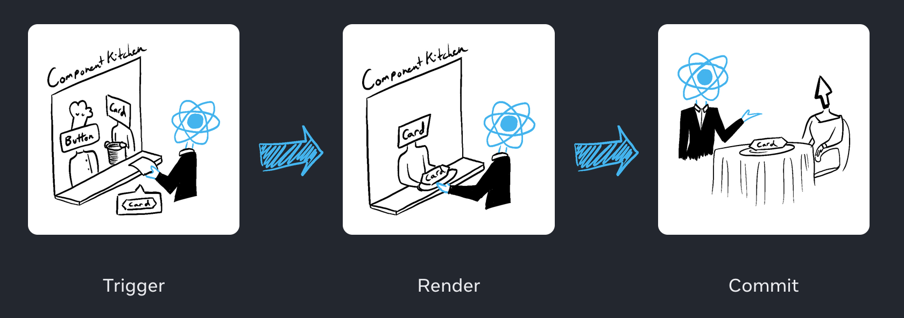

<br>

## Step 1: Trigger a render

There are two reasons for a component to render:

1. It's the component's **initial render**.

2. The component's (or one of its ancestors') **state has been updated**.

### Initial render

When your app starts, you need to trigger the initial render. Frameworks and sandboxes sometimes hide this code, but it's done by calling `createRoot` with the target DOM node, and then calling its `render` method with your component:

```js
import Image from './Image.js'
import { createRoot } from 'react-dom/client'

const root = createRoot(document.getElementById('root'))
root.render(<Image />)
```


Try commenting out the `root.render()` call and see the component disappear!

### Re-renders when state updates

Once the component has been initially rendered, you can trigger further renders by updating its state with the `set` function. Updating your component's state automatically queues a render. (You can imagine these as a restaurant guest ordering tea, dessert, and all sorts of thigns after putting in their first order, depending on the state of their thirst or hunger).

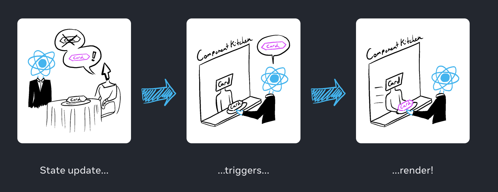

<br>

## Step 2: React renders your components

After you trigger a render, React calls your components to figure out what to display on screen. **"Rendering" is React calling your components.**

- **On initial render,** React will call the root component.

- **For subsequent renders,** React will call the function component whose state update triggered the render.

This process is recursive: if the updated component returns some other component, React will render _that_ component next, and if that component also returns something, it will render _that_ component next, and so on. The process will continue until there are no more nested components and React knows exactly what should be displayed on screen.

In the following example, React will call `Gallery()` and `Image()` several times:

```js Gallery.js
export default function Gallery() {
	return (
		<section>
			<h1>Inspiring Sculptures</h1>
			<Image />
			<Image />
			<Image />
		</section>
	)
}

function Image() {
	return (
		
	)
}
```

```js index.js
import Gallery from './Gallery.js'
import { createRoot } from 'react-dom/client'

const root = createRoot(document.getElementById('root'))
root.render(<Gallery />)
```


- **During the initial render,** React will create the DOM nodes for `<section>`, `<h1>`, and three `` tags.

- **During a re-render,** React will calculate which of their properties, if any, have changed since the previous render. It won't do anything with that information until the next step, the commit phase.

<br>

> **Pitfall**
>
> Rendering must always be a [pure calculation](https://react.dev/learn/keeping-components-pure):
>
> - **Same inputs, same output.** Given the same inputs, a component should always return the same JSX. (When someone orders a salad with tomatoes, they should not receive a salad with onions!)
>
> - **It minds its own business.** It should not change any objects or variables that existed before rendering. (One order should not change anyone else's order.)
>
> Otherwise, you can encounter confusing bugs and unpredictable behavior as your codebase grows in complexity. When developing in "Strict Mode", React calls each component's function twice, which can help surface mistakes caused by impure functions.

<br>

> **Optimizing performance**
>
> The default behavior of rendering all components nested within the updated component is not optimal for performance if the updated component is very high in the tree. If you run into a performance issue, there are several opt-in ways to solve it described in the [Performance](reactjs.org/docs/optimizing-performance.html) section. **Don't optimize prematurely!**

<br>

## Step 3: React commits changes to the DOM

After rendering (calling) your components, React will modify the DOM.

- **For the initial render,** React will use the `appendChild()` DOM API to put all the DOM nodes it has created on screen.

- **For re-renders,** React will apply the minimal necessary operations (calculated while rendering!) to make the DOM match the latest rendering input.

**React only changes the DOM nodes if there's a difference between renders.** For example, here is a component that re-renders with different props passed from its parent every second. Notice how you can add some text into the `<input>`, updating its `value`, but the text doesn't disappear when the component re-renders:

```js
export default function Clock({ time }) {
	return (
		<>
			<h1>{time}</h1>
			<input />
		</>
	)
}
```

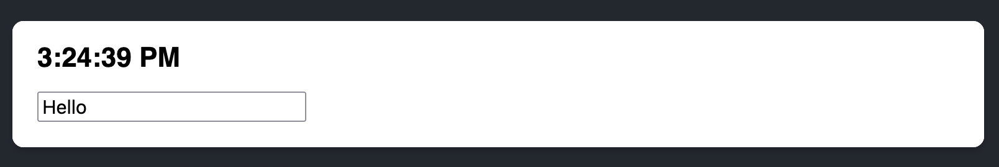

This works because during this last step, React only updates the content of `<h1>` with the new `time`. It sees that the `<input>` appears in the JSX in the same place as last time, so React doesn't touch the `<input>`-- or its `value`!

<br>

## Epilogue: Browser paint

After rendering is done and React updated the DOM, the browser will repaint the screen. Although this process is known as "browser rendering", we'll refer to it as "painting" to avoid confusion throughout the docs.

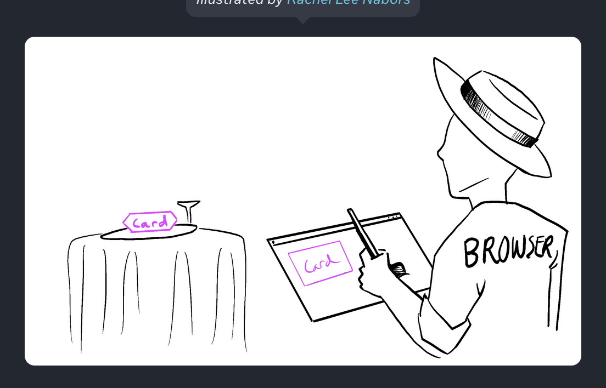

## Recap

- Any screen update in a React app happens in three steps:

1. Trigger

2. Render

3. Commit

- You can use Strict Mode to find mistakes in your components

- React does not touch the DOM if the rendering result is the same as last time

<hr>
<br>
<br>

# [React Reconcialiation Algorithm](reactjs.org/docs/optimizing-performance.html)

Reconciliation is the process by which React updates the UI to reflect changes in the component state. The reconciliation algorithm is the set of rules that React uses to determine how to update the UI in the most efficient way possible.

React uses a virtual DOM (Document Object Model) to update the UI. The virtual DOM is a lightweight in-memory representation of the real DOM, which allows React to make changes to the UI without manipulating the actual DOM. This makes updates faster, as changing the virtual DOM is less expensive than changing the real DOM.

The reconciliation algorithm works by comparing the current virtual DOM tree to the updated virtual DOM tree, and making the minimum number of changes necessary to bring the virtual DOM in line with the updated state.

The algorithm uses two main techniques to optimize the updates:

1. **Tree diffing:** React compares the current virtual DOM tree with the updated virtual DOM tree, and identifies the minimum number of changes necessary to bring the virtual DOM in line with the updated state.

2. **Batching:** React batches multiple changes into a single update, reducing the number of updates to the virtual DOM and, in turn, the real DOM.

The reconciliation algorithm is a critical part of React's performance and helps make React one of the fastest and most efficient JavaScript libraries for building user interfaces.

_After the reconciler compares the current and updated virtual DOM, it identifies the differences and makes the necessary changes to the virtual DOM to bring it in line with the updated state._

This updating of the virtual DOM is done for several reasons:

1. To keep the virtual DOM as an accurate representation of the current state of the components, so that it can be used in future updates.

2. To optimize updates to the real DOM. The virtual DOM provides a way for React to make changes to the UI without manipulating the real DOM directly. BY making changes to the virtual DOM, React can determine the most efficient way to update the real DOM and make only the minimum number of changes necessary.

3. To ensure that the UI remains in sync with the state of the components. The reconcilation process ensures that the virtual DOM accurately reflects the current state of the components so that the UI remain up-to-date and in line with the state of the application.

In summary, the reconciler updates the virtual DOM after the reconciliation process to keep it accurate, optimize updates to the real DOM, and ensure that the UI remains in sync with the state of the components.


<hr>
<br>
<br>

# [Keeping Components Pure](https://react.dev/learn/keeping-components-pure)

Some JavaScript functions are _pure_. Pure functions only perform a calculation and nothing more. By strictly only writing your components as pure functions, you can avoid an entire class of baffling bugs and unpredictable behavior as your codebase grows. To get these benefits, though, there are a few rules you must follow.

## You will learn

- What purity is and how it helps you avoid bugs

- How to keep components pure by keeping changes out of the render phase

- How to use Strict Mode to find mistakes in your components

<Br>

## Purity: Components as formulas

In computer science (and especially the world of functional programming), a pure function is a function with the following characteristics:

- **It minds its own business.** It does not change any objects or variables that existed before it was called.

- **Same inputs, same output.** Given the same inputs, a pure function should always return the same result.

You might already be familiar with one example of pure functions: formulas in math.

Consider this math formula: `y = 2x`.

If `x = 2` then `y = 4`. Always.

If `x = 3` then `y = 6`. Always.

If `x = 3`, `y` won't sometimes be `9` or `-1` or `2.5` depending on the time of day or the state of the stock market.

If `y = 2x` and `x = 3`, `y` will _always_ be `6`.

If we made this into a JavaScript function, it would look like this:

```js
function double(number) {
	return 2 * number
}
```

In the above example, `double` is a **pure function**. If you pass it `3`, it will return `6`. Always.

React is designed around this concept. **React assumes that every component you write is a pure function.** This means that React components you write must always return the same JSX given the same inputs:

```js
function Recipe({ drinkers }) {
	return (
		<ol>
			<li>Boil {drinkers} cups of water.</li>
			<li>
				Add {drinkers} spoons of tea and {0.5 * drinkers} spoons of spice.
			</li>
			<li>Add {0.5 * drinkers} cups of milk to boil and sugar to taste.</li>
		</ol>
	)
}

export default function App() {
	return (
		<section>
			<h1>Spiced Chai Recipe</h1>
			<h2>For two</h2>
			<Recipe drinkers={2} />
			<h2>For a gathering</h2>
			<Recipe drinkers={4} />
		</section>
	)
}
```

When you pass `drinkers={2}` to `Recipe`, it will return JSX containing `2 cups of water`. Always.

If you pass `drinkers={4}`, it will return JSX containing `4 cups of water`. Always.

Just like a math formula.

You could think of your components as recipes: if you follow them and don't introduce new ingredients during the cooking process, you will get the same dish every time. That "dish" is the JSX that the component serves to React to render.

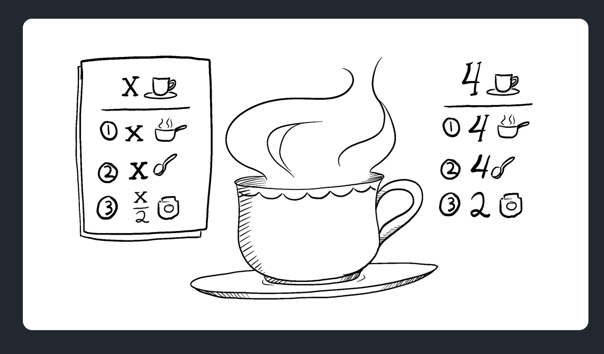

<br>

## Side Effects: (un)intended consequences

React's rendering process must always be pure. Components should only _return_ their JSX, and not _change_ any objects or variables that existed before rendering -- that would make them impure!

Here is a component that breaks this rule:

```js
let guest = 0

function Cup() {
	// Bad: changing a preexisting variable!
	guest = guest + 1
	return <h2>Tea cup for guest #{guest}</h2>
}

export default function TeaSet() {
	return (
		<>
			<Cup />
			<Cup />
			<Cup />
		</>
	)
}
```

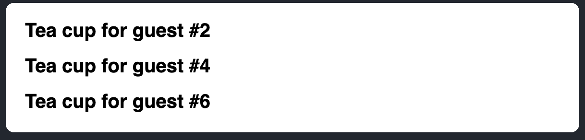

This component is reading and writing a `guest` variable declared outside of it. This means that **calling this component multiple times will produce different JSX!** And what's more, if _other_ components read `guest`, they will produce different JSX, too, depending on when they were rendered! That's not predictable.

Going back to our formula `y = 2x`, now even if `x = 2`, we cannot trust that `y = 4`. Our tests could fail, our users would be baffled, planes would fall out of the sky -- you can see how this would lead to confusing bugs.

You can fix this component by [passing `guest` as a prop instead](https://react.dev/learn/passing-props-to-a-component):

```js
function Cup({ guest }) {
  return <h2>Tea cup for guest #{guest}</h2>
}

export default function TeaSet() {
  return (
    <>
      <Cup guest={1}>
      <Cup guest={2}>
      <Cup guest={3}>
    </>
  )
}
```

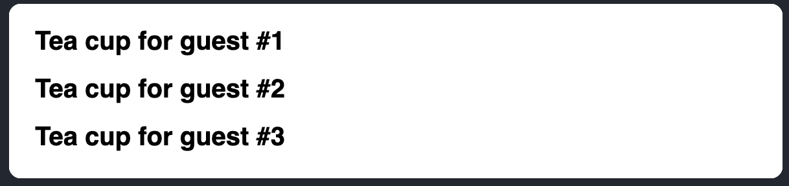

Now your component is pure, as the JSX it returns only depends on the `guest` prop.

In general, you should not expect your components to be rendered in any particular order. It doesn't matter if you call `y = 2x` before or after `y = 5x`: both formulas will resolve independently of each other. In the same way, each component should only "think for itself", and not attempt to coordinate with or depend upon others during rendering. Rendering is like a school exam: each component should calculate JSX on their own!

> **Detecting impure calculations with strictMode**
>
> Although you might not have used them all yet, in React there are three kinds of inputs that you can read while rendering: props, state, and context. You should always treat these inputs as read-only.
>
> When you want to _change_ something in response to user input, you should set state instead of writing to a variable. You should never change preexisting variables or objects while your component is rendering.
>
> React offers a "Strict Mode" in which it calls each component's function twice during development. **By calling the component functions twice, Strict Mode helps find components that break these rules.**
>
> Notice how the original example displayed "Guest #2", "Guest #4", and "Guest #6" instead of "Guest #1", "Guest #2", and "Guest #3". The original function was impure, so calling it twice broke it. But the fixed pure version works even if the function is called twice every time. **Pure functions only calculate, so calling them twice won't change anything** -- just like calling `double(2)` twice doesn't change what's returned, and solve `y = 2x` twice doesn't change what `y` is. Same inputs, same outputs. Always.
>
> Strict Mode has no effect in production, so it won't slow down the app for your users. To opt into Strict Mode, you can wrap your root component into `<React.StrictMode>`. Some frameworks do this by default.

<br>

## Local mutation: Your component's little secret

In the above example, the problem was that the component changed _preexisting_ variable while rendering. This is often called a "**mutation**" to make it sound a bit scarier. Pure functions don't mutate variables outside of the function's scope or objects that were created before the call -- that makes them impure!

However, **it's completely fine to change variables and objects that you've _just_ created while rendering.** In this example, you create an `[]` array, assign it to a `cups` variable, and then `push` a dozen cups into it.

```js
function Cup({ guest }) {
	return <h2>Tea cup for guest #{guest}</h2>
}

export default function TeaGathering() {
	const cups = []
	for (let i = 1; i <= 12; i++) {
		cups.push(<Cup key={i} guest={i} />)
	}
	return cups
}
```

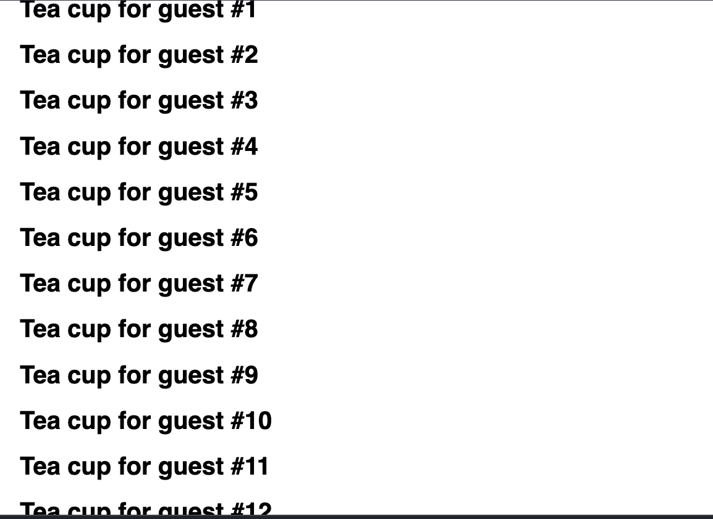

If the `cups` variable or the `[]` array were created outside the `TeaGathering` function, this would be a huge problem! You would be changing a _preexisting_ object by pushing items into that array.

However, it's fine because you've created them _during the same render_, inside `TeaGathering`. No code outside of `TeaGathering` will ever know that this happened. This is called **"local mutation"** -- it's like your component's little secret.

<br>

## Where you _can_ cause side effects

While functional programming relies heavilty on purity, at some point, somewhere, _something_ has to change. That's kind of the point of programming! These changes -- updating the screen, starting an animation, changing the data -- are called **side effects**. They're things that happen _"on the side"_, not during render.

In React, **side effects usually belong inside event handlers.** Event handlers are functiopns that React runs when you perform some action -- for example, when you click a button. Even though event handlers are defined _inside_ your component, they don't run _during_ rendering! **So event handlers don't need to be pure.**

If you've exhausted all other options and can't find the right event handler for your side effect, you can still attach it to your returned JSX with a `useEffect` call in your component. This tells React to execute it later, after rendering, when side effects are allows. **However, this approach should be your last resort.**

When possible, try to express your logic with rendering alone. You'll be surprised how far this can take you!

<br>

> **Why does React care about purity?**
>
> Writing pure functions takes some habit and discipline. But it also unlocks marvelous opportunities:
>
> - Your components could run in a different environment -- for example, on the server! Since they return the same result for the same inputs, one component can serve many user requests.
>
> - You can improve performance by skipping rendering components whose inputs have not changed. This is safe because pure functions always return the same results, so they are safe to cache.
>
> - If some data changes in the middle of rendering a deep component tree, React can restart rendering without wasting time to finish the outdated render. Purity makes it safe to stop calculating at any time.
>
> Every new React feature we're building takes advantage of purity. From data fetching to animations to performance, keeping components pure unlocks the power of the React paradigm.

<br>

## Recap

- A component must be pure, meaning:

  - **It minds its own business**. It should not change any objects or variables that existed before rendering.

  - **Same inputs, same output.** Given the same inputs, a component should always return the same JSX.

- Rendering can happen at any time, so components should not depend on each other's rendering sequence.

- You should not mutate any of the inputs that your components use for rendering. That includes props, state, and context. To update the screen, "set" state instead of mutating preexisting objects.

- Strive to express your component's logic in the JSX you return. When you need to "change things", you'll usually want to do it in an event handler. As a last resort, you can use `useEffect`.

- Writing pure functions takes a bit of practice, but it unlocks the power of React's paradigm.
