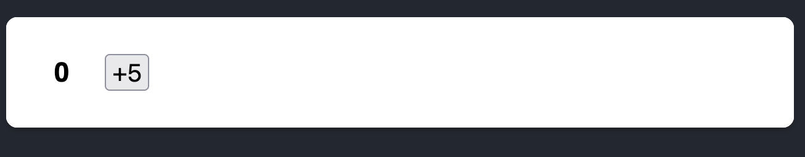
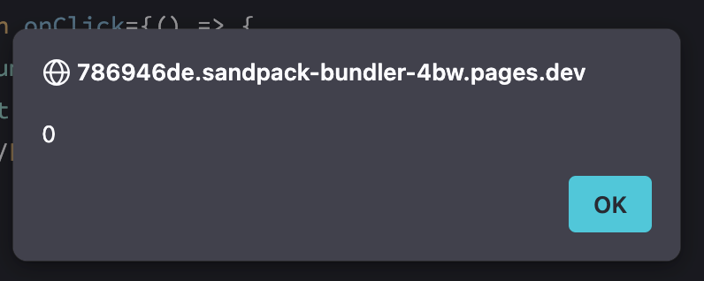
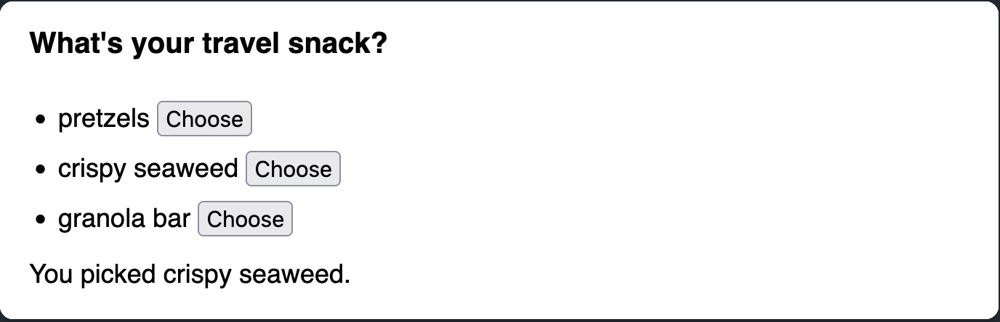
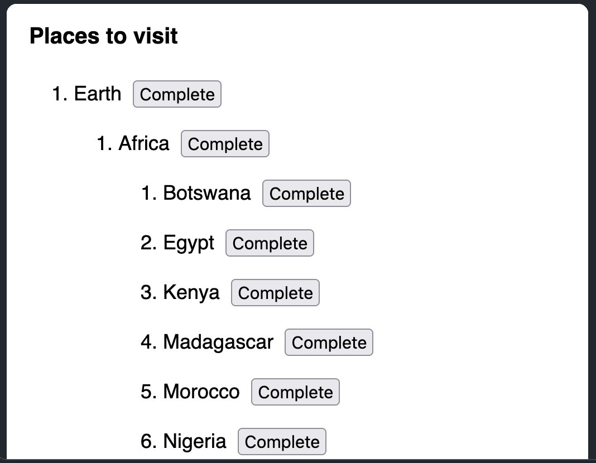
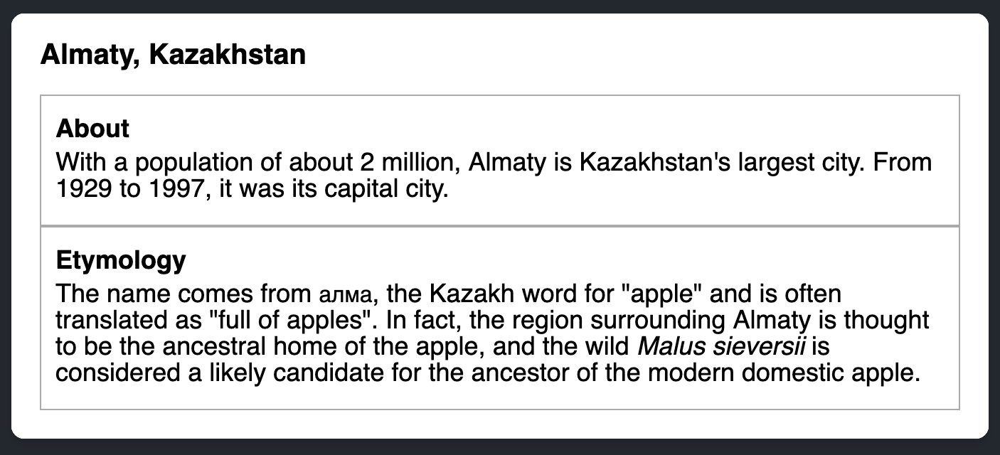

# [More On State](https://www.theodinproject.com/lessons/node-path-react-new-more-on-state)

## Introduction

This lesson will build upon the previous lesson on state and introduce further concepts and techniques to manage state. Let's dive in.

<br>

## Lesson overview

This section contains a general overview of topics that you will learn in this lesson.

- How to structure state.

- How state updates.

- Learn about controlled components.

<br>

## How to structure state

Managing and structuring state effectively is by far one of the most crucial parts of building your application. If not done correctly, it can become a source of bugs and headaches.

The assignment items go through the topic thoroughly, but as a general rule of thumb: don't put values in state that can be calculated using existing values, state, and/or props.

<br>

### State should not be mutated

Mutating state is a no-go area in React as it leads to unpredictable results. Primitives are already immutable, but if you are using reference-type values, i.e. arrays and objects, never mutate them. According to the React documentation, we should treat state as if it was _immutable_. To change state, we should always use the `setState` function, which in case of the example below is the `setPerson` function.

```js
function Person() {
  const [person, setPerson] = useState({ name: 'John', age: 100 })

  // BAD - Don't do this!
  const handleIncreaseAge = () => {
    // mutating the current state object
    person.age = person.age + 1
    setPerson(person)
  }
  // GOOD - Do this!
  const handleIncreaseAge() = () => {
    // copy the existing person object into a new object
    // while updating the age property
    const newPerson = {...person, age: person.age + 1 }
    setPerson(newPerson)
  }

  return (
    <>
      <h1>{person.name}</h1>
      <h2>{person.age}</h2>
      <button onClick={handleIncreaseAge}>Increase Age</button>
    </>
  )
}
```

> **Object and arrays in state**
>
> In the above example, notice how we _create_ a new object and then copy the existing state values into the new object while providing a new value for `age`. That is because if we don't provide a new object to `setState` it is not guaranteed to re-render the page. Therefore, we should always provide a new Object for `setState` to trigger a re-render. `setState` uses `Object.is()` to determine if the previous state is the same.
>
> As for nested objects and arrays, state can get tricky fast since you will have to copy the nested items as well. Be careful when using them.

<br>

## How state updates

State updates are asynchronous. What this implies is that whenever you call the `setState` function, React will apply the update in the **next** component render. This concept can take a while to wrap your head around. With a lot of practice, you'll get the hang of it in no time.

Remember, state variables aren't reactive; the component is. This can be understood by the fact that calling `setState` re-renders the entire component instead of just changing the state variable on the fly.

```js
function Person() {
	const [person, setPerson] = useState({ name: 'John', age: 100 })

	const handleIncreaseAge = () => {
		console.log('in handleIncreaseAge (before setPerson call): ', person)
		setPerson({ ...person, age: person.age + 1 })
		// we've called setPerson, surely person has updated?
		console.log('in handleIncreaseAge (after setPerson call): ', person)
	}

	// this console.log runs every time the component renders
	// what do you think this will print?
	console.log('during render: ', person)

	return (
		<>
			<h1>{person.name}</h1>
			<h2>{person.age}</h2>
			<button onClick={handleIncreaseAge}>Increase age</button>
		</>
	)
}
```

These are the logs:


Uh-oh, what is happening? Let's break it down (ignore the double `console.log`s for the render case; this is covered in the upcoming lessons).

1. The component renders for the first time. The `person` state variable initialized to `{ name: 'John', age: 100 }`. The "during render" `console.log` prints the state variable.

2. The button is clicked invoking `handleIncreaseAge`. Interestingly, the `console.log` before and after the `setPerson` call prints the same value.

3. The component re-renders. The `person` state variable is updated to `{ name: 'John', age: 101 }`.

The `person` state stays the same throughout the current render of the component. This is what "state as a snapshot" refers to. The `setState` call triggers a component re-render, and the `person` state is updated to the new value.

> **The unexpected infinite loop**
>
> The following is an infinite loop; can you guess why?
>
> ```js
> function Component() {
> 	const [count, setCount] = useState(0)
>
> 	setCount(count + 1)
>
> 	return <h1>{count}</h1>
> }
> ```

<br>

### State updater functions

A trick question. Let's look at another implementation of `handleIncreaseAge`; what do you think it does?

```js
const handleIncreaseAge = () => {
	setPerson({ ...person, age: person.age + 1 })
	setPerson({ ...person, age: person.age + 1 })
}
```

Surely, it will increase the age by 2? Nope. The above code is saying to React:

> _"Hey, replace the current render's `person` with an increase in age by 1. Then, replace the current render's `person` with an increase in age by 1."_

Notice the word "replace." When you pass in the value to the `setState` function, React will replace the current state with the value you passed in. You might be wondering, what if I want to update the state multiple times using the latest state? This is where the state updater function comes in.

```js
const handleIncreaseAge = () => {
	setPerson((prevPerson) => ({ ...prevPerson, age: prevPerson.age + 1 }))
	setPerson((prevPerson) => ({ ...prevPerson, age: prevPerson.age + 1 }))
}
```

When a callback is passed to the `setState` function, it ensures that the latest state is passed in as an argument to the callback.

Using an updater is not always necessary. If you want to change the state using your previous state and you prefer consistency over verbosity, then you might consider using an updater.

> **React batches state updates**
>
> There are two `setPerson` calls in the above example, and from what we've learned so far, a `setState` call triggers a component re-render. So, the component should re-render twice, right? You would say yes, but React is smart. Wherever possible, React batches the state updates. Here, the component only re-renders once. We'd encourage you to use `console.log` to verify this.

<br>

## Controlled components

There are native HTML elements that maintain their own internal state. The `input` element is a great example. You type into an `input` and it updates its own value on every keystroke. For many use-cases, you would like to _control_ the value of the `input` element, i.e., set its value yourself. This is where controlled components come in.

```js
function CustomInput() {
	const [value, setValue] = useState('')

	return (
		<input
			type='text'
			value={value}
			onChange={(event) => setValue(event.target.value)}
		/>
	)
}
```

Instead of letting the `input` maintain its own state, we define our own stat using the `useState` hook. We then set the `value` prop of the `input` to the state variable and update the state variable on every `onChange` event. Now, every time the user types something in the input, React will ensure you have the latest comment, review, or post (whatever the user was typing) in `value`.

This pattern is extremely useful wherever you need user input, i.e., typing in a textbox, toggling a checkbox, etc. Contrarily, yes, the `input` element can be left uncontrolled and access its value through some other method. You don't need to worry about it yet, as it will be covered later on in the course. For now, control your components!

<br>

## Knowledge check

- **What should you keep in mind while declaring state?**

Don't put values in state that can be calculated using existing values, state, and/or props.

<br>

- **Why should we always use `setState` to update our state?**

Because mutating state leads to unpredictable results. According to the React documentation, we should treat state as if it was _immutable_.

<br>

- **What does "state as a snapshot" mean?**

Rendering means that React is calling your component, which is a function. The JSX you return from that function is like a snapshot of the UI in time. Its props, event handlers, and local variables were all calculated using its state at the time of the render.

Unlike a photograph or a movie frame, the UI "snapshot" you return is interactive. It includes logic like event handlers that specify what happens in response to inputs. React updates the screen to match this snapshot and connects the event handlers. As a result, pressing a button will trigger the click handler from your JSX.

<br>

- **What's the difference between passing a value vs a callback to the `setState` function?**

When you pass in a value to the `setState` function, React will replace the current state with the value you passed in.

If you want to update the state multiple times using the latest state, you will have to use a state updater function. This is just a callback that is passed to the `setState` function. It ensures that the latest state is passed in as an argument to the callback.

<br>

- **Why should we always provide a new Object to `setState`?**

That is because if we don't provide a new object to `setState` it is not guaranteed to re-render the page.

<br>

- **Why would you want to control a component?**

A controlled component is driven by props given by its parent component.

Using controlled components ensures that the form data is always in sync with the React state. This predictability comes from having a single source of truth for the data, which is the state itself.

Controlled components make it straightforward to implement form validation. Since the form data is stored in the component state, you can easily validate it before updating the state or on form submission. This approach allows you to provide real-time feedback to users as they interact with the form.

Controlled components integrate seamlessly with complex UI libraries and frameworks, such as Redux for state management or Formik for handling forms.

<hr>
<br>
<br>

# State as a Snapshot

State variables might look like regular JavaScript variables that you can read and write to. However, state behaves more like a snapshot. Setting it does not change the state variable you already have, but instead triggers a re-render.

<br>

## You will learn

- How setting state triggers re-renders

- When and how state updates

- Why state does not update immediately after you see it

- How event handlers access a "snapshot" of the state

<br>

## Setting state triggers renders

You might think of your user interface as changing directly in response to the user event like a click. In React, it works a little differently from this mental model. On the previous page, you saw that setting state requests a re-render from React. This means that for an interface to react to the event, you need to _update the state_.

In this example, when you press "send", `setIsSent(true)` tells React to re-render the UI:

```js
import { useState } from 'react'

export default function Form() {
	const [isSent, setIsSent] = useState(false)
	const [message, setMessage] = useState('Hi!')
	if (isSent) {
		return <h1>Your message is on its way!</h1>
	}
	return (
		<form
			onSubmit={(e) => {
				e.preventDefault()
				setIsSent(true)
				sendMessage(message)
			}}
		>
			<textarea
				placeholder='Message'
				value={message}
				onChange={(e) => setMessage(e.target.value)}
			/>
		</form>
	)
}

function sendMessage(message) {
	// ...
}
```


Here's what happens when you click the button:

1. The `onSubmit` event handler executes.

2. `setIsSent(true)` sets `isSent` to `true` and queues a new render.

3. React re-renders the component according to the new `isSent` value.

Let's take a closer look at the relationship between state and rendering.

<br>

## Rendering takes a snapshot in time

"Rendering" means that React is calling your component, which is a function. The JSX you return from that function is like a snapshot of the UI in time. Its props, event handlers, and local variables were all calculated **using its state at the time of the render.**

Unlike a photograph or a movie frame, the UI "snapshot" you return is interactive. It includes logic like event handlers that specify what happens in response to inputs. React updates the screen to match this snapshot and connects the event handlers. As a result, pressing a button will trigger the click handler from your JSX.

When React re-renders a component:

1. React calls your function again.

2. Your function returns a new JSX snapshot.

3. React then updates the screen to match the snapshot your function returned.


As a component's memory, state is not like a regular variable that disappears after your function returns. State actually "lives" in React itself-- as if on a shelf!-- outside of your function. When React calls your component, it gives you a snapshot of the state for that particular render. Your component returns a snapshot of the UI with a fresh set of props and event handlers in its JSX, all calculated **using the state values from that render!**


Here's a little experiment to show you how this works. In this example, you might expect that clicking the "+3" button would increment the counter three times because it calls `setNumber(number + 1)` three times.

See what happens when you click the "+3" button:

```js
import { useState } from 'react'

export default function Counter() {
	const [number, setNumber] = useState(0)

	return (
		<>
			<h1>{number}</h1>
			<button
				onClick={() => {
					setNumber(number + 1)
					setNumber(number + 1)
					setNumber(number + 1)
				}}
			>
				+3
			</button>
		</>
	)
}
```

Notice that `number` only increments once per click!

**Setting state only changes it for the _next_ render.** During the first render, `number` was `0`. This is why, in _that render's_ `onClick` handler, the value of `number` is still `0` even after `setNumber(number + 1)` was called:

```js
<button
	onClick={() => {
		setNumber(number + 1)
		setNumber(number + 1)
		setNumber(number + 1)
	}}
>
	+3
</button>
```

Here is what this button's click handler tells React to do:

1. `setNumber(number + 1)`: `number` is `0` so `setNumber(0 + 1)`.

   - React prepares to change `number` to `1` on the next render.

2. `setNumber(number + 1)`: `number` is `0` so `setNumber(0 + 1)`.

   - React prepares to change `number` to `1` on the next render.

3. `setNumber(number + 1)`: `number` is `0` so `setNumber(0 + 1)`.

   - React prepares to change `number` to `1` on the next render.

Even though you called `setNumber(number + 1)` three times, in _this render_'s event handler `number` is always `0`, so you set the state to `1` three time. This is why, after your event handler finishes, React re-renders the component with `number` equal to `1` rather than `3`.

You can also visualize this by mentally substituting state variables with their values in your code. Since the `number` state variable is `0` for _this render_, its even handler looks like this:

```js
<button
	onClick={() => {
		setNumber(0 + 1)
		setNumber(0 + 1)
		setNumber(0 + 1)
	}}
>
	+3
</button>
```

For the next render, `number` is `1`, so _that render_'s click handler looks like this:

```js
<button
	onClick={() => {
		setNumber(1 + 1)
		setNumber(1 + 1)
		setNumber(1 + 1)
	}}
>
	+3
</button>
```

This is why clicking the button again will set the counter to `2`, then to `3` on the next click, and so on.

<br>

## State over time

Well, that was fun. Try to guess what clicking this button will alert:

```js
import { useState } from 'react'

export default function Counter() {
	const [number, setNumber] = useState(0)

	return (
		<>
			<h1>{number}</h1>
			<button
				onClick={() => {
					setNumber(number + 5)
					alert(number)
				}}
			>
				+5
			</button>
		</>
	)
}
```




If you use the substitution method from before, you can guess that the alert shows "0":

```js
setNumber(0 + 5)
alert(0)
```

But what if you put a timer on the alert, so it only fires _after_ the component re-rendered? Would it say "0" or "5"? Have a guess!

```js
import { useState } from 'react'

export default function Counter() {
	const [number, setNumber] = useState(0)

	return (
		<>
			<h1>{number}</h1>
			<button
				onClick={() => {
					setNumber(number + 5)
					setTimeout(() => {
						alert(number)
					}, 3000)
				}}
			>
				+5
			</button>
		</>
	)
}
```

Surprised? If you use the substitution method, you can see the "snapshot" of the state passed to the alert.

```js
setNumber(0 + 5)
setTimeout(() => {
	alert(0)
}, 3000)
```

The state stored in React may have changed by the time the alert runs, but it was scheduled using a snapshot of the state at the time the user interacted with it!

**A state variable's value never changes within a render,** even if its event handler's code is asynchronous. Inside _that render_'s `onClick`, the value of `number` continues to be `0` even after `setNumber(number + 5)` was called. Its value was "fixed" when React "took the snapshot" of the UI by calling your component.

Here is an example of how that makes your event handlers less pronte to timing mistakes. Below is a form that sends a message with a five-second delay. Imagine this scenario:

1. You press the "Send" button, sending "Hello" to Alice.

2. Before the five-second delay ends, you change the value of the "To" field to "Bob".

What do you expect the `alert` to display? Would it display, "You said Hello to Alice?"? Or would it display, "You said Hello to Bob"? Make a guess based on what you know, and then try it:

```js
import { useState } from 'react'

export default function Form() {
	const [to, setTo] = useState('Alice')
	const [message, setMessage] = useState('Hello')

	function handleSubmit(e) {
		e.preventDefault()
		setTimeout(() => {
			alert(`You said ${message} to ${to}`)
		}, 5000)
	}

	return (
		<form onSubmit={handleSubmit}>
			<label>
				To:{' '}
				<select value={to} onChange={(e) => setTo(e.target.value)}>
					<option value='Alice'>Alice</option>
					<option value='Bob'>Bob</option>
				</select>
			</label>
			<textarea
				placeholder='Message'
				value={message}
				onChange={(e) => setMessage(e.target.value)}
			/>
			<button type='submit'>Send</button>
		</form>
	)
}
```


**React keeps the state values "fixed" within one render's event handlers**. You don't need to worry whether the state has changed while the code is running.

But what if you wanted to read the latest state before a re-render? You'll want to use a [state updater function](https://react.dev/learn/queueing-a-series-of-state-updates), covered on the next page!

<br>

## Recap

- Setting state requests a new render.

- React stores state outside of your component, as if on a shelf.

- When you call `useState`, React gives you a snapshot of the state _for that render._

- Variables and event handlers don't "survive" re-renders. Every render has its own event handlers.

- Every render (and functions inside it) will always "see" the snapshot of the state that React gave to _that_ render.

- You can mentally substitute state in event handlers, similarly to how you think about the rendered JSX.

- Event handlers created in the past have the state values from the render in which they were created.

<hr>
<br>
<br>

# [Choosing the State Structure](https://react.dev/learn/choosing-the-state-structure)

Structuring state well can make a difference between a component that is pleasant to modify and debug, and one that is a constant source of bugs. Here are some tips you should consider when structuring state.

<br>

## You will learn

- When to use a single vs multiple state variables

- What to avoid when organizing state

- How to fix common issues with the state structure

<br>

## Principles for structuring state

When you write a component that hols some state, you'll have to make choices about how many state variables to use and what the shape of their data should be. While it's possible to write correct programs even with a suboptimal state structure, there are a few principles that can guide you to make better choices:

1. **Group related state.** If you always update two or more state variables at the same time, consider merging them into a single state variable.

2. **Avoid contradictions in state.** When the state is structured in a way that several pieces of state may contradict and "disagree" with each other, you leave room for mistakes. Try to avoid this.

3. **Avoid redudandant state.** If you can calculate some information from the component's prop or its existing state variables duting rendering, you should not put that information into that component's state.

4. **Avoid duplication in state.** When the same data is duplicated between multiple state variables, or within nested objects, it is difficult to keep them in sync. Reduce duplication when you can.

5. **Avoid deeply nested state.** Deeply hierarchical state is not very convenient to update. When possible, prefer to structure state in a flat way.

The goal behind these principles is to _make state easy to update without introducing mistakes._ Removing redundant and duplicate data from state helps ensure that all its pieces stay in sync. This is similar to how a database engineer might want to "normalize" the database structure to reduce the chance of bugs. To paraphrase Albert Einstein, **"Make your state as simple as it can be--but not simpler."**

Now let's see how these principles apply in action.

<br>

## Group related state

You might sometimes be unsure between using a single or multiple state variables.

Should you do this?

```js
const [x, setX] = useState(0)
const [y, setY] = useState(0)
```

Or this?

```js
const [position, setPosition] = useState({ x: 0, y: 0 })
```

Technically, you can use either of these approaches. But **if some two state variables always change together, it might be a good idea to unify them into a single state variable.** Then you won't forget to always keep them in sync, like in this example where moving the cursor updates both coordinates of the red dot.

```js
import { useState } from 'react'

export default function MovingDot() {
	const [position, setPosition] = useState({ x: 0, y: 0 })

	return (
		<div
			onPointerMove={(e) => {
				setPosition({
					x: e.clientX,
					y: e.clientY,
				})
			}}
			style={{
				position: 'relative',
				width: '100vw',
				height: '100vh',
			}}
		>
			<div
				style={{
					position: 'absolute',
					backgroundColor: 'red',
					borderRadius: '50%',
					transform: `translate(${position.x}px, ${position.y}px)`,
					left: -10,
					top: -10,
					width: 20,
					height: 20,
				}}
			/>
		</div>
	)
}
```

Another case where you'll group data into an object or an array is when you don't know how many pieces of state you'll need. For example, it's helpful when you have a form where the user can add custom fields.

> **Pitfall**
>
> If your state variable is an object, remember that you can't update only one field in it without explicitly copying the other fields. For example, you can't do `setPosition({ x: 100 })` in the above example because it would not have the `y` property at all! Instead, if you wanted to set `x` alone, you would either do `setPosition({...position, x: 100 })`, or split them into two state variables and do `setX(100)`.

<br>

## Avoid contradictions in state

Here is a hotel feedback form with `isSending` and `isSent` state variables:

```js
import { useState } from 'react'

export default function FeedbackForm() {
  const [text, setText] = useState('')
  const [isSending, setIsSending] = useState(false)
  const [isSent, setIsSent] = useState(false)

  async function handleSubmit(e) {
    e.preventDefault()
    setIsSending(true)
    await sendMessage(text)
    setIsSending(false)
    setIsSent(true)
  }

  if (isSent) {
    return <h1>Thanks for feedback!</h1>
  }

  return (
    <form onSubmit={handleSubmit}>
      <p>How was your stay at The Prancing Pony?</p>
      <textarea disabled={isSending} value={text} onChange={e => setText(e.target.value)}>
      <br />
      <button >
    </form>
  )
}

// Pretend to send a message
function sendMessage(text) {
  return new Promise(resolve => {
    setTimeout(resolve, 2000)
  })
}
```

While this code works, it leaves the door open for "impossible" states. For example, if you forget to call `setIsSent` and `setIsSending` together, you may end up in a situation where both `isSending` and `isSent` are `true` at the same time. The more complex your component is, the harder it is to understand what happened.

**Since `isSending` and `isSent` should never be `true` at the same time, it is better to replace them with one `status` state variable that may take one of the _three_ valid states:** `'typing'` (initial), `'sending'`, and `'sent'`.

```js
import { useState } from 'react'

export default function FeedbackForm() {
	const [text, setText] = useState('')
	const [status, setStatus] = useState('typing')

	async function handleSubmit(e) {
		e.preventDefault()
		setStatus('sending')
		await sendMessage(text)
		setStatus('sent')
	}

	const isSending = status === 'sending'
	const isSent = status === 'sent'

	if (isSent) {
		return <h1>Thanks for feedback!</h1>
	}

	return (
		<form onSubmit={handleSubmit}>
			<p>How was your stay at The Prancing Pony?</p>
			<textarea
				disabled={isSending}
				value={text}
				onChange={(e) => setText(e.target.value)}
			/>
			<br />
			<button disabled={isSending} type='submit'>
				Send
			</button>
			{isSending && <p>Sending...</p>}
		</form>
	)
}

// Pretend to send a message
function sendMessage(text) {
	return new Promise((resolve) => {
		setTimeout(resolve, 2000)
	})
}
```

You can still declare some constants for readability:

```js
const isSending = status === 'sending'
const isSent = status === 'sent'
```

But they're not state variables, so you don't need to worry about them getting out of sync with each other.

<br>

## Avoid redundant state

If you can calculate some information from the component's props or its existing state variables during rendering, you **shout not** put that information into that component's state.

For example, take this form. It works, but can you find any redundant state in it?

```js
import { useState } from 'react'

export default function Form() {
	const [firstName, setFirstName] = useState('')
	const [lastName, setLastName] = useState('')
	const [fullName, setFullName] = useState('')

	function handleFirstNameChange(e) {
		setFirstName(e.target.value)
		setFullName(e.target.value + ' ' + lastName)
	}

	function handleLastNameChange(e) {
		setLastName(e.target.value)
		setFullName(firstName + ' ' + e.target.value)
	}

	return (
		<>
			<h2>Let's check you in</h2>
			<label>
				First name: <input value={firstName} onChange={handleFirstNameChange} />
			</label>
			<label>
				Last name: <input value={lastName} onChange={handleLastNameChange} />
			</label>
			<p>
				Your ticket will be issued to: <b>{fullName}</b>
			</p>
		</>
	)
}
```

This form has three state variables: `firstName`, `lastName`, and `fullName`. However, `fullName` is redundant. **You can always calculate `fullName` from `firstName` and `lastName` during render, so remove it from state.**

This is how you can do it:

```js
import { useState } from 'react'

export default function Form() {
	const [firstName, setFirstName] = useState('')
	const [lastName, setLastName] = useState('')

	const fullName = firstName + ' ' + lastName

	function handleFirstNameChange(e) {
		setFirstName(e.target.value)
	}

	function handleLastNameChange(e) {
		setLastName(e.target.value)
	}

	return (
		<>
			<h2>Let’s check you in</h2>
			<label>
				First name: <input value={firstName} onChange={handleFirstNameChange} />
			</label>
			<label>
				Last name: <input value={lastName} onChange={handleLastNameChange} />
			</label>
			<p>
				Your ticket will be issued to: <b>{fullName}</b>
			</p>
		</>
	)
}
```


Here, `fullName` is _not_ a state variable. Instead, it's calculated during render:

```js
const fullName = firstName + ' ' + lastName
```

As a result, the change handlers don't need to do anything special to update it. When you call `setFirstName` or `setLastName`, you trigger a re-render, and then the next `fullName` will be calculated from the fresh data.

<br>

> **Don't mirror props in state**
>
> A common example of redundant state is code like this:
>
> ```js
> function Message({ messageColor }) {
> 	const [color, setColor] = useState(messageColor)
> }
> ```
>
> Here, a `color` state variable is initialized to the `messageColor` prop. The problem is that **if the parent component passes a different value of `messageColor` later (for example, `'red'` instead of `'blue'`), the `color` _state variable_ would not be updated!** The state is only initialized during the first render.
>
> This is why "mirroring" some prop in a state variable can lead to confusion. Instead, use the `messageColor` prop directly in your code. If you want to give it a shorter name, use a constant:
>
> ```js
> function Message({ messageColor }) {
> 	const color = messageColor
> }
> ```
>
> This way it won't get out of sync with the prop passed from the parent component.
>
> "Mirroring" props into state only makes sense when you _want_ to ignore all updates for a specific prop. By convention, start the prop name with `initial` or `default` to clarify that its new values are ignored:
>
> ```js
> function Message({ initialColor }) {
> 	// The `color` state variable holds the *first* value of `initialColor`.
> 	// Further changes to the `initialColor` prop are ignored.
> 	const [color, setColor] = useState(initialColor)
> }
> ```

<br>

## Avoid duplication in state

This menu list component lets you choose a single travel snack out of several:

```js
import { useState } from 'react'

const initialItems = [
	{ title: 'pretzels', id: 0 },
	{ title: 'crispy seaweed', id: 1 },
	{ title: 'granola bar', id: 2 },
]

export default function Menu() {
	const [items, setItems] = useState(initialItems)
	const [selectedItem, setSelectedItem] = useState(items[0])

	return (
		<>
			<h2>What's your travel snack?</h2>
			<ul>
				{items.map((item) => (
					<li key={item.id}>
						{item.title}{' '}
						<button
							onClick={() => {
								setSelectedItem(item)
							}}
						>
							Choose
						</button>
					</li>
				))}
			</ul>
			<p>You picked {selectedItem.title}.</p>
		</>
	)
}
```



Currently, it stores the selected item as an object in the `selectedItem` state variable. However, this is not great: **the contents of the `selectedItem` is the same object as one of the items inside the `items` list.** This means that the information about the item itself is duplicated in two places.

Why is this a problem? Let's make each item editable:

```js
import { useState } from 'react'

const initialItems = [
	{ title: 'pretzels', id: 0 },
	{ title: 'crispy seaweed', id: 1 },
	{ title: 'granola bar', id: 2 },
]

export default function Menu() {
	const [items, setItems] = useState(initialItems)
	const [selectedItem, setSelectedItem] = useState(items[0])

	function handleItemChange(id, e) {
		setItems(
			items.map((item) => {
				if (item.id === id) {
					return {
						...item,
						title: e.target.value,
					}
				} else {
					return item
				}
			})
		)
	}

	return (
		<>
			<h2>What's your travel snack?</h2>
			<ul>
				{items.map((item, index) => (
					<li key={item.id}>
						<input
							value={item.title}
							onChange={(e) => handleItemChange(id, e)}
						/>{' '}
						<button
							onClick={() => {
								setSelectedItem(item)
							}}
						>
							Choose
						</button>
					</li>
				))}
			</ul>
			<p>You picked {selectedItem.title}</p>
		</>
	)
}
```


Notice how if you first click "Choose" on an item and _then_ edit it, **the input updates but the label at the bottom does not reflect the edits.** This is because you have duplicated state, and you forgot to update `selectedItem`.

Although you could update `selectedItem` too, an easier fix is to remove duplication. In this example, instead of `selectedItem` object (which creates a duplication with objects inside `items`), you hold the `selectedId` in state, and _then_ get the `selectedItem` by searching the `items` array for an item with that IDL

```js
import { useState } from 'react'

const initialItems = [
	{ title: 'pretzels', id: 0 },
	{ title: 'crispy seaweed', id: 1 },
	{ title: 'granola bar', id: 2 },
]

export default function Menu() {
	const [items, setItems] = useState(initialItems)
	const [selectedId, setSelectedId] = useState(0)

	const selectedItem = items.find((item) => item.id === selectedId)

	function handleItemChange(id, e) {
		setItems(
			items.map((item) => {
				if (item.id === id) {
					return {
						...item,
						title: e.target.value,
					}
				} else {
					return item
				}
			})
		)
	}

	return (
		<>
			<h2>What's your travel snack?</h2>
			<ul>
				{items.map((item, index) => (
					<li key={item.id}>
						<input
							value={item.title}
							onChange={(e) => handleItemChange(id, e)}
						/>{' '}
						<button
							onClick={() => {
								setSelectedId(item.id)
							}}
						>
							Choose
						</button>
					</li>
				))}
			</ul>
			<p>You picked {selectedItem.title}.</p>
		</>
	)
}
```


The state used to be duplicated like this:

- `items = [{ id: 0, title: 'pretzels' }, ...]`

- `selectedItem = { id: 0, title: 'pretzels' }`

But after the change it's like this:

- `items = [{ id: 0, title: 'pretzels' }, ...]`

- `selectedId = 0`

The duplication is gone, and you only keep the essential state!

Now if you edit the _selected_ item, the message below will update immediately. This is because `setItems` triggers a re-render, and `items.find(...)` would find the item with the updated title. You didn't need to hold _the selected item_ in state, because only the _selected ID_ is essential. The rest could be calculated during render.

<br>

## Avoid deeply nested state

Imagine a travel plan consisting of planets, continents, and countries. You might be tempted to structure its state using nested objects and arrays, like in this example:

```js places.js
export const initialTravelPlan = {
	id: 0,
	title: '(Root)',
	childPlaces: [
		{
			id: 1,
			title: 'Earth',
			childPlaces: [
				{
					id: 2,
					title: 'Africa',
					childPlaces: [
						{
							id: 3,
							title: 'Botswana',
							childPlaces: [],
						},
						{
							id: 4,
							title: 'Egypt',
							childPlaces: [],
						},
						{
							id: 5,
							title: 'Kenya',
							childPlaces: [],
						},
						{
							id: 6,
							title: 'Madagascar',
							childPlaces: [],
						},
						{
							id: 7,
							title: 'Morocco',
							childPlaces: [],
						},
						{
							id: 8,
							title: 'Nigeria',
							childPlaces: [],
						},
						{
							id: 9,
							title: 'South Africa',
							childPlaces: [],
						},
					],
				},
				{
					id: 10,
					title: 'Americas',
					childPlaces: [
						{
							id: 11,
							title: 'Argentina',
							childPlaces: [],
						},
						{
							id: 12,
							title: 'Brazil',
							childPlaces: [],
						},
						{
							id: 13,
							title: 'Barbados',
							childPlaces: [],
						},
						{
							id: 14,
							title: 'Canada',
							childPlaces: [],
						},
						{
							id: 15,
							title: 'Jamaica',
							childPlaces: [],
						},
						{
							id: 16,
							title: 'Mexico',
							childPlaces: [],
						},
						{
							id: 17,
							title: 'Trinidad and Tobago',
							childPlaces: [],
						},
						{
							id: 18,
							title: 'Venezuela',
							childPlaces: [],
						},
					],
				},
				{
					id: 19,
					title: 'Asia',
					childPlaces: [
						{
							id: 20,
							title: 'China',
							childPlaces: [],
						},
						{
							id: 21,
							title: 'India',
							childPlaces: [],
						},
						{
							id: 22,
							title: 'Singapore',
							childPlaces: [],
						},
						{
							id: 23,
							title: 'South Korea',
							childPlaces: [],
						},
						{
							id: 24,
							title: 'Thailand',
							childPlaces: [],
						},
						{
							id: 25,
							title: 'Vietnam',
							childPlaces: [],
						},
					],
				},
				{
					id: 26,
					title: 'Europe',
					childPlaces: [
						{
							id: 27,
							title: 'Croatia',
							childPlaces: [],
						},
						{
							id: 28,
							title: 'France',
							childPlaces: [],
						},
						{
							id: 29,
							title: 'Germany',
							childPlaces: [],
						},
						{
							id: 30,
							title: 'Italy',
							childPlaces: [],
						},
						{
							id: 31,
							title: 'Portugal',
							childPlaces: [],
						},
						{
							id: 32,
							title: 'Spain',
							childPlaces: [],
						},
						{
							id: 33,
							title: 'Turkey',
							childPlaces: [],
						},
					],
				},
				{
					id: 34,
					title: 'Oceania',
					childPlaces: [
						{
							id: 35,
							title: 'Australia',
							childPlaces: [],
						},
						{
							id: 36,
							title: 'Bora Bora (French Polynesia)',
							childPlaces: [],
						},
						{
							id: 37,
							title: 'Easter Island (Chile)',
							childPlaces: [],
						},
						{
							id: 38,
							title: 'Fiji',
							childPlaces: [],
						},
						{
							id: 39,
							title: 'Hawaii (the USA)',
							childPlaces: [],
						},
						{
							id: 40,
							title: 'New Zealand',
							childPlaces: [],
						},
						{
							id: 41,
							title: 'Vanuatu',
							childPlaces: [],
						},
					],
				},
			],
		},
		{
			id: 42,
			title: 'Moon',
			childPlaces: [
				{
					id: 43,
					title: 'Rheita',
					childPlaces: [],
				},
				{
					id: 44,
					title: 'Piccolomini',
					childPlaces: [],
				},
				{
					id: 45,
					title: 'Tycho',
					childPlaces: [],
				},
			],
		},
		{
			id: 46,
			title: 'Mars',
			childPlaces: [
				{
					id: 47,
					title: 'Corn Town',
					childPlaces: [],
				},
				{
					id: 48,
					title: 'Green Hill',
					childPlaces: [],
				},
			],
		},
	],
}
```

```js App
import { useState } from 'react'
import { initialTravelPlan } from './places.js'

function PlaceTree({ place }) {
	const childPlaces = place.childPlaces
	return (
		<li>
			{place.title}
			{childPlaces.length > 0 && (
				<ol>
					{childPlaces.map((place) => (
						<PlaceTree key={place.id} place={place} />
					))}
				</ol>
			)}
		</li>
	)
}

export default function TravelPlan() {
	const [plan, setPlan] = useState(initialTravelPlan)
	const planets = plan.childPlaces
	return (
		<>
			<h2>Places to visit</h2>
			<ol>
				{planets.map((place) => (
					<PlaceTree key={place.id} place={place} />
				))}
			</ol>
		</>
	)
}
```

Now let's say you want to add a button a button delete a place you've already visited. How would you go about it? [Updating nested state](https://react.dev/learn/updating-objects-in-state#updating-a-nested-object) involves making copies of objects all the way up from the part that changed. Deleting a deeply nested place would involve copying its entire parent place chain. Such code can be very verbose.

**If the state is too nested to update easily, consider making it "flat".** Here is one way you can restructure this data. Instead of a tree-like structure where each `place` has an array of _its child places_, you can have each place hold an array of _its child place IDs._ Then store a mapping from each place ID to the corresponding place.

This data restructuring might remind you of seeing a database table:

```js places.js
export const initialTravelPlan = {
	0: {
		id: 0,
		title: '(Root)',
		childIds: [1, 42, 46],
	},
	1: {
		id: 1,
		title: 'Earth',
		childIds: [2, 10, 19, 26, 34],
	},
	2: {
		id: 2,
		title: 'Africa',
		childIds: [3, 4, 5, 6, 7, 8, 9],
	},
	3: {
		id: 3,
		title: 'Botswana',
		childIds: [],
	},
	4: {
		id: 4,
		title: 'Egypt',
		childIds: [],
	},
	5: {
		id: 5,
		title: 'Kenya',
		childIds: [],
	},
	6: {
		id: 6,
		title: 'Madagascar',
		childIds: [],
	},
	7: {
		id: 7,
		title: 'Morocco',
		childIds: [],
	},
	8: {
		id: 8,
		title: 'Nigeria',
		childIds: [],
	},
	9: {
		id: 9,
		title: 'South Africa',
		childIds: [],
	},
	10: {
		id: 10,
		title: 'Americas',
		childIds: [11, 12, 13, 14, 15, 16, 17, 18],
	},
	11: {
		id: 11,
		title: 'Argentina',
		childIds: [],
	},
	12: {
		id: 12,
		title: 'Brazil',
		childIds: [],
	},
	13: {
		id: 13,
		title: 'Barbados',
		childIds: [],
	},
	14: {
		id: 14,
		title: 'Canada',
		childIds: [],
	},
	15: {
		id: 15,
		title: 'Jamaica',
		childIds: [],
	},
	16: {
		id: 16,
		title: 'Mexico',
		childIds: [],
	},
	17: {
		id: 17,
		title: 'Trinidad and Tobago',
		childIds: [],
	},
	18: {
		id: 18,
		title: 'Venezuela',
		childIds: [],
	},
	19: {
		id: 19,
		title: 'Asia',
		childIds: [20, 21, 22, 23, 24, 25],
	},
	20: {
		id: 20,
		title: 'China',
		childIds: [],
	},
	21: {
		id: 21,
		title: 'India',
		childIds: [],
	},
	22: {
		id: 22,
		title: 'Singapore',
		childIds: [],
	},
	23: {
		id: 23,
		title: 'South Korea',
		childIds: [],
	},
	24: {
		id: 24,
		title: 'Thailand',
		childIds: [],
	},
	25: {
		id: 25,
		title: 'Vietnam',
		childIds: [],
	},
	26: {
		id: 26,
		title: 'Europe',
		childIds: [27, 28, 29, 30, 31, 32, 33],
	},
	27: {
		id: 27,
		title: 'Croatia',
		childIds: [],
	},
	28: {
		id: 28,
		title: 'France',
		childIds: [],
	},
	29: {
		id: 29,
		title: 'Germany',
		childIds: [],
	},
	30: {
		id: 30,
		title: 'Italy',
		childIds: [],
	},
	31: {
		id: 31,
		title: 'Portugal',
		childIds: [],
	},
	32: {
		id: 32,
		title: 'Spain',
		childIds: [],
	},
	33: {
		id: 33,
		title: 'Turkey',
		childIds: [],
	},
	34: {
		id: 34,
		title: 'Oceania',
		childIds: [35, 36, 37, 38, 39, 40, 41],
	},
	35: {
		id: 35,
		title: 'Australia',
		childIds: [],
	},
	36: {
		id: 36,
		title: 'Bora Bora (French Polynesia)',
		childIds: [],
	},
	37: {
		id: 37,
		title: 'Easter Island (Chile)',
		childIds: [],
	},
	38: {
		id: 38,
		title: 'Fiji',
		childIds: [],
	},
	39: {
		id: 40,
		title: 'Hawaii (the USA)',
		childIds: [],
	},
	40: {
		id: 40,
		title: 'New Zealand',
		childIds: [],
	},
	41: {
		id: 41,
		title: 'Vanuatu',
		childIds: [],
	},
	42: {
		id: 42,
		title: 'Moon',
		childIds: [43, 44, 45],
	},
	43: {
		id: 43,
		title: 'Rheita',
		childIds: [],
	},
	44: {
		id: 44,
		title: 'Piccolomini',
		childIds: [],
	},
	45: {
		id: 45,
		title: 'Tycho',
		childIds: [],
	},
	46: {
		id: 46,
		title: 'Mars',
		childIds: [47, 48],
	},
	47: {
		id: 47,
		title: 'Corn Town',
		childIds: [],
	},
	48: {
		id: 48,
		title: 'Green Hill',
		childIds: [],
	},
}
```

```js App.js
import { useState } from 'react'
import { initialTravelPlan } from './places.js'

function PlaceTree({ id, placesById }) {
	const place = placesById[id]
  const childIds = place.childIds
  return (
    <li>
      {place.title}
      {childIds.length > 0 && (
        <ol>
          {childIds.map(childId => (
            <PlaceTree key={childId} id={childId} placesById={placesById}>
          ))}
        </ol>
      )}
    </li>
  )
}

export default function TravelPlan() {
	const [plan, setPlan] = useState(initialTravelPlan)
	const root = plan[0]
	const planetIds = root.childIds

	return (
		<>
			<h2>Places to visit</h2>
			<ol>
				{planetIds.map((id) => (
					<PlaceTree key={id} id={id} placesById={plan} />
				))}
			</ol>
		</>
	)
}
```

**Now that the state is "flat" (also known as "normalized"), updating nested items becomes easier.**

In order to remove a place now, you only need to update two levels of state:

- The updated version of its _parent_ place should exclude the removed ID from its `childIds` array.

- The updated version of the root "table" objects should include the updated version of the parent place.

Here is an example of how you could go about it:

```js
import { useState } from 'rect'
import { initialTravelPlan } from './places.js'

export default function TravelPlan() {
  const [plan, setPlan] = useState(initialTravelPlan)

  function handleComplete(parentId, childId) {
    const parent = plan[parentId]
    // Create a new version of the parent place
    // that doesn't include this child ID
    const nextParent = [
      ...parent,
      childIds: parent.childIds.filter(id => id !== childId)
    ]
    // Update the root state object...
    setPlan({
      ...plan,
      // ... so that it has the updated parent,
      [parentId]: nextParent
    })
  }

  const root = plan[0]
  const planetIds = root.childIds
  return (
    <>
      <h2>Places to visit</h2>
      <ol>
        {planetIds.map(id => (
          <PlaceTree key={id} id={id} parentId={0} placesById={plan} onComplete={handleComplete}>
        ))}
      </ol>
    </>
  )
}

function ParentTree({ id, parentId, placesById, onComplete }) {
  const place = placesById[id]
  const childIds = place.childIds
  return (
    <li>
      {place.title}
      <button onClick={() => onComplete(parentId, id)}>Complete</button>
      {childsIds > 0 &&
        <ol>
          {childIds.map(childId => (
            <PlaceTree key={childId} id={childId} parentId={id} placesById={placesById} onComplete={onComplete} />
          ))}
        </ol>
      }
    </li>
  )
}
```



You can nest state as much as you like, but making it "flat" can solve numerous problems. It makes state easier to update, and it helps ensure you don't have duplication in different parts of a nested object.

<br>

> **Improving memory usage**
>
> Ideally, you would also remove the deleted items (and their children!) from the "table" object to improve memory usage. This version does that. It also [uses Immer](https://react.dev/learn/updating-objects-in-state#write-concise-update-logic-with-immer) to make the update logic more concise.
>
> ```js
> import { useImmer } from 'use-immer'
> import { initialTravelPlan } from './places.js'
>
> export default function TravelPlan() {
> 	const [plan, updatePlan] = useImmer(initialTravelPlan)
>
> 	function handleComplete(parentId, childId) {
> 		updatePlan((draft) => {
> 			// Remove from the parent place's child IDs
> 			const parent = draft[parentId]
> 			parent.childIds = parent.childIds.filter((id) => id !== childId)
>
> 			// Forget this place and all its subtree
> 			deleteAllChildren(childId)
>
> 			function deleteAllChildren(id) {
> 				const place = draft[id]
> 				place.childIds.forEach(deleteAllChildren)
> 				delete draft[id]
> 			}
> 		})
> 	}
> }
>
> const root = plan[0]
> const planetIds = root.childIds
> return (
> 	<>
> 		<h2>Places to Visit</h2>
> 		<ol>
> 			{planetIds.map((id) => (
> 				<PlaceTree
> 					key={id}
> 					id={id}
> 					parentId={0}
> 					placesById={plan}
> 					onComplete={handleComplete}
> 				/>
> 			))}
> 		</ol>
> 	</>
> )
>
> function PlaceTree({ id, parentId, placesById, onComplete }) {
> 	const place = placesById[id]
> 	const childIds = place.childIds
> 	return (
> 		<li>
> 			{place.title}
> 			<button onClick={() => onComplete(parentId, id)}>Complete</button>
> 			{childIds.length > 0 && (
> 				<ol>
> 					{childIds.map((childId) => (
> 						<PlaceTree
> 							key={childId}
> 							id={childId}
> 							parentId={id}
> 							placesById={placesById}
> 							onComplete={onComplete}
> 						/>
> 					))}
> 				</ol>
> 			)}
> 		</li>
> 	)
> }
> ```

Sometimes, you can also reduce state nesting by moving some of the nested state into the child components. This works well for ephemeral UI state that doesn't need to be stored, like whether an item is hovered.

<br>

## Recap

- If two state variables always update together, consider merging them into one.

- Choose your state variables carefully to avoid creating "impossible" states.

- Structure your state in a way that reduces the chances that you'll make a mistake updating it.

- Avoid redundant and duplicate state so that you don't need to keep it in sync.

- Don't put props _into_ state unless you specifically want to prevent updates.

- For UI patterns like selection, keep ID or index in state instead of the object itself.

- If updating deeply nested state is complicated, try flattening it.

<hr>
<br>
<br>

# Sharing State Between Components

Sometimes, you want the state of two components to always change together. To do it, remove state from both of them, move it to their closest common parent, and then pass it down to them via props. This is known as _lifting state up_, and it's one of the most common things you will do writing React code.

<br>

## You will learn

- How to share state between components by lifting it up

- What are controlled and uncontrolled components

<br>

## Lifting state up by example

In this example, a parent `Accordion` component renders two separate `Panel`s:

- `Accordion`

  - `Panel`

  - `Panel`

Each `Panel` component has a boolean `isActive` state that determines whether its content is visible.

Press the Show button for both panels:

```js App.js
import { useState } from 'react'

function Panel({ title, children }) {
	const [isActive, setIsActive] = useState(false)

	return (
		<section className='panel'>
			<h3>{title}</h3>
			{isActive ? (
				<p>{children}</p>
			) : (
				<button onClick={() => setIsActive(true)}>Show</button>
			)}
		</section>
	)
}

export default function Accordion() {
	return (
		<>
			<h2>Almaty, Kazakhstan</h2>
			<Panel title='About'>
				With a population of about 2 million, Almaty is Kazakhstan's largest
				city. From 1929 to 1997, it was its capital city.
			</Panel>
			<Panel title='Etymology'>
				The name comes from <span lang='kk-KZ'>алма</span>, the Kazakh word for
				"apple" and is often translated as "full of apples". In fact, the region
				surrounding Almaty is thought to be the ancestral home of the apple, and
				the wild <i lang='la'>Malus sieversii</i> is considered a likely
				candidate for the ancestor of the modern domestic apple.
			</Panel>
		</>
	)
}
```




Notice how pressing one panel's button does not affect the other panel -- they are independent.


**But now let's say you want to change it so that only one panel is expanded at any given time.** With that design, expanding the second panel should collapse the first one. How would you do that?

To coordinate these two panels, you need to "lift their state up" to a parent component in three steps:

1. **Remove** state from the child components.

2. **Pass** hardcoded data from the common parent.

3. **Add** state to the common parent and pass it down together with the event handlers.

<br>

## Step 1: Remove state from the child components

You will give control of the `Panel`'s `isActive` to its parent component. This means that the parent component will pass `isActive` to `Panel` as a prop instead. Start by **removing this line** from the `Panel` component:

```js
const [isActive, setIsActive] = useState(false)
```

And instead, add `isActive` to the `Panel`'s list of props:

```js
function Panel({ title, children, isActive }) {..}
```

Now the `Panel`'s parent component can _control_ `isActive` by passing it down as a prop. Conversely, the `Panel` component now has _no control_ over the value of `isActive` -- it's now up to the parent component!

<br>

## Step 2: Pass hardcoded data from the common parent

To lift state up, you must locate the closest common parent component of _both_ of the child components that you want to coordinate:

- `Accordion` _(closest common parent)_

  - `Panel`

  - `Panel`

In this example, it's the `Accordion` component. Since it's above both panels and can control their props, it will become the "source of truth" for which panel is currently active. Make the `Accordion` component pass a hardcoded value of `isActive` (for example, `true`) to both panels:

```js
import { useState } from 'react'

export default function Accordion() {
	return (
		<>
			<h2></h2>
			<Panel title='About' isActive={true}>
				With a population of about 2 million, Almaty is Kazakhstan's largest
				city. From 1929 to 1997, it was its capital city.
			</Panel>
			<Panel title='Etymology' isActive={true}>
				The name comes from <span lang='kk-KZ'>алма</span>, the Kazakh word for
				"apple" and is often translated as "full of apples". In fact, the region
				surrounding Almaty is thought to be the ancestral home of the apple, and
				the wild <i lang='la'>Malus sieversii</i> is considered a likely
				candidate for the ancestor of the modern domestic apple.
			</Panel>
		</>
	)
}

function Panel({ title, children, isActive }) {
	return (
		<section className='panel'>
			<h3>{title}</h3>
			{isActive ? (
				<p>{children}</p>
			) : (
				<button onClick={() => setIsActive(true)}></button>
			)}
		</section>
	)
}
```


Try editing the hardcoded `isActive` values in the `Accordion` component and see the result on the screen.

<br>

## Step 3: Add state to the common parent

Lifting state up often changes the nature of what you're storing as state.

In this case, only one panel should be active at a time. This means that the `Accordion` common parent component needs to keep track of _which_ panel is the active one. Instead of a `boolean` value, it could use a number as the index of the active `Panel` for the state variable:

```js
const [activeIndex, setActiveIndex] = useState(0)
```

When the `activeIndex` is `0`, the first panel is active, and when it's `1`, it's the second one.

Clicking the "Show" button in either `Panel` needs to change the active index in `Accordion`. A `Panel` can't set the `activeIndex` state directly because it's defined inside the `Accordion`. The `Accordion` component needs to _explicitly allow_ the `Panel` component to change its state by passing an event handler down as a prop:

```js
<>
	<Panel isActive={activeIndex === 0} onShow={() => setActiveIndex(0)}>
		...
	</Panel>
	<Panel isActive={activeIndex === 1} onShow={() => setActiveIndex(1)}>
		...
	</Panel>
</>
```

The `<button>` inside the `Panel` will now use the `onShow` prop as its click event handler:

```js
import { useState } from 'react'

export default function Accordion() {
	const [activeIndex, setActiveIndex] = useState(0)
	return (
		<>
			<h2>Almaty, Kazakhstan</h2>
			<Panel
				title='About'
				isActive={activeIndex === 0}
				onShow={() => setActiveIndex(0)}
			>
				With a population of about 2 million, Almaty is Kazakhstan's largest
				city. From 1929 to 1997, it was its capital city.
			</Panel>
			<Panel
				title='Etymology'
				isActive={activeIndex === 1}
				onShow={() => setActiveIndex(1)}
			>
				The name comes from <span lang='kk-KZ'>алма</span>, the Kazakh word for
				"apple" and is often translated as "full of apples". In fact, the region
				surrounding Almaty is thought to be the ancestral home of the apple, and
				the wild <i lang='la'>Malus sieversii</i> is considered a likely
				candidate for the ancestor of the modern domestic apple.
			</Panel>
		</>
	)
}

function Panel({ title, children, isActive, onShow }) {
	return (
		<section className='panel'>
			<h3>{title}</h3>
			{isActive ? <p>{children}</p> : <button onClick={onShow}>Show</button>}
		</section>
	)
}
```


This completes lifting state up! Moving state into the common parent component allowed you to coordinate the two panels. Using the active index instead of two "is shown" flags ensured that only one panel is active at a given time. And passing down the event handler to the child allowed the child to change the parent's state.


> **Controlled and uncontrolled components**
>
> It is common to call a component with some local state "uncontrolled". For example, the original `Panel` component with an `isActive` state variable is uncontrolled because its parent cannot influence whether the panel is active or not.
>
> In contrast, you might say a component is "controlled" when the important information in it is driven by props rather than its own local state. This lets the parent component fully specify its behavior. The final `Panel` component with the `isActive` prop is controlled by the `Accordion` component.
>
> Uncontrolled components are easier to use within their parents because they require less configuration. But they're less flexible when you want to coordinate them together. Controlled components are maximally flexible, but they require the parent components to fully configure them with props.
>
> In practice, "controlled" and "uncontrolled" aren't strict technical terms -- each component usually has some mix of both local state and props. However, this is a useful way to talk about how components are designed and what capabilities they offer.
>
> When writing a component, consider which information in it should be controlled (via props), and which information should be uncontrolled (via state). But you can always change your mind and refactor later.

<br>

## A single source of truth for each state

In a React application, many components will have their own state. Some state may "live" close to the leaf components (components at the bottom of the three) like inputs. Other state may "live" closer to the top of the app. For example, even client-side routing libraries are usually implemented by storing the current route in the React state, and passing it down by props!

**For each unique piece of state, you will choose the component that "owns" it.** This principles is also known as having a "single source of truth". It doesn't mean that all state lives in one place -- but that for _each_ piece of state, there is a _specific_ component that holds that piece of information. Instead of duplicating shared state between components, _lift it up_ to their common shared parent, and _pass it down_ to the children that need it.

Your app will change as you work on it. It is common that you will move state down or back up while you're still figuring out where each piece of the state "lives". This is all part of the process!

To see what this feels like in practice with a few more components, read [Thinking in React](https://react.dev/learn/thinking-in-react).

<br>

## Recap

- When you want to coordinate two components, move their state to their common parent.

- Then pass the information down through props from their common parent.

- Finally, pass the event handlers down so that the children can change the parent's state.

- It's useful to consider components as "controlled" (driven by props) or "uncontrolled" (driven by state).

<hr>
<br>
<br>

# [Thinking in React](https://react.dev/learn/thinking-in-react)

React can change how you think about the designs you look at and the apps you build. When you build a user interface with React, you will first break it apart into pieces called _components_. Then, you will describe the different visual states for each of your components. Finally, you will connect your components together so that the data flows through them. In this tutorial, we'll guide you through the thought process of building a searchable product data table with React.

<br>

## Start with the mockup

Imagine that you already have a JSON API and a mockup from a designer.

The JSON API returns some data that looks like this:

```js
;[
	{ category: 'Fruits', price: '$1', stocked: true, name: 'Apple' },
	{ category: 'Fruits', price: '$1', stocked: true, name: 'Dragonfruit' },
	{ category: 'Fruits', price: '$2', stocked: false, name: 'Passionfruit' },
	{ category: 'Vegetables', price: '$2', stocked: true, name: 'Spinach' },
	{ category: 'Vegetables', price: '$4', stocked: false, name: 'Pumpkin' },
	{ category: 'Vegetables', price: '$1', stocked: true, name: 'Peas' },
]
```

The mockup looks like this:


To implement a UI in React, you will usually follow the same five steps.

<br>

## Step 1: Break the UI into a component hierarchy

Start by drawing boxes around every component and subcomponent in the mockup and naming them. If you work with a designer, they may have already named these components in their design tool. Ask them!

Depending on your background, you can think about splitting up a design into components in different ways:

- **Programming** -- use the same techniques for deciding if you should create a new function or object. One such technique is the single responsibility principle, that is, a component should ideally only do one thing. If it ends up growing, it should be decomposed into smaller subcomponents.

- **CSS** -- consider what you would make class selectors for. (However, components are a bit less granular.)

- **Design** -- consider how you would organize the design's layers.

If your JSON is well-structured, you'll often find that it naturally maps to the component structure of your UI. That's because UI and data models often have the same information architecture -- that is, the same shape. Separate your UI into components, where each component matches one piece of your data model.

There are five components on this screen:


1. `FilterableProductTable` (grey) contains the entire app.

2. `SearchBar` (blue) receives the user input.

3. `ProductTable` (lavender) displays and filters the list according to the user input.

4. `ProductCategoryRow` (green) displays a heading for each category.

5. `ProductRow` (yellow) displays a row for each product.

If you look at `ProductTable` (lavender), you'll see that the table header (containing the "Name" and "Price" labels) isn't its own component. This is a matter of preference, and you could go either way. For this example, it is a part of `ProductTable` because it appears inside the `ProductTable`'s list. However, if this header grows to be complex (e.g., if you add sorting), you can move it into its own `ProductTableHeader` component.

Now that you've identified the components in the mockup, arrange them into a hierarchy. Components that appear within another component in the mockup should appear as a child in the hierarchy:

- `FilterableProductTable`

  - `SearchBar`

  - `ProductTable`

    - `ProductCategoryRow`

    - `ProductRow`

<br>

## Step 2: Build a static version in React

Now that you have your component hierarchy, it's time to implement your app. The most straightforward approach is to build a version that renders the UI from your data model without adding any interactivity... yet! It's often easier to build the static version first and add interactivity later. Building a static version requires a lot of typing and no thinking, but adding interactivity requires a lot of thinking and not a lot of typing.

To build a static version of your app that renders your data model, you'll want to build components that reuse other components and pass data using props. Props are a way of passing data from parent to child. (If you're familiar with the concept of state, don't use state at all to build this static version. State is reserved only for interactivity, that is, data that changes over time. Since this is a static version of the app, you don't need it.)

You can either build "top down" by starting with building the components higher up in the hierarchy (like `FilterableProductTable`) or "bottom up" by working from components lower down (like `ProductRow`). In simpler examples, it's usually easier to go top-down, and on larger projects, it's easier to go bottom-up.

```js
function ProductCategoryRow({ category }) {
	return (
		<tr>
			<th colSpan='2'>{category}</th>
		</tr>
	)
}

function ProductRow({ product }) {
	const name = product.stocked ? (
		product.name
	) : (
		<span style={{ color: 'red' }}>{product.name}</span>
	)

	return (
		<tr>
			<td>{name}</td>
			<td>{product.price}</td>
		</tr>
	)
}

function ProductTable({ products }) {
	const rows = []
	let lastCategory = null

	products.forEach((product) => {
		if (product.category !== lastCategory) {
			rows.push(
				<ProductCategoryRow
					category={product.category}
					key={product.category}
				/>
			)
		}
		rows.push(<ProductRow product={product} key={product.name} />)

		lastCategory = product.category
	})

	return (
		<table>
			<thead>
				<tr>
					<th>Name</th>
					<th>Price</th>
				</tr>
			</thead>
			<tbody>{rows}</tbody>
		</table>
	)
}

function SearchBar() {
	return (
		<form>
			<input type='text' placeholder='Search...' />
			<label>
				<input type='checkbox' /> Only show products in stock
			</label>
		</form>
	)
}

function FilterableProductTable({ products }) {
	return (
		<div>
			<SearchBar />
			<ProductTable products={products} />
		</div>
	)
}

const PRODUCTS = [
	{ category: 'Fruits', price: '$1', stocked: true, name: 'Apple' },
	{ category: 'Fruits', price: '$1', stocked: true, name: 'Dragonfruit' },
	{ category: 'Fruits', price: '$2', stocked: false, name: 'Passionfruit' },
	{ category: 'Vegetables', price: '$2', stocked: true, name: 'Spinach' },
	{ category: 'Vegetables', price: '$4', stocked: false, name: 'Pumpkin' },
	{ category: 'Vegetables', price: '$1', stocked: true, name: 'Peas' },
]

export default function App() {
	return <FilterableProductTable products={PRODUCTS} />
}
```


After building your components, you'll have a library of reusable components that render your data model. Because this is a static app, the components will only return JSX. The component at the top of the hierarchy (`FilterableProductTable`) will take your data model as a prop. This is called _one-way data flow_ because the data flows down from the top-level component to the ones at the bottom of the tree.

<br>

> **Pitfall**
>
> At this point, you should not be using any state values. That's for the next step!

<br>

## Step 3: Find the minimal but complete representation of UI state

To make the UI interactive, you need to let users change your underlying data model. You will use _state_ for this.

Think of state as the minimal set of changing data that your app needs to remember. The most important principle for structuring state is to keep it DRY (Don't Repeat Yourself). Figure out the absolute minimal representation of the state your application needs and compute everything else on-demand. For example, if you're building a shopping list, you can store the items as an array in state. If you want to also display the number of items in the list, don't store the number of items as another state value -- instead, read the length of your array.

Now think of all of the pieces of data in this example application:

1. The original list of products

2. The search text the user has entered

3. The value of the checkbox

4. The filtered list of products

Which of these are state? Identify the ones that are not:

- Does it **remain unchanged** over time? If so, it isn't state.

- Is it **passed in from a parent** via props? If so, it isn't state.

- **Can you compute it** based on existing state or props in your component? If so, it _definitely_ isn't state!

What's left is probably state.

Let's go through them one by one again:

1. The original list of products is **passed in as props, so it's not state.**

2. The search text seems to be state since it changes over time and can't be computed from anything.

3. The value of the checkbox seems to be state since it changes over time and can't be computed from anything.

4. The filtered list of products **isn't state because it can be computed** by taking the original list of products and filtering it according to the search text and value of the checkbox.

This means only the search text and the value of the checkbox are state! Nicely done!

<br>

> **Props vs State**
>
> There are two types of "model" data in React: props and state. The two are very different:
>
> - **Props are like arguments you pass** to a function. They let a parent component pass data to a child component and customize its appearance. For example, a `Form` can pass a `color` prop to a `Button`.
>
> - **State is like a component's memory.** It lets a component keep track of some information and change it in response to interactions. For example, a `Button` might keep track of `isHovered` state.
>
> Props and state are different, but they work together. A parent component will often keep some information in state (so that it can change it), and _pass it down_ to child components as their props. It's okay if the difference still feels fuzzy on the first read. It takes a bit of practice for it to really stick!

<br>

## Step 4: Identify where your state would live

After identifying your app's minimal state data, you need to identify which component is responsible for changing this state, or _owns_ the state. Remember: React uses one-way data flow, passing data down the component hierarchy from parent to child component. It may not be immediately clear which component should own that state. This can be challenging if you're new to this concept, but you can figure it out by following these steps!

For each piece of state in your application:

1. Identify _every_ component that renders something based on that state.

2. Find their closest common parent component - a component above them all in the hierarchy

3. Decide where the state should live:

4. Often, you can put the state directly into their common parent.

5. You can also put the state into some component above their common parent.

6. If you can't ifnd a component where it makes sense to own the state, create a new component solely for holding the state and add it somewhere in the hierarchy above the common parent component.

In the previous step, you found two pieces of state in this application: the search input text, and the value of the checkbox. In this example, they always appear together, so it makes sense to put them into the same place.

Now let's run through our strategy for them:

1. **Identify components that use state:**

- `ProductTable` needs to filter the product list based on that state (search text and checkbox value).

- `SearchBar` needs to display that state (search text and checkbox value).

2. **Find their common parent:** The first parent component both components share is `FilterableProductTable`.

3. **Decide where the state lives:** We'll keep the filter text and checked state values in `FilterableProductTable`.

So the state values will live in `FilterableProductTable`.

Add state to the component with the `useState()` Hook. Hooks are special functions that let you "hook into" React. Add two state variables at the top of `FilterableProductTable` and specify their initial state:

```js
function FilterableProductTable({ products }) {
	const [filterText, setFilterText] = useState('')
	const [inStockOnly, setInStockOnly] = useState(false)
	// ....
}
```

Then, pass `filterText` and `inStockOnly` to `ProductTable` and `SearchBar` as props:

```js
<div>
	<SearchBar filterText={filterText} inStockOnly={inStockOnly} />
	<ProductTable filterText={filterText} inStockOnly={inStockOnly} />
</div>
```

You can start seeing how your application will behave. Edit the `filterText` initial value from `useState('')` to `useState('fruit')` in the sandbox code below. You'll see both the search input text and the table update:

```js
import { useState } from 'react'

function FilterableProductTable({ products }) {
	const [filterText, setFilterText] = useState('s')
	const [inStockOnly, setInStockOnly] = useState(false)

	return (
		<div>
			<SearchBar filterText={filterText} inStockOnly={inStockOnly} />
			<ProductTable
				products={products}
				filterText={filterText}
				inStockOnly={inStockOnly}
			/>
		</div>
	)
}

function ProductCategoryRow({ category }) {
	return (
		<tr>
			<th colSpan='2'>{category}</th>
		</tr>
	)
}

function ProductRow({ product }) {
	const name = product.stocked ? (
		product.name
	) : (
		<span style={{ color: 'red' }}>{product.name}</span>
	)

	return (
		<tr>
			<td>{name}</td>
			<td>{product.price}</td>
		</tr>
	)
}

function ProductTable({ products, filterText, inStockOnly }) {
	const rows = []
	let lastCategory = null

	products.forEach((product) => {
		if (product.name.toLowerCase().indexOf(filterText.toLowerCase()) === -1) {
			return
		}
		if (inStockOnly && !product.stocked) {
			return
		}
		if (product.category !== lastCategory) {
			rows.push(
				<ProductCategoryRow
					category={product.category}
					key={product.category}
				/>
			)
		}
		rows.push(<ProductRow product={product} key={product.name} />)
		lastCategory = product.category
	})

	return (
		<table>
			<thead>
				<tr>
					<th>Name</th>
					<th>Price</th>
				</tr>
			</thead>
			<tbody>{rows}</tbody>
		</table>
	)
}

function SearchBar({ filterText, inStockOnly }) {
	return (
		<form>
			<input type='text' value={filterText} placeholder='Search...' />
			<label>
				<input type='checkbox' checked={inStockOnly} /> Only show products in
				stock
			</label>
		</form>
	)
}

const PRODUCTS = [
	{ category: 'Fruits', price: '$1', stocked: true, name: 'Apple' },
	{ category: 'Fruits', price: '$1', stocked: true, name: 'Dragonfruit' },
	{ category: 'Fruits', price: '$2', stocked: false, name: 'Passionfruit' },
	{ category: 'Vegetables', price: '$2', stocked: true, name: 'Spinach' },
	{ category: 'Vegetables', price: '$4', stocked: false, name: 'Pumpkin' },
	{ category: 'Vegetables', price: '$1', stocked: true, name: 'Peas' },
]

export default function App() {
	return <FilterableProductTable products={PRODUCTS} />
}
```


Notice that editing the form doesn't work yet. There is a console error in the sandbox above explaining why:


In the sandbox above, `ProductTable` and `SearchBar` read the `filterText` and `inStockOnly` props to render the table, the input, and the checkbox. For example, here is how `SearchBar` populates the input value:

```js
function SearchBar({ filterText, inStockOnly }) {
  return (
    <form>
      <input
        type="text"
        value={filterText}
        placeholder="Search..."/>
```

However, you haven't added any code to respond to the user actions like typing yet. This will be your final step.

<br>

## Step 5: Add inverse data flow

Currently your app renders correctly with props and state flowing down the hierarchy. But to change the state according to user input, you will need to support data flowing the other way: the form components deep in the hierarchy need to update the state in `FilterableProductTable`.

React makes this data flow explicit, but it requires a little more typing than two-way data binding. If you try to type or check the box in the example above, you'll see that React ignores your input. This is intentional. By writing `<input value={filterText} />`, you've set the `value` prop of the `input` to always equal to the `filterText` state passed in from `FilterableProductTable`. Since `filterText` state is never set, the input never changes.

You want to make it so whenever the user changes the form inputs, the state updates to reflect those changes. The state is owned by `FilterableProductTable`, so only it can call `setFilterText` and `setInStockOnly`. To let `SearchBar` update the `FilterableProductTable`'s state, you need to pass these functions down to `SearchBar`:

```js
function FilterableProductTable({ products }) {
  const [filterText, setFilterText] = useState('')
  const [inStockOnly, setInStockOnly] = useState(false)

  return (
    <div>
      <SearchBar
        filterText={filterText}
        inStockOnly={inStockOnly}
        onFilterTextChange={setFilterText}
        onInStockOnlyChange={setInStockOnly}
      />
  )

  // ...
}
```

Inside the `SearchBar`, you will add the `onChange` event handlers and set the parent state from them:

```js
function SearchBar({
	filterText,
	inStockOnly,
	onFilterTextChange,
	onInStockOnlyChange,
}) {
	return (
		<form>
			<input
				type='text'
				value={filterText}
				placeholder='Search...'
				onChange={(e) => onFilterTextChange(e.target.value)}
			/>
			<label>
				<input
					type='checkbox'
					checked={inStockOnly}
					onChange={(e) => onInStockOnlyChange(e.target.checked)}
				/>
			</label>
		</form>
	)
}
```

Now the application fully works!


