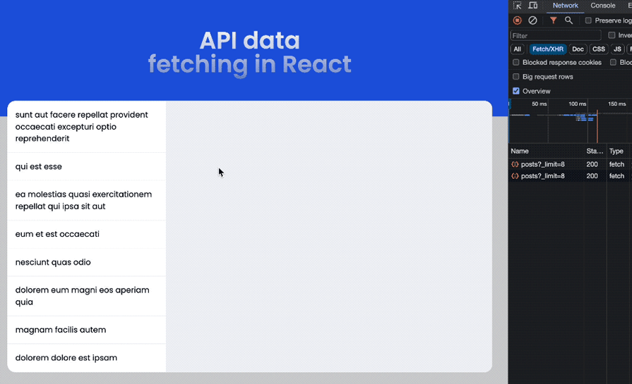
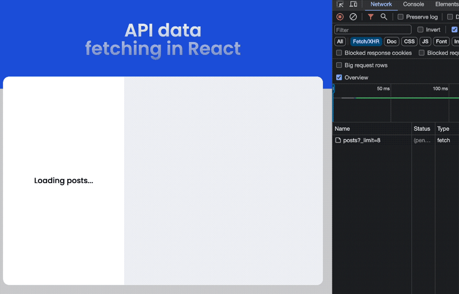
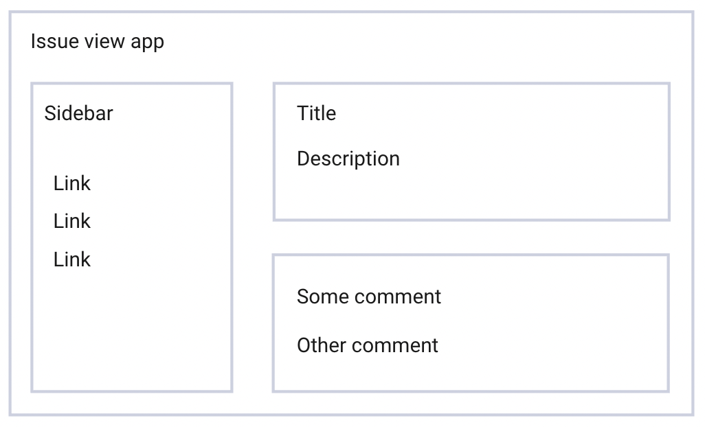
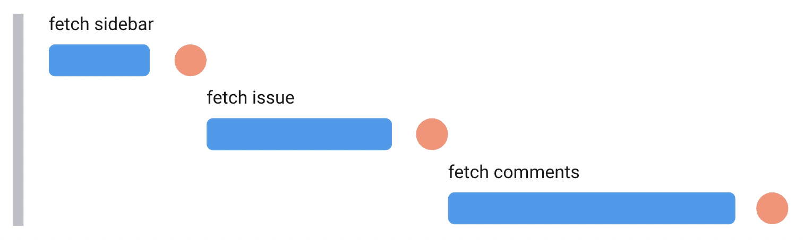
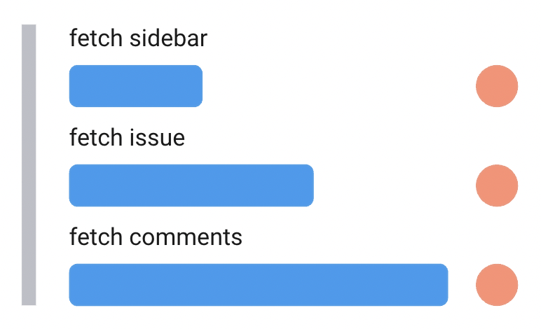
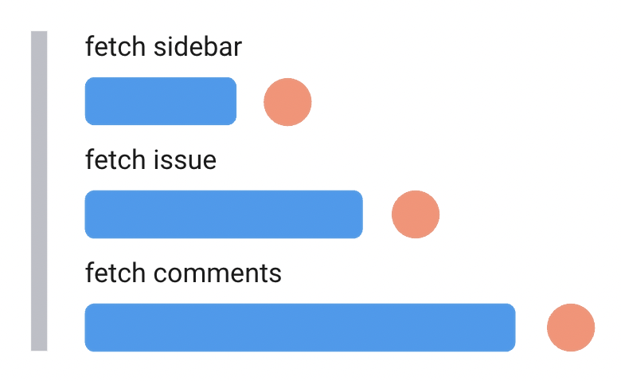
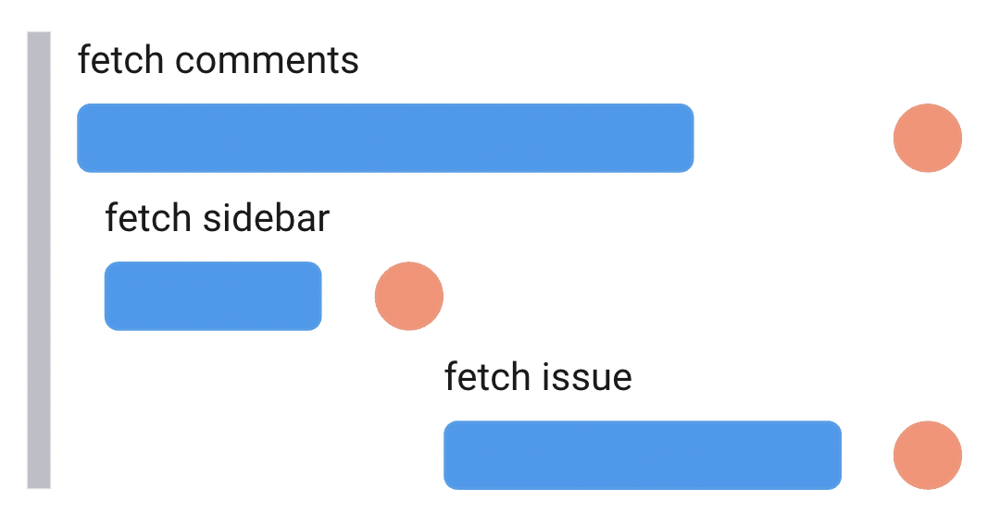
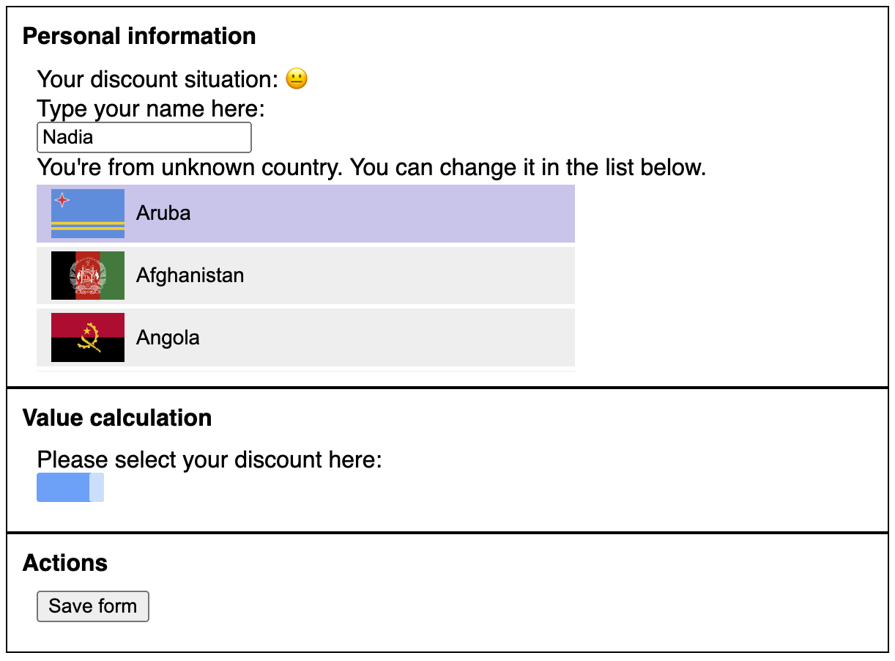
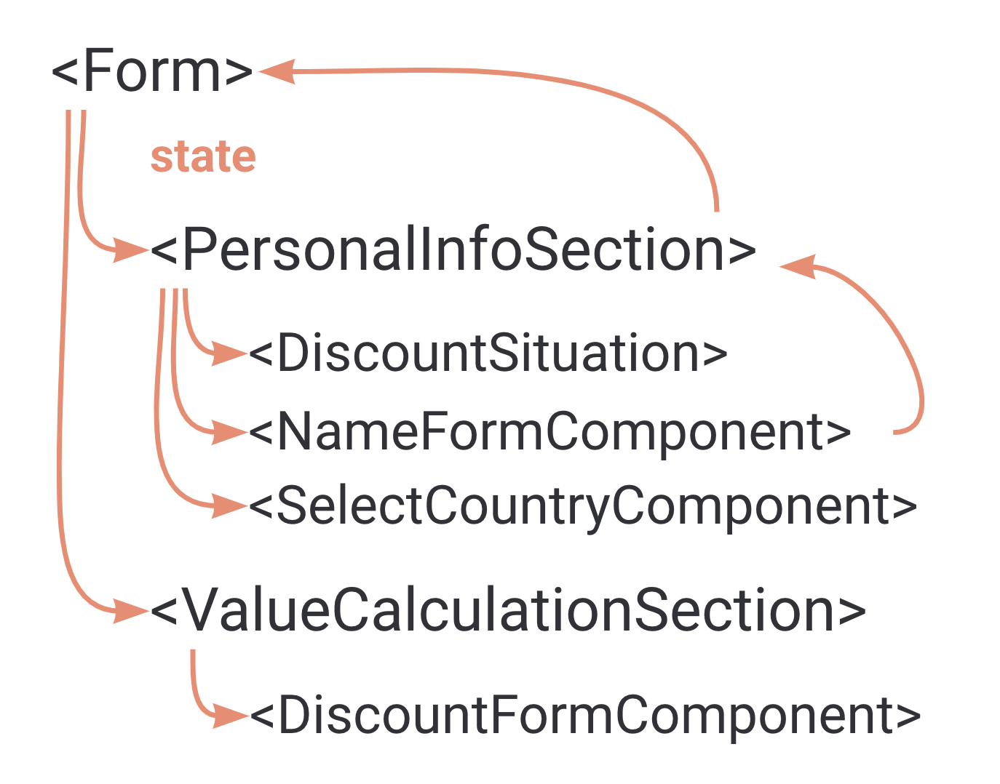
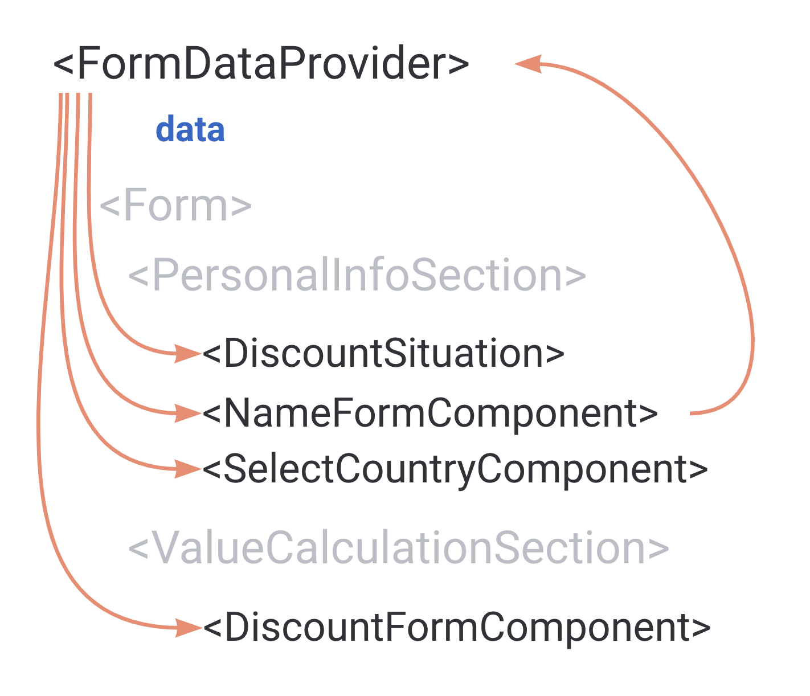

# [Fetching Data in React](https://www.theodinproject.com/lessons/node-path-react-new-fetching-data-in-react)

## Introduction

Up to this point, we have been using React to build client-side applications with interactive user interfaces, but what if we want to fetch data from the internet? In order to create full-fledged web applications, we need some way to get data from external sources and dynamically display it.

In this lesson, we'll explore the ins and outs of fetching data in React, starting with the basics of making API calls, managing component state, and handling asynchronous operations using JavaScript's `fetch` function. You've already performed data fetching in earlier projects, so some material covered in the lesson will be familiar to you. Revision doesn't hurt!

<br>

## Lesson overview

This section contains a general overview of topics that you will learn in this lesson.

- Understand how to make fetch requests in React components.

- Catching and handling errors

- Lifting requests up the component hierarchy

<br>

## A basic fetch request

Before we dive into the specifics of fetching data in React, let's briefly revisit how we can use the fetch API to get data from a server.

```js
const image = document.querySelector('img')
fetch('https://jsonplaceholder.typicode.com/photos', {
	mode: 'cors',
})
	.then((response) => response.json())
	.then((response) => {
		image.src = response[0].url
	})
	.catch((error) => console.error(error))
```

We're making a request to the JSONPlaceholder API to retrieve an image, and then setting that URL to the src of an `` element.

<br>

## Using fetch in React components

Now, let's take a look at how we can incorporate `fetch` into a React component, similar to our previous example. One common use case is to fetch data from an API when a component mounts, so that the data can be displayed on screen.

Whenever a component needs to make a request as it renders, it's often best to wrap that `fetch` inside of an effect.

```js
import { useEffect, useState } from 'react'

const Image = () => {
	const [imageURL, setImageURL] = useState(null)

	useEffect(() => {
		fetch('https://jsonplaceholder.typicode.com/photos', {
			mode: 'cors',
		})
			.then((response) => response.json())
			.then((response) => setImageUrl(response[0].url))
			.catch((error) => console.error(error))
	}, [])
}

export default Image
```

`useState` lets us add the `imageURL` state, whereas `useEffect` allows us to perform side effects. In this case, the side effect is fetching data from an external API. Since we need to fetch the data only once when the component mounts, we pass an empty dependency array.

<br>

## Handling errors

Working over the network is inherently unreliable. The API you're making a request to might be down, there could be a network connectivity issues, or the response you receive could contain errors. A multitude of things can go wrong, and if you don't preemptively plan for errors, your website can break or appear unresponsive to users.

To simulate a network error, scroll up to the previous code snippet and change the `fetch` URL to something random. After a refresh of your browser window, the page will remain a blank white screen, without giving the user any indication that the page has finished loading or that there was an error.

To fix this, we need to check for _something_ before Image component returns JSX. We'll call it: `error`.

```js
if (error) return <p>A network error was encountered.</p>

return (
	imageURL && (
		<>
			<h1>An image</h1>
			
		</>
	)
)
```

To set this `error`, we'll add it to the component's state.

```js
const [imageURL, setImageURL] = useState(null)
const [error, setError] = useState(null)
```

And finally, to assign `error` a value when a request fails, we'll add a conditional to check the response status, and set it where our console.error line was.

```js
useEffect(() => {
	fetch('https://jsonplaceholder.typicode.com/photos', {
		mode: 'cors',
	})
		.then((response) => {
			if (response.status >= 400) {
				throw new Error('server error')
			}

			return response.json()
		})
		.then((response) => setImageURL(response[0].url))
		.catch((error) => setError(error))
}, [])
```

> Notice how we also handle errors in the `then` block? This is because the `fetch` request itself might not fail, but rather complete successfully and yield a response. However, the response received may not be what our app expected. To handle this case, we check the response status codes.

Now when a bad URL is passed or the API returns an unexpected response, the page will relay that information to the user.

<br>

### Loading State

In the same way we added an error value in state to check for errors, we can also add a loading value to check whether the request is resolved or not.

```js
const Image = () => {
	const [imageURL, setImageURL] = useState(null)
	const [error, setError] = useState(null)
	const [loading, setLoading] = useState(true)

	useEffect(() => {
		fetch('https://jsonplaceholder.typicode.com/photos', {
			mode: 'cors',
		})
			.then((response) => {
				if (response.status >= 400) {
					throw new Error('server error')
				}
				return response.json()
			})
			.then((response) => setImageURL(response[0].url))
			.catch((error) => setError(error))
			.finally(() => setLoading(false))
	}, [])

	if (loading) return <p>Loading...</p>

	if (error) return <p>A network error was encountered</p>

	return (
		<>
			<h1>An image</h1>
			
		</>
	)
}
```

<br>

## Using custom hooks

We can separate out the fetching logic altogether into a custom hook. This will allow us to make the logic reusable and easily testable.

Recall in the Introduction to State lesson we said that a React hook is just a function that lets you use features of React (like states, effects etc) and that they follow a naming rule where they begin with `use` followed by a capital letter (e.g. `useState` or `useEffect`). If we tried to put a hook such as `useEffect` inside our own regular helper function like `getImageURL`, React would not be happy about this since it only wants hooks to be called in the top level of a component or another hook. Therefore, we can just turn our helper function into a custom hook by following the hook naming rule -- `useImageURL`.

Here's how we would do it for our example:

```js
import { useState, useEffect } from 'react'

const useImageURL = () => {
	const [imageURL, setImageURL] = useState(null)
	const [error, setError] = useState(null)
	const [loading, setLoading] = useState(true)

	useEffect(() => {
		fetch('https://jsonplaceholder.typicode.com/photos', {
			mode: 'cors',
		})
			.then((response) => {
				if (response >= 400) {
					throw new Error('server error')
				}
				return response.json()
			})
			.then((response) => setImageURL(response[0].url))
			.catch((error) => setError(error))
			.finally(() => setLoading(false))
	}, [])

	return { imageURL, error, loading }
}

const Image = () => {
	const { imageURL, error, loading } = useImageURL()

	if (loading) return <p>Loading...</p>

	if (error) return <p>A network error was encountered</p>

	return (
		<>
			<h1>An image</h1>
			
		</>
	)
}
```

If we ever needed to fetch images in different components, instead of rewriting all of that fetching logic we could call `useImageURL`.

<br>

## Managing multiple fetch requests

In a full-scale web app, you're often going to be making more than one request, and you need to be careful with how you organize them. A common issue that new React developers face when their apps start making multiple requests is called a _waterfall of requests_. Let's look at an example:

[Code Sandbox Link](https://codesandbox.io/p/sandbox/github/TheOdinProject/react-examples/tree/main/fetching-data-example?embed=1&file=%2Fsrc%2Fmain.jsx)

We have two component making fetch requests: `Profile` and its child component `Bio`. The requests in `Profile` and `Bio` are both firing inside of their respective components. On the surface this looks like a well-organized separation of concerns, but in this case, it comes at a cost in performance.

Notice how `Bio` is taking an extra second to display? Their fetch requests should both take 1000ms to resolve so what's going on? In React, the component is not rendered until it is actually called. If JSX has conditional logic, the false branches will never render until they become true. `Bio` has to wait for the request inside of `Profile` to resolve before it starts rendering, which means the request inside `Bio` isn't sent.

If we remove the short-circuiting conditional that waits for `imageURL`, `Bio` would send a request immediately, but that would mean abandoning our loading screen. Instead of compromising on design, we can lift the request up the component tree and pass its response as a prop to `Bio`.

To see this in action, go back to that embedded CodeSandbox and comment out the current `Profile` and `Bio` components, and uncomment the currently commented ones.

Now we have both requests firing as soon as `Profile` renders. The request for `imageURL` resolves 2 seconds before the `bioText` request, and our div containing `<Bio />` renders. When `bioText` resolves, an update will be made in state which will trigger a rerender in `<Bio />`, adding that text description to the page.

> In all of the code examples above, we added an artificial `delay` with the `setTimeout` function. As you've likely guessed by now, this is to help you walk through the data fetching basics in the lesson. We recommend removing these `delay`s and playing around with the code examples to further cement the concepts.

<br>

## Data fetching libraries

We've only just begun to scratch the surface of data fetching on the frontend. Keeping your frontend data up-to-date with the server is a challenging task to accomplish. Managing "async"state becomes increasingly complex with each added feature.

You've already tasted the complexity of data fetching in this lesson. Each request has to have a _minimum_ of three states to achieve an optimal user experience: `data`, `loading`, and `error`. Although some libraries can help you with data fetching and more, it is highly recommended to use vanilla React data fetching for all the projects in this course. The lessons you will learn while doing so will be invaluable.

<br>

## Knowledge Check

- **How can you fetch data from an API in React?**

A common use case is to fetch data from an API when the component mounts with `useEffect`.

<br>

- **Why should you manually throw errors in fetch requests?**

Because the `fetch` request itself might not fail, but rather complete successfully and yield a response. However, the response received may not be what our app expected. To handle this case, we check the response status codes.

<br>

- **How can you avoid waterfalling requests?**

We can avoid waterfalling requests by understanding React's lifecycle. If you put the request on the Component's mount, it can become a waterfall of request if that Component is rendered only when the request of the parent component has finished. Instead of doing this, we can request the data for the child Component during the render of its Parent component and pass it along as a prop.

<hr>
<br>
<br>

# [Modern API data-fetching methods in React](https://blog.logrocket.com/modern-api-data-fetching-methods-react/)

Over the years, how we fetch data into React applications have evolved. For developers who aim to be ahead of the curve, understanding how fetching data works in the current dispensation is essential.

In this guide, we'll explore the modern React data-fetching methods. We'll cover what you need to know about each method, edge cases, and benefits so that you can decide the right solution for your project.

You can check out the [project code in this GitHub repo](https://github.com/Ibaslogic/data-fetching-methods) to see the code examples we'll explore in this tutorial. You can see [the live demo here](https://data-fetching-methods.vercel.app/posts/8) as well. Let's get started.

<br>

## Understanding API: A quick overview

API, or Application Programming Interface, is a protocol or contract that allows one application to communicate with another. In other words, APIs act as intermediaries, enabling the exchange of information between different systems.

<br>

## Why APIs?

Let's think of an application where a section displays the daily weather forecast of the present city. While building this type of app, we can create our backend to handle the weather data logic or we can simply make our app communicate with a third-party system that has all the weather information so we only need to render the data.

Either way, the app must communicate with the backend. This communication is possible via an API, and in this case, a web API, which allows communication over the internet, typically using HTTP (HyperText Transfer Protocol).

With the API, we don't need to create everything from scratch, which will simplify our process. It allows access to where the data is located so we can use it in our app. The two common styles for designing web APIs are REST and GraphQL. While this guide focuses on data fetching from the REST API, the fetching strategies are similar for both.

<br>

## What are API calls in React?

When a React app (client) needs to access resources from the backend (server), it makes the request through the API and expects a response. Each request and response cycle constitutes an API call.

To initiate API calls either to retrieve information or perform other operations, we will use HTTP methods like GET, POST, PUT, and DELETE.

<br>

## Fetching data from an API in a React app

While data fetching can be simple, handling the data upon returning to the client can be complicated.

Before we fetch data, we need to consider where the data will live, how we'll manage the loading state to improve the user experience, and also the error state should anything go wrong. In addition, we need to consider adding optimizations like caching, request duplication, and preventing race conditions.

Now that we have covered the basics, we can get started with the first fetching method.

<br>

## API calls with `fetch()` in a `useEffect` Hook

The Fetch API, through the `fetch()` method, allows us to make an HTTP request to the backend. With this method, we can perform different types of operations using HTTP methods like the `GET` method to request data from an endpoint, `POST` to send data to an endpoint, and more.

`fetch()` requires the URL of the source we want to fetch and an optional parameter:

```js
fetch(url, options)
```

We can also specify the HTTP method in the optional parameter. For the `GET` method, we have the following:

```js
fetch(url, {
	method: 'GET', // other options: POST, PUT, DELETE, etc.
})
```

Or, we can simply ignore the optional parameter because `GET` is the default:

```js
fetch(url)
```

For the `POST` method, we will stringify the object we want to pass to the request body and also explicitly set the `Content-Type` in the headers like so:

```js
fetch(url, {
	method: 'POST',
	headers: {
		'Content-Type': 'application/json',
	},
	body: JSON.stringify({}),
})
```

As mentioned earlier, we will fetch data from a REST API. We could use any API, but here we will use a free online API called JSONPlaceholder to fetch a list of posts into our application; here is a list of the resources we can request.

By applying what we've learned so far, a typical `fetch()` request with `fetch()` looks like the following:

```js
import { useEffect, useState } from 'react'

const FetchGetRequest = () => {
	const [data, setData] = useState(null)
	const [loading, setLoading] = useState(true)
	const [error, setError] = useState(null)

	useEffect(() => {
		const fetchDataForPosts = async () => {
			try {
				const response = await fetch(
					`https://jsonplaceholder.typicode.com/posts?_limit=8`
				)

				if (!response.ok) {
					throw new Error(`HTTP error: Status ${response.status}`)
				}
				let postsData = await response.json()
				setData(postsData)
				setError(null)
			} catch (err) {
				setError(err.message)
				setData(null)
			} finally {
				setLoading(false)
			}
		}

		fetchDataForPosts()
	}, [])

	return <div></div>
}

export default FetchGetRequest
```

In the code, we are using the `fetch()` function to request post data from the resource endpoint as seen in the `useEffect` hook.

In React, we avoid performing side effects like data fetching directly within the component body to avoid inconsistencies. Instead, we isolate them from the rendering logic using the `useEffect` Hook as we did above.

The `fetch` function returns a promise that can either be resolved or rejected. Because this is an asynchronous operation, we often use `async/await` with `try/catch/finally` statement to catch errors and manage the loading state. We may also use the pure promise with `.then`, `.catch` and `.finally` statements.

If the promise resolves, we handle the response within the try block and then update the data while resetting the error state. Initially, the returned data is a `Response` object, which is not the actual format that we need. We must resolve the `Response` object to JSON format using the `json()` method. This also returns a promise and so we wait for it until the promise settles with the actual data.

In case the promise is rejected, we handle the error within the catch block and update the error state while also resetting the data state, which helps prevent inconsistencies for temporary server failure.

Be aware that the promise returned from the `fetch()` function only rejects on a network failure; it won't reject if we hit a wrong or non-existing endpoint like `.../postssss`. For that reason, we've used the response object to check for the HTTP status and throw a custom error for a "404 Not Found". This way, the catch block can detect the error and use our custom message whenever we hit a "404 Not Found."

<br>

## Rendering the post data with `fetch()`

After updating our state variables with `setData`, `setError`, and `setLoading` within the `try/catch/finally` block, we can now render the UI like so:

```js
import { NavLink } from 'react-router-dom'

const FetchGetRequest = () => {
	// ...

	return (
		<div className='flex'>
			<div className='w-52 sm:w-80 flex justify-center items-center'>
				{loading && <div className='text-xl font-medium'>Loading posts...</div>}
				{error && <div className='text-red-700'>{error}</div>}

				<ul>
					{data &&
						data.map(({ id, title }) => (
							<li
								key={id}
								className='border-b border-gray-100 text-sm sm:text-base'
							>
								<NavLink
									className={({ isActive }) => {
										const baseClasses = 'p-4 block hover:bg-gray-100'
										return isActive ? `${baseClasses} bg-gray-100` : baseClasses
									}}
									to={`/posts/${id}`}
								>
									{title}
								</NavLink>
							</li>
						))}
				</ul>
			</div>

			<div className='bg-gray-100 flex-1 p-4 min-h-[550px]'>
				Single post here....
			</div>
		</div>
	)
}

export default FetchGetRequest
```

We grabbed the post data state, looped through the list, and rendered the post title. See the demo below. We've also added styles to improve the visuals:


<br>

## Extract the fetching logic

Let's improve the code readability by extracting the fetching logic into a separate file:

```js
export const getRequestWithNativeFetch = async (url) => {
	const response = await fetch(url)

	if (!response.ok) {
		throw new Error(`HTTP error: Status ${response.status}`)
	}

	return response.json()
}
```

The `useEffect` now looks like this:

```js
useEffect(() => {
	const fetchDataForPosts = async () => {
		try {
			const postsData = await getRequestWithNativeFetch(
				'https://jsonplaceholder.typicode.com/posts?_limit=8'
			)
		} catch (err) {
			setError(err.message)
			setData(null)
		} finally {
			setLoading(false)
		}
	}

	fetchDataForPosts()
}, [])
```

<br>

## Rendering a single post with `fetch()`

Using the same API endpoint, we can fetch individual posts by appending the `postId`:

```js
useEffect(() => {
	const fetchSinglePost = async () => {
		try {
			const postData = await getRequestWithNativeFetch(
				`https://jsonplaceholder.typicode.com/posts/${postId}`
			)
			// ...
		} catch(err) {}
		finally {}
	}

	fetchSinglePost()
}, [postId])
```

When we need to re-fetch data after the first render, we will add dependencies in the array literal to trigger a rerun of `useEffect`. In the code above, we will fetch the single post data based on the dynamic URL post ID.

The render looks like so:

```js
return (
	<>
		{/* loading and error JSX here */}
		<article>
			<h1 classname='text-xl md:text-2xl font-medium mb-6'>
				{data?.title}
			</h1>
			<p>{data?.body}</p>
		</article>
	</>
)
```
The result looks like this:



<br>

## Problem with API calls inside `useEffect`

If you pay attention to the Network tab in the demo above, the request data for individual posts is not cached when we revisit the page. This needs optimization! We may also consider adding other optimizations like deduping multiple requests for the same data, preventing race conditions.

<br>

## The `useEffect` race condition

In our project, a race condition may occur when the single post ID frequently changes during user navigation. When `postId` changes and triggers a re-fetch using `useEffect`, there's a possibility that network responses may arrive in a different order than the requests were sent, causing inconsistencies in the UI.

To address this issue, we'll utilize the `AbortController` to cancel requests before subsequent ones are initiated. Within the single post file, we'll initialize an `AbortController` in the `useEffect` Hook, passing its signal to the fetch function as an optional parameter.

We'll handle `AbortError` instances when requests are canceled, and then call the abort function within the Hook's cleanup phase. This approach ensures that requests are canceled properly, even if the component unmounts while a fetch promise is pending.

The `useEffect` in the single post file should include the `AbortController` like so:

```js
useEffect(() => {
	const controller = new AbortController()

	const fetchSinglePost = async () => {
		try {
			const postData = await getRequestWithNativeFetch(
				`https://jsonplaceholder.typicode.com/posts/${postId}`,
				controller.signal
			)
			// ...
		} catch (err) {
			if (err.name === 'AbortError') {
				console.log('Aborted')
				return
			}

			// ...
		} finally {}
	}

	fetchSinglePost()

	return () => controller.abort()
}, [postId])
```

Then, we pass the signal to the `fetch` function:

```js
export const getRequestWithNativeFetch = async (url, signal = null) => {
	const response = await fetch(url, { signal })

	if (!response.ok) {
		throw new Error(`HTTP erorr: ${response.status}`)
	}

	return response.json()
}
```

Caching and other optimizations can get more complicated when we try to implement them ourselves. Later in this lesson, we'll use the TanStack Query and SWR libraries to simplify the process.

Before we move to the next fetching method, let's briefly showcase the `Post` requests with the `fetch` function.

<br>

## Using the Fetch API for `POST` requests

As we briefly mentioned earlier, a `POST` request is used to send data to an endpoint. To use this method, we'll send the post data via the body of the request as we showed in the syntax earlier.

A typical `POST` request with `fetch()` looks like the following:

```js
useEffect(() => {
	const fetchDataForPosts = async () => {
		try {
			const postsData = await postRequestWithFetch({
				userId: 11,
				id: 101,
				title: 'New post title',
				body: 'The post body content',
			})
			// update state variables like before
		} catch (err) {}
		finally {}
	}
	fetchDataForPosts()
}, [])
```

Then, the `postRequestWithFetch` function receives the data, stringifies it, and passes it to the request body:

```js
export const postRequestWithFetch = async (data) => {
	const response = await fetch(
		`https://jsonplaceholder.typicode.com/posts`,
		{
			method: 'POST',
			headers: {
				'content-type': 'application/json',
			},
			body: JSON.stringify(data),
		}
	)

	return response.json()
}
```

The server then processes the data and responds accordingly. We can render the data in the JSX like so:

```js
return (
	<div className='py-12 px-3'>
		<h2 className='text-2xl font-medium mb-6 underline'>
			Post request with Fetch
		</h2>
		{/* loading and error JSX */}

		{data && (
			<div>
				<h2 className='text-xl font-medium mb-6'>{data.title}</h2>
				<p className='mb-2'>{data.body}</p>
				<span className='text-gray-700 text-sm'>Post ID: {data.id}</span>
			</div>
		)}
	</div>
)
```

<br>

## Using the Axios library

Axios is a third-party promise-based HTTP client that we can add to our project via package manager to make HTTP requests.

it is a wrapper over the native Fetch API. It offers a comprehensive feature set, intuitive API, ease of use, and additional functionality compared to Fetch.

Let's use Axios to fetch post data from our usual endpoint. We'll start by installing it:

```js
npm install axios
```

<br>

## Fetching a post list with Axios

Similar to the earlier implementation, fetching a list of posts in the `useEffect` looks like so:

```js
useEffect(() => {
	const fetchDataForPosts = async () => {
		try {
			const postsData = await fetcherWithAxios(
				'https://jsonplaceholder.typicode.com/posts?_limit=8'
			)
			setData(postsData)
			setError(null)
		} catch (err) {
			setError(err.message)
			setData(null)
		} finally {
			setLoading(false)
		}
	}

	fetchDataForPosts()
}, [])
```

However, the fetching logic in the `fetcherWithAxios` function is simplified like this:

```js
import axios from 'axios'

export const fetcherWithAxios = async (url) => {
	const response = await axios.get(url)
	return response.data
}
```

We started by importing `axios` and then performed a `GET` request to the provided URL endpoint. Unlike the `fetch()` method, the response returned from this library contains the JSON format we need.

It also has the advantage of robust error handling, so we don't need to check and throw an error like we did earlier with the `fetch()` method.

Also, note that the actual data returned from the server is typically contained within the `response.data` property.

<br>

## Fetching a single post with Axios

Using the same API endpoint and maintaining the earlier structure, we can fetch individual posts by passing the resource URL to the `fetcherWithAxios` function:

```js
useEffect(() => {
	const fetchSinglePost = async () => {
		try {
			const postData = await fetcherWithAxios(
				`https://jsonplaceholder.typicode.com/posts/${postId}`
			)

			setData(postData)
			setError(null)
		} catch (err) {
			setError(err.message)
			setData(null)
		} finally {
			setLoading(false)
		}
	}

	fetchSinglePost()
}, [postId])
```

This is straightforward and more concise compared to the `fetch()` method.

<br>

## Using Axios for `POST` requests

Unlike Fetch, Axios automatically stringifies the post data when we send JavaScript objects. The following code performs a post request with Axios:

```js
export const postRequestWithAxios = async (data) => {
	const response = await axios.post(
		'https://jsonplaceholder.typicode.com/posts/',
		{
			headers: {
				'Content-Type': 'application/json',
			},
			data
		}
	)
	return response.data
}
```

We can then pass the post data like so:

```js
useEffect(() => {
	const fetchDataForPosts = async () => {
		try {
			const postsData = await postRequestWithAxios({
				userId: 11,
				id: 101,
				title: 'New post title',
				body: 'The post body content',
			})
			setData(postsData.data)
			// ...
		}	catch (err) {}
		finally {}
	}
	fetchDataForPosts()
}, [])
```

## Using the `useFetch` custom Hook from `react-fetch-hook`

Up to this point, we've covered most of what we need to fetch data from an API endpoint. However, we can go a step further by simplifiying data fetching using the `useFetch` Hook from the `react-fetch-hook` library.

The `useFetch` Hook encapsulates the Fetch API implementation, thereby reducing the pain of writing complicated code even on small-scale applications.

To use the library, let's first install it:

```
npm i react-fetch-hook
```

To fetch the posts list with this Hook, we'll pass the endpoint URL like so:

```js
import useFetch from 'react-fetch'hook

const ReactFetchHook = () => {
	const { isLoading, data, error } = useFetch(
		'https://jsonplaceholder.typicode.com/posts?_limit=8'
	)

	return (
		// ...
	)
}

export default ReactFetchHook
```

The `useFetch` Hook exposes state (`isLoading`, `data`, `error`), which we can then use in our render.

Similarly, to fetch a single post, we'll pass the resource URL to the Hook like so:

```js
const {
	isLoading: loading,
	data,
	error
} = useFetch(
	`https://jsonplaceholder.typicode.com/posts/${postId}`
)
```

We've renamed the `isLoading` state from the Hook to `loading` because we have used `loading` in the render:

```js
{loading && (
	<div className='text-xl font-medium'>A moment please...</div>
)}
```

<br>

## Using the TanStack Query Library

TanStack Query, formally known as React Query, makes data fetching much more efficient. It lets us achieve a lot more than just fetching data.

At its core, TanStack Query offers functionalities such as caching, re-fetching, request deduplication, and various optimizations that impact the overall user experience by preventing irregularities and ensuring that our app feels faster.

Like the previous method, TanStack Query provides a custom Hook that we can reuse throughout our app to fetch data. To use the library, let's install it:

```js
npm i @tanstack/react-query
```

Next, go to the entry point of your app -- in a React Vite project, the `main.jsx` file. In that file, we'll create a query client and provide it to our app:

```js
// ...
import {
	QueryClient,
	QueryClientProvider
} from '@tanstack/react-query'

const router = createBrowserRouter([
	// ....
])

// Create a client
const queryClient = new QueryClient()

ReactDOM.createRoot(document.getElementById('root')).render(
	<React.StrictMode>
		<QueryClientProvider client={queryClient}>
			<RouterProvider router={router} />
		</QueryClientProvider>
	</React.StrictMode>
)
```

We've wrapped the `RouterProvider`, which renders our app with the `QueryClientProvider` and passes the client instance to it.

<br>

## Fetching post items with TanStack Query

We'll start by importing a `useQuery` Hook from `@tanstack/react-query`. In this Hook, we must pass a unique query key identifying the data we are fetching and a function that the query will use to request data.

This query key is necessary for the library to cache data correctly and helps with re-fetching and sharing the queries throughout the application:

```js
// ...
import { useQuery } from '@tanstack/react-query'
import { fetcherWithFetch } from '../lib/fetcherWithFetch'

const ReactQuery = () => {
	const { data, error, isPending: loading } = useQuery({
		queryKey: ['posts'],
		queryFn: () =>
			fetcherWithFetch(
				'https://jsonplaceholder.typicode.com/posts?_limit=8'
			)
	})

	return (
		// ...
	)
}

export default ReactQuery
```

In return, the Hook exposes the (`isPending`, `data`, `error`), which we can then use in our render.

The `fetcherWithFetch` should look familiar as we create something similar earlier:

```js
export const fetcherWithFetch = async (url) => {
	const response = await fetch(url)

	if (!response.ok) {
		throw new Error(`HTTP error: Status ${response.status}`)

		return response.json()
	}
}
```

Please note that TanStack Query is an async state manager rather than a data-fetching library. That is why we still had to use HTTP clients like `fetch` to perform requests. TanStack Query helps resolve every other challenge that we may encounter with data fetching in real-world scenarios.

We may also decide to use Axios if we want:

```js
const { data, error, isPending: loading } = useQuery({
	queryKey: ['posts'],
	queryFn=: () =>
		fetcherWithAxios(
			'https://jsonplaceholder.typicode.com/posts?_limit=8'
		)
})
```

The `fetcherWithAxios` should also look familiar:

```js
import axios from 'axios'

export const fetcherWithAxios = async (url) => {
	const response = await axios.get(url)
	return response.data
}
```

<br>

## Fetching a single post with TanStack Query

For individual posts, we will pass the post ID to the `queryKey` to uniquely identify the post data. Then, we set a `staleTime` to prevent re-fetching data:

```js
const {
	data,
	error,
	isPending: loading
} = useQuery({
	queryKey: ['posts', parseInt(postId)],
	queryFn: () =>
		fetcherWithFetch(
			`https://jsonplaceholder.typicode.com/posts/${postId}`
		),
	staleTime: 100 * 60 * 10, // cache for 10 minutes
})
```

As you can see in the Network tab in the demo below, the data for individual posts is cached when we revisit the page. That is an improvement:



<br>

## Using the SWR library

SWR (stale-while-revalidate) offers similar implementations and functionalities to TanStack Query. Like TanStack Query, SWR provides a custom Hook that we can use to fetch data. Let's install it:

```
npm i swr
```

<br>

## Fetching post items with SWR

We'll start by importing a `useSWR` Hook from `swr`. In this Hook, we must pass a unique key for the request and a function to fetch data. We can use any library to handle data fetching as we did with TanStack Query.

The following code shows how we fetch the posts list with the `useSWR` Hook:

```js
// ...
import useSWR from 'swr'
import { fetcherWithFetch } from '../lib/fetcherWithFetch'

const FetchWithSwr = () => {
	const { data, error, isLoading } = useSWR(
		'https://jsonplaceholder.typicode.com/posts?_limit=8',
		fetcherWithFetch
	)

	return (
		// ...
	)
}

export default FetchWithSwr
```

Usually, we use the resource URL for the request key. This key will be passed to the fetcher function as an argument automatically.

We can then se the returned state (`isLoading`, `data`, `error`) to populate the render.

<br>

## Fetching a single post with SWR

For individual posts, we will pass the unique post URL endpoint as the key to uniquely identify the post data. Then, we set the cache time with `dedupingInterval` in the config object to prevent re-fetching data:

```js
const {
	data,
	error,
	isLoading: loading
} = useSWR(
	`https://jsonplaceholder.typicode.com/posts/${postId}`,
	fetcherWithFetch,
	{
		dedupingInterval: 1000 * 60 * 10, // cache for 10 minutes
	}
)
```

<br>

## Conclusion

This comprehensive guide covers nearly all the essential aspects of modern data fetching techniques. We've delved into fetching data from API endpoints, mastering the handling of various states such as loading and error states, and showcasing the simplification of the fetching process using contemporary libraries. By now, you should feel more confident in integrating data fetching into your React applications.

<hr>
<br>
<br>

## [How to fetch data in React with performance in mind](https://www.developerway.com/posts/how-to-fetch-data-in-react)

Have you tried recently to wrap your head around what's the latest on data fetching in React? I tried. Almost lost my mind in the process. The chaos of endless data management libraries, GraphQL or not GraphQL, recent React 18 and useEffect scandal, `useEffect` is evil since it causes waterfalls, `Suspense` for data fetching is supposed to save the world, but is still marked as Experimental, `fetch-on-render`, `fetch-then-render` and `render-as-you-fetch` patterns that confuse even people who write about them. What on Earth is going on? Why do I suddenly need a PhD to just make a simple GET request?

And what is the actual "right way" to fetch data in React now?

Let's take a look.

<br>

## Types of data fetching

Generally speaking, in the modern frontend world, we can loosely separate the concept of "data fetching" into two categories: initial data fetching and data fetching on demand.

Data **on demand** is something that you fetch after a user interacts with a page, in order to update their experience. All the various autocompletes, dynamic forms, and search experiences fall under that category. In React, fetch of this data is usually triggered in callbacks.

**Initial data** is the data you'd expect to see on a page right away when you open it. It's the data we need to fetch before a component ends up on the screen. It's something that we need to be able to show users some meaningful experience as soon as possible. In React, fetching data like this usually happens in `useEffect` (or in `componentDidMount` for class components).

Interestingly enough, although those concepts seem totally different, the core principles and fundamental patterns of data fetching are exactly the same for them both. But the initial data fetching is usually the most crucial for the majority of people. During this stage, the first impression of your apps as "slow as hell" or "blazing fast" will form. That's why for the rest of the article I will be focusing solely on initial data fetching and how to do it properly with performance in mind.

<br>

## Do I really need an external library to fetch data in React?

First things first. External libraries for data fetching in React - yes or no?

Short answer -- no, and yes. Depends on your use case. If you _actually_ just need to fetch a bit of data once and forget about it, then no, you don't need anything. Just a simple `fetch` in `useEffect` hook will do just fine:

```js
const Component = () => {
	const [data, setData] = useState()

	useEffect(() => {
		// fetch data
		const dataFetch = async () => {
			const data = await (
				await fetch(
					'https://run.mocky.io/v3/d6155d63-938f-484c-8d87-6f918f126cd4',
				)
			).json()

			// set state when the data is received
			setData(data)
		}

		dataFetch()
	}, [])

	return <>...</>
}
```

But as soon as your use case exceeds "fetch once and forget" you're going to face tough questions. What about error handling? What if multiple components want to fetch data from this exact endpoint? Do I cache that data? For how long? What about race conditions? What if I want to remove the component from the screen? Should I cancel this request? What about memory leaks? And so on and so forth. Dan Abramov explained the situation really well, highly recommend reading for more details.

Not a single question from that list is even React specific, it's a general problem of fetching data over the network. And to solve those problems (and more!) there are only two paths: you either need to re-invent the wheel and write a _lot of code_ to solve those, or just rely on some existing library that has been doing this for years.

Some libraries, like axios, will abstract some concerns, like canceling requests, but will have no opinion on React-specific API. Others, like swr, will handle pretty much everything for you, including caching. But essentially, the choice of technology doesn't matter much here. No library or Suspense in the world can improve performance of your app just by itself. They just make some thing easier at the cost of making some things harder. You _always_ need to understand the fundamentals of data fetching and data orchestration patterns and techniques in order to write performant apps.

<br>

## What is a "performant" React app?

Before jumping into concrete patterns and code examples, let's have a conversation on what "performance" of an app is. How do you know whether an app is "performant"? It's relatively straightforward with a simple component: you just measure how long it takes to render it, and voila! The smaller the number, the more "performant" (i.e. faster) your component is.

With async operations, which data fetching typically is, and in the context of big apps and user experience point of view it's not that obvious.

Imagine we were implementing an issue view for an issue tracker. It would have sidebar navigation on the left with a bunch of links; the main issue information in the center -- things like title, description or assignee; and a section with comments underneath that.



And let's say the app is implemented in three different ways:

Shows a loading state until all the data is loaded, and then renders everything in one go. Takes ~3 seconds.

Shows a loading state until sidebar data is loaded first, renders sidebar, and keeps loading state until the data is finished in the main part. The sidebar to appear takes ~1 second, the rest of the app appears in ~3 seconds. Overall takes ~4 seconds.

Shows a loading state until main issue data is loaded, renders it, keeps loading state for sidebar and comments. When sidebar loaded -- renders it, keeps loading state for sidebar and comments. When sidebar loaded - renders it, comments are still in loading state. Main part appears in ~2 seconds, sidebar in ~1 second after that, takes another ~2 second for comments to appear. Overall takes ~5s to appear.

Which app is the most performant here? What do you think?

Play around with the apps One, Two, and Three and make a decision before scrolling to the answer.

And the answer is of course tricky, and the most performant app is not the one that you chose, but none of them, or all of them, or any of them. It depends.

The first app loads in just 3 seconds -- the fastest of them all. From the pure numbers perspective, it's a clear winner. But it doesn't show anything to users for 3 sedconds -- the longest of them all. Clear loser?

The second apps loads something on the screen (sidebar) in just 1 second. From the perspective of showing at least something as fast as possible, it's a clear winner. But it's the longest of them all to show the main part of the issue. Clear loser?

The third apps loads the Issue information first. From the perspective of showing the main piece of the app first, it's a clear winner. But the "natural" flow of information for left-to-right languages is from the top-left to the bottom-rght. This is how we read usually. This app violates it and it makes the experience the most "junky" one here. Not to mention it's the longest of them all to load. Clear loser?

It always depends on the message you're trying to convey to the users. Think of yourself as a storyteller, and the app is your story. What is the most important piece of the story? What is the second? Does your story have a flow? Can you even tell it in pieces, or you want users to see the story in full right away, without any intermediate steps?

When, and only when, you have an idea of what your story should look like, then it will be the time to assemble the app and optimize the story to be as fast as possible. And the true power here comes not from various libraries, GraphQL or Suspense, but from the knowledge of:

- when is it okay to start fetching data?

- what can we do while the data fetching is in the progress?

- what should we do when the data fetching is done?

And knowing a few techniques that allow you to control all three stages of the data fetching requests.

But before jumping into actual techniques, we need to understand two more very fundamental things: React lifecycle and browser resources and their influence on your goal.

<br>

## React lifecycle and data fetching

The most important thing to know and remember, when planning your fetch requests strategy, is when React component's lifecycle is triggered. Check out this code:

```js
const Child = () => {
	useEffect(() => {
		// do something here, like fetching data for the Child
	}, [])
}

const Parent = () => {
	// set loading to true initially
	const [isLoading, setIsLoading] = useState(true)

	if (isLoading) return 'loading'

	return <Child />
}
```

We have our `Parent` component, it conditionally renders `Child` component based on state. Will Child's `useEffect`, and therefore the fetch request there, be triggered here? The intuitive answer here is the correct one - it won't. Only after Parent's `isLoading` state changes to `false`, will the rendering and all other effects be triggered in the `Child` component.

What about this code for the `Parent`:

```js
const Parent = () => {
	// set loading to true initially
	const [isLoading, setIsLoading] = useState(true)

	// child is now here! before return
	const child = <Child />

	if (isLoading) return 'loading'

	return child
}
```

Functionality is the same: if `isLoading` set to false, show `Child`, if `true`, show the loading state. But the `<Child />` element this time is before the `if` condition. Will the `useEffect` in `Child` be triggered this time? And the answer is now less intuitive, and I've seen a lot of people stumble here. The answer is still the same -- no, it won't.

When we write `const child = <Child />` we don't "render" `Child` component. `<Child />` is nothing more than a syntax sugar for a function that creates a _description_ of a future element. It only is rendered when this description ends up in the actual visible render tree -- i.e. returned from the component. Until then it just sits there idly as one massive object and does nothing.

If you want to understand in more details and with code examples how it works and all the possible edge cases, this article might be interesting to you: The mystery of React Element, children, parent and re-renders.

There are more things to know about React lifecycle of course: the order in which all of this is triggered, what is triggered before or after painting, what slows down what and how, `useLayoutEffect` hook, etc. But all of this becomes relevant much much later, when you orchestrated everything perfectly already and now fighting for milliseconds in a very big complicated app. So a topic for another article, otherwise this one will turn into a book.

<br>

## Browser limitations and data fetching

You might be thinking at this point: gosh, it's so complicated. Can't we just fire all the requests as soon as possible, shove that data in some global store, and then just use it when it's available? Why even bother with the lifecycle and orchestration of anything?

I feel ya. And sure, we can do it, if the app is simple and only have a few requests to make ever. But in large apps, where we can have dozens of data fetching requests, that strategy can backfire. And I'm not even talking about server load and whether it can handle it. Let's assume that it can. The problem is that our browsers can't!

Did you know, that browsers have a limit on how many requests in parallel to the same host they can handle? Assuming the server is HTTP1 (which is still 70% of the Internet), the number is not that big. In Chrome it's just 6. 6 requests in parallel! If you fire more at the same time, all the rest of them will have to queue and wait for the first available "slot".

And 6 requests for initial data fetching in a big app is not unreasonable. Our very simple "issue tracker" already has 3, and we haven't even implemented anything of value yet. Imagine all the angry looks you'll get, if you just add a somewhat slow analytics request that literally does nothing at the very beginning of the app, and it ends up slowing down the entire experience.

Wanna see it in action? Here's the simplest code:

```js
const App = () => {
	// I extracted fetching and useEffect into a Hook
	const { data } = useData('/fetch-some-data')

	if (!data) return 'loading...'

	return <div>I'm an app</div>
}
```

Assume that fetch request is super fast there, takes just ~50ms. If I add just 6 requests before that app, that takes 10 seconds, without waiting for them or resolving them, the whole app load will takes those 10 seconds (in Chrome of course).

```js
// no waiting, no resolving, just fetch and drop it
fetch('https://some-url.com/url1')
fetch('https://some-url.com/url2')
fetch('https://some-url.com/url3')
fetch('https://some-url.com/url4')
fetch('https://some-url.com/url5')
fetch('https://some-url.com/url6')

const App = () => {
	// ... same app code
}
```

See it in codesandbox and play around with how just removing one of those useless fetches makes the difference.

<br>

## Requests waterfalls: how they appear

Finally, time to do some serious coding! Now that we have all the needed moving pieces and know how they fit together, time to write the story of our Issue tracking app. Let's implement those examples from the beginning of the article, and see what is possible.

Let's start with laying out components first, then wire the data fetching afterward. We'll have the app component itself, it will Sidebar and Issue, and Issue will render Comments.

```js
const App = () => {
	return (
		<>
			<Sidebar />
			<Issue />
		</>
	)
}

const Sidebar = () => {
	return // some sidebar links
}

const Issue = () => {
	return (
		<>
			// some issue data
			<Comments />
		</>
	)
}

const Comments = () => {
	return // some issue comments
}
```

Now to the data fetching. Let's first extract the actual fetch and useEffect and state management into a nice hook, to simplify the examples:

```js
export const useData = (url) => {
	const [state, setState] = useState()

	useEffect(() => {
		const dataFetch = async () => {
			const data = await (await fetch(url)).json()

			setState(data)
		}

		dataFetch()
	}, [url])

	return { data: state }
}
```

Then, I would probably naturally want to co-locate fetching requests with the bigger components: issue data in `Issue` and comments list in `Comments`. And would want to show the loading state while we're waiting of course.

```js
const Comments = () => {
	// fetch is triggered in useEffect there, as normal
	const { data } = useData('/get-comments')

	// show loading state while waiting for the data
	if (!data) return 'loading'

	// rendering comments now that we have access to them!
	return data.map((comment) => <div>{comment.title}</div>)
}
```

And exactly the same code for `Issue`, only it will render `Comments` component after loading:

```js
const Issue = () => {
	// fetch is triggered in useEffect there, as normal
	const { data } = useData('/get-issue')

	// show loading state while waiting for the data
	if (!data) return 'loading'

	// render actual issue now that the data is here
	return (
		<div>
			<h3>{data.title}</h3>
			<p>{data.description}</p>
			<Comments />
		</div>
	)
}
```

And the app itself:

```js
const App = () => {
	// fetch is triggered in useEffect there, as normal
	const { data } = useData('/get-sidebar')

	// show loading state while waiting for the data
	if (!data) return 'loading'
	
	return (
		<>
			<Sidebar data={data} />
			<Issue />
		</>
	)
}
```

Boom, done! Check out the actual implementation in codesandbox. Have you noticed how slooow it is? Slower than all our examples from above!

What we did here is implemented a classic waterfall of requests. Remember the react lifecycle part? Only component that are actually returned will be mounted, rendered, and as a result, will trigger useEffect and data fetching in it. In our case, every single component returns "loading" state while it waits for data. And only when data is loaded, does they switch to a component next in the render tree, it triggers its own data fetching, returns "loading" state and the cycle repeats itself.



Waterfalls like that are not the best solution when you need to show the app as fast as possible. Likely, there are a few ways to deal with them (but not Suspense, about that one later).

<br>

## How to solve requests waterfall

### `Promise.all` solution

The first and easiest solution is to pull all those data fetching requests as high in the render tree as possible. In our case, it's our root component `App`. But there is a catch there: you can't just "move" them and leave as-is. We can't just do something like this:

```js
useEffect(async () => {
	const sidebar = await fetch('/get-sidebar')
	const issue = await fetch('/get-issue')
	const comments = await fetch('/get-comments')
}, [])
```

This is just yet another waterfall, only co-located in a single component: we fetch sidebar data, `await` for it, then fetch issue, `await`, fetch comments, `await`. The time when all the data will be available for render will be the sum of all those waiting times: 1s + 2s + 3s = 6 seconds. Instead, we need to fire them all _at the same time_, so that they are sent in parallel. That way we will be waiting for all of them no longer than the longest of them: 3 seconds. 50% performance improvement!

One way to do it is to use `Promise.all`:

```js
useEffect(async () => {
	const [sidebar, issue, comments] = await Promise.all([
		fetch('/get-sidebar'),
		fetch('/get-issue'),
		fetch('/get-comments'),
	])
}, [])
```

And then save all of them to state in the parent component and pass them down to the children components as props:

```js
const useAllData = () => {
	const [sidebar, setSidebar] = useState()
	const [comments, setComments] = useState()
	const [issue, setIssue] = useState()

	useEffect(() => {
		const dataFetch = async () => {
			// waiting for all the things in parallel
			const result = (
				await Promise.all([
					fetch(sidebarUrl),
					fetch(issueUrl),
					fetch(commentsUrl),
				])
			).map((r) => r.json())
			
			// and waiting a bit more - fetch API is cumbersome
			const [sidebarResult, issueResult, commentsResult] = await Promise.all(result)

			// when the data is ready, save it to state
			setSidebar(sidebarResult)
			setIssue(issueResult)
			setComments(commentsResult)
		}

		dataFetch()
	}, [])

	return { sidebar, comments, issue }
}

const App = () => {
	// all the fetches were triggered in parallel
	const { sidebar, comments, issue } = useAllData()

	// show loading state while waiting for all the data
	if (!sidebar || !comments || !issue) return 'loading'

	// render the actual app here and pass data from state to children
	return (
		<>
			<Sidebar data={sidebar} />
			<Issue comments={comments} issue={issue} />
		</>
	)
}
```

See example in codesandbox

This is how the very first app from the test at the beginning is implemented.



<br>

### Parallel promises solution

But what if we don't want to wait for them all? Our comments are the slowest and the least important part of the page, it doesn't make much sense to block rendering of the sidebar while we're waiting for them. Can I fire all requests in parallel, but wait for them independently?

Of course! We just need to transform tose `fetch` from `async/await` syntax to prop old-fashioned promises and save the data inside then callback:

```js
fetch('/get-sidebar')
	.then((data) => data.json())
	.then((data) => setSidebar(data))
fetch('/get-issue')
	.then((data) => data.json())
	.then((data) => setIssue(data))
fetch('/get-comments')
	.then((data) => data.json())
	.then((data) => setComments(data))
```

Now every fetch request is fired in parallel but resolved independently. And now in the App's render we can do pretty cool things, like render `Sidebar` and `Issue` as soon as their data ends up in the state:

```js
const App = () => {
	const { sidebar, issue, comments } = useAllData()

	// show loading state while waiting for sidebar
	if (!sidebar) return 'loading'

	// render sidebar as soon as its data is available
	// but show loading state instead of issue and comments while we're waiting for them
	return (
		<>
			<Sidebar data={sidebar} />
			<!-- render local loading state for issue here if its data is not available -->
			<!-- inside Issue component we'd have to render 'loading' for empty comments as well -->
			{issue ? <Issue comments={comments} issue={issue} /> : 'loading'}
		</>
	)
}
```

In here, we render `Sidebar`, `Issue` and `Comments` components as soon as their data becomes available -- exactly the same behavior as the initial waterfall. But since we fired those requests in parallel, the overall waiting time will drop from 6 seconds to just 3 seconds. We just massively improve the performance of the app, while keeping its behavior intact!



One thing to note here, is that in this solution we're triggering state change three times independently, which will cause three re-render of the parent component. And considering that it's happening at the top of the app, unnecessary re-render like this might cause half of the app to re-render unnecessarily. The performance impact really depends on the order of your components of course and how big they are, but something to keep in mind. A helpful guide on how to deal with re-renders is here: React re-renders guide: everything, all at once.

<br>

### Data providers to abstract away fetching

Lifting data loading up like in the examples above, although good for performance, is terrible for app architecture and code readability. Suddenly, instead of nicely co-located data fetching requests and their components, we have one giant component that fetches everything and massive props drilling throughout the entire app.

Likely, there is an easy(ish) solution to this: we can introduce the concept of "data providers" to the app. "Data provider" here would be just an abstraction around data fetching that gives us the ability to fetch data in one place of the app and access that data in another, bypassing all components in between. Essentially like a mini-caching layer per request. In "raw" React it's just a simple context:

```js
const Context = React.createContext()

export const CommentsDataProvider = ({ children }) => {
	const [comments, setComments] = useState()

	useEffect(async () => {
		fetch('/get-comments')
			.then((data) => data.json())
			.then((data) => setComments(data))
	}, [])

	return (
		<Context.Provider value={comments}>
			{children}
		</Context.Provider>
	)
}

export const useComments = () => useContext(Context)
```

Exactly the same logic for all three of our requests. And then our monster `App` component turns into something as simple as this:

```js
const App = () => {
	const sidebar = useSidebar()
	const issue = useIssue()

	// show loading state while waiting for sidebar
	if (!sidebar) return 'loading'

	// no more props drilling for any of those
	return (
		<Sidebar />
		{issue ? <Issue /> : 'loading'}
	)
}
```

Our three providers will wrap the `App` component and will fire fetching requests as soon as they are mounted in parallel:

```js
export const VeryRootApp = () => {
	return (
		<SidebarDataProvider>
			<IssueDataProvider>
				<CommentsDataProvider>
					<App />
				</CommentsDataProvider>
			</IssueDataProvider>
		</SidebarDataProvider>
	)
}
```

And then in something like `Comments` (i.e. far far deep into the render tree from the root app), we'll just access that data from "data provider":

```js
const Comments = () => {
	// Look! No props drilling!
	const comments = useComments()
}
```

If you're not a huge fan of Context - not to worry, exactly the same concept will work with any state management solution of your choosing. And if you want to give Context a try, check out this article: How to write performant React apps with Context, it has some patterns for Context-related performance.

<br>

### What if I fetch data before React?

One final trick to learn about waterfalls fighting. That one is very important to know so that you can stop your colleagues from using it during PR reviews. What I'm trying to say here: it's a very dangerous thing to do, use it wisely.

Let's take a look at our Comments component from the times we implemented the very first waterfall, the one that was fetching data by itself (I moved the getData hook inside).

```js
const Comments = () => {
	const [data, setData] = useState()

	useEffect(() => {
		const dataFetch = async () => {
			const data = await (
				await fetch('/get-comments')
			).json()

			setData(data)
		}

		dataFetch()
	}, url)

	if (!data) return 'loading'

	return data.map((comment) => <div>{comment.title}</div>)
}
```

And pay special attention to the 6th line here. What is `fetch('/get-comments')`? It's nothing more than just a promise, that we await inside our `useEffect`. It doesn't depend on anything of React in this case - no props, state or internal variables dependencies. So what will happen it I just move it to the very top, before I even declare `Comments` component? and then just `await` that promise inside `useEffect` hook?

```js
const commentsPromise = fetch('/get-comments')

const Comments = () => {
	useEffect(() => {
		const dataFetch = async () => {
			// just await the variable here
			const data = await(await commentsPromise).json()

			setState(data)
		}
		
		dataFetch()
	}, [])
}
```

Really fancy thing: our fetch call basically "escapes" all React lifecycle and will be fired as soon as JavaScript is loaded on the page, before any of `useEffect` anywhere are called. Even before the very first request in the root `App` component will be called. It will be fired, javascript will move on to other things to process, and the data will just sit there quietly until someone actually resolves it. Which is what we're doing in our `useEffect` in `Comments`.

Remember our initial waterfall pic?


Just moving fetch call outside of `Comments` resulted in this instead:



Technically speaking, we could've just moved all of our promises outside of components, that would've solved the waterfalls and we wouldn't have to deal with lifting fetching up or data providers.

So why didn't we? And why it's not a very common pattern?

Easy. Remember the **Browsers limitation** chapter? Only 6 requests in parallel, the next one will queue. And fetches like that will be fired immediately and completely uncontrollably. A component that fetches heavy data and rendered once in a blue moon, in your app with "traditional" waterfall approach won't bother anyone until it's actually rendered. But with this hack, it has the potential to steal the most valuable milliseconds of initial fetching of critical data. And good luck to anyone who's trying to figure out how a component that sits in some existential corner of the code and is never even rendered on a screen can slow down the entire app.

There are only two "legit" use cases that I can think of for that pattern: pre-fetching of some critical resources on the router level and pre-fetching data in lazy-loaded components.

In the first one, you actually need to fetch data as soon as possible, and you know for sure that the data is critical and required immediately. And lazy-loaded components' javascript will be downloaded and executed only when they end up in the render tree, so by definition after all the critical data is fetched and rendered. So it's safe.

<br>

### What if I use libraries for data fetching?

Up until now in all code examples, I've been using only native `fetch`. This is on purpose: I wanted to show you fundamental data fetching patterns in React, and those are libraries-independent. Regardless of any library you're using or want to use, the principle of waterfalls, fetching data within or outside of React lifecycle stays the same.

React-independenty libraries like Axios just abstract away the complexities of dealing with actual `fetch`, nothing more. I can replace all `fetch` with `axios.get` in the examples and the result will stay the same.

React-integrated libraries with hooks and query-like API like swr in addition abstract away dealing with `useCallback`, state, and many other things like error handling and caching. Instead of this monstrosity of a code that still needs a lot of things to be production-ready:

```js
const Comments = () => {
	const [data, setData] = useState()

	useEffect(() => {
		const dataFetch = async () => {
			const data = await (
				await fetch('/get-comments')
			).json()

			setState(data)
		}

		dataFetch()
	}, [url])

	// the rest of comments code
}
```

with swr I can just write this:

```js
const Comments = () => {
	const { data } = useSWR('/get-comments', fetcher) 

	// the rest of comments code
}
```

Underneat, all of them will use `useEffect` or equivalent to fetch the data, and state to update the data and trigger re-render of the host component.

<br>

## What about Suspense?

The data fetching in React story without at least mentioning Suspense would be incomplete. So, what about Suspense? Well, nothing. At the time of writing the article, Suspense for data fetching is still flagged as Experimental, so I would not recommend using it in anything remotely production-related.

But let's imagine that the API will stay the same and it will become production-ready tomorrow. Will it fundamentally solve data fetching and will it make everything above obsolete? Not at all. We are still going to be bound by browsers resources limit, React lifecycle, and the nature of requests waterfalls as a result.

Suspense is just a really fancy and clever way to replace fiddling with loading states. Instead of this:

```js
const Comments = ({ comments }) => {
	if (!comments) return 'loading'

	// render comments
}
```

we're just going to lift that loading state up and do this:

```js
const Issue = () => {
	return (
		<>
			// issue data
			<Suspense fallback='loading'>
				<Comments />
			</Suspense>
		</>
	)
}
```

<hr>
<br>
<br>

# [How to write performant React apps with Context](https://www.developerway.com/posts/how-to-write-performant-react-apps-with-context)

De-mystifying Context and its influence on React apps' performance. Learning a few useful patterns in the process, that could help minimize the re-renders impact and improve code's readability and scalability.

It's impossible to have a conversation on how to write performant React code without having an article or two on Context. And it's such a controversial topic! There are so many prejudices and rumours surrounding it. Context is evil! React re-renders everything for no reason when you use Context! Sometimes I have a feeling that developers treat Context like it's a magic gremlin, that randomly and spontaneously re-renders the entire app for its own amusement.

In this article I do not intend to convince anyone that we should ditch our beloved state management libraries in favour of Context. They exist for a reason. The main goal here is to de-mystify Context and provide a few interesting coding patterns, that could help minimise Context-related re-renders and improve your React apps performance. And as a nice bonus, the code will look cleaner and more understandable as a result.

Let's start the investigation with implementing some real-life app, and see where this will take us.

<br>

## Let's implement a form in React

Our form is going to be quite complicated, it would consist, to begin with, from:

- a "Personal info" section, where people can set some personal information, i.e. name, email, etc.

- a "Value calculation" section where people can set their currency preferences, their preferred discount, add some coupons, etc.

- the selected discount should be highlighted in the Personal section in a form of an emoji (don't ask, the designer has a weird sense of humour)

- an "Actions" section with action buttons (i.e. "Save", "Reset", etc)

The "design" looks like this:



To make things more interesting, we're also going to pretend that "select country" and "dragging bar" components are "external" libraries that we installed as a package. So we can only use them through API, but have no influence on what's inside. And we're going to use the "slow" version of the countries select, that we implmented in the previous performance investigation.

Now it's time to write some code. Let's start with the components structure of the app. I know this form will quickly become complicated, so I want to separate it into smaller, more contained components right away.

At the root I'll have my main `Form` component, which will render the three required sections:

```js
const Form = () => {
	return (
		<> 
			<PersonalInfoSection />
			<ValueCalculationsSection />
			<ActionsSection />
		</>
	)
}
```

"Personal info" section will then render three more components: the discount emoji, input for the name and countries select

```js
const PersonalInfoSection = () => {
	return (
		<Section title="Personal Information">
			<DiscountSituation />
			<NameFormComponent />
			<SelectCountryFormComponent />
		</Section>
	)
}
```

All three of them will contain the actual logic of those components (the code of them will be below), and the `Section` just encapsulates some styles.

"Value calculation" section will have just one component (for now), the discount bar:

```js
const ValueCalculationSection = () => {
	return (
		<Section title="Value calculation">
			<DiscountFormComponent />
		</Section>
	)
}
```

And "Actions" section will have just one button for now as well: the save button with onSave callback.

```js
const ActionsSection = ({ onSave } : { onSave: () => void }) => {
	return (
		<Section title="Actions">
			<button onClick={onClick}>Save form</button>
		</Section>
	)
}
```

Now the interesting part: we need to make this form interactive. Considering that we have a single "Save" button for the entire form, and different sections would need data from other sections, the natural place for the state management is at the root, in the `Form` component. We'll have 3 pieces of data there: Name, Country, and Discount, a way to set all three of them, and a way to "save" it:

```tsx
type State = {
	name: string;
	country: Country;
	discount: number;
}

const Form = () => {
	const [state, setState] = useState<State>(defaultState as State)

	const onSave = () => {
		// send the request to the backend here
	}

	const onDiscountChange = (discount: number) => {
		setState({ ...state, discount })
	}

	const onNameChange = (name: string) => {
		setState({ ...state, name })
	}

	const onCountryChange = (country: Country) => {
		setState({ ...state, country })
	}

	// the rest as before
}
```

And now we need to pass the relevant data and callbacks to the components that need it. In our `PersonalInfoSection`:

- the `DiscountSituation` component should be able to show the emoji based on `discount` value

- the `NameFormComponent` should be able to control `name` value

- the `SelectCountryFormComponent` should be able to set the selected `country`

Considering that those components are not rendered in `Form` directly, but are children of `PersonalInfoSection`, time to do some prop drilling

`DiscountSituation` will accept `discount` as a prop:

```js
export const DiscountSituation = ({ discount }: { discount: number }) => {
	// some code to calculate the situation based on discount
	const discountSituation = ...;
	return <div>Your discount situation: {discountSituation}</div>
}
```

`NameFormComponent` will accept `name` and `onChange` callback:

```js
export const NameFormComponent = ({ onChange, name }: { onChange: (val: string) => void; name: string}) => {
	return (
		<div>
			Type your name here: <br />
			<input onChange={() => onChange(e.target.value)} value={name} />
		</div>
	)
}
```

`SelectCountryFormComponent` will accept `onChange` callback:

```js
export const SelectCountryFormComponent = ({ onChange }: { onChange: (country: Country) => void }) => {
	return <SelectCountry onChange={onChange} />
}
```

And our `PersonalInfoSection` would have to pass all of them from its parent `Form` component to its children:

```js
export const PersonalInfoSection = ({
	onNameChange,
	onCountryChange,
	discount,
	name
}: {
	onNameChange: (name: string) => void;
	onCountryChange: (name: Country) => void;
	discount: number;
	name: string;
}) => {
	return (
		<Section title="Personal Information">
			<DiscountSituation discount={discount} />
			<NameFormComponent onChange={onNameChange} name={name} />
			<SelectCountryFormComponent onChange={onCountryChange} />
		</Section>
	)
}
```

And the same story with `ValueCalculationSection`: it needs to pass `onDiscountChange` and `discount` value from `Form` component to its child:

```js
export const ValueCalculationsSection = ({ onDiscountChange }: { onDiscountChange: (val: number) => voild }) => {
	console.info('ValueCalculationSection render')
	return (
		<Section title="Value calculation">
			<DiscountFormComponent onDiscountChange={onDiscountChange} />
		</Section>
	)
}
```

And the `DiscountFormComponent` just uses the "external" library `DraggingBar` to render the bar and catch the changes via the callback it gives:

```js
export const DiscountFormComponent = ({ onDiscountChange }: { onDiscountChange: (value: number) => void }) => {
	console.info('DiscountFormComponent render')
	return (
		<div>
			Please select your discount here: <br />
			<DraggingBar onChange={(value: number) => onDiscountChange(value)} />
		</div>
	)
}
```

And, the render of our `Form` component would look like this:

```js
const Form = () => {
	return (
		<div>
			<PersonalInfoSection onNameChange={onNameChange} onCountryChange={onCountryChange} discount={state.discount} name={state.name} />
			<ValueCalculationsSection onDiscountChange={onDiscountChange} />
			<ActionsSection onSave={onSave} />
		</div>
	)
}
```

Quite a bit of code, but finally done. Want to take a look at the result? See the codesandbox.

Unfortunately, the result is much worst than you'd expect from a composition of a few components and a simple state. Try to type your name in the input, or drag the blue bar -- both of them are lagging even on a fast laptop. With CPU throttling they are basically unusable. So, what happened?

### The form performance investigation

First of all, let's take a look at the console output there. If I type a single key in the `Name` input, I'll see:

```
Form render
PersonalInfoSection render
Section render
Discount situation render
NameFormComponent render
SelectCountryFormComponent render
ValueCalculationsSection render
Section render
DiscountFormComponent render
ActionsSection render
Section render
```

Every single component in our form re-renders on every keystroke! And the same situation is with the dragging - on every mouse move the entire form and all its components re-renders themselves. And we already know, that our `SelectCountryFormComponent` is very slow, and there is nothing we can do with its performance. So the only thing that we can do here, it so make sure it doesn't re-render on every keypress or mouse move.

And, as we know, components will re-render when:

- state of a component changed

- parent component re-renders

And this is exactly what is happening here: when the value in an input changes, we propagate this value up to the root `Form` component through our chain of callbacks, where we change the root state, which triggers re-render of the `Form` component, which then cascades down to every child and child of a child of this component (i.e. all of them).



To fix it, we would, of course, sprinkle some `useMemo` and `useCallback` in strategic places and call it a day. But that just brushes the problem under rug, not actually solving it. When in the future we introduce another slow component, the story will repeat itself. Not to mention that it will make the code much more complicated and harder to maintain. In the ideal world, when I type something in the `Name` component, I want only the `NameFormComponent` and components that actually use the `name` value to re-render, the rest should just sit idle there and wait for their turn to be interactive.

And React actually gives us a perfect tool to do that - `Context`!

<br>

## Adding Context to the form

As per React docs, context provides a way to pass data through the component tree without having to pass props down manually at every level. If, for example, we extract our Form state into Context, we can get rid of all the props we've been passing through intermediate sections like `PersonalInfoSection` and use state directly in the `NameFormComponent` and `DiscountFormComponent`. The data flow then would look something like this:



To achieve this, first we're creating the `Context` itself, which will have our state and the API to manage this state (i.e. our callbacks):

```js
type State = {
	name: string
	country: Country
	discount: number
}

type Context = {
	state: State
	onNameChange: (name: string) => void
	onCountryChange: (name: Country) => void
	onDiscountChange: (price: number) => void
	onSave: () => void
}

const FormContext = createContext<Context>({} as Context)
```

Then we should move all the state logic, that we had in `Form`, in the `FormDataProvider` component, and attach the state and callbacks to the newly created `Context`:

```js
export const FormDataProvider = ({ children }: { children: ReactNode }) => {
	const [state, setState] = useState<State>({} as State)

	const value = useMemo(() => {
		const onSave = () => {
			// send the request to the backend here
		}

		const onDiscountChange = (discount: number) => {
			setState({ ...state, discount })
		}

		const onNameChange = (name: string) => {
			setState({ ...state, name })
		}

		const onCountryChange = (country: Country) => {
			setState({ ...state, country })
		}

		return {
			state,
			onSave,
			onDiscountChange,
			onNameChange,
			onCountryChange,
		}
	}, [state])

	return <FormContext.Provider value={value}>{children}</FormContext.Provider>
}
```

Then expose the hook for other components to use this Context without accessing it directly:

```js
export const useFormState = () => useContext(FormContext)
```

And wrap our `Form` component into the `FormDataProvider`

```js
export default function App() {
	return (
		<FormDataProvider>
			<Form />
		</FormDataProvider>
	)
}
```

After that, we can get rid of **all the props** throughout the app, and use the required data and callbacks directly in the components where it's needed via `useFormState` hook.

For example, our root `Form` component will turn into just this:

```js
const Form = () => {
	// no more props anywhere!
	return (
		<div className="App">
			<PersonalInfoSection />
			<ValueCalculationSection />
			<ActionsSection />
		</div>
	)
}
```

And `NameFormComponent` will be able to access all the data like this:

```js
export const NameFormComponent = () => {
	// accessing the data directly where it's needed!
	const { onNameChange, state } = useFormState()

	const onValueChange = (e: ChangeEvent<HTMLInputElement>) => {
		onNameChange(e.target.value)
	}

	return (
		<div>
			Type your name here: <br />
			<input onChange={onValueChange} value={state.name} />
		</div>
	)
}
```

Take a look at the full code in this codesandbox. Don't forget to appreciate how clean it looks now when there is no more mess of props everywhere!

<br>

### What about the performance of the new form?

From the performance perspective we're still not there yet: typing the name and dragging the bar is still lagging. But if I start typing in the `NameFormComponent`, in the console I will now see this:

```
Discount situation render
NameFormComponent render
SelectCountryFormComponent render
DiscountFormComponent render
ActionsSection render
Section render
```

Half of the components now don't render, including our parent `Form` component. This is happening because of how Context works: when a Context value changes, **every consumer of this context will re-render**, regardless of whether they use the changed value or not. But also, those components that are bypassed by Context won't be re-rendering at all. Our re-renders flow now looks like this:


And now, if we look closely at our components implementation, in particular `SelectCountryComponent`, which is the wrapper around the slow "external" component, we'll see that it doesn't actually use the `state` itself. All it needs is the `onCountryChange` callback:

```js
export const SelectCountryFormComponent = () => {
	const { onCountryChange } = useFormState()
	console.info('SelectCountryFormComponent render')

	return <SelectCountry onChange={onCountryChange} />
}
```

And this gives us an opportunity to try out a really cool trick: we can split the `state` part and the `API` part under our `FormDataProvider`.

<br>

## Splitting the state and the API

Basically, what we want to do here is decompose our "monolith" state into two "microstates".

Instead of one context that has everything, we'd need 2 contexts, one for data, one for API:

```js
type State = {
	name: string
	country: Country
	discount: number
}

type API = {
	onNameChange: (name: string) => void
	onCountryChange: (name: Country) => void
	onDiscountChange: (price: number) => void
	onSave: () => void
}

const FormDataContext = createContext<State>({} as State)
const FormAPIContext = createContext<API>({} as API)
```

Instead of one context provider in our `FormDataProvider` component, we'd again have two where we'd pass our state directly to the `FormDataContext.Provider`:

```js
const FormDataProvider = () => {
	// state logic

	return (
		<FormAPIContext.Provider value={api}>
			<FormDataContext.Provider value={state}>{children}</FormDataContext.Provider>
		</FormAPIContext.Provider>
	)
}
```

And now the most interesting part, the `api` value.

If we just leave it as it was before, the whole "decomposition" idea is not going to work because we still would have to rely on the `state` as a dependency in the `useMemo` hook:

```js
const api = useMemo(() => {
	const onDiscountChange = (discount: number) => {
		// this is why we still need state here - in order to update it
		setState({ ...state, discount })
	}
	// all other callbacks

	return { onSave, onDiscountChange, onNameChange, onCountryChange }
	// still have state as a dependency
}. [state])
```

This will result in the `api` value changing with every state update, which would lead to `FormAPIContext` triggering re-renders on every state update, which would make our split useless. We want our `api` to stay constant regardless of the `state`, so that consumers of this provider don't re-render.

Fortunately, there is another neat trick that we can apply here: we can extract our state into a reducer and instead of calling `setState` in the callback we would just trigger a reducer action.

First, create actions and reducer itself:

```js
type Actions =
	| { type: 'updateName'; name: string}
	| { type: 'updateCountry'; country: Country}
	| { type: 'updateDiscount'; discount: number }

const reducer = (state: State, action: Actions): State => {
	switch (action.type) {
		case 'updateName':
			return { ...state, name: action.name }
		case 'updateDiscount':
			return { ...state, discount: action.discount }
		case 'updateCountry':
			return { ...state, country: action.country }
	}
}
```

Use reducer instead of `useState`:

```js
export const FormProvider = ({ children }: { children: ReactNode }) => {
	const [state, dispatch] = useReducer(reducer, {} as State)
}
```

And migrate our `api` to `dispatch` instead of `setState`:

```js
const api = useMemo(() => {
	const onSave = () => {
		// send the resquest to the backend here
	}

	const onDiscountChange = (discount: number) => {
		dispatch({ type: 'updateDiscount', discount })
	}

	const onNameChange = (name: string) => {
		dispatch({ type: 'updateName', name })
	}

	const onCountryChange = (country: Country) => {
		dispatch({ type: 'updateCountry', country })
	}

	return { onSave, onDiscountChange, onNameChange, onCountryChange }

	// no more dependency on state! The api value will stay the same 
}, [])
```

And the final step: don't forget to migrate all the components that used `useFormState` to `useFormData` and `useFormAPI`. For example, our `SelectCountryFormComponent` will use `onCountryChange` from the `useFormAPI` hook, and will never re-render on the state change.

```js
export const SelectCountryFormComponent = () => {
	const { onCountryChange } = useFormAPI()

	return <SelectCountry onChange={onCountryChange} />
}
```

Take a look at the full implementation in this codesandbox. The typing and dragging bar are blazing fast now, and the only console output we'd seen when we type something is this:

```
Discount situation render
NameFormComponent render
```

Only two components, since only those two use the actual state data.

<br>

## Splitting state even further

Now, people will good design eyes or just careful readers might notice that I cheated a little bit. We don't pass the selected country to our "external" `SelectCountry` component, and it's stuck on the very first item in the list. In reality, the selected "lilac" color should move to the country you click on. And the component actually allows us to pass it via `activeCountry`. Technically, I can do it as simple as that:

```js
export const SelectCountryFormComponent = () => {
	const { onCountryChange } = useFormAPI()
	const { country } = useFormData

	return <SelectCountry onChange={onCountryChange} activeCountry={country} />
}
```

There is one problem with it though - as soon as I use `useFormData` hook in a component, it will start re-rendering with the state changes, same as `NameFormComponent`. Which in our case means we'll be back to the laggy experience on typing and dragging.

But now, since we already know how to split the data between different providers, nothign stops us from taking this to the next level and just splitting the rest of the state as well. Moar providers!

Instead of one unified context for `State` we'll have three now:

```js
const FormNameContext = createContext<State['name']>({} as State['name'])
const FormCountryContext = createContext<State['country']>({} as State['country'])
const FormDiscountContext = createContext<State['discount']>({} as State['discount'])
```

Three state providers:

```js
<FormAPIContext.Provider value={api}>
	<FormNameContext.Provider value={state.name}>
		<FormCountryContext.Provider value={state.country}>
			<FormDiscountContext.Provider value={state.discount}>
				{children}
			</FormDiscountContext.Provider>
		</FormCountryContext.Provider>
	</FormNameContext.Provider>
</FormAPIContext.Provider>
```

And three hooks to use the state

```js
export const useFormName = () => useContext(FormNameContext)
export const useFormCountry = () => useContext(FormCountryContext)
export const useFormDiscount = () => useContext(FormDiscountContext)
```

And now in our `SelectCountryFormComponent` we can use `useFormCountry` hook, and it will not be re-rendering on any changes other than country itself:

```js
export const SelectCountryFormComponent = () => {
	const { onCountryChange } = useFormAPI()
	const country = useFormCountry()

	return <SelectCountry onChange={onCountryChange} activeCountry={country} /> 
}
```

Check this out in codesandbox: it's still fast, and country is selectable. And the only thing we'll see in console output when we type something in the name input is:

```
NameFormComponent render
```

<br>

## Bonus: external state management

Now, the question of whether this form's state should've been implemented with som estate management library right away might cross some of your minds. And you're maybe right. After all, if we look closely at the code, we just re-invented the wheel and implemented a rudimentary state management library, with selectors-like functionality for the state and separate actions to change that state.

But now you have a _chioice_. Context is not a mystery anymore, with those techniques you can easily write performant apps with just pure Context if there is a need, and if you want to transition to any other framework, you can do it with minimal changes to the code. State management framework doesn't really matter when you design your apps with Context in mind.

We might as well move it to the good old Redux right now. The only things we'd need to do are: get rid of Context and Providers, convert React reducer to Redux store, and convert out hooks to use Redux selectors and dispatch.

```js
const store = createStore((state = {}, action) => {
	switch(action.type) {
		case 'updateName':
			return { ...state, name: action.payload }
		case 'updateCountry':
			return { ...state, country: action.payload }
		case 'updateDiscount':
			return { ...state, discount: action.payload }
		default:
			return state
	}
})

export const FormDataProvider = ({ children }: { children: ReactNode }) => {
	return <Provider store={store}>{children}</Provider>
}

export const useFormDiscount = () => useSelector((state) => state.discount)
export const useFormCountry = () => useSelector((state) => state.country)
export const useFormName = () => useSelector((state) => state.name)

export const useFormAPI = () => {
	const dispatch = useDispatch()

	return {
		onCountryChange: (value) => {
			dispatch({ type: 'updateCountry', payload: value })
		},
		onDiscountChange: (value) => dispatch({ type: 'updateDiscount', payload: value }),
		onNameChange: (value) => dispatch({ type: 'updateName', payload: value }),
		onSave: () => {},
	}
}
```

Everything else stays the same and works exactly as we designed. See the codesandbox.

That is all for today, hope now `Context` is not the source of mysterious spontaneous re-renders in your app, but a solid tool in your arsenal of writing performant React code.