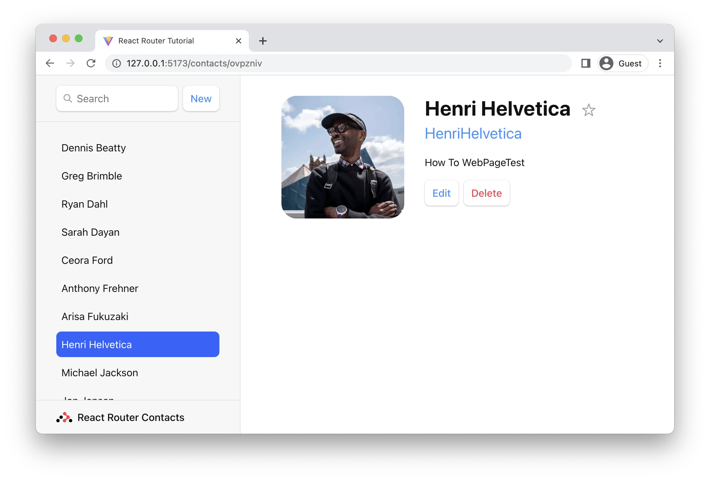
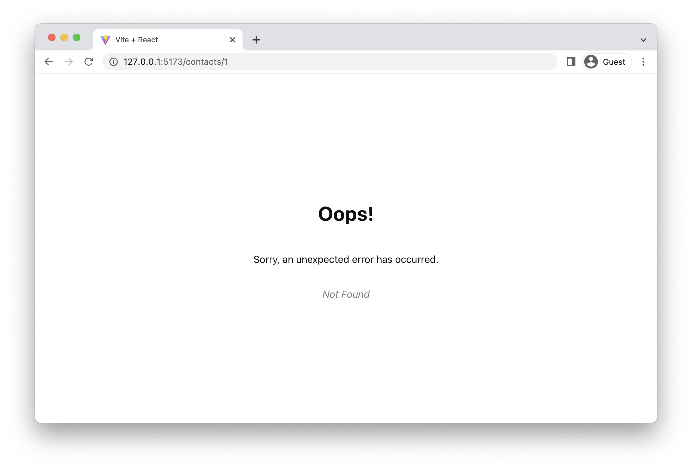
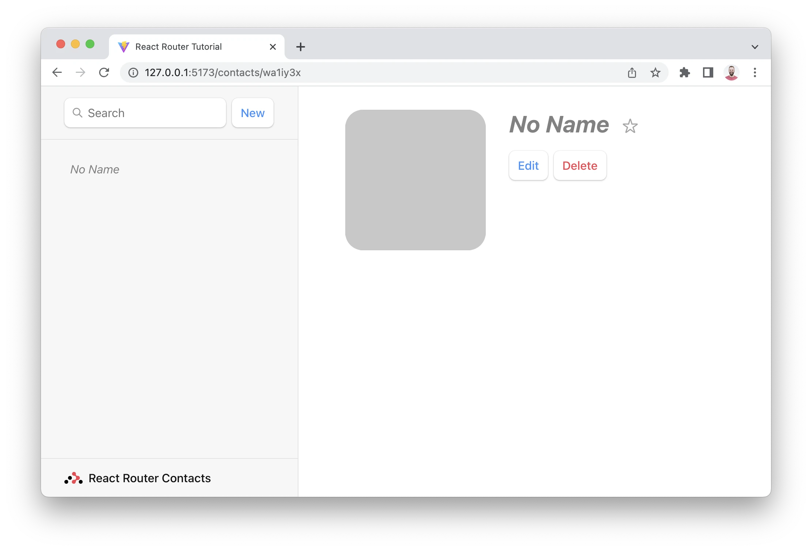
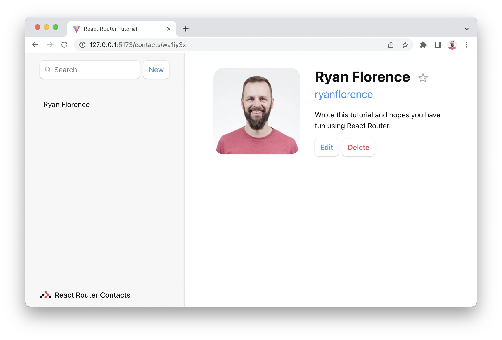
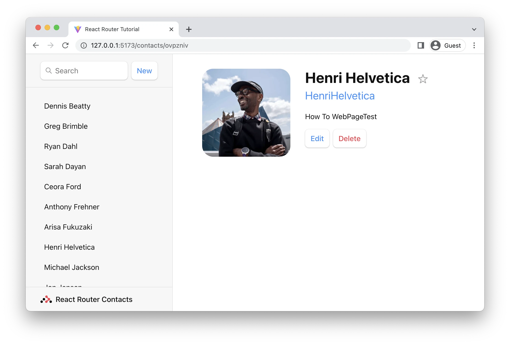
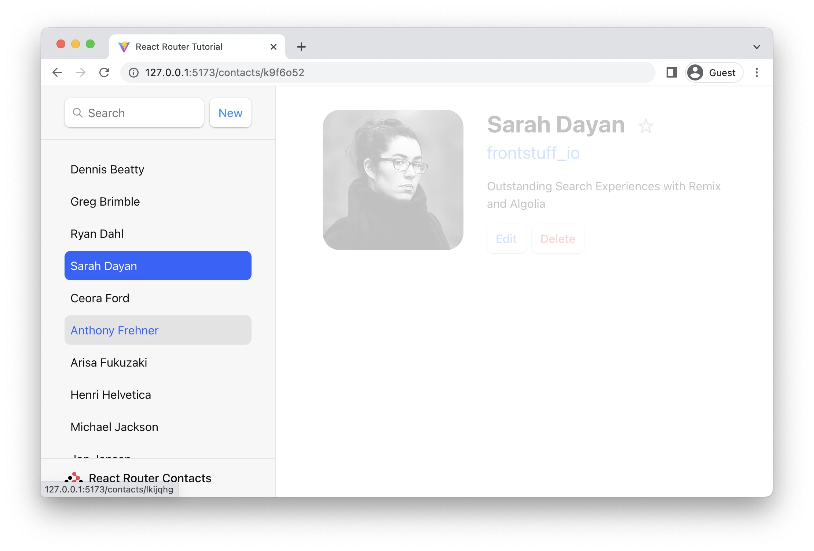
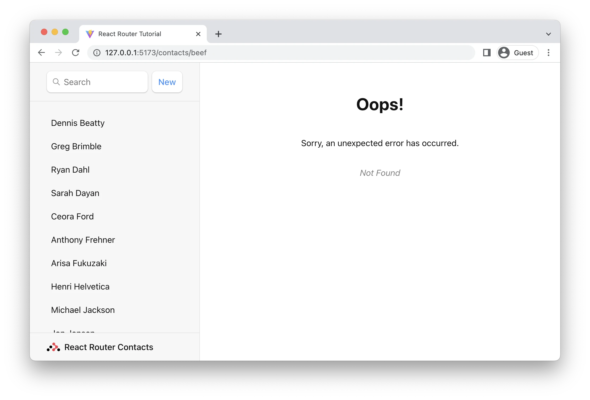

# [React Router](https://www.theodinproject.com/lessons/node-path-react-new-react-router)

## Introduction

Up until this point in the curriculum, we have been building one-page applications. However, for any larger scale application, we are going to have multiple pages. Thankfully, the browser allows client-side JavaScript to manage the way a user can navigate, with the [History API](https://www.theodinproject.com/lessons/node-path-react-new-react-router). We can leverage the power of this to manage routing in React with the help of a package like React Router.

<br>

## Lesson Overview

This section contains a general overview of topics that you will learn in this lesson.

- Understand what client-side routing is.

- Learn how to use React Router for client-side routing.

- Explore how to create nested and dynamic paths in React Router.

- Discover how to add a 'catch-all' route in React Router

- Learn how to pass data from a parent component to any child components rendered via an outlet.

- Understand how to implement protected routes in React Router.

<br>

## Client-side routing

Client-side routing is the type of routing where JavaScript takes over the duty of handling the routes in an application. Client-side routing helps in building single-page applications (SPAs) without refreshing as the user navigates. For example, when a user clicks a navbar element, the URL changes and the view of the page is modified accordingly, within the client.

Say you are cooking some chicken. If you want to cook it well and nice, you will have to:

1. Put the chicken in the oven and set it to cook with appropriate time and heating

2. Wait till the dish gives out that satisfying smell

3. Start munching!

This is common to all websites, you set the oven up for what you want (visit any URL, like https://theodinproject.com), wait for the oven to be done with the cooking (the loading screen), and tada, enjoy your delicious food (your page is ready for use). But what if you forgot to add some spices before you cooked it up? You have to repeat this flow again:

1. Get up from your seat

2. Add the spices to the chicken

3. Go back to the oven, put the chicken back in and set it up to be reheated

4. Wait for it to be nice and warm

5. Now you can eat it!

Here is where we reiterate, **you need to get up from your seat.** In a general multi-page applications (MPA), the browser reloads every time you click on a link to navigate. With client-side routing, **you never leave the page you are on** -- you bring a microwave to the table to ensure that you don't have to get up from your seat should you ever run into the "missing spices" issue. The link requests are intercepted by the JavaScript that you write, instead of letting them go directly to the server.

<br>

## A Reactive solution

While client-side routing allows for nicer, app-like interactions (since you are controlling the routes, you can make fancy CSS animations across route changes), a lot of caveats can be missed. When a browser reloads, it notifies screen-readers of new content to read, but in the case of client-side routing, you will need to notify screen-readers of route updates manually. However, with the help of a robust library, you can often address these concerns!

React Router is a standard routing library for React applications. By using React Router, we can specify React components, that can be rendered based on the oute, and so much more. Let's dive in!

<br>

## Adding a router

Let's make a small app to understand how this router is implemented. Create a new React project and let's start by adding some mock pages as an example. Create a new `Profile.jsx` file with the following component:

```js
const Profile = () => {
	return (
		<div>
			<h1>Hello from profile page!</h1>
			<p>So, how are you?</p>
		</div>
	)
}

export default Profile
```

Replace the `App.jsx` with some basic content too:

```js
const App = () => {
	return (
		<div>
			<h1>Hello from the main page of the app!</h1>
			<p>Here are some examples of links to other pages</p>
			<nav>
				<ul>
					<li>
						<a href='profile'>Profile page</a>
					</li>
				</ul>
			</nav>
		</div>
	)
}
```

Now it's time to add the router! There's a couple of ways of defining our app's routes, but in **React Router v6.7.0 or higher**, it is recommended to add routes as objects.

Let us install the React Router package:

`npm install react-router-dom`

Add the following to `main.jsx`, we will talk about what is happening in a little bit.

```js
import { StrictMode } from 'react'
import { createRoot } from 'react-dom/client'
import { createBrowserRouter, RouterProvider } from 'react-router-dom'
import App from './App'
import Profile from './Profile'

const router = createBrowserRouter([
	{
		path: '/',
		element: <App />,
	},
	{
		path: 'profile',
		element: <Profile />,
	},
])

createRoot(document.getElementById('root')).render(
	<StrictMode>
		<RouterProvider router={router} />
	</StrictMode>
)
```

Once this is done, go ahead and run `npm run dev` and check out both routes: the home route `/` and the profile route `/profile`. It works! But what is happening here?

1. We import `createBrowserRouter` and `RouterProvider` from React Router.

2. `createBrowserRouter` is used to create the configuration for a router by passing arguments in the form of an array of routes.

3. The configuration array contains objects with two mandatory keys, the path, and the corresponding element to be rendered.

4. This generated configuration is then rendered in, by passing it to the `RouterProvider` component.

<br>

## The link element

But you may notice, when we click the links in the navbar, the browser is reloading for the next URL instead of using React Router. This isn't what was promised! To help with this, [React Router exports a custom `Link` element](https://api.reactrouter.com/v7/functions/react_router.Link.html) to be used instead of the regular `a` tag. We can replace the `a` tag in our navbar with the `Link` element.

> **Function Link**
> A progressively enhanced `<a href>` wrapper to enable navigation with client-side routing.
>
> ```js
> import { Link } from 'react-router'
>
> <Link to='/dashboard'>Dashboard</Link>
>
> <Link to={{ pathname: '/some/path', search: '?query=string', hash: '#hash' }}/>
> ```

```js
import { Link } from 'react-router-dom'

const App = () => {
	return (
		<div>
			<h1>Hello from the main page of the app!</h1>
			<p>Here are some examples of links to other pages</p>
			<nav>
				<ul>
					<li>
						<Link to='profile'>Profile page</Link>
					</li>
				</ul>
			</nav>
		</div>
	)
}

export default App
```

And now, we don't get the browser reloading every time we click the link on the navbar!

<br>

## Nested routes, outlets and dynamic segments

Now, what if you want to render a section of a page differently, based on different URLs? This is where nested routes come into play! We can add routes nested as the children of one another to ensure that the child gets rendered alongside the parent. Create a couple of components, `Popeye.jsx` and `Spinach.jsx`.

```js
import { Link } from 'react-router-dom'

const Popeye = () => {
	return (
		<>
			<p>Hi, I am Popeye! I love to eat Spinach!</p>
			<Link to='/'>Click here to go back</Link>
		</>
	)
}

export default Popeye
```

```js
import { Link } from 'react-router-dom'

const Spinach = () => {
	return (
		<>
			<p>Hi, I am Spinach! Popeye loves to eat me!</p>
			<Link to='/'>Click here to go back</Link>
		</>
	)
}

export default Spinach
```

Now, we can rewrite the routes as given:

```js
import { StrictMode } from 'react'
import { createRoot } from 'react-dom/client'
import { createBrowserRouter, RouterProvider } from 'react-router-dom'
import App from './App'
import Profile from './Profile'
import Spinach from './Spinach'
import Popeye from './Popeye'

const router = createBrowserRouter([
	{
		path: '/',
		element: <App />,
	},
	{
		path: 'profile',
		element: <Profile />,
		children: [
			{ path: 'spinach', element: <Spinach /> },
			{ path: 'popeye', element: <Popeye /> },
		],
	},
])

createRoot(document.getElementById('root')).render(
	<StrictMode>
		<RouterProvider router={router} />
	</StrictMode>
)
```

This allows us to render the child component alongside the parent, through an [Outlet component](https://api.reactrouter.com/v7/functions/react_router.Outlet.html)! We can rewrite the Profile component to add an `Outlet` which will get replaced by the various profiles when that route is visited!

```js
import { Outlet } from 'react-router-dom'

const Profile = () => {
	return (
		<div>
			<h1>Hello from your profile page!</h1>
			<p>So, how are you?</p>
			<hr />
			<h2>The profile visited is here:</h2>
			<Outlet />
		</div>
	)
}

export default Profile
```

Check out the `/profile` page. To visit `/profile/popeye` or `/profile/spinach` pages, manually add `/popeye` or `/spinach` to the end of the current URL. The `<Outlet />` component gets replaced with the children component when their paths are visited.

If you want to render something as a default component when no path is added to Profile, you can add an index route to the children!

Create a DefaultProfile component:

```js
const DefaultProfile = () => {
	return <p>Oh, nothing to see here!</p>
}

export default DefaultProfile
```

Now, add an index property with the DefaultProfile as a child to the `/profile` route.

```js
import { StrictMode } from 'react'
import { createRoot } from 'react-dom/client'
import { createBrowserRouter, RouterProvider } from 'react-router-dom'
import './index.css'
import App from './App.jsx'
import Profile from './components/Profile.jsx'
import DefaultProfile from './components/DefaultProfile.jsx'
import Popeye from './components/Popeye.jsx'
import Spinach from './components/Spinach.jsx'

const router = createBrowserRouter([
	{
		path: '/',
		element: <App />,
	},
	{
		path: 'profile',
		element: <Profile />,
		children: [
			{ index: true, element: <DefaultProfile /> },
			{ path: 'spinach', element: <Spinach /> },
			{ path: 'popeye', element: <Popeye /> },
		],
	},
])

createRoot(document.getElementById('root')).render(
	<StrictMode>
		<RouterProvider router={router} />
	</StrictMode>
)
```

If you visit the `/profile` path now, you should be able to see some default content where the `Outlet` is rendered when the index path is rendered!

But this example brings another dilemma. Sometimes, we want to render content according to the URLs. That, here, would mean that we should be able to render content dynamically, from the component itself. Thankfully, you can do so with dynamic segments! Change the routes to be the following:

```js
import { StrictMode } from 'react'
import { createRoot } from 'react-dom/client'
import { createBrowserRouter, RouterProvider } from 'react-router-dom'
import './index.css'
import App from './App.jsx'
import Profile from './components/Profile.jsx'

const router = createBrowserRouter([
	{
		path: '/',
		element: <App />,
	},
	{
		path: 'profile/:name',
		element: <Profile />,
	},
])

createRoot(document.getElementById('root')).render(
	<StrictMode>
		<RouterProvider router={router} />
	</StrictMode>
)
```

The colon (`:`) turns the path section after it into a "dynamic segment". Dynamic segments will match dynamic (changing) values in that position of the URL, like the `name`. These can also be called "URL params" or "params" in short. These can be used with the help of the `useParams` hook. We can thus rewrite the Profile component as the following:

```js
import { useParams } from 'react-router-dom'
import DefaultProfile from './DefaultProfile'
import Spinach from './Spinach'
import Popeye from './Popeye'

const Profile = () => {
	const { name } = useParams()

	return (
		<div>
			<h1>Hello from profile page!</h1>
			<p>So, how are you?</p>
			<hr />
			<h2>The profile visited is here:</h2>
			{name === 'popeye' ? (
				<Popeye />
			) : name === 'spinach' ? (
				<Spinach />
			) : (
				<DefaultProfile />
			)}
		</div>
	)
}

export default Profile
```

<br>

## Handling bad URLs

But alas, the index path doesn't work with this anymore, as in the `/profile` path, no params are actually passed. Actually, the `/profile` path doesn't make much sense without an actual name, else whose profile is it supposed to show, right? So, the application shows an error! This can't be good, so how do you show a default page in case the user visits a wrong or unused path? You can pass in an `errorElement` argument here! Create a basic 'Not Found' page:

```js
import { Link } from 'react-router-dom'

const ErrorPage = () => {
	return (
		<div>
			<h1>Oh no, this route doesn't exist!</h1>
			<Link to='/'>
				You can go back to the home page by clicking here, though!
			</Link>
		</div>
	)
}

export default ErrorPage
```

Add the `errorElement` to this configuration, and verify that it renders an error page by going to the `/profile` path or any unmentioned paths. We'll wire this back up in the assignment.

```jsx
import { StrictMode } from 'react'
import { createRoot } from 'react-dom/client'
import { createBrowserRouter, RouterProvider } from 'react-router-dom'
import './index.css'
import App from './App.jsx'
import Profile from './components/Profile.jsx'
import ErrorPage from './components/ErrorPage.jsx'

const router = createBrowserRouter([
	{
		path: '/',
		element: <App />,
		errorElement: <ErrorPage />,
	},
	{
		path: 'profile/:name',
		element: <Profile />,
	},
])

createRoot(document.getElementById('root')).render(
	<StrictMode>
		<RouterProvider router={router} />
	</StrictMode>
)
```

<br>

## Refactoring the routes

Lert's refactor our array of routes into its own file. By refactoring, we can import the routes into `main.jsx` and create a browser router from it, as in the above example. What's convenient about this is that we can also import the routes array into any test files, where we might need to create a [memory router](https://api.reactrouter.com/v7/functions/react_router.createMemoryRouter.html) instead of a browser router.

Create a new `routes.jsx` file and move the routes array to it:

```js
import App from './App'
import Profile from './components/Profile'
import ErrorPage from './components/ErrorPage'

const routes = [
	{
		path: '/',
		element: <App />,
		errorElement: <ErrorPage />,
	},
	{
		path: '/profile/:name',
		element: <Profile />,
	},
]

export default routes
```

Import the routes to your `main.jsx` file:

```js
import { StrictMode } from 'react'
import { createRoot } from 'react-dom/client'
import { createBrowserRouter, RouterProvider } from 'react-router-dom'
import routes from './routes'
import './index.css'

const router = createBrowserRouter(routes)

createRoot(document.getElementById('root')).render(
	<StrictMode>
		<RouterProvider router={router} />
	</StrictMode>
)
```

Much nicer!

<br>

## Outlets and state

As we learned earlier, you can nest routes as children of a parent route, allowing you to use an `<Outlet />` in the parent to render the appropriate element based on the rest of the path.

If we had data in the parent element, such as a state, that we wanted to pass to any components rendered by that outlet, we would have to use something called `context`. For now, we will focus on context with outlets, but in a later lesson, we will learn more about how to use context without outlets.

Outlets have a `context` prop built in. We can pass any value we want into this prop, even an array or object. Inside _any_ component that would be rendered within that outlet (even "grandchild" components), we can call the `useOutletContext()` hook which will return whatever we passed into that context prop. If we passed in an array or object, we could even destructure it!

Take a look at React Router's documentation on `useOutletContext` to learn more about how to pass context through an outlet and access that context in child components.

<br>

## Protected routes and navigation

Often, you will need to decide whether a certain route should be rendered or not. One example is authentication, where you render certain routes based on if the user is logged in or not. If they are logged in, you show some information about the user like here at [The Odin Project dashboard page](https://www.theodinproject.com/dashboard). Otherwise, they are redirected to the sign-in page (this could be any page). While there are many ways to do so, one of the easiest ways is to conditionally create a config for the router.

You will often come across the need to reroute the user to a different URL programmatically. This is where we use [the `<Navigate />` component](https://api.reactrouter.com/v7/functions/react_router.Navigate.html). The `<Navigate />` component reroutes the user to the desired URL when it is rendered. It is a wrapper around [the useNavigate hook](https://api.reactrouter.com/v7/functions/react_router.useNavigate.html) that lets you navigate programmatically, to URLs, or even go back down the user's history.

<br>

## Conclusion

You should now have enough basics to get started with React routing. There are a lot more features to react-router-dom which are extremely useful, but out of the scope of this lesson. We're confident that the concepts covered above should be enough to get you through the React course. If you are interested in learning some more, we recommend you look into the history or match object. Definitely go and check out more advanced concepts once you are familiar with the basics.

<br>

## Knowledge Check

- **What does client-side routing mean?**

Client-side routing is the type of routing where JavaScript takes over the duty of handling the routes in an application. Client-side routing helps in building single-page applications (SPA) without refreshing as the user navigates. For example, when a user clicks a navbar element, the URL changes and the view of the page is modified accordingly, within the client.

<br>

- **How do you set up a basic router?**

```js
import { StrictMode } from 'react'
import { createRoot } from 'react-dom/client'
import { createBrowserRouter, RouterProvider } from 'react-router'
import App from './App'
import Profile from './Profile'

const router = createBrowserRouter([
	{
		path: '/',
		element: <App />,
	},
	{
		path: 'profile',
		element: <Profile />,
	},
])

createRoot(document.getElementById('root')).render(
	<StrictMode>
		<RouterProvider router={router} />
	</StrictMode>
)
```

1. We import `createBrowserRouter` and `RouterProvider` from React Router

2. `createBrowserRouter` is used to create the configuration for a router by passing arguments in the form of an array of routes.

3. The configuration array contains objects with two mandatory keys, the path and the corresponding element to be rendered.

4. This generated configuration is then rendered in, by passing it to the `RouterProvider` component.

<br>

- **What should be used in place of "a" tags to enable client-side routing?**

React Router exports a custom `Link` element to be used instead of the regular `a` tag.

<br>

- **How do you create nested routes?**

Nested routes are created by passing in `children` key to the object in the configuration. The `children` key is an array of objects with `path` and `element` keys.

<br>

- **What do you mean by dynamic segments or URL params?**

```js
{
  path: 'profile/name',
  element: <Profile />
}
```

The color (:) turns the path section after it into a "dynamic segment". Dynamic segments will match dynamic (changing) values in that position of the URL, like the `name`. These can also be called "URL params" or "params" in short. These can be used with the help of the `useParams` hook.

<br>

- **How do you handle errors from bad URLs?**

You can pass in an `errorElement` to the configuration.

```js
{
  path: '/',
  element: <App />,
  errorElement: <ErrorPage />
}
```

<br>

- **How do you pass data from a parent to child through an `<Outlet />` component?**

You can nest routes as children of a parent route, allowing you to use an `<Outlet />` in the parent to render the appropriate element based on the rest of the path.

If we had data in the parent element, such as a state, that we wanted to pass to any components rendered by that outlet, we would have to use something called `context`.

Outlets have a `context` prop built in. We can pass any value we want into this prop, even an array or object. Inside _any_ component that would be rendered within that outlet (even "grandchild" components), we can call the `useOutletContext()` hook which will return whatever we passed into that context prop. If we passed in an array or object, we could even destructure it.

<br>

Often parent routes manage state or other values you want shared with child routes. You can create your own context provider if you like, but this is such a common situation that it's built-into `<Outlet />`

```js
function Parent() {
	const [count, setCount] = React.useState(0)
	return <Outlet context={[count, setCount]} />
}
```

```js
import { useOutletContext } from 'react-router-dom'

function Child() {
	const [count, setCount] = useOutletContext()
	const increment = () => setCount((c) => c + 1)
	return <button onClick={increment}>{count}</button>
}
```

<br>

- **How do you create protected routes?**

Protected routes are created by conditionally rendering the route whether they are logged in or not.

<hr>
<br>
<br>

# [Working with the History API](https://developer.mozilla.org/en-US/docs/Web/API/History_API/Working_with_the_History_API)

The History API enables a website to interact with the browser's session history: that is, the list of pages that the user has visited in a given window. As the user visits new pages, for example by clicking links, those new pages are added to the session history. The user can also move back and forth through the history using the browser's "Back" and "Forward" buttons.

The main interface defined in the History API is the `History` interface, and this defines two quite distinct set of methods:

1. Methods to navigate to a page in the session history:

   - `History.back()`

   - `History.forward()`

   - `History.go()`

2. Methods to modify the session history:

   - `History.pushState()`

   - `History.replaceState()`

In this guide, we'll cover only the second set of methods.

The `pushState()` method adds a new entry to the session history, while the `replaceState()` method updates the session history entry for the current page. Both these methods take a `state` parameter which can contain any serializable object. When the browser navigates to this history entry, the browser fires a `popstate` event, which contains the state object associated with that entry.

The main purpose of these APIs is to support websites like Single-page applications, that use JavaScript APIs such as `fetch()` to update the page with new content, instead of loading a whole new page.

<br>

## Single-page applications and session history

Traditionally, websites are implemented as a collection of pages. When users navigate to different parts of the site by clicking links, the browser loads a whole new page each time.

While this is great for many sites, it can have some disadvantages:

- It can be inefficient to load a whole page every time, when only part of the page needs to be updated.

- It is hard to maintain application state when navigating across pages.

For these reasons, a popular pattern for web apps is the single-page application (SPA). When a user clicks a link, the SPA performs the following steps:

1. Prevents the default behavior of loading a new page.

2. Fetches new content to display

3. Updates the page with the new content

For example:

```js
document.addEventListener('click', async (event) => {
	const creature = event.target.getAttribute('data-creature')
	if (creature) {
		// Prevent a new page from loading
		event.preventDefault()
		try {
			// Fetch new content
			const response = await fetch(`creatures/${creature}.json`)
			const result = await response.json()
			// Update the page with the new content
			displayContent(result)
		} catch (err) {
			console.error(err)
		}
	}
})
```

In this click handler, if the link contains a data attribute `'data-creature'` then we use the value of that attribute to fetch a JSON file containing the new content for the page.

The JSON file might look like this:

```json
{
	"description": "Bald eagles are not actually bald.",
	"image": {
		"src": "images/eagle.jpg",
		"alt": "A bald eagle"
	},
	"name": "Eagle"
}
```

Our `displayContent()` function updates the page with the JSON:

```js
// Update the page with the new content
function displayContent(content) {
	document.title = `Creatures: ${content.name}`

	const description = document.querySelector('#description')
	description.textContent = content.description

	const photo = document.querySelector('#photo')
	photo.setAttribute('src', content.image.src)
	photo.setAttribute('alt', content.image.alt)
}
```

The problem is that it breaks the expected behavior of the browser's 'Back' and 'Forward' buttons.

From the user's point of view, they clicked a link and the page updated, so it looks like a new page. If they then press the browser's 'Back' button, they expect to go to the state before they clicked the link.

But as far as the browser is concerned, the last link didn't load a new page, so 'Back' will take the browser to whichever page was loaded before the user opened the SPA.

This is essentially the problem that `pushState()`, `replaceState()` and the `popstate` event solve. They enable us to synthesize history entries, and to be notified when the current session history entry changes to one of these entries (for example, because the user pressed the 'Back' or 'Forward' buttons).

<br>

## Using `pushState()`

We can add a history entry to the click handler above as follows:

```js
document.addEventListener('click', async (event) => {
	const creature = event.target.getAttribute('data-creature')
	if (creature) {
		// Prevent a new page from loading
		event.preventDefault()
		try {
			const response = await fetch(`creatures/${creature}.json`)
			const result = await response.json()
			displayContent(result)
			// Add a new entry to the history.
			// This simulates loading a new page
			history.pushState(result, '', creature)
		} catch (err) {
			console.error(err)
		}
	}
})
```

Here, we're calling `pushState()` with three arguments:

- `result`: This is the content we just fetched. It will be stored with the history entry, and later included as the `state` property of the argument passed to the `popstate` event handler.

- `""`: This is needed for backward compatibility with legacy sites, and should always be an empty string.

- `creature`: This will be used as the URL for the entry. It will be shown in the browser's URL bar, and will be used as the value of the `Referer` header in any HTTP requests that the page makes. Note that this must be same-origin with the page.

<br>

## Using the `popstate` event

Suppose the user performs the following steps:

1. Click a link in our SPA, so we update the page and add history entry A using `pushState()`.

2. Clicks another link in our SPA, so we update the page and add history entry B using `pushState()`.

3. Presses the 'Back' button.

Now the new current history entry is A, so the browser fires the `popstate` event, and the event handler argument includes the JSON that we passed to `pushState()` when we handled the navigation to A. This means we can restore the correct content with an event handler like this:

```js
// Handle forward/back buttons
window.addEventListener('popstate', (event) => {
	// If a state has been provided, we have a "simulated" page
	// and we update the current page.
	if (event.state) {
		// Simulate the loading of the previous page
		displayContent(event.state)
	}
})
```

<br>

## Using `replaceState()`

There's one more piece we need to add. When the user loads the SPA, the browser adds a history entry. Because this was an actual page load, the entry has no state associated with it. So suppose the user does the following:

1. Loads the SPA, so the browser adds a history entry.

2. Clicks a link inside the SPA, so the click handler updates the page and adds a history entry with `pushState()`.

3. Presses the 'Back' button.

Now we want to go back to the SPA's initial state, but since this is a navigation in the same document, the page will not be reloaded, and since the history entry for the initial page has to no state, we can't use the `popstate` to restore it.

The solution here is to use `replaceState()` to set the state object for the initial page. For example:

```js
// Create state on page load and replace the current history with it
const image = document.querySelector('#photo')
const initialState = {
	description: document.querySelector('#description').textContent,
	image: {
		src: image.getAttribute('src'),
		alt: image.getAttribute('alt'),
	},
	name: 'Home',
}

history.replaceState(initialState, '', document.location.href)
```

On page load, we collect all the parts of the page that we need to restore when the user returns to the starting point for the SPA. This has the same structure as the JSON we fetch when handling other navigations. We pass this `initialState` object into `replaceState()`, which effectively adds the state object to the current history entry.

When the user returns to our starting point, the `popstate` event will contain this initial state, and we can use our `displayContent()` function to update the page.

<hr>
<br>
<br>

# [`useOutletContext`](https://reactrouter.com/6.30.1/hooks/use-outlet-context)

Often parent routes manage state or other values you want shared with child routes. You can create your own [context provider](https://react.dev/learn/passing-data-deeply-with-context) if you like, but this is such a common situation that it's built into `<Outlet />`:

```js
function Parent() {
	const [count, setCount] = React.useState(0)
	return <Outlet context={[count, setCount]} />
}
```

```js
import { useOutletContext } from 'react-router-dom'

function Child() {
	const [count, setCount] = useOutletContext()
	const increment = () => setCount((c) => c + 1)
	return <button onClick={increment}>{count}</button>
}
```

If you're using TypeScript, we recommend the parent component provide a custom hook for accessing the context value. This makes it easier for consumers to get nice typings, control consumers, and know who's consuming the context value. Here's a more realistic example:

```tsx
import * as React from 'react'
import type { User } from './types'
import { Outlet, useOutletContext } from 'react-router-dom'

type ContextType = { use: User | null }

export default function Dashboard() {
	const [user, setUser] = React.userState<User | null>(null)

	return (
		<div>
			<h1>Dashboard</h1>
			<Outlet context={{ user } satisfies ContextType} />
		</div>
	)
}

export function useUser() {
	return useOutletContext<ContextType>()
}
```

```tsx
import { useUser } from '../dashboard'

export default function DashboardMessages() {
	const { user } = useUser()

	return (
		<div>
			<h2>Messages</h2>
			<p>Hello, {user.name}</p>
		</div>
	)
}
```

<hr>
<br>
<br>

# [Understanding single page apps & client-side routing](https://bholmes.dev/blog/spas-clientside-routing/)

"SPA" has been a hot topic ever since "modern" JS frameworks like React hit the scene. They promise all sorts of benefits like _dynamic user interactions_, _lightning-fast load times_, _solving world hunger_, etc (okay that last one is a stretch..)

But have you ever stopped to wonder what's _actually_ going on behind the scenes?: And if you're _not_ using SPA, are you stuck in the past? Well, let's explore:

- How non-SPAs work + how they perform on the modern web (spoiler, they're a great choice as always!)

- They key benefits and inner workings of an SPA

- A side-by-side visual comparison feat. juicy burgers

<br>

## First off, how do non-SPAs work?

Web development has been soaking in acronym soup lately, so I think it's worth clarifying what isn't an SPA first.

If your site isn't an SPA, you're likely using what's called "server-based routing". A metaphor is in order here. Say you're at a formal, sit-down restaurant with a waiter (a server if you will). If you want food, you'll have to:

1. Ask the waiter for the food you want

2. Wait a moment for the dish to get prepared

3. Receive your finished plate once it's done

This is how all websites work when you first visit them. You ask for what you want (visiting a URL like `https://breakfast.club`), wait for the server to get back to you (loading spinner), then enjoy your "meal" once it's ready (the page is done loading).

**But what if you want to order dessert?** Heading back to our restaurant scenario, you'll go through the same flow as last time:

1. Ask the waiter for the yummiest dessert

2. Hand them your dirty plates

3. Wait a moment for the dish to get prepared

4. Receive a shiny new bowl with your ice cream sundae

There's an important bit I want to reiterate there: **you hand over your dirty plates, and get back a brand new one.** This is why you'll see a little loading bar re-appear every time you jump to a new page. Here's an example of 11ty's documentation using server-based routing:


Watch the loading bar engage whenever we click a link.

At first, it looks like you're still on the same page whenever you click those navigation links, and the browser's only refreshes the bits that change (the documentation).

**But that's not really the case!** Whenever you click a link, your browser is "clearing your plate" (removing _everything_ from the page) and pulling in a fresh meal, navigation and all. So you're really reloading all those pieces of navigation every time you visit a new page, even if they were _already_ on your plate to begin with.

<br>

### Wait, is that wasteful?

It may sound like the browser's doing a lot of extra work here! Although this _is_ still an issue that SPAs can help with, it's not as problematic as it used to be. Here's a few efficiency points to consider:

**1. HTML is super cheap to load and render**

Even though the browser is "re-painting" the page from scratch every time, it only takes a few milliseconds to load that HTML skeleton. The truly expensive bits are they styles, scripts, and images the browser needs to fetch, which leads us to...

**2. Shared resources don't need to get reloaded**

For instance, say every documentation page pulls in the same CSS file: `<link rel='stylesheet' href='documentation.css'>`. When you click another link that _also_ pulls this CSS, the browser's smart enough to say 'oh, I loaded this already! I'll use that and apply to the page.' The same goes for images and fonts as well.

> **Note:** This is all thanks to caching. If you want to go deeper, the Remix team has an excellent walkthrough on caching documents, resources and more [over here](https://www.youtube.com/watch?v=3XkU_DXcgl0).

So the actual _loading_ of these shared resources isn't a problem. But what about _painting_ those resources to the page over and over again? This brings us to...

**3. The next page only appears when it's ready**

Back in the day, there was a risk you'd see a flash of white nothingness between "clearing the plate" and "receiving the new one". But [modern browsers have pretty much resolved this](https://developers.google.com/web/updates/2019/05/paint-holding)! In short, web browsers wait for the signal that the next page isn't just "done loading", but is also ready for you to view and interact with. Think of this like bringing out your plate when it's ready to eat, instead of bringing you a plate of ingredients you have to assemble yourself.

This especially helps out pages that rely on blocking resources like JavaScript to render everything on the page. Here's a quick before-and-after shot by the Chrome team when they launched this concept:


> **Disclaimer:** The browser won't always wait for the next page to be interactive before showing it. It will show the half-finished page if you're on a slow internet connection and the browser decides it's waited too long. Still, for snappier websites, it shouldn't be a problem!

<br>

## Now, let's talk single page apps

So how do SPAs compare? Well, let's revisit that restaurant example from before. When you first visit a site using the SPA approach, everything works pretty much the same:

1. Ask the server for the food you want (visit `https://spa-breakfast.club`)

2. Wait a moment for the dish to get prepared (browser loading spinner)

3. Receive your finished plate once it's done (the page is done loading)

Now the interesting part comes when you go back for seconds. When you click a link on an SPA, it replaces the typical, server-based routing with client-side routing. In other words, we process all link requests using JavaScript we wrote ourselves, instead of sending those requests to the server right away:

Here's a code snippet to get your brain moving:

```html
<a href="/desert">Go eat desert</a>
<script>
	document.addEventListener('click', (event) => {
	  if (
	    // if you clicked on an A-nchor tag (link)
	    event.target.tagName === 'A' &&
	    // and you're going to a page on this domain (like /desert)
	    event.target.origin === location.origin
	  ) {
	    // don't ask the server for that resource!
	    event.preventDefault()
	    // instead, we'll go fetch the resource ourselves
	    const response = fetch('https://buffet.table/desert')
	    // ... convert that response to something we can work with
	    const htmlString = await response.text()
	    const desert = new DOMParser().parseFromString(htmlString, 'text/html')

	     // ... and do something with that desert element
	     // example: append desert to our "plate" in the DOM
	     document.querySelector('.my-plate').appendChild(desert)
	  }
	})
</script>
```

Pretty weird, right? This is the super-simplified crux of an SPA: **you never truly "leave" the page you started on.** Instead, you intercept all future requests (link clicks) and handle the fetching yourself. You'll often do this using the fetch API native to all modern browsers as demo-d above.

This is why I'd think of SPAs and client-side routing like a buffet. Instead of ordering your meal and waiting for it to get prepared, you can get out of your seat and grab that pre-prepared food yourself!

<br>

## Key benefits to this approach

There are 2 major benefits to single page apps that clientside routing unlocks

First, **load-time efficient _can_ go up**: I say "can" because of all the server-side routing optimization I mentioned previously (which may cancel out any performance gains). But there _is_ a noticeable difference for resource-hungry frameworks like React, Vue, and Svelte. All of these use some form of client-side routing to keep JavaScript load times to a minimum.

For instance, if I went from one page of a React app to another using server-side routing, the browser would re-parse and re-render the whole page using JavaScript! This can severely impact your "time to interactive" an accessibility concern you can learn more about [here](web.dev/interactive/).

Second, **you can now build dynamic, app-like interactions**: Animated page transitions are the easiest to point out here. Since you're fully in control of loading new content and applying it to the page, you can pull off all sorts of CSS trickery like cross-fades, pop-up modals, tab sliders, and more. Here's an example from my personal site using client-side routing:


<br>

## A juicy visual comparison

Now that we've introduced SPAs + client-side routing as a concept, let's see a side-by-side comparison with server-side routing.

Say you receive your order for a juicy burger that's cooked medium rare, but would rather have a patty that's well done.

We'll imagine this moment as "clicking a link", requesting to go from `/medium-rare-burger` to `/well-done-burger`.

Here's what that "click" may do with a server-based approach:


Then, here's how the client-side routing may handle the request:


Notice that we never clear our page in the SPA approach! We just request the resource (a well-done burger), pick out the pieces we want to add to our page (the patty), and perform the DOM manipulation with JavaScript.

This doesn't have much performance benefits when we're talking HTML files. But if that HTML has some JavaScript and styles attached to it that we can _also_ fetch (like, say, a React component), there's a lot of room for performance gains.

<br>

## Wrapping up: so which should I choose?

Although SPAs seem like the "silver bullet" for any website, there's a case to be made for either approach.

- The most obvious win for server-side routing is, **well, it's just simpler.** No need to write and maintain all those click listeners: just let the browser do the serving for you. Yes, you'll often use a framework-specfici library for SPAs like React Router, but learning and updating JS libraries is always more overhead.

- The seconde win for server-side is **no accessbility worries.** When you handle all the routing client-side, you run the risk of hurting screen-reader and keyboard experiences. For instance, you'll need to alert screen-reader users that new content has appeared on the page whenever they click a link. And for keyboard-ists, you need to make sure they're focusing the right element when something new swipes into view.

But if you're addressing these concerns confidently (or using a robust library to do it for you), SPAs are a great way to go!

<hr>
<br>
<br>

# [Tutorial React Router](https://reactrouter.com/6.28.0/start/tutorial)

Welcome to the tutorial! We'll be building a small, but feature-rich app that lets you keep track of your contacts. We expect it to take between 30-60m if you're following along.



<br>

## Setup

We'll be using Vite for our bundler and dev server for this tutorial. You'll need Node.js installed for the `npm` command line tool.

**Open up your terminal and bootstrap a new React app with Vite:**

```
npm create vite@latest name-of-your-project -- --template react
# follow prompts
cd <your new project directory>
npm install react-router-dom # always need this!
npm install localforage match-sorter sort-by # only for this tutorial
npm run dev
```

You should be able to visit the URL printed in the terminal:

```
VITE v3.0.7  ready in 175 ms

  ➜  Local:   http://127.0.0.1:5173/
  ➜  Network: use --host to expose
```

We've got some pre-written CSS for this tutorial so we can stay focused on React Router. Feel free to judge it harshly or write your own. (We did things we normally wouldn't in CSS so that the markup in this tutorial could stay as minimal as possible.)

**Copy/Paste the tutorial CSS [found here](https://gist.githubusercontent.com/ryanflorence/ba20d473ef59e1965543fa013ae4163f/raw/499707f25a5690d490c7b3d54c65c65eb895930c/react-router-6.4-tutorial-css.css) into `src/index.css`**

This tutorial will be creating, reading, searching, updating, and deleting data. A typical web app would probably be talking to an API on your web server, but ew're going to use browser storage and fake some network latency to keep this focused. None of this code is relevant to React Router, so just go ahead and copy/paste it all.

**Copy/Paste the tutorial data module [found here](https://gist.githubusercontent.com/ryanflorence/1e7f5d3344c0db4a8394292c157cd305/raw/f7ff21e9ae7ffd55bfaaaf320e09c6a08a8a6611/contacts.js) into `src/contacts.js`**

All you need in the src folder are `contacts.js`, `main.jsx`, and `index.css`. You can delete anything else (like `App.js` and `assets` etc.)

**Delete unused files in `src/` so all you have left are these:**

```
src
├── contacts.js
├── index.css
└── main.jsx
```

If your app is running, it might blow up momentarily, just keep going. And with that, we're ready to get started!

<br>

## Adding a Router

First thing to do is create a Browser Router and configure our first route. This will enable client side routing for our web app.

The `main.jsx` file is the entry point. Open it up and we'll put React Router on the page.

**Create and render a browser router in `main.jsx`**

```js
import * as React from 'react'
import * as ReactDOM from 'react-dom/client'
import { createBrowserRouter, RouterProvider } from 'react-router-dom'
import './index.css'

const router = createBrowserRouter([
	{
		path: '/',
		element: <div>Hello world!</div>,
	},
])

ReactDOM.createRoot(document.getElementById('root')).render(
	<React.StrictMode>
		<RouterProvider router={router} />
	</React.StrictMode>
)
```

This first route is what we often call the "root route" since the rest of our routes will render inside of it. It will serve as the root layout of the UI, we'll have nested layouts as we get farther along.

<br>

## The Root Route

Let's add the global layout for this app.

**Create `src/routes` and `src/routes/root.jsx`**

```
mkdir src/routes
touch src/routes/root.jsx
```

**Create the root layout component**

```jsx
export default function Root() {
	return (
		<>
			<div id='sidebar'>
				<h1>React Router Contacts</h1>
				<div>
					<form id='search-form' role='search'>
						<input
							id='q'
							aria-label='Search contacts'
							placeholder='Search'
							type='search'
							name='q'
						/>
						<div id='search-spinner' aria-hidden hidden={true} />
						<div className='sr-only' aria-live='polite'></div>
					</form>
					<form method='post'>
						<button type='submit'>New</button>
					</form>
				</div>
				<nav>
					<ul>
						<li>
							<a href={`/contacts/1`}>Your Name</a>
						</li>
						<li>
							<a href={`/contacts/2`}>Your Friend</a>
						</li>
					</ul>
				</nav>
			</div>
			<div id='detail'></div>
		</>
	)
}
```

Nothing React Router specific yet, so feel free to copy/paste all of that

**Set `<Root>` as the root route's element**

```js
/* existing imports */
import Root from './routes/root'

const router = createBrowserRouter([
	{
		path: '/',
		element: <Root />,
	},
])

ReactDOM.createRoot(document.getElementById('root')).render(
	<React.StrictMode>
		<RouterProvider router={router} />
	</React.StrictMode>
)
```

The app should look something like this now.


<br>

## Handling Not Found Errors

It's always a good idea to know how your app responds to error early in the project because we all write far more bugs than features when building a new app! Not only will your users get a good experience when this happens, but it helps you during development as well.

We added some links to this app, let's see what happens when we click them?

**Click one of the sidebar names**


Gross! This is the default error screen in React Router, made worse by our flex box styles on the root element in this app.

Anytime your app throws an error while rendering, loading data, or performing data mutations, React Router will catch it and render an error screen. Let's make our own error page.

**Create an error page component**

```
touch src/error-page.jsx
```

```jsx
import { useRouteError } from 'react-router-dom'

export default function ErrorPage() {
	const error = useRouteError()
	console.error(error)

	return (
		<div id='error-page'>
			<h1>Oops!</h1>
			<p>Sorry, an unexpected error has occurred.</p>
			<p>
				<i>{error.statusText || error.message}</i>
			</p>
		</div>
	)
}
```

**Set the `<ErrorPage>` as the `errorElement` on the root route**

```jsx
/* previous imports */
import ErrorPage from './error-page'

const router = createBrowserRouter([
	{
		path: '/',
		element: <Root />,
		errorElement: <ErrorPage />,
	},
])

ReactDOM.createRoot(document.getElementById('root')).render(
	<React.StrictMode>
		<RouterProvider router={router} />
	</React.StrictMode>
)
```

The error page should now look like this:



Note that `useRouterError` provides the error that was thrown. When the user navigates to routes that don't exist you'll get an error response with a "Not Found" `statusText`. We'll see some other errors later in the tutorial and discuss them more.

For now, it's enough to know that pretty much all of your errors will now be handled by this page instead of infinite spinners, unresponsive pages, or blank screens.

<br>

## The Contact Route UI

Instead of a 404 "Not Found" page, we want to actually render something at the URLs we've linked to. For that, we need to make a new route.

**Create the contact route module**

```
touch src/routes/contact.jsx
```

**Add the contact component UI**

It's just a bunch of elements, feel free to copy/paste

```jsx
import { Form } from 'react-router-dom'

export default function Contact() {
	const contact = {
		first: 'Your',
		last: 'Name',
		avatar: 'https://robohash.org/you.png?size=200x200',
		twitter: 'your_handle',
		notes: 'Some notes',
		favorite: true,
	}

	return (
		<div id='contact'>
			<div>
				
			</div>

			<div>
				<h1>
					{contact.first || contact.last ? (
						<>
							{contact.first} {contact.last}
						</>
					) : (
						<i>No Name</i>
					)}{' '}
					<Favorite contact={contact} />
				</h1>

				{contact.twitter && (
					<p>
						<a target='_blank' href={`https://twitter.com/${contact.twitter}`}>
							{contact.twitter}
						</a>
					</p>
				)}

				{contact.notes && <p>{contact.notes}</p>}

				<div>
					<Form action='edit'>
						<button type='submit'>Edit</button>
					</Form>
					<Form
						method='post'
						action='destroy'
						onSubmit={(event) => {
							if (!confirm('Please confirm you want to delete this record.')) {
								event.preventDefault()
							}
						}}
					>
						<button type='submit'>Delete</button>
					</Form>
				</div>
			</div>
		</div>
	)
}

function Favorite({ contact }) {
	const favorite = contact.favorite
	return (
		<Form method='post'>
			<button
				name='favorite'
				value={favorite ? 'false' : 'true'}
				aria-label={favorite ? 'Remove from favorites' : 'Add to favorites'}
			>
				{favorite ? '★' : '☆'}
			</button>
		</Form>
	)
}
```

Now that we've got a component, let's hook it up to a new route

**Import the contact component and create a new route**

```js
/* existing imports */
import Contact from './routes/contact'

const router = createBrowserRouter([
	{
		path: '/',
		element: <Root />,
		errorElement: <ErrorPage />,
	},
	{
		path: 'contacts/:contactId',
		element: <Contact />,
	},
])

/* existing code */
```

Now if we click one of the links of visit `/contacts/1` we get our new component!


However, it's not inside of our root layout

<br>

## Nested Routes

We want the contact component to render _inside_ of the `<Root>` layout like this.


We do it by making the contact route a _child_ of the root route.

**Move the contacts route to be a child of the root route.**

```js
const router = createBrowserRouter([
	{
		path: '/',
		element: <Root />,
		errorElement: <ErrorPage />,
		children: [
			{
				path: 'contacts/:contactId',
				element: <Contact />,
			},
		],
	},
])
```

You'll now see the root layout again but a blank page on the right. We need to tell the root route
_where_ we want it to render its child routes. We do that with `<Outlet>`

Find the `<div id='detail'>` and put an outlet inside.

**Render an `<Outlet>`**

```js
import { Outlet } from 'react-router-dom'

export default function Root() {
	return (
		<>
			{/* all the other elements */}
			<div id='detail'>
				<Outlet />
			</div>
		</>
	)
}
```

<br>

## Client-Side Routing

You may or may not have noticed, but when we click the links in the sidebar, the browser is doing a full document request for the next URL instead of using React Router.

Client side routing allows our app to update the URL without requesting another document from the server. Instead, the app can immediately render new UI. Let's make it happen with `<Link>`

**Change the sidebar `<a href>` to `<Link to>`**

```js
import { Outlet, Link } from 'react-router-dom'

export default function Root() {
	return (
		<>
			<div id='sidebar'>
				{/* other elements */}

				<nav>
					<ul>
						<li>
							<Link to={`contacts/1`}>Your Name</Link>
						</li>
						<li>
							<Link to={`contacts/2`}>Your Friend</Link>
						</li>
					</ul>
				</nav>

				{/* other elements */}
			</div>
		</>
	)
}
```

You can open the network tab in the browser devtools to see that it's not requesting documents anymore.

<br>

## Loading Data

URL segments, layouts, and data are more often than not coupled (tripled?) together. We can see it in this app already:

| URL Segment  | Component   | Data               |
| ------------ | ----------- | ------------------ |
| /            | `<Root>`    | list of contacts   |
| contacts/:id | `<Contact>` | individual contact |

Because of this natural coupling, React Router has data conventions to get data into your route components easily.

There are two APIs we'll be using to load data, `loader` and `useLoaderData`. First we'll create and export a loader function in the root module, then we'll hook it up to the route. Finally, we'll access and render the data.

**Export a loader from `root.jsx`**

```js
import { Outlet, Link } from 'react-router-dom'
import { getContacts } from '../contacts'

export async function loader() {
	const contacts = await getContacts()
	return { contacts }
}
```

**Configure the loader on the route**

```js
/* other imports */
import Root, { loader as rootLoader } from './routes/root'

const router = createBrowserRouter([
	{
		path: '/',
		element: <Root />,
		errorElement: <ErrorPage />,
		loader: rootLoader,
		children: [
			{
				path: 'contacts/:contactId',
				element: <Contact />,
			},
		],
	},
])
```

**Access and render the data**

```js
import { Outlet, Link, useLoaderData } from 'react-router-dom'
import { getContacts } from '../contacts'

/* other code */

export default function Root() {
	const { contacts } = useLoaderData()
	return (
		<>
			<div id='sidebar'>
				<h1>React Router Contacts</h1>
				{/* other code */}

				<nav>
					{contacts.length ? (
						<ul>
							{contacts.map((contact) => (
								<li key={contact.id}>
									<Link to={`contacts/${contact.id}`}>
										{contact.first || contact.last ? (
											<>
												{contact.first} {contact.last}
											</>
										) : (
											<i>No Name</i>
										)}{' '}
										{contact.favorite && <span>★</span>}
									</Link>
								</li>
							))}
						</ul>
					) : (
						<p>
							<i>No contacts</i>
						</p>
					)}
				</nav>

				{/* other code */}
			</div>
		</>
	)
}
```

That's it! React Router will not automatically keep that data in sync with your UI. We don't have any data yet, so you're probably getting a blank list like this:


<br>

## Data Writes + HTML Forms

We'll create our first contact in a second, but first let's talk about HTML.

React Router emulates HTML Form navigation as the data mutation primitive, according to web development before the JavaScript cambrian explosion. It gives you the UX capabilities of client rendered apps with the simplicity of the "old school" web model.

While unfamiliar to some web developers, HTML forms actually cause a navigation in the browser, just like clicking a link. The only difference is in the request: links can only change the URL while forms can also change the request method (GET vs POST) and the request body (POST form data).

Without client-side routing, the browser will serialize the form's data automatically and send it to the server as the request body for POST, and as URLSearchParams for GET. React Router does the same thing, except instead of sending the request to the server, it uses client-side routing and sends it to a route `action`.

We can test this out by clicking the "New" button in our app. The app should blow up because the Vite server isn't configured to handle a POST request (it sends a 404, though it should probably be a 405).


Instead of sending that POST to the Vite server to create a new contact, let's use client side routing instead.

<br>

## Creating Contacts

We'll create new contacts by exporting an `action` in our root route, wiring it up to the route config, and changing our `<form>` to a React Router `<Form>`

**Create the action and change `<form>` to `<Form>`**

```js
import { Outlet, Link, useLoaderData, Form } from 'react-router-dom'
import { getContacts, createContact } from '../contacts'

export async function action() {
	const contact = await createContact()
	return { contact }
}

/* other code */

export default function Root() {
	const { contacts } = useLoaderData()
	return (
		<>
			<div id='sidebar'>
				<h1>React Router Contacts</h1>
				<div>
					{/* other code */}
					<Form method='post'>
						<button type='submit'>New</button>
					</Form>
				</div>

				{/* other code */}
			</div>
		</>
	)
}
```

**Import and set the action on the route**

```js
/* other imports */

import Root, { loader as rootLoader, action as rootAction } from './routes/root'

const router = createBrowserRouter([
	{
		path: '/',
		element: <Root />,
		errorElement: <ErrorPage />,
		loader: rootLoader,
		action: rootAction,
		children: [
			{
				path: 'contacts/:contactId',
				element: <Contact />,
			},
		],
	},
])
```

That's it! Go ahead and click the "New" button and you should see a new record pop into the list


The `createContact` method just creates an empty contact with no name or data or anything. But it does still create a record, promise!

> Wait a sec... How did the sidebar update? Where did we call the `action`? Where's the code to refetch the data? Where are `useState`, `onSubmit`, and `useEffect`?!

This is where the "old school web" programming model shows up. As we discussed earlier, `<Form>` prevents the browser from sending the request to the server and sends it to your route `action` instead. In web semantics, a POST usually means some data is changing. By convention, React Router uses this as a hint to automatically revalidate the data on the page after the action finishes. That means all of your `useLoaderData` hooks update and the UI stays in sync with your data automatically! Pretty cool.

<br>

## URL Params in Loaders

**Click on the No Name record**

We should be seeing our old static contact page again, with one difference: the URL now has a real ID for the record.


Reviewing the route config, the route looks like this:

```js
;[
	{
		path: 'contacts/:contactId',
		element: <Contact />,
	},
]
```

Note the `:contactId` URL segment. The colon (`:`) has special meaning, turning it into a "dynamic segment". Dynamic segments will match dynamic (changing) values in that position of the URL, like the contact ID. We call these values in the URL "URL Params", or just "params" for short.

These `params` are passed to the loader with keys that match the dynamic segment. For example, our segment is named `:contactId` so the value will be passed as `params.contactId`.

These params are most often used to find a record by ID. Let's try it out.

**Add a loader to the contact page and access data with `useLoaderData`**

```js
import { Form, useLoaderData } from 'react-router-dom'
import { getContact } from '../contacts'

export async function loader({ params }) {
	const contact = await getContact(params.contactId)
	return { contact }
}

export default function Contact() {
	const { contact } = useLoaderData()
	// existing code
}
```

Configure the loader on the route

```js
/* existing code */
import Contact, { loader as contactLoader } from './routes/contact'

const router = createBrowserRouter([
	{
		path: '/',
		element: <Root />,
		errorElement: <ErrorPage />,
		loader: rootLoader,
		action: rootAction,
		children: [
			{
				path: 'contacts/:contactId',
				element: <Contact />,
				loader: contactLoader,
			},
		],
	},
])

/* existing code */
```



<br>

## Updating Data

Just like creating data, you update data with `<Form>`. Let's make a new route at `contact/:contactId/edit`. Again, we'll start with the component and then wire it up to the route config.

**Create the edit component**

```
touch src/routes/edit.jsx
```

**Add the edit page UI**

Nothing we haven't seen before, feel free to copy/paste:

```js
import { Form, useLoaderData } from 'react-router-dom'

export default function EditContact() {
	const { contact } = useLoaderData()

	return (
		<Form method='post' id='contact-form'>
			<p>
				<span>Name</span>
				<input
					placeholder='First'
					aria-label='First name'
					type='text'
					name='first'
					defaultValue={contact?.first}
				/>
				<input
					placeholder='Last'
					aria-label='Last name'
					type='text'
					name='last'
					defaultValue={contact?.last}
				/>
			</p>
			<label>
				<span>Twitter</span>
				<input
					type='text'
					name='twitter'
					placeholder='@jack'
					defaultValue={contact?.twitter}
				/>
			</label>
			<label>
				<span>Avatar URL</span>
				<input
					placeholder='https://example.com/avatar.jpg'
					aria-label='Avatar URL'
					type='text'
					name='avatar'
					defaultValue={contact?.avatar}
				/>
			</label>
			<label>
				<span>Notes</span>
				<textarea name='notes' defaultValue={contact?.notes} rows={6} />
			</label>
			<p>
				<button type='submit'>Save</button>
				<button type='button'>Cancel</button>
			</p>
		</Form>
	)
}
```

**Add the new edit route**

```js
/* existing code */
import EditContact from './routes/edit'

const router = createBrowserRouter([
	{
		path: '/',
		element: <Root />,
		errorElement: <ErrorPage />,
		loader: rootLoader,
		action: rootAction,
		children: [
			{
				path: 'contacts/:contactId',
				element: <Contact />,
				loader: contactLoader,
			},
			{
				path: 'contacts/:contactId/edit',
				element: <EditContact />,
				loader: contactLoader,
			},
		],
	},
])

/* existing code */
```

We want it to be rendered in the root route's outlet, so we made it a sibling to the existing child route.

(You might note we reused the `contactLoader` for this route. This is only because we're being lazy in this tutorial. There is no reason to attempt to share loaders among routes, they usually have their own.)

Alright, clicking the "Edit" button gives us this new UI:


<br>

## Updating Contacts with FormData

The edit route we just created already renders a form. All we need to do to update the record is wire up an action to the route. The form will post to the action and the data will be automatically revalidated.

**Add an action to the edit module**

```js
import { Form, useLoaderData, redirect } from 'react-router-dom'
import { updateContact } from '../contacts'

export async function action({ request, params }) {
	const formData = await request.formData()
	const updates = Object.fromEntries(formData)
	await updateContact(params.contactId, updates)
	return redirect(`/contacts/${params.contactId}`)
}

/* existing code */
```

**Wire the action up to the route**

```js
/* existing code */
import EditContact, { action as editAction } from './routes/edit'

const router = createBrowserRouter([
	{
		path: '/',
		element: <Root />,
		errorElement: <ErrorPage />,
		loader: rootLoader,
		action: rootAction,
		children: [
			{
				path: 'contacts/:contactId',
				element: <Contact />,
				loader: contactLoader,
			},
			{
				path: 'contacts/:contactId/edit',
				element: <EditContact />,
				loader: contactLoader,
				action: editAction,
			},
		],
	},
])

/* existing code */
```

Fill out the form, hit save, and you should see something like this:



<br>

## Mutation Discussion

> It worked, but I have no idea what is going on here.

Let's dig in a bit

Open up `src/routes/edit.jsx` and look at the form elements. Notice how they each have a name:

```js
<input
	placeholder='First'
	aria-label='First name'
	type='text'
	name='first'
	defaultValue={contact.first}
/>
```

Without JavaScript, when a form is submitted, the browser will create `FormData` and set it as the body of the request when it sends it to the server. As mentioned before, React Router prevents that and sends the request to your action instead, including the `FormData`.

Each field in the form is accessible with `formData.get(name)`. For example, given the input field from above, you could access the first and last names like this:

```js
export async function action({ request, params }) {
	const formData = await request.formData()
	const firstName = formData.get('first')
	const lastName = formData.get('last')
	// ...
}
```

Since we have a handful of form fields, we used `Object.fromEntries` to collect them all into an object, which is exactly what our `updateContact` function wants.

```js
const updates = Object.fromEntries(formData)
updates.first // 'Some'
updates.last // 'Name'
```

Aside from `action`, none of these APIs we're discussing are provided by React Router: `request`, `request.formData`, `Object.fromEntries` are all provided by the web platform.

After we finished the action, note the `redirect` at the end:

```js
export async function action({ request, params }) {
	const formData = await request.formData()
	const updates = Object.fromEntries(formData)
	await updateContact(params.contactId, updates)
	return redirect(`/contacts/${params.contactId}`)
}
```

Loaders and action can both return a `Response` (makes sense, since they received a `Request`!). The `redirect` helper just makes it easier to return a response that tells the app to change locations.

Without client side routing, if a server redirected after a POST request, the new page would fetch the latest data and render. As we learned before, React Router emulates this model and automatically revalidates the data on the page after the action. That's why the sidebar automatically updates when we save the form. The extra revalidation code doesn't exist without client side routing, so it doesn't need to exist with client side routing either.

<br>

## Redirecting new records to the edit page

Now that we know how to redirect, let's update the action that creates new contacts to redirect to the edit page:

Redirect to the new record's edit page

```js
import { Outlet, Link, useLoaderData, Form, redirect } from 'react-router-dom'
import { getContacts, createContact } from '../contacts'

export async function action() {
	const contact = await createContact()
	return redirect(`/contacts/${contact.id}/edit`)
}
```

Now when we click "New", we should end up on the edit page:


<br>

**Add a handful of records**

I'm going to use the stellar lineup of speakers from the first Remix Conference



<br>

## Active Link Styling

Now that we have a bunch of records, it's not clear which one we're looking at in the sidebar. We can use `NavLink` to fix this.

**Use `NavLink` in the sidebar**

```js
import {
	Outlet,
	NavLink,
	useLoaderData,
	Form,
	redirect,
} from 'react-router-dom'

export default function Root() {
	return (
		<>
			<div id='sidebar'>
				{/* other code */}

				<nav>
					{contacts.length ? (
						<ul>
							{contacts.map((contact) => (
								<li key={contact.id}>
									<NavLink
										to={`contacts/${contact.id}`}
										className={({ isActive, isPending }) =>
											isActive ? 'active' : isPending ? 'pending' : ''
										}
									>
										{/* other code */}
									</NavLink>
								</li>
							))}
						</ul>
					) : (
						<p>{/* other code */}</p>
					)}
				</nav>
			</div>
		</>
	)
}
```

Note that we are passing a function to `className`. When the user is at the URL in the `NavLink`, then `isActive` will be true. When it's _about_ to be acive (the data is still loading), then `isPending` will be true. This allows us to easily indicate where the user is, as well as provide immediate feedback on links that have been clicked but we're still waiting for data to load.


<br>

## Global Pending UI

As the user navigates the app, React Router will _leave the old page up_ as data is loading for the next page. You may have noticed the app feels a little unresponsive as you click between the list. Let's provide the user wqith some feedback so the app doesn't feel unresponsive.

React Router is managing all of the state behind the scenes and reveals the pieces of it you need to build dynamic web apps. In this case, we'll use the `useNavigation` hook.

`useNavigation` to add global pending UI

```js
import {
	// existing code
	useNavigation,
} from 'react-router-dom'

// existing code

export default function Root() {
	const { contacts } = useLoaderData()
	const navigation = useNavigation()

	return (
		<>
			<div id='sidebar'>{/* existing code */}</div>
			<div
				id='detail'
				className={navigation.state === 'loading' ? 'loading' : ''}
			>
				<Outlet />
			</div>
		</>
	)
}
```

`useNavigation` returns the current navigation state: it can be one of `"idle" | "submitting" | "loading"`.

In our case, we add a `"loading"` class to the main part of the app if we're not idle. The CSS then adds a nice fade after a short delay (to avoid flickering the UI for fast loads). You could do anything you want though, like show a spinner or loading bar across the top.



Note that our data model (`src/contact.js`) has a clientside cache, so navigating to the same contact is fast the second time. This behavior is _not_ React Router, it will re-load data for changing routes no matter if you've been there before or not. It does, however, avoid calling the loaders for _unchanging_ routes (like the list) during a navigation.

<br>

## Deleting Records

If we review code in the contact route, we can find the delete button looks like this:

```js
<Form
	method='post'
	action='destroy'
	onSubmit={(event) => {
		if (!confirm('Please confirm you want to delete this record.')) {
			event.preventDefault()
		}
	}}
>
	<button type='submit'>Delete</button>
</Form>
```

Note the `action` points to `"destroy"`. Like `<Link to>`, `<Form action>` can take a _relative_ value. Since the form is rendered in `contact/:contactId`, then a relative action with `destroy` will submit the form to `contact/:contactId/destroy` when clicked.

At this point you should know everything you need to know to make the delete button work. Maybe give it a shot before moving on? You'll need:

1. A new route

2. An `action` at that route

3. `deleteContact` from `src/contacts.js`

**Create the "destroy" route module**

```
touch src/routes/destroy.jsx
```

**Add the destroy action**

```js
import { redirect } from 'react-router-dom'
import { deleteContact } from '../contacts'

export async function action({ params }) {
	await deleteContact(params.contactId)
	return redirect('/')
}
```

**Add the destroy route to the route config**

```js
/* existing code */
import { action as destroyAction } from './routes/destroy'

const router = createBrowserRouter([
	{
		path: '/',
		/* existing root route props */
		children: [
			/* existing routes */
			{
				path: 'contacts/:contactId/destroy',
				action: destroyAction,
			},
		],
	},
])

/* existing code */
```

Alright, navigate to a record and click the "Delete" button. It works!

> I'm still confused why this all works

When the user clicks the submit button:

1. `<Form>` prevents the default browser behavior of sending a new POST request to the server, but instead emulates the browser by creating a POST request with client side routing.

2. The `<Form action="destroy">` matches the new route at `"contacts/:contactId/destroy"` and sends it the request

3. After the action redirects, React Router calls all of the loaders for the data on the page to get the latest values (this is "revalidation"). `useLoaderData` returns new values and causes the components to update!

Add a form, add an action, React Router does the rest.

<br>

## Contextual Errors

Just for kicks, throw an error in the destroy action:

```js
export async function action({ params }) {
	throw new Error('oh dang!')
	await deleteContact(params.contactId)
	return redirect('/')
}
```


Recognize that screen? It's our `errorElement` from before. The user, however, really can't do anything to recover from this screen except to hit refresh.

Let's create a contextual error message for the destroy route:

```js
;[
	/* other routes */
	{
		path: 'contacts/:contactId/destroy',
		action: destroyAction,
		errorElement: <div>Oops! There was an error.</div>,
	},
]
```

Now try it again:


Our user now has more options than slamming refresh, they can continue to interact with the parts of the page that aren't having trouble.

Because the destroy route has its own `errorElement` and is a child of the root, the error will render there instead of the root. As you probably noticed, these errors bubble up to the nearest `errorElement`. Add as many or as few as you like, as long as you've got one at the root.

<br>

## Index Routes

When we load up the app, you'll notice a big blank page on the right side of our list.


When a route has children, and you're at the parent route's path, the `<Outlet>` has nothing to render because no children match. You can think of index routes as the default choild route to fill in that space.

**Create the index route module**

```
touch src/routes/index.jsx
```

**Fill in the index component's elements**

Fill free to copy paste, nothing special here.

```js
export default function Index() {
	return (
		<p id='zero-state'>
			This is a demo for React Router.
			<br />
			Check out{' '}
			<a href='https://reactrouter.com'>the docs at reactrouter.com</a>.
		</p>
	)
}
```

**Configure the index route**

```js
// existing code
import Index from './routes/index'

const router = createBrowserRouter([
	{
		path: '/',
		element: <Root />,
		errorElement: <ErrorPage />,
		loader: rootLoader,
		action: rootAction,
		children: [
			{ index: true, element: <Index /> },
			/* existing routes */
		],
	},
])
```

Note the `{ index: true }` instead of `{ path: "" }`. That tells the router to match and render this route when the user is at the parent route's exact path, so there are no other child routes to render in the `<Outlet>`.


Voila! No more blank space. It's common to put dashboards, stats, feeds, etc. at index routes. They can participate in data loading as well.

<br>

## Cancel Button

On the edit page we've got a cancel button that doesn't do anything yet. We'd like it to do the same thing as the browser's back button.

We'll need a click handler on the button as well as `useNavigate` from React Router

**Add the cancel button click handler with `useNavigate`**

```js
import { Form, useLoaderData, redirect, useNavigate } from 'react-router-dom'

export default function EditContact() {
	const { contact } = useLoaderData()
	const navigate = useNavigate()

	return (
		<Form method='post' id='contact-form'>
			{/* existing code */}

			<p>
				<button type='submit'>Save</button>
				<button
					type='button'
					onClick={() => {
						navigate(-1)
					}}
				>
					Cancel
				</button>
			</p>
		</Form>
	)
}
```

Now when the user clicks "Cancel", they'll be sent back one entry in the browser's history.

> Why is there no `event.preventDefault` on the button?

A `<button type='button'>`, while seemingly redundant, is the HTML way of preventing a button from submitting its form.

Two more features to go. We're on the home stretch!

<br>

## URL Search Params and GET Submissions

All of our interactive UI so far have been either links that change the URL or forms that post data to actions. The search field is interesting because it's a mix of both: it's a form but it only changes the URL, it doesn't change data.

Right now it's just a normal HTML `<form>`, not a React Router `<Form>`. Let's see what the browser does with it by default:

**Type a name into the search firled and hit the enter key**

Note the browser's URL now contains your query in the URL as URLSearchParams:

```
http://127.0.0.1:5173/?q=ryan
```

If we review the search form, it looks like this:

```js
<form id='search-form' role='search'>
	<input
		id='q'
		aria-label='Search contacts'
		placeholder='Search'
		type='search'
		name='q'
	/>
	<div id='search-spinner' aria-hidden hidden={true} />
	<div className='sr-only' aria-live='polite'></div>
</form>
```

As we've seen before, browsers can serialize forms by the `name` attribute of its input elements. The name of this input is `q`, that's why the URL nhas `?q=`. If we named it `search` the URL would be `?search=`.

Note that this form is different from the others we've used, it does not have `<form method="post">`. The default `method` is `"get"`. That means when the browser creates the request for the next document, it doesn't put the form data into the POST body, but into the URLSearchParams of a GET request.

<br>

## GET Submissions with Client Side Routing

Let's use client side routing to submit this form and filter the list in our existing loader.

**Change `<form>` to `<Form>`**

```js
<Form id='search-form' role='search'>
	<input
		id='q'
		aria-label='Search contacts'
		placeholder='Search'
		type='search'
		name='q'
	/>
	<div id='search-spinner' aria-hidden hidden={true} />
	<div className='sr-only' aria-live='polite'></div>
</Form>
```

**Filter the list if there are URLSearchParams**

```js
export async function loader({ request }) {
	const url = new URL(request.url)
	const q = url.searchParams.get('q')
	const contacts = await getContacts(q)
	return { contacts }
}
```


Because this is a GET, not a POST, React Router does _not_ call the `action`. Submitting the GET form is the same as clicking a link: only the URL changes. That's why the code we added for filtering is in the `loader`, not the `action` of this route.

This also means it's a normal page navigation. You can click the back button to get back to where you were.

<br>

## Synchronizing URLs to Form State

There are a couple of UX issues here that we can take care of quickly.

1. If you click back after a search, the form field still has the value you entered even though the list is no longer filtered.

2. If you refresh the page after searching, the form field no longer has the value in it, even though the list is filtered.

In other words, the URL and our form state are out of sync

**Return `q` from your loader and set it as the search field default value**

```js
// existing code

export async function loader({ request }) {
	const url = new URL(request.url)
	const q = url.searchParams.get('q')
	const contacts = await getContacts(q)
	return { contacts, q }
}

export default function Root() {
	const { contacts, q } = useLoaderData()
	const navigation = useNavigation()

	return (
		<>
			<div id='sidebar'>
				<h1>React Router Contacts</h1>
				<div>
					<Form id='search-form' role='search'>
						<input
							id='q'
							aria-label='Search contacts'
							placeholder='Search'
							type='search'
							name='q'
							defaultValue={q}
						/>
						{/* existing code */}
					</Form>
					{/* existing code */}
				</div>
				{/* existing code */}
			</div>
			{/* existing code */}
		</>
	)
}
```

That solves problem (2). If you refresh the page now, the input field will show the query.


Now for problem (1), clicking the back button and updating the input. We can bring in `useEffect` from React to manipulate the form's state in the DOM directly.

**Synchronize input value with the URL Search Params**

```js
import { useEffect } from 'react'

// existing code

export default function Root() {
	const { contacts, q } = useLoaderData()
	const navigation = useNavigation()

	useEffect(() => {
		document.getElementById('q').value = q
	}, [q])

	// existing code
}
```

> Shouldn't you use a controlled component and React State for this?

You could certainly do this as a controlled component, but you'll end up with more complexity for the same behavior. You don't control the URL, the user does with back/forward buttons. There would be more synchronization points with a controlled component.

If you're still concerned, this is what it would look like:

Notice how controlling the input requires three points of synchronization now instead of just one. The behavior is identical but the code is more complex.

```js
import { useEffect, useState } from 'react'
// existing code

export async function loader({ request }) {
	const url = new URL(request.url)
	const q = url.searchParams.get('q') || ''
	const contacts = await getContacts(q)
	return { contacts, q }
}

// existing code

export default function Root() {
	const { contacts, q } = useLoaderData()
	const [query, setQuery] = useState(q)
	const navigation = useNavigation()

	useEffect(() => {
		setQuery(q)
	}, [q])

	return (
		<>
			<div id='sidebar'>
				<h1>React Router Contacts</h1>
				<div>
					<Form id='search-form' role='search'>
						<input
							id='q'
							aria-label='Search contacts'
							placeholder='Search'
							type='search'
							name='q'
							value={query}
							onChange={(e) => {
								setQuery(e.target.value)
							}}
						/>
						{/* existing code */}
					</Form>
					{/* existing code */}
				</div>
				{/* existing code */}
			</div>
		</>
	)
}
```

<br>

## Submitting Forms `onChange`

We've got a product decision to make here. For this UI, we'd probably rather have the filtering happen on every key stroke instead of when the form is explicitly submitted.

We've seen `useNavigate` already, we'll use its cousin, `useSubmit`, for this.

```js
// existing code
import {
	// existing code
	useSubmit,
} from 'react-router-dom'

export default function Root() {
	const { contacts, q } = useLoaderData()
	const navigation = useNavigation()
	const submit = useSubmit()

	return (
		<>
			<div id='sidebar'>
				<h1>React Router Contacts</h1>
				<div>
					<Form id='search-form' role='search'>
						<input
							id='q'
							aria-label='Search contacts'
							placeholder='Search'
							type='search'
							name='q'
							defaultValue={q}
							onChange={(event) => {
								submit(event.currentTarget.form)
							}}
						/>
						{/* existing code */}
					</Form>
					{/* existing code */}
				</div>
				{/* existing code */}
			</div>
			{/* existing code */}
		</>
	)
}
```

Now as you type, the form is submitted automatically!

Note the argument to `submit`. We're passing in `event.currentTarget.form`. The `currentTarget` is the DOM node the event is attached to, and the `currentTarget.form` is the input's parent form node. The `submit` function will serialize and submit any form you pass to it.

<br>

## Adding Search Spinner

In a production app, it's likely this search will be looking for records in a database that is too large to send all at once and filter client side. That's why this demo has some faked network latency.

Without any loading indicator, the search feels kinda sluggish. Even if we could make our database fater, we'll always have the user's network latency in the way and out of our control. For a better UX, let's add some immediate UI feedback for the search. For this we'll use `useNavigation` again.

**Add the search spinner**

```js
// existing code

export default function Root() {
	const { contacts, q } = useLoaderData()
	const navigation = useNavigation()
	const submit = useSubmit()

	const searching =
		navigation.location &&
		new URLSearchParams(navigation.location.search).has('q')

	useEffect(() => {
		document.getElementById('q').value = q
	}, [q])

	return (
		<>
			<div id='sidebar'>
				<h1>React Router Contacts</h1>
				<div>
					<Form id='search-form' role='search'>
						<input
							id='q'
							className={searching ? 'loading' : ''}
							// existing code
						/>
						<div id='search-spinner' aria-hidden hidden={!searching} />
						{/* existing code */}
					</Form>
					{/* existing code */}
				</div>
				{/* existing code */}
			</div>
			{/* existing code */}
		</>
	)
}
```


The `navigation.location` will show up when the app is navigating to a new URL and loading the data for it. It then goes away when there is no pending navigation anymore.

<br>

## Managing the History Stack

Now that the form is submitted for every key stroke, if we type the characters "seba" and then delete them with backspace, we end up with 7 new entries in the stack. We definitely don't want this.


We can avoid this by _replacing_ the current entry in the history stack with the next page, instead of pushing into it.

**Use `replace` in `submit`**

```js
// existing code

export default function Root() {
	// existing code

	return (
		<>
			<div id='sidebar'>
				<h1>React Router Contacts</h1>
				<div>
					<Form id='search-form' role='search'>
						<input
							id='q'
							// existing code
							onChange={(event) => {
								const isFirstSearch = q == null
								submit(event.currentTarget.form, {
									replace: !isFirstSearch,
								})
							}}
						/>
						{/* existing code */}
					</Form>
					{/* existing code */}
				</div>
				{/* existing code */}
			</div>
			{/* existing code */}
		</>
	)
}
```

We only want to replace search results, not the page before we started searching, so we do a quick check if this is the first search or not and then decide to replace.

Each key stroke no longer creates new entries, so the user can click back out of the search results without having to click it 7 times.

<br>

## Mutations Without Navigation

So far all of our mutations (the times we change data) have used forms that navigate, creating new entries in the history stack. While these user flows are common, it's equally as common to want to change data _without_ causing a navigation.

For these cases, we have the `useFetcher` hook. It allows us to communicate with loaders and actions without causing a navigation.

The ★ button on the contact page makes sense for this. We aren't creating or deleting a new record, we don't want to change pages, we simply want to change the data on the page we're looking at.

**Change the `<Favorite>` form to a fetcher form.**

```js
import { useLoaderData, Form, useFetcher } from 'react-router-dom'

// existing code

function Favorite({ contact }) {
	const fetcher = useFetcher()
	const favorite = contact.favorite

	return (
		<fetcher.Form method='post'>
			<button
				name='favorite'
				value={favorite ? 'false' : 'true'}
				aria-label={favorite ? 'Remove from favorites' : 'Add to favorites'}
			>
				{favorite ? '★' : '☆'}
			</button>
		</fetcher.Form>
	)
}
```

Might want to take a look at the form while we're here. As always, our form has fields with a `name` prop. This form will send `formData` with a `favorite` key that's either `"true" | "false"`. Since it's got `method="post"` it will call the action. Since there is no `<fetcher.Form action="...">` prop, it will post to the route where the form is rendered.

**Create the action**

```js
// existing code
import { getContact, updateContact } from '../contacts'

export async function action({ request, params }) {
	const formData = await request.formData()
	return updateContact(params.contactId, {
		favorite: formData.get('favorite') === 'true',
	})
}

export default function Contact() {
	// existing code
}
```

Pretty simple. Pull the form data off the request and send it on the data model.

**Configure the route's new action**

```js
// existing code
import Contact, {
	loader as contactLoader,
	action as contactAction,
} from './routes/contact'

const router = createBrowserRouter([
	{
		path: '/',
		element: <Root />,
		errorElement: <ErrorPage />,
		loader: rootLoader,
		action: rootAction,
		children: [
			{ index: true, element: <Index /> },
			{
				path: 'contacts/:contactId',
				element: <Contact />,
				loader: contactLoader,
				action: contactAction,
			},
			/* existing code */
		],
	},
])
```

Alright, we're ready to click the star next to the user's name!


Check that out, both stars automatically update. Our new `<fetcher.Form method="post">` works almsot exactly like the `<Form>` we've been using: it calls the action and then all data is revalidated automatically -- even your errors will be caught the same way.

There is one key difference though, it's not a navigation -- the URL doesn't change, the history stack is unaffected.

<br>

## Optimistic UI

You probably noticed the app felt kind of responsive when we clicked the favorite button from the last section. Once again, we added some network latency because you're going to have it in the real world!

To give the user some feedback, we could put the start into a loading state with `fetcher.state` (a lot like `navigation.state` from before), but we can do something even better this time. We can use a strategy called "optimistic UI"

The fetcher knows the form data being submitted to the action, so it's available to you on `fetcher.formData`. We'll use that to immediately update the star's state, even though the network hasn't finished. If the update eventually fails, the UI will revert to the real data.

**Read the optimistic value from `fetcher.formData`**

```js
// existing code

function Favorite({ contact }) {
	const fetcher = useFetcher()

	const favorite = fetcher.formData
		? fetcher.formData.get('favorite') === 'true'
		: contact.favorite

	return (
		<fetcher.Form method='post'>
			<button
				name='favorite'
				value={favorite ? 'false' : 'true'}
				aria-label={favorite ? 'Remove from favorites' : 'Add to favorites'}
			>
				{favorite ? '★' : '☆'}
			</button>
		</fetcher.Form>
	)
}
```

If you click the button now you should see the star _immediately_ change to the new state. Instead of always rendering the actual data, we check if the fetcher has any `formData` being submitted, if so, we'll use that instead. When the action is done, the `fetcher.formData` will no longer exist and we're back to using the actual data. So even if you write bugs in your optimistic UI code, it'll eventually go back to the correct state.

<br>

## Not Found Data

What happens if the contact we're trying to load doesn't exist?


Our root `errorElement` is catching this unexpected error as we try to render a `null` contact. Nice the error was properly handled, but we can do better.

Whenever you have an expected error case in a loader or action--like the data not existing-- you can `throw`. The call stack will break, React Router will catch it, and the error path is rendered instead. We won't even try to render a `null` contact.

**Throw a 404 response in the loader**

```js
export async function loader({ params }) {
	const contact = await getContact(params.contactId)
	if (!contact) {
		throw new Response('', {
			status: 404,
			statusText: 'Not Found',
		})
	}
	return { contact }
}
```


Instead of hitting a render error with `Cannot read properties of null`, we avoid the component completely and render the error path instead, telling the user something more specific.

This keeps your happy paths, happy. Your route elements don't need to concern themselves with error and loading states.

<br>

## Pathless Routes

One last thing. The last error page we saw would be better if it rendered inside the root outlet, instead of the whole page. In fact, every error in all of our child routes would be better in the outlet, then the user has more options than hitting refresh.

We'd like it to look like this:



We could add the error element to every one of the child routes but, since it's all the same error page, this isnt' recommended.

There's a cleaner way. Routes can be used _without_ a path, which lets them participate in the UI layout without requiring new path segments in the URL. Check it out:

**Wrap the child routes in a pathless route**

```js
createBrowserRouter([
	{
		path: '/',
		element: <Root />,
		loader: rootLoader,
		action: rootAction,
		errorElement: <ErrorPage />,
		children: [
			{
				errorElement: <ErrorPage />,
				children: [
					{ index: true, element: <Index /> },
					{
						path: 'contacts/:contactId',
						element: <Contact />,
						loader: contactLoader,
						action: contactAction,
					},
					/* the rest of the routes */
				],
			},
		],
	},
])
```

When any errors are thrown in the child routes, our new pathless route will catch it and render, preserving the root route's UI!

<br>

## JSX Routes

And for our final trick, many folks prefer to configure their routes with JSX. You can do that with `createRoutesFromElements`. There is no functional difference between JSX or objects when configuring your routes, it's simply a stylistic preference.

```js
import {
	createRoutesFromElements,
	createBrowserRouter,
	Route,
} from 'react-router-dom'

const router = createBrowserRouter(
	createRoutesFromElements(
		<Route
			path='/'
			element={<Root />}
			loader={rootLoader}
			action={rootAction}
			errorElement={<ErrorPage />}
		>
			<Route errorElement={<ErrorPage />}>
				<Route index element={<Index />} />
				<Route
					path='contacts/:contactId'
					element={<Contact />}
					loader={contactLoader}
					action={contactAction}
				/>
				<Route
					path='contacts/:contactId/edit'
					element={<EditContact />}
					loader={contactLoader}
					action={editAction}
				/>
				<Route path='contacts/:contactId/destroy' action={destroyAction} />
			</Route>
		</Route>
	)
)
```

That's it! Thanks for giving React Router a shot. We hope this tutorial gives you a solid start to build great user experiences. There's a lot more you can do with React Router, so make sure to check out all the APIs.

<br>
