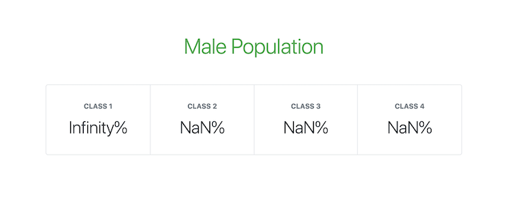
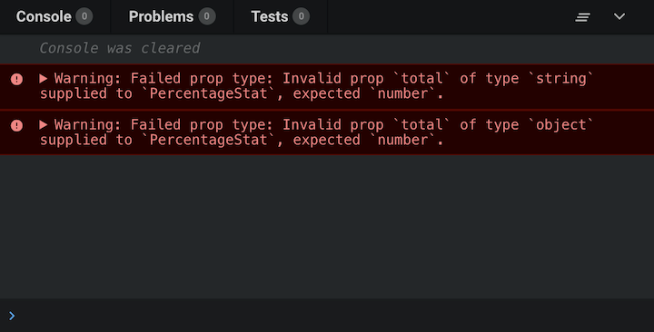
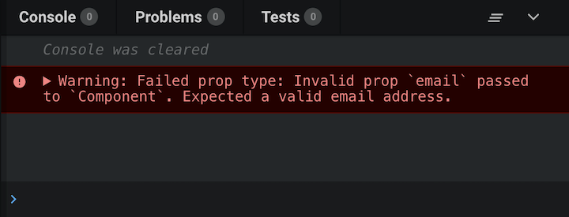

# [Type Checking with PropTypes](https://www.theodinproject.com/lessons/node-path-react-new-type-checking-with-proptypes)

## Introduction

Type Checking is a process of verifying that a piece of code is using the correct data types for variables, function parameters and return values. In the context of React applications, we are going to use PropTypes to do that job.

PropTypes is a way to type check the props that a React component receives. It helps to catch potential type errors during development, making it easier to spot and fix bugs. If you have used a linter in your previous React project, there's a good chance it ended up yelling at you about certain props missing in prop validation, however if that isn't the case- well, lucky you!

<br>

## Lesson overview

This section contains a general overview ot topics that you will learn in this lesson.

- Setting up PropTypes

- Using common PropTypes features

<br>

## Getting started

> **Important Note on React Version**
>
> propTypes and defaultProps are discontinued from React version 19. Please use React version lesser than 19 to follow this lesson:
>
> 1. Set up React with Vite as usual. It does not matter whether you run `npm install` here or not.
>
> 2. Change the versions for the following four packages in `package.json` to `"^18"`.
>
>    - `react`
>    - `react-dom`
>    - `@types/react`
>    - `@types/react-dom`
>
> 3. Run `npm install`.

To start using PropTypes in our React projects, we first need to install the corresponding library. We can do that with `npm`. In your React project run the following command:

```js
npm install --save prop-types
```

Next, we want to import the PropTypes package in the component whose props we want to validate.

```js
import PropTypes from 'prop-types'
```

<br>

### Using propTypes

Here is a very basic example of how we would use it in a component that renders out a name prop.

```js
import PropTypes from 'prop-types'

const RenderName = (props) => {
	return <div>{props.name}</div>
}

RenderName.propTypes = {
	name: PropTypes.string,
}

export default RenderName
```

In this example, the component RenderName expects to receive a prop called `name` which is a string. If this props is not a string, a warning will be displayed. If you want to make sure a prop is being passed in, use isRequired like so:

```js
RenderName.propTypes = {
	name: PropTypes.string.isRequired,
}
```

<br>

### Using defaultProps

Another cool thing we can do in combination with PropTypes is passing in default props:

```js
import PropTypes from 'prop-types'

const RenderName = (props) => {
	return <div>{props.name}</div>
}

RenderName.propTypes = {
	name: PropTypes.string,
}

RenderName.defaultProps = {
	name: 'Zach',
}

export default RenderName
```

In this example, with the help of the defaultProps property we are defining a default value for the `name` prop. This way, if the `RenderName` component is called without passing in the `name` prop, it will default to "Zach". When you do pass in props, they will take precedence over the default props.

<br>

### What about TypeScript?

Now is also a good time to mention TypeScript - a strongly typed language that builds on JavaScript. We do not cover it in our curriculum and thus do not recommend looking into it now, but in the future, it may be worth learning if you'd like more type safety while writing your code.

Learning TypeScript can be a lot of overhead when you're already learning React and the best way to prepare for this is to continue developing your JavaScript fundamentals. The TypeScript documentation encourages enhancing JavaScript skills before tackling TypeScript complexities, as highlighted in the discussion on the importance of JavaScript fundamentals. In the future, however, if you decide to go in the direction of learning TypeScript, our recommendation would be picking up a previous project and refactoring the components one by one to TypeScript.

<br>

## Knowledge Check

- **How would we set up a basic implementation of PropTypes?**

```js
import PropTypes from 'prop-types'

const RenderName = (props) => {
	return <div>{props.name}</div>
}

RenderName.propTypes = {
	name: PropTypes.string,
}

export default RenderName
```

<br>

- **If we pass in a prop to a component that has a defaultProp defined, what would happen?**

If we pass in a prop to a component that has a defaultProp defined, it will use that prop instead of the defaultProp.

<br>

- **What is the difference between PropTypes and TypeScript?**

The core difference between PropTypes and TypeScript, when it comes to type-checking, lies in when the type-checking occurs:

**PropTypes (Runtime Type-Checking):**

- PropTypes performs type validation at runtime, meaning the checks happen while your application is actively running in the browser.

- If a prop receives a value of an incorrect type, PropTypes will issue a warning in the browser's developer console during execution.

- It's a lightweight solution built into React, primarily used for validating props passed to React components.

**TypeScript (Compile-Time Type-Checking)**

- TypeScript performs type validation at compile-time, which means the checks occur before your code is executed, during the compilation process from TypeScript to JavaScript.

- If a type mismatch or error is detected, TypeScript will prevent the code from compiling and will report the error, often leading to build failures if not addressed.

- TypeScript is a superset of JavaScript that adds static typing, offering a more robust and comprehensive type system for entire applications, not just component props.

**In essence:**

- PropTypes catches type errors during execution, providing warnings.

- TypeScript catches type errors before execution, preventing compilation and ensuring type safety at an earlier stage of development.

<hr>
<br>
<br>

# [Typechecking with PropTypes](https://legacy.reactjs.org/docs/typechecking-with-proptypes.html)

> **Note:**
>
> `React.PropTypes` has moved into a different package since React v15.5. Please use the prop-types library instead.
>
> We provide a codemod script to automate the conversion.

As your app grows, you can catch a lot of bugs with typechecking. For some applications, you can use JavaScript extensions like Flow or TypeScript to typecheck your whole application. But even if you don't use those, React has some built-in typechecking abilities. To run typechecking on the props for a component, you can assign the special `propTypes` property:

```js
import PropTypes from 'prop-types'

class Greeting extends React.Component {
	render() {
		return <h1>Hello, {this.props.name}</h1>
	}
}

Greeting.propTypes = {
	name: PropTypes.string,
}
```

In this example, we are using a class component, but the same functionality could also be applied to function components, or components created by `React.memo` or `React.forwardRef`.

`PropTypes` exports a range of validators that can be used to make sure the data you receive is valid. In this example, we're using `PropTypes.string`. When an invalid value is provided for a prop, a warning will be shown in the JavaScript console. For performance reasons, `propTypes` is only checked in development mode.

<br>

## PropTypes

Here is an example documenting the different validators provided:

```js
import PropTypes from 'prop-types'

MyComponent.propTypes = {
	// You can declare that a prop is a specific JS type.
	// By default, these are all optional.
	optionalArray: PropTypes.array,
	optionalBool: PropTypes.bool,
	optionalFunc: PropTypes.func,
	optionalNumber: PropTypes.number,
	optionalObject: PropTypes.object,
	optionalString: PropTypes.string,
	optionalSymbol: PropTypes.symbol,

	// Anything that can be rendered: numbers, strings, elements
	// or an array (or fragment) containing these types.
	optionalNode: PropTypes.node,

	// A React element.
	optionalElement: PropTypes.element,

	// A React element type (ie. MyComponent).
	optionalElementType: PropTypes.elementType,

	// You can also declare that a prop is an instance of a class
	// This uses JS's instanceof operator
	optionalMessage: PropTypes.instanceOf(Message),

	// You can ensure that your prop is limited to specific values by treating
	// it as an enum.
	optionalEnum: PropTypes.oneOf(['News', 'Photos']),

	// An object that could be one of many types
	optionalUnion: PropTypes.oneOfType([
		PropTypes.string,
		PropTypes.number,
		PropTypes.instanceOf(Message),
	]),

	// An array of a certain type
	optionalArrayOf: PropTypes.arrayOf(PropTypes.number),

	// An object with property values of a certain type
	optionalObjectOf: PropTypes.objectOf(PropTypes.number),

	// An object taking on a particular shape
	optionalObjectWithShape: PropTypes.shape({
		color: PropTypes.string,
		fontSize: PropTypes.number,
	}),

	// An object with warnings on extra properties
	optionalObjectWithStrictShape: PropTypes.exact({
		name: PropTypes.string,
		quantity: PropTypes.number,
	}),

	// You can chain any of the above with `isRequired` to make sure a warning
	// is shown if the prop isn't provided.
	requiredFun: PropTypes.func.isRequired,

	// A required value of any data type
	requiredAny: PropTypes.any.isRequired,

	// You can also specify a custom validator. It should return an Error
	// object if the validation fails. Don't `console.warn` or throw, as this
	// won't work inside `oneOfType`.
	customProp: function (props, propName, componentName) {
		if (!/matchme/.test(props[propName])) {
			return new Error(
				'Invalid prop `' +
					propName +
					'` supplied to' +
					' `' +
					componentName +
					'`. Validation failed.'
			)
		}
	},

	// You can also supply a custom validator to `arrayOf` and `objectOf`.
	// It should return an Error object if the validation fails.
	// The validator will be called for each key in the array or object.
	// The first two arguments of the validator are the array or object itself,
	// and the current item's key.
	customArrayProp: PropTypes.arrayOf(function (
		propValue,
		key,
		componentName,
		location,
		propFullName
	) {
		if (!/matchme/.test(propValue[key])) {
			return new Error(
				'Invalid prop `' +
					propFullName +
					'` supplied to' +
					' `' +
					componentName +
					'`. Validation failed.'
			)
		}
	}),
}
```

<br>

## Requiring Single Child

With `PropTypes.element` you can specify that only a single child can be passed to a component as children.

```js
import PropTypes from 'prop-types'

class MyComponent extends React.Component {
	render() {
		// This must be exactly one element or it will warn
		const children = this.props.children
		return <div>{children}</div>
	}
}

MyComponent.propTypes = {
	children: PropTypes.element.isRequired,
}
```

<br>

## Default Prop Values

You can define default values for your `props` by assigning to the special `defaultProps` property:

```js
class Greeting extends React.Component {
	render() {
		return <h1>Hello, {this.props.name}</h1>
	}
}

// Specifies the default values for props:
Greeting.defaultProps = {
	name: 'Stranger',
}

// Renders "Hello, Stranger"
const root = ReactDOM.createRoot(document.getElementById('example'))
root.render(<Greeting />)
```

Since ES2022 you can also declare `defaultProps` as static property within a React component class. For more information, see the [class public static fields](https://developer.mozilla.org/en-US/docs/Web/JavaScript/Reference/Classes/Public_class_fields#public_static_fields). This modern syntax will require a compilation step to work within older browsers.

```js
class Greeting extends React.Component {
	static defaultProps = {
		name: 'stranger',
	}

	render() {
		return <div>Hello, {this.props.name}</div>
	}
}
```

The `defaultProps` will be used to ensure that `this.props.name` will have a value if it was not specified by the parent component. The `propTypes` typechecking happens after `defaultProps` are resolved, so typechecking will also apply to the `defaultProps`.

<br>

## Function Components

If you are using function components in your regular development, you may want to make some small changes to allow PropTypes to be properly applied.

Let's say you have a component like this:

```js
export default function HelloWorldComponent({ name }) {
	return <div>Hello, {name}</div>
}
```

To add PropTypes, you may want to declare the component in a separate function before exporting, like this:

```js
function HelloWorldComponent({ name }) {
	return <div>Hello, {name}</div>
}

export default HelloWorldComponent
```

Then, you can add PropTypes directly to the `HelloWorldComponent`:

```js
import PropTypes from 'prop-types'

function HelloWorldComponent({ name }) {
	return <div>Hello, {name}</div>
}

HelloWorldCompoment.propTypes = {
	name: PropTypes.string,
}

export default HelloWorldComponent
```

<hr>
<br>
<br>

# [How to validate React props using PropTypes](https://blog.logrocket.com/validate-react-props-proptypes/)

Props and PropTypes are important mechanisms for passing read-only attributes between React components.

We can use React props, short for properties, to send data from one component to another. If a component receives the wrong type of props, it can cause bugs and unexpected errors in your app.

Since JavaScript doesn't have a built-in type checking solution, many developers use extensions like TypeScript and Flow. However, React has an internal mechanism for props validation called PropTypes. In this article, we'll learn how to validate props with React PropTypes.

<br>

## How do React props work?

With React props, you can send data to a component when you call on that component, including numbers, strings, functions, objects, and arrays. If you have multiple components, you can pass data from one component to another.

To pass props between components, you can add them when the component is called, just like you would pass arguments when calling on a regular JavaScript function.

<br>

## Why should you validate props in React?

When developing a React application, you'll need to structure and define your props to avoid bugs and errors. Just like a function might have mandatory arguments, a React component might require a prop to be defined, otherwise, it will not render properly. Forgetting to pass a required prop into a component that needs it could cause your app to behave unexpectedly.

Consider the code below:

```js
import React from 'react'
import ReactDOM from 'react-dom'

function PercentageStat({ label, score = 0, total = Math.max(1, score) }) {
	return (
		<div>
			<h6>{label}</h6>
			<span>{Math.round((score / total) * 100)}%</span>
		</div>
	)
}

function App() {
	return (
		<div>
			<h1>Male Population</h1>
			<div>
				<PercentageStat label='Class 1' total={360} score={203} />
				<PercentageStat label='Class 2' total={206} />
				<PercentageStat label='Class 3' score={107} />
				<PercentageStat label='Class 4' />
			</div>
		</div>
	)
}

const rootElement = document.getElementById('root')
ReactDOM.render(<App />, rootElement)
```

In the code above, the `PercentageStat` component requires three props to render properly, `label`, `score`, and `total`. Default values are set for the `score` and `total` props in case they are not provided. `PercentageStat` is rendered four times in the `App` component, each time with different props.

The image below shows what the app would look like with some additional Bootstrap styling:


Based on usage, the `label` prop is expected to be a `string`. In the same vein, `score` and `total` are required to be `numeric` values since they are used for computing `percent`. In addition, `total` is expected to never be `0` since it is being used as a divisor.

The code below shows a modified app that renders `PercentageStat` components with invalid props:

```js
function App() {
	return (
		<div>
			<h1>Male Population</h1>
			<div>
				<PercentageStat label='Class 1' total='0' score={203} />
				<PercentageStat label='Class 2' total={0} />
				<PercentageStat label='Class 3' score={(f) => f} />
				<PercentageStat label='Class 4' total={{}} score='0' />
			</div>
		</div>
	)
}
```

Now, the app view looks like the following image:



<br>

## Using PropTypes in React

PropTypes is React's internal mechanism for adding type checking to component props. React components use a special property called `propTypes` to set up type checking:

```js
/*
 * Function Components
 */
function ReactComponent(props) {
	// ... implement render logic here
}

ReactComponent.propTypes = {
	// ... prop type definitions here
}

/*
 * Class Components: Method 1
 */
class ReactComponent extends React.Component {
	// ... component class body here
}

ReactComponent.propTypes = {
	// ... prop type definitions here
}

/*
 * Class Components: Method 2
 * Using the `static` class properties syntax
 */
class ReactComponent extends React.Component {
	// ... component class body here

	static propTypes = {
		// ... prop type definitions here
	}
}
```

When props are passed to a React component, they are checked against the type definitions configured in the `propTypes` property. When an invalid value is passed for a prop, a warning is displayed on the JavaScript console:



If default props are set for the React component, the values are first resolved before type checking against `propTypes`. Therefore, default values are also subject to the prop type definitions.

Keep in mind that type checking `propTypes` can happen only in development mode, enabling you to catch bugs in your React application before releasing it to the production environment.

<br>

## Using the `prop-types` library in React

Prior to React v15.5.0, a utility called `PropTypes` was available as part of the React package, which provided a lot of validators for configuring type definitions for component props. You could access it with `React.PropTypes`.

However, in later versions of React, this utility has been moved to a separate package called `prop-types`. To get access to the `PropTypes` utility, you need to add `prop-types` as a dependency for your project:

```
npm install prop-types --save
```

You can import it into your project files as follows:

```
import PropTypes from 'prop-types'
```

To learn more about how you can use `prop-types` and how it differs from using `React.PropTypes` and all the available validators, check out the [official `prop-types` documentation](https://github.com/facebook/prop-types/blob/main/README.md).

<br>

## React PropTypes validators

The `PropTypes` utility exports a wide range of validators for configuring type definitions. Below, we'll list the available validators for basic, renderable, instance, multiple, collection, and required prop types.

<br>

## Basic types

Below are the validators for the basic data types:

- `PropTypes.any`: The prop can be of any data type

- `PropTypes.bool`: The prop should be a Boolean

- `PropTypes.number`: The prop should be a number

- `PropTypes.string`: The prop should be a string

- `PropTypes.func`: The prop should be a function

- `PropTypes.array`: The prop should be an array

- `PropTypes.object`: The prop should be an object

- `PropTypes.symbol`: The prop should be a symbol

```js
Component.propTypes = {
	anyProp: PropTypes.any,
	booleanProp: PropTypes.bool,
	numberProp: PropTypes.number,
	stringProp: PropTypes.string,
	functionProp: PropTypes.func,
	arrayProp: PropTypes.array,
	objectProp: PropTypes.object,
	symbolProp: PropTypes.symbol,
}
```

<br>

## Renderable types

PropTypes also exports the following validators to ensure that React can render **the value passed to a prop.**

- `PropTypes.node`: The prop should be anything that React can render, like a number, string, element, array, or fragment containing these types.

- `PropTypes.element`: The prop should be a React element.

```js
Component.propTypes = {
	nodeProp: PropTypes.node,
	elementProp: PropTypes.element,
}
```

One common use for the `PropTypes.element` validator is ensuring that a component has a single child. If the component has no children or multiple children, a warning is displayed on the JavaScript console:

```js
Component.propTypes = {
	children: PropTypes.element.isRequired,
}
```

<br>

## Instance types

In cases where you require a prop to be an instance of a particular JavaScript class, you can use the `PropTypes.instanceOf` validator, which leverages the underlying JavaScript `instanceof` operator:

```js
Component.propTypes = {
	personProp: PropTypes.instanceOf(Person),
}
```

<br>

## Multiple types

PropTypes also exports validators that can allow a limited set of values or multiple sets of data types for a prop.

- `PropTypes.oneOf`: The prop is limited to a specified set of values, treating it like an enum

- `PropTypes.oneOfType`: The prop should be one of a specified set of types, behaving like a union of types

```js
Component.propTypes = {
	enumProp: PropTypes.oneOf([true, false, 0, 'unknown']),

  unionProp.PropTypes.oneOfType([
    PropType.bool,
    PropType.number,
    PropType.string,
    PropType.instanceOf(Person),
  ])
}
```

<br>

## Collection types

In addition to the `PropTypes.array` and `PropTypes.object` validators, `PropTypes` also provides validators for more fine-tuned validation of arrays and objects.

<br>

### `PropTypes.arrayOf`

`PropTypes.arrayOf` ensures that the prop is an array in which all items match the specified type:

```js
Component.propTypes = {
	peopleArrayProp: PropTypes.arrayOf(PropTypes.instanceOf(Person)),

	multipleArrayProp: PropTypes.arrayOf(
		PropTypes.oneOfType([PropType.number, PropType.string])
	),
}
```

<br>

### `PropTypes.objectOf`

`PropTypes.objectOf` ensures that the prop is an object in which all property values match the specified type:

```js
Component.propTypes = {
	booleanObjectProp: PropTypes.objectOf(PropTypes.bool),

	multipleObjectProp: PropTypes.objectOf(
		PropTypes.oneOfType([
			PropType.func,
			PropType.number,
			PropType.string,
			PropType.instanceOf(Person),
		])
	),
}
```

<br>

### `PropTypes.shape`

When a more detailed validation of an object prop is required, you can use `PropTypes.shape`. It ensures that the prop is an object that contains a set of specified keys with values of the specified types:

```js
Component.propTypes = {
	profileProp: PropTypes.shape({
		id: PropTypes.number,
		fullname: PropTypes.string,
		gender: PropTypes.oneOf(['M', 'F']),
		birthdate: PropTypes.instanceOf(Date),
		isAuthor: PropTypes.bool,
	}),
}
```

<br>

### `PropTypes.exact`

For strict or exact object matching, `PropTypes.exact` will give warnings if extra properties exist in a component:

```js
Component.propTypes = {
	subjectScoreProp: PropTypes.exact({
		subject: PropTypes.oneOf(['Math', 'Arts', 'Science']),
		score: PropTypes.number,
	}),
}
```

<br>

### Required types

so far, all the `PropTypes` validators we've explored allow for the prop to be optional. However, you can chain `isRequired` to any prop validator to ensure that a warning is shown whenever the prop is not provided:

```js
Component.propTypes = {
	requiredAnyProp: PropTypes.any.isRequired,
	requiredFunctionProp: PropTypes.func.isRequired,
	requiredSingleElementProp: PropTypes.element.isRequired,
	requiredPersonProp: PropTypes.instanceOf(Person),
	requiredEnumProp: PropTypes.oneOf(['Read', 'Write']).isRequired,

	requiredShapeObjectProp: PropTypes.shape({
		title: PropTypes.string.isRequired,
		date: PropTypes.instanceOf(Date).isRequired,
		isRecent: PropTypes.bool,
	}).isRequired,
}
```

<br>

## Custom validators for type checking React props

Usually, you need to define some custom validation logic for component props, for example, to ensure that a prop is passed a valid email address. `prop-types` allows you to define custom validation functions that you can use for type checking props.

<br>

### Basic custom validators

The custom validation function takes three arguments:

- `props`: An object containing all the props passed to the component

- `propName`: The name of the prop to be validated

- `componentName`: The name of the component

If the validation fails, it should return an `Error` object. The error should not be thrown. Additionally, you shouldn't use `console.warn` inside the custom validation function:

```js
const isEmail = function (props, propName, componentName) {
	const regex =
		/^((([^<>()[]\.,;:s@"]+(.[^<>()[]\.,;:s@"]+)*)|(".+"))@(([[0-9]{1,3}.[0-9]{1,3}.[0-9]{1,3}.[0-9]{1,3}])|(([a-zA-Z-0-9]+.)+[a-zA-Z]{2,})))?$/

  if (!regex.test(props[propName])) {
    return new Error(`Invalid prop `${propName}` passed to `${componentName}`. Expected a valid email address.`)
  }
}

Component.propTypes = {
  email: isEmail,
  fullname: PropTypes.string,
  date: PropTypes.instanceOf(Date)
}
```



You can also use custom validation functions with `PropTypes.oneOfType`. The example below uses the `isEmail` custom validation function from the previous code snippet:

```js
Component.propTypes = {
	email: PropTypes.oneOfType([
		isEmail,
		PropTypes.shape({
			address: isEmail,
		}),
	]),
}
```

The component will be valid in both of these scenarioss:

```jsx
<Component email="glad@me.com" />
<Component email={{address: 'glad@me.com'}} />
```

<br>

### Custom validators and collections

You can also use custom validation functions with `PropTypes.arrayOf` and `PropTypes.objectOf`. When used this way, the custom validation function is called for each key in the array or object.

The custom validation function takes five arguments instead of three:

- `propValue`: The array or object itself

- `key`: The key of the current item in the iteration

- `componentName`: The name of the component

- `location`: The location of the validated data, usually `prop`

- `propFullName`: The fully resolved name of the current item being validated. For an array, this will be `array[index]`; for an object, it will be `object.key`.

Below is a modified version of the `isEmail` custom validation function for use with collection types:

```js
const isEmail = function (
	propValue,
	key,
	componentName,
	location,
	propFullName
) {
	const regex =
		/^((([^<>()[]\.,;:s@"]+(.[^<>()[]\.,;:s@"]+)*)|(".+"))@(([[0-9]{1,3}.[0-9]{1,3}.[0-9]{1,3}.[0-9]{1,3}])|(([a-zA-Z-0-9]+.)+[a-zA-Z]{2,})))?$/

  if (!regex.test(propValue[key])) {
    return new Error(`Invalid prop `${propFullName}` passed to `${componentName}`. Expected a valid email address.`)
  }
}

Component.propTypes = {
  emails: PropTypes.arrayOf(isEmail)
}
```

<br>

### All-purpose custom validators

Taking everything we've learned about custom validation functions into account, let's go ahead and create all-purpose custom validators that we can use as standalone validators as well as with collection types.

We can make the `isEmail` custom validation function an all-purpose validator with just a slight modification. We'll add a `prop` variable that returns either the `propFullName` or the `key`. With this, our custom validator can either be used on its own or with collections:

```js
const isEmail = function (
	propValue,
	key,
	componentName,
	location,
	propFullName
) {
	// Get the resolved prop name based on the validator usage
	const prop = location && propFullName ? propFullName : key

	const regex =
		/^((([^<>()[]\.,;:s@"]+(.[^<>()[]\.,;:s@"]+)*)|(".+"))@(([[0-9]{1,3}.[0-9]{1,3}.[0-9]{1,3}.[0-9]{1,3}])|(([a-zA-Z-0-9]+.)+[a-zA-Z]{2,})))?$/

  if (!regex.test(propValue[key])) {
    return new Error(`Invalid prop `${prop}` passed to `${componentName}`. Expected a valid email address.`)
  }
}

Component.propTypes = {
  email: PropTypes.oneOfType([
    isEmail,
    PropTypes.shape({
      address: isEmail
    })
  ]),
  emais: PropTypes.arrayOf(isEmail)
}
```

<br>

### Validating `PercentageStat` in React

The following code snippet adds prop types to the `PercentageStat` component that we reviewed at the beginning of this tutorial:

```js
import React from 'react'
import PropTypes from 'prop-types'

// The PercentageStat Component
function PercentageStat({ label, score = 0, total = Math.max(1, score) }) {
	return (
		<div>
			<h6>{label}</h6>
			<span>{Math.round((score / total) * 100)}%</span>
		</div>
	)
}

// Checks if a value is numeric
// Either a finite number or a numeric string
function isNumeric(value) {
	const regex = /^(\+|-)?((\d*\.?\d+)|(\d+\.?\d*))$/
	return (
		Number.isFinite(value) || (typeof value === 'string' && regex.test(value))
	)
}

// Checks if value is non-zero
// Value is first converted to a number
function isNonZero(value) {
	return +value !== 0
}

// Takes test functions as arguments and returns a custom validation function
// Each function passed in as argument is expected to take a value argument
// expected to accept a value and return a Boolean if it passes the validation.
// All tests must pass for the custom validator to be marked as passed.
function validatedType(...validators) {
	return function (props, propName, componentName) {
		const value = props[propName]

		const valid = validators.every((validator) => {
			if (typeof validator === 'function') {
				const result = validator(value)
				return typeof result === 'boolean' && result
			}

			return false
		})

		if (!valid) {
			return new Error(
				`Invalid prop \`${propName}\` passed to \`${componentName}\`. Validation failed.`
			)
		}
	}
}

// Set the propTypes for the component
PercentageStat.propTypes = {
	label: PropTypes.string.isRequired,
	score: validatedType(isNumeric),
	total: validatedType(isNumeric, isNonZero),
}
```

<br>

## Conclusion

In this tutorial, we've learned how to improve our React components and ensure that they work as expected using prop types. By validating our props with prop types in our development environment, we can prevent errors and bugs from impacting our application once it is deployed.

If you want to learn more about validating component props in React, I [recommend checking out the docs](https://legacy.reactjs.org/docs/typechecking-with-proptypes.html).

<hr>
<br>
<br>

# [StackOverflow post on differences between PropTypes and TypeScript](https://stackoverflow.com/questions/41746028/proptypes-in-a-typescript-react-application)

> Does using `React.PropTypes` make sense in a TypeScript React Application? Since the component class is declared with a `Props` type parameter:
>
> ```ts
> interface Props {
>   // ...
> }
>
> export class MyComponent extends React.Component<Props, any> {...}
> ```
>
> is there any real benefit to adding
>
> ```ts
> static propTypes {
>   myProp: React.PropTypes.string
> }
> ```
>
> to the class definition?

<br>

TypeScript and PropTypes serve different purposes. Typescript validates types at _compile time_, whereas PropTypes are checked at _runtime_.

TypeScript is useful when you are writing code: it will warn you if you pass an argument of the wrong type of your React components, give you autocomplete for function calls, etc.

PropTypes are useful when you test how the components interact with external data, for example when you load JSON from an API. PropTypes will help you debug (when in React's development mode) why your component is failing by printing helpful messages like:

```
Warning: Failed prop type: Invalid propr `id` of type `number` supplied to `Table`, expected `string`
```

Even though it may seem like TypeScript and PropTypes do the same thing, they don't actually overlap at all. But it is possible to automatically generate PropTypes from TypeScript so that you don't have to specify types twice, see for example:

- https://github.com/milesj/babel-plugin-typescript-to-proptypes

- https://github.com/grncdr/ts-react-loader#what-it-does

- https://github.com/gcanti/prop-types-ts

<br>

There's usually not much value to maintaining both your component props as TypeScript types and `React.PropTypes` at the same time.

Here are some cases where it is useful to do so:

- Publishing a package such as a component library that will be used by plain JavaScript

- Accepting and passing along external input such as results from an API call

- Using data from a library that may not have adequate or accurate typings, if any

Newer verion of TypeScript can now infer types based on your `React.PropTypes` (`PropTypes.InferProps`), but the resulting types can be difficult to use or refer to elsewhere in your code.

```ts
const propTypes = {
	input: PropTypes.shape({
		id: PropTypes.number.isRequired,
		name: PropTypes.string.isRequired,
	}),
}

type MyComponentProps = PropTypes.InferProps<typeof propTypes>

const MyComponent: FunctionComponent<MyComponentProps> = (props) => {
	// ...
}

MyComponent.propTypes = propTypes
```
